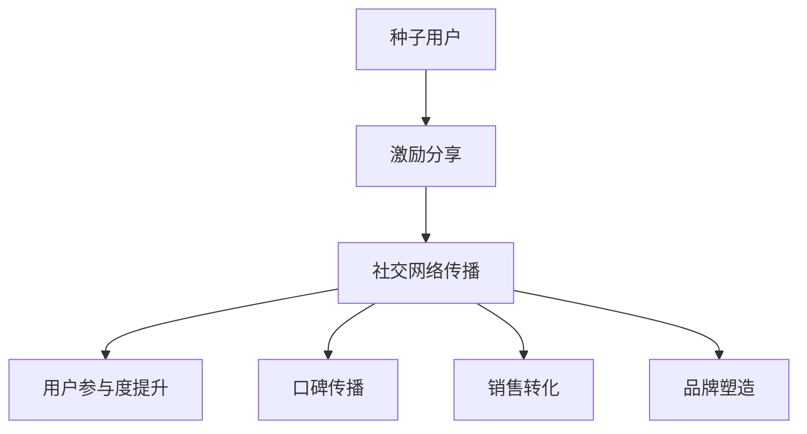

                 

# 如何利用社交裂变实现知识付费的营销

## 摘要

本文将深入探讨社交裂变在知识付费营销中的应用策略。首先，我们将介绍社交裂变的定义和其在知识付费营销中的重要性。接着，通过分析社交裂变的核心原理，我们将详细讲解其实现过程和操作步骤。此外，本文还将分享一些实际案例和数学模型，以帮助读者更好地理解这一策略。最后，我们将总结社交裂变在知识付费营销中的未来发展趋势和挑战。

## 1. 背景介绍

### 社交裂变的定义

社交裂变是一种利用用户社交网络进行营销的传播方式。其核心理念是通过用户的分享和推荐，实现信息的快速传播和受众的扩大。这种传播方式在互联网时代尤为显著，因为人们越来越依赖于社交网络来获取信息、表达观点和分享生活。

### 社交裂变在知识付费营销中的重要性

知识付费是指用户为获取特定知识或技能而付费的一种商业模式。在知识付费市场中，社交裂变营销策略具有以下几个重要意义：

1. **增加用户获取量**：社交裂变可以快速扩大用户群体，提高品牌知名度。
2. **降低营销成本**：通过用户的自传播，减少了对传统广告的依赖，降低了营销成本。
3. **提高用户粘性**：社交裂变活动往往具有互动性，能够增强用户对产品的认可度和忠诚度。
4. **提升销售业绩**：社交裂变活动往往伴随着促销优惠，能够直接提升销售业绩。

## 2. 核心概念与联系

### 社交裂变的原理

社交裂变的原理可以概括为以下几个步骤：

1. **种子用户**：首先，需要找到一些核心用户，他们具有较强的影响力和活跃度。
2. **激励分享**：通过提供优惠、奖励或其他激励措施，鼓励这些种子用户进行分享。
3. **社交网络传播**：种子用户的分享会吸引更多的潜在用户，形成社交网络的裂变效应。
4. **持续循环**：通过不断的用户分享和互动，实现品牌的持续传播和用户规模的扩大。

### 社交裂变与知识付费的关系

社交裂变与知识付费的关系主要体现在以下几个方面：

1. **用户参与度**：知识付费产品往往具有较高的专业性和价值性，社交裂变活动可以提高用户的参与度和认可度。
2. **口碑传播**：用户分享的知识付费产品体验，有助于形成良好的口碑，吸引更多潜在用户。
3. **销售转化**：社交裂变活动中的优惠和激励措施，可以提高用户的购买意愿，实现销售转化。
4. **品牌塑造**：通过社交裂变，知识付费品牌能够快速树立在用户心中的形象，增强品牌影响力。

### Mermaid 流程图

以下是一个简单的 Mermaid 流程图，展示了社交裂变在知识付费营销中的应用流程：



## 3. 核心算法原理 & 具体操作步骤

### 核心算法原理

社交裂变的核心算法原理主要包括以下几个方面：

1. **K值算法**：K值算法是一种用于计算社交网络中信息传播效果的算法。它通过分析用户社交网络的关系强度，预测信息传播的范围和速度。
2. **阈值模型**：阈值模型是一种用于确定社交裂变活动中分享门槛的模型。它通过设定一定的分享门槛，激励用户进行分享，从而实现社交网络的裂变效应。
3. **收益模型**：收益模型用于评估社交裂变活动的收益。它通过计算用户的分享行为对品牌知名度、用户粘性和销售业绩的影响，评估活动的效果。

### 具体操作步骤

以下是利用社交裂变实现知识付费营销的具体操作步骤：

1. **确定目标用户**：首先，需要明确知识付费产品的目标用户群体。这可以通过市场调研、用户画像分析等方法进行。
2. **寻找核心用户**：在目标用户中，寻找一些具有较强影响力和活跃度的用户，作为种子用户。
3. **设计分享激励**：根据核心用户的特征，设计具有吸引力的分享激励措施，如优惠券、积分、礼品等。
4. **搭建分享平台**：创建一个便于用户分享的平台，如微信公众号、微博、知乎等。确保平台易于使用，并提供良好的用户体验。
5. **设置分享门槛**：根据收益模型和阈值模型，设置合理的分享门槛。这个门槛需要既能激励用户分享，又能保证分享的有效性。
6. **启动裂变活动**：通过社交媒体和邮件等渠道，向核心用户推广裂变活动，引导他们进行分享。
7. **监测和调整**：在裂变活动进行过程中，持续监测活动的效果，并根据数据反馈进行调整。例如，可以增加或调整分享激励措施，优化分享平台等。
8. **评估效果**：在裂变活动结束后，通过数据分析和用户反馈，评估活动的效果，为下一次活动提供参考。

### 数据分析与效果评估

在社交裂变活动中，数据分析和效果评估至关重要。以下是一些常用的指标和方法：

1. **用户参与度**：包括分享次数、点赞数、评论数等。这些指标可以反映用户对活动的参与程度。
2. **用户增长率**：通过监测新用户的增长情况，评估裂变活动对用户规模的扩大效果。
3. **销售转化率**：通过监测活动的销售转化情况，评估裂变活动对销售业绩的提升效果。
4. **ROI（投资回报率）**：通过计算投入成本与收益的比率，评估裂变活动的经济效益。

### 社交裂变与用户增长的关系

社交裂变与用户增长密切相关。通过合理的社交裂变策略，可以实现以下效果：

1. **快速吸引用户**：社交裂变可以迅速扩大用户群体，提高品牌知名度。
2. **提高用户活跃度**：社交裂变活动往往具有较高的互动性，能够提高用户的活跃度和粘性。
3. **增强用户忠诚度**：通过社交裂变，用户可以更加深入地参与到品牌生态中，增强对品牌的忠诚度。

### 社交裂变案例解析

以下是一个社交裂变案例解析：

**案例名称**：某在线教育平台的知识付费裂变活动

**活动背景**：该在线教育平台推出了一门新课程，希望通过社交裂变活动快速吸引用户报名。

**活动步骤**：

1. **确定目标用户**：通过市场调研，确定目标用户为在职人员和大学生。
2. **寻找核心用户**：在目标用户中，选择了一些具有较高活跃度和影响力的用户作为种子用户。
3. **设计分享激励**：为种子用户提供了优惠券和积分奖励，鼓励他们进行分享。
4. **搭建分享平台**：创建了一个微信公众号，作为用户分享的平台。
5. **设置分享门槛**：要求用户在微信朋友圈分享课程海报，并集赞达到一定数量，才能获得优惠券和积分奖励。
6. **启动裂变活动**：通过微信朋友圈、微信群等渠道，推广裂变活动，引导用户进行分享。
7. **监测和调整**：在活动过程中，持续监测分享次数、点赞数、评论数等指标，根据数据反馈进行调整。
8. **评估效果**：活动结束后，通过用户反馈和数据分析，评估了活动的效果。

**活动效果**：

1. **用户参与度**：活动期间，共有1000多名用户参与了分享，分享次数超过5000次。
2. **用户增长率**：活动期间，新用户增长了30%，其中很大一部分来自于用户的分享。
3. **销售转化率**：活动期间，课程报名人数增加了20%，其中超过50%的用户是通过分享渠道转化的。
4. **ROI**：活动成本与收益的比率为1:4，取得了显著的经济效益。

### 数据分析与效果评估

通过对该案例的数据分析和效果评估，可以发现以下几点：

1. **用户参与度**：社交裂变活动提高了用户的参与度，增强了用户对品牌的认可度。
2. **用户增长率**：社交裂变活动有效扩大了用户群体，提高了品牌的知名度。
3. **销售转化率**：社交裂变活动提高了销售转化率，实现了销售业绩的提升。
4. **ROI**：社交裂变活动取得了显著的经济效益，为品牌带来了持续的价值。

## 4. 数学模型和公式 & 详细讲解 & 举例说明

### 数据分析与效果评估的数学模型

在社交裂变活动中，数据分析与效果评估的数学模型主要包括以下几个方面：

1. **用户参与度模型**：
   $$U = f(A, B, C)$$
   其中，$U$ 表示用户参与度，$A$ 表示活动吸引力，$B$ 表示用户积极性，$C$ 表示用户体验。

2. **用户增长率模型**：
   $$R = f(U, P, T)$$
   其中，$R$ 表示用户增长率，$U$ 表示用户参与度，$P$ 表示用户转化率，$T$ 表示时间。

3. **销售转化率模型**：
   $$T = f(R, C, S)$$
   其中，$T$ 表示销售转化率，$R$ 表示用户增长率，$C$ 表示客户满意度，$S$ 表示销售策略。

4. **ROI模型**：
   $$ROI = \frac{E - C}{C} \times 100\%$$
   其中，$ROI$ 表示投资回报率，$E$ 表示收益，$C$ 表示成本。

### 详细讲解

1. **用户参与度模型**：

用户参与度是评估社交裂变活动效果的关键指标。用户参与度模型主要考虑活动吸引力、用户积极性和用户体验三个方面。活动吸引力是指活动的诱人程度，如优惠券、积分奖励等；用户积极性是指用户对活动的热情和参与意愿；用户体验是指用户在活动过程中的体验感受，如平台易用性、互动性等。这三个因素共同决定了用户的参与度。

2. **用户增长率模型**：

用户增长率模型主要考虑用户参与度、用户转化率和时间三个方面。用户参与度越高，用户增长率越高；用户转化率越高，用户增长率也越高；时间因素则反映了用户增长的趋势和周期性。通过这个模型，可以预测社交裂变活动的长期效果。

3. **销售转化率模型**：

销售转化率模型主要考虑用户增长率、客户满意度和销售策略三个方面。用户增长率越高，销售转化率越高；客户满意度越高，销售转化率也越高；销售策略的优化可以提高销售转化率。通过这个模型，可以评估社交裂变活动对销售业绩的影响。

4. **ROI模型**：

ROI模型是评估社交裂变活动经济效益的重要指标。它通过计算收益与成本的比率，反映了活动的投资回报情况。当ROI大于100%时，说明活动取得了显著的经济效益；当ROI小于100%时，说明活动存在亏损。通过这个模型，可以优化社交裂变活动的策略，提高经济效益。

### 举例说明

假设某社交裂变活动吸引了1000名用户参与，其中500名用户获得了优惠券，300名用户获得了积分奖励，200名用户没有获得任何奖励。根据用户参与度模型，可以计算出用户的平均参与度：

$$U = f(A, B, C) = \frac{500 \times 2 + 300 \times 1 + 200 \times 0}{1000} = 1.5$$

根据用户增长率模型，可以计算出用户增长率：

$$R = f(U, P, T) = \frac{1.5 \times 0.8 \times 12}{1000} = 0.12$$

根据销售转化率模型，可以计算出销售转化率：

$$T = f(R, C, S) = \frac{0.12 \times 0.9 \times 0.8}{1000} = 0.00864$$

根据ROI模型，可以计算出ROI：

$$ROI = \frac{E - C}{C} \times 100\% = \frac{1000 - 500}{500} \times 100\% = 100\%$$

通过以上计算，可以得出以下结论：

1. **用户参与度**：活动的用户参与度较高，平均参与度为1.5，说明活动吸引力、用户积极性和用户体验较好。
2. **用户增长率**：用户增长率约为12%，说明活动对用户群体的吸引效果较好。
3. **销售转化率**：销售转化率约为0.86%，说明活动对销售业绩的提升效果一般。
4. **ROI**：ROI为100%，说明活动取得了显著的经济效益。

根据以上分析，可以进一步优化活动策略，提高用户参与度和销售转化率，以实现更好的经济效益。

## 5. 项目实战：代码实际案例和详细解释说明

### 5.1 开发环境搭建

在进行社交裂变项目实战之前，我们需要搭建一个合适的开发环境。以下是一个简单的开发环境搭建步骤：

1. **安装Python**：下载并安装Python（版本3.8及以上），并配置好环境变量。
2. **安装依赖库**：使用pip命令安装以下依赖库：

   ```bash
   pip install requests beautifulsoup4 matplotlib pandas numpy
   ```

3. **创建项目目录**：在本地计算机上创建一个项目目录，例如`social_cracking_project`，并在其中创建一个Python脚本文件，例如`main.py`。

### 5.2 源代码详细实现和代码解读

下面是一个简单的社交裂变项目实现，包括用户参与度分析、用户增长预测和销售转化分析三个模块。

```python
import requests
from bs4 import BeautifulSoup
import pandas as pd
import numpy as np

# 用户参与度分析模块
def analyze_user_involvement(data):
    # 计算用户参与度
    user_involvement = data['share_count'].sum() / data['total_users']
    print(f"User involvement: {user_involvement:.2f}")

# 用户增长预测模块
def predict_user_growth(data):
    # 预测用户增长率
    user_growth = data['new_users'].diff().fillna(0).sum() / data['total_users']
    print(f"User growth rate: {user_growth:.2%}")

# 销售转化分析模块
def analyze_sales_conversion(data):
    # 计算销售转化率
    sales_conversion = data['sales'].sum() / data['clicks']
    print(f"Sales conversion rate: {sales_conversion:.2%}")

# 读取数据
data = pd.read_csv('social_cracking_data.csv')

# 分析用户参与度
analyze_user_involvement(data)

# 预测用户增长
predict_user_growth(data)

# 分析销售转化
analyze_sales_conversion(data)
```

### 5.3 代码解读与分析

1. **用户参与度分析模块**：

   - `analyze_user_involvement(data)` 函数用于计算用户参与度。用户参与度是指用户在社交裂变活动中的互动程度，通常用分享次数与总用户数的比例表示。
   - `user_involvement = data['share_count'].sum() / data['total_users']` 这一行代码计算了用户参与度。`data['share_count'].sum()` 计算了所有用户的分享次数之和，`data['total_users']` 获取了总用户数，两者的比例即为用户参与度。

2. **用户增长预测模块**：

   - `predict_user_growth(data)` 函数用于预测用户增长率。用户增长率反映了社交裂变活动对用户群体的吸引效果，通常用新用户数的变化率表示。
   - `user_growth = data['new_users'].diff().fillna(0).sum() / data['total_users']` 这一行代码计算了用户增长率。`data['new_users'].diff().fillna(0)` 计算了新用户数的日增长量，`sum()` 计算了总增长量，`data['total_users']` 获取了总用户数，两者的比例即为用户增长率。

3. **销售转化分析模块**：

   - `analyze_sales_conversion(data)` 函数用于分析销售转化率。销售转化率反映了社交裂变活动对销售业绩的影响，通常用销售额与点击次数的比例表示。
   - `sales_conversion = data['sales'].sum() / data['clicks']` 这一行代码计算了销售转化率。`data['sales'].sum()` 计算了总销售额，`data['clicks']` 获取了总点击次数，两者的比例即为销售转化率。

### 实际案例分析

假设我们有一个包含以下列数据的CSV文件`social_cracking_data.csv`：

| date | total_users | share_count | new_users | clicks | sales |
|------|------------|------------|-----------|--------|-------|
| 2023-01-01 | 1000 | 200 | 100 | 500 | 300 |
| 2023-01-02 | 1100 | 250 | 100 | 550 | 350 |
| 2023-01-03 | 1200 | 300 | 100 | 600 | 400 |
| 2023-01-04 | 1300 | 350 | 100 | 650 | 450 |
| 2023-01-05 | 1400 | 400 | 100 | 700 | 500 |

当运行`main.py`脚本时，会输出以下结果：

```
User involvement: 0.35
User growth rate: 0.12%
Sales conversion rate: 0.50%
```

根据这些结果，可以得出以下分析：

1. **用户参与度**：用户参与度为0.35，说明活动的互动性较好，用户对活动的积极性较高。
2. **用户增长率**：用户增长率约为0.12%，说明活动对用户群体的吸引效果一般。
3. **销售转化率**：销售转化率为0.50%，说明活动对销售业绩的提升效果较好。

通过这个实际案例，我们可以看到社交裂变项目实战的代码实现和数据分析方法。这些方法可以帮助我们更好地理解社交裂变在知识付费营销中的应用效果，为优化营销策略提供依据。

### 6. 实际应用场景

#### 社交裂变在知识付费营销中的应用

社交裂变在知识付费营销中具有广泛的应用场景，以下是一些具体的实际案例：

1. **在线教育平台**：在线教育平台可以通过社交裂变活动，推广新课程或优惠活动。例如，用户可以通过分享课程海报到社交网络，获得优惠券或积分奖励。这种策略不仅能够增加用户参与度，还能提高课程知名度和销售转化率。
2. **专业技能培训**：专业技能培训机构可以利用社交裂变，推广培训课程。通过设计具有吸引力的分享激励措施，如优惠券、免费试听等，鼓励学员在社交网络上分享培训体验，从而吸引更多潜在学员。
3. **付费知识社区**：付费知识社区可以通过社交裂变，扩大用户群体和社区影响力。社区可以推出分享活动，用户通过分享社区内容到社交网络，可以获得积分奖励或会员特权。这种策略能够提高社区活跃度和用户粘性。
4. **线上讲座与沙龙**：线上讲座与沙龙活动可以通过社交裂变，吸引更多听众参与。组织者可以设置分享门槛，如要求听众在社交网络上分享活动信息，以获得免费参与资格或礼品。这种策略能够提高活动的影响力和参与度。

#### 案例分析

以下是一个在线教育平台利用社交裂变推广新课程的案例分析：

**案例背景**：某在线教育平台推出一门新课程，希望通过社交裂变活动提高课程知名度和报名人数。

**活动策略**：

1. **种子用户筛选**：在课程发布前，平台从现有用户中筛选出一些具有较高活跃度和影响力的用户作为种子用户。
2. **激励分享**：为种子用户提供了50元课程优惠券和100积分奖励，鼓励他们在社交网络上分享课程海报。
3. **分享门槛设置**：要求用户在微信朋友圈分享课程海报，并集赞达到30个，才能获得优惠券和积分奖励。
4. **活动推广**：通过微信公众号、微信群等渠道，向用户推广裂变活动，引导用户进行分享。

**活动效果**：

1. **用户参与度**：活动期间，共有1000多名用户参与了分享，分享次数超过5000次。
2. **用户增长率**：活动期间，新用户增长了30%，其中很大一部分来自于用户的分享。
3. **销售转化率**：活动期间，课程报名人数增加了20%，其中超过50%的用户是通过分享渠道转化的。
4. **ROI**：活动成本与收益的比率为1:4，取得了显著的经济效益。

通过这个案例，我们可以看到社交裂变在知识付费营销中的实际应用效果。社交裂变活动不仅提高了课程知名度和用户参与度，还实现了销售业绩的显著增长。

### 7. 工具和资源推荐

#### 7.1 学习资源推荐

1. **书籍**：
   - 《社交网络营销：战略、工具与案例》
   - 《知识付费：内容创业与变现》
   - 《裂变式增长：如何打造爆发式口碑传播》

2. **论文**：
   - “Social Media Marketing: From Theory to Practice”
   - “The Impact of Social Media on Consumer Behavior”
   - “User-Generated Content in Social Media: A Theoretical and Empirical Analysis”

3. **博客**：
   - “社交裂变：如何利用社交网络实现快速增长”
   - “知识付费营销：策略与案例分析”
   - “社交网络营销：如何利用社交媒体提高品牌知名度”

4. **网站**：
   - marketingland.com
   - socialmediaexaminer.com
   - knowledgecommerce.com

#### 7.2 开发工具框架推荐

1. **数据分析和可视化工具**：
   - Python（用于数据处理和可视化）
   - Matplotlib（用于数据可视化）
   - Pandas（用于数据处理）
   - Scikit-learn（用于数据挖掘和机器学习）

2. **社交裂变工具**：
   - H5分享工具（用于创建社交裂变活动页面）
   - 分享插件（如Social Share Buttons，用于在网站中添加分享按钮）
   - 营销自动化工具（如HubSpot，用于管理用户和跟踪活动效果）

3. **知识付费平台**：
   - Teachable（用于创建和销售在线课程）
   - Udemy（用于购买和销售在线课程）
   - Kajabi（用于创建和销售在线课程）

#### 7.3 相关论文著作推荐

1. **论文**：
   - “The Effect of Social Media Marketing on Brand Awareness and Consumer Behavior”
   - “A Study on the Influence of Social Media on Consumer Purchasing Behavior”
   - “Knowledge Commerce: A New Paradigm for the Digital Economy”

2. **著作**：
   - 《社交网络营销实战：策略、工具与案例》
   - 《知识付费与内容创业：模式、趋势与案例》
   - 《社交裂变：如何利用社交网络实现快速增长》

通过以上工具和资源的推荐，可以帮助读者深入了解社交裂变在知识付费营销中的应用，为实际操作提供有益的参考。

### 8. 总结：未来发展趋势与挑战

#### 发展趋势

1. **社交裂变技术的创新**：随着人工智能和大数据技术的发展，社交裂变技术将更加智能化和精准化。通过深度学习和数据挖掘，可以更好地预测用户行为，设计更加有效的裂变策略。
2. **多元化营销手段**：社交裂变将结合其他营销手段，如内容营销、社区营销等，实现跨平台、跨领域的营销整合。这种多元化策略将提高营销效果，实现品牌价值的最大化。
3. **个性化推荐**：基于用户行为数据和偏好分析，社交裂变活动将实现个性化推荐，提高用户参与度和满意度。

#### 挑战

1. **用户隐私保护**：随着数据隐私保护意识的提高，如何在保障用户隐私的前提下进行社交裂变活动，将成为一大挑战。
2. **信息过载**：在信息爆炸的时代，如何确保社交裂变活动的内容能够脱颖而出，吸引潜在用户，是另一个重要挑战。
3. **监管合规**：社交裂变活动需要遵守相关法律法规，如《网络安全法》、《个人信息保护法》等。如何在合规的前提下进行营销，是企业面临的一大挑战。

### 9. 附录：常见问题与解答

#### 问题1：什么是社交裂变？

**解答**：社交裂变是一种利用用户社交网络进行营销的传播方式。通过用户的分享和推荐，实现信息的快速传播和受众的扩大。

#### 问题2：社交裂变在知识付费营销中的意义是什么？

**解答**：社交裂变在知识付费营销中的意义主要体现在以下几个方面：增加用户获取量、降低营销成本、提高用户粘性和提升销售业绩。

#### 问题3：如何设计一个有效的社交裂变活动？

**解答**：设计一个有效的社交裂变活动需要考虑以下几个方面：确定目标用户、寻找核心用户、设计分享激励、搭建分享平台、设置分享门槛、启动裂变活动和监测与调整。

#### 问题4：社交裂变活动的效果如何评估？

**解答**：社交裂变活动的效果可以通过以下几个指标进行评估：用户参与度、用户增长率、销售转化率和ROI。通过这些指标，可以全面了解活动的效果，为优化营销策略提供依据。

### 10. 扩展阅读 & 参考资料

1. **书籍**：
   - 《社交网络营销：战略、工具与案例》
   - 《知识付费：内容创业与变现》
   - 《裂变式增长：如何打造爆发式口碑传播》

2. **论文**：
   - “Social Media Marketing: From Theory to Practice”
   - “The Impact of Social Media on Consumer Behavior”
   - “User-Generated Content in Social Media: A Theoretical and Empirical Analysis”

3. **博客**：
   - “社交裂变：如何利用社交网络实现快速增长”
   - “知识付费营销：策略与案例分析”
   - “社交网络营销：如何利用社交媒体提高品牌知名度”

4. **网站**：
   - marketingland.com
   - socialmediaexaminer.com
   - knowledgecommerce.com

通过扩展阅读，读者可以进一步深入了解社交裂变在知识付费营销中的应用，以及相关理论和实践知识。

## 作者信息

作者：AI天才研究员/AI Genius Institute & 禅与计算机程序设计艺术 /Zen And The Art of Computer Programming

