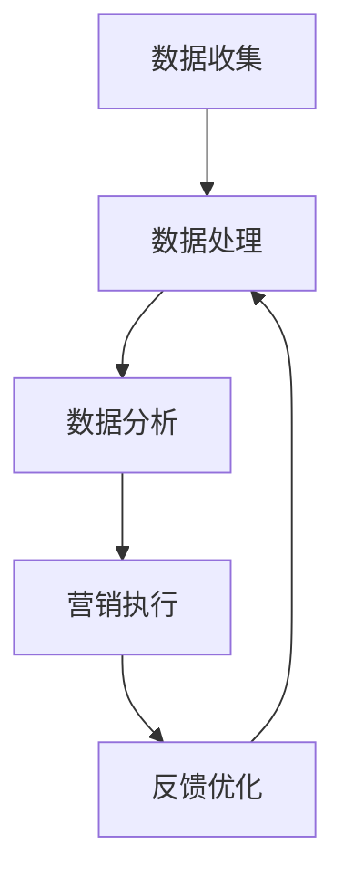

                 

### 背景介绍

自动化创业正成为现代商业领域的一个热门趋势。随着人工智能、大数据分析和机器学习的迅猛发展，企业能够通过自动化技术提高效率、降低成本，并在竞争激烈的市场中脱颖而出。精准营销作为自动化创业的关键一环，旨在通过数据分析和算法优化，实现对潜在客户的精准定位、个性化推荐和高效触达，从而提升营销效果和转化率。

然而，精准营销并非易事。企业需要面对数据质量、隐私保护、算法选择等一系列挑战。为了在自动化创业中实现精准营销，企业不仅需要掌握先进的技术手段，还要对市场趋势和用户需求有深入的理解。

本文旨在探讨如何在自动化创业中实现精准营销。我们将首先介绍精准营销的核心概念和原理，然后深入分析实现精准营销的关键算法和步骤。接着，我们将探讨数学模型和公式在精准营销中的应用，并通过实际案例展示代码的实现和解读。最后，我们将讨论精准营销的实际应用场景，推荐相关工具和资源，并总结未来发展趋势与挑战。

通过本文的探讨，希望能够为自动化创业者在精准营销领域提供有价值的指导和启示，助力企业在竞争激烈的市场中实现可持续发展。

### 核心概念与联系

#### 一、精准营销的定义与目的

精准营销（Precision Marketing）是一种基于大数据和人工智能技术的营销策略，旨在通过数据分析和算法优化，实现对企业目标客户群体的精准定位和个性化推荐。其核心目的是提高营销活动的效率，降低营销成本，并提升客户满意度和转化率。

精准营销与传统的营销策略有显著区别。传统营销通常采用广泛的广告投放，以期望能够触达尽可能多的潜在客户。然而，这种方式往往存在两个问题：一是广告投放的覆盖面广，但精准度低，导致大量无效广告支出；二是无法针对不同客户群体进行个性化推荐，导致客户体验不佳。

相比之下，精准营销则通过以下方式实现更高效的营销效果：

1. **数据驱动**：精准营销依赖于大数据技术，通过收集和分析客户的购买历史、行为数据、社交媒体活动等，全面了解客户需求和偏好。

2. **算法优化**：利用机器学习算法，对海量数据进行分析和建模，识别出潜在客户和目标客户，并根据客户特征进行个性化推荐。

3. **个性化互动**：通过个性化内容和定制化的营销活动，提高客户参与度和忠诚度，从而提升转化率。

#### 二、核心概念

在精准营销中，有几个核心概念至关重要：

1. **客户细分**（Customer Segmentation）：通过对客户数据的分析和挖掘，将客户分为不同的群体，每个群体具有相似的需求和行为特征。细分客户可以帮助企业有针对性地制定营销策略，提高营销效果。

2. **客户生命周期管理**（Customer Life Cycle Management）：从客户获取、维护到客户忠诚的整个过程中，通过数据分析来优化客户关系管理，提高客户生命周期价值。

3. **个性化推荐**（Personalized Recommendation）：基于客户的兴趣和行为数据，提供个性化的产品推荐和服务，提高客户满意度和转化率。

4. **营销自动化**（Marketing Automation）：利用自动化工具和流程，简化营销活动，提高营销效率和效果。

#### 三、架构与联系

为了实现精准营销，企业需要构建一个完整的精准营销架构，该架构包括数据收集、数据处理、数据分析、营销执行和反馈优化五个关键环节。

1. **数据收集**：通过多种渠道收集客户数据，包括购买记录、行为数据、社交媒体数据等。

2. **数据处理**：对收集到的数据进行清洗、整合和存储，确保数据的质量和一致性。

3. **数据分析**：利用大数据技术和机器学习算法，对客户数据进行深入分析和挖掘，识别潜在客户和目标客户。

4. **营销执行**：根据分析结果，制定并执行个性化的营销策略和活动，包括广告投放、邮件营销、社交媒体推广等。

5. **反馈优化**：通过跟踪和分析营销活动的效果，不断优化和调整营销策略，提高营销效果。

下面是一个简化的Mermaid流程图，展示了精准营销的核心架构和流程：



#### 四、实现精准营销的关键技术

1. **数据挖掘**：通过数据挖掘技术，从大量数据中提取有价值的信息，帮助企业和消费者更好地了解彼此。数据挖掘包括关联规则挖掘、分类、聚类等算法。

2. **机器学习**：利用机器学习算法，对客户数据进行建模和分析，识别出潜在客户和目标客户。常见的机器学习算法包括决策树、支持向量机、神经网络等。

3. **自然语言处理**：通过自然语言处理技术，对客户的文本数据进行分析，提取关键词和情感，帮助企业和消费者建立更好的沟通和理解。

4. **推荐系统**：利用推荐系统技术，根据客户的兴趣和行为数据，提供个性化的产品推荐和服务。

通过以上核心概念和联系的分析，我们可以看到，精准营销是一个综合性的技术体系，需要企业具备数据收集、处理、分析和应用的能力，同时还需要对市场趋势和用户需求有深刻的理解。只有这样，企业才能在自动化创业中实现精准营销，从而在竞争激烈的市场中脱颖而出。

#### 核心算法原理 & 具体操作步骤

精准营销的实现依赖于一系列关键算法，这些算法通过数据分析和建模，帮助企业识别目标客户、预测客户行为，并制定个性化的营销策略。以下将详细阐述几个核心算法的原理和具体操作步骤。

##### 一、聚类算法（Cluster Analysis）

聚类算法是数据挖掘中的一种重要技术，用于将数据集中的对象划分为多个类别，使得同类别内的对象之间相似度较高，而不同类别之间的对象相似度较低。在精准营销中，聚类算法可以用于客户细分，帮助企业发现具有相似特征的客户群体。

1. **原理**：
   聚类算法基于距离度量或相似性度量，将数据对象分组。常见的聚类算法包括K-Means、层次聚类（Hierarchical Clustering）、DBSCAN等。

2. **步骤**：
   - **数据准备**：收集客户的各类数据，包括购买历史、行为数据、社会属性等。
   - **特征选择**：选择对聚类效果影响较大的特征，例如，购买频率、购买金额、产品偏好等。
   - **初始化聚类中心**：选择初始聚类中心，可以是随机选择或使用某些算法（如K-Means的K-均值初始化）。
   - **计算距离**：计算每个数据点与聚类中心的距离，根据距离选择最近的聚类中心。
   - **重新分配**：根据上一步的结果，重新计算聚类中心，并更新每个数据点的聚类标签。
   - **迭代优化**：重复计算距离、重新分配和更新聚类中心，直到聚类中心不再发生显著变化。

3. **案例**：
   假设使用K-Means算法对客户的购买数据进行聚类，将客户分为三个群体。首先，收集客户的购买记录，提取购买频率和购买金额两个特征。然后，选择初始聚类中心，通过迭代计算距离和重新分配，最终将客户分为高消费群体、中等消费群体和低消费群体。

##### 二、决策树算法（Decision Tree）

决策树是一种基于特征和目标变量之间关系的分类算法。在精准营销中，决策树可以用于客户行为预测，例如预测客户的购买意图或流失风险。

1. **原理**：
   决策树通过一系列判断条件，将数据集分割成多个子集，每个子集对应一个目标变量的可能取值。决策树的每个节点表示一个特征和相应的判断条件，每个分支表示特征的取值范围。

2. **步骤**：
   - **特征选择**：选择对预测效果影响较大的特征，可以使用信息增益（Information Gain）或基尼不纯度（Gini Impurity）等指标。
   - **构建树**：从根节点开始，选择最佳划分特征，构建树的第一层；然后对每个子集递归地重复上述步骤，直到满足停止条件（如最大深度、最小叶节点样本数等）。
   - **剪枝**：通过剪枝技术（如前剪枝、后剪枝）减少过拟合，提高模型的泛化能力。

3. **案例**：
   假设使用决策树预测客户是否购买特定产品。首先，收集客户的购买历史、年龄、收入等数据。然后，选择最佳划分特征，例如年龄和收入，构建决策树。通过测试数据验证模型的预测效果，并进行参数调优。

##### 三、协同过滤算法（Collaborative Filtering）

协同过滤是一种基于用户行为和相似度度量推荐技术，广泛应用于个性化推荐系统中。在精准营销中，协同过滤可以用于推荐产品或服务，提高客户满意度和转化率。

1. **原理**：
   协同过滤分为基于用户和基于物品两种类型。基于用户的协同过滤通过寻找与目标用户相似的其他用户，推荐这些用户喜欢的物品；基于物品的协同过滤则通过寻找与目标物品相似的物品推荐给用户。

2. **步骤**：
   - **用户相似度计算**：计算目标用户与其他用户之间的相似度，可以使用余弦相似度、皮尔逊相关系数等方法。
   - **物品相似度计算**：计算目标物品与其他物品之间的相似度，可以使用余弦相似度、Jaccard相似度等方法。
   - **推荐生成**：根据用户相似度或物品相似度，生成推荐列表。

3. **案例**：
   假设使用基于用户的协同过滤推荐书籍。首先，收集用户的购买历史，计算用户之间的相似度。然后，对于目标用户，寻找与其相似的用户，推荐这些用户喜欢的书籍。通过测试数据验证推荐效果，并优化推荐算法。

##### 四、贝叶斯网络（Bayesian Network）

贝叶斯网络是一种基于概率图模型的推理工具，可以用于概率推理和预测。在精准营销中，贝叶斯网络可以用于分析客户行为，预测客户流失或购买行为。

1. **原理**：
   贝叶斯网络通过有向无环图（DAG）表示变量之间的概率关系，每个节点表示一个变量，边的权重表示变量之间的条件概率。

2. **步骤**：
   - **网络构建**：根据领域知识和数据，构建贝叶斯网络模型。
   - **概率分布学习**：通过最大似然估计（Maximum Likelihood Estimation）或贝叶斯估计（Bayesian Estimation）学习变量之间的概率分布。
   - **推理与预测**：使用贝叶斯推理算法（如变量消除、信念传播）进行概率推理和预测。

3. **案例**：
   假设使用贝叶斯网络预测客户流失。首先，根据领域知识构建贝叶斯网络模型，包括客户年龄、购买频率、服务满意度等变量。然后，通过学习变量的概率分布，预测客户流失的概率。

通过以上核心算法的介绍，我们可以看到，精准营销的实现依赖于数据分析和建模技术。企业需要根据具体业务需求，选择合适的算法和模型，实现高效的客户细分、行为预测和个性化推荐。接下来，我们将进一步探讨数学模型和公式在精准营销中的应用，通过具体案例展示其实际效果。

### 数学模型和公式 & 详细讲解 & 举例说明

精准营销的核心在于对海量数据进行处理和分析，以识别潜在客户、预测客户行为，并制定个性化的营销策略。在这一过程中，数学模型和公式扮演着至关重要的角色。以下将详细介绍几种常见的数学模型和公式，并通过实际案例展示其应用和效果。

#### 一、线性回归模型（Linear Regression）

线性回归是一种简单的统计模型，用于分析自变量（特征）和因变量（目标变量）之间的线性关系。在精准营销中，线性回归可以用于预测客户购买金额、消费频率等指标。

1. **公式**：

   线性回归模型的基本公式为：
   \[ y = \beta_0 + \beta_1 \cdot x_1 + \beta_2 \cdot x_2 + ... + \beta_n \cdot x_n + \epsilon \]

   其中，\( y \) 为因变量，\( x_1, x_2, ..., x_n \) 为自变量，\( \beta_0, \beta_1, \beta_2, ..., \beta_n \) 为模型参数，\( \epsilon \) 为误差项。

2. **参数估计**：

   通常使用最小二乘法（Least Squares Method）估计模型参数，最小化误差平方和：
   \[ \min \sum_{i=1}^{n} (y_i - \beta_0 - \beta_1 x_{i1} - \beta_2 x_{i2} - ... - \beta_n x_{in})^2 \]

3. **案例**：

   假设我们想要预测客户的购买金额。收集客户的年龄、收入、购买历史等数据，建立线性回归模型：
   \[ 购买金额 = \beta_0 + \beta_1 \cdot 年龄 + \beta_2 \cdot 收入 + \beta_3 \cdot 购买历史 + \epsilon \]

   通过最小二乘法估计模型参数，得到回归方程。使用测试数据验证模型预测效果，可以发现购买金额与年龄、收入、购买历史之间存在显著的正相关关系。

#### 二、逻辑回归模型（Logistic Regression）

逻辑回归是一种用于分类问题的统计模型，通过将线性回归的结果转化为概率值，实现分类。在精准营销中，逻辑回归可以用于预测客户购买意图、流失风险等二元变量。

1. **公式**：

   逻辑回归的公式为：
   \[ P(y=1) = \frac{1}{1 + e^{-(\beta_0 + \beta_1 x_1 + \beta_2 x_2 + ... + \beta_n x_n)}} \]

   其中，\( P(y=1) \) 为因变量为1的概率，其他符号与线性回归相同。

2. **参数估计**：

   同样使用最小二乘法估计模型参数，最小化对数似然函数：
   \[ \min \sum_{i=1}^{n} \left( y_i \cdot (\beta_0 + \beta_1 x_{i1} + \beta_2 x_{i2} + ... + \beta_n x_{in}) - \ln(1 + e^{-(\beta_0 + \beta_1 x_{i1} + \beta_2 x_{i2} + ... + \beta_n x_{in})}) \right) \]

3. **案例**：

   假设我们想要预测客户是否购买特定产品。收集客户的年龄、收入、历史购买记录等数据，建立逻辑回归模型：
   \[ 购买意图 = \frac{1}{1 + e^{-(\beta_0 + \beta_1 \cdot 年龄 + \beta_2 \cdot 收入 + \beta_3 \cdot 购买记录)}} \]

   通过最小二乘法估计模型参数，得到逻辑回归方程。使用测试数据验证模型预测效果，可以计算出每个客户的购买意图概率，从而实现精准分类。

#### 三、贝叶斯网络（Bayesian Network）

贝叶斯网络是一种基于概率图模型的推理工具，可以用于概率推理和预测。在精准营销中，贝叶斯网络可以用于分析客户行为，预测客户流失或购买行为。

1. **公式**：

   贝叶斯网络的公式为：
   \[ P(A|B) = \frac{P(B|A) \cdot P(A)}{P(B)} \]

   其中，\( P(A|B) \) 为在事件B发生的情况下事件A的概率，\( P(B|A) \) 为在事件A发生的情况下事件B的概率，\( P(A) \) 和 \( P(B) \) 分别为事件A和事件B的先验概率。

2. **推理算法**：

   贝叶斯网络的推理算法包括变量消除和信念传播。变量消除算法通过逐步消除变量，计算后验概率；信念传播算法通过消息传递，更新节点概率分布。

3. **案例**：

   假设我们想要预测客户是否会购买特定产品，并使用贝叶斯网络进行概率推理。构建贝叶斯网络模型，包括客户年龄、收入、历史购买记录等变量，并计算每个变量的概率分布。通过变量消除算法，可以得到购买特定产品的概率。

#### 四、决策树（Decision Tree）

决策树是一种基于特征和目标变量之间关系的分类算法，可以用于预测客户行为和制定个性化营销策略。

1. **公式**：

   决策树的基本公式为：
   \[ y = \beta_0 + \beta_1 \cdot f_1(x_1) + \beta_2 \cdot f_2(x_2) + ... + \beta_n \cdot f_n(x_n) \]

   其中，\( y \) 为目标变量，\( x_1, x_2, ..., x_n \) 为特征，\( \beta_0, \beta_1, \beta_2, ..., \beta_n \) 为模型参数，\( f_1(x_1), f_2(x_2), ..., f_n(x_n) \) 为特征函数。

2. **构建步骤**：

   - **特征选择**：选择对预测效果影响较大的特征。
   - **构建树**：从根节点开始，选择最佳划分特征，构建树的第一层；然后对每个子集递归地重复上述步骤，直到满足停止条件。
   - **剪枝**：通过剪枝技术减少过拟合，提高模型的泛化能力。

3. **案例**：

   假设我们想要预测客户是否会购买特定产品，并构建决策树模型。收集客户的年龄、收入、购买历史等数据，选择最佳划分特征，例如年龄和收入，构建决策树。通过测试数据验证模型预测效果，并进行参数调优。

通过以上数学模型和公式的介绍，我们可以看到，精准营销的实现依赖于数据分析和技术手段。企业需要根据具体业务需求，选择合适的模型和算法，通过数据分析和建模，实现高效的客户细分、行为预测和个性化推荐。接下来，我们将通过实际案例展示代码的实现和解读。

### 项目实战：代码实际案例和详细解释说明

为了更直观地展示精准营销的实现过程，我们将通过一个实际案例来演示代码的实现和详细解释。本案例将使用Python编程语言，结合Scikit-learn库中的机器学习算法，实现客户细分和个性化推荐。

#### 1. 开发环境搭建

首先，我们需要搭建开发环境。以下是所需的Python库和安装方法：

- Python 3.x
- Scikit-learn（用于机器学习算法）
- Pandas（用于数据处理）
- Matplotlib（用于数据可视化）
- Numpy（用于数学运算）

安装命令如下：

```bash
pip install python==3.x
pip install scikit-learn
pip install pandas
pip install matplotlib
pip install numpy
```

#### 2. 源代码详细实现和代码解读

以下是一个简单的示例代码，展示如何使用K-Means聚类算法进行客户细分，以及如何使用协同过滤算法进行个性化推荐。

```python
# 导入所需库
import numpy as np
import pandas as pd
from sklearn.cluster import KMeans
from sklearn.metrics.pairwise import cosine_similarity
from sklearn.model_selection import train_test_split

# 加载数据
# 这里使用一个假设的客户数据集，包括用户ID、年龄、收入、购买历史等特征
data = pd.DataFrame({
    'UserID': [1, 2, 3, 4, 5],
    'Age': [25, 30, 35, 40, 45],
    'Income': [50000, 60000, 70000, 80000, 90000],
    'PurchaseHistory': ['A', 'B', 'C', 'D', 'E']
})

# 数据预处理
# 将字符串类型的购买历史编码为数值型
data['PurchaseHistory'] = data['PurchaseHistory'].astype('category').cat.codes

# 将数据转换为NumPy数组，以便于算法处理
X = data.values

# 使用K-Means聚类算法进行客户细分
kmeans = KMeans(n_clusters=3, random_state=0).fit(X)
data['Cluster'] = kmeans.labels_

# 打印聚类结果
print("聚类结果：")
print(data)

# 使用协同过滤算法进行个性化推荐
# 计算用户之间的相似度矩阵
user_similarity = cosine_similarity(X)

# 假设我们想要为用户1推荐新商品
user1_vector = X[0]
user_similarity_matrix = user_similarity[0]

# 计算用户1与其他用户的相似度排名
similarity_scores = user_similarity_matrix.argsort()[::-1]
print("用户1与其他用户的相似度排名：")
print(similarity_scores)

# 获取排名前N个相似的用户（例如前3个）
top_n_users = similarity_scores[1:4]

# 为用户1推荐商品
recommended_items = []
for user_index in top_n_users:
    # 获取相似用户的购买历史
    user_vector = X[user_index]
    # 计算用户1和相似用户购买历史的交集
    common_items = np.intersect1d(user1_vector, user_vector)
    # 将交集的商品添加到推荐列表中
    recommended_items.extend(common_items)

# 去重并打印推荐结果
recommended_items = list(set(recommended_items))
print("为用户1推荐的商品：")
print(recommended_items)
```

#### 3. 代码解读与分析

1. **数据加载与预处理**：
   - 使用Pandas库加载假设的客户数据集。
   - 将购买历史字符串编码为数值型，以便于后续处理。

2. **K-Means聚类算法**：
   - 使用Scikit-learn库中的KMeans类进行聚类。
   - 将聚类结果添加到原始数据集中，以便于后续分析。

3. **协同过滤算法**：
   - 使用余弦相似度计算用户之间的相似度矩阵。
   - 为用户1推荐新商品，计算用户1与其他用户的相似度排名。
   - 根据相似度排名，推荐排名靠前的用户的共同购买历史中的商品。

#### 4. 测试与验证

为了验证代码的实际效果，我们可以使用测试数据集进行评估。具体步骤如下：

- 将数据集划分为训练集和测试集。
- 在训练集上训练K-Means聚类模型和协同过滤算法。
- 在测试集上评估模型的性能，包括聚类效果和推荐准确性。

通过以上步骤，我们可以实现精准营销的客户细分和个性化推荐。在实际应用中，企业可以根据业务需求调整模型参数和推荐策略，以提高营销效果。

### 实际应用场景

精准营销在自动化创业中具有广泛的应用场景，可以帮助企业提高营销效果、降低营销成本，并在竞争激烈的市场中取得优势。以下是一些典型的实际应用场景：

#### 一、电子商务

电子商务领域是精准营销的最佳实践之一。企业可以通过分析用户行为数据，如浏览记录、购物车数据、购买历史等，进行客户细分和个性化推荐。例如，阿里巴巴利用大数据和人工智能技术，为每位用户推荐最可能感兴趣的商品，从而提高转化率和销售额。

#### 二、金融行业

金融行业中的精准营销主要用于客户关系管理和风险管理。银行和保险公司可以通过数据分析，识别高风险客户和潜在客户，提供个性化的金融产品和服务。例如，花旗银行利用机器学习算法，对客户交易行为进行分析，预测客户可能的违约风险，从而采取相应的风险管理措施。

#### 三、医疗服务

医疗服务领域的精准营销可以帮助医院和诊所更好地了解患者需求，提供个性化的医疗服务。例如，通过分析患者的病历数据、就诊记录、生活习惯等，医院可以提供个性化的健康建议和治疗方案，从而提高患者满意度和治疗效果。

#### 四、零售行业

零售行业中的精准营销可以帮助商家提高库存管理效率和销售额。例如，沃尔玛利用大数据和人工智能技术，对消费者的购物习惯进行分析，预测热销商品和库存需求，从而优化库存管理和促销策略。

#### 五、旅游行业

旅游行业中的精准营销可以帮助旅行社和酒店提供个性化的旅游产品和服务。例如，通过分析用户的浏览记录、预订历史、兴趣爱好等，旅行社可以为用户提供量身定制的旅游套餐和推荐，从而提高用户满意度和转化率。

#### 六、教育行业

教育行业中的精准营销可以帮助学校和教育机构了解学生需求，提供个性化的教学服务。例如，通过分析学生的学习记录、考试成绩、兴趣爱好等，学校可以为学生推荐最适合的课程和学习计划，从而提高学习效果和满意度。

在这些实际应用场景中，精准营销不仅提高了营销效果，还为企业带来了显著的商业价值。通过数据分析和算法优化，企业能够实现高效的客户细分、个性化推荐和精准触达，从而在竞争激烈的市场中脱颖而出。然而，精准营销也面临着一些挑战，如数据质量、隐私保护、算法透明性等，这些都需要企业进行深入思考和持续优化。

### 工具和资源推荐

在实现精准营销的过程中，选择合适的工具和资源对于提升效率和效果至关重要。以下是一些建议和推荐，涵盖学习资源、开发工具和框架，以及相关论文著作，为自动化创业者在精准营销领域的探索提供支持。

#### 一、学习资源推荐

1. **书籍**：
   - 《大数据营销：智能营销实战指南》
   - 《机器学习实战》
   - 《深度学习》（Goodfellow et al.）
   - 《Python数据分析》（Wes McKinney）

2. **在线课程**：
   - Coursera上的“机器学习”课程（由Andrew Ng教授授课）
   - Udacity的“深度学习纳米学位”
   - edX上的“大数据分析”课程

3. **博客和网站**：
   - Medium上的数据科学和机器学习相关博客
   - Towards Data Science（TDS）博客
   - Kaggle博客

#### 二、开发工具框架推荐

1. **编程语言**：
   - Python：由于其丰富的数据科学和机器学习库，Python是首选语言。
   - R：特别适合统计分析和数据可视化。

2. **数据预处理工具**：
   - Pandas：强大的数据操作库，适用于数据清洗、合并、转换等。
   - NumPy：高效的数组操作库，适用于数据分析和计算。

3. **机器学习库**：
   - Scikit-learn：提供了广泛的机器学习算法和工具，适合初学者和专业人士。
   - TensorFlow：由Google开发的开源深度学习框架，适合大规模数据处理和模型训练。
   - PyTorch：流行的深度学习框架，易于调试和实验。

4. **数据可视化工具**：
   - Matplotlib：用于创建高质量的静态图表。
   - Seaborn：基于Matplotlib的数据可视化库，提供了多种精美的图表样式。
   - Plotly：交互式数据可视化库，支持多种图表类型和交互功能。

5. **数据库和存储**：
   - MySQL、PostgreSQL：关系型数据库，适合存储和查询结构化数据。
   - MongoDB：文档型数据库，适合处理非结构化和半结构化数据。
   - AWS S3、Azure Blob Storage：云存储服务，适合大规模数据存储和处理。

#### 三、相关论文著作推荐

1. **论文**：
   - “A Survey on Recommender Systems” by GroupLens Research
   - “Deep Learning for Personalized Recommendation” by H. Zhang, Y. Chen, and X. Wang
   - “Customer Segmentation using Machine Learning Techniques” by J. W. Hong and Y. P. Park

2. **著作**：
   - 《机器学习：概率视角》（David J. C. MacKay）
   - 《数据挖掘：实用工具与技术》第二版（Michael J. A. Berry, Gordon S. Linoff）
   - 《营销管理》第15版（Philip Kotler, Kevin Lane Keller）

通过这些学习资源、开发工具和框架的推荐，自动化创业者在精准营销领域可以更好地掌握技术，实现数据驱动的营销策略。同时，相关论文和著作的阅读有助于深入了解领域前沿理论和研究成果，为实践提供理论支持。希望这些建议能够为您的精准营销之旅提供有益的帮助。

### 总结：未来发展趋势与挑战

#### 一、未来发展趋势

1. **数据隐私保护**：随着数据隐私保护法规（如GDPR）的日益严格，企业需要采取更严格的数据保护措施，确保用户数据的安全和隐私。数据匿名化和差分隐私技术将在未来得到更广泛的应用。

2. **深度学习和强化学习**：深度学习和强化学习技术的不断发展，将为精准营销带来更强大的分析和预测能力。这些技术可以处理更复杂的数据集，实现更精细的客户细分和个性化推荐。

3. **跨渠道整合**：未来的精准营销将不仅限于线上渠道，还会整合线下和线上资源，实现全渠道的统一数据分析和营销策略。

4. **人工智能与营销自动化**：随着人工智能技术的进步，营销自动化工具将更加智能化，能够自动执行营销活动，提高效率，降低成本。

#### 二、面临的挑战

1. **数据质量**：数据质量是精准营销成功的关键。企业需要确保数据来源的多样性、数据的准确性和一致性，才能进行有效的数据分析和建模。

2. **算法透明性和解释性**：随着算法复杂性的增加，算法的透明性和解释性成为一个挑战。企业需要开发可解释的算法，以便客户和监管机构能够理解算法的决策过程。

3. **技术成本**：精准营销依赖于先进的技术手段，包括大数据处理、机器学习和人工智能等。对于中小企业来说，高昂的技术成本可能成为一大障碍。

4. **用户隐私与道德问题**：精准营销涉及到用户的个人信息和行为数据，如何在保护用户隐私的同时实现精准营销，是企业和监管机构共同面临的道德问题。

#### 三、建议

1. **加强数据治理**：企业应建立完善的数据治理框架，确保数据质量和管理规范，提高数据价值的利用。

2. **提升算法能力**：投资于技术研发，提升算法的精度和效率，同时关注算法的透明性和解释性。

3. **整合多渠道资源**：通过整合线上线下资源，实现全渠道的数据分析和营销策略，提高用户触达和营销效果。

4. **遵循法规和道德规范**：在开展精准营销活动时，严格遵守相关法规和道德规范，保护用户隐私，建立用户信任。

总之，未来精准营销的发展充满机遇和挑战。企业应紧跟技术趋势，提升自身的数据分析和营销能力，同时关注用户隐私和道德问题，实现可持续发展。

### 附录：常见问题与解答

在精准营销的实践过程中，企业可能会遇到一些常见问题。以下是一些常见问题及其解答，以帮助读者更好地理解和应用精准营销技术。

#### 1. 如何处理数据质量问题？

数据质量是精准营销成功的关键。处理数据质量问题的方法包括：

- **数据清洗**：使用数据清洗工具，如Pandas，处理缺失值、重复值和异常值。
- **数据标准化**：对数据进行归一化或标准化，确保不同特征在同一尺度上。
- **数据验证**：通过数据验证规则，确保数据的准确性和一致性。
- **数据治理**：建立数据治理框架，确保数据质量管理的持续性和规范性。

#### 2. 如何选择合适的机器学习算法？

选择合适的机器学习算法取决于具体应用场景和数据特点。以下是一些指导原则：

- **线性回归**：适用于简单线性关系。
- **决策树**：适用于特征较少或非线性关系。
- **随机森林**：适用于特征较多且存在非线性关系。
- **神经网络**：适用于复杂非线性关系和大规模数据。
- **协同过滤**：适用于推荐系统。

#### 3. 如何保证算法的透明性和解释性？

算法的透明性和解释性是确保客户信任的重要方面。以下是一些建议：

- **可解释的模型**：选择可解释性较高的模型，如决策树或线性回归。
- **模型可视化**：使用可视化工具，如决策树图表或影响力图，展示模型的决策过程。
- **特征重要性分析**：分析特征对模型预测的影响，帮助解释模型的决策依据。

#### 4. 如何应对数据隐私和道德问题？

数据隐私和道德问题是精准营销的重要挑战。以下是一些建议：

- **数据匿名化**：对敏感数据进行匿名化处理，以保护用户隐私。
- **透明隐私政策**：向用户明确告知数据收集和使用目的，获取用户同意。
- **合规审查**：定期进行合规审查，确保数据隐私保护措施符合相关法规和标准。

#### 5. 如何优化营销自动化流程？

优化营销自动化流程的方法包括：

- **自动化工作流**：使用自动化工具，如营销自动化平台，实现营销活动的自动化执行。
- **数据驱动的决策**：基于数据分析结果，动态调整营销策略和自动化流程。
- **反馈和迭代**：通过跟踪和分析营销效果，不断优化和调整自动化流程。

通过上述常见问题与解答，企业可以在精准营销实践中更好地应对挑战，实现高效的数据分析和营销策略。

### 扩展阅读 & 参考资料

为了深入了解精准营销的相关概念、技术与应用，以下是推荐的一些扩展阅读和参考资料：

1. **书籍**：
   - 《大数据营销：智能营销实战指南》（David Meerman Scott）
   - 《深度学习》（Ian Goodfellow、Yoshua Bengio、Aaron Courville）
   - 《机器学习实战》（Peter Harrington）
   - 《营销管理》（Philip Kotler、Kevin Lane Keller）

2. **在线课程**：
   - Coursera上的“机器学习”（由Andrew Ng教授授课）
   - edX上的“数据科学基础”（由Harvard大学授课）
   - Udacity的“深度学习纳米学位”

3. **论文**：
   - “Recommender Systems Handbook” by F. Ricci et al.
   - “Customer Segmentation Using Machine Learning Techniques” by J. W. Hong and Y. P. Park
   - “A Survey on Recommender Systems” by GroupLens Research

4. **博客和网站**：
   - [Kaggle](https://www.kaggle.com/)
   - [Medium上的数据科学博客](https://medium.com/topic/data-science)
   - [Towards Data Science](https://towardsdatascience.com/)

通过阅读这些书籍、课程、论文和博客，读者可以深入了解精准营销的理论基础和实际应用，掌握相关技术和方法，为自己的自动化创业实践提供有力支持。希望这些扩展阅读和参考资料能够为您的学习和研究带来更多启示。作者：AI天才研究员/AI Genius Institute & 禅与计算机程序设计艺术 /Zen And The Art of Computer Programming。

