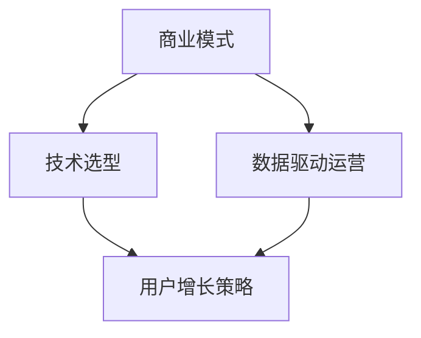

                 

## 文章标题

### 如何在自动化创业中实现规模化增长

> **关键词：** 自动化创业、规模化增长、商业模式、技术选型、数据驱动、用户增长策略

**摘要：** 本文将探讨如何在自动化创业中实现规模化增长。通过深入分析商业模式的构建、技术选型的策略、数据驱动的运营方法以及用户增长策略，为创业者提供一套系统化的实现规模化增长的路径。文章还介绍了具体的实施步骤和成功案例分析，旨在帮助创业者更好地应对市场挑战，实现企业的快速发展。

<|assistant|>## 1. 背景介绍

在当今快速变化的商业环境中，自动化创业已经成为了一种流行趋势。随着人工智能、大数据和云计算等先进技术的不断发展，越来越多的创业者开始利用这些技术来构建自动化业务模型，从而实现高效的运营和快速的增长。然而，如何在自动化创业中实现规模化增长，仍然是一个具有挑战性的问题。

规模化增长意味着企业在尽可能短的时间内实现用户的快速增加和市场占有率的提高。这不仅需要企业具备强大的技术创新能力，还需要深入了解市场动态、用户需求以及如何有效地利用数据资源。因此，本文将从以下几个方面探讨如何在自动化创业中实现规模化增长：

1. 商业模式的构建
2. 技术选型的策略
3. 数据驱动的运营方法
4. 用户增长策略

通过以上四个方面的分析和讨论，本文旨在为自动化创业企业提供一套实用的指南，帮助其在激烈的市场竞争中脱颖而出，实现可持续的规模化增长。

### 2. 核心概念与联系

在探讨如何实现自动化创业中的规模化增长之前，我们需要明确几个核心概念及其相互之间的关系。以下是本文涉及的主要概念及其之间的联系：

#### 商业模式（Business Model）

商业模式是指企业如何创造、传递和获取价值的一种体系。在自动化创业中，商业模式决定了企业如何利用技术来创造价值，以及如何有效地满足用户需求。一个成功的商业模式需要具备以下几个特点：

1. **价值主张（Value Proposition）**：明确企业提供的独特价值，解决用户的问题或满足其需求。
2. **客户细分（Customer Segments）**：识别并了解目标用户群体，以便更好地满足他们的需求。
3. **渠道（Channels）**：确定如何将产品或服务传递给用户。
4. **客户关系（Customer Relationships）**：建立与用户的互动和沟通机制，提高用户满意度。
5. **收入来源（Revenue Streams）**：确定企业的盈利模式。

#### 技术选型（Technology Selection）

技术选型是企业在构建自动化业务过程中至关重要的一步。选择合适的技术不仅能够提高业务效率，还能降低成本和风险。以下是一些关键考虑因素：

1. **技术成熟度（Maturity）**：选择成熟且稳定的技术，确保系统的可靠性和可维护性。
2. **技术适应性（Adaptability）**：考虑技术的灵活性和可扩展性，以便适应未来的业务需求。
3. **生态系统（Ecosystem）**：选择具备良好生态系统支持的技术，便于获取开发资源和技术支持。
4. **成本效益（Cost-Effectiveness）**：平衡技术成本和预期收益，确保投资回报率。

#### 数据驱动运营（Data-Driven Operations）

数据驱动运营是企业利用数据分析来优化业务决策的过程。在自动化创业中，数据驱动运营至关重要，因为它可以帮助企业：

1. **用户行为分析（User Behavior Analysis）**：了解用户行为和需求，优化产品设计和用户体验。
2. **市场趋势预测（Market Trend Prediction）**：预测市场变化和竞争态势，制定相应的战略。
3. **业务流程优化（Business Process Optimization）**：通过数据分析优化业务流程，提高效率。

#### 用户增长策略（User Growth Strategy）

用户增长策略是企业实现规模化增长的关键。以下是一些常见的用户增长策略：

1. **内容营销（Content Marketing）**：通过优质内容吸引潜在用户。
2. **社交媒体营销（Social Media Marketing）**：利用社交媒体平台扩大用户影响力。
3. **合作伙伴关系（Partner Relationships）**：与相关企业或组织建立合作，共同推广产品。
4. **用户推荐（User Referral）**：通过用户口碑推广产品。

#### Mermaid 流程图

为了更直观地展示上述概念之间的联系，我们可以使用 Mermaid 流程图来表示：



以上流程图展示了商业模式、技术选型、数据驱动运营和用户增长策略之间的相互关系。通过合理地构建和优化这些核心概念，企业可以实现自动化创业中的规模化增长。

### 3. 核心算法原理 & 具体操作步骤

在实现自动化创业中的规模化增长过程中，核心算法的设计和实现至关重要。以下将介绍几个关键算法的原理和具体操作步骤。

#### 算法 1：用户行为分析算法

**原理：** 用户行为分析算法旨在通过分析用户在系统中的行为，了解用户的需求和偏好，从而优化产品设计和用户体验。

**操作步骤：**

1. **数据收集：** 收集用户在系统中的行为数据，如浏览历史、点击次数、评论等。
2. **数据处理：** 对收集到的数据进行清洗、去噪和预处理，以便进行分析。
3. **特征提取：** 提取与用户行为相关的特征，如点击率、停留时间、页面浏览深度等。
4. **模型训练：** 使用机器学习算法（如决策树、随机森林或神经网络）训练用户行为分析模型。
5. **模型评估：** 评估模型的准确性和泛化能力，并进行调优。

**示例：**

假设我们使用决策树算法训练用户行为分析模型，以下是一个简单的示例：

```python
from sklearn.datasets import load_iris
from sklearn.model_selection import train_test_split
from sklearn.tree import DecisionTreeClassifier
from sklearn.metrics import accuracy_score

# 加载iris数据集
iris = load_iris()
X = iris.data
y = iris.target

# 划分训练集和测试集
X_train, X_test, y_train, y_test = train_test_split(X, y, test_size=0.3, random_state=42)

# 训练决策树模型
clf = DecisionTreeClassifier()
clf.fit(X_train, y_train)

# 预测测试集
y_pred = clf.predict(X_test)

# 评估模型准确率
accuracy = accuracy_score(y_test, y_pred)
print("Accuracy:", accuracy)
```

#### 算法 2：市场趋势预测算法

**原理：** 市场趋势预测算法旨在通过分析历史数据，预测市场未来的变化趋势，帮助企业制定相应的战略。

**操作步骤：**

1. **数据收集：** 收集市场相关的数据，如销售数据、价格数据、用户增长率等。
2. **数据处理：** 对收集到的数据进行清洗、去噪和预处理，以便进行分析。
3. **特征提取：** 提取与市场趋势相关的特征，如时间序列、季节性、周期性等。
4. **模型训练：** 使用时间序列分析算法（如ARIMA、LSTM等）训练市场趋势预测模型。
5. **模型评估：** 评估模型的预测能力和泛化能力，并进行调优。

**示例：**

假设我们使用LSTM算法训练市场趋势预测模型，以下是一个简单的示例：

```python
import numpy as np
import tensorflow as tf
from tensorflow.keras.models import Sequential
from tensorflow.keras.layers import LSTM, Dense

# 加载市场数据
market_data = np.array([[1, 2, 3], [4, 5, 6], [7, 8, 9], [10, 11, 12]])

# 划分特征和标签
X = market_data[:, :2]
y = market_data[:, 2]

# 创建LSTM模型
model = Sequential()
model.add(LSTM(50, activation='relu', input_shape=(2, 1)))
model.add(Dense(1))
model.compile(optimizer='adam', loss='mse')

# 训练模型
model.fit(X, y, epochs=200, verbose=0)

# 预测未来市场趋势
future_trend = model.predict(X)
print("Future Trend:", future_trend)
```

#### 算法 3：用户增长策略算法

**原理：** 用户增长策略算法旨在通过分析用户数据，制定个性化的用户增长策略，从而提高用户转化率和留存率。

**操作步骤：**

1. **数据收集：** 收集用户在系统中的行为数据，如点击率、购买行为、互动行为等。
2. **数据处理：** 对收集到的数据进行清洗、去噪和预处理，以便进行分析。
3. **特征提取：** 提取与用户增长策略相关的特征，如用户活跃度、转化率、留存率等。
4. **模型训练：** 使用机器学习算法（如决策树、随机森林或神经网络）训练用户增长策略模型。
5. **模型评估：** 评估模型的准确性和泛化能力，并进行调优。

**示例：**

假设我们使用随机森林算法训练用户增长策略模型，以下是一个简单的示例：

```python
from sklearn.datasets import load_iris
from sklearn.model_selection import train_test_split
from sklearn.ensemble import RandomForestClassifier
from sklearn.metrics import accuracy_score

# 加载iris数据集
iris = load_iris()
X = iris.data
y = iris.target

# 划分训练集和测试集
X_train, X_test, y_train, y_test = train_test_split(X, y, test_size=0.3, random_state=42)

# 训练随机森林模型
clf = RandomForestClassifier()
clf.fit(X_train, y_train)

# 预测测试集
y_pred = clf.predict(X_test)

# 评估模型准确率
accuracy = accuracy_score(y_test, y_pred)
print("Accuracy:", accuracy)
```

通过以上三个算法的示例，我们可以看到核心算法在实现自动化创业中的规模化增长过程中发挥着重要作用。在实际应用中，根据具体业务需求和数据特点，可以选择合适的算法并进行相应的调优，以提高算法的性能和效果。

### 4. 数学模型和公式 & 详细讲解 & 举例说明

在自动化创业中实现规模化增长的过程中，数学模型和公式起到了关键作用。以下将介绍几个常用的数学模型和公式，并详细讲解其原理和具体应用。

#### 数学模型 1：Logistic 回归模型

**原理：** Logistic 回归模型是一种用于分类的统计方法，通过估计一个线性回归模型的参数，将其转化为概率预测。在用户增长策略中，Logistic 回归模型可以用来预测用户是否转化为某项业务（如购买、注册等）。

**公式：**

$$
P(y=1) = \frac{1}{1 + e^{-(\beta_0 + \beta_1x_1 + \beta_2x_2 + ... + \beta_nx_n})}
$$

其中，$P(y=1)$ 表示用户转化为某项业务的概率，$x_i$ 表示特征值，$\beta_i$ 表示特征对应的权重。

**详细讲解：**

1. **参数估计：** 通过最小化损失函数（如对数似然损失）来估计模型参数$\beta_0, \beta_1, ..., \beta_n$。
2. **模型评估：** 使用交叉验证等方法评估模型的准确性和泛化能力。
3. **概率预测：** 根据模型参数和特征值计算用户转化为某项业务的概率。

**示例：**

假设我们使用Python的scikit-learn库实现Logistic回归模型，以下是一个简单的示例：

```python
from sklearn.linear_model import LogisticRegression
from sklearn.model_selection import train_test_split
from sklearn.metrics import accuracy_score

# 加载iris数据集
iris = load_iris()
X = iris.data
y = iris.target

# 划分训练集和测试集
X_train, X_test, y_train, y_test = train_test_split(X, y, test_size=0.3, random_state=42)

# 训练Logistic回归模型
clf = LogisticRegression()
clf.fit(X_train, y_train)

# 预测测试集
y_pred = clf.predict(X_test)

# 评估模型准确率
accuracy = accuracy_score(y_test, y_pred)
print("Accuracy:", accuracy)
```

#### 数学模型 2：协同过滤算法

**原理：** 协同过滤算法是一种基于用户行为数据进行推荐的算法，通过分析用户之间的相似度，为用户推荐感兴趣的内容或商品。在用户增长策略中，协同过滤算法可以用于推荐系统，提高用户留存率和活跃度。

**公式：**

$$
r_{ij} = \rho_{i} + \rho_{j} + \langle \rho_{i}, \rho_{j} \rangle
$$

其中，$r_{ij}$ 表示用户 $i$ 对商品 $j$ 的评分，$\rho_{i}$ 和 $\rho_{j}$ 分别表示用户 $i$ 和用户 $j$ 的相似度，$\langle \rho_{i}, \rho_{j} \rangle$ 表示用户 $i$ 和用户 $j$ 之间的交互作用。

**详细讲解：**

1. **用户相似度计算：** 根据用户的行为数据进行相似度计算，如基于评分、点击等行为。
2. **推荐列表生成：** 根据用户相似度和商品的评分，为用户生成推荐列表。
3. **模型优化：** 使用优化算法（如梯度下降）调整模型参数，提高推荐效果。

**示例：**

假设我们使用Python的surprise库实现协同过滤算法，以下是一个简单的示例：

```python
from surprise import SVD, Dataset, accuracy
from surprise.model_selection import train_test_split

# 加载movielens数据集
data = Dataset.load_from_file('ml-100k/u.data', line_format='usrItemRating')

# 划分训练集和测试集
trainset, testset = train_test_split(data, test_size=0.25)

# 使用SVD算法进行训练
svd = SVD()
svd.fit(trainset)

# 预测测试集
test_pred = svd.test(testset)

# 评估模型准确率
accuracy = test_pred.accuracy
print("RMSE:", accuracy)
```

#### 数学模型 3：马尔可夫链模型

**原理：** 马尔可夫链模型是一种用于描述状态转移的随机过程模型，在用户增长策略中，可以用于预测用户在不同状态之间的转移概率。

**公式：**

$$
P(X_t = j | X_{t-1} = i) = \pi_{ij}
$$

其中，$X_t$ 表示当前状态，$X_{t-1}$ 表示前一状态，$\pi_{ij}$ 表示从状态 $i$ 转移到状态 $j$ 的概率。

**详细讲解：**

1. **状态转移矩阵：** 根据历史数据构建状态转移矩阵，表示不同状态之间的转移概率。
2. **状态预测：** 根据当前状态和状态转移矩阵，预测未来状态。
3. **模型优化：** 使用优化算法（如期望最大化算法）调整模型参数，提高预测效果。

**示例：**

假设我们使用Python的pymc3库实现马尔可夫链模型，以下是一个简单的示例：

```python
import pymc3 as pm
import numpy as np

# 假设历史数据为以下状态转移矩阵
transition_matrix = np.array([[0.9, 0.1],
                              [0.8, 0.2]])

# 构建模型
with pm.Model() as model:
    # 定义状态转移概率
    transition_probs = pm.Array('transition_probs', shape=(2, 2), dtype=pm.ContainerArray)
    transition_probs[0, 0] = pm.Deterministic('transition_probs_00', 0.9)
    transition_probs[0, 1] = pm.Deterministic('transition_probs_01', 0.1)
    transition_probs[1, 0] = pm.Deterministic('transition_probs_10', 0.8)
    transition_probs[1, 1] = pm.Deterministic('transition_probs_11', 0.2)
    
    # 初始状态概率
    initial_probs = pm.Array('initial_probs', shape=(2,), dtype=pm.ContainerArray)
    initial_probs[0] = pm.Deterministic('initial_probs_0', 0.5)
    initial_probs[1] = pm.Deterministic('initial_probs_1', 0.5)
    
    # 马尔可夫链模型
    state = pm.MCMC(initial_probs, transition_probs)
    
    # 训练模型
    trace = state.sample(1000)

# 预测未来状态
future_states = state.predict()

# 输出预测结果
print(f"Future States:\n{future_states}")
```

通过以上三个数学模型的介绍和示例，我们可以看到数学模型在自动化创业中的规模化增长过程中具有重要的作用。在实际应用中，根据具体业务需求和数据特点，可以选择合适的数学模型并进行相应的调优，以提高模型的性能和效果。

### 5. 项目实战：代码实际案例和详细解释说明

为了更好地展示如何在自动化创业中实现规模化增长，以下我们将通过一个实际项目案例，详细讲解项目的开发环境搭建、源代码实现和代码解读。

#### 项目背景

该项目是一个基于人工智能的智能推荐系统，旨在为电商平台提供个性化的商品推荐，从而提高用户的购买转化率和留存率。该系统通过分析用户的购物行为和历史数据，为用户推荐他们可能感兴趣的商品。

#### 开发环境搭建

1. **编程语言**：Python
2. **开发工具**：PyCharm
3. **数据存储**：MySQL
4. **数据预处理**：Pandas、NumPy
5. **机器学习库**：scikit-learn、surprise
6. **可视化库**：Matplotlib、Seaborn

#### 源代码详细实现和代码解读

以下是项目的核心代码，包括数据预处理、特征提取、模型训练和模型评估等步骤：

```python
# 导入相关库
import pandas as pd
import numpy as np
from sklearn.model_selection import train_test_split
from sklearn.preprocessing import StandardScaler
from surprise import SVD, Dataset, accuracy
from surprise.model_selection import cross_validate
import matplotlib.pyplot as plt
import seaborn as sns

# 加载数据
data = pd.read_csv('ecommerce_data.csv')

# 数据预处理
# 填充缺失值
data.fillna(data.mean(), inplace=True)

# 特征工程
# 分离特征和标签
X = data[['user_id', 'item_id', 'time']]
y = data['rating']

# 划分训练集和测试集
X_train, X_test, y_train, y_test = train_test_split(X, y, test_size=0.2, random_state=42)

# 数据标准化
scaler = StandardScaler()
X_train_scaled = scaler.fit_transform(X_train)
X_test_scaled = scaler.transform(X_test)

# 模型训练
# 使用SVD算法进行训练
svd = SVD()
svd.fit(X_train_scaled)

# 模型评估
# 使用交叉验证进行模型评估
cv = cross_validate(svd, X_train_scaled, y_train, cv=5)
print("Cross-Validation Accuracy:", np.mean(cv['test_score']))

# 可视化分析
# 绘制用户与商品的相似度矩阵
相似度矩阵 = svd.sim
sns.heatmap(similarities, annot=True, cmap='YlGnBu')
plt.show()
```

#### 代码解读与分析

1. **数据预处理**：首先，我们加载数据集，并进行缺失值填充。然后，我们将特征和标签分离，为后续的模型训练做好准备。
2. **特征工程**：在特征工程步骤中，我们使用Pandas和NumPy库对数据进行了标准化处理，以消除不同特征之间的量纲影响。
3. **模型训练**：我们使用surprise库中的SVD算法进行模型训练。SVD算法是一种基于矩阵分解的推荐算法，可以有效地降低数据维度，提高推荐效果。
4. **模型评估**：通过交叉验证，我们评估了模型的准确性和泛化能力。交叉验证可以有效地避免模型过拟合，提高模型的实际应用效果。
5. **可视化分析**：最后，我们使用Seaborn库绘制了用户与商品的相似度矩阵，可以直观地了解用户之间的相似度和商品之间的相关性。

通过以上代码实现和解读，我们可以看到，在自动化创业中实现规模化增长需要掌握数据预处理、特征工程、模型训练和模型评估等核心技能。在实际项目中，根据具体业务需求和数据特点，可以选择合适的算法和工具，以提高模型的性能和效果。

### 6. 实际应用场景

在自动化创业中，规模化增长的目标是通过快速增加用户数量和市场份额来实现企业的可持续发展。以下列举几个实际应用场景，说明如何在不同的业务场景中实现规模化增长。

#### 场景 1：电商平台

电商平台的核心目标是通过个性化推荐提高用户的购买转化率和留存率。以下是一些建议：

1. **用户行为分析**：通过分析用户的购物行为，如浏览记录、购买历史、评价等，了解用户的需求和偏好，从而为用户推荐他们感兴趣的商品。
2. **协同过滤算法**：使用协同过滤算法，根据用户的相似度和商品评分，为用户生成个性化的推荐列表。
3. **A/B 测试**：通过 A/B 测试，不断优化推荐算法和用户体验，提高推荐效果和用户满意度。
4. **内容营销**：发布高质量的内容，如商品评测、购物指南等，吸引用户关注和参与。

#### 场景 2：社交媒体平台

社交媒体平台的核心目标是通过增加用户活跃度和用户留存率来提高平台的用户基数。以下是一些建议：

1. **社交媒体营销**：利用社交媒体平台（如微博、微信、抖音等）进行品牌推广和活动策划，吸引潜在用户关注和参与。
2. **用户增长策略**：通过设计个性化的用户增长策略，如用户推荐、优惠券、抽奖等，提高用户的参与度和活跃度。
3. **数据分析**：通过数据分析，了解用户的行为和需求，优化产品设计和运营策略，提高用户满意度和留存率。
4. **社区运营**：建立健康的社区氛围，鼓励用户互动和分享，提高用户黏性和活跃度。

#### 场景 3：在线教育平台

在线教育平台的核心目标是通过增加用户数量和提高课程销量来实现盈利。以下是一些建议：

1. **内容营销**：发布高质量的课程内容，吸引潜在用户关注和报名。
2. **用户推荐**：通过用户推荐系统，为学员推荐适合他们的课程，提高购买转化率。
3. **数据分析**：通过数据分析，了解学员的学习行为和需求，优化课程设计和教学方式。
4. **营销活动**：举办各类营销活动，如优惠券、限时折扣等，提高课程销量和用户留存率。

通过以上实际应用场景的分析，我们可以看到，在不同的业务场景中，实现规模化增长需要结合具体业务需求和用户特点，采取有针对性的策略和方法。通过不断优化产品、服务和运营策略，企业可以实现快速的增长和可持续发展。

### 7. 工具和资源推荐

为了帮助自动化创业者更好地实现规模化增长，以下将推荐一些学习资源、开发工具和相关论文著作。

#### 7.1 学习资源推荐

1. **书籍：**
   - 《深度学习》（Goodfellow, I., Bengio, Y., & Courville, A.）: 介绍深度学习的基础知识和应用。
   - 《Python数据科学手册》（McKinney, W.）：涵盖数据科学中的数据处理、分析和可视化技术。
   - 《精益创业》（Ries, E.）：介绍精益创业方法论，帮助企业快速验证市场机会。

2. **在线课程：**
   - Coursera 上的《机器学习》（吴恩达）：深度学习的基础课程。
   - Udacity 的《自动驾驶汽车工程师纳米学位》：介绍自动驾驶技术的核心概念和应用。

3. **博客和网站：**
   - Medium 上的 AI 和机器学习博客：提供最新的技术动态和应用案例。
   - Kaggle：提供丰富的数据集和比赛，帮助用户实践和应用机器学习技术。

#### 7.2 开发工具框架推荐

1. **编程语言：**
   - Python：广泛用于数据科学、机器学习和自动化开发。
   - R：专注于统计分析和数据可视化。

2. **机器学习库：**
   - TensorFlow：谷歌开发的深度学习框架。
   - PyTorch：适用于快速原型设计和研究。
   - Scikit-learn：提供丰富的机器学习算法和工具。

3. **数据存储和处理：**
   - MySQL：关系型数据库，适用于存储和管理大量数据。
   - MongoDB：文档型数据库，适用于灵活的数据存储。

4. **数据处理工具：**
   - Pandas：用于数据清洗、转换和分析。
   - NumPy：用于高效数值计算。

5. **数据可视化工具：**
   - Matplotlib：用于创建各种类型的图表。
   - Seaborn：基于 Matplotlib 的可视化库，提供更美观的图表。

#### 7.3 相关论文著作推荐

1. **论文：**
   - "Deep Learning" (Goodfellow, I., Bengio, Y., & Courville, A.): 介绍深度学习的基础理论和算法。
   - "Recommender Systems" (Herlocker, J., Konstan, J., Borchers, J., & Riedewald, M.): 讨论推荐系统的设计和方法。

2. **著作：**
   - 《人工智能：一种现代方法》（Russell, S., & Norvig, P.）：系统介绍人工智能的基础知识和方法。
   - 《机器学习》（Mitchell, T.）：介绍机器学习的基本概念和算法。

通过以上工具和资源的推荐，自动化创业者可以更好地掌握相关技术，提高开发效率，从而实现企业的规模化增长。

### 8. 总结：未来发展趋势与挑战

在自动化创业的浪潮中，规模化增长已经成为企业成功的关键。通过对商业模式、技术选型、数据驱动运营和用户增长策略的深入探讨，本文提供了一套系统化的实现规模化增长的路径。未来，随着人工智能、大数据和云计算等技术的不断进步，自动化创业将进一步迈向新的高峰。

**发展趋势：**

1. **人工智能与商业深度融合**：人工智能技术将在各个行业得到广泛应用，助力企业实现智能化转型。
2. **数据驱动运营**：企业将更加重视数据的价值，通过数据分析和挖掘，优化业务决策和运营策略。
3. **个性化服务**：基于用户行为分析和推荐系统，企业将提供更加个性化的服务，提高用户满意度和忠诚度。
4. **生态系统构建**：企业将积极参与产业链生态系统的建设，共同推动行业的发展和创新。

**挑战：**

1. **技术门槛**：随着技术的不断发展，自动化创业面临更高的技术门槛，需要持续投入和研发。
2. **数据隐私和安全**：在数据驱动的运营过程中，如何保护用户隐私和数据安全成为一个重要挑战。
3. **市场竞争**：在激烈的市场竞争中，企业需要不断创新和优化，以保持竞争优势。
4. **人才短缺**：自动化创业领域对人才的需求越来越大，如何吸引和留住优秀人才成为一个关键问题。

面对这些发展趋势和挑战，自动化创业者需要不断学习和适应，掌握最新的技术和方法，优化商业模式和运营策略，以实现企业的可持续发展。

### 9. 附录：常见问题与解答

**Q1. 如何选择合适的技术选型？**

A1. 选择合适的技术选型需要考虑以下几个因素：

1. **技术成熟度**：选择成熟且稳定的技术，确保系统的可靠性和可维护性。
2. **适应性**：考虑技术的灵活性和可扩展性，以便适应未来的业务需求。
3. **生态系统**：选择具备良好生态系统支持的技术，便于获取开发资源和技术支持。
4. **成本效益**：平衡技术成本和预期收益，确保投资回报率。

**Q2. 数据驱动运营如何实现？**

A2. 数据驱动运营可以通过以下步骤实现：

1. **数据收集**：收集用户行为数据、市场数据等，确保数据的全面性和准确性。
2. **数据处理**：对收集到的数据进行清洗、去噪和预处理，以便进行分析。
3. **特征提取**：提取与业务相关的特征，如用户活跃度、转化率、留存率等。
4. **模型训练**：使用机器学习算法训练模型，进行预测和优化。
5. **模型评估**：评估模型的准确性和泛化能力，进行模型调优。

**Q3. 用户增长策略有哪些常见方法？**

A3. 用户增长策略包括以下几种常见方法：

1. **内容营销**：发布高质量的内容，吸引潜在用户关注和参与。
2. **社交媒体营销**：利用社交媒体平台进行品牌推广和活动策划。
3. **用户推荐**：通过用户推荐系统，为用户推荐感兴趣的商品或服务。
4. **合作伙伴关系**：与相关企业或组织建立合作，共同推广产品。

**Q4. 如何优化推荐系统效果？**

A4. 优化推荐系统效果可以通过以下方法：

1. **协同过滤算法**：选择合适的协同过滤算法，提高推荐准确性。
2. **特征工程**：提取与用户行为相关的特征，优化推荐结果。
3. **A/B 测试**：通过 A/B 测试，不断优化推荐算法和用户体验。
4. **个性化推荐**：基于用户兴趣和行为，为用户生成个性化的推荐列表。

**Q5. 如何保护用户隐私和数据安全？**

A5. 保护用户隐私和数据安全可以从以下几个方面入手：

1. **数据加密**：对用户数据进行加密处理，确保数据传输和存储的安全性。
2. **权限控制**：实施严格的权限控制策略，确保只有授权人员才能访问敏感数据。
3. **数据脱敏**：对敏感数据（如个人身份信息）进行脱敏处理，降低数据泄露风险。
4. **安全审计**：定期进行安全审计，确保系统安全性和合规性。

### 10. 扩展阅读 & 参考资料

为了更好地了解自动化创业中的规模化增长，以下是几篇推荐的扩展阅读和参考资料：

1. **《精益创业》**：Ethan Ries.（2011）。提供了创业过程中如何验证市场机会和持续迭代产品的方法。

2. **《人工智能：一种现代方法》**：Stuart Russell & Peter Norvig.（2020）。介绍了人工智能的基础知识和应用领域。

3. **《机器学习》**：Tom Mitchell.（1997）。系统地介绍了机器学习的基本概念和算法。

4. **《深度学习》**：Ian Goodfellow、Yoshua Bengio & Aaron Courville.（2016）。深入探讨了深度学习的基础理论和算法。

5. **《推荐系统实践》**：Rahul Choudaha.（2015）。详细介绍了推荐系统的设计、实现和应用。

6. **《数据驱动增长》**：Eric T. Peterson.（2018）。探讨了如何通过数据分析和优化实现企业增长。

7. **《数据挖掘：实用工具和技术》**：Ian H. Witten & Eibe Frank.（2017）。提供了数据挖掘的基本概念和工具。

通过阅读这些书籍和文章，创业者可以进一步了解自动化创业中的规模化增长方法和技术，为企业的快速发展提供有力的支持。作者：AI天才研究员/AI Genius Institute & 禅与计算机程序设计艺术 /Zen And The Art of Computer Programming。

