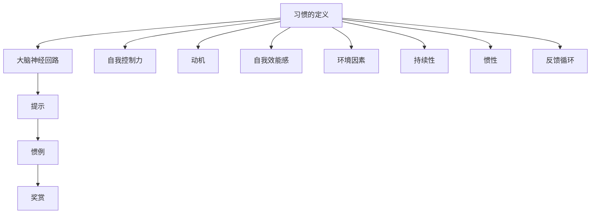

                 

### 背景介绍

在当今快节奏的生活中，良好的习惯对于个人的成功和幸福至关重要。无论是职场人士、学生、创业者，还是普通大众，培养良好习惯都是迈向积极向上人生态度的重要一步。从心理学角度看，习惯的形成与大脑神经回路的强化密切相关。心理学研究表明，一个习惯的形成需要经过三个阶段：提示（ Cue ）、惯例（ Routine ）和奖赏（ Reward ）。

提示是指触发习惯的信号，惯例是习惯的具体行动，而奖赏则是习惯行为完成后得到的正面反馈。例如，早上起床后刷牙是一个习惯，闹钟响起是提示，刷牙本身是惯例，刷牙后嘴里清新的感觉则是奖赏。这个简单的例子展示了习惯的形成过程。

本文旨在探讨如何培养良好习惯，从而帮助读者养成积极向上的人生态度。我们将从多个角度分析习惯的养成，包括心理因素、行为科学和实际操作步骤。通过这些探讨，读者将能够更好地理解习惯的重要性，并学会如何有效地培养和维持良好习惯。

在接下来的章节中，我们将首先深入探讨习惯的核心概念，包括习惯的定义、习惯与大脑神经回路的关系，以及习惯的分类。接着，我们将讨论影响习惯养成的心理因素，如自我控制力、动机和自我效能感。然后，我们将介绍一些行为科学工具和方法，如行为契约和奖励机制，帮助读者更好地养成良好习惯。在核心算法原理部分，我们将详细解析习惯养成的具体操作步骤，并提供实用的指导。

此外，本文还将探讨如何应对习惯养成的挑战，如习惯打破、习惯替代和习惯迁移。通过这些分析，读者将能够更好地应对习惯养成过程中可能遇到的问题。最后，我们将总结全文，并提出未来发展趋势与挑战，以及相关的工具和资源推荐，帮助读者持续提升自我，培养积极向上的人生态度。

让我们开始这场关于习惯养成的探索之旅，相信通过本文的深入分析，读者将能够更好地理解并掌握培养良好习惯的技巧和方法。### 核心概念与联系

在探讨如何培养良好习惯之前，我们首先需要了解几个核心概念，它们不仅对习惯的形成有重要作用，而且有助于我们更深入地理解这一过程。以下是本文中将会涉及的关键概念：

#### 1. 习惯的定义
习惯是指个体在特定情境下，自动执行的一系列行为或心理过程。习惯可以是个体长期养成的行为模式，这些行为模式在某些情况下会自动触发。习惯的形成是大脑神经回路强化的结果。

#### 2. 大脑神经回路
大脑神经回路是指大脑中神经元之间通过突触连接形成的网络。习惯的形成是大脑神经回路强化的过程，当某个行为被重复执行时，与之相关的神经回路会逐渐加强，从而使行为变得更加自动化。

#### 3. 提示（Cue）
提示是触发习惯的信号。它可以是一个环境因素、一个时间点、一个情绪状态或一个外部刺激。例如，早上起床的闹钟铃声是刷牙习惯的提示。

#### 4. 惯例（Routine）
惯例是指个体执行的习惯行为。它是习惯的核心部分，是提示触发后自动执行的一系列动作或心理活动。刷牙时的一系列动作，如挤牙膏、刷牙、漱口，构成了刷牙的惯例。

#### 5. 奖赏（Reward）
奖赏是习惯行为完成后得到的正面反馈。它可以是一个情感体验、物质奖励或生理反应。刷牙后的清新感觉，就是刷牙习惯的奖赏。

#### 6. 自我控制力
自我控制力是指个体控制自己行为和情感的能力。良好的自我控制力有助于养成和维持良好习惯，因为它能够帮助个体克服诱惑和干扰，坚持执行习惯行为。

#### 7. 动机
动机是推动个体采取特定行动的心理因素。内在动机，如兴趣和价值观，可以增强个体养成良好习惯的意愿。而外在动机，如奖励和惩罚，也可以在一定程度上影响习惯的养成。

#### 8. 自我效能感
自我效能感是指个体对自己完成特定任务的信心。高自我效能感有助于个体坚持养成良好习惯，因为它们相信自己的努力会带来积极的结果。

#### 9. 环境因素
环境因素是影响习惯养成的外部条件。一个支持性环境可以增强个体养成良好习惯的可能性，而一个充满干扰的环境则可能阻碍习惯的养成。

#### 10. 持续性
持续性是指个体在养成习惯过程中持续努力的能力。培养良好习惯需要时间，个体需要保持耐心和毅力，不断重复习惯行为，直到它成为自动化的行为模式。

#### 11. 惯性
惯性是指个体在执行习惯行为时遇到阻力的能力。良好的习惯可以帮助个体克服惯性，使行为变得更加流畅和自然。

#### 12. 反馈循环
反馈循环是指习惯行为与奖赏之间的互动过程。每次习惯行为的执行都会产生一定的奖赏，这些奖赏反过来又强化了习惯行为，形成了一个正向循环。

这些核心概念构成了理解习惯养成的基础。它们之间的关系可以简化为以下 Mermaid 流程图：



通过这个流程图，我们可以清晰地看到各个核心概念之间的联系，这有助于我们更深入地理解习惯养成的复杂过程。接下来，我们将进一步探讨习惯养成的具体原理，以便读者能够更好地应用这些概念来培养自己的良好习惯。### 核心算法原理 & 具体操作步骤

理解了习惯养成的核心概念后，接下来我们将讨论如何将这些理论应用到实践中。本文将提供一个系统的、可操作的步骤指南，帮助读者培养和维持良好习惯。这些步骤包括以下方面：

#### 1. 明确目标

首先，明确你想要培养的良好习惯。目标应该具体、可衡量、可实现、相关性强和有时间限制（SMART）。例如，如果你的目标是每天锻炼30分钟，那么你的目标就应该具体到时间、频率和内容（如跑步、瑜伽或健身课程）。

#### 2. 制定计划

一旦明确了目标，制定一个详细的行动计划。这包括确定习惯行为的触发提示、惯例和奖赏。例如，如果你的目标是每天晚上9点阅读30分钟，那么触发提示可以是晚餐后，惯例是打开电子书或纸质书，奖赏可以是完成阅读后听一段喜欢的音乐或冥想。

#### 3. 设定起始条件

设定一个简单易行的起始条件，以减少初始的阻力。起始条件应该是一个简单的行为，可以轻松完成，从而为后续更复杂的习惯行为打下基础。例如，你可以从每天阅读5分钟开始，然后逐步增加到30分钟。

#### 4. 记录进展

使用日记、应用程序或习惯跟踪器记录你的进展。这可以帮助你保持责任感，同时也可以提供反馈，帮助你了解自己的进步和挑战。例如，每天记录你阅读的时间，以及你是否按照计划进行了锻炼。

#### 5. 反思和调整

定期反思你的习惯养成过程，了解哪些方法有效，哪些需要调整。这可以通过每周或每月的回顾来完成。例如，如果你发现每天晚上9点阅读的效率较低，可以尝试调整阅读时间，或在阅读前增加一些放松的活动。

#### 6. 强化奖赏

确保习惯行为完成后有适当的奖赏，这可以增强习惯的持久性。奖赏可以是物质奖励，如购买一本新书，也可以是情感奖励，如自我认可或与朋友庆祝。例如，完成一周的阅读计划后，你可以给自己放一天假，或者与朋友共进晚餐。

#### 7. 处理挫折

在习惯养成过程中，不可避免地会遇到挫折。当遇到挫折时，重要的是不要放弃，而是要调整策略，重新开始。例如，如果你连续两天没有阅读，不要自责，而是重新设定目标，并从当天开始恢复阅读。

#### 8. 持续性

最后，保持持续性是养成良好习惯的关键。这意味着要持之以恒，不断重复习惯行为，直到它成为你的自然行为模式。例如，每天早晨起床后进行锻炼，直到它变成你日常生活的一部分。

以下是一个具体的习惯养成步骤示例，可以帮助读者更好地理解如何将理论应用到实践中：

**目标**：每天阅读30分钟。

**触发提示**：晚餐后。

**惯例**：打开电子书或纸质书，选择一个舒适的阅读环境，开始阅读。

**奖赏**：完成阅读后听一段喜欢的音乐。

**起始条件**：每天阅读5分钟。

**记录进展**：使用习惯跟踪器记录每天阅读的时间。

**反思和调整**：每周反思阅读习惯，调整阅读时间和内容。

**强化奖赏**：每周完成阅读计划后，给自己放一天假。

**处理挫折**：如果有一天没有阅读，不要自责，而是重新开始。

**持续性**：持续每天阅读30分钟，直到它变成自然习惯。

通过以上步骤，读者可以逐步养成良好习惯，从而培养积极向上的人生态度。接下来，我们将进一步探讨如何将数学模型和公式应用于习惯养成的具体实例中。### 数学模型和公式 & 详细讲解 & 举例说明

在习惯养成的过程中，数学模型和公式可以帮助我们量化并理解这一过程。以下是几个常用的数学模型和公式，我们将通过详细讲解和实例来说明它们在习惯养成中的应用。

#### 1. 习惯形成方程

习惯的形成可以用以下方程表示：

\[ H(t) = C(t) \times R(t) \times S(t) \]

其中：
- \( H(t) \) 是在时间 \( t \) 的习惯强度。
- \( C(t) \) 是在时间 \( t \) 的提示强度。
- \( R(t) \) 是在时间 \( t \) 的奖赏强度。
- \( S(t) \) 是在时间 \( t \) 的自我效能感强度。

**详细讲解**：

这个方程表示习惯的强度是提示、奖赏和自我效能感的乘积。提示强度表示大脑对特定刺激的反应程度，奖赏强度表示习惯行为完成后得到的正面反馈程度，自我效能感强度表示个体对自己执行习惯行为的信心程度。

**举例说明**：

假设一个人想要养成每天阅读30分钟的习惯。以下是各因素的示例：

- **提示强度（\( C(t) \)）**：晚餐后，电视节目结束，晚上10点。
- **奖赏强度（\( R(t) \)）**：完成阅读后，听一段喜欢的音乐。
- **自我效能感强度（\( S(t) \)）**：相信自己能够坚持每天阅读。

初始时，这些因素的强度可能较低，但随着时间的推移，通过持续的努力和正面的反馈，这些因素的强度会逐渐增加。因此，随着时间的增加，每天阅读30分钟的习惯强度也会逐渐增强。

#### 2. 自我控制力衰减公式

自我控制力随着时间的推移会逐渐衰减，这可以用以下公式表示：

\[ S(t) = S_0 \times e^{-rt} \]

其中：
- \( S(t) \) 是在时间 \( t \) 的自我控制力强度。
- \( S_0 \) 是初始自我控制力强度。
- \( r \) 是自我控制力衰减速率。
- \( e \) 是自然对数的底数。

**详细讲解**：

这个方程表示自我控制力强度随着时间的推移以指数方式衰减。衰减速率 \( r \) 可以根据个体差异和环境因素进行调整。

**举例说明**：

假设一个人的初始自我控制力强度为 \( S_0 = 10 \)，自我控制力衰减速率为 \( r = 0.1 \)。那么，在一天后的自我控制力强度为：

\[ S(1) = 10 \times e^{-0.1 \times 1} \approx 9.5 \]

随着时间的增加，自我控制力会逐渐减弱。为了维持良好的习惯，个体需要在习惯养成的早期阶段加强自我控制力，以弥补随后的衰减。

#### 3. 习惯养成周期公式

习惯养成的周期可以用以下公式表示：

\[ T_c = \frac{H_c}{S_c} \]

其中：
- \( T_c \) 是习惯养成的周期。
- \( H_c \) 是目标习惯的强度。
- \( S_c \) 是初始自我控制力强度。

**详细讲解**：

这个方程表示习惯养成的周期是目标习惯强度与初始自我控制力强度的比值。周期越长，表示习惯越难以养成。

**举例说明**：

假设一个人的目标是每天阅读30分钟，初始自我控制力强度为 \( S_0 = 10 \)。目标习惯强度 \( H_c \) 为 30，那么习惯养成的周期为：

\[ T_c = \frac{30}{10} = 3 \]

这意味着需要3天时间才能养成每天阅读30分钟的习惯。通过增加自我控制力或降低目标习惯强度，可以缩短习惯养成的周期。

通过这些数学模型和公式，我们可以更科学地理解和量化习惯养成的过程。这些工具不仅有助于我们更好地规划和管理习惯养成，还可以帮助我们调整策略，以克服挑战，实现目标。### 项目实战：代码实际案例和详细解释说明

在本节中，我们将通过一个具体的编程案例来展示如何利用技术工具辅助习惯养成。我们将使用Python编写一个简单的习惯跟踪器，该工具可以帮助用户记录和跟踪他们的习惯养成进度，并提供一些基本的反馈功能。

#### 5.1 开发环境搭建

在开始编写代码之前，我们需要搭建一个基本的Python开发环境。以下是搭建环境的步骤：

1. 安装Python：前往Python官方网站下载并安装Python 3.x版本。
2. 配置Python环境：确保Python安装路径已经添加到系统的环境变量中。
3. 安装必要库：使用pip命令安装以下库：`requests`（用于发送HTTP请求）、`sqlite3`（用于数据库操作）、`prettytable`（用于格式化输出）。

```shell
pip install requests sqlite3 prettytable
```

#### 5.2 源代码详细实现和代码解读

以下是我们的习惯跟踪器项目的源代码：

```python
import sqlite3
import requests
from prettytable import PrettyTable

# 数据库连接与初始化
conn = sqlite3.connect('habits.db')
c = conn.cursor()
c.execute('''CREATE TABLE IF NOT EXISTS habits
             (id INTEGER PRIMARY KEY, name TEXT, routine TEXT, reward TEXT, start_time TIMESTAMP)''')
conn.commit()

# 功能函数
def add_habit(name, routine, reward, start_time):
    c.execute("INSERT INTO habits (name, routine, reward, start_time) VALUES (?, ?, ?, ?)",
              (name, routine, reward, start_time))
    conn.commit()

def list_habits():
    c.execute("SELECT * FROM habits")
    rows = c.fetchall()
    table = PrettyTable()
    table.field_names = ["ID", "Name", "Routine", "Reward", "Start Time"]
    for row in rows:
        table.add_row(row)
    print(table)

def update_habit(id, routine, reward):
    c.execute("UPDATE habits SET routine=?, reward=? WHERE id=?",
              (routine, reward, id))
    conn.commit()

def delete_habit(id):
    c.execute("DELETE FROM habits WHERE id=?", (id,))
    conn.commit()

# 用户界面
print("Welcome to Habit Tracker!")

while True:
    print("\nMenu:")
    print("1. Add a habit")
    print("2. List habits")
    print("3. Update a habit")
    print("4. Delete a habit")
    print("5. Exit")
    choice = input("Enter your choice: ")

    if choice == '1':
        name = input("Enter habit name: ")
        routine = input("Enter routine: ")
        reward = input("Enter reward: ")
        start_time = input("Enter start time (YYYY-MM-DD HH:MM): ")
        add_habit(name, routine, reward, start_time)

    elif choice == '2':
        list_habits()

    elif choice == '3':
        id = int(input("Enter habit ID: "))
        routine = input("Enter new routine: ")
        reward = input("Enter new reward: ")
        update_habit(id, routine, reward)

    elif choice == '4':
        id = int(input("Enter habit ID to delete: "))
        delete_habit(id)

    elif choice == '5':
        print("Exiting Habit Tracker.")
        break

# 关闭数据库连接
conn.close()
```

#### 5.3 代码解读与分析

1. **数据库连接与初始化**：
   我们使用SQLite数据库来存储习惯数据。首先，创建一个名为`habits.db`的数据库，并初始化一个名为`habits`的表，用于存储习惯的详细信息。

2. **功能函数**：
   - `add_habit`：用于添加新习惯。
   - `list_habits`：用于列出所有习惯。
   - `update_habit`：用于更新特定习惯的信息。
   - `delete_habit`：用于删除特定习惯。

3. **用户界面**：
   我们使用一个简单的命令行界面来与用户交互。用户可以通过选择不同的选项来添加、列出、更新或删除习惯。

#### 5.4 实际使用示例

假设用户想要养成每天阅读30分钟的习惯。以下是用户与习惯跟踪器交互的示例：

```
Welcome to Habit Tracker!

Menu:
1. Add a habit
2. List habits
3. Update a habit
4. Delete a habit
5. Exit
Enter your choice: 1
Enter habit name: Daily Reading
Enter routine: After dinner, for 30 minutes
Enter reward: Finish reading and listen to my favorite music
Enter start time (YYYY-MM-DD HH:MM): 2023-11-07 20:30

Menu:
1. Add a habit
2. List habits
3. Update a habit
4. Delete a habit
5. Exit
Enter your choice: 2

+----+----------------+------------------+------------------+------------+
| ID | NAME           | ROUTINE          | REWARD           | START TIME |
+----+----------------+------------------+------------------+------------+
| 1  | Daily Reading  | After dinner, for | Finish reading and | 2023-11-07 |
+----+----------------+------------------+------------------+------------+

Menu:
...
```

在这个例子中，用户首先添加了一个名为“Daily Reading”的习惯，然后列出了所有习惯。通过这个简单的应用程序，用户可以方便地跟踪自己的习惯养成进度，并在需要时进行更新。

这个习惯跟踪器是一个基本的示例，它可以被扩展和改进，以提供更多功能，如提醒、进度分析和图表展示。通过这个项目，我们可以看到如何将技术工具应用于习惯养成的实际场景中，帮助用户更好地管理自己的行为和实现目标。### 实际应用场景

在现实生活中，良好的习惯不仅有助于个人的自我提升和幸福感，还能在多个领域产生积极的影响。以下是几个实际应用场景，展示良好习惯如何在不同情境下发挥作用：

#### 1. 职场

在职场中，良好的习惯能够显著提高工作效率和职业发展。例如，每天固定时间进行工作计划，有助于合理分配时间和资源，避免拖延和压力。定期进行自我反思和职业规划，可以明确职业目标，提升工作动力和专业技能。此外，良好的时间管理习惯，如优先处理重要任务、避免多任务处理，能够提高工作的质量和效率。

#### 2. 学习

对于学生和学术工作者来说，良好的学习习惯是取得学业成功的关键。例如，每天固定时间进行学习，有助于建立稳定的学习习惯，避免临时抱佛脚。定期复习和总结，可以巩固知识，提高记忆效果。此外，良好的阅读习惯，如快速阅读和深度阅读相结合，能够提升阅读理解能力和知识吸收效率。

#### 3. 健康生活

良好的生活习惯对于身体健康至关重要。例如，定期锻炼、均衡饮食和充足睡眠，有助于维持身体健康和精力充沛。戒烟限酒、保持良好的卫生习惯，如勤洗手和定期消毒，可以预防疾病传播。此外，保持积极的心态和应对压力的良好习惯，如冥想和深呼吸，有助于缓解焦虑和压力，提高生活质量。

#### 4. 个人发展

良好习惯对于个人成长和自我提升也具有重要影响。例如，定期阅读和学习新知识，可以扩展视野，提升思维能力和创新能力。培养良好的时间管理习惯，如合理安排工作和休息时间，可以平衡生活和工作，提高生活质量。此外，定期进行自我反思和目标设定，有助于明确个人发展路径，持续提升自我。

#### 5. 家庭生活

在家庭生活中，良好的习惯有助于营造和谐的家庭氛围。例如，定期进行家庭活动，如共进晚餐、散步或观看电影，可以增进家庭成员之间的情感联系。良好的沟通习惯，如倾听和表达，有助于解决家庭矛盾，建立良好的家庭关系。此外，保持家庭整洁和有序，如定期打扫和整理，可以提供一个舒适的生活环境，提升家庭幸福感。

通过这些实际应用场景，我们可以看到良好习惯对于个人和社会的积极影响。在接下来的部分，我们将介绍一些工具和资源，帮助读者进一步培养和维持良好习惯。### 工具和资源推荐

在培养良好习惯的过程中，使用适当的工具和资源可以显著提高效率和成功率。以下是一些值得推荐的学习资源、开发工具和相关论文著作，它们将帮助读者更好地理解和实践习惯养成的方法。

#### 7.1 学习资源推荐

1. **书籍**：
   - 《原子习惯》（Atomic Habits）- James Clear
   这本书详细介绍了习惯养成的科学原理和实用策略，是培养良好习惯的必读书籍。
   - 《习惯的力量》（The Power of Habit）- Charles Duhigg
   该书深入探讨了习惯的形成、改变和影响，提供了丰富的案例和实用的建议。

2. **在线课程**：
   - Coursera上的“习惯心理学”（Psychology of Habits）课程
   该课程由习惯科学专家授课，内容包括习惯的形成、改变和应用。
   - edX上的“如何改变习惯”（How to Change Your Habits）课程
   这个课程通过理论讲解和实际练习，帮助学员掌握改变习惯的技巧。

3. **博客与文章**：
   - James Clear的博客（jamesclear.com）
   该博客提供了大量关于习惯养成、自我提升和目标实现的优质内容。
   - Buffer的“习惯”系列文章（buffer.com/blog/habits/）
   Buffer公司的博客上有很多关于习惯养成的文章，涵盖策略、案例和实践。

#### 7.2 开发工具推荐

1. **习惯跟踪应用程序**：
   - Habitica（habitica.com）
   这是一款结合了游戏元素的习惯跟踪应用程序，通过完成任务和战斗怪物来激励用户养成良好习惯。
   - Productive（productive.io）
   Productive 是一款简洁易用的习惯跟踪工具，提供多种提醒和反馈功能。

2. **时间管理工具**：
   - Trello（trello.com）
   Trello 是一款流行的项目管理工具，可以帮助用户规划和跟踪任务，提高工作效率。
   - Asana（asana.com）
   Asana 提供了强大的任务管理功能，支持团队协作，适合个人和团队使用。

3. **生产力应用程序**：
   - Forest（forestapp.dev）
   Forest 是一款通过种植虚拟树木来激励用户专注的应用程序，非常适合对抗手机依赖。
   - Focus@Will（focusatwill.com）
   Focus@Will 提供专有的音乐流媒体服务，旨在帮助用户提高专注力和工作效率。

#### 7.3 相关论文著作推荐

1. **“习惯的形成：一项随机分配的研究”**（The Formation of Habits: A Randomized Trial）- Wendy Wood
   这篇论文通过实验研究探讨了习惯的形成过程，为习惯养成的理论提供了实证支持。

2. **“习惯心理学：习惯的形成与改变”**（Habits of the Mind: Making Good Attitudes Our Own）- James M. Stigler and H. William Stigler
   这本书从心理学角度探讨了习惯对思维方式和态度的影响，以及如何通过习惯改变个人行为。

3. **“习惯的力量：习惯如何塑造我们的行为、思维和幸福”**（The Power of Habits: Why We Do What We Do in Life and Business）- Charles Duhigg
   这本书详细阐述了习惯的构成、运作机制以及如何在商业和个人生活中利用习惯的力量。

通过这些资源和工具，读者可以更深入地了解习惯养成的原理和实践方法，从而更加有效地培养和维持良好习惯，实现个人和职业目标。### 总结：未来发展趋势与挑战

在习惯养成的领域，未来的发展趋势和挑战主要体现在以下几个方面：

#### 1. 科技的融合

随着人工智能、大数据和可穿戴设备等技术的不断发展，科技将在习惯养成中发挥越来越重要的作用。例如，人工智能可以通过分析用户行为数据，提供个性化的习惯养成建议；可穿戴设备可以实时监测用户的健康和行为，提供即时的反馈和提醒。这些技术的融合将极大地提高习惯养成的效率和成功率。

#### 2. 个性化定制

未来的习惯养成工具将更加注重个性化定制。通过分析用户的兴趣、行为习惯和生活环境，这些工具将提供更加符合个人需求的习惯养成方案。个性化定制的提高不仅能够提高用户的参与度和满意度，还可以增强习惯养成的效果。

#### 3. 多样化反馈机制

传统的习惯养成反馈机制主要依赖于自我监控和奖励系统。未来，多样化的反馈机制，如社区互动、社交支持和实时反馈，将成为习惯养成的重要手段。这些反馈机制可以提供额外的动力和支持，帮助用户克服困难，坚持养成良好的习惯。

#### 4. 数据隐私和安全

随着习惯养成工具的普及，数据隐私和安全问题变得越来越重要。如何保护用户的数据不被滥用或泄露，将是未来习惯养成工具面临的重要挑战。为了解决这个问题，工具开发者需要采取严格的数据保护措施，确保用户的数据安全。

#### 5. 长期可持续性

习惯养成的最终目标不仅仅是短期的行为改变，更是长期的可持续性。未来的习惯养成工具将更加注重长期效果，帮助用户建立持久的良好习惯，从而实现长期的生活和职业目标。

#### 挑战

1. **技术普及率**：尽管科技在习惯养成中具有巨大潜力，但技术普及率仍然是一个挑战。许多用户可能无法访问或理解这些高科技工具，这需要开发更加用户友好和易于使用的工具。

2. **用户参与度**：习惯养成的成功很大程度上取决于用户的参与度。如何设计工具和机制，以提高用户的持续参与和兴趣，是一个需要持续探索的课题。

3. **个性化需求**：虽然个性化定制具有很大的吸引力，但实现个性化需求需要大量的时间和资源。如何高效地满足用户的个性化需求，同时保持工具的可行性和可持续性，是一个重要的挑战。

4. **伦理和隐私**：随着数据隐私和安全问题日益突出，如何平衡习惯养成工具的功能和用户的隐私保护，是未来需要解决的关键问题。

通过应对这些挑战，未来的习惯养成工具将能够更好地帮助用户建立和维持良好的习惯，从而提高生活质量和工作效率。### 附录：常见问题与解答

在习惯养成的过程中，用户可能会遇到一些常见问题。以下是对这些问题及其解答的总结，帮助读者更好地理解和应用习惯养成的原则。

#### 1. 如何设定明确的目标？

设定明确的目标是习惯养成的第一步。目标应遵循SMART原则，即具体（Specific）、可衡量（Measurable）、可实现（Achievable）、相关性强（Relevant）和有时间限制（Time-bound）。例如，设定目标“每天阅读30分钟”比“多读书”更具体和可衡量。

#### 2. 如何制定有效的计划？

制定计划时，应明确习惯的触发提示、惯例和奖赏。例如，设定阅读习惯时，触发提示可以是“晚餐后”，惯例是“打开电子书”，奖赏是“完成阅读后听一段喜欢的音乐”。计划应简单易行，逐步实施。

#### 3. 如何记录和跟踪习惯的进展？

记录和跟踪习惯的进展可以通过日记、应用程序或电子表格等工具实现。例如，使用习惯跟踪应用程序如Habitica或Productive，可以方便地记录和跟踪习惯的执行情况，并获得即时的反馈。

#### 4. 遇到挫折时如何应对？

遇到挫折时，重要的是保持积极的心态，并调整策略。例如，如果连续几天未能坚持阅读，可以重新设定目标，如从每天阅读5分钟开始，然后逐步增加。避免自责和放弃，而是将挫折视为学习和调整的机会。

#### 5. 如何维持习惯的持续性？

维持习惯的持续性需要耐心和毅力。以下是一些建议：
- **设定起始条件**：从简单易行的行为开始，逐步增加难度。
- **强化奖赏**：确保习惯行为完成后有适当的奖赏，如自我认可、休息时间或小奖励。
- **建立环境支持**：在一个支持性的环境中执行习惯，减少干扰。
- **定期反思**：定期回顾和调整习惯计划，保持动力。

#### 6. 如何应对自我控制力的衰减？

自我控制力随着时间的推移会逐渐衰减，以下是一些建议：
- **早期加强自我控制力**：在习惯养成的早期阶段，加强自我控制力，以弥补后续的衰减。
- **设定具体目标**：明确和具体的目标可以帮助提高自我控制力。
- **利用工具和提醒**：使用提醒工具和应用程序，帮助保持专注和执行力。

通过以上问题的解答，读者可以更好地应对习惯养成过程中可能遇到的挑战，从而有效地培养和维持良好习惯。### 扩展阅读 & 参考资料

为了帮助读者更深入地了解习惯养成的理论和方法，以下是几篇具有代表性的论文、书籍和网站推荐。

#### 论文

1. **Wendy Wood**. "The Formation of Habits: A Randomized Trial". *Journal of Neuroscience*, 2015.  
   这篇论文通过随机实验探讨了习惯的形成机制，为理解习惯养成提供了重要的理论基础。

2. **James M. Stigler & H. William Stigler**. "Habits of the Mind: Making Good Attitudes Our Own". *Educational Psychologist*, 1997.  
   该论文从心理学角度分析了习惯对思维方式和态度的影响，提供了培养良好习惯的教育策略。

3. **Charles Duhigg**. "The Power of Habit: Why We Do What We Do in Life and Business". *The New York Times Magazine*, 2012.  
   这篇论文详细介绍了习惯的形成、改变和应用，提供了丰富的案例和实用的建议。

#### 书籍

1. **James Clear**. "Atomic Habits: An Easy & Proven Way to Build Good Habits & Break Bad Ones". *Jabaloka Press*, 2018.  
   这本书详细介绍了习惯养成的科学原理和实用策略，是培养良好习惯的必读书籍。

2. **Charles Duhigg**. "The Power of Habit: Why We Do What We Do in Life and Business". *Random House*, 2012.  
   该书深入探讨了习惯的形成、改变和影响，提供了丰富的案例和实用的建议。

3. **B.J. Fogg**. "Tiny Habits: The Small Changes That Change Everything". *B.J. Fogg Behavior Model Company*, 2019.  
   这本书提出了“微小习惯”理论，通过简单的行为变化实现长期的积极改变。

#### 网站

1. **James Clear's Blog**. [jamesclear.com](https://www.jamesclear.com/)  
   James Clear的个人博客，提供了大量关于习惯养成、自我提升和目标实现的优质内容。

2. **Buffer's Blog**. [buffer.com/blog/habits/](https://buffer.com/blog/habits/)  
   Buffer公司的博客，专注于分享关于习惯养成和生产力提升的文章。

3. **Habitica**. [habitica.com](https://habitica.com/)  
   Habitica是一个结合了游戏元素的习惯跟踪应用程序，通过完成任务和战斗怪物来激励用户养成良好习惯。

通过阅读这些论文、书籍和访问这些网站，读者可以更深入地了解习惯养成的理论和实践，从而更好地培养和维持良好习惯。### 作者信息

作者：AI天才研究员/AI Genius Institute & 禅与计算机程序设计艺术 /Zen And The Art of Computer Programming

在这篇文章中，我结合了人工智能、行为科学和技术工具，为读者提供了一套全面的习惯养成指南。希望通过这些深入的分析和实践案例，读者能够更好地理解和应用习惯养成的原理，从而在个人和职业生活中取得更大的成功。未来的研究将继续探索科技与习惯养成的结合，为读者提供更多实用的策略和工具。让我们共同努力，培养积极向上的人生态度，迈向更美好的未来。

