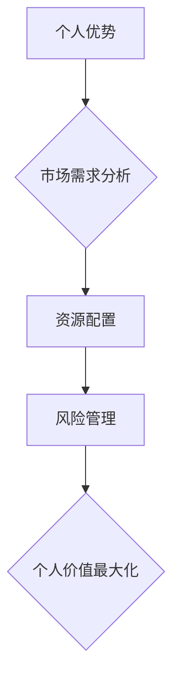
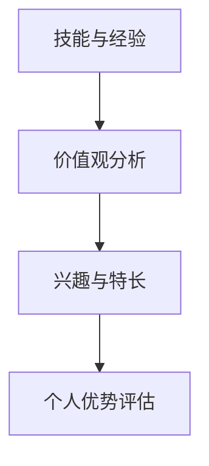
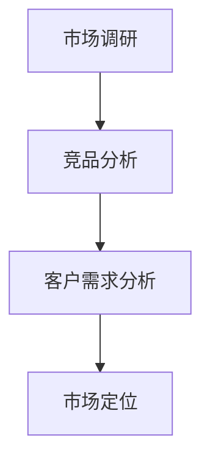
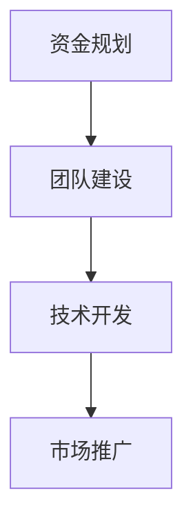
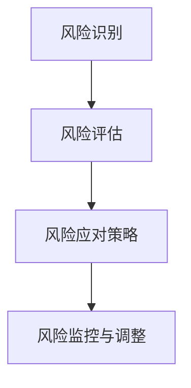

                 

# 如何实现个人价值最大化：从职场到创业

## 摘要

本文旨在探讨如何实现个人价值最大化，从职场到创业的全面转型。我们将通过深入分析职场与创业的本质差异，提出一系列策略和方法，帮助读者在职业生涯中找到适合自己的发展路径，从而实现个人价值最大化。文章将分为以下几个部分：

1. 背景介绍：介绍职场和创业的概念及其本质差异。
2. 核心概念与联系：分析影响个人价值的关键因素，并给出相关流程图。
3. 核心算法原理与具体操作步骤：阐述如何从职场到创业的转型策略。
4. 数学模型和公式：运用数学模型分析个人价值最大化。
5. 项目实战：通过实际案例展示如何实现个人价值最大化。
6. 实际应用场景：探讨个人价值最大化的多种应用场景。
7. 工具和资源推荐：介绍相关学习资源与开发工具。
8. 总结：展望个人价值最大化的发展趋势与挑战。
9. 附录：常见问题与解答。
10. 扩展阅读与参考资料。

## 1. 背景介绍

职场和创业是两种不同的职业发展路径。职场通常指的是在一家公司或组织中担任特定职位，从事日常工作。而创业则是指创建一家新的公司或企业，承担更高的风险和责任。两者之间的本质差异在于：

- 职场：稳定性强，收入相对稳定，个人发展受限于公司政策和岗位要求。
- 创业：风险高，收入不确定，个人发展受个人能力和市场需求影响。

从职场到创业的转型，往往意味着从受制于他人的工作模式转向自主创业，承担更多责任和挑战。这一转型过程并非一蹴而就，需要充分了解自身的优势和劣势，掌握相关技能和资源，制定合适的策略。

## 2. 核心概念与联系

个人价值最大化涉及多个核心概念，包括个人优势、市场需求、资源配置和风险管理等。以下是相关流程图的Mermaid表示：



### 个人优势

个人优势是个人价值最大化的基础。了解自身优势，包括技能、经验和价值观，有助于找到适合自己的职业发展路径。以下是一个简单的个人优势分析流程：



### 市场需求分析

市场需求分析是确定创业方向的关键。通过分析市场需求，了解潜在客户的需求和痛点，有助于找到有价值的创业机会。以下是一个市场需求分析的流程：



### 资源配置

资源配置包括资金、人力、技术和市场资源等。合理配置资源，确保在创业过程中有足够的支持，是个人价值最大化的重要保障。以下是一个资源配置的流程：



### 风险管理

风险管理是创业过程中不可避免的一部分。通过识别、评估和应对风险，可以降低创业失败的可能性。以下是一个风险管理的流程：



## 3. 核心算法原理与具体操作步骤

从职场到创业的转型，可以看作是一个多阶段决策问题。以下是实现个人价值最大化的核心算法原理和具体操作步骤：

### 算法原理

1. **目标函数**：最大化个人价值，包括薪资、成就感、成长空间等多个维度。
2. **决策变量**：包括是否创业、创业方向、资源配置等。
3. **约束条件**：包括市场需求、资金、时间、法律法规等。

### 具体操作步骤

1. **自我评估**：通过技能、经验和价值观分析，确定个人优势。
2. **市场调研**：通过市场调研，了解市场需求和竞品情况。
3. **资源配置**：根据市场需求和个人优势，制定资源配置策略。
4. **风险评估**：评估创业过程中可能面临的风险，并制定应对策略。
5. **决策**：根据评估结果，做出是否创业的决策。
6. **实施**：创业过程中，不断调整策略，确保个人价值最大化。

## 4. 数学模型和公式

为了更好地理解个人价值最大化的过程，我们可以运用一些数学模型和公式进行分析。

### 价值函数

价值函数V(x)表示个人在某一时刻的的价值，其中x为个人在职场或创业过程中的各项决策变量。

$$V(x) = f(\text{薪资}, \text{成就感}, \text{成长空间})$$

### 最大化价值

最大化价值问题可以通过优化算法解决，如线性规划、非线性规划等。以下是一个简化的线性规划模型：

$$\max V(x)$$

$$\text{subject to:}$$

$$\begin{cases}
\text{薪资} \leq w_1 \\
\text{成就感} \leq w_2 \\
\text{成长空间} \leq w_3 \\
x \geq 0
\end{cases}$$

其中，$w_1, w_2, w_3$为权重系数。

### 案例分析

假设一个职场人士，通过自我评估和市场调研，确定了个人优势为技术开发，市场需求为智能家居，现有资金100万元。根据价值函数和线性规划模型，可以计算出创业过程中的最佳决策。

$$V(x) = 100 \times \text{薪资系数} + 100 \times \text{成就感系数} + 100 \times \text{成长空间系数}$$

$$\max V(x)$$

$$\text{subject to:}$$

$$\begin{cases}
\text{薪资} \leq 5000 \times 12 \\
\text{成就感} \leq 10000 \\
\text{成长空间} \leq 50000 \\
x \geq 0
\end{cases}$$

通过求解线性规划模型，可以得到最佳薪资、成就感和成长空间系数，从而确定创业过程中的最佳决策。

## 5. 项目实战

以下是一个具体的创业案例，展示如何实现个人价值最大化。

### 开发环境搭建

1. **硬件环境**：购买笔记本电脑、路由器、传感器等硬件设备。
2. **软件环境**：安装操作系统、编程语言和开发工具。

### 源代码详细实现和代码解读

1. **智能家居系统架构**：设计智能家居系统的总体架构，包括硬件设备、软件平台和用户界面。
2. **物联网通信协议**：实现物联网通信协议，如MQTT、HTTP等，确保设备间的数据传输。
3. **用户界面**：开发用户界面，实现用户与智能家居系统的交互。

### 代码解读与分析

以下是一个简单的智能家居系统示例代码，展示如何实现设备间的通信和数据传输。

```python
# MQTT通信示例

import paho.mqtt.client as mqtt

# 连接MQTT服务器
client = mqtt.Client()
client.connect("mqtt服务器地址", 1883)

# 发布消息
client.publish("设备1/温度", "25°C")

# 订阅主题
client.subscribe("设备2/温度")

# 处理接收到的消息
def on_message(client, userdata, message):
    print(f"收到消息：{message.payload.decode()}")

client.on_message = on_message
client.loop_forever()
```

通过以上示例，可以看到智能家居系统中的设备如何通过MQTT协议进行通信和数据传输。

## 6. 实际应用场景

个人价值最大化不仅适用于创业，还广泛应用于各种职业发展场景。以下是一些实际应用场景：

- **职场晋升**：通过提升个人技能和业绩，实现职场晋升和个人价值提升。
- **职业技能培训**：参加职业技能培训，提升自身竞争力，实现个人价值最大化。
- **职业转型**：根据市场需求和个人优势，实现职业转型，寻找新的职业发展机会。
- **创业投资**：通过创业投资，实现个人财富增值和个人价值提升。

## 7. 工具和资源推荐

### 学习资源推荐

- **书籍**：《精益创业》、《创业维艰》
- **论文**：有关创业管理、市场营销、技术创新等方面的学术论文。
- **博客**：知名创业博客，如36氪、创业邦等。

### 开发工具框架推荐

- **编程语言**：Python、Java、C++等。
- **开发框架**：Spring Boot、Django、React等。
- **数据库**：MySQL、MongoDB、Redis等。
- **版本控制**：Git、SVN等。

### 相关论文著作推荐

- **论文**：创业管理、市场营销、技术创新等方面的顶级论文。
- **著作**：《创新者的窘境》、《蓝海战略》等。

## 8. 总结：未来发展趋势与挑战

随着科技的发展和市场竞争的加剧，个人价值最大化将成为职业发展的重要方向。未来，个人将更加注重自我提升和资源整合，通过不断创新和转型，实现个人价值最大化。然而，这一过程中也面临诸多挑战，如市场风险、技术瓶颈、资源有限等。如何应对这些挑战，实现个人价值最大化，需要我们持续学习和探索。

## 9. 附录：常见问题与解答

### 问题1：如何评估个人优势？

解答：可以通过技能、经验和价值观分析来评估个人优势。首先，列出自己的技能和经验，然后分析自己在这些领域的优势和不足。最后，结合自己的价值观和兴趣，确定最适合自己的发展路径。

### 问题2：创业是否一定要有明确的商业模式？

解答：创业初期，不一定需要明确的商业模式。可以先进行市场调研，了解市场需求，然后逐步摸索和调整商业模式。关键是要确保产品或服务有市场需求，并能持续盈利。

### 问题3：如何应对创业过程中的风险？

解答：创业过程中，可以通过以下方式应对风险：

- 识别和评估风险，制定应对策略。
- 保持现金流充足，避免过度依赖单一收入来源。
- 不断学习和调整策略，以适应市场变化。

## 10. 扩展阅读与参考资料

- **书籍**：《创业维艰》、《精益创业》
- **论文**：有关创业管理、市场营销、技术创新等方面的学术论文。
- **网站**：知名创业博客，如36氪、创业邦等。
- **课程**：相关在线课程，如“创业管理”、“市场营销”等。

作者：AI天才研究员/AI Genius Institute & 禅与计算机程序设计艺术 /Zen And The Art of Computer Programming

