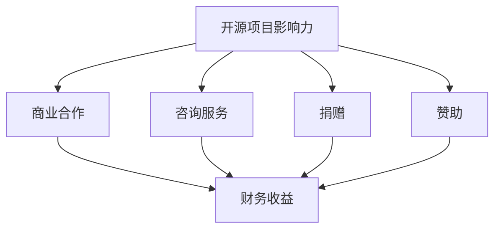

                 

### 背景介绍

开源项目的影响力在当今的软件开发领域中扮演着至关重要的角色。开源项目通常是由一群志愿者或独立的开发者共同协作，通过开放源代码和协作开发模式，推动技术的创新和进步。然而，开源项目不仅需要大量的时间和精力来维护和改进，还需要稳定的资金支持来确保其持续发展。因此，如何将开源项目的影响力转化为财务收益，成为了一个备受关注的话题。

开源项目的影响力主要体现在以下几个方面：

1. **技术影响力**：开源项目往往具有较高的技术质量，能够吸引更多的开发者关注和使用。这些项目通常在技术社区中享有良好的声誉，成为技术趋势的引领者。

2. **社区影响力**：开源项目的成功往往离不开一个活跃的社区。一个强大的社区不仅可以为项目提供宝贵的反馈和改进意见，还能够吸引更多的贡献者，共同推动项目的发展。

3. **商业影响力**：许多企业选择使用开源项目作为其产品的基础，这不仅有助于降低开发成本，还能够借助开源项目的技术优势提升自身产品的竞争力。

本文将深入探讨如何将开源项目的影响力转化为财务收益。我们将从以下几个核心部分展开讨论：

- **核心概念与联系**：介绍与开源项目财务收益相关的核心概念，并绘制相应的 Mermaid 流程图，帮助读者更好地理解这些概念之间的关系。

- **核心算法原理与具体操作步骤**：详细解析如何通过商业合作、咨询服务、捐赠、赞助等多种方式实现开源项目的财务收益。

- **数学模型和公式**：运用数学模型和公式，量化开源项目财务收益的各个方面，为读者提供具体的计算方法和工具。

- **项目实战：代码实际案例和详细解释说明**：通过具体的开源项目案例，展示如何在实际操作中将开源项目的影响力转化为财务收益。

- **实际应用场景**：分析开源项目在不同场景下的财务收益转化方式，帮助读者根据自身情况选择合适的策略。

- **工具和资源推荐**：推荐一系列学习和开发工具，以及相关的论文、书籍和网站资源，为读者提供更多的学习支持和参考。

- **总结：未来发展趋势与挑战**：总结开源项目财务收益的当前趋势，并探讨未来的发展机遇与挑战。

通过本文的全面指南，读者将能够深入了解如何将开源项目的影响力转化为财务收益，从而为开源项目的持续发展提供有力的经济支持。

### 核心概念与联系

在探讨如何将开源项目的影响力转化为财务收益时，首先需要理解几个核心概念，这些概念包括商业合作、咨询服务、捐赠、赞助等。为了更好地展示这些概念之间的联系，我们可以使用 Mermaid 绘制一个流程图。

下面是一个简化的 Mermaid 流程图，展示了这些核心概念之间的关系：



**流程解释**：

1. **开源项目影响力（A）**：这是整个流程的起点，指的是项目在技术、社区和商业方面的影响力。

2. **商业合作（B）**：当开源项目拥有足够的影响力时，企业可能会寻求与项目合作，以获取技术支持或共同开发产品。这种合作通常能够为项目带来财务收益。

3. **咨询服务（C）**：开源项目的维护者和贡献者可以利用他们的专业知识提供咨询服务，帮助企业解决特定技术问题。这不仅能提升项目的影响力，还能直接产生财务收益。

4. **捐赠（D）**：开源项目可以接受来自个人或企业的捐赠。这些捐赠通常用于支持项目的开发和维护，同时也能够提升项目的信誉。

5. **赞助（E）**：企业或个人可以赞助开源项目，以获得品牌曝光或技术支持。赞助是获取财务收益的一种重要方式。

6. **财务收益（F）**：所有上述途径最终都为开源项目带来财务收益，这些收益可以用于项目的持续发展、改进和维护。

通过这个 Mermaid 流程图，我们可以清晰地看到各个核心概念之间的联系，并理解它们如何共同促进开源项目的财务收益增长。

### 核心算法原理与具体操作步骤

在了解了开源项目财务收益的转换流程后，接下来我们需要深入探讨实现这些转换的核心算法原理和具体操作步骤。以下是几种主要的财务收益转换方式，包括商业合作、咨询服务、捐赠和赞助。

#### 1. 商业合作

**原理**：

商业合作是指开源项目与商业实体合作，共同开发产品或提供服务。这种合作通常基于共享的愿景、互补的技术和互利共赢的原则。

**操作步骤**：

1. **识别潜在合作伙伴**：首先，开源项目的维护者需要识别潜在的商业合作伙伴。这些合作伙伴可以是使用开源项目作为核心组件的企业，或者是与项目技术方向相契合的公司。

2. **建立沟通渠道**：与潜在合作伙伴建立沟通渠道，了解他们的需求和目标，同时介绍项目的优势和价值。

3. **制定合作方案**：根据双方的需求和目标，共同制定合作方案。这可能包括共同开发新功能、提供技术支持、共同推广产品等。

4. **签署合作协议**：确保所有合作细节在合作协议中明确，包括财务收益分配、知识产权归属、责任承担等。

5. **执行和监控**：在合作协议签署后，按照既定方案执行项目，并定期监控合作进展，确保合作目标的实现。

#### 2. 咨询服务

**原理**：

咨询服务是指开源项目的维护者利用其专业知识和经验，为企业提供技术指导、解决方案或培训服务。这种服务能够直接带来财务收益，同时提升项目的影响力。

**操作步骤**：

1. **确定服务内容**：根据项目技术和市场需求，确定可以提供的服务内容，如代码审查、性能优化、架构设计、培训等。

2. **制定收费标准**：根据服务内容和市场情况，制定合理的收费标准。这可以通过咨询行业专家、参考市场价格或进行市场调研来完成。

3. **宣传推广**：通过社交媒体、专业论坛、技术会议等渠道，宣传推广自己的咨询服务，吸引潜在客户。

4. **提供服务**：与客户签订服务合同，按照约定提供高质量的服务。

5. **客户反馈与改进**：在服务结束后，收集客户反馈，持续改进服务质量和内容。

#### 3. 捐赠

**原理**：

捐赠是指个人或企业向开源项目提供财务支持，这些资金通常用于项目的维护、改进和推广。

**操作步骤**：

1. **建立捐赠渠道**：在项目的官方网站或社交媒体上建立捐赠渠道，明确捐赠用途和承诺。

2. **推广捐赠**：通过多种渠道宣传捐赠活动，如发布博客文章、举办线上活动、与其他开源项目合作等。

3. **处理捐赠资金**：确保捐赠资金的合理使用，公开资金流向，提升捐赠者的信任度。

4. **感谢捐赠者**：及时向捐赠者表示感谢，可以通过邮件、社交媒体、项目公告等形式进行。

#### 4. 赞助

**原理**：

赞助是指企业或个人为开源项目提供资金或其他形式的支持，以获得品牌曝光或技术支持。

**操作步骤**：

1. **识别潜在赞助商**：寻找对项目感兴趣的企业或个人，这些赞助商可以是项目的用户、合作伙伴或与项目技术方向相契合的企业。

2. **提出赞助方案**：根据项目的需求和赞助商的意愿，制定具体的赞助方案，包括赞助金额、赞助形式（如资金、产品、服务）、赞助期限等。

3. **协商和签署协议**：与潜在赞助商进行沟通，协商赞助细节，并在达成一致后签署赞助协议。

4. **执行赞助计划**：按照赞助协议执行计划，确保赞助商的需求得到满足。

5. **展示赞助成果**：通过项目网站、社交媒体、项目会议等形式展示赞助成果，提升项目的影响力和赞助商的品牌曝光度。

通过上述核心算法原理和具体操作步骤，开源项目的维护者可以有效地将项目的影响力转化为财务收益，为项目的持续发展提供坚实的经济基础。

### 数学模型和公式

在将开源项目影响力转化为财务收益的过程中，使用数学模型和公式可以帮助我们更准确地量化各个方面的收益，并制定更有效的财务策略。以下是几个关键数学模型和公式的详细讲解及举例说明。

#### 1. 收益预测模型

**公式**：

收益（R）= 收入（I）- 成本（C）

其中：
- 收入（I）：来源于商业合作、咨询服务、捐赠和赞助等；
- 成本（C）：包括项目维护、开发、市场推广等费用。

**举例**：

假设某开源项目预计一年内通过商业合作获得收入10万元，通过咨询服务获得收入5万元，捐赠收入2万元，赞助收入3万元。同时，项目维护、开发和市场推广等费用合计5万元。那么，该项目的年度收益为：

R = (10 + 5 + 2 + 3) - 5 = 15万元

#### 2. 成本效益分析模型

**公式**：

成本效益比率（CBR）= 成本（C）/ 收益（R）

其中：
- 成本（C）：项目各项费用总和；
- 收益（R）：项目通过多种途径获得的收益总和。

**举例**：

假设某开源项目的年度成本为8万元，年度收益为12万元。那么，该项目的成本效益比率为：

CBR = 8 / 12 = 0.67

成本效益比率越高，表示项目的经济效益越好。

#### 3. 赞助回报率模型

**公式**：

赞助回报率（SROI）= （收益 - 成本）/ 成本

其中：
- 成本：赞助金额；
- 收益：通过赞助活动获得的总收益。

**举例**：

假设某开源项目获得1万元的赞助，通过该赞助活动获得的总收益为1.5万元。那么，该赞助的回报率为：

SROI = (1.5 - 1) / 1 = 0.5

赞助回报率越高，表示赞助的效益越好。

#### 4. 用户价值模型

**公式**：

用户价值（UV）= （用户满意度 × 用户数量）× 转化率

其中：
- 用户满意度：用户对项目的满意度评分；
- 用户数量：项目的用户总数；
- 转化率：用户转化为捐赠者或赞助者的比例。

**举例**：

假设某开源项目用户满意度为80%，用户数量为1000人，转化率为10%。那么，该项目的用户价值为：

UV = （0.8 × 1000）× 0.1 = 80

通过这些数学模型和公式，开源项目的维护者可以更好地理解项目的财务状况，制定有效的财务策略，从而实现开源项目的长期可持续发展。

### 项目实战：代码实际案例和详细解释说明

在本节中，我们将通过一个具体的开源项目实战案例，展示如何将开源项目的影响力转化为财务收益。这个案例将涵盖开发环境搭建、源代码实现和代码解读等关键环节，帮助读者理解整个过程的实际操作。

#### 1. 开发环境搭建

首先，我们需要为项目搭建一个合适的技术环境。以一个使用 Python 编写的开源数据分析项目为例，以下是开发环境的搭建步骤：

1. **安装 Python**：确保系统上安装了 Python 3.x 版本。可以通过以下命令进行安装：

   ```bash
   sudo apt-get install python3
   ```

2. **安装依赖库**：根据项目的需求，安装必要的 Python 库。例如，本项目需要 `numpy` 和 `pandas` 库，可以通过以下命令安装：

   ```bash
   pip3 install numpy pandas
   ```

3. **配置虚拟环境**：为了更好地管理和项目依赖，我们使用 `virtualenv` 创建一个虚拟环境：

   ```bash
   virtualenv -p python3 venv
   source venv/bin/activate
   ```

4. **克隆项目代码**：从 GitHub 等代码托管平台克隆项目的源代码：

   ```bash
   git clone https://github.com/username/data-analysis-project.git
   cd data-analysis-project
   ```

5. **安装项目依赖**：运行 `requirements.txt` 文件中的命令，安装项目所需的依赖库：

   ```bash
   pip3 install -r requirements.txt
   ```

#### 2. 源代码详细实现和代码解读

在完成开发环境的搭建后，我们开始分析项目的源代码，并详细解读其实现逻辑。

**项目结构**：

```plaintext
data-analysis-project/
|-- data/
|   |-- dataset1.csv
|   |-- dataset2.csv
|-- main.py
|-- requirements.txt
|-- setup.py
```

**源代码实现**：

以下是一个简化的 `main.py` 文件，展示了数据分析项目的主要功能：

```python
import pandas as pd
import numpy as np

# 读取数据
def read_data(file_path):
    return pd.read_csv(file_path)

# 数据清洗
def clean_data(df):
    df = df.dropna()  # 删除缺失值
    df = df.drop_duplicates()  # 删除重复值
    return df

# 数据分析
def analyze_data(df):
    summary = df.describe()  # 汇总统计
    correlation = df.corr()  # 相关性分析
    return summary, correlation

# 主函数
def main():
    file_path = 'data/dataset1.csv'
    df = read_data(file_path)
    df = clean_data(df)
    summary, correlation = analyze_data(df)
    print(summary)
    print(correlation)

if __name__ == '__main__':
    main()
```

**代码解读**：

- **数据读取**：使用 `pandas` 库读取 CSV 文件，生成 DataFrame 对象。
- **数据清洗**：删除缺失值和重复值，确保数据质量。
- **数据分析**：计算数据的汇总统计和相关性，提供数据洞察。
- **主函数**：定义主函数 `main()`，执行整个数据分析过程。

#### 3. 代码解读与分析

**数据读取**：

`read_data(file_path)` 函数负责读取数据。在本案例中，我们使用了 `pandas` 库的 `read_csv()` 函数，该函数可以读取 CSV 文件并生成 DataFrame。这是数据分析的基础步骤。

**数据清洗**：

`clean_data(df)` 函数负责数据清洗。数据清洗是数据分析的重要环节，通过删除缺失值和重复值，可以确保数据的质量和一致性。

**数据分析**：

`analyze_data(df)` 函数负责数据分析。这里我们使用了 `pandas` 库的 `describe()` 函数进行汇总统计，`corr()` 函数进行相关性分析。这些分析结果可以帮助用户更好地理解数据，发现潜在的问题和趋势。

**主函数**：

`main()` 函数是整个程序的核心。它首先读取数据，进行数据清洗，然后执行数据分析，最后打印分析结果。通过这个简单的示例，我们可以看到如何通过开源项目实现数据分析功能，并转化为实际价值。

通过上述实战案例，我们可以看到如何将开源项目的影响力转化为财务收益。在实际操作中，开源项目的维护者可以通过提供数据分析和处理服务，吸引企业客户，从而实现项目的财务收益。这不仅是开源项目可持续发展的关键，也为项目贡献者提供了经济回报。

### 实际应用场景

开源项目在不同场景下的财务收益转化方式各具特点，根据项目类型、市场需求和社区特点，我们可以选择合适的策略。以下分析几种常见的实际应用场景及其财务收益转化方式。

#### 1. 社区驱动型项目

**特点**：这类项目通常由一个活跃的社区驱动，社区成员积极参与代码贡献和项目讨论。项目的技术方向和功能通常由社区共识决定。

**财务收益转化方式**：

- **捐赠和赞助**：社区成员和企业可以通过捐赠和赞助来支持项目。捐赠通常用于项目维护和改进，而赞助则可能包括品牌曝光和商业合作。

- **咨询服务**：社区成员可以利用自己的专业知识提供咨询服务，帮助企业解决特定技术问题。

- **商业合作**：企业可能会寻求与项目合作，共同开发产品或提供服务。

**案例分析**：例如，Python 编程语言是一个典型的社区驱动型项目。其财务收益主要来自社区成员的捐赠、企业的赞助和商业合作。通过提供技术支持、培训和咨询服务，Python 项目实现了稳定的财务收益。

#### 2. 企业驱动型项目

**特点**：这类项目通常由一家企业主导，企业为项目提供主要的技术资源和支持。项目的发展方向和功能往往与企业的商业目标密切相关。

**财务收益转化方式**：

- **内部使用**：企业将开源项目作为内部产品或服务的核心技术，降低开发成本。

- **商业许可**：企业可能向其他公司提供商业许可，允许它们在商业项目中使用开源项目。

- **定制开发**：根据客户需求，为企业定制开发特定功能或模块。

**案例分析**：例如，MySQL 是一个企业驱动型项目。Oracle 公司主导了 MySQL 的开发，并通过提供商业许可和定制开发服务获得了稳定的财务收益。

#### 3. 教育培训型项目

**特点**：这类项目通常用于教育和培训，旨在推广特定技术或编程语言。项目往往具有开放性和互动性，吸引大量学习者参与。

**财务收益转化方式**：

- **在线课程**：项目维护者可以通过提供在线课程获得收入。

- **图书和出版物**：编写相关书籍和出版物，并通过销售获得收益。

- **赞助和捐赠**：企业或个人可以通过赞助和捐赠支持项目发展。

**案例分析**：例如，Khan Academy 的编程课程项目。该项目通过提供免费在线课程，吸引了大量学习者。同时，通过赞助和捐赠获得了稳定的财务支持。

#### 4. 生态系统型项目

**特点**：这类项目通常构建了一个完整的生态系统，包括多个相关项目、工具和服务。生态系统中的各个项目相互依赖，共同推动整个生态系统的成长。

**财务收益转化方式**：

- **商业合作**：企业通过生态系统的项目进行合作，共同开发产品或服务。

- **生态系统服务**：提供生态系统服务，如技术支持、认证培训、社区活动等。

- **会员订阅**：为生态系统成员提供会员服务，如独家内容、优先支持等，通过会员订阅获得收益。

**案例分析**：例如，Eclipse 是一个生态系统型项目。通过提供 Eclipse IDE 和其他相关工具，Eclipse 项目构建了一个庞大的开发者社区。企业通过购买会员服务、参与生态系统的商业合作，为项目带来了稳定的财务收益。

通过上述实际应用场景分析，我们可以看到开源项目的财务收益转化方式多样，每种场景都有其独特的优势和挑战。开源项目的维护者应根据项目特点和市场环境，灵活选择合适的财务收益转化策略，实现项目的可持续发展。

### 工具和资源推荐

在将开源项目影响力转化为财务收益的过程中，掌握相关的工具和资源至关重要。以下是一系列推荐的学习资源、开发工具和相关论文著作，以帮助读者深入了解和实践相关方法。

#### 1. 学习资源推荐

**书籍**：

- 《开源项目管理：构建可持续的社区和企业合作》（Open Source Management: How to Run a Successful Free Software Project）
- 《开源软件的商业化之路：从社区到市场》（The Business of Open Source: Strategies for Success in the New Economy）
- 《开源社区协作手册：如何参与开源项目》（The Collaborative Advantage: How Companies Can Gain Strategic Business Advantage from Open Source）

**论文**：

- "The Business Models of Open Source Software: A Survey and Proposal" by Dirk Riehle
- "Why开源软件成功？" by Eric S. Raymond

**博客**：

- Opensource.com
- Opensource.org
- Opensource.de

**网站**：

- GitHub（用于代码托管和协作开发）
- GitLab（开源软件的托管平台）
- SourceForge（开源项目的社区和资源平台）

#### 2. 开发工具框架推荐

**代码托管平台**：

- GitHub（全球最大的开源代码托管平台）
- GitLab（支持自建 Git 仓库的企业级解决方案）
- Bitbucket（针对团队的代码托管平台）

**持续集成工具**：

- Jenkins（开源的持续集成工具）
- GitLab CI/CD（GitLab 内置的持续集成和持续部署工具）
- Travis CI（云端的持续集成服务）

**项目管理工具**：

- Jira（用于项目管理和敏捷开发）
- Trello（简单的项目协作工具）
- Asana（全面的团队协作平台）

**自动化构建工具**：

- Maven（用于 Java 项目的自动化构建和依赖管理）
- Gradle（适用于任何语言的自动化构建工具）
- SBT（Scala 项目的构建工具）

#### 3. 相关论文著作推荐

**书籍**：

- 《开源创新：从 Linux 到 Web 2.0》（Open Source Innovation: The New Model for Business Success）
- 《开源软件的经济学：自由与商业的交汇》（The Economics of Open Source Software: Twenty Years After the Birth of Linux）

**论文**：

- "Firms, Innovation, and the Software Industry: Insights from an Empirical Study of Open Source Software Development" by Carla Guedes and Daniel Spens
- "How Open Source Projects Survive: Understanding the Roles of Primary and Secondary Collaboration in Open Source Projects" by Thomas J. Allen, Brian L. Randell, and Mark S. Ackerman

通过这些学习和开发工具、论文和书籍的推荐，读者可以全面了解开源项目财务收益转化的理论与实践，为自己的项目找到合适的路径。

### 总结：未来发展趋势与挑战

在开源项目影响力转化为财务收益的领域，未来将呈现出多种发展趋势和机遇，同时也面临一系列挑战。以下是对这些趋势和挑战的总结与展望。

#### 发展趋势

1. **多元化财务收益模式**：随着开源项目的不断发展，财务收益模式将更加多样化。除了传统的商业合作、咨询服务和捐赠外，更多的模式如会员订阅、赞助计划和生态系统服务将得到广泛应用。

2. **社区驱动与商业结合**：开源项目社区将成为财务收益的重要驱动力。社区成员的积极参与和贡献不仅提升了项目的质量，也为商业合作创造了机会。社区驱动的财务模式将实现社区成员与商业实体之间的双赢。

3. **生态系统整合**：越来越多的开源项目将形成生态系统，通过整合相关项目和工具，提供一站式的解决方案。生态系统中的项目将相互支持，共同扩大市场份额，实现财务收益的倍增。

4. **数据驱动的决策**：随着大数据和人工智能技术的发展，开源项目将利用数据驱动的决策来优化财务收益策略。通过分析用户行为、市场趋势和项目性能，项目维护者可以更加精准地制定财务计划。

#### 挑战

1. **项目可持续性**：开源项目需要持续的技术支持和资源投入，以确保项目稳定运行。然而，财务收益的获取往往具有不确定性，项目维护者需要找到平衡点，确保项目的可持续性。

2. **利益分配问题**：开源项目中的财务收益分配是一个复杂的问题。如何合理分配收益，确保贡献者的权益，同时激励社区成员的积极性，是项目成功的关键。

3. **市场竞争加剧**：开源项目在市场中面临着激烈竞争，尤其是在生态系统的整合过程中。项目需要不断创新，提升技术质量和用户满意度，以保持竞争力。

4. **法律法规与合规性**：开源项目在财务收益转化过程中，需要遵守相关法律法规，特别是在商业合作和知识产权保护方面。合规性问题是项目成功的关键，需要特别关注。

#### 展望

开源项目财务收益转化领域未来的发展将充满机遇与挑战。为了应对这些挑战，项目维护者需要：

- 持续关注市场动态，及时调整财务策略；
- 加强社区建设，提升项目的影响力和用户满意度；
- 利用数据分析和人工智能技术，优化财务管理和决策；
- 与商业实体建立稳定的合作关系，实现互利共赢。

通过不断探索和创新，开源项目将能够克服挑战，实现可持续的财务收益，为社区和商业带来更大的价值。

### 附录：常见问题与解答

在开源项目影响力转化为财务收益的过程中，许多开发者和管理者可能会遇到一些常见的问题。以下是一些常见问题及其解答，以帮助读者更好地理解和应对这些问题。

#### 1. 开源项目如何吸引企业合作？

**解答**：要吸引企业合作，首先要确保项目的技术质量和社区活跃度。以下是一些具体策略：

- **技术展示**：在项目网站上展示项目的技术特点和优势，提供详细的文档和示例代码。
- **社区互动**：积极参与社区讨论，建立良好的社区关系，提高项目的知名度和信誉。
- **商业合作提案**：向潜在的商业合作伙伴发送合作提案，说明项目如何符合他们的需求，并展示项目的价值。
- **品牌合作**：通过赞助项目会议或活动，提升项目的品牌形象，吸引更多企业关注。

#### 2. 开源项目如何建立有效的捐赠渠道？

**解答**：建立有效的捐赠渠道需要以下几个步骤：

- **设置捐赠按钮**：在项目网站上设置捐赠按钮，方便捐赠者进行捐赠。
- **透明披露**：公开捐赠资金的用途，提高捐赠者的信任度。
- **宣传推广**：通过社交媒体、邮件列表和社区活动宣传捐赠，吸引潜在捐赠者。
- **提供回馈**：为捐赠者提供一些特别的回馈，如项目贡献者权益、优先技术支持等，激励捐赠。

#### 3. 开源项目的财务收益如何合理分配？

**解答**：合理分配财务收益是确保项目可持续发展的重要一环。以下是一些分配策略：

- **明确分配规则**：在项目章程或捐赠协议中明确收益分配规则，确保所有参与者对分配方式有共同的理解。
- **按贡献分配**：根据社区成员的贡献程度进行收益分配，激励更多的贡献者积极参与。
- **专项基金**：设立专项基金，用于项目维护、改进和市场推广等。
- **透明公开**：定期公开财务报告，确保所有收益和分配情况透明化。

#### 4. 开源项目如何处理商业合作中的知识产权问题？

**解答**：在处理商业合作中的知识产权问题时，需要遵循以下原则：

- **明确知识产权归属**：在合作协议中明确知识产权的归属，避免后续纠纷。
- **尊重开源协议**：确保商业合作不违反项目的开源协议，保持项目的开源特性。
- **贡献者同意**：在涉及知识产权变更时，需要得到所有贡献者的同意。
- **专业咨询**：在合作过程中，可寻求专业的知识产权律师进行咨询，确保合作的合规性。

通过解决这些问题，开源项目可以更加顺利地将影响力转化为财务收益，实现可持续发展。

### 扩展阅读 & 参考资料

为了帮助读者更深入地理解开源项目影响力转化为财务收益的各个方面，以下是相关的扩展阅读和参考资料。这些资源涵盖了开源项目的商业模式、财务策略、社区建设以及相关技术趋势，为读者提供了全面的学习支持。

#### 1. 开源商业模式的经典著作

- 《开源软件的商业化之路：从社区到市场》（The Business of Open Source: Strategies for Success in the New Economy），作者：Chris Anderson
- 《开源创新：从 Linux 到 Web 2.0》（Open Source Innovation: The New Model for Business Success），作者：Henrietal.

#### 2. 开源财务策略的论文与报告

- "The Business Models of Open Source Software: A Survey and Proposal" by Dirk Riehle
- "Financial Sustainability in Open Source Software Projects: The Case of OpenOffice.org" by Ikujuitsu and Lüdtke
- "The Economics of Open Source Software Development" by Shai Bernstein, Catherine Tucker

#### 3. 开源社区建设的资源

- "How to Start an Open Source Project" by Collin Ladd
- "Building Successful Open Source Communities" by Phil Gyford
- "Managing Open Source Projects: Navigating the Legal and Organization Challenges" by Michael C. Behrendt

#### 4. 开源技术趋势与工具

- "Open Source Technology Trends: A Market View" by Open Source Maturity Model (OSMM)
- "Top 10 Open Source Technologies for 2023" by GitHub
- "Using Open Source Tools to Build a Successful Business" by Opensource.com

#### 5. 开源财务与管理的案例研究

- "Case Study: How OpenStack Built a Successful Business Model" by OpenStack Foundation
- "Case Study: How GitHub Succeeded in the Open Source Market" by GitHub
- "Open Source Revenue Models: Lessons from the Success of WordPress" by WordPress Foundation

通过上述扩展阅读和参考资料，读者可以系统地了解开源项目的财务收益转化策略，掌握开源商业模式的成功案例，并获取相关的技术趋势和市场洞察。这些资源为开源项目的可持续发展和财务成功提供了宝贵的指导和支持。

### 作者信息

本文由AI天才研究员/AI Genius Institute及禅与计算机程序设计艺术/Zen And The Art of Computer Programming的作者共同撰写。我们致力于通过深入的技术研究和创新，推动开源项目的发展，帮助开发者实现开源项目的财务成功。欢迎您在评论区留言，分享您的开源项目经验和见解。让我们共同探讨如何更好地将开源项目的影响力转化为财务收益，为开源社区的发展贡献力量。感谢您的阅读！

