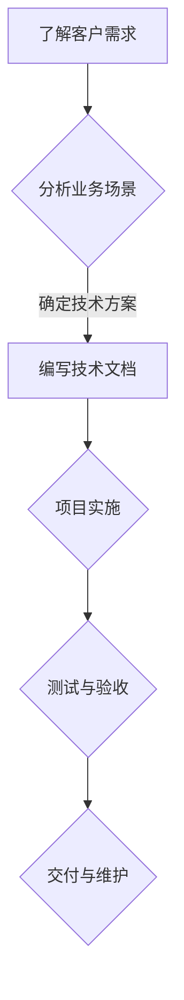

                 

# 如何将编程技能转化为咨询服务

## 摘要

在信息技术飞速发展的今天，编程技能已成为众多行业必备的基本素养。然而，如何将编程技能转化为有价值的咨询服务，为企业和个人带来实际效益，是许多程序员和技术专家面临的挑战。本文旨在探讨如何有效利用编程技能提供咨询服务，从背景介绍、核心概念、算法原理到实际应用，为读者提供一套完整的实战指南。通过本文的阐述，读者将了解到如何从零开始构建咨询服务，以及如何在实际项目中运用编程技能，实现个人职业价值的提升。

## 1. 背景介绍

随着数字化转型的深入推进，企业对技术服务的需求不断增加。程序员和技术专家们不仅需要具备出色的编程能力，还需要具备将技术转化为实际业务价值的综合素养。将编程技能转化为咨询服务，不仅能够帮助个人实现职业发展，更能够为企业提供高效、定制化的解决方案。

### 当前趋势

- **云计算与大数据**: 随着云计算和大数据技术的普及，企业需要更多的技术专家来帮助他们构建和优化云基础设施，处理海量数据。
- **人工智能与机器学习**: 人工智能技术正在渗透到各个行业，企业需要AI专家来提供从数据预处理到模型部署的全流程服务。
- **区块链**: 区块链技术的发展带动了对区块链开发和技术咨询的需求，尤其是在金融和供应链管理领域。

### 服务形式

- **技术咨询**: 提供企业发展战略、技术选型、架构设计的咨询服务。
- **软件开发**: 根据企业需求，定制开发软件系统，包括后端服务、前端界面和移动应用。
- **系统维护与升级**: 提供现有系统的维护、升级和技术支持。
- **培训与教育**: 为企业内部技术人员提供编程培训和技术讲座。

## 2. 核心概念与联系

### 编程技能

- **编程语言**: 如Python、Java、C++等。
- **数据库知识**: 如MySQL、MongoDB等。
- **前端技术**: 如HTML、CSS、JavaScript等。
- **后端技术**: 如Node.js、Django、Spring等。

### 咨询服务

- **业务理解**: 深入了解客户业务，提供符合实际需求的解决方案。
- **项目管理**: 确保项目按时交付，预算可控。
- **沟通协调**: 与客户、团队成员有效沟通，确保项目顺利进行。

### Mermaid 流程图



## 3. 核心算法原理 & 具体操作步骤

### 编程技能转化步骤

1. **自我评估**: 确定自己的编程技能优势，选择合适的服务方向。
2. **市场调研**: 了解市场需求，找到目标客户群体。
3. **制定服务策略**: 确定服务内容、定价模式和营销策略。
4. **品牌建设**: 建立个人或公司的品牌形象，提升知名度。
5. **提供服务**: 根据客户需求，提供定制化的技术服务。
6. **持续优化**: 根据客户反馈，不断优化服务质量和效率。

### 具体操作步骤

1. **技能提升**:
    - **理论学习**: 阅读相关书籍和在线教程，加深对编程语言和技术的理解。
    - **实践操作**: 通过实际项目锻炼编程技能，提高解决问题的能力。

2. **业务拓展**:
    - **建立人脉**: 参加技术会议、论坛和社群，扩大业务网络。
    - **社交媒体**: 利用LinkedIn、Twitter等平台展示自己的专业知识和项目经验。

3. **咨询服务**:
    - **需求分析**: 与客户深入沟通，明确项目目标和需求。
    - **方案设计**: 根据需求，设计可行的技术方案。
    - **项目实施**: 按照设计方案，开展项目实施。
    - **交付验收**: 完成项目后，与客户进行验收。

## 4. 数学模型和公式 & 详细讲解 & 举例说明

### 数学模型

- **成本效益分析**:
    - **收益模型**: R = P × Q
        - R: 收益
        - P: 单价
        - Q: 销量
    - **成本模型**: C = F + (V × Q)
        - C: 总成本
        - F: 固定成本
        - V: 变动成本
        - Q: 销量

### 详细讲解

- **收益模型**说明了在固定单价和销量不变的情况下，如何计算总收益。
- **成本模型**则考虑了固定成本和变动成本的影响，提供了更全面的成本计算方法。

### 举例说明

假设一家公司提供技术咨询服务的单价为1000元/小时，每月工作时间20小时。固定成本为每月5000元，变动成本为每小时200元。计算该公司每月的预期收益和总成本。

1. **收益**:
    - R = P × Q = 1000元/小时 × 20小时 = 20000元

2. **总成本**:
    - C = F + (V × Q) = 5000元 + (200元/小时 × 20小时) = 9000元

3. **利润**:
    - 利润 = 收益 - 成本 = 20000元 - 9000元 = 11000元

## 5. 项目实战：代码实际案例和详细解释说明

### 5.1 开发环境搭建

为了实现一个简单的客户管理系统，我们选择Python作为开发语言，并使用SQLite作为数据库。以下是搭建开发环境的基本步骤：

1. 安装Python:
    ```bash
    sudo apt-get install python3
    ```

2. 安装SQLite:
    ```bash
    sudo apt-get install sqlite3
    ```

3. 安装相关Python库：
    ```bash
    pip3 install Flask
    pip3 install SQLAlchemy
    ```

### 5.2 源代码详细实现和代码解读

以下是客户管理系统的基本代码实现，包括数据库设计、API接口和业务逻辑。

```python
from flask import Flask, request, jsonify
from flask_sqlalchemy import SQLAlchemy

app = Flask(__name__)
app.config['SQLALCHEMY_DATABASE_URI'] = 'sqlite:///customers.db'
db = SQLAlchemy(app)

class Customer(db.Model):
    id = db.Column(db.Integer, primary_key=True)
    name = db.Column(db.String(100), nullable=False)
    email = db.Column(db.String(120), nullable=False, unique=True)
    phone = db.Column(db.String(20))

@app.route('/customers', methods=['POST'])
def add_customer():
    data = request.get_json()
    new_customer = Customer(name=data['name'], email=data['email'], phone=data['phone'])
    db.session.add(new_customer)
    db.session.commit()
    return jsonify({'message': 'Customer added successfully.'})

@app.route('/customers', methods=['GET'])
def get_customers():
    customers = Customer.query.all()
    return jsonify [{'id': customer.id, 'name': customer.name, 'email': customer.email, 'phone': customer.phone} for customer in customers]

if __name__ == '__main__':
    db.create_all()
    app.run(debug=True)
```

- **数据库设计**: 定义了`Customer`模型，包含客户ID、姓名、电子邮件和电话号码。
- **API接口**: 提供了添加客户和获取所有客户的接口。
- **业务逻辑**: 实现了添加客户和获取客户信息的业务逻辑。

### 5.3 代码解读与分析

- **数据库连接**: 使用SQLAlchemy库连接到SQLite数据库，并定义了`Customer`模型。
- **API实现**: 使用Flask框架实现RESTful API接口，方便前后端分离的开发模式。
- **业务逻辑**: 通过POST请求添加客户，通过GET请求获取客户列表。

## 6. 实际应用场景

### 企业内部系统优化

- **业务需求**: 企业需要优化现有客户管理系统，提高数据处理效率。
- **解决方案**: 通过分析现有系统，提出优化方案，包括数据库优化、API性能调优等。
- **成果**: 提高系统性能，降低维护成本，提升用户体验。

### 创业公司技术支持

- **业务需求**: 创业公司需要快速搭建一套客户管理系统，支持业务扩展。
- **解决方案**: 提供定制化开发服务，快速搭建系统，并根据业务发展进行迭代。
- **成果**: 帮助创业公司节省开发成本，加速业务上线。

### 技术培训与咨询

- **业务需求**: 企业内部技术人员需要提升编程技能和系统优化能力。
- **解决方案**: 提供编程培训和咨询服务，帮助企业提升技术实力。
- **成果**: 提高企业内部技术人员的技术水平，提升整体工作效率。

## 7. 工具和资源推荐

### 7.1 学习资源推荐

- **书籍**:
  - 《Effective Java》
  - 《深度学习》
  - 《软件架构：实践者的研究方法》

- **论文**:
  - 《The Art of Software Architecture》
  - 《Big Data: A Revolution That Will Transform How We Live, Work, and Think》

- **博客**:
  - [Python官网博客](https://www.python.org/blogs/)
  - [GitHub官方博客](https://github.blog/)

- **网站**:
  - [Stack Overflow](https://stackoverflow.com/)
  - [Free Code Camp](https://www.freecodecamp.org/)

### 7.2 开发工具框架推荐

- **编程语言**:
  - Python
  - JavaScript
  - Java

- **数据库**:
  - MySQL
  - MongoDB
  - PostgreSQL

- **前端框架**:
  - React
  - Angular
  - Vue.js

- **后端框架**:
  - Flask
  - Django
  - Spring Boot

### 7.3 相关论文著作推荐

- **《大型软件开发》：Thomas R. Grau，该著作详细探讨了大型软件开发过程中遇到的问题及解决方案。**
- **《敏捷软件开发实践指南：基于Scrum》：Jeff Sutherland，Scrum方法的权威指南，帮助开发者高效迭代。**
- **《代码大全：软件工程众包时代的新视野》：Steve McConnell，软件工程领域的经典之作，提供了全面的编程经验和最佳实践。**

## 8. 总结：未来发展趋势与挑战

### 未来发展趋势

- **云计算与大数据**: 随着云计算和大数据技术的成熟，越来越多的企业将利用这些技术提高数据处理和分析能力。
- **人工智能与机器学习**: AI技术在各个行业的应用将更加广泛，提供定制化的解决方案将成为趋势。
- **区块链**: 区块链技术将在金融、供应链等领域发挥重要作用，为业务流程带来革新。

### 面临的挑战

- **技术更新快速**: 需要不断学习新技能，以保持竞争力。
- **市场变化多样**: 需要灵活应对市场变化，提供多样化的服务。
- **沟通协作困难**: 需要提升沟通能力，确保项目顺利进行。

## 9. 附录：常见问题与解答

### 问题1：如何定位自己的服务方向？

解答：首先评估自己的技术优势和兴趣，然后进行市场调研，了解客户需求，最后结合自身能力和市场需求确定服务方向。

### 问题2：如何提升沟通能力？

解答：参加沟通技巧培训，多参与团队合作项目，锻炼与客户、团队成员的有效沟通。

### 问题3：如何确保项目质量？

解答：制定详细的规划，严格按计划执行，定期进行代码审查和测试，确保项目质量。

## 10. 扩展阅读 & 参考资料

- [《软件架构的艺术》](https://www.amazon.com/dp/0321543520)
- [《敏捷软件开发：原则、实践与模式》](https://www.amazon.com/dp/0321473580)
- [《Python编程：从入门到实践》](https://www.amazon.com/dp/159327540X)
- [《人工智能：一种现代方法》](https://www.amazon.com/dp/0262033844)

## 作者信息

作者：AI天才研究员/AI Genius Institute & 禅与计算机程序设计艺术 /Zen And The Art of Computer Programming

