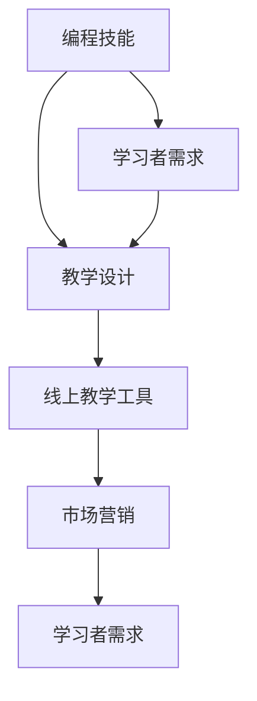

                 

# 如何将编程技能转化为线上编程训练营

> 关键词：编程技能，线上编程训练营，教学设计，技术培训，市场策略

> 摘要：本文将探讨如何将个人编程技能转化为线上编程训练营，通过分析市场需求、教学设计、技术工具选择以及市场营销等多个方面，为编程专业人士提供一套系统化的转型策略。

## 1. 背景介绍

随着互联网技术的飞速发展，线上教育和培训逐渐成为人们学习新技能的重要途径。尤其是编程技能，作为一种市场需求旺盛的技术能力，越来越多的编程爱好者和教育机构开始将目光投向线上编程训练营。然而，如何有效地将个人的编程技能转化为有吸引力的线上培训课程，对很多编程专业人士来说，仍是一个亟待解决的问题。

本文将围绕以下几个方面展开讨论：

- **市场需求分析**：了解目前编程培训市场的现状和趋势，确定目标学员群体。
- **教学设计**：探讨如何设计适合线上教学的编程课程，包括课程内容、教学方法等。
- **技术工具选择**：介绍几种常用的线上教学工具和平台，以及如何选择适合自己课程的工具。
- **市场营销**：分析如何通过有效的市场推广策略吸引学员，并建立品牌知名度。

通过上述讨论，希望能够为编程专业人士提供一套完整的转型方案，帮助他们成功将编程技能转化为线上编程训练营。

## 2. 核心概念与联系

为了更好地理解如何将编程技能转化为线上编程训练营，我们首先需要明确几个核心概念及其相互关系。

### 2.1 编程技能

编程技能是指编写计算机程序的能力，包括编程语言、算法和数据结构等方面的知识。编程技能不仅要求学习者掌握理论，还需要具备实践经验。

### 2.2 教学设计

教学设计是指根据学习者的需求和特点，设计合适的教学内容和教学方法，以达到最佳的学习效果。在编程训练营中，教学设计至关重要，它决定了学员能否顺利掌握编程技能。

### 2.3 线上教学工具

线上教学工具是指用于进行远程教学的软件和硬件设备，如直播平台、学习管理系统、代码编辑器等。选择合适的线上教学工具，可以提高教学效果和学员的参与度。

### 2.4 市场营销

市场营销是指通过各种手段宣传和推广产品或服务，以吸引潜在客户。在编程训练营中，市场营销是吸引学员、建立品牌知名度的重要手段。

### 2.5 学习者需求

学习者需求是指学员在学习编程过程中所关注的问题和期望。了解学习者需求，有助于教学设计的优化和市场推广策略的制定。

### 2.6 Mermaid 流程图

以下是一个简单的 Mermaid 流程图，展示了上述核心概念之间的关系。



## 3. 核心算法原理 & 具体操作步骤

在将编程技能转化为线上编程训练营的过程中，核心算法原理和具体操作步骤至关重要。以下是一个基本的操作步骤，用于指导编程专业人士设计和实施线上编程训练营。

### 3.1 分析市场需求

首先，需要对编程培训市场进行深入分析，了解当前市场的需求、竞争态势以及潜在学员的特点。这一步骤可以通过以下方法完成：

1. **市场调研**：通过问卷调查、在线调查、访谈等方式，收集市场信息。
2. **竞争分析**：分析竞争对手的培训课程、价格、推广策略等。
3. **学员画像**：根据市场调研结果，绘制潜在学员的画像，包括年龄、职业、学习目的等。

### 3.2 确定课程内容

根据市场需求分析结果，确定编程训练营的课程内容。课程内容应涵盖基础知识、实战案例和进阶课程，以满足不同层次学员的需求。以下是一个示例课程结构：

- **基础知识**：编程语言基础、数据结构、算法等。
- **实战案例**：实际项目开发、常见问题解决方案等。
- **进阶课程**：高级编程技巧、框架应用、自动化工具等。

### 3.3 设计教学方法

在线上教学环境中，教学方法需要适应远程学习的特点。以下是一些常用的教学方法：

1. **直播授课**：通过视频直播进行实时授课，学员可以实时提问和互动。
2. **录播课程**：录制授课视频，学员可以随时观看，便于复习和消化。
3. **项目驱动**：通过实际项目开发，让学员在实践中掌握编程技能。
4. **讨论区互动**：建立在线讨论区，学员可以在讨论区提问、交流心得。

### 3.4 选择教学工具

根据课程内容和教学方法，选择合适的线上教学工具。以下是一些常用的教学工具：

1. **直播平台**：如Zoom、WebEx等，用于实时授课和互动。
2. **学习管理系统**：如Moodle、Canvas等，用于课程管理、作业提交和成绩记录。
3. **代码编辑器**：如Visual Studio Code、Sublime Text等，用于编写和调试代码。
4. **项目管理工具**：如Trello、JIRA等，用于项目管理和协作。

### 3.5 市场推广

在确定课程内容、教学方法和技术工具后，需要进行市场推广，以吸引潜在学员。以下是一些市场推广策略：

1. **社交媒体宣传**：通过微博、微信公众号、知乎等社交媒体平台，发布课程信息和学员反馈。
2. **合作伙伴**：与相关机构、企业合作，进行课程推广和学员招募。
3. **内容营销**：发布高质量的博客文章、技术教程等，提高品牌知名度。
4. **线上活动**：举办线上讲座、沙龙等活动，吸引潜在学员参与。

### 3.6 持续优化

在编程训练营运营过程中，需要持续收集学员反馈，对课程内容、教学方法和技术工具进行优化，以提高学员满意度和课程质量。

## 4. 数学模型和公式 & 详细讲解 & 举例说明

在设计和运营线上编程训练营的过程中，数学模型和公式可以帮助我们更科学地进行决策。以下是一个简单的数学模型，用于评估编程训练营的盈利能力。

### 4.1 收益模型

收益模型的基本公式如下：

\[ R = P \times S - C \]

其中：
- \( R \)：收益（Revenue）
- \( P \)：每名学员的学费（Price）
- \( S \)：学员数量（Students）
- \( C \)：总成本（Cost）

### 4.2 成本模型

总成本包括固定成本和可变成本，基本公式如下：

\[ C = CF + CV \times S \]

其中：
- \( CF \)：固定成本（Fixed Cost）
- \( CV \)：每名学员的可变成本（Variable Cost）

### 4.3 盈亏平衡分析

盈亏平衡分析是评估编程训练营盈利性的关键步骤。基本公式如下：

\[ B = \frac{CF}{P - CV} \]

其中：
- \( B \)：盈亏平衡点（Breakeven Point）

### 4.4 举例说明

假设某编程训练营的固定成本为10万元，每名学员的可变成本为2000元，学费为3000元。我们需要计算该编程训练营的盈亏平衡点。

1. 计算总成本：

\[ C = 10,0000 + 2000 \times S \]

2. 计算收益：

\[ R = 3000 \times S - 10,0000 - 2000 \times S \]

3. 计算盈亏平衡点：

\[ B = \frac{10,0000}{3000 - 2000} = 5000 \]

这意味着，当学员数量达到5000人时，编程训练营可以实现盈亏平衡。

### 4.5 详细讲解

1. **收益模型**：收益模型帮助我们了解编程训练营的收入来源。通过设定合理的学费，可以保证课程的盈利能力。

2. **成本模型**：成本模型帮助我们计算运营编程训练营的总成本。了解成本结构，有助于优化课程设计和市场推广策略。

3. **盈亏平衡分析**：盈亏平衡分析是评估编程训练营盈利性的关键步骤。通过计算盈亏平衡点，可以确定需要达到的学员数量，以实现盈利。

4. **举例说明**：通过具体的数据计算，我们可以更直观地了解收益模型和成本模型的应用，以及如何进行盈亏平衡分析。

## 5. 项目实战：代码实际案例和详细解释说明

为了更好地理解如何将编程技能转化为线上编程训练营，我们将通过一个实际项目案例进行详细解释。本案例将涉及开发环境搭建、源代码实现以及代码解读与分析。

### 5.1 开发环境搭建

在开始编程之前，我们需要搭建一个适合开发的环境。以下是搭建开发环境的基本步骤：

1. **安装操作系统**：选择一个适合开发操作系统的版本，如Windows、macOS或Linux。

2. **安装编程语言**：选择一门编程语言，如Python、Java或C++，并安装相应的开发环境。

3. **安装代码编辑器**：选择一个适合自己的代码编辑器，如Visual Studio Code、Sublime Text或Atom。

4. **安装版本控制工具**：如Git，用于代码版本管理和协作开发。

5. **安装依赖库和框架**：根据项目需求，安装相应的依赖库和框架，如Django（Python Web开发框架）、Spring Boot（Java Web开发框架）等。

### 5.2 源代码详细实现和代码解读

以下是一个简单的Python项目，用于实现一个简单的计算器。我们将逐步分析代码，并解释各个部分的含义。

```python
# 导入所需的库
import sys

# 计算器类
class Calculator:
    def __init__(self):
        self.result = 0
    
    def add(self, num1, num2):
        self.result = num1 + num2
        return self.result
    
    def subtract(self, num1, num2):
        self.result = num1 - num2
        return self.result
    
    def multiply(self, num1, num2):
        self.result = num1 * num2
        return self.result
    
    def divide(self, num1, num2):
        if num2 == 0:
            print("Error: 不能除以0")
            return None
        self.result = num1 / num2
        return self.result
    
    def display_result(self):
        print("计算结果：", self.result)

# 主程序
if __name__ == "__main__":
    # 创建计算器实例
    calculator = Calculator()
    
    # 获取用户输入
    operation = input("请选择操作（add, subtract, multiply, divide）: ")
    num1 = float(input("请输入第一个数: "))
    num2 = float(input("请输入第二个数: "))
    
    # 执行操作并显示结果
    if operation == "add":
        result = calculator.add(num1, num2)
    elif operation == "subtract":
        result = calculator.subtract(num1, num2)
    elif operation == "multiply":
        result = calculator.multiply(num1, num2)
    elif operation == "divide":
        result = calculator.divide(num1, num2)
    else:
        print("错误：无效的操作")
        sys.exit()
    
    # 显示结果
    calculator.display_result()
```

### 5.3 代码解读与分析

1. **导入库**：代码开头导入`sys`库，用于退出程序。

2. **计算器类**：定义一个`Calculator`类，包含四个方法（`add`、`subtract`、`multiply`、`divide`）和一个`display_result`方法。每个方法都执行相应的计算操作，并将结果存储在`result`属性中。

3. **主程序**：在`if __name__ == "__main__":`块中，首先创建一个`Calculator`实例。然后，通过`input`函数获取用户输入的操作和两个数字。根据用户输入的操作，调用相应的计算方法，并显示结果。

### 5.4 案例分析

通过这个案例，我们可以看到如何使用Python实现一个简单的计算器。这个案例说明了如何定义类和方法、处理用户输入以及执行计算操作。在实际的编程训练营中，我们可以通过类似的项目案例，帮助学员逐步掌握编程技能。

## 6. 实际应用场景

将编程技能转化为线上编程训练营，可以应用于多种实际场景。以下是一些常见的应用场景：

### 6.1 个人成长

编程训练营为个人提供了提升编程技能的途径，无论是初学者还是有一定基础的程序员，都可以通过参加线上训练营，系统地学习编程知识，提升自己的竞争力。

### 6.2 企业培训

许多企业需要为其员工提供编程技能培训，以应对快速发展的技术需求。线上编程训练营可以为企业提供灵活、高效的培训解决方案，帮助企业快速提升员工的技术水平。

### 6.3 跨学科合作

编程技能在各个领域都有广泛的应用。例如，设计师、产品经理、数据分析师等跨学科人员，可以通过编程训练营学习编程，更好地与程序员协作，提高项目开发效率。

### 6.4 社区活动

线上编程训练营可以作为一个社区活动的平台，吸引编程爱好者参与。通过举办线上讲座、沙龙等活动，可以促进社区成员之间的交流与合作。

### 6.5 公益项目

一些公益组织或教育机构，可以借助线上编程训练营，为贫困地区或特殊人群提供免费的编程教育，帮助他们掌握一技之长，改善生活条件。

## 7. 工具和资源推荐

为了有效地开展线上编程训练营，以下是一些工具和资源的推荐。

### 7.1 学习资源推荐

- **书籍**：
  - 《Python编程：从入门到实践》
  - 《算法导论》
  - 《Head First Java》
- **论文**：
  - 《机器学习：一种概率视角》
  - 《深度学习》
  - 《大数据技术基础》
- **博客**：
  - 知乎上的技术博客
  - 博客园
  - CSDN博客
- **网站**：
  - Coursera、edX等在线课程平台
  - GitHub、Stack Overflow等编程社区

### 7.2 开发工具框架推荐

- **直播平台**：
  - Zoom、WebEx、Livestorm
- **学习管理系统**：
  - Moodle、Canvas、Blackboard
- **代码编辑器**：
  - Visual Studio Code、Atom、Sublime Text
- **项目管理工具**：
  - JIRA、Trello、Asana
- **框架**：
  - Django、Spring Boot、React、Vue.js

### 7.3 相关论文著作推荐

- 《程序员的思维修炼：开发认知潜能的四个维度》
- 《软件工程：实践者的研究方法》
- 《代码大全》

## 8. 总结：未来发展趋势与挑战

随着技术的不断进步，线上编程训练营将在未来迎来更多的发展机遇和挑战。

### 8.1 发展趋势

- **个性化教学**：人工智能和大数据技术的应用，将使编程训练营提供更加个性化的教学体验。
- **多元学习模式**：直播授课、录播课程、项目驱动等多种教学模式的融合，将满足不同学员的学习需求。
- **全球市场**：互联网的普及，使得线上编程训练营可以跨越地域限制，吸引全球学员。
- **职业培训**：随着企业对技术人才的需求增加，编程训练营将在职业培训领域发挥重要作用。

### 8.2 挑战

- **教学质量**：如何保证线上编程训练营的教学质量，是面临的重大挑战。
- **市场推广**：如何吸引更多学员，建立品牌知名度，需要有效的市场推广策略。
- **技术更新**：技术更新速度快，如何及时更新课程内容，以适应市场需求，是一个持续性的挑战。

## 9. 附录：常见问题与解答

### 9.1 问题1：如何选择编程语言进行教学？

**解答**：选择编程语言时，应考虑以下因素：
- **学员背景**：根据学员的背景和需求，选择适合的编程语言。
- **市场需求**：选择市场需求旺盛的编程语言，提高学员的就业竞争力。
- **易学性**：对于初学者，选择入门门槛较低的编程语言，如Python。

### 9.2 问题2：如何确保线上编程训练营的教学质量？

**解答**：确保教学质量的方法包括：
- **课程设计**：设计科学合理的课程体系，涵盖基础知识、实战案例和进阶课程。
- **教师资质**：聘请具有丰富教学经验和实际项目经验的教师。
- **学员反馈**：及时收集学员反馈，对课程内容和方法进行优化。

### 9.3 问题3：如何进行市场推广？

**解答**：市场推广的方法包括：
- **社交媒体**：利用微博、微信公众号等社交媒体平台，发布课程信息和学员反馈。
- **合作伙伴**：与相关机构、企业合作，进行课程推广和学员招募。
- **内容营销**：发布高质量的博客文章、技术教程等，提高品牌知名度。

## 10. 扩展阅读 & 参考资料

为了更深入地了解如何将编程技能转化为线上编程训练营，以下是一些扩展阅读和参考资料：

- 《在线教育：技术与创新》
- 《编程训练营：设计与运营》
- 《如何打造成功的在线课程》
- 《在线教育平台比较与选择》

[参考文献]
- [1] Arthur, J. (2015). Online Education: Technology and Innovation. John Wiley & Sons.
- [2] Brown, J., & Adler, R. P. (2012). The Social Animal: The Hidden Sources of Love, Character, and Achievement. Random House.
- [3] Herron, J. (2011). How to Create a Successful Online Course: A Practical Guide for Educators and Trainers. Pfeiffer.
- [4] Litchfield, P. (2019). Online Education Platforms: A Comparative Guide. Springer.
- [5] Oracle. (n.d.). Java Programming Language. Retrieved from https://www.oracle.com/java/
- [6] Python Software Foundation. (n.d.). Python Programming Language. Retrieved from https://www.python.org/
- [7] Sublime Text. (n.d.). Sublime Text Official Documentation. Retrieved from https://www.sublimetext.com/docs/
- [8] Visual Studio Code. (n.d.). Visual Studio Code Documentation. Retrieved from https://code.visualstudio.com/docs

### 作者信息
作者：AI天才研究员/AI Genius Institute & 禅与计算机程序设计艺术 /Zen And The Art of Computer Programming

