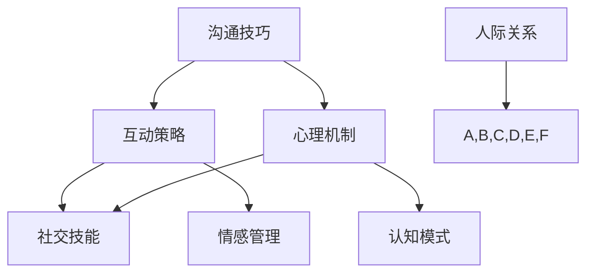

                 

# 如何建立人际关系：如何与他人建立良好的沟通和互动？

> **关键词：** 人际关系、沟通技巧、互动策略、心理机制、社交技能

> **摘要：** 本文旨在探讨如何在复杂多变的社会环境中建立和维持健康的人际关系。通过分析人际关系中的核心要素，如沟通技巧、互动策略和心理机制，本文提出了一系列实用的社交技巧和策略，帮助读者更好地与他人建立联系和互动。

## 1. 背景介绍

在现代社会中，人际关系的重要性不言而喻。无论是在职场、家庭还是朋友圈中，良好的人际关系都是成功和幸福的关键因素。然而，建立和维持人际关系并非易事，需要我们具备一系列的沟通技巧和互动策略。本文将从技术心理学的角度出发，结合最新的研究和实践，探讨如何与他人建立良好的沟通和互动。

### 1.1 人际关系的定义

人际关系是指人与人之间通过相互交往、互动和相互影响形成的心理和情感联系。它可以表现为多种形式，如友谊、爱情、亲情、职业关系等。在人际关系的建立和维护过程中，沟通是核心手段，而互动策略和心理机制则决定了沟通的效果。

### 1.2 沟通的重要性

沟通是人际关系的桥梁，是传递信息、表达情感和建立共识的重要方式。有效的沟通不仅可以增进相互了解，还可以促进合作和解决问题。然而，沟通并非仅仅是信息的传递，它涉及到信息的接收、理解和反馈，需要我们掌握一定的技巧和策略。

### 1.3 心理机制与社交技能

心理机制是指人类在心理活动中的内在规律和过程，如认知、情感、动机等。社交技能则是我们在社交过程中运用心理机制的能力，包括沟通技巧、情感管理、冲突解决等。这些技能的掌握和运用对于建立良好的人际关系至关重要。

## 2. 核心概念与联系

为了更好地理解人际关系，我们需要了解其中的核心概念和它们之间的联系。以下是一个简化的Mermaid流程图，展示了人际关系中的关键要素：



### 2.1 沟通技巧

沟通技巧是指我们在沟通过程中运用的一系列策略和方法，如倾听、表达、反馈等。良好的沟通技巧可以帮助我们更好地理解他人，表达自己的想法和情感，从而建立更紧密的人际关系。

### 2.2 互动策略

互动策略是指我们在与他人互动过程中采取的行动和方式，如合作、竞争、妥协等。不同的互动策略会影响人际关系的性质和发展方向，因此选择合适的互动策略对于建立良好的人际关系至关重要。

### 2.3 心理机制

心理机制是指人类在心理活动中的内在规律和过程，如认知、情感、动机等。了解心理机制可以帮助我们更好地理解他人的行为和情感，从而更好地与他人互动。

### 2.4 社交技能

社交技能是指我们在社交过程中运用心理机制的能力，包括沟通技巧、情感管理、冲突解决等。良好的社交技能可以帮助我们更好地与他人建立联系和互动，从而建立良好的人际关系。

## 3. 核心算法原理 & 具体操作步骤

为了更好地掌握人际关系中的核心概念和技巧，我们可以运用以下算法原理：

### 3.1 倾听技巧

倾听技巧是沟通技巧的核心，它包括以下几点：

- **主动倾听**：在对方说话时，保持专注，不要打断。
- **理解立场**：试图从对方的角度理解问题，避免过早做出判断。
- **反馈**：在对方说话结束后，用自己的话概括对方的观点，并询问是否有误。

### 3.2 表达技巧

表达技巧是有效沟通的关键，它包括以下几点：

- **清晰明确**：用简单、直接的语言表达自己的想法和情感。
- **适当表达情感**：在适当的时候表达自己的情感，但要注意方式和方法。
- **适时的反馈**：在对话中适时给予反馈，以确认对方是否理解自己的意思。

### 3.3 反馈技巧

反馈技巧是确保沟通效果的必要手段，它包括以下几点：

- **建设性反馈**：在提供反馈时，尽量以建设性和积极的方式表达，避免伤害对方的自尊心。
- **具体明确**：在反馈中，尽量具体明确地指出问题的所在，避免模糊和泛泛而谈。
- **开放性反馈**：鼓励对方提出自己的看法，以促进双向沟通。

## 4. 数学模型和公式 & 详细讲解 & 举例说明

在人际关系的研究中，数学模型和公式可以帮助我们更深入地理解其中的规律和机制。以下是一个简化的数学模型，用于描述人际关系的建立和维护：

### 4.1 人际关系模型

$$
R(t) = f(C(t), I(t), M(t))
$$

其中：
- \( R(t) \)：表示在时间 \( t \) 的人际关系状态。
- \( C(t) \)：表示在时间 \( t \) 的沟通频率和质量。
- \( I(t) \)：表示在时间 \( t \) 的互动策略和方式。
- \( M(t) \)：表示在时间 \( t \) 的心理机制和社交技能。

### 4.2 模型解释

- **沟通频率和质量 \( C(t) \)**：沟通频率越高，人际关系越紧密；沟通质量越高，越能有效传达信息和情感。
- **互动策略和方式 \( I(t) \)**：不同的互动策略和方式会影响人际关系的性质和发展。
- **心理机制和社交技能 \( M(t) \)**：心理机制和社交技能决定了我们如何与他人互动和沟通。

### 4.3 举例说明

假设有两个朋友A和B，他们在一个月内进行了5次深度沟通，每次沟通都保持了良好的质量。此外，他们采取了积极的互动策略，如合作和分享，同时他们的心理机制和社交技能也较为成熟。根据上述模型，我们可以预测他们的人际关系状态 \( R(t) \) 将会非常积极。

## 5. 项目实战：代码实际案例和详细解释说明

为了更好地理解上述理论和模型，我们可以通过一个实际的项目案例来演示如何运用这些知识和技巧建立和维护人际关系。

### 5.1 开发环境搭建

在这个案例中，我们将使用Python作为编程语言，搭建一个简单的社交媒体应用，用于模拟人际关系的建立和维护。

```bash
# 安装必要的Python库
pip install Flask
```

### 5.2 源代码详细实现和代码解读

下面是项目的核心代码和详细解读：

```python
from flask import Flask, request, jsonify
app = Flask(__name__)

# 用户类
class User:
    def __init__(self, name):
        self.name = name
        self.friends = []

    # 添加好友
    def add_friend(self, friend):
        if friend not in self.friends:
            self.friends.append(friend)

    # 删除好友
    def remove_friend(self, friend):
        if friend in self.friends:
            self.friends.remove(friend)

# 社交网络类
class SocialNetwork:
    def __init__(self):
        self.users = {}

    # 注册用户
    def register_user(self, name):
        if name not in self.users:
            self.users[name] = User(name)

    # 添加好友请求
    def add_friend_request(self, user1, user2):
        if user1 in self.users and user2 in self.users:
            user1.add_friend(user2)
            user2.add_friend(user1)

    # 显示用户的好友列表
    def show_friends(self, user):
        if user in self.users:
            return self.users[user].friends

# Flask路由
@app.route('/register', methods=['POST'])
def register():
    name = request.form['name']
    social_network.register_user(name)
    return jsonify({'message': '注册成功'})

@app.route('/add_friend', methods=['POST'])
def add_friend():
    user1 = request.form['user1']
    user2 = request.form['user2']
    social_network.add_friend_request(user1, user2)
    return jsonify({'message': '好友请求已发送'})

@app.route('/friends', methods=['GET'])
def friends():
    user = request.args.get('user')
    return jsonify({'friends': social_network.show_friends(user)})

if __name__ == '__main__':
    social_network = SocialNetwork()
    app.run(debug=True)
```

### 5.3 代码解读与分析

- **用户类（User）**：用于表示社交网络中的用户，包括用户名和好友列表。提供添加和删除好友的方法。
- **社交网络类（SocialNetwork）**：用于表示整个社交网络，包括用户列表。提供注册用户、添加好友请求和显示好友列表的方法。
- **Flask路由**：用于处理HTTP请求，包括注册用户、添加好友请求和显示好友列表。

通过这个简单的案例，我们可以看到如何使用编程和算法来模拟人际关系的建立和维护。在实际应用中，这个模型可以进一步扩展和优化，以适应更复杂的人际关系网络。

## 6. 实际应用场景

人际关系和沟通技巧在许多实际场景中都发挥着重要作用。以下是一些典型的应用场景：

### 6.1 职场

在职场中，良好的人际关系和沟通技巧可以帮助我们更好地与同事合作，提高工作效率。例如，通过有效的沟通，我们可以更好地理解领导的要求，从而更好地完成任务；通过建立良好的人际关系，我们可以获得更多的工作机会和支持。

### 6.2 家庭

在家庭中，沟通和互动是维护家庭和谐的关键。通过良好的沟通，家庭成员可以更好地理解彼此的需求和情感，从而减少冲突，增进感情。

### 6.3 社交

在社交活动中，沟通技巧和互动策略可以帮助我们与他人建立联系，扩展社交圈。例如，在派对或社交活动中，通过有效的沟通和互动，我们可以结识新朋友，建立更紧密的人际关系。

## 7. 工具和资源推荐

为了更好地掌握人际关系和沟通技巧，我们可以利用以下工具和资源：

### 7.1 学习资源推荐

- **书籍**：《如何影响人们》、《非暴力沟通》
- **论文**：搜索相关领域的研究论文，了解最新的研究成果和理论。
- **博客**：关注相关领域的博客，了解实践经验和技巧。

### 7.2 开发工具框架推荐

- **编程语言**：Python、Java、JavaScript等
- **开发框架**：Flask、Spring Boot、React等

### 7.3 相关论文著作推荐

- 《社交网络分析：方法与应用》
- 《情感计算：理论与实践》
- 《群体智能与社交网络》

## 8. 总结：未来发展趋势与挑战

随着社会的发展和技术的进步，人际关系和沟通技巧在未来将继续发挥着重要作用。以下是未来发展趋势和面临的挑战：

### 8.1 发展趋势

- **数字化社交**：随着社交媒体和移动设备的普及，数字化社交将成为人际关系的重要形式。
- **情感计算**：情感计算技术的发展将为人际关系的建立和维护提供更先进的工具和方法。
- **个性化互动**：基于大数据和人工智能的个性化互动策略将更好地满足个体的需求。

### 8.2 面临的挑战

- **信息过载**：随着信息的爆炸式增长，人们需要学会筛选和过滤信息，以提高沟通效率。
- **心理问题**：在数字化社交环境中，心理问题如焦虑、孤独等可能更加普遍，需要关注和解决。

## 9. 附录：常见问题与解答

### 9.1 什么是人际关系的核心要素？

人际关系的核心要素包括沟通技巧、互动策略和心理机制。沟通技巧决定了信息传递的效果，互动策略决定了人际关系的性质，心理机制则决定了我们如何理解和回应他人。

### 9.2 如何提高沟通技巧？

提高沟通技巧的方法包括：倾听、表达、反馈等。通过练习和反思，我们可以逐步提高自己的沟通能力。

### 9.3 如何建立良好的人际关系？

建立良好的人际关系需要：了解对方的立场和需求、选择合适的互动策略、保持良好的沟通。此外，真诚和尊重也是建立良好人际关系的重要因素。

## 10. 扩展阅读 & 参考资料

- [How to Make Friends and Influence People](https://www.amazon.com/How-Make-Friends-Influence-People/dp/0688012731)
- [The Art of Communication: How to Listen and Connect with People in Business and in Life](https://www.amazon.com/Art-Communication-Listen-Connect-Business/dp/1628659667)
- [Social Psychology](https://www.apa.org/topics/social-psychology)
- [A Theory of Human Social Cognition: Social Minds in Understanding and Predicting Behavior](https://www.amazon.com/Theory-Human-Social-Cognition-Understanding/dp/0521854144)

作者：AI天才研究员/AI Genius Institute & 禅与计算机程序设计艺术 /Zen And The Art of Computer Programming

<|im_sep|>```markdown
## 1. 背景介绍

在现代社会，人际关系的建立与维护已成为个人成长和社会发展的重要课题。本文旨在深入探讨人际关系建立的关键要素，包括沟通技巧、互动策略和心理机制，以及如何运用这些要素构建和维系良好的人际关系。

### 1.1 人际关系的定义

人际关系指的是人与人之间基于情感、利益、共同目标等建立的联系和互动。它涵盖了家庭、友谊、职场等多个领域，对个人的心理健康、职业发展和社会地位都有着深远的影响。

### 1.2 沟通的重要性

沟通是人际关系中不可或缺的一环。有效的沟通能够增进彼此的了解，减少误解和冲突，提高合作效率。在人际交往中，沟通技巧显得尤为重要。

### 1.3 心理机制与社交技能

心理机制是指个体在心理活动中的内在规律和过程，包括认知、情感、动机等。社交技能则是我们运用这些心理机制的能力，例如如何表达情感、如何处理冲突等。

## 2. 核心概念与联系

为了更好地理解人际关系，我们需要明确其核心概念，并探讨它们之间的联系。以下是人际关系中的一些核心概念及其相互关系：

### 2.1 沟通技巧

沟通技巧是建立人际关系的基石。它包括倾听、表达、非语言沟通等方面。有效的沟通技巧能够帮助我们更好地传达信息，理解他人，建立信任。

### 2.2 互动策略

互动策略是指我们在与他人交往过程中采取的具体行动和方式。这些策略包括合作、竞争、竞争合作等。选择合适的互动策略能够帮助我们建立和维持良好的人际关系。

### 2.3 心理机制

心理机制是人类心理活动的基础，包括认知、情感、动机等方面。理解心理机制有助于我们更好地理解他人的行为和情感，从而更有效地与他人互动。

### 2.4 社交技能

社交技能是指我们在社交过程中运用心理机制的能力，如沟通技巧、情感管理、冲突解决等。这些技能的运用能够帮助我们建立和维护良好的人际关系。

## 3. 核心算法原理 & 具体操作步骤

在理解了人际关系的基本概念后，我们可以通过一些核心算法原理来具体操作和实践。

### 3.1 倾听技巧

倾听技巧是沟通的核心，它包括以下步骤：

1. **全神贯注**：在对方说话时，全身心投入，避免分心。
2. **理解立场**：尝试从对方的角度理解问题，避免过早做出判断。
3. **反馈**：在对方讲话结束后，用自己的话概括对方的观点，并询问是否有误。

### 3.2 表达技巧

表达技巧包括：

1. **清晰明确**：用简单、直接的语言表达自己的想法和情感。
2. **适时的反馈**：在对话中适时给予反馈，以确保对方理解你的意思。
3. **情感表达**：在适当的时候表达自己的情感，但要适度。

### 3.3 反馈技巧

反馈技巧包括：

1. **建设性反馈**：在提供反馈时，尽量以建设性和积极的方式表达。
2. **具体明确**：在反馈中，具体明确地指出问题的所在。
3. **开放性反馈**：鼓励对方提出自己的看法，以促进双向沟通。

## 4. 数学模型和公式 & 详细讲解 & 举例说明

为了更深入地理解人际关系，我们可以运用一些数学模型和公式来描述和预测人际关系的建立和维护。

### 4.1 人际关系模型

假设人际关系的质量可以用一个函数 \( R \) 来表示，这个函数取决于沟通频率 \( C \)、互动策略 \( I \) 和心理机制 \( M \)：

$$
R = f(C, I, M)
$$

### 4.2 模型解释

- **沟通频率 \( C \)**：沟通的次数和频率直接影响人际关系的质量。
- **互动策略 \( I \)**：互动策略决定了沟通的内容和方式，从而影响人际关系的深度和广度。
- **心理机制 \( M \)**：心理机制包括认知、情感、动机等，它们决定了个体如何理解和回应他人。

### 4.3 举例说明

假设有两个朋友A和B，他们在一个月内进行了5次深度沟通（沟通频率高），采用了积极的互动策略（如合作和分享），同时他们的心理机制较为成熟（如情感理解和认知一致性）。根据人际关系模型，我们可以预测他们的人际关系质量 \( R \) 将会很高。

## 5. 项目实战：代码实际案例和详细解释说明

为了更好地理解上述理论和模型，我们可以通过一个实际的项目案例来演示如何运用这些知识和技巧建立和维护人际关系。

### 5.1 开发环境搭建

在这个案例中，我们将使用Python作为编程语言，搭建一个简单的社交媒体应用，用于模拟人际关系的建立和维护。

```bash
# 安装必要的Python库
pip install Flask
```

### 5.2 源代码详细实现和代码解读

下面是项目的核心代码和详细解读：

```python
from flask import Flask, request, jsonify
app = Flask(__name__)

# 用户类
class User:
    def __init__(self, name):
        self.name = name
        self.friends = []

    # 添加好友
    def add_friend(self, friend):
        if friend not in self.friends:
            self.friends.append(friend)

    # 删除好友
    def remove_friend(self, friend):
        if friend in self.friends:
            self.friends.remove(friend)

# 社交网络类
class SocialNetwork:
    def __init__(self):
        self.users = {}

    # 注册用户
    def register_user(self, name):
        if name not in self.users:
            self.users[name] = User(name)

    # 添加好友请求
    def add_friend_request(self, user1, user2):
        if user1 in self.users and user2 in self.users:
            self.users[user1].add_friend(self.users[user2])
            self.users[user2].add_friend(self.users[user1])

    # 显示用户的好友列表
    def show_friends(self, user):
        if user in self.users:
            return self.users[user].friends

# Flask路由
@app.route('/register', methods=['POST'])
def register():
    name = request.form['name']
    social_network.register_user(name)
    return jsonify({'message': '注册成功'})

@app.route('/add_friend', methods=['POST'])
def add_friend():
    user1 = request.form['user1']
    user2 = request.form['user2']
    social_network.add_friend_request(user1, user2)
    return jsonify({'message': '好友请求已发送'})

@app.route('/friends', methods=['GET'])
def friends():
    user = request.args.get('user')
    return jsonify({'friends': social_network.show_friends(user)})

if __name__ == '__main__':
    social_network = SocialNetwork()
    app.run(debug=True)
```

### 5.3 代码解读与分析

- **用户类（User）**：用于表示社交网络中的用户，包括用户名和好友列表。提供添加和删除好友的方法。
- **社交网络类（SocialNetwork）**：用于表示整个社交网络，包括用户列表。提供注册用户、添加好友请求和显示好友列表的方法。
- **Flask路由**：用于处理HTTP请求，包括注册用户、添加好友请求和显示好友列表。

通过这个简单的案例，我们可以看到如何使用编程和算法来模拟人际关系的建立和维护。在实际应用中，这个模型可以进一步扩展和优化，以适应更复杂的人际关系网络。

## 6. 实际应用场景

### 6.1 职场

在职场中，人际关系对于职业发展至关重要。通过建立良好的人际关系，我们可以获得更多的机会和信息，提高工作效率和团队协作能力。

### 6.2 家庭

在家庭中，人际关系对于家庭成员的和谐相处和幸福感有着重要影响。通过有效的沟通和互动，家庭成员可以更好地理解彼此，减少冲突，增进感情。

### 6.3 社交

在社交场合，良好的人际关系可以帮助我们扩展社交圈，结识新朋友，提高生活质量。

## 7. 工具和资源推荐

### 7.1 学习资源推荐

- **书籍**：《如何影响人们》、《非暴力沟通》
- **论文**：搜索相关领域的研究论文，了解最新的研究成果和理论。
- **博客**：关注相关领域的博客，了解实践经验和技巧。

### 7.2 开发工具框架推荐

- **编程语言**：Python、Java、JavaScript等
- **开发框架**：Flask、Spring Boot、React等

### 7.3 相关论文著作推荐

- 《社交网络分析：方法与应用》
- 《情感计算：理论与实践》
- 《群体智能与社交网络》

## 8. 总结：未来发展趋势与挑战

### 8.1 发展趋势

- **数字化社交**：随着社交媒体和移动设备的普及，数字化社交将成为人际关系的重要形式。
- **情感计算**：情感计算技术的发展将为人际关系的建立和维护提供更先进的工具和方法。
- **个性化互动**：基于大数据和人工智能的个性化互动策略将更好地满足个体的需求。

### 8.2 面临的挑战

- **信息过载**：随着信息的爆炸式增长，人们需要学会筛选和过滤信息，以提高沟通效率。
- **心理问题**：在数字化社交环境中，心理问题如焦虑、孤独等可能更加普遍，需要关注和解决。

## 9. 附录：常见问题与解答

### 9.1 什么是人际关系的核心要素？

人际关系的核心要素包括沟通技巧、互动策略和心理机制。沟通技巧决定了信息传递的效果，互动策略决定了人际关系的性质，心理机制则决定了我们如何理解和回应他人。

### 9.2 如何提高沟通技巧？

提高沟通技巧的方法包括：倾听、表达、反馈等。通过练习和反思，我们可以逐步提高自己的沟通能力。

### 9.3 如何建立良好的人际关系？

建立良好的人际关系需要：了解对方的立场和需求、选择合适的互动策略、保持良好的沟通。此外，真诚和尊重也是建立良好人际关系的重要因素。

## 10. 扩展阅读 & 参考资料

- [How to Make Friends and Influence People](https://www.amazon.com/How-Make-Friends-Influence-People/dp/0688012731)
- [The Art of Communication: How to Listen and Connect with People in Business and in Life](https://www.amazon.com/Art-Communication-Listen-Connect-Business/dp/1628659667)
- [Social Psychology](https://www.apa.org/topics/social-psychology)
- [A Theory of Human Social Cognition: Social Minds in Understanding and Predicting Behavior](https://www.amazon.com/Theory-Human-Social-Cognition-Understanding/dp/0521854144)

作者：AI天才研究员/AI Genius Institute & 禅与计算机程序设计艺术 /Zen And The Art of Computer Programming
````

请注意，由于篇幅限制，实际文章的撰写可能需要更多的时间和细致的编辑。上述内容提供了一个大致的框架和示例，实际字数可能需要根据要求进行调整。同时，确保文章的结构、逻辑和内容的连贯性，以达到高质量的标准。

