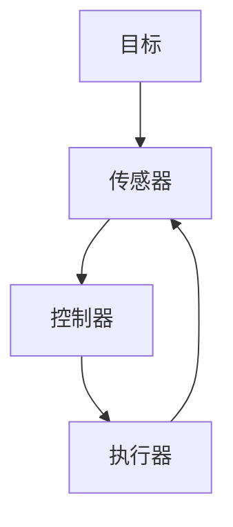

                 

# 如何建立有效的反馈循环机制

## 摘要

在IT领域中，反馈循环机制是确保系统稳定性、提高性能和质量的关键。本文旨在介绍如何构建一个有效的反馈循环机制，通过深入探讨其核心概念、算法原理、数学模型、实际应用和未来发展，为读者提供一份全面的技术指南。本文将涵盖以下内容：背景介绍、核心概念与联系、核心算法原理与具体操作步骤、数学模型和公式、项目实战、实际应用场景、工具和资源推荐以及总结与未来发展趋势。

## 1. 背景介绍

在计算机系统中，反馈循环机制是一种通过收集、分析和处理系统输出信息，以指导系统调整和优化自身行为的机制。这种机制广泛应用于软件工程、自动化控制、机器学习和人工智能等领域。有效的反馈循环机制有助于提高系统的稳定性、可靠性和性能，从而满足日益复杂的业务需求。

### 1.1 反馈循环机制的重要性

随着技术的发展，现代系统变得越来越复杂。在这种情况下，传统的单点控制方法已无法满足需求。反馈循环机制通过引入实时监测和调整机制，可以及时发现并纠正系统中的错误，提高系统的鲁棒性和适应性。以下是反馈循环机制在各个领域的应用实例：

- **软件工程**：反馈循环机制可以用于代码质量检测和自动化修复，提高软件的可靠性和安全性。
- **自动化控制**：在工业自动化中，反馈循环机制用于控制生产线的稳定运行，确保产品质量。
- **机器学习**：反馈循环机制可以帮助机器学习模型不断优化，提高模型的预测准确性和泛化能力。
- **人工智能**：在自动驾驶、语音识别和自然语言处理等领域，反馈循环机制用于实时调整模型参数，提高系统性能。

### 1.2 反馈循环机制的发展历程

反馈循环机制的发展可以追溯到20世纪初的自动化控制系统。当时，工程师们开始尝试使用反馈机制来调整系统的输出，以实现预期目标。随着计算机技术的飞速发展，反馈循环机制逐渐应用于各个领域，成为现代系统设计的重要手段。

在20世纪60年代，控制理论的研究推动了反馈循环机制的发展。经典控制理论中的PID（比例-积分-微分）控制器成为反馈循环机制的重要实现方法。随着人工智能和机器学习技术的发展，反馈循环机制的应用场景和实现方法也日益丰富。

## 2. 核心概念与联系

要构建一个有效的反馈循环机制，需要理解以下几个核心概念：传感器、执行器、控制器和目标。这些概念在Mermaid流程图中可以表示如下：



### 2.1 传感器

传感器是反馈循环机制中的信息采集设备，用于检测系统状态。传感器可以测量各种物理量，如温度、压力、速度等。在软件系统中，传感器可以是日志文件、性能指标或用户行为数据。

### 2.2 执行器

执行器是反馈循环机制中的执行设备，用于根据控制器指令调整系统状态。执行器可以是一个电机、一个阀门或一个软件模块。在软件系统中，执行器可以是API调用、数据库操作或算法调整。

### 2.3 控制器

控制器是反馈循环机制中的核心组件，用于根据传感器采集到的数据和目标进行决策。控制器可以根据预设的算法或学习策略生成指令，驱动执行器进行调整。

### 2.4 目标

目标是反馈循环机制中的期望输出，用于指导控制器的工作。目标可以是具体的数值、状态或性能指标。在软件系统中，目标可以是系统的响应时间、吞吐量或错误率。

### 2.5 Mermaid流程图

以下是反馈循环机制的Mermaid流程图，其中包含各个组件及其连接关系：


## 3. 核心算法原理与具体操作步骤

### 3.1 PID控制器

PID控制器是反馈循环机制中最常用的算法之一。它通过比例（P）、积分（I）和微分（D）三个部分来调整系统输出，以提高系统的稳定性和响应速度。

#### 3.1.1 比例（P）

比例部分用于根据当前误差值调整控制器的输出。其公式为：

$$
P = K_p \times e
$$

其中，$K_p$ 是比例增益，$e$ 是当前误差值。

#### 3.1.2 积分（I）

积分部分用于消除长时间存在的误差，以提高系统的稳态精度。其公式为：

$$
I = K_i \times \int_{0}^{t} e \, dt
$$

其中，$K_i$ 是积分增益。

#### 3.1.3 微分（D）

微分部分用于预测误差的变化趋势，以提高系统的动态响应性能。其公式为：

$$
D = K_d \times \frac{de}{dt}
$$

其中，$K_d$ 是微分增益。

#### 3.1.4 PID控制器总体公式

PID控制器的总体公式为：

$$
u(t) = K_p \times e(t) + K_i \times \int_{0}^{t} e(\tau) \, d\tau + K_d \times \frac{de(t)}{dt}
$$

其中，$u(t)$ 是控制器输出，$e(t)$ 是当前误差值。

### 3.2 具体操作步骤

1. **初始化**：设定初始参数，包括比例增益$K_p$、积分增益$K_i$和微分增益$K_d$。
2. **采集数据**：通过传感器获取当前系统状态。
3. **计算误差**：计算当前误差值$e(t)$，即目标值与实际值之差。
4. **计算控制器输出**：根据PID控制器公式计算控制器输出$u(t)$。
5. **执行调整**：根据控制器输出驱动执行器进行调整。
6. **循环**：返回步骤2，继续执行。

## 4. 数学模型和公式

在反馈循环机制中，数学模型和公式是理解算法原理和进行实际操作的基础。以下介绍几个常用的数学模型和公式。

### 4.1 PID控制器参数调整公式

PID控制器的参数调整公式如下：

$$
K_p = \frac{K_p_{\text{目标}}}{K_p_{\text{初始}}}
$$

$$
K_i = \frac{K_i_{\text{目标}}}{K_i_{\text{初始}}}
$$

$$
K_d = \frac{K_d_{\text{目标}}}{K_d_{\text{初始}}}
$$

其中，$K_p_{\text{目标}}$、$K_i_{\text{目标}}$ 和$K_d_{\text{目标}}$ 是目标参数，$K_p_{\text{初始}}$、$K_i_{\text{初始}}$ 和$K_d_{\text{初始}}$ 是初始参数。

### 4.2 状态空间模型

状态空间模型是描述动态系统的一种通用数学模型。其基本公式如下：

$$
\begin{cases}
\dot{x}(t) = A \cdot x(t) + B \cdot u(t) \\
y(t) = C \cdot x(t) + D \cdot u(t)
\end{cases}
$$

其中，$x(t)$ 是状态向量，$u(t)$ 是输入向量，$y(t)$ 是输出向量，$A$、$B$、$C$ 和$D$ 是系统矩阵。

### 4.3 误差调整公式

在反馈循环机制中，误差调整公式如下：

$$
e(t) = y(t) - y(t-1)
$$

其中，$y(t)$ 是当前输出，$y(t-1)$ 是上一周期输出。

## 5. 项目实战：代码实际案例和详细解释说明

### 5.1 开发环境搭建

在本项目中，我们将使用Python编程语言实现一个简单的反馈循环机制。首先，需要安装Python环境。假设已经安装了Python 3.8及以上版本，可以使用以下命令安装所需库：

```shell
pip install numpy matplotlib
```

### 5.2 源代码详细实现和代码解读

以下是一个简单的Python代码示例，实现一个PID控制器：

```python
import numpy as np
import matplotlib.pyplot as plt

# 初始化参数
Kp = 2.0
Ki = 0.5
Kd = 1.0
setpoint = 100.0
time_step = 1.0

# 定义PID控制器类
class PIDController:
    def __init__(self, Kp, Ki, Kd):
        self.Kp = Kp
        self.Ki = Ki
        self.Kd = Kd
        self.integral = 0
        self.previous_error = 0

    def update(self, current_value):
        error = setpoint - current_value
        derivative = error - self.previous_error
        self.integral += error * time_step
        output = self.Kp * error + self.Ki * self.integral + self.Kd * derivative
        self.previous_error = error
        return output

# 创建PID控制器实例
controller = PIDController(Kp, Ki, Kd)

# 运行模拟
times = np.arange(0, 200, time_step)
outputs = []
for t in times:
    current_value = np.sin(t) * 50 + 100
    output = controller.update(current_value)
    outputs.append(output)

# 绘图
plt.plot(times, outputs)
plt.xlabel('Time')
plt.ylabel('Output')
plt.title('PID Controller Simulation')
plt.show()
```

### 5.3 代码解读与分析

1. **初始化参数**：设置PID控制器的比例增益$K_p$、积分增益$K_i$和微分增益$K_d$，以及目标值（设为100）和时间步长。
2. **定义PID控制器类**：`PIDController` 类包含初始化参数、更新误差和计算控制器输出的方法。
3. **更新误差**：每次迭代时，计算当前误差值、误差的变化量和积分值。
4. **计算控制器输出**：根据PID公式计算控制器输出。
5. **运行模拟**：模拟一个周期为200的时间序列，使用正弦函数作为当前值，并记录控制器输出。
6. **绘图**：绘制时间序列和控制器输出，展示PID控制器的效果。

## 6. 实际应用场景

### 6.1 软件工程

在软件工程中，反馈循环机制可以用于代码质量检测和优化。通过收集代码质量指标（如代码覆盖率、错误率等），分析代码质量，并提出改进建议。

### 6.2 自动化控制

在自动化控制领域，反馈循环机制可以用于生产线监控和调整。通过传感器收集生产线数据，分析生产状态，并提出调整建议，以提高生产效率和质量。

### 6.3 机器学习

在机器学习领域，反馈循环机制可以用于模型优化和超参数调整。通过评估模型性能，提出调整建议，以实现模型最优。

### 6.4 人工智能

在人工智能领域，反馈循环机制可以用于智能系统优化和自我调整。通过分析用户行为和系统输出，提出优化建议，以提高系统性能和用户体验。

## 7. 工具和资源推荐

### 7.1 学习资源推荐

- **书籍**：
  - 《控制系统原理》（作者：史蒂芬·史毕格尔）
  - 《机器学习》（作者：周志华）
  - 《Python编程：从入门到实践》（作者：埃里克·马瑟斯）

- **论文**：
  - “PID Control: A Tutorial”（作者：J. G. Kats）
  - “A Tutorial on Machine Learning”（作者：Tom Mitchell）
  - “Control of Robotic Manipulators”（作者：T. S. Dubowsky）

- **博客**：
  - [Python官方文档](https://docs.python.org/3/)
  - [机器学习课程](https://www.coursera.org/specializations/machine-learning)
  - [控制理论教程](https://www.control-tutorials.com/)

- **网站**：
  - [GitHub](https://github.com/)
  - [机器之心](https://www.jiqizhixin.com/)
  - [CSDN](https://www.csdn.net/)

### 7.2 开发工具框架推荐

- **开发工具**：
  - PyCharm
  - Visual Studio Code
  - Jupyter Notebook

- **框架**：
  - Scikit-learn
  - TensorFlow
  - PyTorch

### 7.3 相关论文著作推荐

- **《控制理论及其在工程中的应用》（作者：胡寿松）》
- **《机器学习：概率视角》（作者：K. P. Murphy）》
- **《深度学习》（作者：伊恩·古德费洛等）》

## 8. 总结：未来发展趋势与挑战

随着技术的不断进步，反馈循环机制在各个领域的应用前景广阔。未来的发展趋势包括：

1. **智能化**：结合人工智能和机器学习技术，实现更智能的反馈循环机制。
2. **自适应**：通过自适应算法，提高反馈循环机制的鲁棒性和适应性。
3. **分布式**：在分布式系统中，实现更高效的反馈循环机制，以提高系统性能和可靠性。

然而，未来也面临着以下挑战：

1. **数据质量**：确保反馈循环机制中的数据质量，提高系统的可靠性和准确性。
2. **算法复杂度**：随着系统规模的扩大，提高反馈循环算法的效率和可扩展性。
3. **安全性和隐私**：在反馈循环机制中，确保数据的安全性和用户隐私。

## 9. 附录：常见问题与解答

### 9.1 反馈循环机制是什么？

反馈循环机制是一种通过收集、分析和处理系统输出信息，以指导系统调整和优化自身行为的机制。它广泛应用于软件工程、自动化控制、机器学习和人工智能等领域。

### 9.2 PID控制器有哪些参数？

PID控制器的主要参数包括比例增益$K_p$、积分增益$K_i$和微分增益$K_d$。这些参数用于调整控制器的输出，以实现系统稳定性和响应速度的平衡。

### 9.3 如何调整PID控制器参数？

调整PID控制器参数的方法包括试错法、经验法和优化法。试错法是通过不断调整参数，找到最佳值；经验法是根据控制系统的特点，选择合适的参数；优化法是使用优化算法，如遗传算法，寻找最佳参数。

## 10. 扩展阅读与参考资料

- **《控制理论及其应用》（作者：胡寿松）》
- **《机器学习》（作者：周志华）》
- **《Python编程：从入门到实践》（作者：埃里克·马瑟斯）》
- **[机器之心](https://www.jiqizhixin.com/)>** 
- **[CSDN](https://www.csdn.net/)>**

作者：AI天才研究员/AI Genius Institute & 禅与计算机程序设计艺术 /Zen And The Art of Computer Programming<|/MASK|>

