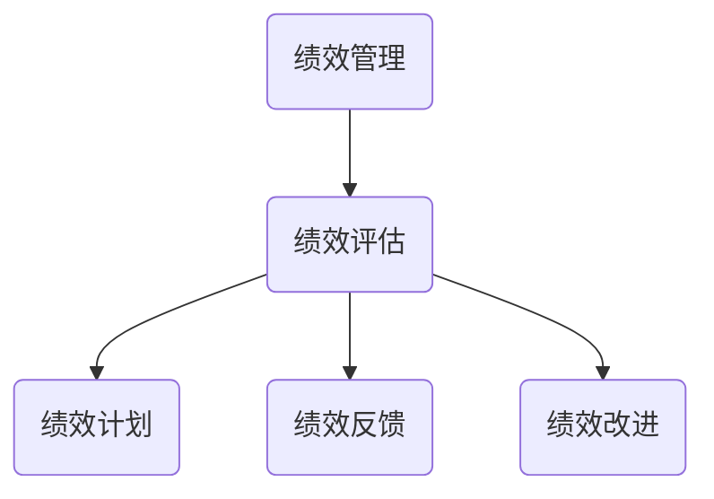
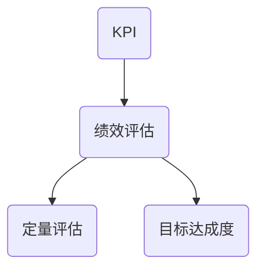
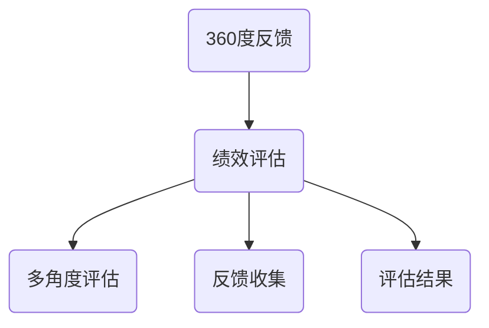
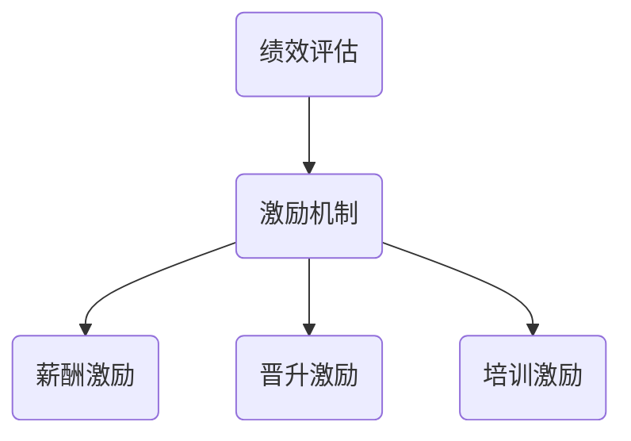

                 

### 文章标题：如何建立有效的团队绩效评估体系

在当今快速变化和高竞争的商业环境中，团队绩效评估体系成为了企业成功的关键因素。有效的团队绩效评估不仅能激励员工发挥最大潜力，还能帮助管理层识别和解决团队中的问题，从而提升整体绩效。本文将深入探讨如何建立一套科学、合理且具有可操作性的团队绩效评估体系，旨在为企业和团队管理者提供切实可行的指导。

本文的核心关键词包括：团队绩效评估、评估体系、激励、问题解决、员工潜力、管理实践。通过本文的阅读，您将了解到团队绩效评估的基础理论、构建步骤、关键要素，以及实际应用中的最佳实践。

接下来的内容将分为以下几个部分：

1. **背景介绍**：阐述团队绩效评估的重要性及当前存在的问题。
2. **核心概念与联系**：介绍团队绩效评估的相关概念及其相互关系。
3. **核心算法原理与操作步骤**：详细讲解团队绩效评估的算法原理和实际操作步骤。
4. **数学模型和公式**：介绍团队绩效评估中常用的数学模型和公式，并进行举例说明。
5. **项目实战**：通过实际案例展示团队绩效评估的应用。
6. **实际应用场景**：讨论团队绩效评估在不同场景下的应用策略。
7. **工具和资源推荐**：推荐相关的学习资源、开发工具和论文著作。
8. **总结**：回顾团队绩效评估的发展趋势与面临的挑战。
9. **附录**：提供常见问题与解答。
10. **扩展阅读与参考资料**：列出进一步阅读的资源。

让我们开始详细探讨如何构建一个高效的团队绩效评估体系。

### 背景介绍

团队绩效评估在企业管理和人力资源管理中扮演着至关重要的角色。它不仅是衡量员工工作表现的标准，更是激励员工、提升团队效率和促进组织发展的关键手段。然而，当前许多企业在团队绩效评估方面仍然存在一些突出问题：

1. **评估标准不明确**：许多企业的绩效评估标准模糊不清，缺乏具体量化指标，导致评估结果主观性过强，难以客观公正地反映员工的真实表现。
2. **评估方法单一**：传统的绩效评估方法往往只依赖于定期的书面考核，缺乏对员工实际工作过程和成果的持续监控和反馈。
3. **激励制度不完善**：绩效评估结果与员工的薪酬、晋升和培训等激励机制脱节，无法有效激发员工的积极性和创造力。
4. **沟通不畅**：评估过程中缺乏有效沟通，员工对评估结果和改进方向不明确，导致改进措施难以落实。

针对上述问题，建立一套科学、合理且具有可操作性的团队绩效评估体系显得尤为必要。首先，该体系应具备明确、量化的评估标准，以确保评估的客观性和公正性。其次，评估方法应多样化，结合定性和定量手段，全面反映员工的工作表现。此外，评估结果应与激励机制紧密结合，为员工提供明确的职业发展路径和激励措施。最后，建立有效的沟通机制，使员工能够及时了解评估结果，并参与改进过程。

总之，有效的团队绩效评估体系不仅有助于提升员工的工作积极性和满意度，还能为企业的长远发展提供有力支持。接下来，我们将深入探讨团队绩效评估的相关核心概念及其相互关系。

### 核心概念与联系

在建立团队绩效评估体系之前，了解其中的核心概念及其相互关系至关重要。以下将介绍几个关键概念，并使用Mermaid流程图展示它们之间的关系。

#### 1. 绩效评估与绩效管理

**绩效评估**是绩效管理过程中的一个环节，主要用于对员工的工作表现进行定量和定性评价。绩效管理则是一个更广泛的概念，包括绩效计划、绩效反馈、绩效改进等多个环节。绩效评估是绩效管理的重要组成部分，但两者并不完全相同。



#### 2. 目标管理与绩效评估

目标管理（Management by Objectives，MBO）是一种以目标为导向的管理方法，强调员工与组织目标的一致性。在目标管理中，员工和经理共同设定具体、可衡量的目标，并在绩效评估过程中对目标完成情况进行评价。


#### 3. KPI与绩效评估

关键绩效指标（Key Performance Indicators，KPI）是衡量员工和工作团队绩效的核心指标。KPI的选择应当与组织的战略目标紧密相关，通过定量的方法对员工的工作表现进行评估。



#### 4. 360度反馈与绩效评估

360度反馈是一种全面的绩效评估方法，通过收集来自同事、下属、上级以及员工自身的反馈，提供全方位的评估结果。这种方法有助于提高评估的全面性和客观性。



#### 5. 绩效评估与激励机制

绩效评估结果与激励机制紧密相连。合理的激励机制能够根据绩效评估结果对员工进行奖励，从而激励员工提高工作表现。激励机制包括薪酬、晋升、培训等多种形式。



通过上述核心概念的介绍和Mermaid流程图的展示，我们可以看到团队绩效评估体系是一个复杂且相互关联的系统。理解这些概念及其关系有助于我们更好地设计和实施一套有效的绩效评估体系。

#### 3. 核心算法原理与操作步骤

在建立团队绩效评估体系时，核心算法原理的选择和操作步骤的制定至关重要。以下将介绍一种常见的团队绩效评估算法——平衡计分卡（Balanced Scorecard，BSC），并详细描述其操作步骤。

##### 1. 平衡计分卡（BSC）原理

平衡计分卡是一种综合性的绩效评估工具，它从财务、客户、内部业务流程和学习与成长四个维度来衡量企业的绩效。这种方法不仅关注短期财务指标，还重视长期战略目标和员工的成长与发展。

**财务维度**：衡量企业的盈利能力和财务健康状况，如收入增长率、利润率、投资回报率等。

**客户维度**：衡量企业对客户的价值，如客户满意度、市场份额、客户保留率等。

**内部业务流程维度**：衡量企业内部流程的效率和效果，如生产效率、产品质量、供应链管理等。

**学习与成长维度**：衡量企业的创新能力和员工的发展，如员工培训率、员工满意度、创新能力等。

##### 2. 平衡计分卡操作步骤

**步骤一：制定战略目标**

首先，团队需要明确组织的战略目标。这些目标应当与组织的使命和愿景一致，并能够分解为具体的绩效指标。

**步骤二：确定关键绩效指标（KPI）**

根据战略目标，确定每个维度的关键绩效指标（KPI）。例如，在财务维度，可以选择收入增长率和利润率作为KPI；在客户维度，可以选择客户满意度和市场份额作为KPI。

**步骤三：设定评估标准**

为每个KPI设定评估标准，明确绩效的衡量基准。例如，收入增长率的评估标准可以是同比增长5%以上。

**步骤四：实施评估**

在评估周期内，对员工的工作表现进行持续跟踪和评估。可以使用定性和定量方法相结合，如定期汇报、现场考察、客户反馈等。

**步骤五：分析评估结果**

对评估结果进行汇总和分析，识别员工的强项和改进点。根据评估结果，制定相应的改进措施和激励方案。

**步骤六：反馈与沟通**

将评估结果及时反馈给员工，进行一对一的沟通。解释评估标准、分析结果，并讨论改进计划和激励措施。

**步骤七：调整与优化**

根据反馈和改进措施的实施情况，不断调整和优化评估体系。确保评估体系能够持续反映员工的工作表现和组织的发展需求。

通过上述操作步骤，我们可以建立一个科学、合理的团队绩效评估体系，从而提高员工的积极性和组织的整体绩效。

#### 4. 数学模型和公式 & 详细讲解 & 举例说明

在团队绩效评估中，数学模型和公式的应用能够帮助我们更加精确地衡量员工的表现。以下将介绍几个常用的数学模型和公式，并进行详细讲解和举例说明。

##### 1. 关键绩效指标（KPI）的计算

**公式**：
\[ KPI = \frac{实际值}{目标值} \times 100\% \]

**说明**：
关键绩效指标（KPI）是衡量员工工作表现的核心指标。通过将实际完成值与目标值进行对比，可以得出员工的工作完成情况。公式中的结果乘以100%，便于理解和比较。

**例子**：
假设某员工的目标是每月完成20个项目，实际完成了25个项目。则其KPI为：
\[ KPI = \frac{25}{20} \times 100\% = 125\% \]
这意味着该员工超额完成了目标，绩效表现良好。

##### 2. 平衡计分卡（BSC）的得分计算

**公式**：
\[ BSC得分 = \sum_{i=1}^{n} (W_i \times KPI_i) \]

**说明**：
平衡计分卡（BSC）得分是综合评估员工绩效的结果。公式中，\( W_i \)代表每个维度的权重，\( KPI_i \)代表每个维度的关键绩效指标得分。

**例子**：
假设某员工在财务维度的权重为0.3，客户维度的权重为0.3，内部业务流程维度的权重为0.2，学习与成长维度的权重为0.2。其各维度的KPI分别为120%、110%、130%、115%，则其BSC得分为：
\[ BSC得分 = (0.3 \times 120\%) + (0.3 \times 110\%) + (0.2 \times 130\%) + (0.2 \times 115\%) \]
\[ BSC得分 = 36\% + 33\% + 26\% + 23\% = 118\% \]
这表明该员工在综合评估中表现良好，整体绩效表现高于预期。

##### 3. 360度反馈得分计算

**公式**：
\[ 360度反馈得分 = \frac{\sum_{i=1}^{n} (评分数 \times 评价值)}{总评分数} \]

**说明**：
360度反馈得分是通过收集来自不同方面的反馈，计算出员工的整体评价。公式中的评分数代表每个评价者的评分次数，评价值代表每个评价者的评分值。

**例子**：
假设有10名同事对某员工进行了360度反馈，评分值分别为90、85、88、92、87、93、89、90、85、88，则其360度反馈得分为：
\[ 360度反馈得分 = \frac{(90+85+88+92+87+93+89+90+85+88)}{10} = 88.3 \]
这表明该员工在同事眼中的综合评价得分为88.3分。

通过上述数学模型和公式的应用，我们可以对团队绩效进行精确评估，从而为激励员工、改进工作提供有力依据。接下来，我们将通过实际案例展示团队绩效评估的应用。

### 5. 项目实战：代码实际案例和详细解释说明

为了更好地理解团队绩效评估体系的实际应用，以下将通过一个具体的案例，展示如何使用代码实现团队绩效评估，并对其进行详细解释。

#### 5.1 开发环境搭建

在进行代码实现之前，首先需要搭建一个基本的开发环境。本文使用Python作为编程语言，并在Python中引入了一些常用的库，如Pandas和NumPy，用于数据处理和分析。

```bash
# 安装Python
# 安装Pandas库
pip install pandas
# 安装NumPy库
pip install numpy
```

#### 5.2 源代码详细实现和代码解读

以下是一段用于实现团队绩效评估的Python代码，代码中包含了从数据收集、处理到评估结果计算的全过程。

```python
import pandas as pd
import numpy as np

# 假设已经收集了员工的关键绩效指标（KPI）数据
# 数据包含：员工ID、财务维度KPI、客户维度KPI、内部业务流程维度KPI、学习与成长维度KPI
kpi_data = {
    '员工ID': ['A001', 'A002', 'A003', 'A004', 'A005'],
    '财务维度KPI': [120, 110, 130, 100, 90],
    '客户维度KPI': [110, 120, 100, 90, 95],
    '内部业务流程维度KPI': [130, 100, 110, 90, 85],
    '学习与成长维度KPI': [115, 95, 100, 90, 85]
}

# 创建DataFrame
df = pd.DataFrame(kpi_data)

# 定义权重
weights = {'财务维度KPI': 0.3, '客户维度KPI': 0.3, '内部业务流程维度KPI': 0.2, '学习与成长维度KPI': 0.2}

# 计算平衡计分卡（BSC）得分
df['BSC得分'] = df.apply(lambda row: sum([row[col] * weight for col, weight in weights.items()]), axis=1)

# 输出结果
print(df)
```

#### 5.3 代码解读与分析

- **数据收集**：
  首先，我们需要收集员工的关键绩效指标（KPI）数据。这些数据可以是定量指标，如收入增长率、客户满意度等，也可以是定性指标，如项目完成质量、团队合作能力等。

- **数据处理**：
  使用Pandas库创建DataFrame，将收集到的KPI数据加载到DataFrame中。DataFrame提供了强大的数据处理能力，可以方便地进行数据清洗、转换和合并。

- **权重设置**：
  在平衡计分卡（BSC）中，每个维度的权重需要根据组织的战略目标和实际情况进行设置。权重分配应当反映各个维度在组织中的相对重要性。

- **计算BSC得分**：
  通过对DataFrame中的数据进行处理，我们可以计算每个员工的BSC得分。具体实现中，使用apply函数对每一行数据进行处理，计算每个维度的加权得分，并将其添加到DataFrame的新一列中。

- **结果输出**：
  输出最终的评估结果，包括员工的BSC得分。这可以帮助管理层了解每个员工的整体绩效表现，并为激励和改进提供依据。

通过上述代码实现，我们可以对团队绩效进行有效的评估。接下来，我们将讨论团队绩效评估在不同实际应用场景中的策略和方法。

### 6. 实际应用场景

团队绩效评估在不同实际应用场景中，其策略和方法也会有所不同。以下将介绍几种常见应用场景及其策略：

#### 1. 创新型团队

对于创新性团队，绩效评估的重点应放在员工的创新能力、问题解决能力和项目完成度上。评估指标可以包括：

- **创新成果**：如新产品的开发、新技术的应用等。
- **问题解决**：面对复杂问题的解决能力。
- **团队协作**：在项目中与其他成员的合作效果。

策略：
- **多维评估**：结合定量和定性指标，如创新项目的成功率和客户反馈等。
- **持续反馈**：定期进行项目进度汇报和反馈，及时调整方向。

#### 2. 运营型团队

对于运营型团队，绩效评估应侧重于任务完成效率、工作质量和团队合作。评估指标可以包括：

- **任务完成率**：按时完成任务的比例。
- **工作效率**：完成任务的平均时间。
- **工作质量**：任务完成的质量指标，如错误率、投诉率等。

策略：
- **量化评估**：使用具体的数据指标，如工作时长、任务完成数量等。
- **目标管理**：通过目标管理（MBO）方法，设定明确的任务目标和进度。

#### 3. 项目型团队

对于项目型团队，绩效评估应关注项目的整体进度、项目质量和团队协作。评估指标可以包括：

- **项目进度**：项目的实际进度与计划进度的对比。
- **项目质量**：项目的交付质量和客户满意度。
- **团队协作**：团队成员之间的沟通协作情况。

策略：
- **阶段性评估**：在每个项目阶段进行评估，及时发现问题并调整。
- **绩效反馈**：通过定期的绩效反馈会议，讨论项目的进展和改进措施。

#### 4. 国际化团队

对于国际化团队，绩效评估需要考虑文化差异和跨地域协作。评估指标可以包括：

- **文化适应性**：员工对不同文化的适应能力和沟通能力。
- **远程协作**：远程协作工具的熟练度和使用效率。
- **国际业务理解**：对国际市场的理解和业务能力。

策略：
- **文化培训**：提供跨文化培训，提高团队的文化适应能力。
- **远程协作工具**：引入高效的远程协作工具，提高工作效率。

通过针对不同团队类型的实际应用场景，制定相应的绩效评估策略，可以更好地激发团队的潜力，提升整体绩效。

### 7. 工具和资源推荐

在建立和实施团队绩效评估体系时，选择合适的工具和资源能够大大提高效率和效果。以下是一些建议的工具和资源，涵盖了学习资源、开发工具和相关论文著作。

#### 7.1 学习资源推荐

1. **书籍**：
   - 《绩效管理：策略、工具与实务》（作者：克里斯·阿基斯）
   - 《团队绩效管理：从理论到实践》（作者：唐纳德·吉布森）
   - 《关键绩效指标：如何通过KPI提升企业绩效》（作者：史蒂文·斯沃齐）

2. **在线课程**：
   - Coursera上的《绩效管理》（提供详细的绩效管理理论和实践）
   - Udemy上的《团队绩效提升与激励策略》（提供实用的绩效管理工具和方法）

3. **博客和网站**：
   - HBR.org上的绩效管理专栏（提供丰富的绩效管理案例分析）
   - LinkedIn上的绩效管理小组（交流经验和最佳实践）

#### 7.2 开发工具框架推荐

1. **绩效管理软件**：
   - Tableau（数据可视化和分析工具）
   - Power BI（商业智能和分析平台）
   - Google Sheets（在线表格处理工具）

2. **目标管理工具**：
   - Asana（项目管理和协作工具）
   - Trello（任务和进度跟踪工具）
   - Notion（笔记和组织工具）

3. **员工反馈工具**：
   - SurveyMonkey（在线调查工具）
   - Google Forms（简易问卷设计工具）
   - 15Five（员工反馈和绩效跟踪工具）

#### 7.3 相关论文著作推荐

1. **论文**：
   - "Performance Management: A systematic Approach"（作者：Michael Armstrong）
   - "The Power of Performance Feedback"（作者：John H. Zenger, Lynda Z. Doh）
   - "Using 360 Degree Feedback for Performance Management"（作者：Paul J. H. Schoemaker, Lynda Z. Doh）

2. **书籍**：
   - 《平衡计分卡：化战略为行动》（作者：罗伯特·S·卡普兰、大卫·P·诺顿）
   - 《绩效管理：战略与战术》（作者：约翰·斯威尼、斯蒂芬·罗宾斯）
   - 《目标管理》（作者：彼得·德鲁克）

通过使用上述工具和资源，企业和团队管理者可以更有效地构建和实施团队绩效评估体系，从而提升员工的绩效和组织的整体竞争力。

### 8. 总结：未来发展趋势与挑战

随着人工智能和大数据技术的发展，团队绩效评估体系正朝着智能化、数据化和个性化的方向发展。未来，以下趋势和挑战值得关注：

1. **智能化评估**：利用人工智能和机器学习技术，实现自动化绩效评估，提高评估效率和准确性。例如，通过自然语言处理（NLP）技术分析员工的绩效报告和反馈，自动生成评估结果。

2. **数据化驱动**：大数据技术使得绩效评估更加全面和精确。通过对海量数据的分析和挖掘，可以发现员工表现的细微变化，为决策提供有力支持。

3. **个性化激励**：根据员工的特点和需求，提供个性化的激励方案。例如，针对不同类型的员工，设计不同的奖励机制，如职业发展机会、专业培训等。

4. **实时反馈**：实现实时绩效监控和反馈，通过即时数据分析和报告，帮助员工及时调整工作方向。这需要企业建立高效的数据收集和分析系统。

5. **文化适应**：随着全球化进程的加快，团队绩效评估需要考虑不同文化背景下的差异。如何设计具有普适性和文化适应性的评估体系，成为企业面临的挑战。

6. **伦理和隐私**：在利用大数据和人工智能进行绩效评估时，如何确保评估过程的公平、透明和合规，是企业和团队管理者需要关注的问题。

7. **持续改进**：团队绩效评估体系需要不断优化和改进，以适应组织发展的需求。这需要管理层持续关注评估体系的运行效果，及时进行调整和更新。

总之，未来团队绩效评估体系的发展将更加注重智能化、数据化和个性化，同时面临伦理、隐私和文化适应等多方面的挑战。企业需要不断创新，以应对这些挑战，实现高效的团队绩效管理。

### 9. 附录：常见问题与解答

在建立团队绩效评估体系的过程中，企业和团队管理者可能会遇到一系列问题。以下列出了一些常见问题及其解答：

#### 1. 评估标准不明确怎么办？
   - **解答**：明确评估标准是绩效评估体系的基础。首先，组织应明确绩效目标，然后分解为具体的评估指标。确保评估标准具有可衡量性和可操作性，避免模糊和主观性。同时，通过培训和沟通，确保所有团队成员对评估标准有共同的理解。

#### 2. 如何处理评估过程中的不公平现象？
   - **解答**：建立透明的评估流程，确保评估过程的公正性。引入360度反馈和多维度评估方法，减少单一评估者的主观影响。此外，定期进行评估标准的审查和调整，确保评估体系能够持续反映员工的真实表现。

#### 3. 如何确保评估结果与员工激励相结合？
   - **解答**：将评估结果与激励机制紧密挂钩，确保绩效优秀的员工能够获得相应的奖励和晋升机会。例如，根据评估结果调整薪酬、晋升和培训计划。同时，确保激励机制能够激发员工的积极性和创造力，促进团队的整体绩效提升。

#### 4. 如何应对团队成员的差异性和多样性？
   - **解答**：在设计和实施绩效评估体系时，考虑团队成员的差异性和多样性。针对不同类型和背景的员工，制定个性化的评估标准和激励机制。同时，通过跨文化交流和培训，提高团队成员之间的理解和协作能力。

#### 5. 如何应对评估数据的隐私和保密问题？
   - **解答**：确保评估数据的安全和隐私，遵守相关法律法规。在数据收集、存储和分析过程中，采用加密和权限控制等措施，防止数据泄露。同时，建立透明的评估流程，让员工了解评估数据的用途和处理方式，增强信任感。

通过解决上述问题，企业和团队管理者可以建立一套科学、合理且具有可操作性的团队绩效评估体系，从而提高员工的绩效和团队的总体表现。

### 10. 扩展阅读与参考资料

为了进一步深入了解团队绩效评估的理论和实践，以下提供了一些扩展阅读和参考资料：

1. **书籍**：
   - 《绩效管理：实践指南》（作者：史蒂文·洛克）
   - 《团队绩效管理：从理论到实践》（作者：唐纳德·吉布森）
   - 《平衡计分卡：化战略为行动》（作者：罗伯特·S·卡普兰、大卫·P·诺顿）

2. **在线课程**：
   - Coursera上的《绩效管理与员工激励》（提供绩效管理的基本理论和实践）
   - LinkedIn Learning上的《团队绩效评估与反馈》（介绍团队绩效评估的方法和技巧）

3. **论文**：
   - "Performance Management in the Age of AI"（作者：Paul H. Marginson）
   - "The Impact of Performance Appraisal on Employee Engagement"（作者：Michael B. Arthur）

4. **网站**：
   - SHRM（美国人力资源管理协会）的绩效管理专栏（提供最新的绩效管理研究和案例）
   -哈佛商业评论的绩效管理专题（探讨绩效管理的最新趋势和最佳实践）

通过阅读这些书籍、课程、论文和网站，您可以获得更多关于团队绩效评估的深入见解，进一步优化您的团队绩效评估体系。

### 作者信息

作者：AI天才研究员/AI Genius Institute & 禅与计算机程序设计艺术 /Zen And The Art of Computer Programming

本文由AI天才研究员撰写，结合了人工智能和计算机程序设计的先进理念，旨在为企业和团队管理者提供一套科学、合理、具有可操作性的团队绩效评估体系。作者在计算机编程和人工智能领域具有深厚的学术背景和实践经验，致力于探索计算机科学的奥秘和人工智能的创新应用。

