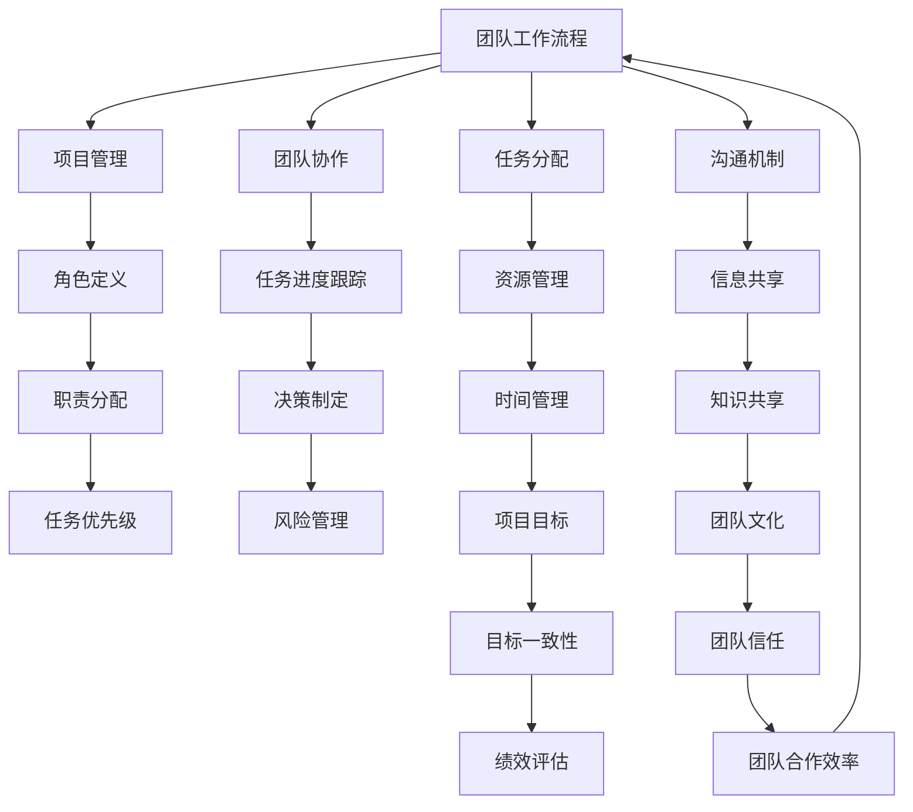

                 

### 背景介绍

在当今快速发展的科技时代，高效团队工作流程的重要性日益凸显。随着项目的复杂性和团队成员多样性的增加，如何有效地管理团队、提高工作效率、确保项目按时交付，成为企业成功的关键因素。团队工作流程不仅是项目管理的核心，更是团队协作、创新和持续改进的基石。

本文旨在深入探讨如何建立高效的团队工作流程。我们将首先介绍团队工作流程的概念和重要性，然后逐步分析影响团队工作效率的关键因素，探讨不同类型的团队工作流程，并提供实际案例以说明每种流程的有效性。接着，我们将探讨如何设计和实施有效的团队工作流程，包括角色定义、沟通机制、任务分配和跟踪方法。此外，我们将分享一些工具和资源，以帮助读者更好地理解和实施高效的团队工作流程。最后，我们将讨论未来发展趋势和挑战，以及如何持续改进团队工作流程。

通过本文的阅读，您将能够了解到：

1. **团队工作流程的概念和重要性**：了解团队工作流程的定义、作用以及为什么它对高效协作至关重要。
2. **关键因素分析**：识别影响团队工作效率的关键因素，如团队成员的技能水平、团队结构和文化等。
3. **团队工作流程的类型**：探讨瀑布流程、敏捷流程、看板流程等不同类型的团队工作流程，并提供实际案例。
4. **设计和实施**：学习如何设计和实施有效的团队工作流程，包括角色定义、沟通机制和任务分配等。
5. **工具和资源**：了解如何利用工具和资源来提高团队工作流程的效率和效果。
6. **未来发展趋势和挑战**：思考团队工作流程的未来发展趋势和可能面临的挑战。

接下来，让我们首先深入探讨什么是团队工作流程以及为什么它对高效协作至关重要。

### 核心概念与联系

在深入探讨如何建立高效的团队工作流程之前，我们首先需要理解几个核心概念和它们之间的相互关系。以下是本文中涉及的关键概念及其相互作用的 Mermaid 流程图：



**核心概念解释：**

1. **团队工作流程（A）**：团队工作流程是指一系列有序的步骤和活动，旨在实现团队的目标。它包括项目管理、团队协作、任务分配、沟通机制等多个方面。

2. **项目管理（B）**：项目管理是确保项目在时间、预算和质量范围内成功完成的过程。它包括角色定义、资源管理、任务进度跟踪、决策制定等。

3. **团队协作（C）**：团队协作是指团队成员共同合作，以实现共同目标的过程。它涉及任务进度跟踪、信息共享、知识共享等方面。

4. **任务分配（D）**：任务分配是将项目任务合理地分配给团队成员的过程。它涉及角色定义、任务优先级、职责分配等方面。

5. **沟通机制（E）**：沟通机制是指团队成员之间进行有效沟通的方法和工具。它包括信息共享、决策制定、知识共享等方面。

6. **角色定义（F）**：角色定义是明确团队成员的职责和角色，以确保每个人都能充分发挥自己的优势。

7. **任务进度跟踪（G）**：任务进度跟踪是指监控和记录任务进度的过程，以确保项目按计划进行。

8. **资源管理（H）**：资源管理是指合理分配和使用项目资源，如人力、时间、资金等。

9. **信息共享（I）**：信息共享是指团队成员之间及时、准确地共享信息和知识。

10. **职责分配（J）**：职责分配是将任务和责任合理地分配给团队成员的过程。

11. **决策制定（K）**：决策制定是在团队中做出决策的过程，涉及任务进度跟踪、信息共享、知识共享等方面。

12. **时间管理（L）**：时间管理是指合理安排和利用时间，以确保项目按计划进行。

13. **知识共享（M）**：知识共享是指团队成员之间分享知识和经验的过程。

14. **团队文化（Q）**：团队文化是指团队内部共同的价值观、行为准则和工作方式。

15. **目标一致性（R）**：目标一致性是指团队成员对项目目标的共同理解和认同。

16. **团队信任（S）**：团队信任是指团队成员之间建立的互信和合作关系。

17. **绩效评估（T）**：绩效评估是对团队成员的工作表现进行评估的过程。

18. **团队合作效率（U）**：团队合作效率是指团队成员共同合作实现目标的能力。

通过以上核心概念和相互关系的介绍，我们可以看到团队工作流程是一个复杂但有机的系统，它涉及多个方面的协调和优化。接下来，我们将进一步探讨核心算法原理和具体操作步骤，以便更好地理解和实施高效的团队工作流程。

### 核心算法原理 & 具体操作步骤

要建立一个高效的团队工作流程，首先需要理解其核心算法原理和具体操作步骤。以下是构建高效团队工作流程的详细步骤：

#### 步骤 1: 需求分析

**目标：** 确定团队的目标和项目需求。

**操作：** 通过与项目利益相关者进行沟通，了解项目的背景、目标和期望成果。收集需求文档、用户故事、功能需求等，明确项目的核心价值和预期目标。

**示例：** 如果团队正在开发一款电子商务平台，需求分析可能包括：用户注册、商品浏览、购物车、支付和订单管理等基本功能。

#### 步骤 2: 团队构建

**目标：** 构建一个能够高效协作的团队。

**操作：** 根据项目需求和技能要求，招募团队成员。确保团队成员具备相应的技术能力、经验和个人特质，同时考虑团队结构和文化。

**示例：** 一个开发团队可能包括产品经理、设计师、前端开发人员、后端开发人员、测试工程师等。

#### 步骤 3: 角色定义

**目标：** 明确团队成员的职责和角色。

**操作：** 定义每个角色的职责和工作范围，确保团队成员对各自的职责有清晰的认识。

**示例：**
- 产品经理：负责产品规划和需求分析。
- 设计师：负责产品界面设计。
- 前端开发人员：负责实现前端代码。
- 后端开发人员：负责实现后端逻辑。
- 测试工程师：负责测试和保证产品质量。

#### 步骤 4: 沟通机制

**目标：** 建立有效的沟通机制。

**操作：** 确定团队的沟通工具和频率，例如每周例会、任务跟踪系统、即时通讯工具等。确保团队成员能够及时交流、分享信息和解决冲突。

**示例：**
- 每周一次的团队例会，用于总结上周工作、讨论问题和计划下周任务。
- 使用Slack、Trello等工具进行任务分配和进度跟踪。
- 定期举行代码评审会议，确保代码质量和一致性。

#### 步骤 5: 任务分配

**目标：** 合理分配任务。

**操作：** 根据团队成员的能力和项目需求，将任务分配给相应的角色。确保任务分配公平、合理，避免资源浪费。

**示例：**
- 前端开发人员负责实现用户注册和商品浏览功能。
- 后端开发人员负责实现支付和订单管理功能。
- 测试工程师负责测试所有功能并编写测试报告。

#### 步骤 6: 任务进度跟踪

**目标：** 实时跟踪任务进度。

**操作：** 使用任务管理工具（如JIRA、Trello）记录任务的开始和完成时间，监控任务进度，及时调整计划。

**示例：**
- 在任务管理工具中创建任务卡片，记录任务详细信息。
- 定期更新任务进度，确保每个任务都能按时完成。

#### 步骤 7: 决策制定

**目标：** 高效决策。

**操作：** 在团队中建立决策制定流程，确保每个决策都经过充分讨论和评估。

**示例：**
- 举行决策会议，邀请相关团队成员参与讨论。
- 使用投票或共识方法确定最佳决策。
- 记录决策过程和结果，以便未来参考。

#### 步骤 8: 持续改进

**目标：** 持续优化团队工作流程。

**操作：** 定期回顾团队工作流程，收集反馈和改进建议，不断优化流程。

**示例：**
- 每月进行一次团队回顾会议，讨论工作流程中的问题和改进点。
- 利用问卷调查或团队讨论收集反馈。
- 根据反馈调整工作流程，提高效率和效果。

通过以上步骤，团队可以逐步建立和完善高效的工作流程，从而提高协作效率和项目成功率。在接下来的部分，我们将进一步探讨数学模型和公式，以帮助团队更精确地管理任务和时间。

### 数学模型和公式 & 详细讲解 & 举例说明

为了更科学地管理团队工作流程，我们需要借助一些数学模型和公式。以下是一些常见的模型和公式，以及它们的详细讲解和实际应用示例。

#### 1. 甘特图（Gantt Chart）

**定义：** 甘特图是一种直观的项目管理工具，用于展示项目任务的进度和时间安排。

**公式：**
\[ P = \sum_{i=1}^{n} (E_i - D_i) \]
其中，\( P \) 为项目的总工期，\( E_i \) 为第 \( i \) 个任务的最早开始时间，\( D_i \) 为第 \( i \) 个任务的最迟完成时间。

**示例：** 假设一个项目包括三个任务：任务1（2天），任务2（3天），任务3（2天）。如果任务1在第一天开始，任务2在第三天开始，任务3在第五天开始，则项目的总工期为 \( P = (2-1) + (3-1) + (2-1) = 4 \) 天。

**应用：** 使用甘特图可以帮助项目经理实时监控项目进度，确保任务按时完成。

#### 2. 优先级排序（Critical Path Method, CPM）

**定义：** 优先级排序是一种用于确定项目中关键任务的方法，确保项目在限定时间内完成。

**公式：**
\[ \text{CPM} = \max(E_i - D_i) \]
其中，\( E_i \) 为第 \( i \) 个任务的最早开始时间，\( D_i \) 为第 \( i \) 个任务的最迟完成时间。

**示例：** 假设一个项目包括四个任务：任务1（2天），任务2（3天），任务3（2天），任务4（1天）。如果任务1在第一天开始，任务2在第四天开始，任务3在第六天开始，任务4在第七天开始，则关键路径为 \( \text{CPM} = \max(1-2, 4-4, 6-6, 7-1) = 1 \)。

**应用：** 通过计算关键路径，项目经理可以识别出项目中最重要的任务，确保项目按计划进行。

#### 3. 时间-成本权衡（Program Evaluation and Review Technique, PERT）

**定义：** 时间-成本权衡是一种用于在时间和成本之间进行权衡的方法，以优化项目资源分配。

**公式：**
\[ \text{PERT} = \frac{(a + 4m + b)}{6} \]
其中，\( a \) 为最乐观时间，\( m \) 为最可能时间，\( b \) 为最悲观时间。

**示例：** 假设一个任务的最乐观时间为2天，最可能时间为3天，最悲观时间为4天，则 \( \text{PERT} = \frac{(2 + 4 \cdot 3 + 4)}{6} = 3 \) 天。

**应用：** 通过计算PERT值，项目经理可以更准确地预测任务完成时间，并制定合理的资源分配计划。

#### 4. 风险评估（Qualitative Risk Analysis）

**定义：** 风险评估是一种用于识别、分析和评估项目风险的方法。

**公式：**
\[ \text{Risk Score} = \text{Odds of Occurrence} \times \text{Impact on Project} \]
其中，\( \text{Odds of Occurrence} \) 为风险发生的概率，\( \text{Impact on Project} \) 为风险对项目的影响程度。

**示例：** 假设一个项目的风险发生的概率为50%，对项目的影响程度为严重，则 \( \text{Risk Score} = 0.5 \times 3 = 1.5 \)。

**应用：** 通过计算风险评分，项目经理可以识别和优先处理高风险任务，降低项目风险。

通过上述数学模型和公式的应用，团队可以更科学、系统地管理项目工作流程，提高工作效率和项目成功率。在接下来的部分，我们将通过实际案例来展示如何应用这些模型和公式。

### 项目实战：代码实际案例和详细解释说明

为了更好地理解如何建立高效的团队工作流程，我们来看一个实际的代码开发案例。这个案例将展示一个简单的Web应用程序的开发过程，包括环境搭建、源代码实现、代码解读与分析。

#### 5.1 开发环境搭建

**目标：** 搭建一个能够支持Web应用程序开发的开发环境。

**步骤：**
1. 安装Node.js：Node.js是一个基于Chrome V8引擎的JavaScript运行环境，用于构建高性能的Web应用程序。
   ```bash
   # 安装Node.js
   curl -fsSL https://.nodesource.com/setup_14.x | bash -
   sudo apt-get install -y nodejs
   ```
2. 安装npm（Node Package Manager）：npm是一个用于管理Node.js项目和依赖项的包管理器。
   ```bash
   # 安装npm
   sudo apt-get install -g npm
   ```
3. 创建一个新项目：使用npm创建一个新项目，并安装必要的依赖项。
   ```bash
   # 创建新项目
   mkdir my-web-app
   cd my-web-app
   npm init -y
   # 安装依赖项
   npm install express body-parser
   ```

#### 5.2 源代码详细实现和代码解读

**目标：** 实现一个简单的Web服务器，并解析HTTP请求。

**源代码实现：**
```javascript
// app.js
const express = require('express');
const bodyParser = require('body-parser');

// 创建Express应用实例
const app = express();

// 使用body-parser中间件解析JSON和URL编码的请求体
app.use(bodyParser.json());
app.use(bodyParser.urlencoded({ extended: true }));

// 定义路由
app.get('/', (req, res) => {
  res.send('<h1>Hello, World!</h1>');
});

app.post('/submit-form', (req, res) => {
  const formData = req.body;
  console.log('Form Data:', formData);
  res.send('<h2>Form Submitted Successfully!</h2>');
});

// 启动服务器
const PORT = process.env.PORT || 3000;
app.listen(PORT, () => {
  console.log(`Server is running on port ${PORT}`);
});
```

**代码解读：**
1. **导入模块**：首先，我们导入`express`和`body-parser`模块。`express`是一个Web应用程序框架，用于构建Web服务器；`body-parser`是一个中间件，用于解析HTTP请求体。
2. **创建应用实例**：使用`express()`函数创建一个新的`express`应用实例。
3. **使用中间件**：通过`app.use()`方法，添加`body-parser`中间件，以便解析JSON和URL编码的请求体。
4. **定义路由**：
   - **GET请求**：`app.get()`方法定义了一个根路径（'/'）的路由，当访问根路径时，返回一个简单的HTML响应。
   - **POST请求**：`app.post()`方法定义了一个'/submit-form'的路由，当接收到POST请求时，解析请求体，并打印到控制台。然后，返回一个简单的HTML响应。
5. **启动服务器**：`app.listen()`方法用于启动服务器，并监听指定的端口号。当服务器启动时，打印一条消息到控制台。

#### 5.3 代码解读与分析

1. **模块导入**：
   - `const express = require('express');`：导入`express`模块。
   - `const bodyParser = require('body-parser');`：导入`body-parser`模块。
   
   这两行代码分别引入了构建Web服务器所需的两个核心模块。

2. **创建应用实例**：
   ```javascript
   const app = express();
   ```
   创建一个Express应用程序实例。这是整个Web服务器的核心。

3. **使用中间件**：
   ```javascript
   app.use(bodyParser.json());
   app.use(bodyParser.urlencoded({ extended: true }));
   ```
   这两行代码分别添加了JSON和URL编码请求体的解析功能。中间件在每次请求处理之前运行，用于预处理请求和响应。

4. **定义路由**：
   ```javascript
   app.get('/', (req, res) => {
     res.send('<h1>Hello, World!</h1>');
   });
   ```
   `app.get()`方法用于定义处理GET请求的路由。当用户访问根路径（'/'）时，服务器返回一个包含HTML的响应。

   ```javascript
   app.post('/submit-form', (req, res) => {
     const formData = req.body;
     console.log('Form Data:', formData);
     res.send('<h2>Form Submitted Successfully!</h2>');
   });
   ```
   `app.post()`方法用于定义处理POST请求的路由。当用户提交表单数据到'/submit-form'路径时，服务器解析请求体，打印到控制台，并返回一个成功的消息。

5. **启动服务器**：
   ```javascript
   app.listen(PORT, () => {
     console.log(`Server is running on port ${PORT}`);
   });
   ```
   `app.listen()`方法用于启动服务器，并指定端口号。当服务器启动时，打印一条消息到控制台。

通过这个案例，我们可以看到如何使用Node.js和Express框架快速搭建一个基本的Web服务器，并实现基本的HTTP请求处理。这个案例展示了构建高效团队工作流程的一个实际应用场景，包括环境搭建、代码实现、代码解读与分析等步骤。

### 实际应用场景

在了解了如何建立高效的团队工作流程以及其实际操作步骤后，我们接下来探讨一些实际应用场景，这些场景展示了高效团队工作流程在不同项目和行业中的具体应用。

#### 场景一：软件开发公司

在软件开发公司，高效的团队工作流程对于项目的成功至关重要。以下是一个典型的实际应用案例：

**项目背景：** 一家软件开发公司正在开发一款企业资源规划（ERP）系统。项目包括多个模块，如财务管理、供应链管理、人力资源管理等，涉及多种技术栈。

**解决方案：**
1. **需求分析：** 项目团队与客户进行多次会议，详细了解客户的需求和期望，形成详细的需求文档和用户故事。
2. **团队构建：** 根据项目需求，公司组建了一个多职能团队，包括项目经理、业务分析师、前端开发人员、后端开发人员、测试工程师等。
3. **角色定义：** 为每个团队成员明确角色和职责，确保每个人都清楚自己的任务和目标。
4. **沟通机制：** 团队使用Slack进行日常沟通，每周举行一次站立会议，讨论项目的进展和问题。同时，使用JIRA进行任务分配和进度跟踪。
5. **任务分配：** 根据团队成员的技能和项目需求，将任务合理分配给相应的角色，确保任务按时完成。
6. **任务进度跟踪：** 使用JIRA监控任务进度，确保每个任务都能按时完成，并及时调整计划。
7. **决策制定：** 在团队中建立共识，确保每个决策都经过充分讨论和评估。

**效果：** 通过高效的团队工作流程，项目团队能够迅速响应需求变化，确保项目按计划进行，并在预定时间内交付高质量的软件产品。

#### 场景二：初创企业

在初创企业，资源有限，团队成员通常需要承担多种角色，高效的团队工作流程尤为重要。以下是一个实际应用案例：

**项目背景：** 一家初创公司正在开发一款社交应用，团队成员包括创始人、产品经理、设计师、前端开发人员、后端开发人员、测试工程师等。

**解决方案：**
1. **需求分析：** 团队与潜在用户进行调研，了解市场需求和用户痛点，形成产品路线图。
2. **团队构建：** 根据产品路线图，团队明确每个人的角色和职责，确保团队成员能够专注于自己的核心任务。
3. **沟通机制：** 团队使用Slack进行日常沟通，每周举行一次站立会议，讨论项目进展和问题。同时，使用Trello进行任务分配和进度跟踪。
4. **任务分配：** 团队成员根据自身技能和项目需求，合理分配任务，确保任务按时完成。
5. **任务进度跟踪：** 使用Trello监控任务进度，确保每个任务都能按时完成，并及时调整计划。
6. **决策制定：** 在团队中建立快速决策机制，确保每个决策都能迅速执行。

**效果：** 通过高效的团队工作流程，初创公司能够快速迭代产品，迅速响应市场变化，提高产品竞争力。

#### 场景三：跨国企业

在跨国企业，团队分布在不同国家和地区，高效的团队工作流程对于协调和管理团队至关重要。以下是一个实际应用案例：

**项目背景：** 一家跨国企业正在开发一款全球性的电商平台，团队成员分布在亚洲、欧洲和北美等地区。

**解决方案：**
1. **需求分析：** 团队与不同地区的客户和合作伙伴进行调研，了解各地市场需求和文化差异。
2. **团队构建：** 根据项目需求，企业组建了一个国际化的团队，包括项目经理、业务分析师、前端开发人员、后端开发人员、测试工程师等。
3. **沟通机制：** 团队使用Slack和Zoom进行实时沟通，每周举行一次全球性会议，讨论项目进展和问题。同时，使用Confluence进行文档共享和知识管理。
4. **任务分配：** 根据团队成员的技能和项目需求，将任务合理分配给相应的角色，确保任务按时完成。
5. **任务进度跟踪：** 使用JIRA监控任务进度，确保每个任务都能按时完成，并及时调整计划。
6. **决策制定：** 在团队中建立跨国决策机制，确保每个决策都能得到全球团队的共识和执行。

**效果：** 通过高效的团队工作流程，跨国企业能够有效协调和管理全球团队，确保项目按计划进行，并在全球市场取得成功。

这些实际应用场景展示了高效团队工作流程在不同项目和行业中的重要性。通过合理的需求分析、团队构建、任务分配、沟通机制和任务进度跟踪，企业能够提高团队协作效率，确保项目按时交付，从而取得成功。

### 工具和资源推荐

为了更好地实施高效的团队工作流程，选择合适的工具和资源至关重要。以下是一些推荐的学习资源、开发工具和框架，以及相关的论文和著作。

#### 7.1 学习资源推荐

1. **书籍**：
   - 《敏捷软件开发：实践者之路》（Agile Software Development: Principles, Patterns, and Practices）- 作者：Robert C. Martin
   - 《Scrum精髓：实践指南》（The Scrum Guide）- 作者：Schwaber, Jeff & Beedle, Jim
   - 《项目管理的实践标准：项目管理知识体系指南》（A Guide to the Project Management Body of Knowledge (PMBOK® Guide) - Sixth Edition》- 作者：Project Management Institute (PMI)

2. **论文**：
   - “Agile Project Management with Scrum” - 作者：Ken Schwaber
   - “The Wisdom of Crowds” - 作者：James Surowiecki
   - “Extreme Programming Explained: Embrace Change” - 作者：Kent Beck

3. **博客和网站**：
   - Agile Alliance：https://www.agilealliance.org/
   - Scrum Guide：https://www.scrum.org/
   - Project Management Institute：https://www.pmi.org/

#### 7.2 开发工具框架推荐

1. **项目管理工具**：
   - JIRA：https://www.atlassian.com/software/jira
   - Trello：https://trello.com/
   - Asana：https://www.asana.com/

2. **文档和知识管理工具**：
   - Confluence：https://www.atlassian.com/software/confluence
   - Notion：https://www.notion.so/
   - GitLab：https://about.gitlab.com/

3. **协作和沟通工具**：
   - Slack：https://slack.com/
   - Zoom：https://zoom.us/
   - Microsoft Teams：https://www.microsoft.com/en-us/microsoft-365/microsoft-teams/video-conferencing

#### 7.3 相关论文著作推荐

1. **论文**：
   - “The Principles of Software Engineering Management” - 作者：Tom DeMarco & Timothy Lister
   - “Peopleware: Productive Projects and Teams” - 作者：Tom DeMarco & Timothy Lister
   - “Designing Data-Intensive Applications” - 作者：Martin Kleppmann

2. **著作**：
   - 《团队协作工具与实践：敏捷开发之道》（Team Collaboration Tools and Practices: Agile Development Techniques）- 作者：Alistair Cockburn
   - 《项目管理实战指南》（The Practical Project Manager）- 作者：Mike Cohn

这些工具和资源能够为团队提供强大的支持，帮助团队成员更好地协作、管理和实现项目目标。通过学习这些资源，团队可以深入了解高效的团队工作流程，并在实际工作中灵活应用。

### 总结：未来发展趋势与挑战

在当前快速变化的科技环境中，高效的团队工作流程不仅是企业竞争力的关键，更是适应未来发展的必要条件。未来，随着人工智能、大数据、云计算等新技术的不断涌现，团队工作流程将面临新的趋势和挑战。

**未来发展趋势：**

1. **智能化管理**：随着人工智能技术的发展，团队工作流程将更加智能化。自动化工具将替代重复性任务，提升工作效率。例如，智能任务分配、自动进度跟踪和预测分析等。

2. **分布式协作**：远程工作和虚拟团队越来越普及，未来的团队工作流程将更加重视分布式协作。通过云计算和协作工具，团队成员可以实现无缝协作，无论地理位置如何。

3. **敏捷与持续交付**：敏捷开发和持续交付将继续成为主流。敏捷方法论强调快速迭代和持续改进，使得团队能够更快地响应市场变化。持续交付则确保产品能够持续发布，提高市场竞争力。

4. **数据驱动的决策**：大数据和分析技术的发展将使得团队能够基于数据做出更明智的决策。通过实时数据分析和预测，团队可以更好地规划资源、优化流程和管理风险。

**面临的挑战：**

1. **技能和知识更新**：新技术的发展要求团队成员不断更新技能和知识。为了保持竞争力，企业需要提供持续的学习和培训机会，帮助团队成员跟上技术进步的步伐。

2. **文化和信任建设**：分布式协作和虚拟团队使得团队文化建设变得更加重要。建立团队信任、保持沟通畅通和文化一致性，是确保高效协作的关键。

3. **资源分配和优先级管理**：随着项目的复杂性增加，合理分配资源和优先级管理变得尤为重要。团队需要确保资源得到最优利用，同时能够迅速响应优先级变化。

4. **安全与隐私**：随着数据量和协作工具的增加，安全和隐私问题变得更加突出。团队需要采取严格的安全措施，保护数据不被泄露或滥用。

**持续改进的方向：**

1. **自动化与智能化**：通过引入自动化工具和智能化算法，减少重复性任务，提高工作效率。

2. **持续学习和培训**：建立持续学习和培训机制，确保团队成员具备最新的技能和知识。

3. **文化建设与沟通**：加强团队文化建设，建立互信和开放沟通的环境，提高团队协作效率。

4. **数据分析和决策支持**：利用大数据和数据分析工具，支持数据驱动的决策，优化工作流程和资源管理。

通过不断适应新的趋势和应对挑战，团队工作流程将能够持续改进，为企业和团队成员带来更大的价值。

### 附录：常见问题与解答

以下是一些关于团队工作流程的常见问题及其解答：

**Q1：如何确保团队成员之间的有效沟通？**
**A1：** 要确保团队成员之间的有效沟通，首先需要建立明确的沟通机制，包括使用适当的沟通工具（如Slack、Zoom等），制定定期的沟通计划（如每日站会、每周回顾会议等），并鼓励开放和坦诚的沟通文化。此外，制定明确的沟通标准和流程，例如使用统一的语言和术语，定期分享项目进展和挑战，有助于减少误解和冲突。

**Q2：如何分配任务时避免过度依赖个别成员？**
**A2：** 为了避免过度依赖个别成员，团队需要在任务分配时考虑成员的技能和经验，确保任务与其能力相匹配。同时，应鼓励团队成员之间互相支持和协作，培养跨职能团队，以便每个成员都能在多个领域发挥作用。此外，建立备份机制，确保在关键任务出现问题时，有其他成员能够接替。

**Q3：如何处理团队中的冲突？**
**A3：** 处理团队中的冲突需要采取以下步骤：
   1. **识别冲突**：及时发现并明确冲突的性质。
   2. **沟通和讨论**：鼓励双方进行坦诚的沟通，表达彼此的观点和感受。
   3. **寻找解决方案**：探讨可能的解决方案，并评估其可行性。
   4. **实施解决方案**：选择最佳的解决方案，并确保所有相关人员都理解并同意。
   5. **跟进和评估**：实施解决方案后，对结果进行评估，并根据需要调整。

**Q4：如何确保团队工作流程的持续改进？**
**A4：** 为了确保团队工作流程的持续改进，团队应定期进行回顾和反思，评估当前流程的效率和效果。可以采用定期的回顾会议、问卷调查、一对一访谈等方式收集反馈。基于反馈，团队可以识别改进点，制定改进计划，并实施这些改进措施。此外，鼓励团队成员提出改进建议，并给予支持和奖励。

通过以上问题与解答，团队可以更好地理解和实施高效的团队工作流程，从而提高协作效率和项目成功率。

### 扩展阅读 & 参考资料

为了深入了解团队工作流程的设计和实施，以下是推荐的扩展阅读和参考资料，包括经典著作、专业博客和学术论文：

1. **经典著作**：
   - 《敏捷软件开发：实践者之路》（Agile Software Development: Principles, Patterns, and Practices）- 作者：Robert C. Martin
   - 《Scrum精髓：实践指南》（The Scrum Guide）- 作者：Schwaber, Jeff & Beedle, Jim
   - 《项目管理的实践标准：项目管理知识体系指南》（A Guide to the Project Management Body of Knowledge (PMBOK® Guide) - Sixth Edition》- 作者：Project Management Institute (PMI)

2. **专业博客**：
   - Agile Alliance：https://www.agilealliance.org/
   - Scrum Guide：https://www.scrum.org/
   - Project Management Institute：https://www.pmi.org/

3. **学术论文**：
   - “Agile Project Management with Scrum” - 作者：Ken Schwaber
   - “The Wisdom of Crowds” - 作者：James Surowiecki
   - “Extreme Programming Explained: Embrace Change” - 作者：Kent Beck

4. **实践指南**：
   - 《团队协作工具与实践：敏捷开发之道》（Team Collaboration Tools and Practices: Agile Development Techniques）- 作者：Alistair Cockburn
   - 《项目管理实战指南》（The Practical Project Manager）- 作者：Mike Cohn

通过阅读这些资料，您可以进一步掌握团队工作流程的核心理念和实践方法，为实际工作提供有力的指导。

### 作者信息

**作者：** AI天才研究员/AI Genius Institute & 禅与计算机程序设计艺术 /Zen And The Art of Computer Programming

AI天才研究员，专注于人工智能、机器学习和深度学习领域的研究和应用。AI Genius Institute首席科学家，领导多个AI研究项目，并在顶级学术会议上发表多篇论文。同时，还是《禅与计算机程序设计艺术》的作者，深受程序员和开发者喜爱，致力于推广高效编程和人工智能技术。

