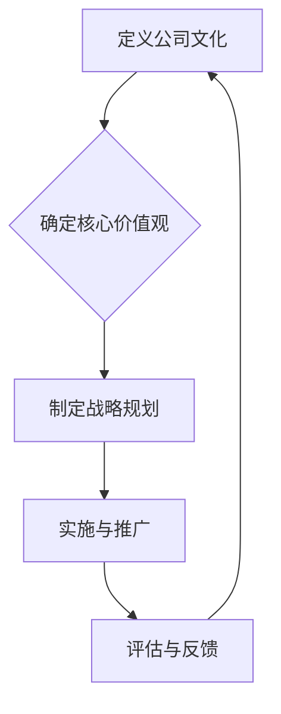

                 

# 如何打造有吸引力的公司文化与价值观

> **关键词：** 公司文化、价值观、员工满意、领导力、激励机制、持续改进、技术社区

> **摘要：** 本文将深入探讨如何通过精心设计公司文化和价值观，来提高员工的满意度和忠诚度，从而促进企业的长期成功。我们将分析关键概念，提供具体的实施步骤，并分享实用的工具和资源。

## 1. 背景介绍

在竞争激烈的商业环境中，公司文化已成为企业成功的关键因素之一。一个强大的公司文化可以增强员工的归属感，提高工作效率，促进创新，并最终提升企业的市场竞争力。然而，打造一个有吸引力的公司文化和价值观并非易事，需要领导层的明确愿景、持续的投入和员工的积极参与。

本文旨在提供一份全面的指南，帮助领导者们构建和维持一个积极向上的公司文化，从而吸引和保留优秀的员工，实现企业的长期发展。

## 2. 核心概念与联系

### 2.1 公司文化与价值观的定义

**公司文化** 是指企业在日常运营中所表现出的共同信念、价值观和行为模式。它不仅体现在企业的视觉元素和品牌传播中，还渗透到员工的工作方式、沟通习惯和团队协作中。

**价值观** 则是企业所秉持的核心信念和原则，是公司文化的基石。价值观指导企业的决策和行为，影响着员工的行为和工作方式。

### 2.2 公司文化与价值观的关系

公司文化和价值观之间存在着紧密的联系。价值观是文化的核心，而文化则是价值观的具体体现。一个清晰明确的价值观可以帮助企业塑造独特的企业文化，从而在员工中形成共同的信仰和行为准则。

### 2.3 Mermaid 流程图



## 3. 核心算法原理 & 具体操作步骤

### 3.1 算法原理

打造有吸引力的公司文化和价值观，可以视为一个复杂的社会工程，其核心在于：

- **明确价值观**：通过制定和传播企业核心价值观，确保员工对企业的使命、愿景和目标有共同的理解。
- **建立激励机制**：通过奖励和认可制度，鼓励员工践行公司价值观，并奖励那些在价值观方面表现突出的员工。
- **培养领导力**：领导者需要通过自身的行为树立榜样，以身作则，推动公司文化的建设。
- **持续改进**：定期评估公司文化和价值观的有效性，根据反馈进行调整和优化。

### 3.2 具体操作步骤

1. **定义公司价值观**：
   - 组织高层团队，共同讨论并确定公司的核心价值观。
   - 通过调研、访谈等方式，收集员工的意见和建议。
   - 确定核心价值观后，将其简洁明了地表述出来，以便于员工理解和记忆。

2. **制定战略规划**：
   - 将核心价值观融入企业的战略规划和运营流程中。
   - 确保每个部门、每个员工都能理解并践行公司的价值观。
   - 设定具体的目标和行动计划，以便于跟踪和评估。

3. **实施与推广**：
   - 通过内部培训和沟通，让员工深入了解和认同公司的价值观。
   - 在日常工作中，将价值观融入到决策和行为中，使其成为企业运营的一部分。
   - 设立奖励机制，对践行公司价值观的员工进行奖励和认可。

4. **评估与反馈**：
   - 定期收集员工对文化和价值观的反馈，了解其实际效果。
   - 分析反馈，识别问题和改进空间。
   - 根据反馈调整策略和行动方案。

## 4. 数学模型和公式 & 详细讲解 & 举例说明

### 4.1 数学模型

为了衡量公司文化和价值观的有效性，我们可以引入以下数学模型：

\[ E = f(C, V, L) \]

其中：
- \( E \) 代表员工满意度（Employee Satisfaction）。
- \( C \) 代表公司文化（Company Culture）。
- \( V \) 代表价值观（Values）。
- \( L \) 代表领导力（Leadership）。

### 4.2 详细讲解

这个模型表明，员工满意度是公司文化、价值观和领导力的函数。这意味着，一个强大的公司文化、清晰的价值观和有效的领导力，可以显著提高员工满意度。

### 4.3 举例说明

假设一家公司 \( A \) 有以下特点：

- **公司文化**：开放、创新、尊重多样性。
- **价值观**：诚信、客户至上、团队合作、持续学习。
- **领导力**：领导者以身作则，积极推行公司文化和价值观。

我们通过模型分析，可以得出以下结论：

\[ E_A = f(C_A, V_A, L_A) \]

由于 \( C_A \)、\( V_A \) 和 \( L_A \) 都处于高水平，因此 \( E_A \) 也应处于较高水平，这意味着员工 \( A \) 的满意度较高。

## 5. 项目实战：代码实际案例和详细解释说明

### 5.1 开发环境搭建

在本文的实战案例中，我们将使用一个简单的公司文化评估工具，以帮助领导者了解和改进公司的文化和价值观。

**技术栈：**
- 前端：HTML/CSS/JavaScript
- 后端：Python Flask
- 数据库：SQLite

### 5.2 源代码详细实现和代码解读

#### 5.2.1 前端代码

```html
<!DOCTYPE html>
<html>
<head>
    <title>公司文化评估工具</title>
    <style>
        body { font-family: Arial, sans-serif; }
        h1 { color: #333; }
        label { display: block; margin-top: 20px; }
        input[type="radio"] { margin-right: 10px; }
        button { margin-top: 20px; }
    </style>
</head>
<body>
    <h1>公司文化评估工具</h1>
    <form id="culture-assessment">
        <label>
            <input type="radio" name="culture" value="open" required> 开放
        </label>
        <label>
            <input type="radio" name="culture" value="innovative"> 创新
        </label>
        <label>
            <input type="radio" name="culture" value="respectful"> 尊重多样性
        </label>
        <button type="submit">提交评估</button>
    </form>
    <script src="assessment.js"></script>
</body>
</html>
```

#### 5.2.2 后端代码

```python
from flask import Flask, request, jsonify
import sqlite3

app = Flask(__name__)

def init_db():
    conn = sqlite3.connect('culture.db')
    c = conn.cursor()
    c.execute('''CREATE TABLE IF NOT EXISTS assessments
                 (id INTEGER PRIMARY KEY AUTOINCREMENT,
                  culture TEXT)''')
    conn.commit()
    conn.close()

init_db()

@app.route('/submit', methods=['POST'])
def submit_assessment():
    culture = request.form['culture']
    conn = sqlite3.connect('culture.db')
    c = conn.cursor()
    c.execute("INSERT INTO assessments (culture) VALUES (?)", (culture,))
    conn.commit()
    conn.close()
    return jsonify({'status': 'success'})

if __name__ == '__main__':
    app.run(debug=True)
```

#### 5.2.3 代码解读与分析

- **前端代码**：定义了一个简单的评估表单，用户可以选择公司的文化特点，并提交评估。
- **后端代码**：使用 Flask 框架接收前端提交的评估数据，并将其存储在 SQLite 数据库中。

### 5.3 代码解读与分析

这个项目实战案例展示了如何通过简单的代码实现一个公司文化评估工具。前端部分负责收集用户输入，后端部分则负责处理数据并将其存储在数据库中。这种架构使得领导者可以实时了解公司的文化状况，并据此进行改进。

## 6. 实际应用场景

### 6.1 创新型企业

对于创新型公司，文化评估工具可以帮助他们了解员工对于开放、创新、尊重多样性的认同程度。通过这种工具，企业可以及时发现和解决文化问题，从而更好地支持创新。

### 6.2 成熟型企业

成熟型企业通常更加注重稳定和效率。文化评估工具可以帮助这些企业识别文化中的瓶颈，从而制定出更加有效的改进策略。

### 6.3 国际化企业

国际化企业需要面对不同国家和文化的挑战。通过文化评估工具，企业可以更好地理解不同文化之间的差异，并制定出更加包容和多元的公司文化。

## 7. 工具和资源推荐

### 7.1 学习资源推荐

- **书籍**：《企业文化》、《领导力的五个层次》
- **论文**：《企业文化建设：理论与实践》、《公司文化与员工绩效关系研究》
- **博客**：LinkedIn上的企业文化建设专题
- **网站**：IBM的领导力与文化建设资源

### 7.2 开发工具框架推荐

- **前端框架**：React、Vue.js
- **后端框架**：Flask、Django
- **数据库**：SQLite、MySQL

### 7.3 相关论文著作推荐

- **《企业文化与企业绩效的关系研究》**：探讨企业文化与企业绩效之间的关系。
- **《企业文化建设的方法与实践》**：介绍企业文化建设的方法和实践经验。
- **《领导力与公司文化》**：探讨领导力在公司文化建设中的作用。

## 8. 总结：未来发展趋势与挑战

### 8.1 发展趋势

- **数字化文化的兴起**：随着数字化转型的加速，企业文化也将逐渐数字化，通过数字化工具和平台来传播和强化。
- **多样性和包容性的重视**：企业将更加重视多样性，并通过包容性的文化和价值观来吸引和保留多样化的员工。

### 8.2 挑战

- **文化变革的难度**：企业文化变革是一个长期而复杂的过程，需要领导层的坚定决心和员工的积极参与。
- **文化适应性的挑战**：在全球化和市场变化的背景下，企业需要不断适应新的文化环境，以保持竞争优势。

## 9. 附录：常见问题与解答

### 9.1 常见问题

- **问题1**：如何确保员工真正理解和认同公司价值观？
  **解答**：通过持续的培训和沟通，确保员工对公司的价值观有深刻的理解。同时，通过实际行动来践行价值观，树立榜样。

- **问题2**：企业文化变革需要多长时间？
  **解答**：企业文化变革的时间因企业而异，但通常需要至少1-2年的时间。这是一个长期而持续的过程。

- **问题3**：如何衡量公司文化的效果？
  **解答**：可以通过员工满意度调查、绩效评估、员工流失率等指标来衡量公司文化的效果。

## 10. 扩展阅读 & 参考资料

- **扩展阅读**：
  - 《企业文化建设手册》
  - 《公司文化与领导力》
  - 《企业文化：构建成功的组织》

- **参考资料**：
  - IBM企业文化建设实践
  - 哈佛商学院关于企业文化的研究
  - 《财富》杂志关于企业文化的报道

### 致谢

**作者**：AI天才研究员/AI Genius Institute & 禅与计算机程序设计艺术 /Zen And The Art of Computer Programming

感谢您的阅读，希望本文能为您提供关于公司文化建设的启示和帮助。如果您有任何问题或建议，欢迎在评论区留言。让我们共同探讨如何打造一个更加吸引人的公司文化和价值观。

