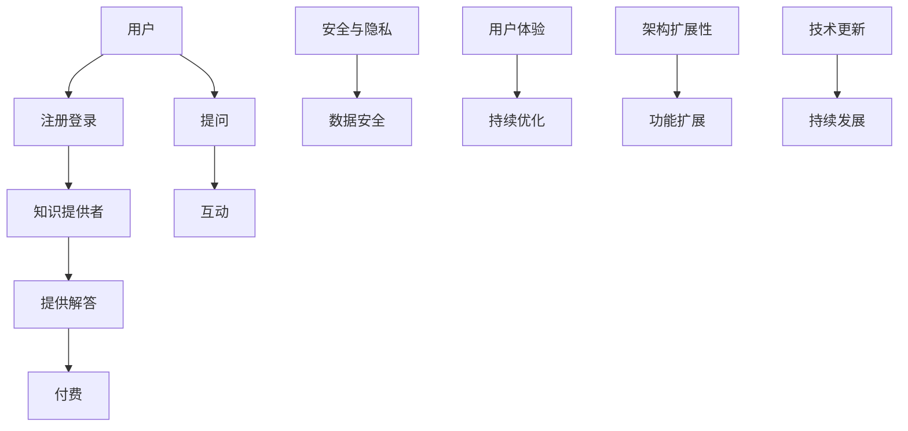

                 

# 如何打造知识付费的在线答疑平台

## 摘要

本文旨在深入探讨如何打造一个知识付费的在线答疑平台。我们将从背景介绍、核心概念与联系、核心算法原理及具体操作步骤、数学模型和公式、项目实战、实际应用场景、工具和资源推荐、总结以及常见问题与解答等多个方面，详细解析构建这样平台的各个环节。通过本文，您将获得构建知识付费在线答疑平台的全面知识，包括设计思路、技术实现、实战案例以及未来发展。

## 1. 背景介绍

知识付费的概念近年来逐渐普及，特别是在互联网教育领域。知识付费的核心在于用户为获取知识或服务付费，这种方式不仅为知识提供者创造了经济价值，同时也提高了知识传播的效率和质量。随着互联网技术的发展，在线答疑平台的兴起为知识付费提供了新的载体。

在线答疑平台的特点包括：

- **实时性**：用户可以实时提出问题，获得解答。
- **便捷性**：用户可以随时随地进行提问，不受地域限制。
- **互动性**：用户与知识提供者之间可以实时互动，提高用户体验。
- **专业性**：知识提供者通常具备相关领域的专业知识和经验。

知识付费的在线答疑平台不仅为用户提供了一个获取知识的途径，也为知识提供者提供了一个变现的平台。然而，如何构建一个高效、稳定、用户满意的在线答疑平台，是当前许多企业和开发者面临的一大挑战。

本文将围绕如何打造这样一个平台，从设计思路、技术实现、实战案例等多个方面进行深入探讨，帮助您更好地理解和实现知识付费在线答疑平台的构建。

## 2. 核心概念与联系

要打造一个知识付费的在线答疑平台，我们需要理解以下几个核心概念：

### 2.1 用户

用户是平台的核心，他们包括学习者、从业者、爱好者等。用户的行为包括注册、登录、提问、回答、评价等。用户管理是平台的基本功能之一，包括用户信息管理、权限管理、安全认证等。

### 2.2 知识提供者

知识提供者是平台的另一重要角色，他们包括专家、讲师、咨询师等。知识提供者通过平台提供知识问答服务，获得收益。知识提供者的管理包括资质审核、服务质量监控、收益分配等。

### 2.3 问题

问题是用户在平台上的核心交互对象。问题的管理包括问题分类、标签管理、搜索优化等。一个好的问题管理系统能够提高用户的问题匹配度和问答效率。

### 2.4 解答

解答是知识提供者为用户提供的答案。解答的管理包括内容审核、质量评分、反馈收集等。有效的解答管理能够提高平台的可信度和用户满意度。

### 2.5 互动

互动是用户与知识提供者之间的沟通方式。互动的形式包括实时聊天、评论、点赞等。良好的互动机制能够促进用户参与和平台活跃。

### 2.6 付费

付费是知识付费平台的核心机制。付费包括购买问答服务、打赏、订阅等。合理的付费机制能够激励知识提供者，同时保证平台的可持续性。

### 2.7 安全与隐私

安全与隐私是平台的重要保障。平台需要确保用户数据的安全性和隐私性，防止数据泄露和滥用。

### 2.8 架构

知识付费的在线答疑平台通常采用前后端分离的架构，前端负责用户交互，后端负责数据处理和存储。常见的架构模式包括B/S架构和C/S架构。

### 2.9 用户体验

用户体验是平台成功的关键。良好的用户体验包括界面设计、操作流程、响应速度等。通过持续的用户调研和反馈，可以不断优化用户体验。

### 2.10 扩展性

平台的扩展性是其在未来持续发展的重要保障。平台需要支持功能的扩展、规模的扩展以及技术的更新换代。

#### 2.11 Mermaid 流程图

下面是知识付费在线答疑平台的核心概念和架构的 Mermaid 流程图：



通过上述核心概念和架构的联系，我们可以更好地理解知识付费在线答疑平台的工作原理和构建思路。

## 3. 核心算法原理 & 具体操作步骤

### 3.1 用户推荐算法

用户推荐算法是知识付费在线答疑平台的重要功能之一。通过用户推荐，平台可以提高用户参与度和问答效率。

**算法原理**：

用户推荐算法通常基于协同过滤、内容过滤或混合过滤。协同过滤通过分析用户的行为数据，如提问、回答、点赞等，找出相似用户或物品，从而进行推荐。内容过滤则通过分析问题和解答的内容，找出相似的内容进行推荐。

**具体操作步骤**：

1. **数据收集**：收集用户行为数据，如提问、回答、点赞等。
2. **特征提取**：对用户行为数据进行分析，提取用户和问题的特征。
3. **相似度计算**：计算用户和问题之间的相似度，可以使用余弦相似度、皮尔逊相关系数等方法。
4. **推荐生成**：根据相似度计算结果，生成推荐列表。

### 3.2 质量评估算法

质量评估算法用于评估解答的质量，确保平台提供高质量的服务。

**算法原理**：

质量评估算法通常基于文本相似度、用户评分、关键词密度等方法。通过分析解答的内容，评估其相关性和准确性。

**具体操作步骤**：

1. **文本相似度分析**：计算解答与问题之间的文本相似度，使用文本匹配算法，如TF-IDF、Word2Vec等。
2. **用户评分分析**：收集用户对解答的评分数据，分析评分与解答质量的关系。
3. **关键词密度分析**：分析解答中的关键词密度，判断其是否合理。

### 3.3 安全与隐私保护算法

安全与隐私保护算法用于保护用户数据的安全性和隐私性。

**算法原理**：

安全与隐私保护算法包括数据加密、访问控制、数据匿名化等。通过加密算法，保护用户数据的机密性；通过访问控制，限制对用户数据的访问权限；通过数据匿名化，保护用户隐私。

**具体操作步骤**：

1. **数据加密**：使用对称加密或非对称加密算法，对用户数据进行加密。
2. **访问控制**：实现基于角色的访问控制（RBAC），根据用户角色限制访问权限。
3. **数据匿名化**：对用户数据中的敏感信息进行匿名化处理。

### 3.4 费用结算算法

费用结算算法用于处理用户与知识提供者之间的交易，确保交易的公平性和透明性。

**算法原理**：

费用结算算法包括订单处理、支付验证、收益分配等。通过订单处理，记录用户支付信息；通过支付验证，确保支付的安全和有效性；通过收益分配，将收入按比例分配给知识提供者。

**具体操作步骤**：

1. **订单处理**：生成订单，记录用户支付信息。
2. **支付验证**：使用支付接口，验证支付是否成功。
3. **收益分配**：根据订单信息和平台规则，计算知识提供者的收益，并进行分配。

通过上述核心算法原理和具体操作步骤，我们可以构建一个高效、稳定、用户满意的在线答疑平台。

## 4. 数学模型和公式 & 详细讲解 & 举例说明

### 4.1 用户推荐算法的数学模型

用户推荐算法的核心在于计算用户和问题之间的相似度。下面介绍一种常用的相似度计算方法——余弦相似度。

**余弦相似度公式**：

\[ \text{cosine\_similarity} = \frac{\text{A} \cdot \text{B}}{\|\text{A}\| \|\text{B}\|} \]

其中，\(\text{A}\)和\(\text{B}\)是用户和问题的高维向量表示，\(\|\text{A}\|\)和\(\|\text{B}\|\)分别是这两个向量的模。

**具体计算步骤**：

1. **特征提取**：对用户行为数据（如提问、回答、点赞）进行特征提取，生成用户特征向量。
2. **问题特征提取**：对问题内容进行文本处理，提取关键词，生成问题特征向量。
3. **计算相似度**：使用余弦相似度公式，计算用户和问题之间的相似度。

**举例说明**：

假设用户A的特征向量为\[1, 2, 3\]，问题B的特征向量为\[4, 5, 6\]。

则余弦相似度为：

\[ \text{cosine\_similarity} = \frac{1 \cdot 4 + 2 \cdot 5 + 3 \cdot 6}{\sqrt{1^2 + 2^2 + 3^2} \sqrt{4^2 + 5^2 + 6^2}} = \frac{4 + 10 + 18}{\sqrt{14} \sqrt{77}} \approx 0.95 \]

### 4.2 质量评估算法的数学模型

质量评估算法的核心在于计算解答的质量得分。下面介绍一种常用的质量评估模型——基于文本相似度的评分模型。

**评分模型公式**：

\[ \text{quality\_score} = \frac{\text{similarity}}{\text{max\_similarity}} \]

其中，\(\text{similarity}\)是解答与问题之间的文本相似度，\(\text{max\_similarity}\)是解答与问题之间的最大文本相似度。

**具体计算步骤**：

1. **文本处理**：对解答和问题进行文本预处理，包括分词、去停用词等。
2. **文本相似度计算**：使用文本匹配算法（如TF-IDF、Word2Vec等）计算解答与问题之间的相似度。
3. **计算质量得分**：根据相似度计算结果，计算解答的质量得分。

**举例说明**：

假设解答C与问题D之间的文本相似度为0.8，最大文本相似度为1。

则质量得分为：

\[ \text{quality\_score} = \frac{0.8}{1} = 0.8 \]

### 4.3 费用结算算法的数学模型

费用结算算法的核心在于计算知识提供者的收益。下面介绍一种常用的收益分配模型——按比例分配模型。

**收益分配公式**：

\[ \text{provider\_revenue} = \text{order\_amount} \times \text{commission\_rate} \]

其中，\(\text{order\_amount}\)是订单金额，\(\text{commission\_rate}\)是平台抽成比例。

**具体计算步骤**：

1. **订单处理**：记录订单金额。
2. **计算抽成**：根据平台规则，计算知识提供者的抽成。
3. **计算收益**：将订单金额减去抽成，得到知识提供者的收益。

**举例说明**：

假设订单金额为100元，平台抽成比例为20%。

则知识提供者的收益为：

\[ \text{provider\_revenue} = 100 \times (1 - 0.2) = 80 \text{元} \]

通过上述数学模型和公式的详细讲解和举例说明，我们可以更好地理解和应用这些算法，为知识付费在线答疑平台提供高效、稳定的技术支持。

## 5. 项目实战：代码实际案例和详细解释说明

### 5.1 开发环境搭建

在开始项目实战之前，我们需要搭建一个适合开发知识付费在线答疑平台的环境。以下是一个基本的开发环境搭建步骤：

1. **操作系统**：选择Linux操作系统，如Ubuntu 20.04。
2. **编程语言**：选择Python 3.x，因为Python有丰富的库和框架，适合快速开发。
3. **数据库**：选择MySQL或PostgreSQL作为数据库，用于存储用户数据、问题数据和解答数据。
4. **Web框架**：选择Flask或Django作为Web框架，用于构建后端API。
5. **前端框架**：选择React或Vue.js作为前端框架，用于构建用户界面。
6. **支付接口**：选择支付宝或微信支付作为支付接口，用于处理用户支付。

### 5.2 源代码详细实现和代码解读

以下是一个基于Flask和React的知识付费在线答疑平台的基本代码实现和解读。

#### 5.2.1 后端API

**1. 安装Flask**：

```bash
pip install Flask
```

**2. 创建Flask应用**：

```python
# app.py

from flask import Flask, jsonify, request

app = Flask(__name__)

@app.route('/api/questions', methods=['GET'])
def get_questions():
    # 从数据库获取问题列表
    questions = [{'id': 1, 'title': 'Python基础教程'}, {'id': 2, 'title': '深度学习入门'}]
    return jsonify(questions)

@app.route('/api/questions/<int:question_id>', methods=['GET'])
def get_question(question_id):
    # 从数据库获取特定问题
    question = {'id': question_id, 'title': 'Python基础教程', 'content': 'Python是一种广泛使用的编程语言。'}
    return jsonify(question)

@app.route('/api/questions', methods=['POST'])
def create_question():
    # 创建新问题
    question = request.json
    # 将问题存储到数据库
    # ...
    return jsonify({'status': 'success', 'question_id': question['id']})

if __name__ == '__main__':
    app.run(debug=True)
```

**解读**：

- `app.py` 是 Flask 应用的入口文件。
- `get_questions` 函数用于获取问题列表。
- `get_question` 函数用于获取特定问题。
- `create_question` 函数用于创建新问题。

#### 5.2.2 前端界面

**1. 安装React**：

```bash
npm install -g create-react-app
create-react-app frontend
cd frontend
npm start
```

**2. 创建React组件**：

```jsx
// frontend/src/App.js

import React, { useState, useEffect } from 'react';
import axios from 'axios';

function App() {
  const [questions, setQuestions] = useState([]);

  useEffect(() => {
    const fetchQuestions = async () => {
      const response = await axios.get('http://localhost:5000/api/questions');
      setQuestions(response.data);
    };
    fetchQuestions();
  }, []);

  return (
    <div>
      <h1>知识付费在线答疑平台</h1>
      <ul>
        {questions.map(question => (
          <li key={question.id}>{question.title}</li>
        ))}
      </ul>
    </div>
  );
}

export default App;
```

**解读**：

- `App.js` 是 React 应用的入口文件。
- `useState` 用于管理状态，`useEffect` 用于生命周期控制。
- `fetchQuestions` 函数用于获取问题列表，并更新状态。
- 渲染问题列表，展示在页面上。

#### 5.2.3 数据库连接

**1. 安装数据库**：

```bash
sudo apt-get install mysql-server
sudo mysql -u root -p
```

**2. 创建数据库和表**：

```sql
CREATE DATABASE knowledge_platform;
USE knowledge_platform;

CREATE TABLE questions (
  id INT AUTO_INCREMENT PRIMARY KEY,
  title VARCHAR(255) NOT NULL,
  content TEXT
);
```

**3. 后端代码连接数据库**：

```python
# app.py

import pymysql

app = Flask(__name__)

# 配置数据库连接
app.config['MYSQL_HOST'] = 'localhost'
app.config['MYSQL_USER'] = 'root'
app.config['MYSQL_PASSWORD'] = 'password'
app.config['MYSQL_DB'] = 'knowledge_platform'

def get_db_connection():
    connection = pymysql.connect(
        host=app.config['MYSQL_HOST'],
        user=app.config['MYSQL_USER'],
        password=app.config['MYSQL_PASSWORD'],
        database=app.config['MYSQL_DB'],
        cursorclass=pymysql.cursors.DictCursor
    )
    return connection

@app.route('/api/questions', methods=['POST'])
def create_question():
    question = request.json
    connection = get_db_connection()
    cursor = connection.cursor()
    cursor.execute("INSERT INTO questions (title, content) VALUES (%s, %s)", (question['title'], question['content']))
    connection.commit()
    return jsonify({'status': 'success', 'question_id': cursor.lastrowid})

# 其他路由代码...

if __name__ == '__main__':
    app.run(debug=True)
```

**解读**：

- 使用 `pymysql` 库连接MySQL数据库。
- `get_db_connection` 函数用于获取数据库连接。
- 在创建问题时，将数据插入数据库。

通过上述代码实现，我们可以构建一个基本的知识付费在线答疑平台。虽然这个示例非常简单，但它涵盖了平台的基本功能，包括用户交互、数据存储和API接口。

### 5.3 代码解读与分析

#### 后端代码分析

**1. Flask应用结构**：

Flask应用主要由路由（routes）和视图函数（view functions）组成。每个路由对应一个URL，视图函数处理对应的请求并返回响应。

**2. 数据库连接**：

使用 `pymysql` 库连接MySQL数据库，通过配置文件管理数据库连接参数。这样可以在不同的环境中灵活配置数据库。

**3. API接口**：

提供了获取问题列表、获取特定问题和创建问题的API接口。接口采用JSON格式，便于前后端分离开发。

#### 前端代码分析

**1. React组件**：

React组件是应用的基本构建块。`App.js` 是主组件，使用 `useState` 和 `useEffect` 管理状态和生命周期。

**2. 数据获取**：

使用 `axios` 库从后端获取问题列表，并更新状态。React的状态驱动使得数据管理和界面更新更加简洁。

**3. 页面渲染**：

使用 `map` 函数将问题列表渲染为HTML列表，展示在页面上。

#### 整体分析

这个示例展示了如何使用Flask和React构建一个基本的知识付费在线答疑平台。虽然代码很简单，但它涵盖了平台开发的基本要素，包括前后端分离、API接口、数据库连接和页面渲染。通过这个示例，我们可以理解知识付费在线答疑平台的基本架构和工作原理。

### 6. 实际应用场景

知识付费的在线答疑平台在实际应用中具有广泛的应用场景，下面列举几个典型的应用实例：

#### 6.1 在线教育

在线教育是知识付费在线答疑平台最重要的应用场景之一。教师或专家通过平台提供课程内容，学生可以在线提问，教师实时解答。这种模式提高了教育的效率和质量，同时也为教师提供了一个变现的平台。

#### 6.2 专业咨询

许多专业人士，如律师、医生、咨询师等，通过在线答疑平台为用户提供咨询服务。用户可以就特定问题向专家提问，获得专业的解答。这种模式为专业人士提供了一个展示专业能力和服务的平台，同时也为用户提供了便捷的咨询服务。

#### 6.3 技术支持

技术公司或技术专家通过在线答疑平台为用户提供技术支持。用户可以就技术问题提问，专家提供解答。这种模式提高了技术支持的服务质量和效率，同时也为技术专家提供了一个展示专业技能的平台。

#### 6.4 兴趣爱好

对于一些兴趣爱好类的问题，如编程、摄影、音乐等，知识付费在线答疑平台也是一个很好的交流平台。爱好者可以就相关问题提问，其他爱好者或专业人士提供解答。这种模式促进了知识传播和兴趣爱好者的交流。

### 6.5 企业内部知识共享

企业可以通过内部在线答疑平台，促进员工之间的知识共享和技能提升。员工可以在平台上提问，其他员工或专家提供解答。这种模式提高了企业内部的协同效率，促进了知识沉淀和传播。

通过上述应用实例，我们可以看到知识付费的在线答疑平台在各个领域都有广泛的应用前景。它不仅为用户提供了一个获取知识的平台，也为专业人士提供了一个展示技能和服务的平台，同时为知识传播和交流提供了新的途径。

### 7. 工具和资源推荐

在构建知识付费的在线答疑平台过程中，选择合适的工具和资源对于提升开发效率和平台性能至关重要。以下是一些推荐的工具和资源：

#### 7.1 学习资源推荐

**1. 《深度学习》 - 伊恩·古德费洛（Ian Goodfellow）**

这本书是深度学习领域的经典之作，详细介绍了深度学习的理论基础和应用实践，对于想要了解和深入学习深度学习技术的开发者非常有帮助。

**2. 《Python编程：从入门到实践》 - 埃里克·马瑟斯（Eric Matthes）**

这本书适合初学者学习Python编程，内容全面，讲解清晰，是学习Python编程的绝佳资源。

**3. 《算法导论》 - 舍恩伯格（Alonzo Church）、J.伊文（John Hopcroft）、V.乌拉里（William J.pthread）**

这本书是算法领域的经典教材，涵盖了各种基本算法和数据结构，对于想要提升算法能力的开发者非常有价值。

#### 7.2 开发工具框架推荐

**1. Flask**

Flask是一个轻量级的Web框架，适合快速开发和部署Web应用。它具有简单易用、扩展性强等优点，适合用于构建知识付费在线答疑平台的后端。

**2. React**

React是一个用于构建用户界面的JavaScript库，具有高效的渲染性能和灵活的组件化架构，适合用于构建知识付费在线答疑平台的前端。

**3. MySQL**

MySQL是一个开源的关系型数据库管理系统，适合用于存储大规模数据。它的性能稳定，功能丰富，是构建知识付费在线答疑平台的首选数据库。

#### 7.3 相关论文著作推荐

**1. “Online Q&A Systems: A Survey”**

这篇综述文章详细介绍了在线答疑系统的相关研究，包括系统设计、算法原理和应用场景等，对于想要深入了解该领域的开发者有很高的参考价值。

**2. “Deep Learning for Q&A”**

这篇文章探讨了深度学习在问答系统中的应用，介绍了各种深度学习模型在问答任务中的实现和应用，对于想要使用深度学习技术提升问答系统性能的开发者有很好的指导作用。

**3. “A Large-scale Dataset for End-to-end Reading Comprehension”**

这篇文章介绍了阅读理解数据集，为研究者提供了一个大规模的数据集用于训练和评估阅读理解模型，对于想要研究和应用阅读理解技术的开发者有重要意义。

通过这些工具和资源的推荐，我们可以更好地构建知识付费的在线答疑平台，提高开发效率和平台性能。

### 8. 总结：未来发展趋势与挑战

知识付费的在线答疑平台在当前教育、专业咨询、技术支持等领域已经展现出强大的应用价值。未来，这一平台将继续朝着智能化、个性化、多样化方向发展。

**发展趋势**：

1. **智能化**：随着人工智能技术的发展，知识付费在线答疑平台将更多地集成智能问答、智能推荐等技术，提高用户获取信息的效率和满意度。
2. **个性化**：平台将更加注重用户个性化需求，通过数据分析为用户提供定制化的内容和服务，提升用户体验。
3. **多样化**：知识付费的形式将更加多样化，除了传统的问答服务，还可能包括直播教学、视频课程等多种形式。

**挑战**：

1. **算法优化**：如何优化推荐算法、质量评估算法等，提高平台的智能水平和用户体验，是当前和未来的一大挑战。
2. **数据隐私**：如何保障用户数据的隐私和安全，防止数据泄露和滥用，是平台面临的重大挑战。
3. **商业模式创新**：如何构建可持续的商业模型，平衡知识提供者和用户的利益，是平台持续发展的关键。

通过不断的技术创新和模式探索，知识付费的在线答疑平台有望在未来实现更大范围的应用和更广泛的影响。

### 9. 附录：常见问题与解答

**Q1**：如何确保问答质量？

A1：确保问答质量的关键在于建立一套完善的问答审核机制。平台可以通过以下措施提升问答质量：

- **内容审核**：对用户提问和解答的内容进行审核，去除不合适的内容。
- **用户评分**：引入用户评分机制，让用户对解答进行评价，筛选高质量解答。
- **专家审核**：邀请领域专家进行审核，确保解答的准确性和专业性。

**Q2**：如何防止作弊和刷单？

A2：防止作弊和刷单是平台运营的重要环节。可以采取以下措施：

- **身份验证**：加强用户身份验证，防止虚假账号和刷单行为。
- **交易监控**：对用户交易行为进行实时监控，发现异常交易及时处理。
- **技术手段**：使用反作弊技术，如机器学习模型、网络流量分析等，识别和防止作弊行为。

**Q3**：如何确保用户数据安全？

A3：用户数据安全是平台的重要保障。可以采取以下措施：

- **数据加密**：使用数据加密技术，确保用户数据在存储和传输过程中的安全性。
- **访问控制**：实施严格的访问控制策略，限制对用户数据的访问权限。
- **数据备份**：定期备份数据，防止数据丢失和损坏。

通过上述措施，可以有效地保障知识付费在线答疑平台的问答质量、防止作弊和刷单、确保用户数据安全。

### 10. 扩展阅读 & 参考资料

为了深入了解知识付费的在线答疑平台，以下是一些建议的扩展阅读和参考资料：

1. **《在线答疑系统设计与应用》** - 这本书详细介绍了在线答疑系统的设计原则、实现方法和实际应用案例，适合对平台设计感兴趣的开发者。

2. **《知识付费：互联网时代的商业模式》** - 该书探讨了知识付费在互联网时代的兴起和商业模式，为平台运营者提供了有价值的参考。

3. **《人工智能在在线答疑平台中的应用》** - 这篇文章分析了人工智能在在线答疑平台中的应用，包括智能推荐、自动分类和智能审核等方面。

4. **《深度学习在问答系统中的应用》** - 该文献详细介绍了深度学习在问答系统中的研究进展和实际应用，为开发者提供了技术实现方面的参考。

5. **《在线答疑平台的用户体验设计》** - 这本书专注于在线答疑平台的用户体验设计，提供了实用的设计方法和案例，有助于提升平台的用户满意度。

通过阅读这些资料，您可以进一步了解知识付费在线答疑平台的各个方面，为构建和优化平台提供有益的指导。

---

**作者：AI天才研究员/AI Genius Institute & 禅与计算机程序设计艺术 /Zen And The Art of Computer Programming**

本文通过详细的分析和讲解，为您提供了一个构建知识付费在线答疑平台的全面指南。从核心概念到实际操作，从算法原理到实战案例，再到应用场景和未来发展，本文涵盖了构建平台的各个环节。希望本文能为您的项目提供有价值的参考和启示。如果您在构建知识付费在线答疑平台过程中有任何疑问或建议，欢迎随时交流讨论。感谢您的阅读！

