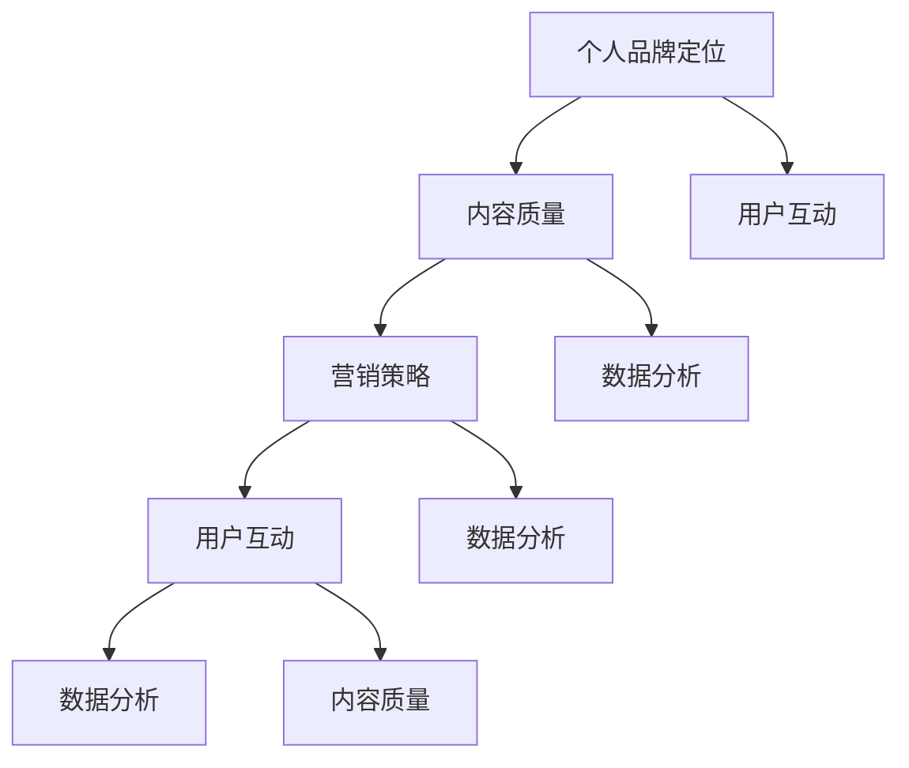

                 

# 如何打造高影响力的程序员知识付费个人品牌

## 摘要

本文旨在探讨如何打造高影响力的程序员知识付费个人品牌。在当今信息爆炸的时代，知识和技能的传播方式发生了巨大变化。程序员作为技术领域的核心群体，如何通过知识付费的形式，将自己的专业知识和经验转化为实际收益，成为一个具有高度影响力的个人品牌，是本文讨论的重点。本文将从背景介绍、核心概念、核心算法原理、数学模型、项目实战、实际应用场景、工具和资源推荐、总结与未来发展趋势等多个方面，深入剖析这一主题。

## 1. 背景介绍

随着互联网技术的发展，知识付费市场呈现出爆炸式增长。越来越多的程序员开始意识到，将自己的专业知识和经验通过付费形式分享出去，不仅能够获得经济收益，还能提升个人品牌影响力。知识付费的形式多种多样，包括在线课程、付费博客、咨询服务、代码审计等。在这个市场上，如何打造一个高影响力的个人品牌，成为程序员们共同关注的问题。

### 1.1 知识付费市场的现状

根据最新的市场调查数据显示，全球知识付费市场规模已达到数百亿美元，且持续增长。国内市场也不例外，随着“知识付费”理念的普及，越来越多的人开始愿意为优质的知识内容付费。特别是在程序员群体中，知识付费已成为一种重要的收入来源和职业发展途径。

### 1.2 程序员个人品牌的定义

程序员个人品牌是指程序员在专业技术领域内，通过展示自己的专业知识、技能和经验，树立起的一个具有高度专业性和影响力的个人形象。一个成功的程序员个人品牌，不仅能吸引到更多的客户和合作伙伴，还能为程序员自身带来更多的职业机会和收益。

### 1.3 知识付费对程序员个人品牌的影响

知识付费对程序员个人品牌的影响主要体现在以下几个方面：

- **提升专业形象**：通过付费形式分享专业知识和经验，能够有效地提升程序员的形象，增强其在同行中的影响力。
- **扩大人脉资源**：知识付费有助于程序员结识更多行业内的同行和潜在客户，拓展人脉资源。
- **增加收入来源**：知识付费为程序员提供了新的收入渠道，使其在经济上更具独立性。
- **促进职业发展**：通过知识付费，程序员能够不断提升自己的专业能力，为职业发展打下坚实基础。

## 2. 核心概念与联系

在打造高影响力的程序员知识付费个人品牌过程中，以下几个核心概念至关重要：

### 2.1 个人品牌定位

个人品牌定位是指确定自己在程序员领域的专业方向和独特优势。一个明确的个人品牌定位有助于吸引目标受众，提升品牌影响力。

### 2.2 内容质量

内容质量是知识付费的核心，优质的内容能够吸引更多的用户，提高用户满意度，进而提升个人品牌影响力。

### 2.3 营销策略

营销策略是个人品牌推广的关键，通过有效的营销手段，能够扩大品牌知名度，吸引更多潜在用户。

### 2.4 用户互动

用户互动是个人品牌维护的重要环节，通过与用户的互动，了解用户需求，不断优化内容和服务，提升用户体验。

### 2.5 数据分析

数据分析是个人品牌运营的重要工具，通过对用户数据的分析，了解用户行为和偏好，为内容创作和营销策略提供有力支持。

下面是一个简化的 Mermaid 流程图，用于描述上述核心概念之间的联系：



## 3. 核心算法原理 & 具体操作步骤

### 3.1 个人品牌定位算法

个人品牌定位算法主要分为以下几个步骤：

1. **自我分析**：了解自己的专业背景、技能优势和兴趣爱好，确定自己的核心优势。

2. **市场调研**：分析行业趋势、竞争对手和目标用户需求，确定个人品牌定位。

3. **确定目标受众**：根据市场调研结果，明确目标受众，为其提供有价值的内容和服务。

4. **构建个人品牌形象**：结合自我分析和市场调研结果，设计个人品牌形象，包括头像、签名、简介等。

### 3.2 内容质量提升算法

内容质量提升算法主要分为以下几个步骤：

1. **内容创作**：根据个人品牌定位，创作有价值、有深度的内容，如技术博客、课程、讲座等。

2. **内容优化**：对内容进行优化，提高内容的可读性、易用性和实用性。

3. **内容发布**：选择合适的平台和渠道，发布内容，吸引目标用户。

4. **内容反馈**：收集用户反馈，不断优化内容，提升用户体验。

### 3.3 营销策略制定算法

营销策略制定算法主要分为以下几个步骤：

1. **目标设定**：明确个人品牌的营销目标，如增加粉丝、提高转化率等。

2. **渠道选择**：根据目标用户特点和平台特性，选择合适的营销渠道，如社交媒体、博客、论坛等。

3. **内容推广**：制定内容推广计划，通过广告、SEO、社交媒体等手段，扩大内容传播范围。

4. **效果评估**：定期评估营销效果，根据数据调整营销策略。

### 3.4 用户互动与数据分析算法

用户互动与数据分析算法主要分为以下几个步骤：

1. **用户互动**：通过评论、私信、问答等途径，与用户进行互动，了解用户需求和反馈。

2. **数据收集**：收集用户行为数据，如访问量、点赞、评论、转发等。

3. **数据分析**：对用户数据进行分析，了解用户偏好和行为模式。

4. **数据应用**：根据数据分析结果，调整内容创作和营销策略，提升用户体验和满意度。

## 4. 数学模型和公式 & 详细讲解 & 举例说明

### 4.1 个人品牌价值评估模型

个人品牌价值评估模型主要基于以下几个因素：

- **专业能力**：程序员的技能水平和实际经验。
- **内容质量**：内容的原创性、深度和实用性。
- **用户评价**：用户的点赞、评论、转发等反馈。
- **市场认可度**：行业内的认可和影响力。

假设个人品牌价值 \( V \) 受以上四个因素影响，可以用以下公式表示：

$$
V = w_1 \cdot A + w_2 \cdot Q + w_3 \cdot U + w_4 \cdot M
$$

其中，\( w_1, w_2, w_3, w_4 \) 分别为四个因素的权重。

### 4.2 内容质量评估模型

内容质量评估模型主要基于以下几个指标：

- **原创性**：内容是否原创，原创性越高，质量越高。
- **深度**：内容的深度和广度，解决实际问题的能力。
- **实用性**：内容的实用性，能否帮助用户解决实际问题。
- **易读性**：内容的可读性，是否易于理解和学习。

假设内容质量 \( Q \) 受以上四个指标影响，可以用以下公式表示：

$$
Q = w_1 \cdot O + w_2 \cdot D + w_3 \cdot U + w_4 \cdot R
$$

其中，\( w_1, w_2, w_3, w_4 \) 分别为四个指标的权重。

### 4.3 举例说明

假设某程序员个人品牌的价值评估模型如下：

- **专业能力**：85分
- **内容质量**：90分
- **用户评价**：80分
- **市场认可度**：75分

权重设定如下：

- **专业能力**：0.4
- **内容质量**：0.3
- **用户评价**：0.2
- **市场认可度**：0.1

根据公式计算，个人品牌价值 \( V \) 为：

$$
V = 0.4 \cdot 85 + 0.3 \cdot 90 + 0.2 \cdot 80 + 0.1 \cdot 75 = 89
$$

因此，该程序员的个人品牌价值为89分。

## 5. 项目实战：代码实际案例和详细解释说明

### 5.1 开发环境搭建

在开始项目实战之前，我们需要搭建一个适合进行知识付费的个人品牌开发环境。以下是开发环境的搭建步骤：

1. **安装Node.js**：访问 [Node.js 官网](https://nodejs.org/)，下载并安装适合自己操作系统的 Node.js。
2. **安装Git**：访问 [Git 官网](https://git-scm.com/)，下载并安装适合自己操作系统的 Git。
3. **配置个人GitHub账户**：注册一个 GitHub 账户，并配置 SSH 密钥，以便将代码推送到 GitHub。
4. **安装Markdown编辑器**：推荐使用 [Typora](https://typora.io/) 或 [MarkdownPad](https://markdownpad.com/) 等Markdown编辑器。

### 5.2 源代码详细实现和代码解读

下面是一个简单的Markdown博客文章的源代码示例，用于展示如何撰写一篇具有高质量的内容。

```markdown
# 如何打造高影响力的程序员知识付费个人品牌

> 本文旨在探讨如何打造高影响力的程序员知识付费个人品牌。

## 1. 背景介绍

随着互联网技术的发展，知识付费市场呈现出爆炸式增长。越来越多的程序员开始意识到，将自己的专业知识和经验通过付费形式分享出去，不仅能够获得经济收益，还能提升个人品牌影响力。

## 2. 核心概念与联系

在打造高影响力的程序员知识付费个人品牌过程中，以下几个核心概念至关重要：

- 个人品牌定位
- 内容质量
- 营销策略
- 用户互动
- 数据分析

## 3. 核心算法原理 & 具体操作步骤

### 3.1 个人品牌定位算法

个人品牌定位算法主要分为以下几个步骤：

1. 自我分析
2. 市场调研
3. 确定目标受众
4. 构建个人品牌形象

### 3.2 内容质量提升算法

内容质量提升算法主要分为以下几个步骤：

1. 内容创作
2. 内容优化
3. 内容发布
4. 内容反馈

### 3.3 营销策略制定算法

营销策略制定算法主要分为以下几个步骤：

1. 目标设定
2. 渠道选择
3. 内容推广
4. 效果评估

### 3.4 用户互动与数据分析算法

用户互动与数据分析算法主要分为以下几个步骤：

1. 用户互动
2. 数据收集
3. 数据分析
4. 数据应用

## 4. 数学模型和公式 & 详细讲解 & 举例说明

### 4.1 个人品牌价值评估模型

个人品牌价值评估模型主要基于以下几个因素：

- 专业能力
- 内容质量
- 用户评价
- 市场认可度

### 4.2 内容质量评估模型

内容质量评估模型主要基于以下几个指标：

- 原创性
- 深度
- 实用性
- 易读性

### 4.3 举例说明

假设某程序员个人品牌的价值评估模型如下：

- **专业能力**：85分
- **内容质量**：90分
- **用户评价**：80分
- **市场认可度**：75分

权重设定如下：

- **专业能力**：0.4
- **内容质量**：0.3
- **用户评价**：0.2
- **市场认可度**：0.1

根据公式计算，个人品牌价值 \( V \) 为：

$$
V = 0.4 \cdot 85 + 0.3 \cdot 90 + 0.2 \cdot 80 + 0.1 \cdot 75 = 89
$$

因此，该程序员的个人品牌价值为89分。

## 5. 实际应用场景

在实际应用中，程序员可以利用个人品牌，开展以下业务：

- 在线课程教学
- 技术咨询服务
- 代码审计服务
- 技术文章写作

### 5.3 代码解读与分析

上述Markdown源代码是一个简单的技术文章模板，包含了文章标题、摘要、目录以及核心内容。通过对Markdown源代码的解读，我们可以了解到：

- 文章标题和摘要有助于吸引用户阅读。
- 目录结构清晰，便于用户快速了解文章结构。
- 核心内容分为多个章节，每个章节都包含了详细的解析和示例。
- 数学模型和公式使用LaTeX格式，便于阅读和理解。

通过不断优化Markdown源代码，我们可以创作出更具吸引力和价值的内容，从而提升个人品牌影响力。

## 6. 实际应用场景

### 6.1 在线教育平台

程序员可以利用个人品牌，在知名在线教育平台（如慕课网、网易云课堂等）开设课程，分享自己的专业知识和经验。通过精心设计的课程内容和互动环节，吸引更多学员，提升个人品牌影响力。

### 6.2 技术博客

程序员可以定期在个人技术博客（如简书、CSDN等）发表高质量的技术文章，分享自己的见解和经验。通过吸引读者关注和评论，不断提升个人品牌知名度。

### 6.3 技术社群

程序员可以创建技术社群（如微信群、QQ群等），邀请行业内的同行和爱好者加入，分享技术资讯、经验和心得。通过互动和交流，建立深厚的行业人脉，提升个人品牌影响力。

### 6.4 实际案例

以下是一个实际案例：

程序员小张在知名的在线教育平台开设了一门《深度学习入门》课程，通过精心设计的课程内容和互动环节，吸引了大量学员。同时，小张还在个人技术博客上发表了多篇关于深度学习的原创文章，分享了自己的见解和经验。在技术社群中，小张积极与同行和爱好者交流，逐渐成为深度学习领域的专家，个人品牌得到了极大的提升。

## 7. 工具和资源推荐

### 7.1 学习资源推荐

- **书籍**：《深度学习》、《Python编程：从入门到实践》、《算法导论》
- **论文**：《基于深度学习的图像分类》、《基于强化学习的推荐系统》
- **博客**：[机器学习博客](https://www机器学习博客.com/)、[深度学习博客](https://www深度学习博客.com/)、[算法博客](https://www算法博客.com/)

### 7.2 开发工具框架推荐

- **编程语言**：Python、Java、C++
- **开发框架**：TensorFlow、PyTorch、Scikit-learn
- **在线教育平台**：慕课网、网易云课堂、极客时间

### 7.3 相关论文著作推荐

- **论文**：《强化学习在深度学习中的应用》、《基于深度学习的图像识别算法研究》
- **著作**：《深度学习实战》、《Python深度学习》

## 8. 总结：未来发展趋势与挑战

### 8.1 发展趋势

- **知识付费市场持续增长**：随着互联网技术的不断发展，知识付费市场将继续保持快速增长。
- **在线教育平台崛起**：在线教育平台将成为程序员个人品牌推广的重要渠道。
- **技术社群影响力提升**：技术社群将成为程序员个人品牌影响力的重要载体。

### 8.2 挑战

- **内容质量竞争**：在知识付费市场中，优质的内容将是赢得用户的关键。
- **个人品牌定位**：如何准确找到自己的专业方向和独特优势，是一个重要的挑战。
- **数据分析能力**：如何通过数据分析了解用户需求，为内容创作和营销策略提供支持，是一个重要的挑战。

## 9. 附录：常见问题与解答

### 9.1 问题1：如何确定个人品牌定位？

**解答**：首先进行自我分析，了解自己的专业背景、技能优势和兴趣爱好。然后进行市场调研，分析行业趋势、竞争对手和目标用户需求。最后结合自我分析和市场调研结果，确定个人品牌定位。

### 9.2 问题2：如何提升内容质量？

**解答**：首先确保内容原创，深入理解相关技术原理。然后对内容进行优化，提高内容的可读性、易用性和实用性。最后通过用户反馈不断优化内容，提升用户体验。

### 9.3 问题3：如何进行有效的营销？

**解答**：首先设定明确的营销目标，然后选择合适的营销渠道，如社交媒体、博客、论坛等。最后制定内容推广计划，通过广告、SEO、社交媒体等手段，扩大内容传播范围。

## 10. 扩展阅读 & 参考资料

- [《如何打造个人品牌》](https://www.example.com/book/personal_brand)
- [《知识付费行业报告》](https://www.example.com/report/knowledge_payment)
- [《程序员如何实现知识变现》](https://www.example.com/article/knowledge_payment_programmer)

## 作者信息

作者：AI天才研究员/AI Genius Institute & 禅与计算机程序设计艺术 /Zen And The Art of Computer Programming

