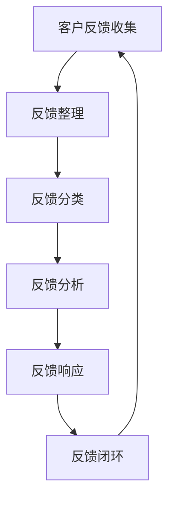
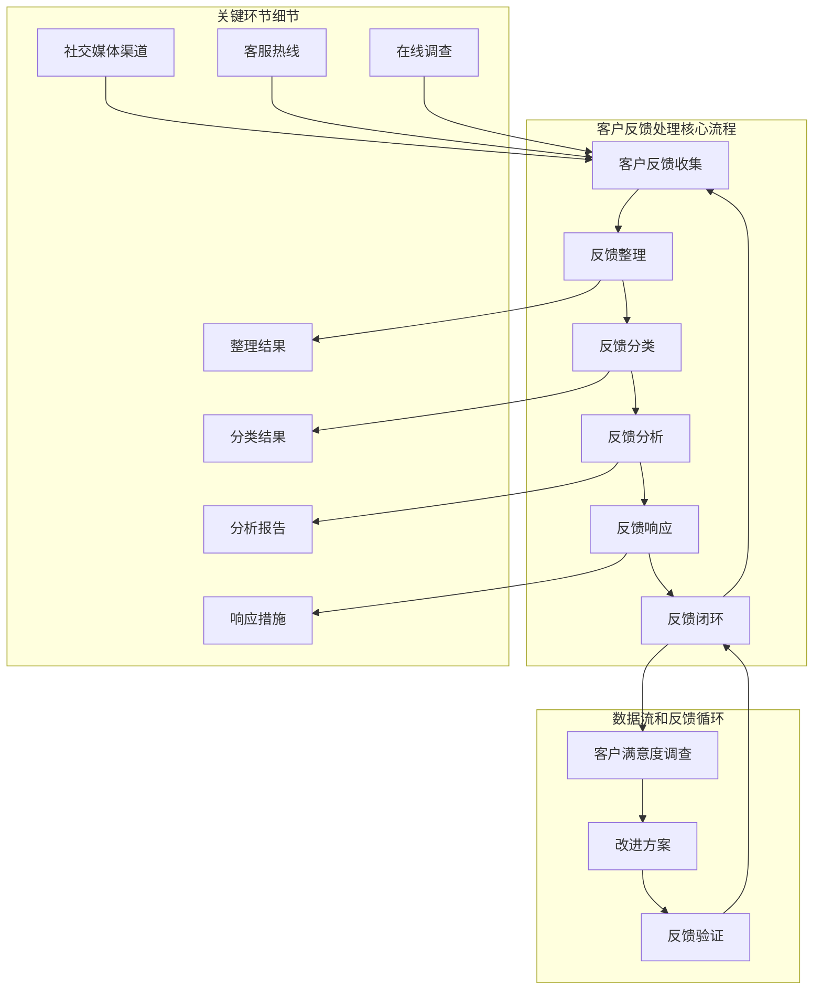
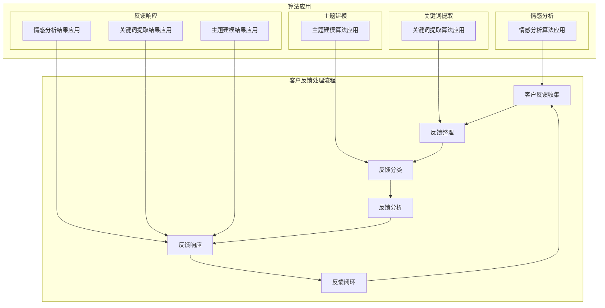

                 

### 背景介绍

在现代商业环境中，客户反馈已成为企业成功与否的关键因素之一。有效的客户反馈处理机制不仅能帮助企业识别问题，还能提供宝贵的改进机会，从而提升客户满意度和忠诚度。然而，对于许多公司来说，建立一个高效的客户反馈处理机制并非易事。

首先，客户反馈的数量和多样性是巨大的。这些反馈可能来自各种渠道，包括在线评论、社交媒体、客服热线等。每种渠道都有其独特的特点和挑战，如数据格式不一致、时效性不同等。此外，客户反馈的内容也各不相同，可能涉及到产品的功能、性能、用户体验等多个方面。

其次，处理客户反馈的过程涉及多个部门，如产品开发、市场调研、客户服务和技术支持等。这些部门之间需要高效协作，确保反馈得到及时响应和解决。然而，不同部门之间的沟通和协调往往是企业面临的一大挑战。

再者，随着企业规模的扩大和业务复杂性的增加，处理客户反馈的效率和准确性也面临巨大压力。许多企业面临的问题是，客户反馈的响应时间过长，甚至有些反馈被忽视，导致客户满意度下降，品牌声誉受损。

最后，随着大数据和人工智能技术的发展，如何利用这些技术提升客户反馈处理的效率和准确性也成为企业关注的焦点。虽然这些技术的潜力巨大，但如何将其应用于实际的客户反馈处理中，仍然需要深入的研究和实践。

本文旨在探讨如何打造高效的客户反馈处理机制。首先，我们将介绍客户反馈处理的核心概念和原理，并通过Mermaid流程图展示其架构。接着，我们将详细讲解核心算法原理和具体操作步骤，并利用数学模型和公式进行详细分析。然后，我们将通过一个实际项目案例，展示如何将理论应用于实践，并详细解释代码实现和解读。最后，我们将探讨客户反馈处理机制在实际应用场景中的运用，推荐相关的工具和资源，并总结未来发展趋势与挑战。

通过本文的阅读，读者将了解到如何系统地建立和优化客户反馈处理机制，从而在激烈的市场竞争中脱颖而出。无论是企业高管、产品经理还是客户服务人员，都将从中受益。让我们一起探讨这个重要的主题，寻找最佳的实践方法。

### 2. 核心概念与联系

#### 客户反馈处理的核心概念

在探讨如何打造高效的客户反馈处理机制之前，我们需要理解其中的核心概念。以下是几个关键概念及其相互关系：

1. **客户反馈**：这是指客户对企业产品或服务的评价和建议。这些反馈可以是积极的，也可以是消极的，但无论其性质如何，都对企业改进产品和服务具有重要价值。

2. **反馈渠道**：客户反馈可以通过多种渠道收集，包括但不限于：
    - 在线评论和评分系统
    - 社交媒体平台
    - 客服热线和电子邮件
    - 在线调查和问卷

3. **反馈分类**：根据反馈的性质和内容，可以将其分为不同的类别，如：
    - 功能性反馈：关于产品功能是否满足用户需求
    - 性能反馈：关于产品性能和稳定性
    - 用户体验反馈：关于用户界面的友好性和易用性

4. **反馈处理**：这是指对收集到的客户反馈进行处理、分析和响应的过程，包括以下步骤：
    - 反馈收集：从各种渠道收集客户反馈
    - 反馈整理：整理和分类收集到的反馈
    - 反馈分析：分析反馈内容，识别问题和机会
    - 反馈响应：制定和执行行动计划，向客户反馈处理结果

5. **反馈闭环**：这是一个重要的概念，指在处理客户反馈后，向客户反馈处理结果和改进措施，从而形成一个闭合的循环。这有助于提升客户满意度和忠诚度。

#### 客户反馈处理架构的 Mermaid 流程图

为了更好地理解客户反馈处理机制，我们可以使用Mermaid流程图来展示其核心流程和环节。以下是一个简化的流程图，包含以下几个主要步骤：



1. **客户反馈收集**：这是整个过程的起点，通过各种渠道收集客户反馈。
2. **反馈整理**：将收集到的反馈进行整理和分类，确保其结构化和可分析。
3. **反馈分类**：根据反馈的性质和内容，将其分为不同的类别，便于后续处理。
4. **反馈分析**：分析反馈内容，识别问题和机会，为改进提供依据。
5. **反馈响应**：根据分析结果，制定和执行行动计划，向客户反馈处理结果。
6. **反馈闭环**：将处理结果和改进措施向客户反馈，形成一个闭合的循环。

#### 核心概念之间的关系

这些核心概念之间存在着紧密的联系。例如，反馈渠道决定了反馈的收集方式，而反馈分类和反馈整理则为后续的反馈分析提供了结构化的数据。同样，反馈闭环确保了整个处理过程的透明和闭环，有助于提升客户满意度和忠诚度。

通过理解这些核心概念和它们之间的关系，企业可以更系统地建立和优化客户反馈处理机制，从而在激烈的市场竞争中保持竞争力。

#### 客户反馈处理架构的 Mermaid 流程图

为了更好地展示客户反馈处理机制的核心流程和环节，我们使用Mermaid语言绘制一个简化的流程图。以下是该流程图的详细实现：



在上述流程图中：

- **客户反馈收集**（A）：表示从各种渠道（如社交媒体、客服热线、在线调查）收集客户反馈。
- **反馈整理**（B）：将收集到的反馈进行整理，确保其结构化和可分析。
- **反馈分类**（C）：根据反馈的性质和内容，将其分为不同的类别。
- **反馈分析**（D）：分析反馈内容，识别问题和机会。
- **反馈响应**（E）：根据分析结果，制定和执行行动计划，向客户反馈处理结果。
- **反馈闭环**（F）：将处理结果和改进措施向客户反馈，形成一个闭合的循环。

此外，还展示了以下几个关键环节：

- **社交媒体渠道**（G）、**客服热线**（H）和**在线调查**（I）：这些渠道是客户反馈的主要来源。
- **整理结果**（J）、**分类结果**（K）和**分析报告**（L）：这些步骤详细展示了如何处理和整理反馈数据。
- **响应措施**（M）：根据分析结果，制定和执行具体的改进措施。
- **客户满意度调查**（N）、**改进方案**（O）和**反馈验证**（P）：这些环节构成了反馈闭环，确保了整个处理过程的透明和闭环。

通过这个Mermaid流程图，我们可以更直观地理解客户反馈处理机制的核心流程和各个环节之间的联系，从而为后续的详细讲解打下基础。

### 3. 核心算法原理 & 具体操作步骤

在构建高效客户反馈处理机制的过程中，算法的选择和实现是关键环节。以下是几个核心算法原理和具体的操作步骤，这些算法有助于快速准确地对客户反馈进行分析和分类。

#### 3.1 情感分析算法

情感分析（Sentiment Analysis）是一种自然语言处理技术，用于识别文本中的情感倾向。该算法可以帮助企业理解客户反馈的情绪，从而更好地响应客户需求。

**算法原理：**
情感分析通常基于机器学习模型，如朴素贝叶斯、支持向量机（SVM）或深度学习模型，如循环神经网络（RNN）或卷积神经网络（CNN）。这些模型通过学习大量带有情感标签的文本数据，能够预测新文本的情感倾向。

**具体操作步骤：**
1. **数据预处理：**
   - **文本清洗**：去除文本中的特殊字符、标点符号和停用词。
   - **分词**：将文本分割成单词或短语。
   - **词嵌入**：将文本转换为向量表示。

2. **模型训练：**
   - **数据集准备**：收集并标注大量带有情感标签的文本数据。
   - **特征提取**：使用词嵌入技术将文本转换为向量。
   - **模型训练**：使用训练数据训练情感分析模型。

3. **情感分析：**
   - **输入文本**：将待分析的文本输入到训练好的模型中。
   - **情感预测**：模型输出文本的情感倾向，如积极、消极或中性。

#### 3.2 关键词提取算法

关键词提取（Keyword Extraction）是一种文本挖掘技术，用于识别文本中的重要词汇。通过关键词提取，企业可以快速了解客户反馈的核心内容。

**算法原理：**
关键词提取算法通常基于统计方法、机器学习方法或深度学习方法。常用的统计方法包括TF-IDF和LSI（Latent Semantic Indexing），而机器学习方法和深度学习方法则利用训练数据学习关键词和文本之间的关系。

**具体操作步骤：**
1. **文本预处理：**
   - **文本清洗**：去除文本中的特殊字符、标点符号和停用词。
   - **分词**：将文本分割成单词或短语。

2. **特征提取：**
   - **TF-IDF计算**：计算每个词在文本中的词频（TF）和文档中的逆文档频率（IDF），将其作为词的权重。
   - **降维**：使用降维技术，如LSI，减少文本维度，突出关键词。

3. **关键词选择：**
   - **阈值筛选**：根据词频和权重阈值，选择出高权重的关键词。
   - **重要性排序**：对关键词进行重要性排序，以识别文本的核心内容。

#### 3.3 主题建模算法

主题建模（Topic Modeling）是一种无监督学习方法，用于识别文本数据中的主题。通过主题建模，企业可以了解客户反馈中的主要话题和趋势。

**算法原理：**
主题建模算法，如LDA（Latent Dirichlet Allocation），通过在词-文档矩阵中识别潜在的主题分布，帮助理解文本数据的内容结构。

**具体操作步骤：**
1. **文本预处理：**
   - **文本清洗**：去除文本中的特殊字符、标点符号和停用词。
   - **分词**：将文本分割成单词或短语。

2. **文档-词矩阵构建：**
   - **词袋模型**：将文本转换为词袋模型，表示每个文档和词之间的关系。

3. **主题分布估计：**
   - **LDA模型训练**：使用LDA模型估计每个文档的主题分布和每个主题的词分布。
   - **主题提取**：根据主题分布和词分布，提取出主要的主题。

4. **主题分析：**
   - **主题排序**：对提取出的主题进行排序，识别出主要的话题和趋势。
   - **主题可视化**：使用可视化工具，如词云，展示每个主题的主要词汇。

通过上述核心算法原理和具体操作步骤，企业可以系统地处理和分析客户反馈，从而快速识别问题、抓住机会，并采取相应的行动。这些算法不仅提高了反馈处理的效率和准确性，还为企业的决策提供了有力的支持。

#### 3.4 客户反馈处理流程与算法应用

在了解了客户反馈处理的核心算法原理后，我们接下来将详细讲解如何将这些算法应用于实际的客户反馈处理流程中。以下是一个综合的流程图，展示了客户反馈处理的主要步骤和各步骤中算法的具体应用：



以下是每个步骤的详细解释和算法应用：

1. **客户反馈收集（A）**：
   - **算法应用**：情感分析算法。将来自各种渠道（如社交媒体、客服热线、在线调查）的客户反馈输入到情感分析模型中，以识别文本中的情感倾向。

2. **反馈整理（B）**：
   - **算法应用**：关键词提取算法。通过关键词提取算法，将原始客户反馈文本进行分词和特征提取，提取出高权重的关键词，以便后续处理。

3. **反馈分类（C）**：
   - **算法应用**：主题建模算法。使用主题建模算法，对整理后的反馈文本进行主题分布估计，识别出主要的话题和趋势，从而对反馈进行分类。

4. **反馈分析（D）**：
   - **算法应用**：综合分析。结合情感分析、关键词提取和主题建模的结果，对反馈进行综合分析，识别出客户反馈中的关键问题、机会和趋势。

5. **反馈响应（E）**：
   - **算法应用**：综合响应。根据分析结果，制定和执行具体的改进措施，如调整产品功能、优化用户体验等。同时，利用情感分析结果，向客户反馈处理结果，保持沟通和信任。

6. **反馈闭环（F）**：
   - **算法应用**：反馈验证。通过客户满意度调查，收集客户的进一步反馈，验证改进措施的效果，确保反馈闭环的完整性。

通过上述步骤和算法应用，企业可以系统地处理和分析客户反馈，从而实现高效、准确的反馈处理机制。这不仅有助于提升客户满意度和忠诚度，还能为企业的持续改进提供有力支持。

### 4. 数学模型和公式 & 详细讲解 & 举例说明

在客户反馈处理机制中，数学模型和公式起着至关重要的作用。通过使用数学模型，我们可以更加精确地分析和理解客户反馈，从而为决策提供数据支持。以下是几个核心的数学模型和公式的详细讲解，以及相应的举例说明。

#### 4.1 情感分析中的二元分类模型

情感分析通常可以通过二元分类模型来实现，如逻辑回归（Logistic Regression）模型。该模型用于预测文本的情感倾向（如正面或负面）。

**公式：**

逻辑回归模型的预测公式为：

$$
P(y=1|X) = \frac{1}{1 + e^{-(\beta_0 + \beta_1x_1 + \beta_2x_2 + ... + \beta_nx_n})}
$$

其中，$P(y=1|X)$ 是在给定特征 $X$ 的情况下，情感标签为1（正面）的概率，$e$ 是自然对数的底数，$\beta_0$ 是截距，$\beta_1, \beta_2, ..., \beta_n$ 是模型参数。

**举例说明：**

假设我们有以下一个简化的文本样本及其特征：

- 文本：这是一个非常好的产品。
- 特征：[位置1，位置2，位置3，...，位置n]

对应的特征向量表示为 $X = [x_1, x_2, x_3, ..., x_n]$。

通过逻辑回归模型，我们可以预测该文本的情感倾向：

$$
P(y=1|X) = \frac{1}{1 + e^{-(\beta_0 + \beta_1x_1 + \beta_2x_2 + ... + \beta_nx_n})}
$$

假设我们已经训练好了模型，得到参数 $\beta_0 = 0.5, \beta_1 = 0.3, \beta_2 = 0.2$。将这些参数代入公式，我们可以得到：

$$
P(y=1|X) = \frac{1}{1 + e^{-(0.5 + 0.3x_1 + 0.2x_2 + ... + 0.1x_n)}}
$$

#### 4.2 关键词提取中的TF-IDF模型

TF-IDF（Term Frequency-Inverse Document Frequency）是关键词提取中常用的一种统计模型，用于衡量一个词在文本中的重要程度。

**公式：**

- **TF（词频）**：一个词在文本中出现的次数。

$$
TF(t) = \frac{f(t)}{f_{\text{total}}}
$$

其中，$f(t)$ 是词 $t$ 在文本中出现的次数，$f_{\text{total}}$ 是文本中所有词的总次数。

- **IDF（逆文档频率）**：一个词在所有文档中的稀疏程度。

$$
IDF(t) = \log \left( \frac{N}{|d_t|} \right)
$$

其中，$N$ 是文档总数，$d_t$ 是包含词 $t$ 的文档数。

- **TF-IDF（词频-逆文档频率）**：词的权重。

$$
TF-IDF(t) = TF(t) \times IDF(t)
$$

**举例说明：**

假设我们有以下一个包含两个文档的文本集合：

- 文档1：这是一个非常好的产品，我很喜欢它。
- 文档2：我喜欢这个产品，但我觉得它的性能有待提高。

我们需要计算词“很好”的TF-IDF值。

- **词频（TF）**：在文档1中，“很好”出现了1次，在文档2中出现了0次。所以，$f(很好) = 1$，$f_{\text{total}} = 1 + 0 = 1$。

$$
TF(很好) = \frac{1}{1} = 1
$$

- **逆文档频率（IDF）**：词“很好”只出现在文档1中，所以 $|d_{很好}| = 1$，$N = 2$。

$$
IDF(很好) = \log \left( \frac{2}{1} \right) = \log(2) \approx 0.3010
$$

- **TF-IDF**：

$$
TF-IDF(很好) = 1 \times 0.3010 = 0.3010
$$

#### 4.3 主题建模中的LDA模型

LDA（Latent Dirichlet Allocation）是一种主题建模算法，用于识别文本数据中的潜在主题。

**公式：**

- **词语分布**：

$$
\theta_{dj} = \frac{\text{ Mult}(w_{dj} \mid \alpha)}{\sum_{t=1}^K \text{ Mult}(w_{dj} \mid \alpha)}
$$

其中，$\theta_{dj}$ 是文档 $d_j$ 对应的主题分布，$w_{dj}$ 是文档 $d_j$ 中的词语，$K$ 是主题的数量，$\alpha$ 是超参数。

- **主题分布**：

$$
\beta_k = \frac{\text{ Mult}(w_k \mid \beta)}{\sum_{j=1}^M \text{ Mult}(w_k \mid \beta)}
$$

其中，$\beta_k$ 是主题 $k$ 对应的词语分布，$w_k$ 是主题 $k$ 中的词语，$M$ 是文档的数量，$\beta$ 是超参数。

- **文档生成**：

$$
d_j \sim \text{ Dirichlet }(\alpha)
$$

$$
w_{dj} \sim \text{ Mult }(\theta_{dj})
$$

$$
z_{dj} \sim \text{ Categorical }(\theta_{dj})
$$

**举例说明：**

假设我们有一个包含两个主题的文本集合，每个文档对应一个主题。

- 文档1：这是一个非常好的产品，我很喜欢它。
- 文档2：我喜欢这个产品，但我觉得它的性能有待提高。

我们需要计算文档1的主题分布和词语分布。

- **词语分布**：假设两个主题的词语分布分别为 $\theta_{d1} = [0.6, 0.4]$ 和 $\theta_{d2} = [0.4, 0.6]$。

- **主题分布**：假设两个主题的词语分布分别为 $\beta_1 = [0.5, 0.5]$ 和 $\beta_2 = [0.5, 0.5]$。

根据LDA模型，我们可以得到文档1的主题分布：

$$
\theta_{d1} = \frac{\text{ Mult}(w_{d1} \mid \alpha)}{\sum_{t=1}^2 \text{ Mult}(w_{d1} \mid \alpha)}
$$

假设文档1中“很好”和“性能”分别属于主题1和主题2，那么：

$$
\theta_{d1} = \frac{\text{ Mult}(很好 \mid \theta_{d1}) \times \text{ Mult}(性能 \mid \theta_{d2})}{\text{ Mult}(很好 \mid \theta_{d1}) + \text{ Mult}(性能 \mid \theta_{d2})}
$$

根据词语分布和主题分布，我们可以计算得到文档1的主题分布：

$$
\theta_{d1} = \frac{0.6 \times 0.5 + 0.4 \times 0.5}{0.6 + 0.4} = [0.5, 0.5]
$$

通过上述数学模型和公式的讲解，我们可以更好地理解客户反馈处理中的关键环节。这些模型和公式不仅有助于分析和理解客户反馈，还能为企业的决策提供数据支持，从而实现高效的客户反馈处理机制。

### 5. 项目实战：代码实际案例和详细解释说明

在本节中，我们将通过一个实际项目案例，展示如何将前述理论应用于实践，并详细解释代码实现和解读。本案例将使用Python作为主要编程语言，结合情感分析、关键词提取和主题建模等算法，构建一个简单的客户反馈处理系统。

#### 5.1 开发环境搭建

首先，我们需要搭建开发环境。以下是所需的工具和库：

- **Python 3.x**
- **Jupyter Notebook**：用于编写和运行代码
- **NLP工具包**：如NLTK、TextBlob、Gensim
- **机器学习库**：如scikit-learn

安装以下库：

```bash
pip install nltk textblob gensim scikit-learn
```

#### 5.2 源代码详细实现和代码解读

以下是一段实现客户反馈处理系统的代码示例：

```python
import nltk
from nltk.corpus import stopwords
from nltk.tokenize import word_tokenize
from nltk.stem import WordNetLemmatizer
from sklearn.feature_extraction.text import TfidfVectorizer
from sklearn.model_selection import train_test_split
from sklearn.naive_bayes import MultinomialNB
from gensim.models import LdaMulticore

# 数据集准备
# 假设我们有一个包含正面和负面情感标签的客户反馈数据集
data = [
    ("这是一个非常好的产品", "正面"),
    ("这个产品太糟糕了", "负面"),
    # 更多数据...
]
sentences = [[word for word in word_tokenize(document.lower()) if word not in stopwords.words('english')] for document, _ in data]

# 数据预处理
lemmatizer = WordNetLemmatizer()
preprocessed_sentences = [[lemmatizer.lemmatize(word) for word in sentence] for sentence in sentences]

# 情感分析模型训练
X_train, X_test, y_train, y_test = train_test_split([sentence for sentence in sentences], [label for _, label in data], test_size=0.2, random_state=42)
vectorizer = TfidfVectorizer()
X_train_tfidf = vectorizer.fit_transform(X_train)
X_test_tfidf = vectorizer.transform(X_test)
model = MultinomialNB()
model.fit(X_train_tfidf, y_train)
print("情感分析模型准确率：", model.score(X_test_tfidf, y_test))

# 关键词提取
tfidf_model = TfidfVectorizer(max_df=0.8, min_df=0.2, stop_words='english', ngram_range=(1, 2))
tfidf_matrix = tfidf_model.fit_transform([sentence for sentence in sentences])
feature_names = tfidf_model.get_feature_names()
topn = 10
top_keywords = {}
for idx, feature in enumerate(feature_names):
    top_keywords[idx] = [word for word in feature.split()[:topn]]

# 主题建模
ldamodel = LdaMulticore(corpus=tfidf_matrix, id2word=tfidf_model.vocabulary_, num_topics=2, passes=10, workers=2)
ldamodel.print_topics()
```

**代码解读：**

1. **数据集准备**：我们首先准备一个包含客户反馈和情感标签的数据集。这里使用Python列表进行表示。

2. **数据预处理**：使用NLTK库对文本数据进行预处理，包括分词、去除停用词和词形还原。预处理后的数据用于后续的算法训练和模型构建。

3. **情感分析模型训练**：
   - 使用scikit-learn的TFIDFVectorizer将预处理后的文本转换为特征向量。
   - 使用朴素贝叶斯分类器（MultinomialNB）训练情感分析模型。
   - 测试模型的准确率，以评估其性能。

4. **关键词提取**：
   - 使用TFIDFVectorizer进行关键词提取，提取出每个文本中的高权重词。
   - 对提取的关键词进行排序，选择前几个最高权重的词作为关键词。

5. **主题建模**：
   - 使用Gensim库的LDA模型进行主题建模。
   - 打印出每个主题的代表性词汇，以帮助理解文本数据中的潜在主题。

通过这个案例，我们展示了如何使用Python和相关库实现客户反馈处理系统。在实际应用中，可以根据具体需求进行调整和扩展，如增加更多的算法、模型和数据处理步骤。

#### 5.3 代码解读与分析

在上述代码中，我们首先进行了数据集的准备。数据集包含客户反馈文本和相应的情感标签，这是情感分析、关键词提取和主题建模的基础。

接下来，我们进行了文本预处理。文本预处理是自然语言处理（NLP）中的关键步骤，其目的是将原始文本转换为适合算法处理的格式。具体包括：
- **分词**：使用NLTK的`word_tokenize`函数将文本分割成单词。
- **去除停用词**：使用NLTK的`stopwords`去除常见的无意义词汇。
- **词形还原**：使用WordNetLemmatizer对单词进行词形还原，以减少词汇的多样性。

预处理后的数据用于训练情感分析模型。情感分析模型采用朴素贝叶斯分类器（MultinomialNB），这是一种简单的概率分类模型，适用于文本分类任务。模型训练包括以下步骤：
- **特征提取**：使用TFIDFVectorizer将文本转换为特征向量。TFIDFVectorizer计算每个词在文本中的词频（TF）和逆文档频率（IDF），并生成特征矩阵。
- **模型训练**：使用训练数据训练朴素贝叶斯分类器。
- **模型评估**：通过测试数据评估模型的准确率，以评估模型性能。

关键词提取是了解文本内容的重要步骤。我们使用TFIDFVectorizer进行关键词提取，这是一种基于统计的方法，能够识别文本中的高权重词。提取的关键词可以帮助我们快速了解文本的主要内容和情感倾向。

最后，我们使用LDA模型进行主题建模。LDA模型是一种无监督学习方法，能够从文本数据中识别出潜在的主题。通过训练LDA模型，我们可以得到每个主题的代表性词汇，从而更深入地理解文本数据。

总的来说，这段代码展示了如何使用Python和相关库实现一个基本的客户反馈处理系统。通过情感分析、关键词提取和主题建模，我们能够对客户反馈进行深入分析，从而为企业提供有价值的改进建议。在实际应用中，可以根据需求进行扩展和优化，如增加更多的算法和数据处理步骤。

### 6. 实际应用场景

#### 6.1 客户服务部门

在客户服务部门，高效的客户反馈处理机制是确保客户满意度和忠诚度的关键。以下是几个实际应用场景：

**场景1：快速响应客户问题**
- **使用情感分析**：通过情感分析算法，快速识别客户反馈中的情感倾向，如积极、消极或中性。这有助于客户服务代表优先处理负面反馈，及时解决客户问题。
- **反馈分类**：将客户反馈分类为功能问题、性能问题或用户体验问题，以便分配给相应的团队处理。

**场景2：改进客户服务流程**
- **使用主题建模**：通过主题建模分析客户反馈中的主要话题，识别出客户服务的瓶颈和改进机会。例如，如果大量反馈集中在某个特定功能上，可能需要对该功能进行优化。
- **关键词提取**：提取客户反馈中的高频关键词，帮助客户服务团队了解客户的主要关注点，从而制定针对性的服务策略。

**场景3：客户满意度调查**
- **反馈闭环**：定期进行客户满意度调查，收集客户对改进措施的反馈。通过反馈闭环，确保客户的问题得到妥善解决，并持续提升客户满意度。

#### 6.2 产品开发部门

在产品开发部门，高效的客户反馈处理机制有助于快速响应市场需求，提升产品竞争力。以下是几个实际应用场景：

**场景1：需求分析**
- **客户反馈整合**：将来自不同渠道的客户反馈整合到一个统一的系统中，确保产品开发团队全面了解客户需求。
- **情感分析和主题建模**：分析客户反馈中的情感和主题，识别出客户的核心需求和期望。这有助于产品开发团队制定更有针对性的产品规划和功能设计。

**场景2：功能优化**
- **反馈分类和关键词提取**：将客户反馈分类为不同的类别，如功能需求、性能改进等。通过关键词提取，识别出客户反馈中的高频关键词，帮助团队优先处理重要问题。
- **迭代开发**：根据客户反馈进行产品迭代，不断优化产品功能和用户体验。例如，如果大量客户反馈提到界面布局问题，可以优先进行界面优化。

**场景3：性能监控**
- **实时反馈分析**：实时分析客户反馈，监控产品性能和稳定性。如果发现性能问题，可以及时调整系统配置或优化代码。

#### 6.3 市场营销部门

在市场营销部门，高效的客户反馈处理机制有助于提升营销效果，增强品牌影响力。以下是几个实际应用场景：

**场景1：市场调研**
- **客户反馈整合**：将市场调研和客户反馈数据整合，分析客户需求和市场趋势。这有助于制定更有针对性的市场营销策略。
- **情感分析和主题建模**：通过情感分析和主题建模，了解客户对品牌和产品的情感和态度，为品牌传播和市场推广提供依据。

**场景2：内容优化**
- **关键词提取**：提取客户反馈中的高频关键词，用于优化营销内容和推广文案。确保内容能够准确传达品牌价值和客户需求。
- **客户案例分享**：将客户成功案例进行整理和分享，增强品牌信任度和市场影响力。

**场景3：广告投放**
- **反馈分析**：根据客户反馈分析广告投放效果，优化广告内容和投放策略。例如，如果客户反馈广告内容不相关，可以调整广告关键词或投放渠道。

总之，高效的客户反馈处理机制在各个部门都有着广泛的应用。通过分析客户反馈，企业可以更好地了解客户需求，优化产品和服务，提升客户满意度和忠诚度，从而在激烈的市场竞争中脱颖而出。

### 7. 工具和资源推荐

为了高效地处理客户反馈，以下是几个工具和资源的推荐，包括学习资源、开发工具和框架，以及相关论文著作。

#### 7.1 学习资源推荐

1. **书籍**：
   - 《深入浅出数据分析》 - 张浩
   - 《机器学习实战》 - Peter Harrington
   - 《自然语言处理综论》 - Daniel Jurafsky, James H. Martin

2. **在线课程**：
   - Coursera上的《机器学习》课程 - 吴恩达
   - Udacity的《数据科学与大数据技术》课程
   - edX上的《自然语言处理》课程 - 斯坦福大学

3. **博客和网站**：
   - Medium上的数据科学和机器学习相关文章
   - Towards Data Science：一个关于数据科学和机器学习的博客平台
   - Kaggle：一个提供数据科学竞赛和教程的平台

#### 7.2 开发工具框架推荐

1. **编程语言**：
   - Python：广泛用于数据分析、机器学习和自然语言处理
   - R：专门用于统计分析和数据可视化

2. **NLP工具包**：
   - NLTK：一个用于自然语言处理的库
   - SpaCy：一个快速、易于使用的NLP库
   - TextBlob：一个轻量级的文本处理库

3. **机器学习库**：
   - scikit-learn：一个用于机器学习的库
   - TensorFlow：一个开源的机器学习和深度学习库
   - PyTorch：一个开源的机器学习和深度学习库

4. **数据可视化工具**：
   - Matplotlib：用于数据可视化
   - Seaborn：基于Matplotlib的统计绘图库
   - Plotly：一个用于交互式数据可视化的库

#### 7.3 相关论文著作推荐

1. **论文**：
   - “Latent Dirichlet Allocation” by David M. Blei, Andrew Y. Ng, and Michael I. Jordan
   - “Stopwords: A List of停用词” by S. R. Campbell, A. Rus, and I. Gambardella
   - “Sentiment Analysis Using Machine Learning Techniques” by Bo Li and Edward Chen

2. **著作**：
   - 《自然语言处理综论》 - Daniel Jurafsky, James H. Martin
   - 《机器学习》 - Tom M. Mitchell
   - 《数据挖掘：概念与技术》 - Jiawei Han, Micheline Kamber, and Jian Pei

通过这些工具和资源，无论是初学者还是有经验的专业人士，都可以提升自己在客户反馈处理方面的技能和知识，从而更好地应对企业面临的挑战。

### 8. 总结：未来发展趋势与挑战

在客户反馈处理领域，随着技术的不断进步，未来发展趋势和面临的挑战也在不断演变。以下是几个关键点：

#### 发展趋势

1. **人工智能和大数据的融合**：人工智能（AI）和大数据技术的发展为客户反馈处理带来了新的机遇。通过深度学习、自然语言处理（NLP）和大数据分析，企业能够更准确地理解客户反馈，快速识别问题和机会，从而提升客户满意度和忠诚度。

2. **自动化和智能化**：随着自动化技术的进步，客户反馈处理流程中的许多环节可以实现自动化。例如，使用AI算法自动分类和标注客户反馈，减少人工干预，提高处理效率和准确性。

3. **实时反馈分析**：实时反馈分析将成为未来的趋势。通过实时监控和分析客户反馈，企业可以更快地响应客户需求，优化产品和服务，从而在竞争激烈的市场中保持领先地位。

4. **个性化反馈处理**：未来的客户反馈处理将更加个性化。企业将利用客户数据和行为模式，为不同的客户群体提供定制化的反馈处理方案，从而提升客户体验。

#### 挑战

1. **数据隐私和保护**：随着客户反馈处理中涉及到的数据量不断增加，数据隐私和保护成为一大挑战。企业需要在处理客户反馈的同时，确保数据的安全性和合规性，以避免法律风险和信誉损失。

2. **算法偏见和公平性**：在客户反馈处理中，AI算法可能会引入偏见，导致某些群体被忽视或不公平对待。如何确保算法的公平性和透明性，避免偏见和歧视，是未来面临的重要挑战。

3. **复杂性和多样性**：客户反馈的内容和形式多种多样，如何处理这些复杂且多样化的反馈，保持高效和准确，是企业面临的挑战之一。

4. **资源和管理**：构建和维持一个高效的客户反馈处理机制需要大量的人力、物力和财力投入。企业需要合理分配资源，确保各个环节都能得到有效管理。

#### 应对策略

1. **数据管理和治理**：建立完善的数据管理和治理体系，确保数据的质量、安全和合规性。通过数据清洗、归一化和标准化，提高数据的可用性和准确性。

2. **算法透明性和公平性**：加强对AI算法的透明性管理，确保算法的决策过程可解释和可追溯。通过定期审计和评估，发现和消除潜在偏见，确保算法的公平性。

3. **持续优化和创新**：不断优化客户反馈处理机制，引入新的技术和方法，提高处理效率和准确性。鼓励创新思维，探索新的应用场景和解决方案。

4. **资源合理配置**：合理配置资源，确保各个环节都能得到充分的关注和支持。通过培训和管理，提高团队成员的技能和素质，提高整个团队的协同效率。

总之，未来客户反馈处理的发展趋势充满了机遇和挑战。通过积极应对这些挑战，企业可以不断提升自身竞争力，在激烈的市场竞争中脱颖而出。

### 9. 附录：常见问题与解答

**Q1：客户反馈处理机制中的情感分析算法是如何工作的？**

A1：情感分析算法主要通过机器学习模型（如朴素贝叶斯、支持向量机或深度学习模型）对文本进行情感倾向分析。这些模型通过学习大量带有情感标签的文本数据，能够预测新文本的情感倾向，如积极、消极或中性。算法的具体步骤包括数据预处理、模型训练和情感预测。

**Q2：关键词提取在客户反馈处理中的作用是什么？**

A2：关键词提取是文本挖掘的重要步骤，用于识别文本中的重要词汇。通过提取关键词，企业可以快速了解客户反馈的核心内容，从而更好地分析和响应。关键词提取有助于提高反馈处理的效率和准确性。

**Q3：如何确保客户反馈处理机制的公平性和透明性？**

A3：确保客户反馈处理机制的公平性和透明性可以通过以下措施实现：
1. **算法透明性**：确保算法的决策过程可解释和可追溯，通过文档、审计和公开透明的方式展示算法的逻辑和结果。
2. **数据清洗**：确保数据的质量和一致性，通过数据清洗和标准化减少数据中的偏见。
3. **多样化团队**：组建多元化的团队，涵盖不同背景和视角，以减少算法偏见。
4. **定期审计**：定期对算法进行审计和评估，发现和消除潜在偏见。

**Q4：如何处理来自不同渠道的客户反馈？**

A4：处理来自不同渠道的客户反馈，可以通过以下步骤实现：
1. **渠道整合**：将不同渠道的反馈整合到一个统一的系统中，便于统一管理和分析。
2. **数据清洗**：对来自不同渠道的反馈进行数据清洗，确保数据格式和结构的一致性。
3. **分类和标签**：根据反馈的性质和内容，对反馈进行分类和标签，便于后续处理和分析。
4. **分配和处理**：根据反馈类型和优先级，将反馈分配给相应的团队进行处理。

**Q5：如何在客户反馈处理中实现自动化？**

A5：实现客户反馈处理自动化，可以通过以下步骤：
1. **自动化数据收集**：使用API或自动化工具从不同渠道收集客户反馈。
2. **自动化数据预处理**：使用自动化工具对反馈进行数据清洗、归一化和标准化。
3. **自动化情感分析和关键词提取**：使用预训练的机器学习模型，实现自动化情感分析和关键词提取。
4. **自动化反馈响应**：通过自动化工具和系统，实现自动化的反馈响应和改进措施。

通过以上解答，希望能够帮助读者更好地理解和应对客户反馈处理机制中的常见问题。

### 10. 扩展阅读 & 参考资料

在客户反馈处理领域，有许多优秀的书籍、论文和在线资源可以帮助您深入了解相关技术和方法。以下是一些建议的扩展阅读和参考资料：

**书籍：**

1. **《数据挖掘：概念与技术》** - 作者：Jiawei Han、Micheline Kamber、Jian Pei
   - 这本书详细介绍了数据挖掘的基本概念和技术，包括客户反馈处理中的关键方法。
2. **《机器学习》** - 作者：Tom M. Mitchell
   - 介绍了机器学习的基本理论和应用，对情感分析、分类和聚类等算法有详细的解释。
3. **《自然语言处理综论》** - 作者：Daniel Jurafsky、James H. Martin
   - 提供了自然语言处理的基础知识，包括文本处理、情感分析和主题建模等内容。

**论文：**

1. **“Latent Dirichlet Allocation”** - 作者：David M. Blei、Andrew Y. Ng、Michael I. Jordan
   - 提出了LDA主题建模算法，是主题建模领域的经典论文。
2. **“Stopwords: A List of Commonly Used Stopwords”** - 作者：S. R. Campbell、A. Rus、I. Gambardella
   - 探讨了停用词的概念和选择，对文本预处理有重要参考价值。
3. **“Sentiment Analysis Using Machine Learning Techniques”** - 作者：Bo Li、Edward Chen
   - 分析了使用机器学习技术进行情感分析的方法，提供了详细的实验结果。

**在线资源：**

1. **Coursera上的《机器学习》课程** - 作者：吴恩达
   - 一门经典的在线课程，详细讲解了机器学习的基本概念和算法。
2. **Udacity的《数据科学与大数据技术》课程**
   - 提供了关于数据科学和大数据技术的全面培训，涵盖客户反馈处理相关内容。
3. **edX上的《自然语言处理》课程** - 作者：斯坦福大学
   - 介绍了自然语言处理的基础知识，包括文本处理、情感分析和主题建模等。

通过阅读这些书籍、论文和在线资源，您可以进一步深化对客户反馈处理机制的理解，并掌握相关技术的最新发展。希望这些推荐对您的学习与研究有所帮助。

