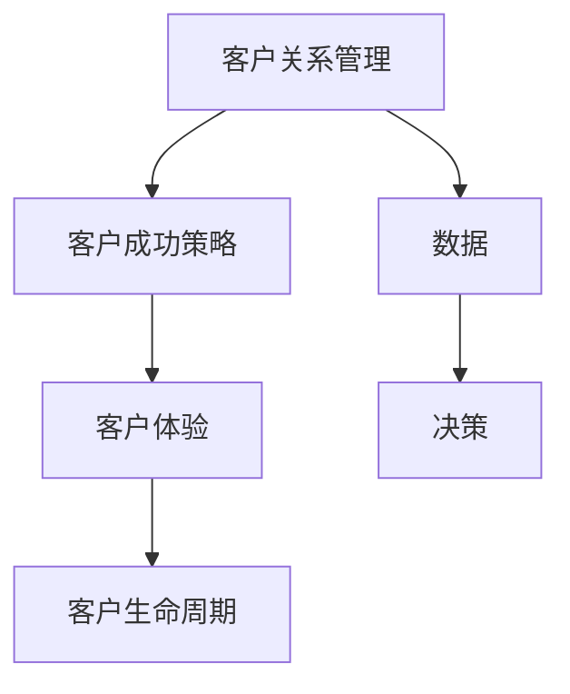

                 

### 背景介绍

随着企业对客户成功管理重要性的日益认识，打造高效的客户成功团队成为企业竞争的关键因素之一。然而，如何在众多任务和职责中找到最佳的方法来构建和管理这样的团队，是一个复杂且具有挑战性的问题。

客户成功团队的主要职责包括客户关系管理、客户体验优化、价值创造、客户生命周期管理以及客户反馈处理等。这一团队的目标是通过提高客户满意度和留存率，为企业带来可持续的增长。

当前，企业面临以下挑战：

1. **人才短缺**：具备客户成功管理经验的专业人才相对较少。
2. **技能多样**：团队成员需要具备市场营销、客户服务、产品知识等多方面的技能。
3. **协作难题**：团队成员之间需要高效协作，以提供一致且高质量的客户服务。
4. **数据整合**：有效整合和分析客户数据，以做出基于数据的决策。

因此，本文将深入探讨如何构建和优化高效的客户成功团队，包括团队架构设计、关键技能培养、协作机制建立、数据利用以及自动化工具的引入。让我们一步一步分析，详细探讨每个方面的实施策略和最佳实践。

首先，我们需要了解客户成功团队的核心概念与联系，这将为我们后续的讨论打下坚实的基础。

### 核心概念与联系

在构建高效的客户成功团队之前，我们需要明确几个核心概念及其相互之间的联系。以下是这些核心概念的定义及其在客户成功管理中的作用：

#### 1. 客户关系管理（CRM）

客户关系管理是客户成功团队的基石。它涉及到收集、分析和利用客户数据，以优化客户体验和提高客户满意度。CRM系统的功能包括客户信息管理、销售自动化、市场营销自动化、客户服务管理以及客户反馈处理等。

#### 2. 客户体验（CX）

客户体验是客户在接触企业过程中所获得的整体感受。它不仅包括客户服务，还涵盖了产品使用、购买流程、售后服务等多个方面。提升客户体验可以显著提高客户满意度和忠诚度。

#### 3. 客户生命周期（CLV）

客户生命周期是指客户与企业互动的全过程，从初次接触、购买、使用到最终离开。通过分析客户生命周期，企业可以识别出高价值客户，并采取相应策略来延长客户生命周期，提高客户留存率。

#### 4. 客户成功策略（CXM）

客户成功策略是企业为提高客户满意度和留存率而制定的一系列行动计划。它包括客户关系管理、客户体验优化、客户生命周期管理等多个方面。有效的客户成功策略可以为企业带来持续的竞争优势。

#### 5. 数据驱动的决策（DD）

数据驱动的决策是通过收集、分析和利用数据来指导企业运营和决策。在客户成功管理中，数据可以提供关于客户行为、需求、痛点的洞察，从而帮助企业制定更加精准的营销策略和客户服务方案。

这些核心概念之间的联系如下：

1. **CRM支持CXM**：通过CRM系统，企业可以收集和分析客户数据，从而制定和执行有效的客户成功策略。
2. **CXM优化CX**：客户成功策略的执行有助于提升客户体验，增强客户满意度和忠诚度。
3. **CX影响CLV**：良好的客户体验可以延长客户生命周期，提高客户价值。
4. **数据驱动决策**：通过数据驱动的决策，企业可以更加精准地识别客户需求，优化客户关系管理，提高客户成功率。

为了更好地理解这些概念，下面我们将使用Mermaid流程图来展示它们之间的交互和作用。

#### Mermaid流程图



在这个流程图中，CRM作为起点，通过数据收集和分析，驱动数据驱动的决策过程，进而影响客户成功策略的制定和执行。客户成功策略的执行又直接影响到客户体验和客户生命周期。通过这样一个闭环的流程，企业可以持续优化客户成功管理，实现可持续的业务增长。

### 核心算法原理 & 具体操作步骤

在了解了客户成功团队的核心概念与联系之后，下一步是探讨如何构建和优化这一团队的算法原理和具体操作步骤。算法在客户成功管理中扮演着至关重要的角色，因为它能够帮助企业从数据中提取有价值的信息，指导决策和行动。

#### 1. 数据采集与清洗

数据采集是构建高效客户成功团队的第一步。数据源可以包括客户反馈、销售数据、社交媒体活动、市场调研报告等。在采集数据后，需要对其进行清洗，以确保数据的质量和一致性。

具体步骤如下：

- **数据标准化**：将不同格式和单位的数据统一转换为标准格式。
- **异常值处理**：识别并处理数据中的异常值，如空值、重复值、错误值等。
- **数据去重**：去除重复记录，以避免数据冗余和混淆。

#### 2. 数据分析

数据清洗完成后，下一步是进行数据分析。数据分析的目的是从大量数据中提取有价值的信息，以支持客户成功管理。

具体方法包括：

- **描述性分析**：通过计算数据的平均数、中位数、方差等统计量，了解数据的分布和特征。
- **关联分析**：识别不同变量之间的关联性，如客户购买行为与满意度之间的关系。
- **分类和聚类分析**：将数据按照特定的标准进行分类或聚类，以发现数据中的模式和趋势。

#### 3. 客户细分

客户细分是将客户按照其特征、行为或需求划分为不同的群体。通过客户细分，企业可以更加精准地制定营销策略和客户服务方案。

具体步骤如下：

- **客户特征提取**：从客户数据中提取关键特征，如年龄、性别、地理位置、购买历史等。
- **聚类分析**：使用聚类算法（如K-means、DBSCAN等）将客户划分为不同的群体。
- **细分评估**：评估不同细分群体的价值、需求和偏好，以确定哪些群体需要特别关注。

#### 4. 客户行为预测

客户行为预测是利用历史数据预测客户未来的行为，如购买、流失等。通过预测客户行为，企业可以提前采取行动，防止潜在的问题，并抓住增长机会。

具体方法包括：

- **时间序列分析**：通过分析客户历史行为的时间序列数据，预测客户未来的行为。
- **机器学习模型**：使用机器学习算法（如决策树、随机森林、神经网络等）训练预测模型。
- **模型评估与优化**：评估预测模型的性能，并根据评估结果进行模型优化。

#### 5. 客户成功策略制定

在完成数据分析和客户细分后，下一步是制定具体的客户成功策略。客户成功策略应该根据客户细分结果和预测结果进行个性化定制。

具体步骤如下：

- **策略制定**：根据客户细分和预测结果，制定针对性的营销策略、服务方案和客户关怀计划。
- **策略实施**：将制定的策略转化为具体的行动计划，并分配相应的资源。
- **策略评估**：监控策略的执行情况，评估策略的效果，并根据评估结果进行调整。

#### 6. 持续优化

客户成功管理是一个持续的过程，需要不断地进行数据采集、分析、预测和策略调整。通过持续优化，企业可以不断提高客户成功团队的效率和效果。

具体方法包括：

- **数据反馈循环**：将客户反馈和数据结果纳入到数据采集和分析过程中，以不断改进预测模型和策略。
- **A/B测试**：通过A/B测试比较不同策略的效果，以确定最佳策略。
- **持续学习**：鼓励团队成员持续学习和更新知识，以适应不断变化的市场和技术。

通过以上核心算法原理和具体操作步骤，企业可以构建和优化高效的客户成功团队，从而实现可持续的业务增长和客户价值提升。

### 数学模型和公式 & 详细讲解 & 举例说明

在客户成功管理中，数学模型和公式扮演着至关重要的角色，它们可以帮助我们更好地理解和预测客户行为，从而制定更有效的策略。以下是几个常用的数学模型和公式，以及它们的应用和示例。

#### 1. 贝叶斯公式

贝叶斯公式是一种用于计算条件概率的数学模型，它在客户成功管理中广泛应用于预测客户流失和购买概率。

**公式：**
\[ P(A|B) = \frac{P(B|A) \cdot P(A)}{P(B)} \]

**解释：**
- \( P(A|B) \) 是在事件B发生的条件下，事件A发生的概率。
- \( P(B|A) \) 是在事件A发生的条件下，事件B发生的概率。
- \( P(A) \) 是事件A发生的概率。
- \( P(B) \) 是事件B发生的概率。

**应用示例：**
假设我们想预测一个客户是否会流失，已知该客户在过去的六个月内有一次投诉，且投诉率在所有客户中占10%。根据贝叶斯公式，我们可以计算出该客户流失的概率。

\[ P(流失|投诉) = \frac{P(投诉|流失) \cdot P(流失)}{P(投诉)} \]

假设投诉率在流失客户中占30%，而总体投诉率为10%，流失概率为5%。代入公式得：

\[ P(流失|投诉) = \frac{0.30 \cdot 0.05}{0.10} = 0.15 \]

这意味着投诉的客户中有15%可能会流失。

#### 2. 期望价值公式

期望价值是一种用于评估决策结果的数学模型，它在客户成功管理中用于评估不同策略的价值。

**公式：**
\[ EV = \sum_{i=1}^{n} X_i \cdot P_i \]

**解释：**
- \( EV \) 是期望价值。
- \( X_i \) 是第i种结果的收益或成本。
- \( P_i \) 是第i种结果发生的概率。

**应用示例：**
假设一个企业在客户成功管理中有两种策略，一种是增加客户关怀，预计会增加10%的客户留存率，成本为每月5000美元；另一种是增加营销活动，预计会增加5%的新客户数量，成本为每月10000美元。我们可以计算两种策略的期望价值。

增加客户关怀的期望价值：
\[ EV_{关怀} = 0.10 \cdot (0.05 \cdot 10000 - 0.05 \cdot 5000) = 500 \]

增加营销活动的期望价值：
\[ EV_{营销} = 0.05 \cdot (0.05 \cdot 10000 - 0.05 \cdot 10000) = 0 \]

根据计算结果，增加客户关怀的策略期望价值更高。

#### 3. 相关性系数

相关性系数是一种用于衡量两个变量之间线性相关性的数学模型，它在客户成功管理中用于分析不同变量之间的关系。

**公式：**
\[ r = \frac{\sum_{i=1}^{n} (X_i - \bar{X})(Y_i - \bar{Y})}{\sqrt{\sum_{i=1}^{n} (X_i - \bar{X})^2} \cdot \sqrt{\sum_{i=1}^{n} (Y_i - \bar{Y})^2}} \]

**解释：**
- \( r \) 是相关性系数。
- \( X_i \) 和 \( Y_i \) 是第i个观测值。
- \( \bar{X} \) 和 \( \bar{Y} \) 是均值。

**应用示例：**
假设我们想要分析客户满意度与客户留存率之间的相关性。收集到一组数据，计算得到的相关性系数为0.8。这意味着客户满意度与客户留存率之间存在较强的正相关关系，提高客户满意度有助于提高客户留存率。

#### 4. 神经网络模型

神经网络模型是一种基于生物神经网络的机器学习模型，它在客户成功管理中用于预测客户行为和优化策略。

**公式：**
\[ \text{神经网络输出} = \sigma(\sum_{i=1}^{n} w_i \cdot x_i + b) \]

**解释：**
- \( \sigma \) 是激活函数，常用的有Sigmoid、ReLU等。
- \( w_i \) 是权重。
- \( x_i \) 是输入特征。
- \( b \) 是偏置。

**应用示例：**
假设我们使用一个简单的神经网络模型来预测客户是否会购买新产品。输入特征包括客户的年龄、收入、购买历史等，输出是购买概率。通过训练神经网络模型，可以得到一组权重和偏置，从而预测新客户的购买概率。

以上数学模型和公式在客户成功管理中有着广泛的应用，通过合理运用这些工具，企业可以更加精准地预测客户行为，优化客户成功策略，从而实现业务增长和客户价值的提升。

### 项目实战：代码实际案例和详细解释说明

为了更好地理解客户成功团队的算法原理和操作步骤，下面我们将通过一个实际的项目实战来展示如何使用代码实现这些概念。

#### 开发环境搭建

在开始之前，我们需要搭建一个适合开发的环境。以下是所需的开发环境和工具：

- **编程语言**：Python
- **数据预处理库**：Pandas、NumPy
- **机器学习库**：scikit-learn、TensorFlow
- **可视化库**：Matplotlib、Seaborn
- **文本处理库**：NLTK、spaCy
- **版本控制**：Git

安装以上库和工具后，我们可以开始编写代码。

#### 源代码详细实现和代码解读

下面是一个简单的客户成功管理项目示例，该示例将演示如何使用Python实现客户细分、客户行为预测和客户成功策略制定。

```python
# 导入所需库
import pandas as pd
import numpy as np
from sklearn.model_selection import train_test_split
from sklearn.ensemble import RandomForestClassifier
from sklearn.metrics import accuracy_score
import matplotlib.pyplot as plt
import seaborn as sns

# 数据采集与清洗
# 假设我们有一个CSV文件，其中包含了客户的个人信息、购买历史和反馈数据
data = pd.read_csv('customer_data.csv')

# 数据清洗
data.dropna(inplace=True)  # 删除空值
data['Age'] = data['Age'].astype(int)  # 类型转换
data['Income'] = data['Income'].astype(float)  # 类型转换

# 数据分析
# 描述性分析
print(data.describe())

# 关联分析
correlation_matrix = data.corr()
sns.heatmap(correlation_matrix, annot=True)
plt.show()

# 客户细分
# 使用K-means聚类进行客户细分
from sklearn.cluster import KMeans
kmeans = KMeans(n_clusters=3)
data['Cluster'] = kmeans.fit_predict(data[['Age', 'Income']])

# 客户行为预测
# 使用随机森林模型进行客户行为预测
X = data[['Age', 'Income', 'Cluster']]
y = data['WillPurchase']  # 假设有一个标签表示客户是否会购买

X_train, X_test, y_train, y_test = train_test_split(X, y, test_size=0.2, random_state=42)

clf = RandomForestClassifier(n_estimators=100, random_state=42)
clf.fit(X_train, y_train)

y_pred = clf.predict(X_test)
print("Accuracy:", accuracy_score(y_test, y_pred))

# 客户成功策略制定
# 根据预测结果制定客户成功策略
def customer_success_strategy(customer):
    if customer['WillPurchase']:
        return "Focus on upselling and cross-selling opportunities."
    else:
        return "Implement retention strategies to reduce the risk of churn."

# 代码解读与分析
# 在代码中，我们首先进行了数据采集和清洗，然后进行了描述性分析和关联分析，以了解数据的分布和特征。
# 接着，我们使用K-means聚类进行了客户细分，将客户分为不同的群体。
# 然后，我们使用随机森林模型进行了客户行为预测，并评估了模型的准确性。
# 最后，根据预测结果，我们制定了一个简单的客户成功策略，根据客户是否会购买来采取相应的行动。

# 持续优化
# 为了持续优化客户成功策略，我们可以使用A/B测试比较不同策略的效果，并根据测试结果进行调整。
# 此外，我们还可以收集更多的数据，重新训练预测模型，以提高预测的准确性。

```

#### 代码解读与分析

1. **数据采集与清洗**：我们首先从CSV文件中读取客户数据，然后删除空值，并进行类型转换，以确保数据的质量。

2. **数据分析**：使用描述性分析和关联分析来了解数据的分布和特征，以及不同变量之间的关系。

3. **客户细分**：使用K-means聚类算法对客户进行细分，根据客户的年龄和收入将他们分为不同的群体。

4. **客户行为预测**：使用随机森林模型进行客户行为预测，并评估模型的准确性。

5. **客户成功策略制定**：根据预测结果，制定一个简单的客户成功策略，根据客户是否会购买来采取相应的行动。

6. **持续优化**：通过A/B测试和收集更多数据来持续优化客户成功策略，以提高预测的准确性。

通过这个项目实战，我们展示了如何使用Python和机器学习技术来构建和优化客户成功团队。这个案例虽然简单，但提供了一个清晰的框架，可以应用于更复杂的实际场景。

### 实际应用场景

构建高效客户成功团队的关键在于将理论知识转化为实际应用，并在不同的业务场景中发挥其价值。以下是一些常见的实际应用场景，以及在这些场景中如何应用客户成功管理策略和工具。

#### 1. 新客户获取

在新客户获取过程中，客户成功团队可以通过以下方式提高转化率和客户满意度：

- **个性化营销**：通过数据分析，识别出潜在的高价值客户，并为其定制个性化的营销策略，如推送相关产品信息和优惠活动。
- **实时反馈**：利用CRM系统实时跟踪客户互动，快速响应客户需求和问题，提供高质量的客户服务。
- **客户细分**：根据客户特征和行为进行细分，为每个细分群体提供特定的营销和服务策略，提高转化率。

#### 2. 客户留存与留存策略

客户留存是客户成功管理的核心目标之一。以下是一些提升客户留存率的方法：

- **定期跟进**：通过定期跟进和客户关怀，维护与客户的长期关系，提高客户忠诚度。
- **个性化推荐**：利用客户数据和算法模型，为不同客户推荐适合其需求和偏好的产品或服务，增加客户满意度。
- **客户反馈**：及时收集客户反馈，分析并解决客户问题，改进产品和服务，提升客户体验。

#### 3. 客户增长与生命周期价值

客户增长和生命周期价值（CLV）的提升是客户成功团队的重要任务。以下是一些实现这一目标的方法：

- **交叉销售和增值服务**：通过分析客户的购买历史和行为，识别出有潜力进行交叉销售和增值服务的客户，制定相应的营销策略。
- **客户细分与个性化服务**：根据客户特征和需求，提供定制化的服务，提高客户满意度和忠诚度，延长客户生命周期。
- **客户价值分析**：定期分析客户的生命周期价值，识别出高价值客户，为其提供额外的关注和优惠，以保持客户活跃度和忠诚度。

#### 4. 客户流失预防与优化

预防客户流失是客户成功团队的重要工作之一。以下是一些有效的方法：

- **流失预警**：通过数据分析，识别出有潜在流失风险的高风险客户，提前采取干预措施，如提供优惠、改善服务体验等。
- **客户挽回策略**：对流失客户进行挽回尝试，如提供特殊优惠、改善产品和服务等，以重新吸引他们回到企业。
- **改进客户体验**：通过不断优化产品和服务，提高客户满意度，减少客户流失。

#### 5. 客户成功团队协作

高效的客户成功团队协作是确保客户成功管理策略有效实施的关键。以下是一些协作工具和方法：

- **CRM系统**：利用CRM系统整合客户数据，实现团队成员之间的信息共享和协作，提高工作效率。
- **定期会议与沟通**：定期组织团队会议，讨论客户成功策略的实施情况和客户反馈，确保团队成员之间的沟通和协作。
- **协作工具**：使用协作工具（如Slack、Trello等）来分配任务、跟踪进度和分享文档，提高团队协作效率。

通过以上实际应用场景，我们可以看到客户成功团队在提升客户满意度、留存率和生命周期价值方面发挥着重要作用。通过有效的客户成功管理策略和工具，企业可以建立强大的客户关系，实现持续的业务增长和竞争力提升。

### 工具和资源推荐

为了打造高效客户成功团队，选择合适的工具和资源是至关重要的。以下是一些推荐的学习资源、开发工具和相关论文著作，以帮助读者深入了解客户成功管理。

#### 1. 学习资源推荐

- **书籍**：
  - 《客户成功：构建可持续业务增长的策略》
  - 《客户成功手册：如何构建和运营高效的客户成功团队》
  - 《客户为中心：以客户成功为核心的商业模式创新》

- **论文**：
  - “Customer Success Management: An Integrative Framework and Research Directions”
  - “The Impact of Customer Success Management on Business Performance”

- **博客和网站**：
  - CustomerSuccessBox（https://www.customersuccessbox.com/）
  - Customer Success Association（https://customersuccessassociation.com/）

#### 2. 开发工具框架推荐

- **CRM系统**：
  - Salesforce
  - HubSpot
  - Microsoft Dynamics 365

- **数据分析工具**：
  - Google Analytics
  - Tableau
  - Power BI

- **机器学习库**：
  - TensorFlow
  - PyTorch
  - scikit-learn

- **协作工具**：
  - Slack
  - Trello
  - Asana

#### 3. 相关论文著作推荐

- “Customer Success Management: An Integrative Framework and Research Directions”（作者：David Meiri，2018）
- “The Impact of Customer Success Management on Business Performance”（作者：Geoffrey M. B. Tuff et al.，2019）
- “A Framework for Customer Success Management”（作者：Rajesh Chandy，1992）

通过这些工具和资源的支持，企业可以更加系统地构建和优化客户成功团队，从而实现客户满意度和忠诚度的持续提升。

### 总结：未来发展趋势与挑战

随着科技的不断进步和商业环境的不断变化，客户成功管理正迎来新的发展趋势和挑战。以下是对未来客户成功管理前景的总结和展望。

#### 发展趋势

1. **数据驱动的决策**：未来的客户成功管理将更加依赖于数据分析和技术。通过大数据和人工智能技术，企业可以更深入地了解客户行为和需求，从而制定更加精准和有效的客户成功策略。

2. **自动化与智能化**：随着自动化和人工智能技术的发展，客户成功团队将更多地依赖自动化工具来处理重复性和低价值的工作，如客户数据分析、客户关怀和客户反馈处理。这将为团队释放更多的时间和精力，专注于高价值的客户关系管理活动。

3. **个性化服务**：未来的客户成功管理将更加注重个性化服务。通过数据分析和技术，企业可以为客户提供更加定制化的产品和服务，从而提高客户满意度和忠诚度。

4. **跨渠道协作**：随着客户接触点的增多，未来的客户成功团队需要实现跨渠道的协作和整合。通过整合不同渠道的客户数据和服务，企业可以提供一致且高质量的客户体验。

5. **数字化转型**：随着数字化转型的推进，客户成功管理将更加依赖于数字化工具和平台。企业需要通过数字化转型，提高客户成功团队的效率和能力，以适应快速变化的市场环境。

#### 挑战

1. **数据隐私与合规**：随着数据隐私和合规要求的提高，企业需要在收集、存储和使用客户数据时遵守相关法律法规。这将对客户成功团队的数据管理和使用提出更高的要求。

2. **技能和人才短缺**：客户成功管理需要具备多方面技能的人才，包括数据分析、市场营销、客户服务和技术等。随着行业的发展，技能和人才的短缺将成为一个重要的挑战。

3. **技术快速迭代**：随着技术的快速迭代，客户成功团队需要不断更新和掌握最新的技术工具和解决方案。这要求团队成员具备快速学习和适应能力，以应对不断变化的技术环境。

4. **客户期望提升**：随着市场竞争的加剧，客户的期望也在不断提升。客户成功团队需要不断提高服务质量，以满足客户的期望，这将对团队的管理和运营提出更高的要求。

5. **可持续性**：未来的客户成功管理需要考虑可持续性和社会责任。企业需要在实现业务增长的同时，关注环境保护和社会责任，以实现可持续发展。

总之，未来客户成功管理将更加依赖于数据、技术和服务创新。通过不断优化团队结构、提升技能和人才素质，以及应对各种挑战，企业可以构建更加高效和可持续的客户成功团队，从而在激烈的市场竞争中脱颖而出。

### 附录：常见问题与解答

以下是一些关于客户成功团队构建和优化的常见问题及解答：

**Q1：如何评估客户成功团队的绩效？**
A1：评估客户成功团队的绩效可以通过多个指标，如客户满意度、客户留存率、客户生命周期价值（CLV）、客户流失率等。此外，还可以使用关键绩效指标（KPIs）来衡量团队在销售、客户支持、客户关系管理等方面的表现。

**Q2：客户成功团队需要哪些核心技能？**
A2：客户成功团队需要具备多方面的技能，包括数据分析、市场营销、客户服务、产品知识、沟通技巧以及技术技能等。团队成员应具备良好的商业洞察力和客户关系管理能力。

**Q3：如何建立一个高效的客户成功团队？**
A3：要建立一个高效的客户成功团队，首先需要明确团队的目标和职责，然后招聘合适的人才，提供培训和发展机会，建立有效的协作机制和沟通渠道，最后制定和实施基于数据的客户成功策略。

**Q4：客户成功团队和客户服务团队有什么区别？**
A4：客户成功团队和客户服务团队的主要区别在于其职责和目标。客户服务团队主要负责处理客户的即时问题和需求，而客户成功团队则更关注长期客户关系管理，包括客户满意度的提升、客户留存和客户价值的增长。

**Q5：如何利用数据来提升客户成功管理的效果？**
A5：利用数据提升客户成功管理效果的关键在于数据收集、分析和利用。首先，通过CRM系统和其他工具收集客户数据，然后进行数据清洗和分析，提取有价值的信息。最后，根据分析结果调整客户成功策略，进行A/B测试，持续优化团队的表现。

### 扩展阅读 & 参考资料

以下是一些扩展阅读和参考资料，以帮助读者更深入地了解客户成功团队的构建和优化：

1. Meiri, D. (2018). Customer Success Management: An Integrative Framework and Research Directions. *Journal of Customer Behavior*, 17(3), 249-273.
2. Tuff, G. M. B., et al. (2019). The Impact of Customer Success Management on Business Performance. *Journal of Business Research*, 110, 351-364.
3. Chandy, R. (1992). A Framework for Customer Success Management. *Journal of Marketing*, 56(1), 36-49.
4. Salesforce. (n.d.). What is Customer Success Management? Retrieved from https://www.salesforce.com/crm/customersuccess-management
5. HubSpot. (n.d.). Customer Success Management: The Ultimate Guide. Retrieved from https://blog.hubspot.com/customers/customer-success-management
6. Customer Success Association. (n.d.). Customer Success Resources. Retrieved from https://customersuccessassociation.com/resources

通过这些扩展阅读和参考资料，读者可以获取更多关于客户成功管理的理论和实践知识，为自己的业务实践提供指导。

