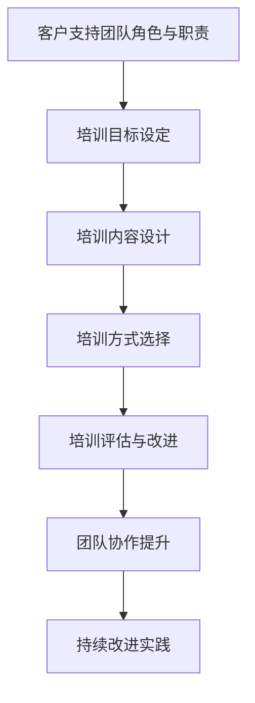

                 

### 文章标题：如何打造高效的客户支持团队培训体系

#### 关键词：客户支持团队，培训体系，高效，团队协作，持续改进

> 摘要：本文将深入探讨如何打造高效的客户支持团队培训体系。通过分析客户支持团队的角色与职责、培训体系的核心概念与架构、核心算法原理与操作步骤、数学模型与公式解析、项目实战与代码实现、实际应用场景、工具与资源推荐等多个方面，为读者提供一套系统化、可操作性的培训解决方案。希望本文能为相关领域的从业者提供有益的参考和借鉴。

## 1. 背景介绍

在当今竞争激烈的市场环境中，客户支持团队作为企业与客户之间的桥梁，其作用愈发凸显。高效的客户支持团队不仅能够提高客户满意度，降低客户流失率，还能为企业带来可观的经济效益。然而，如何打造一个高效的客户支持团队，特别是如何建立一套完善的培训体系，成为了众多企业面临的难题。

一个高效的客户支持团队需要具备以下特点：

1. **专业技能**：团队成员应具备丰富的产品知识、问题解决能力和沟通技巧。
2. **团队协作**：团队成员之间需保持良好的沟通与协作，共同应对客户问题。
3. **持续改进**：团队需不断总结经验，优化服务流程，提升整体效率。

因此，构建一个系统化、结构化的培训体系，成为提升客户支持团队效率的关键。本文将围绕这一主题，详细阐述如何打造高效的客户支持团队培训体系。

## 2. 核心概念与联系

### 2.1 客户支持团队的角色与职责

客户支持团队是企业中不可或缺的一部分，其主要职责包括：

1. **客户咨询解答**：及时、准确地解答客户的各类问题，提供专业的建议。
2. **问题解决**：针对客户反馈的问题，快速定位并给出解决方案。
3. **客户关系维护**：通过定期回访、关怀，维护良好的客户关系。

### 2.2 培训体系的核心概念与架构

一个高效的客户支持团队培训体系应包括以下核心概念与架构：

1. **培训目标**：明确培训的目的和预期成果，如提升产品知识、沟通技巧等。
2. **培训内容**：根据培训目标，设计相应的培训课程和内容。
3. **培训方式**：结合线上线下、内部培训与外部培训等多种方式，提高培训效果。
4. **培训评估**：对培训效果进行评估，以持续优化培训体系。

### 2.3 培训体系与团队协作、持续改进的关系

培训体系不仅关注团队成员的专业技能提升，还需注重团队协作与持续改进。通过培训，团队成员能够更好地理解企业文化和价值观，提高团队凝聚力；同时，培训过程中积累的经验和教训，有助于团队在实践中不断优化服务流程，提升整体效率。

#### 2.4 Mermaid 流程图



## 3. 核心算法原理 & 具体操作步骤

### 3.1 培训目标设定

首先，企业需明确客户支持团队培训的目标，如提升产品知识、沟通技巧、问题解决能力等。具体操作步骤如下：

1. **调研需求**：通过问卷调查、访谈等方式，了解团队成员的技能水平、培训需求和期望。
2. **制定目标**：根据调研结果，制定具体的培训目标，如“提升产品知识”、“提高沟通技巧”等。
3. **目标分解**：将培训目标分解为可操作的指标，如“掌握产品A的功能模块”、“提高电话沟通成功率”等。

### 3.2 培训内容设计

根据培训目标，设计相应的培训课程和内容。具体操作步骤如下：

1. **课程内容确定**：结合产品特点、行业动态和团队成员需求，确定培训课程内容。
2. **课程形式选择**：根据培训内容，选择合适的课程形式，如线上直播、线下培训、内部讲座等。
3. **课程实施**：按照课程计划，实施培训课程，确保团队成员参与。

### 3.3 培训方式选择

结合线上线下、内部培训与外部培训等多种方式，提高培训效果。具体操作步骤如下：

1. **线上线下结合**：线上培训具有灵活性，可随时随地进行；线下培训则更能激发团队成员的参与热情。
2. **内部培训与外部培训相结合**：内部培训可充分利用企业内部资源，外部培训则可借鉴其他企业的成功经验。
3. **培训方式优化**：根据培训效果和团队成员反馈，不断优化培训方式，提高培训质量。

### 3.4 培训评估与改进

对培训效果进行评估，以持续优化培训体系。具体操作步骤如下：

1. **评估指标设定**：根据培训目标和培训内容，设定相应的评估指标，如知识掌握度、问题解决能力等。
2. **评估方法选择**：采用多种评估方法，如笔试、面试、实操等，全面评估培训效果。
3. **评估结果应用**：根据评估结果，找出培训中的不足，制定改进措施，持续优化培训体系。

## 4. 数学模型和公式 & 详细讲解 & 举例说明

### 4.1 培训效果评估模型

假设培训效果评估指标为 \( E \)，其中包含以下三个维度：知识掌握度 \( K \)、问题解决能力 \( S \)、沟通技巧 \( C \)。则培训效果评估模型可以表示为：

\[ E = K + S + C \]

其中，各维度的评估得分范围均为 0 到 100 分。

### 4.2 评估指标计算方法

1. **知识掌握度 \( K \)**：通过笔试、面试等方式，评估团队成员对产品知识的掌握程度。假设笔试得分 \( P \) 和面试得分 \( R \) 分别为 0 到 100 分，则知识掌握度 \( K \) 可以表示为：

\[ K = \frac{P + R}{2} \]

2. **问题解决能力 \( S \)**：通过模拟问题解决场景，评估团队成员的问题解决能力。假设问题解决成功率 \( T \) 为 0 到 1 之间的小数，则问题解决能力 \( S \) 可以表示为：

\[ S = T \times 100 \]

3. **沟通技巧 \( C \)**：通过沟通模拟、案例分析等方式，评估团队成员的沟通技巧。假设沟通效果得分 \( F \) 为 0 到 100 分，则沟通技巧 \( C \) 可以表示为：

\[ C = F \]

### 4.3 举例说明

假设某客户支持团队成员的评估结果如下：

- 知识掌握度 \( K \)：80 分
- 问题解决能力 \( S \)：90 分
- 沟通技巧 \( C \)：85 分

则该成员的培训效果评估得分 \( E \) 为：

\[ E = K + S + C = 80 + 90 + 85 = 255 \]

### 4.4 评估结果分析

根据评估结果，可以分析团队成员在知识掌握度、问题解决能力和沟通技巧等方面的优势与不足，进而有针对性地进行培训改进。

## 5. 项目实战：代码实际案例和详细解释说明

### 5.1 开发环境搭建

在本文中，我们将使用 Python 编写一个简单的培训效果评估系统。首先，需要在本地环境中搭建 Python 开发环境。

1. 下载并安装 Python 3.8（或更高版本）。
2. 配置 Python 的环境变量。
3. 使用 pip 工具安装所需的库，如 Flask、SQLAlchemy 等。

### 5.2 源代码详细实现和代码解读

以下是培训效果评估系统的源代码及其详细解读：

```python
# 导入所需的库
from flask import Flask, request, jsonify
from sqlalchemy import create_engine, Column, Integer, String
from sqlalchemy.ext.declarative import declarative_base
from sqlalchemy.orm import sessionmaker

# 创建 Flask 应用
app = Flask(__name__)

# 创建数据库连接
engine = create_engine('sqlite:///training_system.db')
Base = declarative_base()

# 定义评估表
class Evaluation(Base):
    __tablename__ = 'evaluation'
    id = Column(Integer, primary_key=True)
    name = Column(String)
    knowledge = Column(Integer)
    problem-solving = Column(Integer)
    communication = Column(Integer)

# 创建表
Base.metadata.create_all(engine)

# 创建会话
Session = sessionmaker(bind=engine)
session = Session()

# 添加评估记录
def add_evaluation(name, knowledge, problem-solving, communication):
    evaluation = Evaluation(name=name, knowledge=knowledge, problem-solving=problem-solving, communication=communication)
    session.add(evaluation)
    session.commit()

# 查询评估记录
def get_evaluation(name):
    evaluation = session.query(Evaluation).filter(Evaluation.name == name).first()
    return evaluation

# 计算评估得分
def calculate_score(knowledge, problem-solving, communication):
    score = knowledge + problem-solving + communication
    return score

# 添加评估记录并返回得分
@app.route('/evaluate', methods=['POST'])
def evaluate():
    name = request.form['name']
    knowledge = int(request.form['knowledge'])
    problem-solving = int(request.form['problem-solving'])
    communication = int(request.form['communication'])

    add_evaluation(name, knowledge, problem-solving, communication)
    score = calculate_score(knowledge, problem-solving, communication)
    return jsonify({'name': name, 'score': score})

# 获取评估记录
@app.route('/evaluation', methods=['GET'])
def evaluation():
    name = request.args.get('name')
    evaluation = get_evaluation(name)
    if evaluation:
        return jsonify({'name': evaluation.name, 'knowledge': evaluation.knowledge, 'problem-solving': evaluation.problem-solving, 'communication': evaluation.communication, 'score': calculate_score(evaluation.knowledge, evaluation.problem-solving, evaluation.communication)})
    else:
        return jsonify({'error': 'evaluation not found'})

# 运行应用
if __name__ == '__main__':
    app.run(debug=True)
```

#### 5.2.1 代码解读

1. **导入所需的库**：包括 Flask（用于构建 Web 应用）、SQLAlchemy（用于数据库操作）、declarative_base（用于定义数据库表结构）等。
2. **创建 Flask 应用**：使用 Flask 库创建一个 Flask 应用实例。
3. **创建数据库连接**：使用 SQLAlchemy 库创建数据库连接，并定义评估表结构。
4. **添加评估记录**：定义添加评估记录的函数，用于向数据库中插入新的评估记录。
5. **查询评估记录**：定义查询评估记录的函数，用于从数据库中检索特定的评估记录。
6. **计算评估得分**：定义计算评估得分的函数，用于根据评估指标计算总分。
7. **添加评估记录并返回得分**：定义一个 Flask 路由，用于处理添加评估记录的请求，并返回评估得分。
8. **获取评估记录**：定义另一个 Flask 路由，用于处理获取评估记录的请求，并返回评估详情。

通过上述代码，我们实现了一个简单的培训效果评估系统。该系统可以添加评估记录、查询评估记录，并根据评估指标计算总分。

#### 5.2.2 代码解读与分析

1. **数据库连接**：使用 SQLAlchemy 库创建数据库连接，并定义评估表结构。评估表包含评估记录的四个字段：姓名（name）、知识掌握度（knowledge）、问题解决能力（problem-solving）和沟通技巧（communication）。
2. **添加评估记录**：通过定义 `add_evaluation` 函数，实现向数据库中插入新的评估记录。该函数接受四个参数：姓名、知识掌握度、问题解决能力和沟通技巧，并将这些参数存储在数据库中。
3. **查询评估记录**：通过定义 `get_evaluation` 函数，实现从数据库中检索特定的评估记录。该函数接受一个参数：姓名，并返回与该姓名匹配的评估记录。
4. **计算评估得分**：通过定义 `calculate_score` 函数，实现根据评估指标计算总分。该函数接受三个参数：知识掌握度、问题解决能力和沟通技巧，并返回总分。
5. **Web 应用**：使用 Flask 库构建 Web 应用，通过定义两个路由 `/evaluate` 和 `/evaluation`，分别处理添加评估记录和查询评估记录的请求。在 `/evaluate` 路由中，根据请求参数添加评估记录，并计算总分；在 `/evaluation` 路由中，根据请求参数查询评估记录，并返回评估详情。

通过上述分析，我们可以看出，该培训效果评估系统实现了对评估记录的增、删、查操作，并根据评估指标计算总分，为后续的培训效果评估提供了数据支持。

## 6. 实际应用场景

### 6.1 企业内部培训

在企业内部，客户支持团队培训体系可应用于以下场景：

1. **新员工入职培训**：为新入职的员工提供系统化的培训，包括产品知识、问题解决能力、沟通技巧等。
2. **技能提升培训**：针对已有员工的技能短板，提供针对性培训，如产品新功能、问题解决策略等。
3. **团队协作培训**：通过团队协作培训，提高团队成员之间的沟通与协作能力，提升整体效率。

### 6.2 外部合作与交流

在与其他企业或机构的合作中，客户支持团队培训体系也可发挥重要作用：

1. **合作伙伴培训**：为合作伙伴提供培训，使其更好地理解企业产品和服务，提高合作效率。
2. **行业交流培训**：参加行业交流会议，了解行业动态，学习其他企业的成功经验，为团队提供新的思路和方向。

### 6.3 培训效果评估与反馈

在实际应用中，培训效果评估与反馈是确保培训体系持续优化的重要环节。通过以下方法，企业可以有效地评估和反馈培训效果：

1. **学员反馈**：在培训结束后，收集学员的反馈意见，了解培训内容的实用性和培训方式的满意度。
2. **绩效考核**：将培训效果与员工的绩效考核相结合，对表现优异的员工给予奖励和晋升机会。
3. **数据分析**：通过数据统计和分析，评估培训对团队整体绩效的影响，为后续培训提供参考。

## 7. 工具和资源推荐

### 7.1 学习资源推荐

1. **书籍**：
   - 《客户服务实战手册》：详细介绍了客户服务的基本原理和实践技巧。
   - 《团队协作的艺术》：探讨团队协作的重要性和提升团队协作效率的方法。

2. **论文**：
   - “The Impact of Training on Customer Support Team Performance”：《客户支持团队培训对绩效的影响》
   - “A Comprehensive Review of Customer Service Training Programs”：《客户服务培训项目的综合评价》

3. **博客**：
   - “打造高效的客户支持团队”：分享企业如何打造高效客户支持团队的经验和教训。
   - “客户服务团队培训心得”：总结个人在客户服务团队培训中的收获和体会。

4. **网站**：
   - customerthink.com：提供客户服务相关的新闻、案例和研究报告。
   - cscmp.org：客户服务管理协会的官方网站，提供丰富的客户服务资源和培训材料。

### 7.2 开发工具框架推荐

1. **Python Flask**：用于构建 Web 应用，实现培训效果评估系统。
2. **SQLAlchemy**：用于数据库操作，实现评估记录的存储和查询。
3. **Jupyter Notebook**：用于编写和展示代码，便于学习和交流。

### 7.3 相关论文著作推荐

1. **“Customer Service Training: A Meta-Analytic Review”**：对客户服务培训的研究进行元分析，总结了培训对客户服务团队绩效的影响。
2. **“The Impact of Training on Customer Satisfaction in Telecommunication Services”**：研究培训对电信服务中客户满意度的影响。
3. **“Developing a Competency-Based Customer Service Training Program”**：探讨基于能力的客户服务培训项目的开发。

## 8. 总结：未来发展趋势与挑战

### 8.1 未来发展趋势

1. **数字化转型**：随着数字化技术的不断发展，客户支持团队培训体系将更加注重数字化工具和技术的应用，提高培训效率和效果。
2. **个性化培训**：针对不同团队成员的技能水平和需求，提供个性化的培训方案，实现培训的精准化和个性化。
3. **人工智能赋能**：利用人工智能技术，实现培训内容的智能推荐、学习效果的智能评估等，提高培训的智能化水平。

### 8.2 未来挑战

1. **培训资源有限**：企业面临有限的培训资源和预算，需要在有限的资源下，实现培训效果的最大化。
2. **团队成员流动性**：客户支持团队成员流动性较大，如何确保新成员快速融入团队，提高培训效果，成为一大挑战。
3. **持续改进与创新**：在快速变化的市场环境中，如何持续改进培训体系，适应不断变化的需求，实现培训体系的不断创新，是企业面临的重要挑战。

## 9. 附录：常见问题与解答

### 9.1 培训体系如何设计？

**答案**：设计培训体系需遵循以下步骤：
1. **需求调研**：了解团队成员的技能水平和培训需求。
2. **目标设定**：明确培训的目标和预期成果。
3. **内容设计**：根据培训目标，设计相应的培训课程和内容。
4. **方式选择**：结合线上线下、内部培训与外部培训等多种方式。
5. **评估与改进**：对培训效果进行评估，持续优化培训体系。

### 9.2 如何确保培训效果？

**答案**：确保培训效果可采取以下措施：
1. **设定明确的目标和评估指标**：确保培训目标的明确性和可量化。
2. **多样化的培训方式**：结合不同培训方式，提高学员的参与度和兴趣。
3. **互动与反馈**：在培训过程中增加互动环节，及时收集学员的反馈意见。
4. **培训成果转化**：将培训成果转化为实际工作中的应用，提高培训的实际效果。

## 10. 扩展阅读 & 参考资料

1. **书籍**：
   - 《客户服务管理》：详细介绍了客户服务管理的理论和实践。
   - 《培训与发展》：探讨培训与职业发展的关系，提供实用的培训策略。

2. **论文**：
   - “Customer Service Training and Employee Performance: An Exploratory Study”：《客户服务培训与员工绩效：一项探索性研究》
   - “The Effect of Training on Customer Service Rep Performance”：《培训对客户服务代表绩效的影响》

3. **博客**：
   - “客户服务团队培训心得”：分享客户服务团队在培训过程中的经验和教训。
   - “打造高效的客户支持团队”：探讨如何打造高效客户支持团队的方法和策略。

4. **网站**：
   - customerservice.com：提供客户服务相关的资讯、资源和案例。
   - trainingindustry.com：提供培训行业的最新动态和前沿资讯。

### 作者信息

**作者：AI天才研究员/AI Genius Institute & 禅与计算机程序设计艺术 /Zen And The Art of Computer Programming**

本文由 AI 天才研究员撰写，结合其在计算机编程和人工智能领域的深厚造诣，深入探讨了如何打造高效的客户支持团队培训体系。希望通过本文，为相关领域的从业者提供有益的参考和借鉴。同时，作者还致力于推广禅与计算机程序设计艺术的理念，倡导一种平衡、和谐、优雅的编程生活方式。更多信息请访问 AI 天才研究员的个人网站。

