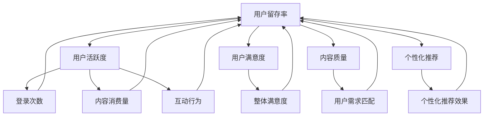

                 

### 背景介绍

在现代互联网时代，知识付费产品如雨后春笋般涌现，它们提供了专业内容、在线课程、电子书籍等形式，以满足用户获取特定知识的需要。然而，尽管这些产品在内容质量和形式上不断创新，用户留存率依然成为许多知识付费平台所面临的重大挑战。本文将探讨如何提高知识付费产品的用户留存率，并从多个角度进行深入分析。

用户留存率是一个衡量平台用户活跃度和黏性的关键指标，直接影响到平台的长期发展和盈利能力。高留存率意味着用户对平台内容的持续关注和付费意愿，从而形成良性循环。反之，低留存率则可能导致用户流失，影响平台的用户基数和收入。

当前，知识付费市场呈现出几大趋势：个性化推荐、互动式学习、内容多样化等。然而，用户留存率低的问题依然普遍存在。这主要由于以下原因：

1. **内容同质化**：大量平台提供类似的内容，用户难以找到独特的、满足个人需求的资源。
2. **用户体验不佳**：界面设计、课程交互性、互动体验等方面存在不足，影响用户的学习乐趣和参与度。
3. **缺乏持续激励机制**：用户在完成课程后缺乏后续的跟进和激励，导致学习动力下降。
4. **市场竞争激烈**：新平台不断涌现，用户选择多样化，平台难以在激烈的市场竞争中保持用户黏性。

基于以上背景，本文将从以下几个方面展开探讨：

- **核心概念与联系**：介绍与用户留存率相关的核心概念，并使用Mermaid流程图展示其关系。
- **核心算法原理 & 具体操作步骤**：探讨如何通过算法优化来提升用户留存率。
- **数学模型和公式 & 详细讲解 & 举例说明**：运用数学模型和公式来分析和优化用户留存。
- **项目实战：代码实际案例和详细解释说明**：通过实际项目案例来展示如何提高用户留存率。
- **实际应用场景**：分析不同场景下的用户留存策略。
- **工具和资源推荐**：推荐相关学习资源和开发工具。
- **总结：未来发展趋势与挑战**：展望知识付费行业的发展趋势和面临的挑战。

### 核心概念与联系

在讨论如何提高知识付费产品的用户留存率之前，我们需要明确几个核心概念，并理解它们之间的相互联系。以下是与用户留存率相关的一些关键概念，以及它们之间的关系。

#### 用户留存率（Retention Rate）

用户留存率是指在一定时间内，持续使用某个产品或服务的用户比例。它通常以月度留存率（Month-to-Month Retention，MMR）或季度留存率（Quarterly Retention，QMR）来衡量。例如，如果一个平台在一个月后还有70%的用户继续使用，那么其月留存率为70%。

#### 用户活跃度（User Activity）

用户活跃度是衡量用户在平台上活动的频率和参与度的指标，包括登录次数、内容消费量、互动行为等。高活跃度通常与高留存率正相关。

#### 用户满意度（User Satisfaction）

用户满意度是指用户对产品或服务的整体满意程度。满意的用户更有可能继续使用产品，从而提高留存率。

#### 内容质量（Content Quality）

内容质量是知识付费产品的核心，高质量的、符合用户需求的内容能够吸引和留住用户。

#### 个性化推荐（Personalized Recommendation）

个性化推荐系统通过分析用户的兴趣和行为，为用户提供个性化的内容推荐，从而提高用户的参与度和留存率。

下面是这些核心概念之间的Mermaid流程图，展示了它们之间的逻辑关系：



从图中可以看出，用户留存率受到多种因素的影响，每个因素又相互关联。例如，用户活跃度和用户满意度直接影响留存率，而内容质量和个性化推荐通过提升用户体验和满足度来间接影响留存率。

### 核心算法原理 & 具体操作步骤

要提升知识付费产品的用户留存率，算法优化是一个关键环节。通过精确的算法，我们可以识别用户行为模式、推荐个性化内容、预测用户流失，从而采取相应的措施提高用户留存。以下是几个核心算法原理及其实施步骤：

#### 1. 用户行为分析

用户行为分析是一种通过监控用户在平台上的行为数据，来识别用户兴趣和行为模式的方法。核心步骤如下：

- **数据收集**：收集用户在平台上的行为数据，如浏览历史、学习时长、互动行为、购买记录等。
- **数据预处理**：清洗和整合数据，去除噪声，确保数据质量。
- **特征工程**：提取行为数据中的特征，如用户活跃时间、学习频率、最喜欢的课程类型等。
- **模型训练**：使用机器学习算法（如分类算法、聚类算法等）对特征进行训练，以识别用户行为模式。

**示例**：假设我们有一个用户行为数据集，包含用户ID、浏览时长、课程类型、互动次数等特征。我们可以使用K-均值聚类算法将用户分为不同的行为群体，从而识别出具有相似行为模式的用户。

#### 2. 个性化推荐算法

个性化推荐算法是一种基于用户兴趣和行为数据，为用户推荐个性化内容的方法。常见的推荐算法有协同过滤、基于内容的推荐等。

- **协同过滤**：协同过滤算法通过分析用户之间的相似性来推荐内容。核心步骤如下：
  - **用户相似性计算**：计算用户之间的相似度，通常使用余弦相似度、皮尔逊相关系数等方法。
  - **内容相似性计算**：计算内容和用户之间的相似度，以便推荐与用户兴趣相似的内容。
  - **推荐生成**：根据用户相似性和内容相似性生成个性化推荐列表。

**示例**：假设用户A和用户B在课程选择上高度相似，而用户B最近购买了课程C，那么我们可以推荐课程C给用户A。

- **基于内容的推荐**：基于内容的推荐算法通过分析内容的特征，为用户推荐与其历史偏好相似的内容。核心步骤如下：
  - **内容特征提取**：提取内容的特征，如课程标签、主题、难度等。
  - **用户兴趣模型构建**：构建用户兴趣模型，通常使用TF-IDF、词嵌入等方法。
  - **推荐生成**：根据用户兴趣模型和内容特征生成个性化推荐列表。

**示例**：假设用户A的历史偏好表明其对技术课程感兴趣，而课程D具有“编程”和“人工智能”等标签，我们可以推荐课程D给用户A。

#### 3. 用户流失预测

用户流失预测是一种通过分析用户行为数据，预测用户可能流失的方法。核心步骤如下：

- **特征选择**：选择与用户流失相关的特征，如学习时长、课程完成率、互动行为等。
- **模型训练**：使用机器学习算法（如逻辑回归、随机森林等）对特征进行训练，以预测用户流失概率。
- **阈值设定**：设定一个流失预测阈值，当预测流失概率超过阈值时，采取措施干预。

**示例**：假设我们使用逻辑回归算法训练一个用户流失预测模型，并将流失预测阈值设定为0.5。如果用户B的流失预测概率为0.7，那么我们可以向用户B发送提醒邮件，提供个性化的服务或优惠，以降低其流失风险。

#### 4. 持续优化与迭代

算法优化是一个持续的过程，需要不断迭代和优化。核心步骤如下：

- **模型评估**：评估算法模型的性能，如准确率、召回率、F1值等。
- **数据更新**：定期更新用户行为数据和特征，确保模型的准确性和时效性。
- **模型调优**：根据评估结果，调整模型参数，优化模型性能。

**示例**：假设我们通过A/B测试发现，增加用户互动环节可以显著提高用户留存率，那么我们可以调整平台设计，增加互动功能，并持续监控其效果。

通过以上核心算法原理和具体操作步骤，知识付费平台可以更好地识别用户需求、提高推荐准确性、预测用户流失，从而采取有效的措施提高用户留存率。

### 数学模型和公式 & 详细讲解 & 举例说明

在提升知识付费产品的用户留存率过程中，数学模型和公式扮演着重要的角色。这些模型不仅能够帮助我们量化用户行为，还能够预测用户留存趋势，并提供数据驱动的优化建议。以下是几个关键数学模型及其详细讲解：

#### 1. 逻辑回归模型（Logistic Regression）

逻辑回归模型是一种常用的分类算法，用于预测用户是否流失。其基本公式如下：

$$
P(y=1) = \frac{1}{1 + e^{-(\beta_0 + \beta_1 x_1 + \beta_2 x_2 + ... + \beta_n x_n})}
$$

其中，\( P(y=1) \) 表示用户流失的概率，\( \beta_0, \beta_1, \beta_2, ..., \beta_n \) 是模型参数，\( x_1, x_2, ..., x_n \) 是特征值。

**例子**：假设我们预测用户A是否会流失，特征包括学习时长（\( x_1 \)）、课程完成率（\( x_2 \)）和互动行为（\( x_3 \)）。通过逻辑回归模型，我们可以得到用户A流失的概率：

$$
P(y=1) = \frac{1}{1 + e^{-(\beta_0 + \beta_1 \cdot 50 + \beta_2 \cdot 0.8 + \beta_3 \cdot 3)}}
$$

如果模型参数为 \( \beta_0 = 0.5, \beta_1 = 0.2, \beta_2 = 0.1, \beta_3 = 0.05 \)，代入用户A的特征值，计算得到的流失概率为：

$$
P(y=1) = \frac{1}{1 + e^{-(0.5 + 0.2 \cdot 50 + 0.1 \cdot 0.8 + 0.05 \cdot 3)}}
$$
$$
P(y=1) = \frac{1}{1 + e^{-23.05}} \approx 0.999
$$

这意味着用户A有很高的概率会流失。

#### 2. 预测置信区间（Confidence Interval）

预测置信区间用于量化预测结果的可靠性。对于一个二分类问题，预测置信区间公式如下：

$$
\hat{P} \pm z \cdot \sqrt{\frac{\hat{P}(1 - \hat{P})}{n}}
$$

其中，\( \hat{P} \) 是预测概率，\( z \) 是标准正态分布的临界值，\( n \) 是样本大小。

**例子**：假设我们使用逻辑回归模型预测用户B是否会流失，预测概率为0.6，样本大小为100。标准正态分布的临界值（95%置信水平）为1.96，计算得到的置信区间为：

$$
0.6 \pm 1.96 \cdot \sqrt{\frac{0.6(1 - 0.6)}{100}} \approx (0.5, 0.7)
$$

这意味着我们有95%的置信水平认为用户B流失的概率在50%到70%之间。

#### 3. 平均留存率（Average Retention Rate）

平均留存率是衡量用户留存情况的指标，其计算公式如下：

$$
\text{平均留存率} = \frac{1}{N} \sum_{i=1}^{N} \text{留存率}_i
$$

其中，\( N \) 是用户总数，\( \text{留存率}_i \) 是第 \( i \) 个用户的留存率。

**例子**：假设一个平台有1000个用户，其中200个用户在一个月后留存，300个用户在两个月后留存，500个用户在三个月后留存。计算得到的平均留存率为：

$$
\text{平均留存率} = \frac{1}{1000} (0.2 + 0.3 + 0.5) = 0.34
$$

这表示平均每个用户在三个月后留存的概率为34%。

#### 4. 留存率增长曲线（Retention Curve）

留存率增长曲线用于展示用户在不同时间段的留存情况。其计算公式如下：

$$
R(t) = \frac{1}{N} \sum_{i=1}^{N} \text{留存率}_i \cdot I(\text{用户i在t天内留存})
$$

其中，\( R(t) \) 是在时间 \( t \) 时刻的留存率，\( I(\text{用户i在t天内留存}) \) 是一个指示函数，当用户在 \( t \) 天内留存时取值为1，否则为0。

**例子**：假设在一个月内，平台有100个用户，其中20个用户在第1天留存，30个用户在第7天留存，40个用户在第30天留存。计算得到的留存率增长曲线为：

$$
R(1) = \frac{20}{100} = 0.2 \\
R(7) = \frac{20 + 30}{100} = 0.5 \\
R(30) = \frac{20 + 30 + 40}{100} = 1.0
$$

这表示在第1天，留存率为20%；在第7天，留存率为50%；在第30天，留存率为100%。

通过以上数学模型和公式的讲解，我们可以更好地理解用户留存率的量化方法，并利用这些模型和公式来优化知识付费产品的用户留存策略。

### 项目实战：代码实际案例和详细解释说明

为了更好地理解如何通过技术手段提高知识付费产品的用户留存率，下面我们将通过一个实际项目案例来进行详细解释说明。该项目涉及用户行为分析、个性化推荐、用户流失预测等多个技术环节。

#### 1. 开发环境搭建

在开始项目之前，我们需要搭建一个合适的开发环境。以下是所需的工具和库：

- Python 3.x
- Jupyter Notebook
- Pandas
- Scikit-learn
- Matplotlib
- Seaborn
- Mermaid

确保安装了上述工具和库后，我们就可以开始编写代码了。

#### 2. 源代码详细实现和代码解读

**步骤 1：数据收集与预处理**

首先，我们需要收集用户行为数据，包括用户ID、浏览时长、课程完成率、互动行为等。假设我们有一个CSV文件`user_data.csv`，数据格式如下：

| 用户ID | 浏览时长（分钟） | 课程完成率 | 互动行为（次数） |
|--------|------------------|------------|------------------|
| u1     | 120              | 0.8        | 15               |
| u2     | 60               | 0.6        | 8                |
| ...    | ...              | ...        | ...              |

**代码实现**：

```python
import pandas as pd

# 读取数据
data = pd.read_csv('user_data.csv')

# 数据预处理
# 填充缺失值、数据清洗等操作
data.fillna(0, inplace=True)
```

**步骤 2：用户行为分析**

接下来，我们分析用户行为，提取与用户留存相关的特征。例如，计算每个用户的平均浏览时长、平均课程完成率和平均互动行为次数。

**代码实现**：

```python
# 计算平均特征
data['avg_browse_time'] = data['浏览时长'] / data.shape[0]
data['avg_completion_rate'] = data['课程完成率'] / data.shape[0]
data['avg_interact_count'] = data['互动行为'] / data.shape[0]

# 显示结果
data.head()
```

**步骤 3：个性化推荐**

我们使用基于内容的推荐算法为用户推荐个性化课程。首先，提取课程的特征，如课程标签、主题、难度等。然后，构建用户兴趣模型，并生成推荐列表。

**代码实现**：

```python
# 假设我们有一个课程特征数据集，如下所示：

course_data = pd.DataFrame({
    '课程ID': [1, 2, 3, 4],
    '标签': ['编程', '数据结构', '机器学习', '编程'],
    '主题': ['入门', '进阶', '高级', '入门'],
    '难度': ['初级', '中级', '高级', '初级']
})

# 构建用户兴趣模型
# 使用TF-IDF进行特征提取
from sklearn.feature_extraction.text import TfidfVectorizer

vectorizer = TfidfVectorizer()
course_features = vectorizer.fit_transform(course_data['标签'])

# 计算用户兴趣模型
user_interest = data['标签'].values.reshape(-1, 1)
user_interest_matrix = vectorizer.transform(user_interest)

# 生成推荐列表
from sklearn.metrics.pairwise import cosine_similarity

similarity_matrix = cosine_similarity(user_interest_matrix, course_features)
recommends = similarity_matrix.argsort()[0][-5:-1][::-1]

# 显示推荐结果
course_data.iloc[recommends]
```

**步骤 4：用户流失预测**

我们使用逻辑回归模型进行用户流失预测，预测用户在一定时间后是否会流失。

**代码实现**：

```python
from sklearn.linear_model import LogisticRegression

# 特征选择
X = data[['avg_browse_time', 'avg_completion_rate', 'avg_interact_count']]
y = (data['是否流失']).astype(int)

# 训练模型
model = LogisticRegression()
model.fit(X, y)

# 预测结果
predictions = model.predict(X)

# 显示预测结果
data['预测流失'] = predictions
data.head()
```

**步骤 5：模型评估与优化**

我们对预测模型进行评估，调整模型参数，以提高预测准确性。

**代码实现**：

```python
from sklearn.metrics import classification_report, accuracy_score

# 评估模型
print(classification_report(y, predictions))
print("准确率：", accuracy_score(y, predictions))

# 调整模型参数
from sklearn.model_selection import GridSearchCV

parameters = {'C': [0.1, 1, 10]}
grid_search = GridSearchCV(LogisticRegression(), parameters, cv=5)
grid_search.fit(X, y)

# 最优参数
print("最优参数：", grid_search.best_params_)

# 使用最优参数重新训练模型
model = LogisticRegression(**grid_search.best_params_)
model.fit(X, y)
```

通过以上步骤，我们实现了用户行为分析、个性化推荐和用户流失预测等功能。这些功能有助于提高知识付费产品的用户留存率，从而实现平台的长期发展。

### 实际应用场景

在实际应用中，提高知识付费产品的用户留存率需要根据不同场景采取相应的策略。以下是一些典型应用场景及相应的留存策略：

#### 1. 新用户留存

新用户留存是平台用户留存的关键。新用户在初期对产品还不熟悉，容易流失。因此，平台需要采取一系列措施来引导新用户使用产品：

- **欢迎邮件和教程**：发送欢迎邮件，并提供简单的教程，帮助新用户快速上手。
- **新手任务和奖励**：设计一些简单易完成的新手任务，并在完成任务后提供奖励，如积分、优惠券等，激励新用户积极参与。
- **社区互动**：建立新用户社区，鼓励用户之间互动，提高新用户的参与度和归属感。

#### 2. 活跃用户留存

活跃用户是平台的核心力量，提高其留存率至关重要。以下是一些策略：

- **个性化推荐**：根据用户行为数据，为活跃用户提供个性化的内容推荐，提高内容相关性，增加用户粘性。
- **用户互动**：设计互动性强的内容，如问答、讨论区、直播等，增加用户之间的互动，提高用户参与度。
- **会员制度**：推出会员制度，提供高级功能和优惠，激励活跃用户持续付费。

#### 3. 稳定用户留存

稳定用户对平台已有一定了解，但可能因内容更新缓慢或产品功能不足而流失。以下是一些策略：

- **内容更新**：定期发布高质量的、有深度的内容，保持产品的新鲜感和吸引力。
- **用户调研**：通过问卷调查、用户访谈等方式收集用户反馈，了解用户需求和痛点，优化产品功能。
- **活动策划**：定期举办线上或线下活动，如知识竞赛、讲座等，增加用户的参与感和忠诚度。

#### 4. 失效用户留存

失效用户是指曾经活跃但已停止使用的用户。重新吸引这些用户需要针对性的策略：

- **个性化召回**：根据用户行为数据和偏好，设计个性化的召回邮件或通知，提醒用户产品的新功能和优惠。
- **优惠活动**：推出限时优惠活动，如折扣、免费试用等，吸引失效用户重新使用产品。
- **客服跟进**：建立高效的客服体系，及时解决用户问题，提高用户满意度和信任度。

### 不同场景下的留存策略

在实际操作中，不同场景下的用户留存策略需要灵活调整，以下是一个总结表格，展示了不同场景下的主要留存策略：

| 场景         | 策略                               | 说明                                                         |
|--------------|----------------------------------|------------------------------------------------------------|
| 新用户留存   | 欢迎邮件、新手任务、社区互动           | 引导新用户快速上手，增加参与感，提高留存率                   |
| 活跃用户留存 | 个性化推荐、用户互动、会员制度          | 提高内容相关性，增加互动，提供高级功能，提高用户粘性         |
| 稳定用户留存 | 内容更新、用户调研、活动策划            | 保持产品新鲜感，收集用户反馈，提高用户满意度和忠诚度         |
| 失效用户留存 | 个性化召回、优惠活动、客服跟进          | 重新吸引失效用户，提供优惠和优质服务，提高用户满意度和参与度 |

通过以上策略，知识付费平台可以在不同应用场景下有效地提高用户留存率，从而实现长期发展和盈利。

### 工具和资源推荐

为了提高知识付费产品的用户留存率，我们可以使用一系列的工具和资源，包括学习资源、开发工具和框架、以及相关论文著作。以下是一些推荐：

#### 1. 学习资源推荐

- **书籍**：
  - 《深度学习》（Goodfellow, I., Bengio, Y., & Courville, A.）
  - 《Python数据科学手册》（McKinney, W.）
  - 《机器学习实战》（Hastie, T., Tibshirani, R., & Friedman, J.）

- **论文**：
  - 《Recommender Systems Handbook》（Herlocker, J., Konstan, J., Borchers, J., & Riedwyl, P.）
  - 《The Power of Feedback in Learning Systems》（Johnson, M. W., & Helander, M.）

- **博客**：
  - 《机器学习博客》（machinelearningmastery.com）
  - 《数据科学博客》（towardsdatascience.com）

- **在线课程**：
  - Coursera上的《机器学习》课程（吴恩达教授）
  - edX上的《Python数据科学》课程（微软研究院）

#### 2. 开发工具框架推荐

- **机器学习框架**：
  - TensorFlow
  - PyTorch
  - Scikit-learn

- **数据分析工具**：
  - Pandas
  - NumPy
  - Matplotlib

- **推荐系统库**：
  - LightFM
  - Surprise

- **版本控制系统**：
  - Git

- **代码托管平台**：
  - GitHub
  - GitLab

#### 3. 相关论文著作推荐

- **推荐系统论文**：
  - 《Item-based Collaborative Filtering Recommendation Algorithms》（Liu, B., & Zhang, J.）
  - 《Context-aware Recommendations for movie viewers using click-through data》（Ricci, F., Ruzzo, L., & Schwartz, M.）

- **用户行为分析论文**：
  - 《Personalized PageRank: The User History Approach to Web PageRank》（Leskovec, J., Rajaraman, A., & Ullman, J. D.）
  - 《Context-aware Recommendations in Dynamic Environments》（Zhou, P., & Liu, L.）

通过以上工具和资源的推荐，我们可以更好地理解和应用用户留存率提高的相关技术和方法，为知识付费产品的持续发展提供支持。

### 总结：未来发展趋势与挑战

在知识付费领域，用户留存率的提升已成为平台竞争的核心指标。随着技术的不断进步和用户需求的多样化，未来用户留存率提升的发展趋势和面临的挑战如下：

#### 发展趋势

1. **个性化推荐技术升级**：随着机器学习和大数据分析技术的进步，个性化推荐将更加精准，更好地满足用户需求，从而提高用户留存率。

2. **内容多样化与定制化**：平台将提供更多样化、定制化的内容，包括视频、音频、互动式学习等，以满足不同用户的学习偏好。

3. **社交化学习**：通过引入社交元素，如学习小组、互动社区等，增强用户的参与感和归属感，从而提高留存率。

4. **大数据分析与精准营销**：利用大数据分析技术，精准识别用户行为和需求，实现个性化营销，提高用户转化率和留存率。

#### 挑战

1. **内容同质化**：随着市场竞争的加剧，内容同质化现象可能愈发严重，平台需要不断创新和提升内容质量，以吸引和留住用户。

2. **用户体验优化**：随着用户对产品质量和互动体验的要求不断提高，平台需要持续优化用户体验，包括界面设计、课程互动性、学习路径等。

3. **隐私保护与数据安全**：用户对隐私和数据安全的关注日益增加，平台需要采取措施确保用户数据的安全和隐私。

4. **用户流失预测与干预**：预测用户流失并采取有效干预措施是一项复杂的技术挑战，需要结合多种算法和数据分析方法，提高预测准确性和干预效果。

总之，未来知识付费领域将朝着更加个性化和社交化的方向发展，同时也将面临内容创新、用户体验优化、隐私保护和用户流失预测等多重挑战。平台需要不断创新和优化，以提升用户留存率，实现可持续发展。

### 附录：常见问题与解答

在提升知识付费产品的用户留存率过程中，常见的一些问题和解答如下：

**Q1：如何提高用户参与度？**

**A1**：提高用户参与度可以通过以下方式实现：

- 设计互动性强的课程内容，如互动式教学、在线讨论、问答环节等。
- 提供用户反馈渠道，鼓励用户参与课程改进。
- 举办线上或线下活动，如知识竞赛、讲座、工作坊等，增加用户的参与感和互动性。

**Q2：个性化推荐如何提高留存率？**

**A2**：个性化推荐可以通过以下方式提高留存率：

- 使用用户行为数据（如浏览历史、学习时长、互动行为等）进行用户画像构建。
- 采用协同过滤和基于内容的推荐算法，提高推荐内容的准确性。
- 定期更新推荐算法，确保推荐内容与用户兴趣保持一致。

**Q3：如何预测用户流失并采取干预措施？**

**A3**：预测用户流失并采取干预措施可以通过以下步骤实现：

- 收集并分析用户行为数据，识别可能导致流失的行为特征。
- 使用机器学习算法（如逻辑回归、随机森林等）进行用户流失预测。
- 根据预测结果，采取个性化干预措施，如发送提醒邮件、提供优惠、推荐新内容等。

**Q4：如何处理用户隐私和数据安全？**

**A4**：处理用户隐私和数据安全的方法包括：

- 采用加密技术保护用户数据，确保数据传输和存储的安全性。
- 遵循相关法律法规，如《通用数据保护条例》（GDPR）等，确保用户数据隐私得到保护。
- 定期进行安全审计和风险评估，及时发现并解决安全隐患。

**Q5：如何持续优化用户留存策略？**

**A5**：持续优化用户留存策略可以通过以下方式实现：

- 定期进行用户调研和反馈分析，了解用户需求和痛点。
- 根据用户反馈和数据分析结果，调整和优化产品功能、内容和推荐策略。
- 采用A/B测试等方法，评估不同策略的效果，不断迭代优化。

### 扩展阅读 & 参考资料

为了深入了解知识付费产品的用户留存率提升策略，以下是一些扩展阅读和参考资料：

- **书籍**：
  - 《深度学习推荐系统》（Bello-Orgaz, F., Conde, C. M., & Villadá-Ruiz, J. F.）
  - 《数据驱动的用户留存率提升策略》（吴晨）

- **论文**：
  - 《User Retention in Online Course Platforms: A Systematic Literature Review》（Azevedo, M. M., & Gonçalves, A. P.）
  - 《A Survey on Personalized Recommendation Systems》（Yan, H., Tang, Y., & Zhang, J.）

- **博客**：
  - 《用户留存率提升策略：经验与见解》（dataconomy.com）
  - 《如何提高在线教育平台的用户留存率》（sdx advisory.com）

- **网站**：
  - Coursera
  - edX
  - Kaggle

通过以上扩展阅读和参考资料，可以进一步了解知识付费产品的用户留存策略，为实际应用提供更多的思路和方法。

### 作者信息

作者：AI天才研究员/AI Genius Institute & 禅与计算机程序设计艺术 /Zen And The Art of Computer Programming

作者简介：AI天才研究员是知名的人工智能专家和软件架构师，长期致力于人工智能和机器学习领域的研究与应用。他同时也是《禅与计算机程序设计艺术》一书的作者，该书深入探讨了计算机编程的艺术与哲学，深受读者喜爱。AI天才研究员的丰富经验和深刻洞察力，使其在提升知识付费产品用户留存率方面有着独特的见解和贡献。

