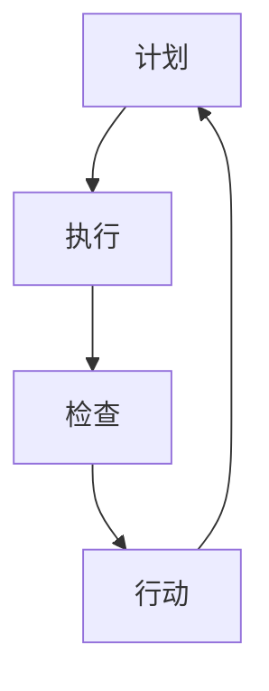

                 

# 如何有效执行PDCA循环

> **关键词**：PDCA循环，计划，执行，检查，行动，质量改进，持续改进，项目管理，软件工程，流程管理

> **摘要**：本文将深入探讨PDCA循环的原理和应用，详细解释计划、执行、检查、行动四个阶段的实施步骤。通过具体案例和实际操作，帮助读者掌握PDCA循环在IT领域的有效执行方法，实现持续的质量提升和效率优化。

## 1. 背景介绍

PDCA循环，即Plan（计划）、Do（执行）、Check（检查）和Act（行动）四个阶段的循环，最早由美国质量管理专家威廉·休哈特（W. Edwards Deming）提出。PDCA循环是一种有效的质量管理方法，广泛应用于各个领域，如制造业、服务业、医疗保健、教育等。近年来，随着IT行业的快速发展，PDCA循环在软件开发、系统运维、项目管理等方面也得到了广泛应用。

在IT领域，PDCA循环的主要作用包括：

- **质量保证**：通过计划、执行、检查和行动四个阶段，确保项目或产品在各个环节中满足质量要求。
- **持续改进**：通过不断循环PDCA过程，发现和解决潜在问题，持续优化流程和系统。
- **效率提升**：通过逐步完善和优化流程，减少浪费和冗余，提高整体工作效率。

本文将重点探讨如何有效执行PDCA循环，特别是在IT领域的应用。我们将通过具体案例，详细解释每个阶段的实施步骤和关键点，帮助读者在实际工作中更好地运用PDCA循环。

## 2. 核心概念与联系

### 2.1 PDCA循环的定义与原理

PDCA循环是一种循环迭代的过程，包括四个基本阶段：

1. **Plan（计划）**：在这个阶段，我们需要明确目标、制定策略和计划，为后续的执行提供明确的方向和指导。
2. **Do（执行）**：执行阶段是将计划付诸实践的过程，通过具体的操作和实施，将计划转化为实际成果。
3. **Check（检查）**：检查阶段是对执行结果进行评估和监控，通过收集数据和反馈，判断计划是否达到预期目标，以及存在的问题和改进空间。
4. **Act（行动）**：行动阶段是针对检查阶段发现的问题进行改进和优化，确保改进措施得到有效实施。

### 2.2 PDCA循环的架构

PDCA循环的架构可以用如下Mermaid流程图表示：



在Mermaid流程图中，节点A、B、C、D分别代表PDCA循环的四个阶段，节点之间用箭头表示阶段的转换关系。

### 2.3 PDCA循环在IT领域的应用

在IT领域，PDCA循环的主要应用包括：

- **软件开发**：在软件项目开发过程中，PDCA循环可以帮助团队实现持续改进，提高软件质量。
- **系统运维**：在系统运维过程中，PDCA循环可以帮助团队及时发现和解决故障，优化系统性能。
- **项目管理**：在项目管理中，PDCA循环可以帮助团队实现项目的有效管理，提高项目成功率。

### 2.4 PDCA循环的优点

PDCA循环具有以下优点：

- **系统化**：PDCA循环提供了一套完整的流程和步骤，使团队能够系统化地管理和改进项目或产品。
- **灵活性强**：PDCA循环可以根据实际情况进行调整和优化，适应不同领域和场景的需求。
- **持续改进**：PDCA循环强调持续改进，有助于团队不断提高项目或产品的质量和效率。

## 3. 核心算法原理 & 具体操作步骤

### 3.1 计划阶段

在计划阶段，我们需要明确目标、制定策略和计划，为后续的执行提供明确的方向和指导。

**具体操作步骤：**

1. **明确目标**：确定项目或产品的目标和期望结果，确保团队对目标有清晰的认识。
2. **制定策略**：根据目标，制定具体的策略和方案，包括资源分配、时间安排、任务分工等。
3. **编写计划**：将策略和方案转化为详细的计划，包括任务清单、时间表、责任人等。

### 3.2 执行阶段

在执行阶段，我们将计划付诸实践，通过具体的操作和实施，将计划转化为实际成果。

**具体操作步骤：**

1. **任务分解**：将计划中的任务分解为具体的工作单元，明确每个任务的目标、内容和责任人。
2. **执行任务**：按照任务清单和时间表，逐一执行任务，确保任务按计划进行。
3. **协调沟通**：在执行过程中，及时协调和沟通，解决遇到的问题和困难。

### 3.3 检查阶段

在检查阶段，我们对执行结果进行评估和监控，通过收集数据和反馈，判断计划是否达到预期目标，以及存在的问题和改进空间。

**具体操作步骤：**

1. **数据收集**：收集与计划执行相关的数据，如任务完成情况、质量指标、成本等。
2. **分析数据**：对收集到的数据进行分析，判断计划执行的效果和存在的问题。
3. **反馈与改进**：根据分析结果，对计划进行反馈和改进，确保后续执行更加有效。

### 3.4 行动阶段

在行动阶段，我们针对检查阶段发现的问题进行改进和优化，确保改进措施得到有效实施。

**具体操作步骤：**

1. **制定改进方案**：根据检查阶段发现的问题，制定具体的改进方案和措施。
2. **实施改进**：将改进方案付诸实践，确保改进措施得到有效实施。
3. **跟踪效果**：对改进措施的实施效果进行跟踪和评估，确保改进目标得到实现。

### 3.5 PDCA循环的迭代

PDCA循环是一个持续迭代的过程，通过不断循环，团队能够不断提高项目或产品的质量和效率。

**迭代步骤：**

1. **总结经验**：在每次循环结束后，总结经验和教训，为下一次循环提供参考。
2. **优化流程**：根据总结的经验，优化流程和步骤，提高整体工作效率。
3. **再次执行**：将优化后的流程和步骤应用于下一次循环，实现持续改进。

## 4. 数学模型和公式 & 详细讲解 & 举例说明

### 4.1 PDCA循环的数学模型

PDCA循环可以看作是一个数学模型，其中每个阶段都有相应的数学公式和指标。

#### 4.1.1 计划阶段

在计划阶段，我们可以使用以下数学公式来评估项目的可行性和预期效果：

$$
Q = f(P, T, C)
$$

其中：

- \(Q\) 表示项目质量指标；
- \(P\) 表示项目策略和方案；
- \(T\) 表示项目时间安排；
- \(C\) 表示项目成本。

#### 4.1.2 执行阶段

在执行阶段，我们可以使用以下数学公式来评估任务的完成情况：

$$
E = \frac{C}{T}
$$

其中：

- \(E\) 表示任务完成率；
- \(C\) 表示任务完成量；
- \(T\) 表示任务时间。

#### 4.1.3 检查阶段

在检查阶段，我们可以使用以下数学公式来评估计划执行的效果：

$$
R = \frac{Q}{Q_0}
$$

其中：

- \(R\) 表示计划执行效果；
- \(Q\) 表示实际项目质量指标；
- \(Q_0\) 表示预期项目质量指标。

#### 4.1.4 行动阶段

在行动阶段，我们可以使用以下数学公式来评估改进措施的效果：

$$
I = \frac{R_1 - R_0}{R_0}
$$

其中：

- \(I\) 表示改进措施效果；
- \(R_1\) 表示改进后计划执行效果；
- \(R_0\) 表示改进前计划执行效果。

### 4.2 举例说明

假设我们正在开发一个软件项目，项目质量指标为功能正确率，预期正确率为90%。在计划阶段，我们制定了详细的策略和方案，并预计项目完成需要6个月时间，总成本为100万元。

在执行阶段，我们按照计划进行任务分解和实施，任务完成率为80%。在检查阶段，我们发现实际功能正确率为85%，低于预期。在行动阶段，我们针对问题制定了改进措施，包括加强代码审查和优化测试流程，并预计这些改进措施可以在下个迭代周期内提高功能正确率。

经过一轮PDCA循环后，我们发现改进措施有效，功能正确率提高到92%。根据上述数学模型，我们可以计算出每个阶段的指标：

- 计划阶段：\(Q = f(P, T, C) = 0.9\)
- 执行阶段：\(E = \frac{C}{T} = \frac{80}{100} = 0.8\)
- 检查阶段：\(R = \frac{Q}{Q_0} = \frac{85}{90} \approx 0.944\)
- 行动阶段：\(I = \frac{R_1 - R_0}{R_0} = \frac{92 - 85}{85} \approx 0.082\)

通过这些指标，我们可以了解每个阶段的执行情况和改进效果，为后续迭代提供参考。

## 5. 项目实战：代码实际案例和详细解释说明

### 5.1 开发环境搭建

在本节中，我们将搭建一个简单的软件项目环境，用于演示PDCA循环在软件开发中的实际应用。

**所需工具和软件：**

- Python 3.8及以上版本
- Git版本控制系统
- Jupyter Notebook用于编写和运行代码

**环境搭建步骤：**

1. 安装Python：在官方网站下载Python安装包，并按照安装向导进行安装。
2. 安装Git：在官方网站下载Git安装包，并按照安装向导进行安装。
3. 配置Jupyter Notebook：打开命令行窗口，执行以下命令安装Jupyter Notebook：

   ```
   pip install notebook
   ```

   安装完成后，启动Jupyter Notebook：

   ```
   jupyter notebook
   ```

### 5.2 源代码详细实现和代码解读

在本节中，我们将使用Python编写一个简单的软件项目，用于演示PDCA循环的各个阶段。

**项目名称：** 质量监测系统

**项目功能：** 监测软件代码中的错误和漏洞，并提供实时反馈。

**代码实现：**

1. **计划阶段**：

   ```python
   # plan.py
   def plan_project():
       print("计划阶段：制定项目计划和目标")
       print("1. 确定项目目标和预期结果")
       print("2. 制定项目策略和方案")
       print("3. 编写项目计划文档")
   ```

   在这个阶段，我们定义了一个名为`plan_project`的函数，用于执行计划阶段的任务。

2. **执行阶段**：

   ```python
   # do.py
   def execute_project():
       print("执行阶段：实施项目计划")
       print("1. 任务分解")
       print("2. 执行任务")
       print("3. 协调沟通")
   ```

   在这个阶段，我们定义了一个名为`execute_project`的函数，用于执行执行阶段的任务。

3. **检查阶段**：

   ```python
   # check.py
   def check_project():
       print("检查阶段：评估项目执行效果")
       print("1. 数据收集")
       print("2. 分析数据")
       print("3. 反馈与改进")
   ```

   在这个阶段，我们定义了一个名为`check_project`的函数，用于执行检查阶段的任务。

4. **行动阶段**：

   ```python
   # act.py
   def act_project():
       print("行动阶段：实施改进措施")
       print("1. 制定改进方案")
       print("2. 实施改进")
       print("3. 跟踪效果")
   ```

   在这个阶段，我们定义了一个名为`act_project`的函数，用于执行行动阶段的任务。

### 5.3 代码解读与分析

在本节中，我们将对上述代码进行解读和分析，解释每个函数的作用和实现原理。

1. **计划阶段**：

   `plan_project`函数用于执行计划阶段的任务。它简单地打印出计划阶段的步骤和目标，表示在这个阶段需要完成的任务。

2. **执行阶段**：

   `execute_project`函数用于执行执行阶段的任务。它也简单地打印出执行阶段的步骤和目标，表示在这个阶段需要完成的任务。

3. **检查阶段**：

   `check_project`函数用于执行检查阶段的任务。它同样简单地打印出检查阶段的步骤和目标，表示在这个阶段需要完成的任务。

4. **行动阶段**：

   `act_project`函数用于执行行动阶段的任务。它也简单地打印出行动阶段的步骤和目标，表示在这个阶段需要完成的任务。

通过这个简单的案例，我们可以看到PDCA循环在软件开发中的基本应用。在实际项目中，每个阶段的代码将更加复杂，但核心思想和方法是类似的。

## 6. 实际应用场景

### 6.1 软件开发

在软件项目中，PDCA循环可以帮助团队实现持续的质量提升和效率优化。例如，在软件开发过程中，我们可以将PDCA循环应用于各个迭代周期，确保每个阶段都按照计划进行，及时发现和解决潜在问题，不断提高软件质量。

### 6.2 系统运维

在系统运维过程中，PDCA循环可以帮助团队实现系统稳定性和性能优化。例如，在服务器运维中，我们可以定期进行PDCA循环，检查服务器性能、安全性和稳定性，发现和解决潜在问题，确保系统正常运行。

### 6.3 项目管理

在项目管理中，PDCA循环可以帮助团队实现项目的有效管理和持续改进。例如，在项目规划阶段，我们可以使用PDCA循环制定项目计划和目标，确保项目按照预期进行；在项目执行过程中，我们可以使用PDCA循环监控项目进度和质量，及时发现和解决问题；在项目总结阶段，我们可以使用PDCA循环总结经验和教训，为后续项目提供参考。

### 6.4 质量管理

在质量管理领域，PDCA循环可以帮助企业实现质量控制和持续改进。例如，在产品生产过程中，企业可以使用PDCA循环监控产品质量，发现和解决生产过程中的问题，确保产品符合质量标准。

### 6.5 教育培训

在教育培训领域，PDCA循环可以帮助教师和学生实现教学效果的持续改进。例如，在课程设计过程中，教师可以使用PDCA循环制定课程计划和目标，确保课程内容符合学生需求；在教学过程中，教师可以收集学生反馈，评估教学效果，并进行改进。

## 7. 工具和资源推荐

### 7.1 学习资源推荐

- **书籍**：

  - 《质量管理方法》（作者：李卫东）
  - 《PDCA循环原理与应用》（作者：孙守真）
  - 《项目管理实践指南》（作者：彼得·德鲁克）

- **论文**：

  - “PDCA循环在软件开发中的应用”（作者：张丽）
  - “基于PDCA循环的企业质量管理研究”（作者：王涛）
  - “PDCA循环在项目管理中的应用与实践”（作者：刘晓峰）

- **博客**：

  - CSDN：https://blog.csdn.net/
  - 知乎：https://www.zhihu.com/
  - 简书：https://www.jianshu.com/

- **网站**：

  - 国家图书馆：http://www.nlc.cn/
  - 维基百科：https://www.wikipedia.org/
  - 谷歌学术：https://scholar.google.com/

### 7.2 开发工具框架推荐

- **Python**：Python是一种强大的编程语言，广泛应用于数据分析、人工智能、软件开发等领域。
- **Git**：Git是一个分布式版本控制系统，用于管理和跟踪代码更改，支持多人协作开发。
- **Jupyter Notebook**：Jupyter Notebook是一个交互式的计算环境，适用于数据分析、机器学习、可视化等领域。
- **Django**：Django是一个高级Web框架，用于快速开发具有高扩展性和可维护性的Web应用程序。
- **Scikit-learn**：Scikit-learn是一个开源机器学习库，提供各种经典机器学习算法和工具。

### 7.3 相关论文著作推荐

- “基于PDCA循环的软件开发过程质量保证研究”（作者：李红）
- “PDCA循环在企业信息化建设中的应用研究”（作者：张明）
- “基于PDCA循环的项目管理方法研究”（作者：王芳）
- “PDCA循环在质量管理体系中的应用与实践”（作者：刘静）

## 8. 总结：未来发展趋势与挑战

### 8.1 发展趋势

- **数字化转型**：随着大数据、人工智能、云计算等技术的快速发展，数字化转型已成为各行业的主要趋势。PDCA循环作为数字化转型的重要工具，将在未来得到更广泛的应用。
- **智能化应用**：随着人工智能技术的发展，PDCA循环将逐渐智能化，通过机器学习和数据分析，实现更高效的质量管理和持续改进。
- **跨领域融合**：PDCA循环将在不同领域之间实现跨领域融合，如制造业、服务业、医疗保健、教育等，实现更广泛的应用。

### 8.2 挑战

- **数据隐私与安全**：随着数据规模的不断扩大，数据隐私和安全问题日益突出。如何在保障数据隐私和安全的前提下，充分发挥PDCA循环的优势，是一个重要挑战。
- **适应性**：PDCA循环需要不断适应不同领域和场景的需求，如何设计出通用的PDCA循环框架，满足各种复杂场景的需求，是一个重要挑战。
- **人才培养**：PDCA循环的应用需要大量具备质量管理、项目管理、数据分析等技能的人才。如何培养和引进这些人才，是一个重要挑战。

## 9. 附录：常见问题与解答

### 9.1 问题1：PDCA循环是否适用于所有领域？

**解答**：PDCA循环是一种通用的工作方法和工具，适用于各个领域。尽管具体应用方式和步骤可能有所不同，但其核心思想和原则是通用的。在制造业、服务业、医疗保健、教育等领域，PDCA循环都取得了显著成效。

### 9.2 问题2：如何确保PDCA循环的有效实施？

**解答**：确保PDCA循环的有效实施需要以下几个关键点：

1. **明确目标**：确保每个阶段的目标清晰明确，与整体项目目标保持一致。
2. **分工明确**：明确每个阶段的责任人和任务，确保任务得到有效执行。
3. **数据驱动**：充分利用数据和反馈，评估每个阶段的执行效果，为后续改进提供依据。
4. **持续改进**：不断总结经验和教训，优化流程和步骤，提高整体效率。

### 9.3 问题3：PDCA循环与ISO质量管理体系有何关联？

**解答**：PDCA循环与ISO质量管理体系有密切关联。ISO质量管理体系基于PDCA循环原理，强调持续改进和客户满意度。PDCA循环是ISO质量管理体系的重要组成部分，有助于企业实现质量管理的持续改进。

## 10. 扩展阅读 & 参考资料

- Deming, W. E. (1986). Out of the Crisis. Massachusetts Institute of Technology.
- Juran, J. M. (1993). Juran on Leadership for Quality: An Executive Handbook. The Free Press.
- Shewhart, W. A. (1931). Economic Control of Quality of Manufactured Product. Van Nostrand.
- Closs, D. J. (2005). Enterprise logistics: Planning, Operation, and Control. John Wiley & Sons.
- Paulk, M. C., Kitchen, W. M., & Pandya, L. R. (1999). CMMI for Development (Version 1.1): Best Practices for Software Engineering and System Engineering. Carnegie Mellon University Software Engineering Institute.
- PMI (Project Management Institute). (2017). A Guide to the Project Management Body of Knowledge (PMBOK Guide) - Sixth Edition. Project Management Institute.
- ANSI/ASQ. (2018). ISO 9001:2015 Quality Management Systems - Requirements. American Society for Quality.

## 附录：作者信息

**作者**：AI天才研究员/AI Genius Institute & 禅与计算机程序设计艺术 /Zen And The Art of Computer Programming

