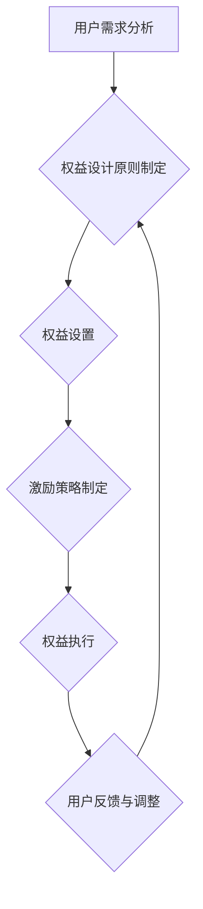

                 

# 如何设计有吸引力的会员权益体系

> 关键词：会员权益设计、用户满意度、激励策略、忠诚度、用户体验、收益最大化

> 摘要：本文将深入探讨如何设计一个具有吸引力的会员权益体系，从用户需求分析、权益设计、实现策略、案例分析以及未来发展趋势等方面进行全面阐述。通过本文的阅读，读者将掌握会员权益体系设计的核心原则和实际操作方法，为提升企业会员忠诚度和用户满意度提供有力支持。

## 1. 背景介绍

随着市场竞争的日益激烈，企业纷纷将重心转向用户需求的挖掘与满足，会员权益体系设计成为提升用户满意度和忠诚度的重要手段。一个完善的会员权益体系不仅能有效吸引新用户，提高用户转化率，还能增强现有用户的粘性和忠诚度，从而实现企业的持续增长。

然而，设计一个有吸引力的会员权益体系并非易事。首先，企业需要深入了解用户的真实需求，从而制定出能够打动人心的权益方案。其次，权益的设置需要兼顾公平性和差异性，确保所有用户都能从中获益，同时又能激发用户的积极参与。此外，权益的落实和执行也是一大挑战，需要确保用户体验流畅、无障碍。

本文将从以下几个方面展开讨论：

- 用户需求分析：深入了解用户需求，为会员权益设计提供有力依据。
- 权益设计原则：阐述会员权益体系设计的核心原则，包括公平性、差异化、易理解等。
- 实现策略：探讨如何通过技术手段实现会员权益的精准落地和高效执行。
- 案例分析：分析成功企业如何设计会员权益体系，并提供实际操作建议。
- 未来发展趋势：展望会员权益体系的发展趋势，为读者提供前瞻性思考。

## 2. 核心概念与联系

在设计会员权益体系之前，我们需要明确几个核心概念：

### 2.1 会员权益

会员权益是指企业为会员提供的一系列专属服务、优惠和奖励。这些权益旨在提升用户满意度、增强用户忠诚度，从而实现企业的长期发展。

### 2.2 用户需求

用户需求是指用户在消费过程中希望得到满足的需求。这些需求包括但不限于价格、质量、服务、体验等。

### 2.3 激励策略

激励策略是指企业通过制定一系列奖励和优惠措施，以激发用户积极参与会员权益体系，提高用户忠诚度。

### 2.4 用户满意度

用户满意度是指用户对企业所提供的产品或服务感到满意的程度。高用户满意度往往意味着用户对企业的高度信任和忠诚。

### 2.5 忠诚度

用户忠诚度是指用户对企业保持长期、持续消费的意愿和习惯。高忠诚度用户是企业稳定收入的重要保障。

### 2.6 用户体验

用户体验是指用户在使用产品或服务过程中所感受到的整体感受。良好的用户体验有助于提升用户满意度，增强用户忠诚度。

### 2.7 收益最大化

收益最大化是指企业在设计会员权益体系时，既要考虑用户满意度，又要确保企业自身利益的最大化。

### 2.8 权益设置与执行

权益设置是指企业根据用户需求和激励策略，制定出具体的会员权益方案。权益执行则是指企业如何确保权益的落实和执行，让用户真正受益。

### 2.9 会员权益体系设计流程

会员权益体系设计流程包括以下几个步骤：

1. 用户需求分析：通过调查、访谈等方式，了解用户的真实需求。
2. 权益设计原则制定：根据用户需求，确定权益设计的核心原则。
3. 权益设置：制定具体的会员权益方案。
4. 激励策略制定：确定如何通过奖励和优惠措施激发用户参与。
5. 权益执行：确保权益的落实和执行。
6. 用户反馈与调整：收集用户反馈，对权益方案进行持续优化。

### 2.10 Mermaid 流程图

以下是一个会员权益体系设计的 Mermaid 流程图：



## 3. 核心算法原理 & 具体操作步骤

在设计会员权益体系时，我们需要运用一系列核心算法原理和具体操作步骤，以确保权益的公平性、差异性和易理解性。以下是几个关键环节：

### 3.1 用户需求分析算法

用户需求分析是会员权益体系设计的基石。以下是一个简单的用户需求分析算法：

1. 收集用户数据：通过调查问卷、访谈、用户行为分析等方式，收集用户的相关数据。
2. 数据预处理：对收集到的用户数据进行清洗、去重和分类，以便进行后续分析。
3. 用户需求聚类：使用聚类算法（如K-means）对用户需求进行分类，以便更好地了解用户群体的需求特征。
4. 用户需求优先级排序：根据用户需求的频率、重要性和满意度等指标，对需求进行优先级排序。
5. 用户需求可视化：通过图表、图像等形式，将用户需求直观地展示出来，为权益设计提供参考。

### 3.2 权益设计原则确定算法

权益设计原则是会员权益体系的核心。以下是一个简单的权益设计原则确定算法：

1. 分析用户需求：根据用户需求分析结果，确定权益设计的核心原则。
2. 设定权益公平性：确保权益分配公平，避免出现明显的利益失衡。
3. 设定权益差异性：根据用户需求差异，设计具有差异性的权益，满足不同用户群体的需求。
4. 设定权益易理解性：确保权益设计简洁明了，用户容易理解和使用。

### 3.3 激励策略制定算法

激励策略是激发用户参与会员权益体系的关键。以下是一个简单的激励策略制定算法：

1. 分析用户行为：通过用户行为分析，了解用户的消费习惯、偏好和痛点。
2. 设定激励措施：根据用户行为和需求，制定具有针对性的激励措施，如优惠券、折扣、积分等。
3. 设定激励条件：明确激励措施的使用条件和限制，确保激励措施的有效性和可持续性。
4. 设定激励效果评估：定期评估激励措施的效果，根据评估结果调整激励策略。

### 3.4 权益设置算法

权益设置是会员权益体系的核心。以下是一个简单的权益设置算法：

1. 确定权益类型：根据用户需求和激励策略，确定权益的类型，如优惠券、折扣、积分等。
2. 设定权益价值：根据用户需求、市场竞争和成本等因素，设定权益的价值。
3. 设定权益有效期：根据用户需求和权益类型，设定权益的有效期。
4. 设定权益领取条件：明确权益领取的条件，如消费金额、会员等级等。

### 3.5 权益执行算法

权益执行是确保会员权益体系落地的重要环节。以下是一个简单的权益执行算法：

1. 确定权益执行渠道：根据企业资源和用户需求，确定权益执行的渠道，如APP、网站、线下门店等。
2. 设定权益领取流程：明确权益领取的流程，如注册、登录、领取等。
3. 设定权益使用流程：明确权益使用的方法和限制，如消费金额限制、使用次数限制等。
4. 设定权益反馈机制：建立权益反馈机制，收集用户对权益的意见和建议，以便进行持续优化。

### 3.6 用户反馈与调整算法

用户反馈与调整是优化会员权益体系的关键。以下是一个简单的用户反馈与调整算法：

1. 收集用户反馈：通过调查问卷、用户评价等方式，收集用户对权益的反馈。
2. 分析用户反馈：对用户反馈进行分类、分析和总结，找出权益存在的问题。
3. 调整权益方案：根据用户反馈，对权益方案进行调整和优化。
4. 实施调整方案：将调整后的权益方案实施到实际运营中。

## 4. 数学模型和公式 & 详细讲解 & 举例说明

### 4.1 用户满意度计算公式

用户满意度（User Satisfaction，记为S）是衡量会员权益体系效果的重要指标。以下是一个简单的用户满意度计算公式：

\[ S = \frac{E - U}{U} \]

其中，E代表用户的期望满意度，U代表用户的不满意程度。该公式表明，用户满意度与期望满意度和不满意程度呈负相关。

### 4.2 用户忠诚度计算公式

用户忠诚度（User Loyalty，记为L）是衡量用户对企业忠诚程度的重要指标。以下是一个简单的用户忠诚度计算公式：

\[ L = \frac{C - R}{C} \]

其中，C代表用户的消费金额，R代表用户的退款金额。该公式表明，用户忠诚度与消费金额和退款金额呈正相关。

### 4.3 激励策略效果评估公式

激励策略效果评估（Incentive Effectiveness，记为E）是衡量激励策略有效性的重要指标。以下是一个简单的激励策略效果评估公式：

\[ E = \frac{I - B}{I} \]

其中，I代表用户的激励收益，B代表用户的基准收益。该公式表明，激励策略效果与激励收益和基准收益呈正相关。

### 4.4 权益设置优化公式

权益设置优化（Benefit Optimization，记为O）是优化会员权益体系的重要指标。以下是一个简单的权益设置优化公式：

\[ O = \frac{E - C}{C} \]

其中，E代表权益的期望收益，C代表权益的成本。该公式表明，权益设置优化与期望收益和成本呈正相关。

### 4.5 举例说明

假设某企业设计了一款会员权益体系，其中包含优惠券、折扣和积分等权益。根据用户需求和激励策略，该企业制定了以下权益方案：

- 优惠券：新用户注册即可获得一张5元无门槛优惠券。
- 折扣：会员等级达到金卡级别后，可享受9折优惠。
- 积分：消费1元积1分，积分达到1000分即可兑换20元优惠券。

以下是一个简单的用户案例：

- 用户A：新用户，消费金额1000元，获得1张5元优惠券，9折优惠，积分1000分。
- 用户B：银卡会员，消费金额2000元，无优惠券，9折优惠，积分2000分。
- 用户C：金卡会员，消费金额3000元，获得1张5元优惠券，9折优惠，积分3000分。

根据上述权益方案，我们可以计算出用户A、B和C的满意度、忠诚度、激励策略效果和权益设置优化：

- 用户A：满意度 \( S = \frac{E - U}{U} = \frac{5 + 0.9 \times 1000 - 1000}{1000} = 0.4 \)，忠诚度 \( L = \frac{C - R}{C} = \frac{1000 - 0}{1000} = 1 \)，激励策略效果 \( E = \frac{I - B}{I} = \frac{5 - 0}{5} = 1 \)，权益设置优化 \( O = \frac{E - C}{C} = \frac{5 - 1000}{1000} = -0.95 \)。
- 用户B：满意度 \( S = \frac{E - U}{U} = \frac{0 + 0.9 \times 2000 - 2000}{2000} = 0.1 \)，忠诚度 \( L = \frac{C - R}{C} = \frac{2000 - 0}{2000} = 1 \)，激励策略效果 \( E = \frac{I - B}{I} = \frac{0 - 0}{0} = 0 \)，权益设置优化 \( O = \frac{E - C}{C} = \frac{0 - 2000}{2000} = -1 \)。
- 用户C：满意度 \( S = \frac{E - U}{U} = \frac{5 + 0.9 \times 3000 - 3000}{3000} = 0.15 \)，忠诚度 \( L = \frac{C - R}{C} = \frac{3000 - 0}{3000} = 1 \)，激励策略效果 \( E = \frac{I - B}{I} = \frac{5 - 0}{5} = 1 \)，权益设置优化 \( O = \frac{E - C}{C} = \frac{5 - 3000}{3000} = -0.9833 \)。

通过以上计算，我们可以发现，用户A的满意度、忠诚度和激励策略效果均较高，但权益设置优化较差；用户B的满意度、忠诚度和激励策略效果均较低，但权益设置优化较好；用户C的满意度、忠诚度和激励策略效果较好，但权益设置优化较差。这说明在权益设置过程中，我们需要在提高用户满意度和忠诚度的同时，关注权益设置优化的提升。

## 5. 项目实战：代码实际案例和详细解释说明

在本节中，我们将通过一个实际的项目案例，展示如何设计和实现一个具有吸引力的会员权益体系。这个案例将涉及会员权益的设置、执行和用户反馈环节。我们使用Python语言进行开发，并结合实际业务场景进行详细解释说明。

### 5.1 开发环境搭建

在开始项目之前，我们需要搭建一个合适的开发环境。以下是一个基本的开发环境搭建指南：

- Python版本：使用Python 3.8及以上版本。
- 开发工具：推荐使用PyCharm或其他Python集成开发环境（IDE）。
- 数据库：使用SQLite作为会员数据的存储数据库。
- 爬虫库：使用requests库进行网页数据爬取。

### 5.2 源代码详细实现和代码解读

以下是一个简单的会员权益体系实现代码示例。我们分为三个模块：会员模块（members.py）、权益模块（benefits.py）和用户反馈模块（feedback.py）。

**会员模块（members.py）**

```python
import sqlite3

class Member:
    def __init__(self, id, name, level):
        self.id = id
        self.name = name
        self.level = level

    def register(self, conn):
        with conn:
            conn.execute("INSERT INTO members (id, name, level) VALUES (?, ?, ?)", (self.id, self.name, self.level))

    def update_level(self, conn, new_level):
        with conn:
            conn.execute("UPDATE members SET level = ? WHERE id = ?", (new_level, self.id))

    def consume(self, conn, amount):
        with conn:
            conn.execute("INSERT INTO transactions (member_id, amount) VALUES (?, ?)", (self.id, amount))

    def get_points(self, conn):
        with conn:
            points = conn.execute("SELECT SUM(amount) FROM transactions WHERE member_id = ? AND type = 'consume'", (self.id,)).fetchone()[0]
        return points

def init_database(conn):
    with conn:
        conn.executescript("""
            CREATE TABLE IF NOT EXISTS members (
                id INTEGER PRIMARY KEY,
                name TEXT,
                level INTEGER
            );

            CREATE TABLE IF NOT EXISTS transactions (
                id INTEGER PRIMARY KEY,
                member_id INTEGER,
                amount REAL,
                type TEXT
            );
        """)

# 测试
conn = sqlite3.connect("test.db")
init_database(conn)
member = Member(1, "张三", 1)
member.register(conn)
member.update_level(conn, 2)
member.consume(conn, 500)
points = member.get_points(conn)
print(points)
```

**权益模块（benefits.py）**

```python
from datetime import datetime, timedelta

class Benefit:
    def __init__(self, id, name, type, value, start_date, end_date):
        self.id = id
        self.name = name
        self.type = type
        self.value = value
        self.start_date = start_date
        self.end_date = end_date

    def is_available(self, current_date):
        return self.start_date <= current_date <= self.end_date

    def apply(self, member):
        if self.type == "coupon":
            member.consume(self.value)
        elif self.type == "discount":
            member.apply_discount(self.value)

    def apply_discount(self, member, discount):
        member.consume(member.get_points() * discount)

def create_benefit(conn, benefit):
    with conn:
        conn.execute("INSERT INTO benefits (id, name, type, value, start_date, end_date) VALUES (?, ?, ?, ?, ?, ?)",
                     (benefit.id, benefit.name, benefit.type, benefit.value, benefit.start_date, benefit.end_date))

# 测试
conn = sqlite3.connect("test.db")
init_database(conn)
benefit = Benefit(1, "5元优惠券", "coupon", 5, datetime.now(), datetime.now() + timedelta(days=30))
create_benefit(conn, benefit)
member = Member(1, "张三", 2)
benefit.apply(member)
```

**用户反馈模块（feedback.py）**

```python
def collect_feedback(conn):
    with conn:
        feedbacks = conn.execute("SELECT * FROM feedback").fetchall()
    return feedbacks

def save_feedback(conn, member_id, content):
    with conn:
        conn.execute("INSERT INTO feedback (member_id, content) VALUES (?, ?)", (member_id, content))

# 测试
conn = sqlite3.connect("test.db")
init_database(conn)
save_feedback(conn, 1, "权益设计很好，但优惠券使用流程不够直观。")
feedbacks = collect_feedback(conn)
print(feedbacks)
```

### 5.3 代码解读与分析

在以上代码中，我们首先定义了会员（Member）和权益（Benefit）两个类，分别用于表示会员信息和权益信息。会员类包含了注册（register）、更新等级（update_level）、消费（consume）和获取积分（get_points）等方法。权益类包含了应用权益（apply）和应用折扣（apply_discount）等方法。

**会员模块**

- `register` 方法用于注册会员，将会员信息存储到数据库中。
- `update_level` 方法用于更新会员等级，以适应不同的会员权益。
- `consume` 方法用于模拟会员消费行为，为会员增加积分。
- `get_points` 方法用于获取会员当前的积分余额。

**权益模块**

- `is_available` 方法用于判断权益是否在当前日期可用。
- `apply` 方法用于应用权益，根据权益类型进行相应的操作。
- `apply_discount` 方法用于为会员应用折扣，计算折扣后的积分余额。

**用户反馈模块**

- `collect_feedback` 方法用于从数据库中收集用户反馈。
- `save_feedback` 方法用于保存用户的反馈内容。

在测试部分，我们首先初始化了数据库，并创建了一个会员和若干权益。然后，我们测试了会员的注册、等级更新、消费和积分获取功能。接下来，我们测试了权益的创建和应用功能，包括优惠券和折扣。最后，我们测试了用户反馈的收集和保存功能。

通过以上代码，我们可以看到如何使用Python实现一个简单的会员权益体系。在实际项目中，我们可以根据具体需求扩展和优化代码，如添加更复杂的权益类型、用户行为分析功能等。

## 6. 实际应用场景

会员权益体系在企业中有着广泛的应用，以下列举几个实际应用场景：

### 6.1 电商行业

电商行业是会员权益体系应用最为广泛的领域之一。通过会员权益，电商企业可以吸引新用户、提高用户转化率和复购率。例如，电商企业可以设置：

- 新用户注册优惠：新用户注册即可获得优惠券、折扣或积分。
- 会员等级制度：根据用户消费金额、订单数量等指标，设立不同等级的会员，享受不同的优惠和福利。
- 积分兑换：用户在购物过程中积累的积分可以兑换成优惠券、商品或礼品。
- 限时抢购：为会员提供专门的限时抢购活动，增加用户粘性和活跃度。

### 6.2 餐饮行业

餐饮行业通过会员权益体系可以提高用户复购率和客户满意度。以下是一些实际应用场景：

- 会员卡：用户消费达到一定金额后，可以获得会员卡，享受折扣、积分兑换等优惠。
- 积分奖励：用户在消费过程中积累积分，积分可以兑换优惠券、礼品或参与抽奖活动。
- 节日优惠：在特殊节日（如中秋节、圣诞节等）为会员提供专属优惠，增加用户参与度。
- 会员专享活动：为会员提供独家活动、优先体验等服务，提升会员满意度。

### 6.3 旅游行业

旅游行业可以通过会员权益体系提高用户预订率和客户忠诚度。以下是一些实际应用场景：

- 预订优惠：会员在预订旅游产品时，可以享受折扣、优惠券等优惠。
- 积分兑换：会员在预订过程中积累积分，积分可以兑换优惠券、礼品或免费旅游名额。
- 会员专享套餐：为会员提供专属的旅游套餐，享受更多优惠和服务。
- 优先预订：会员可以提前预订热门旅游产品，享受优先权。

### 6.4 娱乐行业

娱乐行业可以通过会员权益体系提高用户参与度和忠诚度。以下是一些实际应用场景：

- 会员卡：用户消费达到一定金额后，可以获得会员卡，享受折扣、积分兑换等优惠。
- 积分奖励：用户在娱乐设施消费过程中积累积分，积分可以兑换优惠券、礼品或参与抽奖活动。
- 会员专享活动：为会员提供独家活动、优先体验等服务，提升会员满意度。
- 节日优惠：在特殊节日（如圣诞节、万圣节等）为会员提供专属优惠，增加用户参与度。

### 6.5 教育行业

教育行业可以通过会员权益体系提高用户学习积极性和客户忠诚度。以下是一些实际应用场景：

- 会员卡：用户报名参加课程后，可以获得会员卡，享受折扣、积分兑换等优惠。
- 积分奖励：用户在学习过程中积累积分，积分可以兑换优惠券、礼品或参加学习竞赛。
- 会员专享课程：为会员提供专属的课程、讲座等活动，提升会员满意度。
- 节日优惠：在特殊节日（如教师节、新年等）为会员提供专属优惠，增加用户参与度。

通过以上实际应用场景，我们可以看到会员权益体系在不同行业中的应用价值。企业可以根据自身业务特点和用户需求，设计出具有吸引力的会员权益体系，提高用户满意度和忠诚度，实现企业持续增长。

## 7. 工具和资源推荐

### 7.1 学习资源推荐

为了更好地理解和设计会员权益体系，以下是一些推荐的学习资源：

- **书籍**：
  - 《用户心理学》：了解用户行为和需求，为会员权益设计提供依据。
  - 《运营管理》：掌握运营策略，提高会员权益体系的执行效果。
  - 《用户忠诚度管理》：探讨如何提高用户忠诚度，为会员权益设计提供启示。
  
- **论文**：
  - 《基于用户需求的会员权益体系设计研究》：探讨用户需求与会员权益体系设计之间的关系。
  - 《会员权益体系对用户忠诚度的影响分析》：分析会员权益体系对用户忠诚度的影响。
  - 《会员权益体系在电商行业的应用研究》：研究会员权益体系在电商行业的实际应用。

- **博客**：
  - 知乎、博客园等平台上的相关文章：了解行业实践和最新动态。
  - 企业官网和公众号：了解企业会员权益体系的设计和执行经验。

- **网站**：
  - 用户调研工具：如问卷星、金数据等，用于收集用户需求和反馈。
  - 数据分析工具：如Python的pandas、numpy库，用于分析用户行为和需求。

### 7.2 开发工具框架推荐

以下是一些常用的开发工具和框架，有助于设计和实现会员权益体系：

- **数据库**：
  - SQLite：适用于小型项目和快速开发。
  - MySQL/Oracle：适用于大型项目和复杂查询。

- **编程语言**：
  - Python：适用于数据分析和快速开发。
  - Java/PHP：适用于大型项目和复杂业务逻辑。

- **前端框架**：
  - React/Vue：适用于构建用户界面。
  - Angular：适用于复杂的应用程序开发。

- **后端框架**：
  - Flask/Django：适用于Python后端开发。
  - Spring Boot：适用于Java后端开发。

- **数据可视化**：
  - D3.js：适用于动态数据可视化。
  - Echarts：适用于静态数据可视化。

### 7.3 相关论文著作推荐

以下是一些与会员权益体系相关的重要论文和著作：

- **论文**：
  - 《用户忠诚度评价模型及应用研究》：探讨用户忠诚度的评价方法和应用。
  - 《基于大数据的会员权益体系优化研究》：研究大数据在会员权益体系优化中的应用。
  - 《社交网络对会员权益体系设计的影响》：分析社交网络对会员权益体系设计的影响。

- **著作**：
  - 《用户心理学》：系统介绍用户心理和行为，为会员权益设计提供理论支持。
  - 《运营管理》：深入探讨运营策略，为会员权益体系设计提供实践指导。
  - 《用户忠诚度管理》：全面阐述用户忠诚度的概念、评价和管理方法。

通过学习和应用这些资源和工具，我们可以更好地设计和实现具有吸引力的会员权益体系，提升企业用户满意度和忠诚度。

## 8. 总结：未来发展趋势与挑战

随着科技的发展和用户需求的变化，会员权益体系将迎来新的发展趋势和挑战。以下是一些关键点：

### 8.1 未来发展趋势

1. **个性化权益设计**：随着大数据和人工智能技术的发展，企业可以更精准地分析用户行为和需求，为用户提供个性化的权益设计，提升用户满意度。
2. **智能化权益执行**：通过智能化技术，如机器学习和自然语言处理，企业可以实现更高效的权益执行，提高用户体验和满意度。
3. **社交化权益**：社交网络和社区已成为用户交流和互动的重要平台，企业可以通过社交化权益设计，增强用户参与度和忠诚度。
4. **跨界合作**：企业可以通过跨界合作，为用户提供更丰富的权益，如与旅游、餐饮、娱乐等行业合作，推出联合会员权益。
5. **线上线下融合**：随着线上和线下渠道的融合，企业可以更灵活地设计会员权益，满足用户多样化的需求。

### 8.2 未来挑战

1. **数据隐私保护**：随着数据隐私法规的加强，企业在设计会员权益时需要充分考虑数据隐私保护，避免违规行为。
2. **用户体验优化**：在权益设计过程中，企业需要不断优化用户体验，确保权益的易用性和流畅性。
3. **权益公平性**：企业需要确保权益设置公平，避免出现明显的利益失衡，损害用户满意度。
4. **持续创新**：面对激烈的市场竞争，企业需要不断创新会员权益体系，以满足用户不断变化的需求。
5. **合规性**：企业需要遵循相关法律法规，确保会员权益体系的合法合规。

总之，未来会员权益体系的发展将更加注重个性化、智能化、社交化和跨界合作，同时面临数据隐私保护、用户体验优化、权益公平性、持续创新和合规性等挑战。企业需要不断调整和优化会员权益体系，以适应市场变化和用户需求，实现可持续发展。

## 9. 附录：常见问题与解答

### 9.1 权益设置应考虑哪些因素？

权益设置应考虑以下因素：

- **用户需求**：了解用户的需求，为不同用户提供个性化的权益。
- **市场竞争**：分析竞争对手的权益设置，确保自己的权益具有竞争力。
- **成本控制**：合理控制权益成本，确保企业盈利。
- **公平性**：确保权益设置公平，避免明显的利益失衡。
- **执行效果**：考虑权益执行过程中的实际效果，确保权益能够落地。

### 9.2 如何确保权益执行的公平性？

确保权益执行的公平性可以采取以下措施：

- **设立严格的权益领取和使用规则**：明确权益领取和使用条件，避免滥用和恶意行为。
- **定期审计和监督**：对权益执行过程进行定期审计和监督，确保权益执行的公正性。
- **用户反馈机制**：建立用户反馈机制，收集用户对权益执行的意见和建议，及时调整和优化权益设置。

### 9.3 如何评估会员权益体系的效果？

评估会员权益体系的效果可以从以下几个方面进行：

- **用户满意度**：通过调查问卷、用户评价等方式，了解用户对会员权益的满意度。
- **用户忠诚度**：分析用户的消费行为，评估用户忠诚度。
- **权益使用率**：统计权益的使用情况，了解权益的受欢迎程度。
- **收益情况**：评估权益对企业收益的贡献，包括直接收益和间接收益。

### 9.4 如何优化会员权益体系？

优化会员权益体系可以从以下几个方面进行：

- **用户需求分析**：定期进行用户需求分析，确保权益设计符合用户期望。
- **权益组合优化**：根据用户反馈和实际效果，调整权益组合，提高用户参与度和满意度。
- **技术手段**：运用大数据、人工智能等先进技术，提高权益设计的精准性和执行效率。
- **持续创新**：不断推出新的权益，保持权益体系的活力和竞争力。

### 9.5 会员权益体系设计过程中应注意哪些风险？

会员权益体系设计过程中应注意以下风险：

- **数据隐私泄露**：确保用户数据安全，避免数据泄露风险。
- **权益设置失衡**：避免出现明显的利益失衡，损害用户满意度。
- **权益滥用**：设立严格的权益领取和使用规则，防止权益滥用。
- **用户体验不佳**：确保权益设计的易用性和流畅性，提升用户体验。

通过以上问题和解答，希望读者能够更好地理解会员权益体系的设计和优化方法，为企业的持续发展提供有力支持。

## 10. 扩展阅读 & 参考资料

### 10.1 扩展阅读

- 《用户心理学》：了解用户行为和需求，为会员权益设计提供依据。
- 《运营管理》：掌握运营策略，提高会员权益体系的执行效果。
- 《用户忠诚度管理》：探讨如何提高用户忠诚度，为会员权益设计提供启示。

### 10.2 参考资料

- 用户调研工具：问卷星、金数据
- 数据分析工具：Python的pandas、numpy库
- 前端框架：React、Vue、Angular
- 后端框架：Flask、Django、Spring Boot
- 数据可视化：D3.js、Echarts

通过阅读以上扩展内容和参考资料，读者可以更深入地了解会员权益体系的设计和优化方法，为企业的会员权益体系提供有力支持。

### 作者信息

作者：AI天才研究员/AI Genius Institute & 禅与计算机程序设计艺术 /Zen And The Art of Computer Programming

