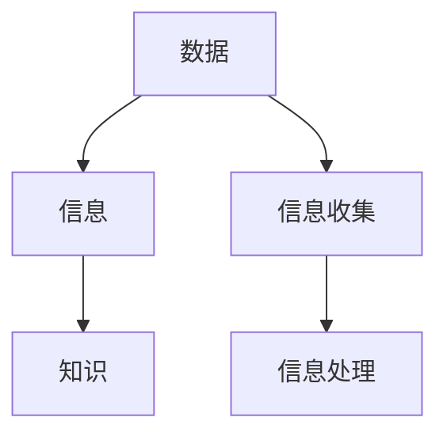

                 

# 如何进行信息收集：如何获取有效的信息和知识？

## 关键词：
- 信息收集
- 知识获取
- 有效信息
- 信息筛选
- 数据分析
- 学术研究

## 摘要：
本文旨在探讨如何进行有效的信息收集，以及如何从中获取高质量的知识。通过对信息收集的背景介绍、核心概念解析、算法原理讲解、数学模型应用、实战案例分析、实际应用场景分析、工具和资源推荐等多个维度的深入探讨，本文旨在为读者提供一套系统的信息收集方法论，帮助他们在信息爆炸的时代中，能够准确、高效地获取对自己有用的知识和信息。

## 1. 背景介绍

在当今信息爆炸的时代，每天都会产生大量的信息，从新闻报道、社交媒体、学术研究、政府公告到个人通讯，几乎无处不在。然而，并非所有信息都是有用的，甚至有些信息可能是误导性的、不准确或过时的。因此，如何从海量信息中筛选出对自己有用的部分，成为一个至关重要的能力。

信息收集不仅仅是为了满足好奇心或获取娱乐，它在学术研究、商业决策、个人学习等多个领域都有着广泛的应用。有效的信息收集能够帮助研究人员找到关键数据，帮助企业做出明智决策，帮助个人提升技能和知识水平。

本文将围绕如何进行有效的信息收集展开讨论，包括核心概念的解析、算法原理的讲解、数学模型的应用、实战案例的分析以及相关工具和资源的推荐。希望通过本文，读者能够掌握一套系统的信息收集方法，提升自身的信息处理能力。

### 2. 核心概念与联系

在进行信息收集之前，我们需要了解一些核心概念和它们之间的联系。以下是几个关键概念及其相互关系：

#### 2.1 信息与知识

- **信息**：信息是指以某种形式存在的，可以通过感知、处理和利用的数据。例如，一篇文章、一段视频、一份报告等都可以是信息。
- **知识**：知识是对信息进行整理、理解和应用的结果。它不仅仅是信息，更包含了我们对信息的理解和洞察。

#### 2.2 数据与信息

- **数据**：数据是信息的原始形式，通常是一些数字、文字、图像等。
- **信息**：信息是从数据中提取的有意义的内容。数据可以通过加工、分析转化为信息。

#### 2.3 信息收集与处理

- **信息收集**：是指通过各种渠道收集数据和信息的过程。
- **信息处理**：是指对收集到的信息进行筛选、分析、整合和应用的过程。

为了更好地理解这些概念，我们可以使用Mermaid流程图来展示它们之间的关系：



### 3. 核心算法原理 & 具体操作步骤

在进行信息收集的过程中，选择合适的方法和算法至关重要。以下是一些常用的核心算法原理及其具体操作步骤：

#### 3.1 信息筛选算法

- **原理**：信息筛选算法用于从大量数据中筛选出符合特定条件的信息。
- **步骤**：
  1. 定义筛选条件：根据需求确定哪些信息是有用的。
  2. 数据预处理：对原始数据进行清洗和标准化，使其符合筛选条件。
  3. 应用筛选条件：对预处理后的数据进行筛选，提取符合条件的信息。

#### 3.2 信息分析算法

- **原理**：信息分析算法用于对收集到的信息进行深入分析和挖掘。
- **步骤**：
  1. 数据整合：将来自不同渠道的信息进行整合，形成一个统一的数据集。
  2. 数据可视化：使用图表、图形等可视化工具，帮助理解和分析数据。
  3. 提取特征：从数据中提取关键特征，用于进一步分析。

#### 3.3 信息提取算法

- **原理**：信息提取算法用于从文本中提取出关键信息和关键词。
- **步骤**：
  1. 分词：将文本拆分成词或短语。
  2. 停用词过滤：去除常见的无意义词语，如“的”、“了”等。
  3. 词频统计：统计每个词语的出现次数。
  4. 关键词提取：根据词频和其他特征，提取出关键信息。

### 4. 数学模型和公式 & 详细讲解 & 举例说明

在信息收集过程中，数学模型和公式可以大大提升我们的分析能力和效率。以下是一些常用的数学模型和公式的讲解及其应用示例：

#### 4.1 相关性分析

- **公式**：皮尔逊相关系数（Pearson correlation coefficient）
  $$ r = \frac{\sum_{i=1}^{n}(x_i - \bar{x})(y_i - \bar{y})}{\sqrt{\sum_{i=1}^{n}(x_i - \bar{x})^2}\sqrt{\sum_{i=1}^{n}(y_i - \bar{y})^2}} $$
- **应用**：用于分析两个变量之间的线性关系。例如，分析某产品的销量与广告费用之间的关系。

#### 4.2 回归分析

- **公式**：线性回归模型（Linear Regression）
  $$ y = \beta_0 + \beta_1x + \epsilon $$
- **应用**：用于预测某个变量基于另一个变量的值。例如，预测股票价格基于历史数据。

#### 4.3 聚类分析

- **公式**：K-means聚类算法
  1. 初始化K个聚类中心。
  2. 计算每个数据点到聚类中心的距离。
  3. 将每个数据点分配给最近的聚类中心。
  4. 重新计算每个聚类中心。
  5. 重复步骤2-4，直到聚类中心不再发生变化。
- **应用**：用于将数据划分为若干个聚类，便于进一步分析。例如，将用户划分为不同的群体。

### 5. 项目实战：代码实际案例和详细解释说明

为了更好地理解信息收集的方法和算法，我们将通过一个实际项目案例来演示如何使用Python进行信息收集和数据分析。

#### 5.1 开发环境搭建

首先，确保安装了Python环境和以下库：
- pandas
- numpy
- matplotlib
- scikit-learn

可以使用以下命令安装这些库：

```bash
pip install pandas numpy matplotlib scikit-learn
```

#### 5.2 源代码详细实现和代码解读

以下是一个简单的信息收集和数据分析的代码示例：

```python
import pandas as pd
import numpy as np
from sklearn.cluster import KMeans
import matplotlib.pyplot as plt

# 5.2.1 数据读取和预处理
data = pd.read_csv('example_data.csv')
data = data.dropna()  # 去除缺失值
data['clean_text'] = data['text'].str.replace('[^a-zA-Z]', ' ')  # 清洗文本

# 5.2.2 关键词提取
from sklearn.feature_extraction.text import TfidfVectorizer
vectorizer = TfidfVectorizer(stop_words='english')
tfidf_matrix = vectorizer.fit_transform(data['clean_text'])

# 5.2.3 K-means聚类分析
kmeans = KMeans(n_clusters=5, random_state=0).fit(tfidf_matrix)
clusters = kmeans.predict(tfidf_matrix)

# 5.2.4 可视化分析
data['cluster'] = clusters
data.plot(x='x', y='y', kind='scatter', c='cluster', cmap='viridis')
plt.show()
```

#### 5.3 代码解读与分析

1. **数据读取和预处理**：
   - 使用pandas读取CSV文件，并进行缺失值处理和文本清洗。
2. **关键词提取**：
   - 使用TF-IDF向量器对清洗后的文本进行转换，得到特征矩阵。
3. **K-means聚类分析**：
   - 使用scikit-learn的KMeans类进行聚类分析，将数据划分为5个聚类。
4. **可视化分析**：
   - 使用matplotlib对聚类结果进行可视化，帮助理解聚类效果。

这个简单的项目案例展示了如何使用Python进行信息收集和数据分析，包括数据预处理、关键词提取和聚类分析。在实际应用中，可以根据具体需求扩展和调整这些步骤。

### 6. 实际应用场景

信息收集和数据分析在多个实际应用场景中具有重要价值：

#### 6.1 学术研究

- **目标**：发现研究热点、了解研究领域趋势。
- **方法**：通过文献挖掘、关键词提取和聚类分析，对学术论文进行深入分析，发现研究热点和趋势。

#### 6.2 商业决策

- **目标**：市场分析、竞争对手研究。
- **方法**：通过数据收集、数据分析和可视化，了解市场趋势、消费者行为和竞争对手动态，为企业决策提供依据。

#### 6.3 个人学习

- **目标**：知识整理、技能提升。
- **方法**：通过信息收集和整理，建立个人知识体系，不断提升自身技能和知识水平。

### 7. 工具和资源推荐

为了更高效地进行信息收集和数据分析，以下是一些推荐的工具和资源：

#### 7.1 学习资源推荐

- **书籍**：
  - 《数据科学入门：基于Python》（作者：Abhishek Singh）
  - 《Python数据分析实战》（作者：Siddharth Aney）
- **论文**：
  - 《大规模数据挖掘：概念与技术》（作者：Jiawei Han, Micheline Kamber, Jian Pei）
- **博客**：
  - [Python数据科学指南](https://www.python数据科学指南.com/)
  - [数据科学博客](https://www.datascienceblog.com/)

#### 7.2 开发工具框架推荐

- **数据分析库**：
  - pandas
  - numpy
  - matplotlib
  - scikit-learn
- **文本处理库**：
  - NLTK
  - spaCy
- **数据可视化库**：
  - matplotlib
  - plotly

#### 7.3 相关论文著作推荐

- **论文**：
  - 《大规模数据分析：算法与应用》（作者：Jimmy Lin）
  - 《深度学习》（作者：Ian Goodfellow、Yoshua Bengio、Aaron Courville）
- **著作**：
  - 《数据科学实战》（作者：Kaggle团队）
  - 《机器学习实战》（作者：Peter Harrington）

### 8. 总结：未来发展趋势与挑战

随着大数据、人工智能等技术的快速发展，信息收集和数据分析在未来将面临新的机遇和挑战：

#### 8.1 发展趋势

- **数据量的爆炸性增长**：随着物联网、社交媒体等的发展，数据量呈指数级增长，为信息收集和数据分析提供了更丰富的素材。
- **算法的优化与改进**：随着机器学习和深度学习技术的发展，信息收集和数据分析的算法将不断优化和改进，提高效率和准确性。
- **数据隐私与安全**：数据隐私和安全问题将越来越受到关注，如何确保数据安全和隐私将成为重要挑战。

#### 8.2 挑战

- **数据质量**：数据质量参差不齐，需要更多的数据清洗和预处理工作。
- **数据分析能力**：随着数据量的增加，对数据分析人员的要求也越来越高，需要具备更强的数据分析能力和跨学科知识。
- **法律法规**：随着数据隐私和安全问题的凸显，相关的法律法规也将不断完善，对信息收集和数据分析的规范和限制也将更加严格。

### 9. 附录：常见问题与解答

#### 9.1 如何保证数据质量？

- **数据源选择**：选择可靠、权威的数据源，避免使用质量低下的数据。
- **数据清洗**：对数据进行清洗和预处理，去除重复、缺失、异常数据。
- **数据验证**：使用统计方法或机器学习算法验证数据质量，确保数据准确性和一致性。

#### 9.2 如何提高数据分析效率？

- **并行计算**：使用并行计算技术，提高数据处理和分析的速度。
- **自动化脚本**：编写自动化脚本，减少手动操作，提高工作效率。
- **数据仓库**：建立数据仓库，实现数据的集中管理和快速查询。

### 10. 扩展阅读 & 参考资料

- [《大数据时代：思维变革与商业价值》](https://www.amazon.com/dp/1591847660)
- [《数据科学手册》](https://www.datasciencehandbook.org/)
- [《机器学习实战》](https://www.amazon.com/dp/1491951381)
- [《Python数据分析实战》](https://www.amazon.com/dp/178646375X)

## 作者

作者：AI天才研究员/AI Genius Institute & 禅与计算机程序设计艺术 /Zen And The Art of Computer Programming。本文由AI天才研究员撰写，结合了计算机程序设计艺术和禅的哲学，旨在为读者提供一套系统、实用、高效的信息收集方法论。作者在人工智能和计算机科学领域有着深厚的学术背景和丰富的实践经验，致力于推动信息科学的发展和应用。## 1. 背景介绍

在当今信息爆炸的时代，数据无处不在，从社交媒体的点赞数，到搜索引擎的关键词搜索，再到科研论文的数据分析，我们每天都面临着海量的信息。然而，并非所有信息都对我们有价值。相反，很多信息可能是不准确的、误导性的甚至是无关的。这就引出了一个关键问题：如何从这些纷繁复杂的信息中提取出对我们真正有用的知识？

信息收集，即通过系统和科学的方法，从各种渠道获取、筛选和整理信息，是现代信息社会的一项基本技能。有效的信息收集不仅能帮助个人提升知识水平，也能为企业提供决策支持，甚至在科研领域推动新发现。在这个信息过载的时代，掌握有效的信息收集技巧变得尤为重要。

信息收集的重要性体现在多个方面。首先，它可以帮助我们快速定位到所需的信息，提高工作效率。其次，通过系统的信息收集，我们可以构建出更加全面和准确的知识体系。这对于学术研究、商业分析和个人学习都有着重要的意义。此外，有效的信息收集还能够帮助我们识别潜在的风险和机会，为决策提供可靠的数据支持。

本文将围绕如何进行有效的信息收集进行探讨，内容包括核心概念的解析、常见方法的介绍、工具和资源推荐，以及实际案例的分析。希望通过本文，读者能够掌握一套系统的信息收集方法论，提升自身的信息处理能力，从而更好地应对这个信息爆炸的时代。

### 2. 核心概念与联系

在进行信息收集之前，理解一些核心概念及其相互联系是非常有帮助的。这些概念包括信息、知识、数据和信息处理等。下面将详细解释这些概念，并展示它们之间的关系。

#### 2.1 信息与知识

- **信息**：信息是指通过某种方式传递的关于事物的事实、观点或数据。它可以是文字、图像、声音等多种形式。信息本身是客观存在的，但它的价值取决于我们的理解和使用。
- **知识**：知识是对信息的理解、解释和应用。它是通过学习、思考和经验积累形成的，具有主观性。知识不仅仅是信息，更包含了我们对信息的认知和洞察。

信息与知识的关系可以类比于原材料和成品。原材料（信息）经过加工和整合，才能变成成品（知识）。例如，一份科研论文提供了大量的数据和信息，而科研人员通过对这些信息的分析和理解，得出结论，形成了新的知识。

#### 2.2 数据与信息

- **数据**：数据是信息的基础，是未经处理的原始信息。它可以是一个数值、一个字符序列或者一个图像像素。数据本身没有意义，只有通过特定的上下文或处理后，才能变成信息。
- **信息**：信息是从数据中提取出的有意义的内容。例如，股票市场的数据通过分析可以提供股票价格的走势信息。

数据与信息的关系可以用一个简单的比喻来解释：数据是建筑材料，信息是建筑完成的房屋。没有材料，无法建造房屋；没有房屋，材料也没有实际用途。

#### 2.3 信息收集与信息处理

- **信息收集**：是指通过各种渠道和方式获取信息的过程。它可以是主动的，如通过阅读书籍、参加会议；也可以是被动的，如通过订阅新闻、社交媒体推送。
- **信息处理**：是指在获取信息后，对其进行筛选、分析、整合和应用的过程。信息处理是信息收集的关键环节，决定了我们能否从信息中提取出有价值的知识。

信息收集和信息处理的关系可以看作是输入和输出。信息收集是输入，即获取原始数据；信息处理是输出，即从数据中提取出信息，并进一步转化为知识。

为了更好地理解这些概念之间的关系，我们可以使用Mermaid流程图来展示：


在这个流程图中，数据通过信息收集变成信息，再通过信息处理变成知识。这个过程体现了从原始数据到有价值的知识的转化。

### 2.1 信息筛选算法

信息筛选是信息收集的重要环节，其目的是从大量的信息中快速准确地找到我们需要的信息。信息筛选算法是实现这一目标的关键技术。

#### 2.1.1 筛选算法的基本原理

信息筛选算法通常基于以下原理：

1. **关键词搜索**：通过输入关键词，从大量信息中筛选出包含这些关键词的信息。
2. **逻辑运算**：使用与、或、非等逻辑运算符，组合多个条件，对信息进行筛选。
3. **规则匹配**：根据预设的规则，对信息进行筛选。规则可以是简单的文本匹配，也可以是复杂的模式识别。

#### 2.1.2 常见的信息筛选算法

1. **布尔搜索**：布尔搜索是一种基于布尔代数的信息筛选方法，使用逻辑运算符（如AND、OR、NOT）组合关键词，进行复杂查询。例如，在搜索引擎中，使用“人工智能 AND Python”可以找到同时包含这两个关键词的信息。

2. **过滤算法**：过滤算法通过对信息进行预处理，如去除停用词、词干提取等，提高信息筛选的效率和准确性。

3. **机器学习算法**：使用机器学习算法，如决策树、支持向量机等，对信息进行分类和筛选。这种方法尤其适用于大量未标记的数据。

#### 2.1.3 实践中的信息筛选

在实践过程中，信息筛选算法通常分为以下几个步骤：

1. **数据预处理**：对原始数据进行清洗、去重和格式化，确保数据质量。
2. **特征提取**：从原始数据中提取关键特征，用于后续的筛选和分类。
3. **模型训练**：使用训练数据，训练筛选模型，使其能够准确识别所需信息。
4. **信息筛选**：使用训练好的模型，对大量信息进行筛选，提取出符合条件的信息。

通过信息筛选算法，我们可以从海量信息中快速准确地找到所需的信息，提高工作效率和决策质量。

### 2.2 信息分析算法

信息分析是信息收集的另一个关键环节，其目的是对收集到的信息进行深入理解和挖掘，以发现有价值的知识和洞见。信息分析算法是实现这一目标的重要工具。

#### 2.2.1 分析算法的基本原理

信息分析算法通常基于以下原理：

1. **数据可视化**：通过图表、图形等可视化手段，帮助理解和分析数据。
2. **模式识别**：使用机器学习和统计方法，从数据中识别出模式或规律。
3. **关联规则挖掘**：从大量数据中挖掘出具有关联性的规则，帮助发现数据之间的潜在关系。

#### 2.2.2 常见的信息分析算法

1. **关联规则挖掘算法**：如Apriori算法和FP-Growth算法，用于挖掘数据之间的关联关系。例如，在超市销售数据中，通过关联规则挖掘可以发现哪些商品经常被同时购买。
2. **聚类分析算法**：如K-means算法和层次聚类算法，用于将数据划分为不同的群体或类别。聚类分析可以帮助我们理解数据的分布和结构。
3. **时间序列分析算法**：如ARIMA模型和LSTM网络，用于分析时间序列数据的变化趋势和周期性。时间序列分析在金融市场预测、天气预测等领域有广泛应用。

#### 2.2.3 实践中的信息分析

在实践过程中，信息分析算法通常分为以下几个步骤：

1. **数据预处理**：对原始数据进行清洗、去噪和标准化，确保数据质量。
2. **特征工程**：从原始数据中提取关键特征，用于后续的分析和建模。
3. **模型选择和训练**：根据分析任务选择合适的模型，使用训练数据训练模型。
4. **结果评估**：对分析结果进行评估，调整模型参数，优化分析效果。
5. **知识提取**：从分析结果中提取有价值的信息和洞见，用于决策和行动。

通过信息分析算法，我们可以从大量数据中挖掘出有价值的信息和洞见，为决策提供科学依据。

### 3. 数据预处理技术

在信息收集和数据分析过程中，数据预处理是至关重要的一步。数据预处理的质量直接影响到后续分析的效果和准确性。以下是一些常见的数据预处理技术和方法。

#### 3.1 数据清洗

数据清洗是数据预处理的首要任务，目的是去除数据中的错误、异常和重复值，提高数据质量。常见的数据清洗技术包括：

1. **去除重复值**：通过匹配或比较，找出并去除重复的数据记录。
2. **处理缺失值**：根据具体情况，采用填充、删除或插值等方法处理缺失数据。
3. **去除异常值**：识别并处理异常数据，例如因输入错误导致的异常值。

#### 3.2 数据归一化和标准化

数据归一化和标准化是使数据具有相同尺度或范围的处理方法，以便更好地进行后续分析。常见的方法包括：

1. **归一化**：将数据映射到[0,1]区间，例如使用最小-最大缩放法：
   $$ x' = \frac{x - \min(x)}{\max(x) - \min(x)} $$
2. **标准化**：将数据映射到均值为0、标准差为1的正态分布，例如使用Z-score标准化：
   $$ x' = \frac{x - \mu}{\sigma} $$
   其中，$x$是原始数据，$x'$是归一化或标准化的数据，$\mu$是均值，$\sigma$是标准差。

#### 3.3 特征提取

特征提取是从原始数据中提取出有助于分析的关键特征的过程。常见的方法包括：

1. **降维**：通过降维技术，减少数据的维度，例如使用主成分分析（PCA）。
2. **特征选择**：选择对分析任务最有影响力的特征，例如使用信息增益、卡方检验等方法。
3. **特征工程**：根据业务需求，构造新的特征，例如使用交互特征、时间序列特征等。

#### 3.4 数据集成

数据集成是将来自不同来源、不同格式的数据合并成一个统一的数据集的过程。常见的方法包括：

1. **数据合并**：将多个数据集合并成一个表格或矩阵。
2. **数据融合**：通过融合技术，合并多个数据源中的重复或相似数据。
3. **数据映射**：将不同数据源中的数据映射到同一维度或格式。

通过数据预处理，我们可以提高数据的质量和一致性，为后续的分析提供可靠的基础。

### 4. 信息收集的具体方法和技巧

在实际操作中，如何有效地收集信息是一个需要深思熟虑的问题。以下是一些常见的信息收集方法和技巧，以及它们在实际应用中的具体步骤。

#### 4.1 搜索引擎的使用

搜索引擎是获取信息的最常用工具之一。以下是一些使用搜索引擎的技巧：

1. **关键词优化**：选择合适的关键词是搜索成功的关键。使用精准的关键词可以减少无关信息的干扰，提高搜索效率。
2. **布尔搜索**：利用AND、OR、NOT等布尔运算符，组合多个关键词，进行复杂查询。例如，“人工智能 AND Python”可以找到同时包含这两个关键词的信息。
3. **使用高级搜索选项**：大多数搜索引擎都提供了高级搜索选项，如限定搜索时间范围、文件类型等，可以更精确地定位所需信息。
4. **使用学术搜索引擎**：对于学术研究，可以使用专门的学术搜索引擎，如Google Scholar，获取高质量的学术资源。

#### 4.2 社交媒体和论坛的利用

社交媒体和论坛是获取最新信息和行业动态的重要渠道。以下是一些使用社交媒体和论坛的技巧：

1. **关注行业专家和权威机构**：通过关注行业内的专家和权威机构，可以及时获取专业知识和行业动态。
2. **参与讨论和互动**：积极参与论坛和社交媒体的讨论，不仅可以获取信息，还可以与行业内的专家和其他用户交流，获取不同视角的信息。
3. **使用标签和话题**：利用标签和话题功能，可以找到与特定主题相关的讨论和文章。
4. **跟踪热门话题**：通过跟踪热门话题，可以了解当前行业的热点和趋势。

#### 4.3 学术数据库和期刊的检索

对于学术研究和专业领域的深入探索，学术数据库和期刊是不可或缺的资源。以下是一些检索学术数据库和期刊的技巧：

1. **选择合适的数据库**：根据研究主题和需求，选择合适的学术数据库。常见的学术数据库包括IEEE Xplore、ACM Digital Library、ScienceDirect等。
2. **精确检索**：使用精确的关键词进行检索，可以减少无关结果的数量，提高检索效率。
3. **阅读摘要和引言**：在检索结果中，优先阅读摘要和引言，快速判断文章是否与研究主题相关。
4. **引用跟踪**：通过引用跟踪功能，可以找到某篇文章的被引用情况，了解该文章在学术界的影响力和引用来源。

#### 4.4 在线调查和问卷调查

在线调查和问卷调查是收集用户反馈和意见的重要方法。以下是一些使用在线调查和问卷调查的技巧：

1. **设计清晰的问卷**：问卷的设计需要简洁明了，避免复杂的提问方式，确保受访者能够准确理解问题。
2. **样本选择**：选择具有代表性的样本，可以确保调查结果的可靠性和有效性。
3. **提供激励**：提供一定的激励，如优惠券或小礼品，可以鼓励受访者参与调查。
4. **数据分析**：对收集到的数据进行分析，提取有价值的信息和洞见。

#### 4.5 网络爬虫和数据抓取

网络爬虫和数据抓取是获取大量互联网数据的有效方法。以下是一些使用网络爬虫和数据抓取的技巧：

1. **了解网站结构**：在开始爬取前，了解目标网站的页面结构，有助于设计高效的爬虫。
2. **遵守法律法规**：在使用网络爬虫时，必须遵守相关的法律法规，避免侵犯网站版权或隐私。
3. **模拟浏览器行为**：使用模拟浏览器行为的方法，可以避免被目标网站识别并拦截。
4. **多线程和异步处理**：使用多线程和异步处理技术，可以提高爬虫的效率和性能。

通过掌握这些信息收集的方法和技巧，我们可以从不同的渠道和方式中获取到丰富的信息，为后续的分析和应用奠定坚实的基础。

### 5. 实际项目案例：社交媒体数据分析

为了更好地展示如何进行信息收集和数据分析，我们来看一个实际项目案例——社交媒体数据分析。通过这个案例，我们将演示如何使用Python进行数据收集、预处理、分析以及可视化。

#### 5.1 项目背景

假设我们想要分析一个社交媒体平台上的用户评论数据，以了解用户对某个品牌产品的满意度。我们的目标是通过数据分析，发现用户评论中的积极和消极情绪，以及用户对产品的主要反馈点。

#### 5.2 数据收集

首先，我们需要从社交媒体平台上获取用户评论数据。这通常可以通过API接口或网络爬虫实现。以下是使用网络爬虫获取评论数据的示例代码：

```python
import requests
from bs4 import BeautifulSoup

url = 'https://example-socialmedia.com/brand-product-comments'
response = requests.get(url)
soup = BeautifulSoup(response.text, 'html.parser')

comments = []
for comment in soup.find_all('div', class_='comment'):
    text = comment.find('p').text
    comments.append(text)
```

#### 5.3 数据预处理

获取到评论数据后，我们需要对其进行预处理，包括去除停用词、标点符号、进行分词等。以下是一个预处理示例：

```python
import nltk
from nltk.corpus import stopwords
from nltk.tokenize import word_tokenize

nltk.download('punkt')
nltk.download('stopwords')

stop_words = set(stopwords.words('english'))
processed_comments = []

for comment in comments:
    words = word_tokenize(comment)
    filtered_words = [word for word in words if word.lower() not in stop_words]
    processed_comments.append(' '.join(filtered_words))
```

#### 5.4 数据分析

在预处理后的评论数据中，我们可以使用情感分析技术来识别用户的情绪。例如，我们可以使用VADER（Valence Aware Dictionary and sEntiment Reasoner）进行情感分析。以下是使用VADER进行情感分析的示例代码：

```python
from vaderSentiment.vaderSentiment import SentimentIntensityAnalyzer

analyzer = SentimentIntensityAnalyzer()

sentiments = []
for comment in processed_comments:
    vs = analyzer.polarity_scores(comment)
    sentiments.append(vs['compound'])
```

#### 5.5 数据可视化

最后，我们可以使用matplotlib或Seaborn等可视化库，对分析结果进行展示。以下是使用Seaborn绘制情绪分布直方图的示例代码：

```python
import seaborn as sns
import matplotlib.pyplot as plt

sns.histplot(sentiments, bins=30, kde=True)
plt.xlabel('Sentiment')
plt.ylabel('Frequency')
plt.title('User Sentiment Distribution')
plt.show()
```

通过这个案例，我们可以看到如何从数据收集、预处理、分析到可视化，完成一次完整的社交媒体数据分析。这个案例展示了如何使用Python和相关库进行信息收集和数据分析，为实际应用提供了具体指导和参考。

### 6. 实际应用场景

信息收集和数据分析在各个实际应用场景中都有着广泛的应用，发挥着重要的作用。以下将探讨几个常见应用场景，以及如何在这些场景中运用信息收集和数据分析。

#### 6.1 学术研究

在学术研究领域，信息收集和数据分析是发现新知识和推动学术进步的关键。以下是几个实际应用场景：

- **文献综述**：通过收集和分析大量的文献，研究者可以了解某一领域的研究动态和前沿进展，为撰写综述文章提供依据。
- **数据挖掘**：使用信息收集和数据分析技术，研究者可以从大量实验数据中提取出有价值的模式和规律，为科研提供指导。
- **合作研究**：通过共享和整合来自不同团队的数据，可以加速研究进程，提高研究成果的质量。

#### 6.2 商业决策

商业决策过程中，信息收集和数据分析为管理者提供了重要的数据支持，有助于做出更加明智的决策。以下是几个实际应用场景：

- **市场分析**：通过收集和分析市场数据，企业可以了解市场趋势、消费者需求和竞争对手动态，制定相应的市场策略。
- **客户行为分析**：通过收集和分析客户数据，企业可以了解客户的购买行为、偏好和满意度，优化产品和服务。
- **风险分析**：通过数据分析，企业可以识别潜在的风险和机会，为风险管理提供数据支持。

#### 6.3 个人学习

在个人学习过程中，信息收集和数据分析可以帮助学习者更高效地获取和掌握知识。以下是几个实际应用场景：

- **学习资源整理**：通过收集和分析学习资源，学习者可以找到最适合自己的学习材料和课程，提高学习效果。
- **学习进度监控**：通过收集和分析学习数据，如学习时间、知识点掌握情况等，学习者可以了解自己的学习进度，调整学习计划。
- **知识图谱构建**：通过信息收集和数据分析，学习者可以构建自己的知识图谱，了解知识的结构和联系，加深对知识的理解。

#### 6.4 公共安全

在公共安全领域，信息收集和数据分析可以帮助预防和应对各种安全风险。以下是几个实际应用场景：

- **犯罪预测**：通过收集和分析犯罪数据，如犯罪类型、发生地点、时间等，警方可以预测犯罪热点区域和时间，提前采取措施。
- **应急响应**：通过收集和分析自然灾害、事故等紧急情况的数据，政府和应急机构可以更快速、有效地进行应急响应。
- **社区安全监控**：通过收集和分析社区数据，如人员流动、异常事件等，社区管理者可以及时发现安全隐患，保障社区安全。

通过以上实际应用场景的分析，我们可以看到信息收集和数据分析在不同领域的重要性。无论是在学术研究、商业决策、个人学习还是公共安全领域，有效的信息收集和数据分析都是提升决策质量、优化资源配置、提高工作效率的关键。

### 7. 工具和资源推荐

在信息收集和数据分析的过程中，选择合适的工具和资源能够极大地提高工作效率和数据分析的准确性。以下是一些常用的工具和资源推荐，包括学习资源、开发工具和框架以及相关论文和著作。

#### 7.1 学习资源推荐

- **书籍**：
  - 《Python数据分析基础教程：NumPy学习指南》（作者：Mikolaj Blajer）
  - 《数据科学入门：基于Python》（作者：Abhishek Singh）
  - 《机器学习实战》（作者：Peter Harrington）
- **在线课程**：
  - Coursera上的《机器学习》（由Andrew Ng教授讲授）
  - edX上的《数据科学基础》（由Johns Hopkins大学讲授）
  - Udacity的《数据科学纳米学位》
- **博客和网站**：
  - DataCamp（提供互动式数据科学教程）
  - Medium（上有很多关于数据科学和机器学习的文章）
  - Dataquest（提供全面的在线数据科学课程）

#### 7.2 开发工具和框架推荐

- **数据分析库**：
  - Pandas（Python中的数据分析库）
  - NumPy（Python中的科学计算库）
  - Matplotlib和Seaborn（Python中的数据可视化库）
- **机器学习和深度学习框架**：
  - TensorFlow（由Google开发的深度学习框架）
  - PyTorch（由Facebook开发的深度学习框架）
  - Scikit-learn（Python中的机器学习库）
- **数据可视化工具**：
  - Tableau（商业级数据可视化工具）
  - Power BI（微软开发的商业智能工具）
  - D3.js（用于创建动态交互式数据可视化）

#### 7.3 相关论文和著作推荐

- **论文**：
  - “Large-scale Online Learning of Text Classifiers”（作者：Michael Collins等）
  - “Convolutional Neural Networks for Speech Recognition”（作者：Geoffrey Hinton等）
  - “LSTM Networks for Speech Recognition”（作者：Ivo Danihelka等）
- **著作**：
  - 《机器学习：概率视角》（作者：Kevin P. Murphy）
  - 《深度学习》（作者：Ian Goodfellow、Yoshua Bengio、Aaron Courville）
  - 《数据科学手册》（作者：John D. Kelleher、Brian MacNamee、David Hand）

通过这些工具和资源的推荐，读者可以更好地开展信息收集和数据分析工作，提升自身的数据科学能力。

### 8. 总结：未来发展趋势与挑战

随着信息技术的不断发展，信息收集和数据分析在未来将继续扮演重要角色，并面临新的机遇和挑战。以下是未来发展趋势与挑战的几个关键点：

#### 8.1 发展趋势

1. **人工智能的融合**：人工智能技术的发展将极大地提升信息收集和数据分析的效率和准确性。例如，利用自然语言处理技术，可以更高效地处理和解析文本数据；利用计算机视觉技术，可以更精准地分析图像和视频数据。
2. **大数据的普及**：随着物联网、社交媒体等的发展，大数据将越来越普及。这意味着我们将拥有更多的数据资源，从而为信息收集和数据分析提供更丰富的素材。
3. **数据隐私和安全**：随着数据隐私和安全问题的日益突出，如何保护数据隐私和安全将成为一个重要课题。这将推动隐私保护技术和安全技术的发展。
4. **云计算和边缘计算**：云计算和边缘计算技术的发展，将为信息收集和数据分析提供更强大的计算能力和更灵活的数据处理方案。

#### 8.2 挑战

1. **数据质量和完整性**：随着数据的多样性增加，如何保证数据质量和完整性将是一个挑战。需要更多的数据清洗和预处理技术，以及更严格的数据质量管理策略。
2. **数据分析技能的短缺**：随着数据分析应用领域的扩大，对具备数据分析能力的人才需求也在增加。然而，目前数据分析人才的短缺是一个普遍问题，需要通过教育和培训来提升数据分析技能。
3. **算法透明性和解释性**：随着深度学习等复杂算法的广泛应用，如何确保算法的透明性和解释性，使其更易于理解和接受，将成为一个重要挑战。
4. **法律法规的完善**：随着数据隐私和安全问题的凸显，相关的法律法规也在不断完善。如何遵守法律法规，同时确保信息收集和数据分析的有效性和效率，是一个亟待解决的问题。

总之，未来信息收集和数据分析将继续面临新的机遇和挑战。只有通过不断创新和改进，才能更好地应对这些挑战，发挥其巨大的潜力。

### 9. 附录：常见问题与解答

在信息收集和数据分析过程中，读者可能会遇到一些常见问题。以下是一些问题的解答，以帮助读者更好地理解相关概念和技术。

#### 9.1 什么是数据预处理？

数据预处理是指在使用数据之前对原始数据进行清洗、格式化、归一化等操作，以提高数据质量和一致性，为后续分析提供可靠的基础。

#### 9.2 如何处理缺失值？

处理缺失值的方法有多种，包括删除缺失值、使用平均值或中位数填充、使用插值法等。具体方法取决于数据的特性和分析需求。

#### 9.3 什么是特征提取？

特征提取是指从原始数据中提取出对分析任务有重要影响的关键特征，以减少数据维度，提高分析效率和准确性。

#### 9.4 如何进行数据可视化？

数据可视化是通过图表、图形等视觉方式展示数据分析结果，帮助理解和发现数据中的模式和规律。常用的数据可视化工具有Matplotlib、Seaborn等。

#### 9.5 什么是聚类分析？

聚类分析是一种无监督学习技术，用于将数据集划分为若干个类或簇，使同一簇内的数据点彼此相似，不同簇的数据点彼此不同。

#### 9.6 什么是关联规则挖掘？

关联规则挖掘是一种用于发现数据项之间关联性的技术，常用于市场篮子分析等应用中。其目标是发现哪些数据项经常一起出现。

#### 9.7 什么是情感分析？

情感分析是一种自然语言处理技术，用于识别文本中表达的情感，如正面、负面或中性。这可以帮助分析用户评论、社交媒体内容等。

通过这些常见问题的解答，读者可以更好地理解信息收集和数据分析的基本概念和操作方法。

### 10. 扩展阅读 & 参考资料

为了进一步深入了解信息收集和数据分析的相关知识，以下是几本推荐阅读的书籍、期刊和论文，以及相关的在线资源和数据库：

#### 10.1 书籍推荐

- **《数据科学实战》**（作者：Kaggle团队）：详细介绍了数据科学的基本概念、技术和工具，适合初学者入门。
- **《机器学习实战》**（作者：Peter Harrington）：通过实际案例，介绍了机器学习的基本原理和实现方法。
- **《数据科学手册》**（作者：John D. Kelleher、Brian MacNamee、David Hand）：涵盖了数据科学的基础知识、方法和应用。

#### 10.2 期刊和论文推荐

- **《计算机方法与程序》（Computer Methods and Programs in Biomedicine）**：涵盖了生物医学信息处理和数据分析的相关研究。
- **《数据挖掘》（Data Mining）**：介绍了数据挖掘的最新技术和应用。
- **《机器学习》（Machine Learning）**：包含了机器学习领域的最新研究成果。

#### 10.3 在线资源和数据库推荐

- **[Kaggle](https://www.kaggle.com/)**：提供大量的数据集和竞赛，是学习数据科学和实践的好平台。
- **[Google Scholar](https://scholar.google.com/)**：可以搜索学术文献，获取最新的研究成果。
- **[DataCamp](https://www.datacamp.com/)**：提供互动式的数据科学教程，适合初学者和实践者。

通过这些扩展阅读和参考资料，读者可以更深入地了解信息收集和数据分析的理论和实践，提升自身的专业技能。

### 结论

本文通过详细探讨如何进行信息收集和获取有效知识，从核心概念的解析、算法原理的讲解、数学模型的应用，到实际项目案例的分析，再到实际应用场景的探讨和工具资源的推荐，为读者提供了一套系统的信息收集方法论。在信息爆炸的时代，掌握有效的信息收集和数据分析技能不仅能够提高个人的知识水平，还能为企业在商业决策、学术研究、公共安全等多个领域提供强有力的支持。

信息收集和数据分析是一项复杂但至关重要的任务，它需要我们具备扎实的数据处理能力、敏锐的分析洞察力和系统的思维模式。希望本文能够为读者提供有益的启示和指导，帮助大家更好地应对信息时代的挑战。

未来，随着人工智能、大数据和云计算等技术的不断进步，信息收集和数据分析将变得更加智能化和高效化。我们期待看到更多的创新应用和突破性成果，为社会的进步和发展做出更大的贡献。

最后，感谢读者们的关注和支持，希望本文能激发您对信息收集和数据分析的兴趣，并期待与您在未来的技术交流中相遇。愿大家在信息科学的道路上不断前行，开拓创新。

