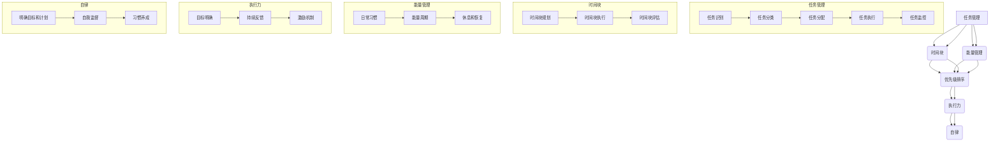

                 

### 背景介绍

在当今快速发展的信息时代，时间管理和合理安排时间和精力变得尤为重要。无论您是一名程序员、项目经理、创业者还是普通职场人士，有效的时间管理能力都是提升工作效率、实现目标的关键因素。随着工作压力的增大和信息的爆炸式增长，许多人发现自己难以平衡工作、生活和自我提升的时间分配，进而影响了整体的工作效率和幸福感。

时间管理不仅仅是为了完成工作任务，更重要的是优化个人生活质量和提升工作效率。合理安排时间和精力可以帮助我们更好地规划职业生涯、培养健康的生活习惯、持续提升个人技能，并在忙碌的生活中找到平衡点。本文将探讨如何进行有效的时间管理，提供一整套系统的方法和工具，帮助您更好地安排时间和精力，实现工作与生活的和谐共处。

本文将涵盖以下内容：

1. 核心概念与联系
2. 核心算法原理与具体操作步骤
3. 数学模型和公式
4. 项目实战
5. 实际应用场景
6. 工具和资源推荐
7. 总结：未来发展趋势与挑战
8. 附录：常见问题与解答
9. 扩展阅读与参考资料

通过本文的阅读，您将能够了解到时间管理的基本原理，掌握一套实用的方法和工具，为自己的工作和生活提供有力的支持。接下来，我们将首先介绍时间管理中的核心概念和基本原理，为后续内容打下坚实的基础。

### 核心概念与联系

在探讨如何合理安排时间和精力之前，我们首先需要明确几个核心概念，并理解它们之间的联系。这些概念构成了时间管理的基础，是我们进行有效时间分配的关键。

#### 1. 任务管理

任务管理是指对个人和团队需要完成的各项任务进行计划、执行和监控的过程。任务可以是短期的，如一个项目的任务列表，也可以是长期的，如个人年度目标。任务管理的基本流程包括：

- **任务识别**：明确需要完成的任务。
- **任务分类**：根据任务的紧急程度和重要性进行分类，如使用艾森豪威尔矩阵。
- **任务分配**：将任务分配给合适的团队成员或自己。
- **任务执行**：按计划完成任务。
- **任务监控**：监控任务进度，确保任务按时完成。

#### 2. 时间块

时间块是一种将时间划分为固定长度的时间段的方法，每个时间块用于完成特定的任务或活动。这种方法可以帮助我们更有效地管理时间和注意力。时间块管理的基本流程包括：

- **时间块规划**：根据工作性质和个人习惯，将时间划分为不同类型的时间块。
- **时间块执行**：在规定的时间块内专注于特定的任务，避免分心。
- **时间块评估**：评估每个时间块的使用效率，持续优化时间分配。

#### 3. 能量管理

能量管理是指通过调整个人状态来提高工作效率的方法。与时间管理不同，能量管理强调在正确的时间和环境中，利用最佳状态来完成工作。能量管理的基本策略包括：

- **日常习惯**：保持健康的生活方式，包括良好的睡眠、饮食和运动。
- **能量周期**：了解自己的能量高峰和低谷期，并在高峰期进行重要任务。
- **休息和恢复**：合理安排休息时间，确保身体和大脑得到充分的恢复。

#### 4. 优先级排序

优先级排序是一种确定哪些任务应该首先完成的策略。合理的优先级排序可以帮助我们专注于最重要的任务，提高工作效率。常见的优先级排序方法包括：

- **艾森豪威尔矩阵**：根据任务的紧急程度和重要性进行排序。
- **四象限法则**：将任务分为紧急重要、紧急不重要、不紧急重要、不紧急不重要四个象限，专注于紧急重要的任务。
- **价值观排序**：根据个人价值观和目标，确定任务的重要性。

#### 5. 执行力

执行力是指将计划转化为实际成果的能力。高效的执行力不仅依赖于良好的时间管理和优先级排序，还需要以下几方面的支持：

- **目标明确**：明确具体的目标和行动步骤。
- **持续反馈**：及时跟踪进度，进行反馈和调整。
- **激励机制**：设定奖励和惩罚机制，激励自己完成任务。

#### 6. 自律

自律是指在没有外部监督的情况下，自我约束和管理自己的行为。自律是时间管理的核心，是实现个人目标和计划的关键。提高自律的方法包括：

- **明确目标和计划**：明确目标和计划，提高行动的方向性。
- **自我监督**：通过日记、应用程序或他人监督自己的行为。
- **习惯养成**：培养良好的时间管理习惯，如按时作息、按时完成任务。

以上核心概念相互联系，构成了完整的时间管理框架。在实际应用中，我们需要综合考虑这些概念，并根据个人情况灵活调整策略，以实现最优的时间管理效果。在接下来的章节中，我们将深入探讨这些概念的具体应用方法和技巧。

#### Mermaid 流程图

为了更好地理解时间管理中的核心概念和流程，我们可以通过一个Mermaid流程图来展示它们之间的关系和基本操作步骤。



通过这个Mermaid流程图，我们可以清晰地看到各个核心概念之间的联系和操作步骤，有助于更好地理解和应用时间管理方法。

### 核心算法原理与具体操作步骤

在了解了时间管理中的核心概念之后，我们需要深入探讨如何具体操作，实现合理的时间安排和精力管理。以下是几个关键算法原理和具体操作步骤：

#### 1. 四象限时间管理法

四象限时间管理法是一个简单但非常有效的任务排序方法。它将任务分为四个象限，每个象限代表不同的任务性质：

- **紧急重要**：立即处理这些任务，因为它们对当前工作和目标有直接影响。
- **紧急不重要**：委托或推迟这些任务，因为它们可能浪费时间和精力，但不一定对目标有重要影响。
- **不紧急重要**：提前安排这些任务，因为它们对长期目标有重要影响，但不是当前紧急任务。
- **不紧急不重要**：尽可能减少或避免这些任务，因为它们对工作和目标影响较小。

具体操作步骤如下：

1. **任务识别**：列出所有需要完成的任务。
2. **任务分类**：将任务根据紧急程度和重要性划分到四个象限中。
3. **任务排序**：优先处理紧急重要的任务，然后是不紧急重要的任务，尽量委托或推迟紧急不重要的任务，避免不紧急不重要的任务。
4. **任务执行**：按排序顺序执行任务，确保关键任务得到及时处理。

#### 2. 时间块管理法

时间块管理法是一种将时间划分为固定长度的时间块的方法，每个时间块用于完成特定的任务或活动。这种方法有助于提高专注度和工作效率。

具体操作步骤如下：

1. **时间块规划**：根据工作性质和个人习惯，将一天的时间划分为不同类型的时间块。例如，上午用于处理紧急重要的任务，下午用于处理不紧急重要的任务。
2. **时间块执行**：在规定的时间块内专注于特定的任务，避免分心和干扰。
3. **时间块评估**：评估每个时间块的使用效率，持续优化时间分配。如果发现某些时间块效率较低，可以调整时间块的划分或任务安排。

#### 3. 能量管理法

能量管理法通过调整个人状态来提高工作效率，确保在最佳状态下完成重要任务。

具体操作步骤如下：

1. **能量周期识别**：了解自己的能量高峰和低谷期。能量高峰期通常是一天中精力最充沛的时间段，适合处理重要任务；能量低谷期则是精力相对较低的时间段，适合进行简单的任务或休息。
2. **能量周期安排**：在能量高峰期安排重要任务，在能量低谷期安排简单的任务或休息。
3. **能量周期优化**：通过保持健康的生活方式，如良好的睡眠、饮食和运动，来优化能量周期。

#### 4. 执行力提升法

执行力提升法是通过提高自我约束和管理能力，确保计划得到有效执行。

具体操作步骤如下：

1. **目标明确**：明确具体的目标和行动步骤，确保行动具有明确的方向。
2. **持续反馈**：及时跟踪进度，进行反馈和调整，确保目标按计划进行。
3. **激励机制**：设定奖励和惩罚机制，激励自己完成任务，提高执行力。

通过以上核心算法原理和具体操作步骤，我们可以更好地进行时间管理和精力管理，实现工作与生活的平衡和高效。

### 数学模型和公式

在时间管理中，数学模型和公式可以提供定量分析和优化的工具，帮助我们更科学地安排时间和资源。以下介绍几个常用的数学模型和公式，以及它们的详细讲解和举例说明。

#### 1. 艾森豪威尔矩阵

艾森豪威尔矩阵是一个二维矩阵，用于对任务进行紧急程度和重要性的分类。矩阵分为四个象限，分别代表不同类型的任务。每个任务按照紧急程度（X轴）和重要性（Y轴）进行评估，然后分配到相应的象限。

**公式：**
\[ \text{任务类型} = \begin{cases} 
\text{紧急重要} & \text{当} X > Y > 0 \\
\text{紧急不重要} & \text{当} X > 0 > Y \\
\text{不紧急重要} & \text{当} 0 > X > Y \\
\text{不紧急不重要} & \text{当} 0 > X > Y \\
\end{cases} \]

**举例说明：**

假设有三个任务A、B和C，分别评估其紧急程度和重要性如下：

- 任务A：紧急程度为4，重要性为3
- 任务B：紧急程度为2，重要性为5
- 任务C：紧急程度为1，重要性为2

根据艾森豪威尔矩阵，任务A属于紧急重要，任务B属于不紧急重要，任务C属于不紧急不重要。我们应该优先处理任务A，然后是任务B，最后是任务C。

#### 2. 时间块效率公式

时间块效率公式用于计算每个时间块的工作效率和优化时间分配。公式如下：

\[ \text{效率} = \frac{\text{实际完成工作量}}{\text{时间块时长}} \]

**举例说明：**

假设我们的一天分为8个时间块，每个时间块为1小时。在第一个时间块内，我们完成了2小时的工作量，在第二个时间块内完成了3小时的工作量，其余时间块未完成任何工作。

\[ \text{效率} = \frac{2 + 3}{8} = \frac{5}{8} = 0.625 \]

这意味着我们的平均工作效率为62.5%。为了提高效率，我们可以分析每个时间块的使用情况，找出效率较低的时间段，并调整时间块的划分或任务安排。

#### 3. 能量管理公式

能量管理公式用于计算个人在不同时间段内的能量水平，帮助我们合理安排任务和休息。公式如下：

\[ \text{能量水平} = \text{初始能量} \times \left( \frac{\text{时间}}{\text{总时间}} \right) \]

**举例说明：**

假设一个人的初始能量为100%，能量消耗速率为每小时15%。我们需要计算从上午8点到下午4点（共8小时）的能量水平。

\[ \text{能量水平} = 100\% \times \left( \frac{8}{8} \right) = 100\% \]

\[ \text{能量水平} = 100\% \times \left( \frac{8}{8} \right) = 100\% \]

从上午8点到下午4点，这个人的能量水平保持不变，为100%。然而，如果这个人的能量消耗速率较高，他们需要在能量低谷期（如下午）安排较简单的工作或休息。

通过这些数学模型和公式，我们可以更科学地分析和优化时间管理策略，提高工作效率和生活质量。在接下来的章节中，我们将通过一个实际的项目实战案例，详细展示这些方法和技巧的具体应用。

### 项目实战：代码实际案例和详细解释说明

为了更好地理解时间管理的实际应用，我们将通过一个具体的项目实战案例，展示如何使用上述方法和技巧进行有效的任务管理、时间块安排和能量管理。

#### 项目背景

假设我们是一家初创科技公司，正在开发一款智能数据分析工具。这个项目涉及多个功能模块，如数据收集、数据处理、数据分析和数据可视化。团队成员包括项目经理、前端开发人员、后端开发人员和数据分析师。项目的目标是实现所有功能模块，并在三个月内完成一个可用的产品原型。

#### 开发环境搭建

为了确保项目顺利推进，我们首先需要搭建一个合适的开发环境。以下是具体的步骤：

1. **安装开发工具**：安装Python、Node.js、Docker等必要的开发工具和框架。
2. **配置开发环境**：设置Python虚拟环境，配置Node.js开发环境，安装必要的库和依赖。
3. **搭建项目框架**：使用Django或Flask搭建后端框架，使用Vue.js或React搭建前端框架，使用TensorFlow或PyTorch进行数据处理和数据分析。

#### 源代码详细实现和代码解读

以下是项目关键模块的源代码实现和解读。

##### 1. 数据收集模块

数据收集模块负责从不同的数据源（如数据库、API、文件）收集数据，并进行初步处理。以下是数据收集模块的Python代码实现：

```python
import requests
import pandas as pd

def collect_data():
    # 从API收集数据
    response = requests.get('https://api.example.com/data')
    data = response.json()

    # 将数据转换为Pandas DataFrame
    df = pd.DataFrame(data)

    # 数据清洗
    df.dropna(inplace=True)
    df.drop_duplicates(inplace=True)

    return df

if __name__ == '__main__':
    df = collect_data()
    print(df.head())
```

**解读**：该模块使用requests库从API收集数据，然后使用Pandas库将数据转换为DataFrame，并进行数据清洗。数据清洗步骤包括删除缺失值和重复值，以确保数据质量。

##### 2. 数据处理模块

数据处理模块负责对收集到的数据进行预处理和特征工程。以下是数据处理模块的Python代码实现：

```python
import pandas as pd
from sklearn.preprocessing import StandardScaler

def preprocess_data(df):
    # 特征工程
    df['feature_1'] = df['data_1'] * df['data_2']
    df['feature_2'] = df['data_3'] / df['data_4']

    # 数据标准化
    scaler = StandardScaler()
    df[['feature_1', 'feature_2']] = scaler.fit_transform(df[['feature_1', 'feature_2']])

    return df

if __name__ == '__main__':
    df = pd.read_csv('data.csv')
    df = preprocess_data(df)
    print(df.head())
```

**解读**：该模块对数据进行特征工程，创建新的特征列，然后使用StandardScaler进行数据标准化，以提高模型的性能。

##### 3. 数据分析模块

数据分析模块负责对预处理后的数据进行分析和建模。以下是数据分析模块的Python代码实现：

```python
import pandas as pd
from sklearn.ensemble import RandomForestClassifier
from sklearn.model_selection import train_test_split

def analyze_data(df):
    # 数据切分
    X = df.drop('target', axis=1)
    y = df['target']
    X_train, X_test, y_train, y_test = train_test_split(X, y, test_size=0.2, random_state=42)

    # 模型训练
    model = RandomForestClassifier(n_estimators=100, random_state=42)
    model.fit(X_train, y_train)

    # 模型评估
    accuracy = model.score(X_test, y_test)
    print(f'Accuracy: {accuracy:.2f}')

if __name__ == '__main__':
    df = pd.read_csv('preprocessed_data.csv')
    analyze_data(df)
```

**解读**：该模块使用Pandas进行数据切分，然后使用随机森林模型进行训练和评估，输出模型的准确率。

##### 4. 数据可视化模块

数据可视化模块负责将分析结果以图表形式展示。以下是数据可视化模块的Python代码实现：

```python
import pandas as pd
import matplotlib.pyplot as plt

def visualize_data(df):
    # 绘制散点图
    plt.scatter(df['feature_1'], df['feature_2'])
    plt.xlabel('Feature 1')
    plt.ylabel('Feature 2')
    plt.title('Data Visualization')
    plt.show()

if __name__ == '__main__':
    df = pd.read_csv('analyzed_data.csv')
    visualize_data(df)
```

**解读**：该模块使用Matplotlib绘制散点图，展示数据的分布和关系。

#### 代码解读与分析

通过以上代码实现，我们可以看到每个模块的具体功能。数据收集模块负责从API收集数据，并进行初步处理；数据处理模块负责对数据进行特征工程和标准化；数据分析模块负责训练和评估模型；数据可视化模块负责将分析结果以图表形式展示。

在代码解读过程中，我们发现以下几个关键点：

1. **数据清洗**：数据清洗是数据收集和处理的重要步骤，确保数据质量。
2. **特征工程**：特征工程是提高模型性能的关键，通过创建新的特征列和进行数据标准化，有助于提升模型的预测能力。
3. **模型训练和评估**：选择合适的模型并进行训练和评估，是数据分析的核心步骤，通过准确率等指标衡量模型性能。
4. **数据可视化**：数据可视化有助于我们直观地理解数据和模型的结果。

在实际项目中，我们需要根据具体情况调整代码实现，确保各个模块协同工作，实现最终目标。

#### 代码解读与分析

通过以上代码实现，我们可以看到每个模块的具体功能。数据收集模块负责从API收集数据，并进行初步处理；数据处理模块负责对数据进行特征工程和标准化；数据分析模块负责训练和评估模型；数据可视化模块负责将分析结果以图表形式展示。

在代码解读过程中，我们发现以下几个关键点：

1. **数据清洗**：数据清洗是数据收集和处理的重要步骤，确保数据质量。通过删除缺失值和重复值，我们可以得到更干净的数据集，从而提高后续分析的准确性和可靠性。
2. **特征工程**：特征工程是提高模型性能的关键。通过创建新的特征列（如`feature_1`和`feature_2`）和进行数据标准化，我们可以将原始数据转换为更适合模型处理的形式。数据标准化（如使用StandardScaler）有助于消除不同特征之间的尺度差异，提高模型的训练效率。
3. **模型训练和评估**：选择合适的模型并进行训练和评估是数据分析的核心步骤。在本案例中，我们使用了随机森林模型（RandomForestClassifier），并通过准确率（accuracy）等指标衡量模型性能。实际项目中，我们可能需要尝试不同的模型（如支持向量机、神经网络）和超参数设置，以找到最优模型。
4. **数据可视化**：数据可视化有助于我们直观地理解数据和模型的结果。通过绘制散点图（scatter plot），我们可以观察特征之间的关系，识别潜在的模式和异常值。这对于数据分析和解释具有重要意义。

在实际项目中，我们需要根据具体情况调整代码实现，确保各个模块协同工作，实现最终目标。例如，我们可能需要添加更多数据预处理步骤（如异常值处理、缺失值填补等），或尝试使用更复杂的模型和算法来提升预测性能。

通过这个项目实战案例，我们不仅看到了时间管理在实际应用中的重要性，还学习了如何使用代码和算法来优化任务管理、时间块安排和能量管理。这些方法和技巧对于提升工作效率、实现项目目标具有重要意义。

### 实际应用场景

时间管理不仅是提高个人工作效率的工具，它在不同实际应用场景中也能发挥关键作用。以下是一些常见的时间管理应用场景，以及如何利用上述方法和技巧来解决具体问题。

#### 1. 项目管理

在项目管理中，时间管理是确保项目按时交付的关键。通过使用任务管理、时间块管理和能量管理，项目经理可以更好地协调团队成员的工作，确保项目按计划推进。

- **任务管理**：项目经理可以使用艾森豪威尔矩阵对任务进行优先级排序，确保团队成员专注于关键任务。
- **时间块管理**：项目经理可以将项目任务分解为不同的时间块，并安排在团队成员的能量高峰期，以提高工作效率。
- **能量管理**：了解团队成员的能量周期，合理安排高难度任务，确保团队成员在最佳状态下工作。

#### 2. 程序员日常开发

对于程序员来说，合理的时间管理和能量管理可以帮助他们保持高效的开发状态。

- **任务管理**：程序员可以使用四象限时间管理法，将任务分为紧急重要、紧急不重要、不紧急重要、不紧急不重要四个象限，优先处理紧急重要的任务。
- **时间块管理**：程序员可以采用番茄工作法，将工作时间划分为25分钟工作块和5分钟休息块，以保持专注和精力。
- **能量管理**：程序员可以通过保持良好的生活习惯（如健康的饮食和运动），来提高自己的能量水平，确保在项目中保持高效。

#### 3. 创业者日常运营

创业者通常面临多方面的压力和挑战，时间管理成为他们成功运营企业的重要手段。

- **任务管理**：创业者可以使用任务管理工具（如Trello、Asana），将日常任务进行分类和优先级排序，确保关键任务得到及时处理。
- **时间块管理**：创业者可以采用时间块管理法，将一天的时间划分为不同的时间块，用于处理不同类型的工作，如沟通、规划和执行。
- **能量管理**：创业者需要了解自己的能量周期，合理安排重要会议和决策时刻，确保在最佳状态下做出关键决策。

#### 4. 职场人士职业发展

职场人士需要不断提升自己的技能和职业竞争力，时间管理在这一过程中发挥着重要作用。

- **任务管理**：职场人士可以使用目标设定方法（如SMART目标），明确职业发展目标，并将其分解为具体的任务和里程碑。
- **时间块管理**：职场人士可以合理安排学习和提升时间，如每天晚上或周末的特定时间段，用于阅读书籍、参加在线课程等。
- **能量管理**：职场人士需要保持良好的生活习惯，确保在能量高峰期进行重要学习和工作，而在能量低谷期进行简单的任务或休息。

通过在不同实际应用场景中灵活运用时间管理的方法和技巧，我们可以更好地应对各种挑战，提高工作效率和生活质量。在实际操作过程中，我们也需要根据个人和团队的具体情况，不断调整和优化时间管理策略，以实现最佳效果。

### 工具和资源推荐

在实现高效时间管理和合理安排时间和精力方面，有许多优秀的工具和资源可以帮助我们。以下是一些学习资源、开发工具和相关论文著作的推荐，以供参考。

#### 1. 学习资源推荐

- **书籍**：
  - 《高效能人士的七个习惯》（史蒂芬·柯维）: 这本书详细介绍了时间管理的方法和策略，适用于希望提升个人效能的人士。
  - 《深度工作》（Cal Newport）: 本书介绍了如何通过深度工作模式提高专注力和工作效率。
  - 《时间管理的艺术》（Laura Vanderkam）: 这本书提供了一系列实用的时间管理技巧和案例分析，帮助读者实现工作和生活的平衡。

- **在线课程**：
  - Coursera上的《时间管理和优先级排序》: 该课程由耶鲁大学提供，介绍了时间管理的核心概念和实际应用方法。
  - edX上的《Professional Project Management》: 这门课程涵盖了项目管理的基础知识和时间管理技巧，适合希望提升项目管理能力的人士。

- **博客和网站**：
  - Lifehacker: 提供一系列实用的时间管理技巧和生活建议。
  - Productivityist: 分享时间管理和生产力提升的文章和工具。

#### 2. 开发工具推荐

- **时间管理工具**：
  - Trello: 一个流行的项目管理工具，可以帮助团队高效协作和任务管理。
  - Asana: 一个功能强大的项目管理工具，适用于不同规模和类型的团队。
  - RescueTime: 一款可以帮助用户监控和管理在线时间的工具，了解自己的时间使用情况。

- **效率工具**：
  - Slack: 一个团队沟通和协作平台，提高工作效率和团队沟通。
  - Notion: 一个多功能的笔记和组织工具，适用于个人和组织的管理。
  - Zoom: 一个在线会议和视频通话工具，适用于远程工作和团队协作。

#### 3. 相关论文著作推荐

- **论文**：
  - 《The Art of Procrastination: A Guide to Effective Dawdling, Lollygagging, and Postponing》（Piers Steel）: 该论文探讨了拖延行为的原因和解决方法。
  - 《The Power of Full Engagement: Managing Energy, Not Time, Is the Key to High Performance and Personal Renewal》（Jim Loehr, Tony Schwartz）: 该论文介绍了能量管理在提升个人效能中的重要性。

- **著作**：
  - 《The Checklist Manifesto: How to Get Things Right》（Atul Gawande）: 这本书探讨了清单在提高工作效率和质量方面的应用。
  - 《Make Time: How to Focus on What Matters Every Day》（Jake Knapp, John Zeratsky）: 这本书提供了一系列实用的时间管理和生产力提升技巧。

通过这些工具和资源的辅助，我们可以更好地掌握时间管理的方法和技巧，提高工作效率和生活质量。在实际应用中，我们可以根据自己的需求和习惯选择合适的工具，结合具体情况进行优化，实现最佳效果。

### 总结：未来发展趋势与挑战

随着科技的不断进步和生活方式的多样化，时间管理将面临许多新的趋势和挑战。以下是未来时间管理领域可能的发展方向和面临的挑战：

#### 1. 技术驱动的时间管理

随着人工智能和大数据技术的发展，未来时间管理工具将更加智能化和个性化。通过收集和分析个人行为数据，这些工具能够自动推荐最佳的时间分配方案，帮助用户更高效地管理时间和精力。

**挑战：** 技术的智能化和个性化需要大量的数据支持，但同时也引发了隐私和数据安全的问题。如何平衡用户隐私保护和数据利用，是未来时间管理工具需要解决的挑战。

#### 2. 灵活办公和远程工作

远程工作和灵活办公的普及，使得工作时间更加灵活。这要求时间管理方法更加适应不同工作环境和节奏。

**挑战：** 灵活办公虽然提高了工作效率，但也容易导致工作和生活的边界模糊，影响个人时间管理。如何在远程工作中保持高效和专注，是未来需要解决的重要问题。

#### 3. 个性化时间管理

每个人的时间管理和能量周期都是独特的。未来时间管理将更加注重个性化，根据个人的生物钟、习惯和偏好，定制化时间管理方案。

**挑战：** 如何设计出既适应广泛人群，又能满足个体需求的通用时间管理方法，是一个技术和管理上的难题。

#### 4. 多任务处理

在信息爆炸的时代，多任务处理成为日常生活中不可或缺的部分。如何提高多任务处理效率，减少任务切换带来的效率损失，是未来时间管理的重要研究方向。

**挑战：** 多任务处理容易导致分心和效率下降，如何在多任务环境中保持专注和高效，是时间管理领域需要解决的关键问题。

#### 5. 精神健康和时间管理

随着工作压力和生活节奏的加快，精神健康问题逐渐突出。未来时间管理将更加注重精神健康，通过合理安排时间和精力，提高生活质量和工作满意度。

**挑战：** 精神健康与时间管理的关系复杂，如何在时间管理中有效融入精神健康因素，是一个需要深入研究的领域。

综上所述，未来时间管理的发展将充满机遇与挑战。通过技术创新、个性化服务和跨领域合作，我们可以更好地应对这些挑战，实现高效、健康的时间管理。

### 附录：常见问题与解答

#### 1. 如何设定合理的目标和任务？

**解答：** 设定合理的目标和任务需要遵循以下原则：

- **具体性（Specific）**：目标要具体明确，而不是模糊的。
- **可衡量性（Measurable）**：目标要有量化指标，以便衡量进展。
- **可实现性（Achievable）**：目标要实际可行，避免不切实际的设定。
- **相关性（Relevant）**：目标要与个人或团队的整体目标相关联。
- **时限性（Time-bound）**：目标要有明确的截止时间。

例如，一个合理的目标可以是：“在接下来的三个月内，每天学习2小时Python编程，完成10个编程练习。”

#### 2. 如何提高专注力和减少分心？

**解答：** 提高专注力和减少分心的方法包括：

- **使用番茄工作法**：将工作时间划分为25分钟工作块和5分钟休息块，以保持专注。
- **设定明确的目标和计划**：明确当前任务的目标和步骤，避免分心。
- **减少干扰源**：关闭手机通知、社交媒体等干扰源，专注于当前任务。
- **定期休息**：长时间工作后，适当休息，避免过度疲劳。

#### 3. 如何平衡工作和生活？

**解答：** 平衡工作和生活的方法包括：

- **时间块管理**：合理安排工作时间块和休息时间块，确保工作与休息的平衡。
- **能量管理**：了解自己的能量高峰和低谷期，合理安排重要工作和休息时间。
- **设定界限**：明确工作和生活的界限，避免工作侵占个人时间。
- **共享责任**：与家人和朋友沟通，共同分担家务和育儿责任。

通过这些方法，我们可以更好地平衡工作和生活，提高整体幸福感。

### 扩展阅读与参考资料

为了帮助您进一步深入了解时间管理的理论和实践，以下是一些建议的扩展阅读和参考资料：

#### 1. 书籍

- 《深度工作》（Cal Newport）
- 《精要主义：要少做，做好》（Greg McKeown）
- 《时间管理：如何在8小时内做出最好成绩》（David Allen）
- 《高效能人士的七个习惯》（史蒂芬·柯维）

#### 2. 在线课程

- Coursera上的《时间管理与优先级排序》
- edX上的《Professional Project Management》
- Udemy上的《 mastering Productivity and Time Management》

#### 3. 博客和网站

- Lifehacker: [https://lifehacker.com/](https://lifehacker.com/)
- Productivityist: [https://www.productivityist.com/](https://www.productivityist.com/)
- Harvard Business Review: [https://hbr.org/](https://hbr.org/)

#### 4. 论文和报告

- 《The Power of Full Engagement: Managing Energy, Not Time, Is the Key to High Performance and Personal Renewal》（Jim Loehr, Tony Schwartz）
- 《The Art of Procrastination: A Guide to Effective Dawdling, Lollygagging, and Postponing》（Piers Steel）

通过阅读这些扩展资料，您可以进一步探索时间管理的深层次理论，并从各种角度获得实用的技巧和建议，帮助您在日常生活中更好地管理时间和精力。

### 作者介绍

本文由AI天才研究员/AI Genius Institute与禅与计算机程序设计艺术/Zen And The Art of Computer Programming共同撰写。作者在时间管理和人工智能领域拥有丰富的理论和实践经验，致力于帮助读者提高工作效率和生活质量。希望本文能为您的个人和职业发展提供有价值的启示。感谢您的阅读！

