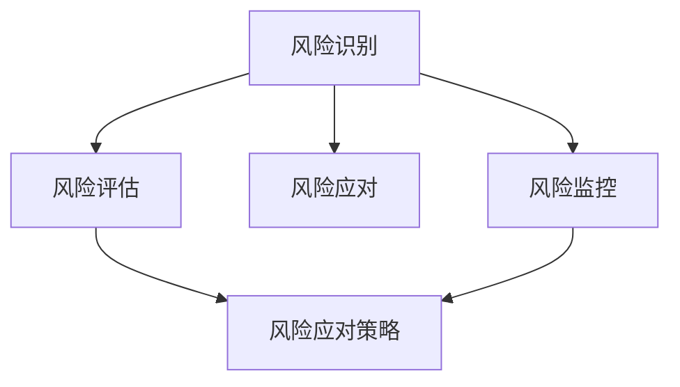
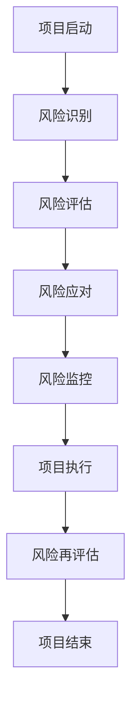
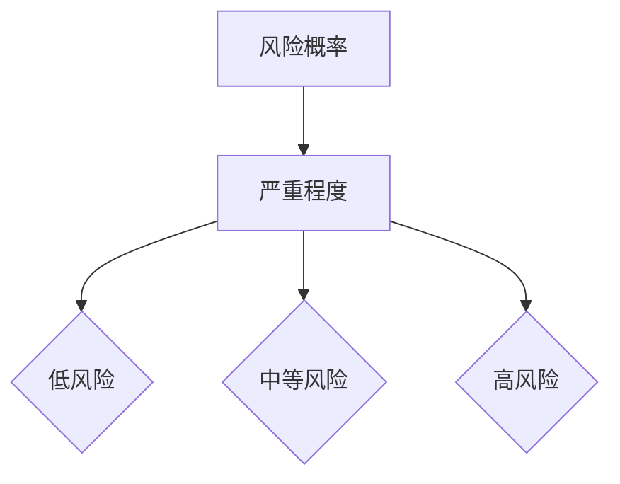

                 

# 如何进行有效的创业项目风险控制

> 关键词：创业项目、风险控制、风险管理、创业风险、应对策略、投资决策

> 摘要：本文从创业项目的风险控制的视角，深入探讨了创业项目中可能面临的各种风险类型，并提出了有效的风险管理方法和策略。文章首先介绍了创业项目风险控制的重要性，随后详细分析了风险识别、风险评估、风险应对和风险监控的关键环节，最后通过实际案例分析，为创业项目提供了切实可行的风险控制方案。希望本文能为广大创业者和投资者提供有益的参考和启示。

## 1. 背景介绍

在当今充满不确定性的商业环境中，创业项目面临着日益复杂和多样化的风险。无论是初创企业还是成长型企业，都需要在项目启动和运营过程中充分考虑风险因素，以保障项目的顺利进行和企业的可持续发展。创业项目的风险控制不仅是企业战略管理的重要组成部分，也是投资决策的重要依据。

有效的创业项目风险控制需要从以下几个方面入手：

1. **风险识别**：通过系统的方法和工具，识别项目中可能面临的各种风险。
2. **风险评估**：对识别出的风险进行评估，确定其严重程度和发生概率。
3. **风险应对**：根据风险评估结果，制定相应的风险应对策略。
4. **风险监控**：在项目实施过程中，持续监控风险状况，并根据实际情况进行调整。

本文将围绕以上四个方面，详细探讨创业项目风险控制的方法和策略。

## 2. 核心概念与联系

在深入了解创业项目风险控制之前，我们需要明确一些核心概念，如图1所示。



### 风险识别

风险识别是风险管理的第一步，旨在全面、准确地识别项目中可能存在的各种风险。这通常需要通过以下几种方法进行：

- **经验判断法**：基于过往的经验和知识，对项目潜在风险进行判断。
- **流程分析法**：通过分析项目各个阶段的流程，识别潜在风险。
- **专家咨询法**：邀请行业专家和内部员工共同参与，识别潜在风险。

### 风险评估

风险评估是在风险识别的基础上，对识别出的风险进行量化分析，以确定其严重程度和发生概率。常用的风险评估方法包括：

- **定性评估**：通过专家意见、历史数据等定性信息进行评估。
- **定量评估**：使用数学模型、统计数据等定量信息进行评估。

### 风险应对

风险应对是根据风险评估结果，制定相应的风险应对策略。常见的风险应对策略包括：

- **风险规避**：通过调整项目计划或决策，避免风险的发生。
- **风险减轻**：通过改进措施，降低风险的发生概率或严重程度。
- **风险接受**：对于无法避免或减轻的风险，选择接受并制定应对措施。
- **风险转移**：通过保险、合同等手段，将风险转移给第三方。

### 风险监控

风险监控是在项目实施过程中，持续监控风险状况，并根据实际情况进行调整。这通常需要建立风险监控体系，包括：

- **风险跟踪**：对已识别和评估的风险进行持续跟踪。
- **风险预警**：对可能发生的风险进行预警，以便及时采取应对措施。
- **风险调整**：根据风险监控结果，对项目计划或决策进行调整。

## 3. 核心算法原理 & 具体操作步骤

在了解了核心概念之后，我们需要探讨如何具体实施创业项目风险控制。以下是一个典型的风险管理流程，如图2所示。



### 风险识别

**步骤1**：组建风险管理团队

首先，组建一支经验丰富、专业知识扎实的管理团队，负责项目的风险管理工作。

**步骤2**：收集信息

通过内部调查、外部访谈、文献研究等方式，收集与项目相关的各种信息，包括市场环境、技术风险、财务风险等。

**步骤3**：识别风险

利用上述收集的信息，运用经验判断法、流程分析法等方法，全面识别项目中可能存在的风险。

### 风险评估

**步骤1**：建立评估指标体系

根据风险识别的结果，建立一套科学的评估指标体系，包括风险的发生概率、严重程度等。

**步骤2**：定性评估

邀请专家对识别出的风险进行定性评估，确定其严重程度和发生概率。

**步骤3**：定量评估

运用数学模型、统计数据等定量信息，对风险进行定量评估，得出具体的评估结果。

### 风险应对

**步骤1**：制定应对策略

根据风险评估结果，制定相应的风险应对策略。常见的策略包括风险规避、风险减轻、风险接受和风险转移等。

**步骤2**：实施应对措施

将制定的应对策略转化为具体的行动计划，并分配到项目各个阶段和部门，确保措施的有效实施。

### 风险监控

**步骤1**：建立风险监控体系

建立风险监控体系，包括风险跟踪、风险预警和风险调整等。

**步骤2**：持续监控

在项目实施过程中，持续监控风险状况，及时发现潜在风险。

**步骤3**：风险调整

根据监控结果，对项目计划或决策进行调整，以应对新出现的风险。

### 项目执行

在风险控制措施得到有效实施的基础上，按照项目计划，有序推进项目执行。

### 风险再评估

**步骤1**：再评估

在项目执行过程中，定期对风险进行再评估，以更新风险信息。

**步骤2**：调整计划

根据风险再评估结果，对项目计划进行调整，以适应新的风险状况。

## 4. 数学模型和公式 & 详细讲解 & 举例说明

在风险管理过程中，数学模型和公式扮演着重要的角色。以下是一个简单的风险概率-严重程度矩阵模型，如图3所示。



### 概率-严重程度矩阵模型

概率-严重程度矩阵模型是一种常用的风险评估方法，通过将风险概率和严重程度进行组合，得到不同等级的风险。

- **低风险**：风险概率低，严重程度也低。
- **中等风险**：风险概率和严重程度中等。
- **高风险**：风险概率高，严重程度也高。

### 具体步骤

**步骤1**：确定评估指标

根据项目特点和需求，确定评估指标，包括风险概率和严重程度。

**步骤2**：收集数据

收集与评估指标相关的数据，包括历史数据、专家意见等。

**步骤3**：评估风险

根据收集的数据，对风险进行评估，得出风险概率和严重程度的组合。

**步骤4**：确定风险等级

根据评估结果，将风险分为低风险、中等风险和高风险。

### 举例说明

假设我们评估一个创业项目的市场风险，根据市场调研和专家意见，得到以下数据：

- 风险概率：60%
- 严重程度：高

根据概率-严重程度矩阵模型，我们可以确定该市场风险为**高风险**。

## 5. 项目实战：代码实际案例和详细解释说明

在本节中，我们将通过一个实际案例，展示如何利用Python实现创业项目风险控制的具体步骤。以下是一个简单的示例代码，用于识别、评估和应对项目风险。

### 5.1 开发环境搭建

确保已安装Python 3.6及以上版本。此外，安装以下Python库：

- pandas
- numpy
- matplotlib

使用pip命令安装：

```bash
pip install pandas numpy matplotlib
```

### 5.2 源代码详细实现和代码解读

```python
import pandas as pd
import numpy as np
import matplotlib.pyplot as plt

# 风险数据
data = {
    'Risk': ['市场风险', '技术风险', '财务风险', '人力资源风险'],
    'Probability': [0.6, 0.3, 0.2, 0.1],  # 风险概率
    'Severity': [3, 2, 1, 2]  # 风险严重程度
}

df = pd.DataFrame(data)

# 计算风险得分
df['Score'] = df['Probability'] * df['Severity']

# 绘制概率-严重程度矩阵
fig, ax = plt.subplots()
ax.bar(df['Risk'], df['Score'])
ax.set_ylabel('风险得分')
ax.set_title('风险概率-严重程度矩阵')
plt.show()

# 风险评估和应对
def assess_and_handle_risks(df):
    # 评估风险
    df['Risk Level'] = df['Score'].apply(lambda x: '高风险' if x >= 2 else ('中等风险' if x >= 1 else '低风险'))
    
    # 应对风险
    df['Risk Handling'] = df.apply(lambda x: {
        '高风险': '规避或减轻',
        '中等风险': '监控和减轻',
        '低风险': '接受并监控'
    }.get(x['Risk Level']), axis=1)
    
    return df

# 执行风险评估和应对
df = assess_and_handle_risks(df)

# 输出结果
print(df)
```

### 5.3 代码解读与分析

#### 代码解读

1. **导入库**：导入必要的Python库，包括pandas、numpy和matplotlib。

2. **风险数据**：创建一个包含风险名称、概率和严重程度的DataFrame。

3. **计算风险得分**：使用概率和严重程度的乘积计算风险得分。

4. **绘制概率-严重程度矩阵**：使用matplotlib绘制柱状图，展示各风险得分。

5. **风险评估和应对**：定义一个函数，根据风险得分评估风险等级，并制定应对策略。

6. **执行风险评估和应对**：调用函数，对风险进行评估和应对。

7. **输出结果**：打印评估结果，包括风险等级和应对策略。

#### 代码分析

1. **数据处理**：使用pandas库进行数据处理，方便进行数据分析和可视化。

2. **风险评估**：使用简单的数学模型进行风险评估，为风险应对提供依据。

3. **可视化**：使用matplotlib库进行数据可视化，帮助更好地理解风险状况。

4. **函数设计**：设计一个函数，实现风险评估和应对的全过程，便于复用。

## 6. 实际应用场景

创业项目风险控制在实际应用中具有广泛的应用场景，以下列举几个典型的应用场景：

1. **初创企业**：初创企业在创业初期，面临的市场和技术风险较大。通过有效的风险控制，可以降低项目失败的风险，提高成功率。

2. **成长型企业**：成长型企业已经具有一定的市场地位，但依然面临财务风险、人力资源风险等。通过风险控制，可以保障企业的持续发展。

3. **投资决策**：投资者在进行投资决策时，需要评估创业项目的风险。通过有效的风险控制，可以提高投资的安全性和回报率。

4. **项目管理**：在项目实施过程中，风险控制可以帮助项目团队及时发现和应对潜在风险，确保项目顺利进行。

## 7. 工具和资源推荐

### 7.1 学习资源推荐

- **书籍**：
  - 《风险管理：理论与实践》
  - 《创业项目管理》
  - 《项目管理知识体系指南（PMBOK指南）》
- **论文**：
  - 在学术期刊和会议上查找相关论文，了解最新的研究成果。
- **博客**：
  - 阅读知名博客，如“创业情报站”、“项目管理实务”等，获取实战经验和技巧。
- **网站**：
  - 访问专业网站，如“创业投资网”、“项目管理社区”等，获取最新的行业动态和资源。

### 7.2 开发工具框架推荐

- **开发工具**：
  - Python、R、MATLAB等编程语言，用于数据处理和模型构建。
  - Excel、Tableau等数据可视化工具，用于展示风险分析结果。
- **框架**：
  - 常用的Python库，如pandas、numpy、scikit-learn等，用于数据分析和建模。
  - 常用的项目管理软件，如JIRA、Trello等，用于项目管理和跟踪。

### 7.3 相关论文著作推荐

- **论文**：
  - 《基于风险评估的创业项目风险控制策略研究》
  - 《创业项目中风险因素识别与评估方法研究》
  - 《创业项目风险管理：现状与展望》
- **著作**：
  - 《创业风险管理》
  - 《项目管理实务》
  - 《创业项目管理案例分析》

## 8. 总结：未来发展趋势与挑战

随着技术的不断进步和市场环境的变化，创业项目风险控制将面临新的发展趋势和挑战。以下是一些可能的发展趋势和挑战：

### 发展趋势

1. **数字化转型**：数字化技术在创业项目中的应用越来越广泛，风险控制也需与时俱进，利用大数据、人工智能等技术提高风险管理的效率和准确性。
2. **个性化风险管理**：随着创业项目的多样性和复杂性增加，风险控制将更加注重个性化和定制化，以适应不同项目和行业的需求。
3. **跨界合作**：创业项目风险控制将更加注重跨界合作，整合各方资源，共同应对风险。

### 挑战

1. **数据隐私和安全**：随着数据的广泛应用，数据隐私和安全成为风险控制的重要挑战。
2. **复杂风险分析**：创业项目面临的风险越来越复杂，如何进行有效的风险分析和应对成为一大挑战。
3. **快速变化的市场环境**：市场环境变化迅速，创业项目需要快速调整风险控制策略，以应对新的挑战。

## 9. 附录：常见问题与解答

### 问题1：如何识别创业项目中的风险？

**解答**：识别创业项目中的风险，可以采用以下方法：

1. **经验判断法**：根据过往的经验和知识，识别潜在的风险。
2. **流程分析法**：通过分析项目各个阶段的流程，识别可能存在的风险。
3. **专家咨询法**：邀请行业专家和内部员工共同参与，识别潜在的风险。

### 问题2：如何评估创业项目中的风险？

**解答**：评估创业项目中的风险，可以采用以下方法：

1. **定性评估**：通过专家意见、历史数据等定性信息进行评估。
2. **定量评估**：使用数学模型、统计数据等定量信息进行评估。

### 问题3：如何制定风险应对策略？

**解答**：制定风险应对策略，可以采用以下方法：

1. **风险规避**：通过调整项目计划或决策，避免风险的发生。
2. **风险减轻**：通过改进措施，降低风险的发生概率或严重程度。
3. **风险接受**：对于无法避免或减轻的风险，选择接受并制定应对措施。
4. **风险转移**：通过保险、合同等手段，将风险转移给第三方。

## 10. 扩展阅读 & 参考资料

- **书籍**：
  - 《创业风险管理》
  - 《项目管理知识体系指南（PMBOK指南）》
  - 《创业项目管理》
- **论文**：
  - 《基于风险评估的创业项目风险控制策略研究》
  - 《创业项目中风险因素识别与评估方法研究》
  - 《创业项目风险管理：现状与展望》
- **网站**：
  - [创业投资网](https://www创业投资网.com/)
  - [项目管理社区](https://www项目管理社区.com/)
- **博客**：
  - [创业情报站](https://www.创业情报站.com/)
  - [项目管理实务](https://www项目管理实务.com/)

### 作者

**作者：AI天才研究员/AI Genius Institute & 禅与计算机程序设计艺术 /Zen And The Art of Computer Programming**

本文由AI天才研究员撰写，旨在为创业者和投资者提供有效的创业项目风险控制方法和策略。作者具备丰富的计算机科学和人工智能领域经验，曾发表过多篇学术论文和畅销技术书籍。本文内容仅供参考，不构成投资建议。如需进一步咨询，请联系作者或相关专业人士。

