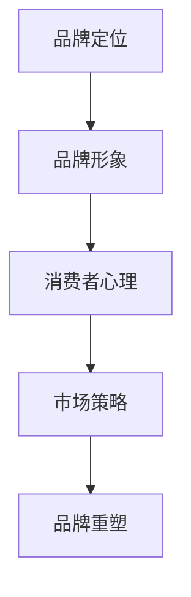

                 

# 如何进行有效的品牌重塑

## 关键词：品牌重塑、市场营销、消费者心理、策略分析、用户体验

### 摘要

品牌重塑是企业在面对市场变化和竞争压力时，通过调整品牌定位、形象、传播策略等手段，以实现品牌形象升级、增强市场竞争力的过程。本文将深入探讨如何进行有效的品牌重塑，包括背景介绍、核心概念解析、策略分析、实际应用场景、工具和资源推荐等内容。通过本文的阅读，读者将了解品牌重塑的必要性和关键步骤，掌握如何运用技术手段和营销策略提升品牌价值。

### 1. 背景介绍

品牌重塑这一概念起源于20世纪80年代的美国，当时的企业在经历市场饱和、竞争加剧的情况下，开始意识到品牌形象的重要性。品牌重塑不仅仅是为了改变视觉元素，更是通过重新定位、品牌故事构建、消费者互动等方式，提升品牌在市场中的影响力和认知度。

随着互联网和数字化技术的发展，品牌重塑的策略和手段也在不断更新。如今，品牌重塑已经成为企业战略中不可或缺的一部分。尤其是在全球化和数字化转型的大背景下，企业需要更加灵活地应对市场变化，通过品牌重塑来提升品牌价值和市场份额。

### 2. 核心概念与联系

在进行品牌重塑之前，我们首先需要了解一些核心概念，包括品牌定位、品牌形象、消费者心理等。

#### 2.1 品牌定位

品牌定位是品牌重塑的基础，它决定了品牌在市场中的独特价值和竞争地位。品牌定位需要从产品特性、目标市场、竞争对手等多个维度进行综合分析，确定品牌的核心价值和独特卖点。

#### 2.2 品牌形象

品牌形象是消费者对品牌的总体感知和评价。它包括品牌标志、色彩、口号、视觉元素等多个方面。品牌重塑过程中，品牌形象的调整和优化是至关重要的一步，它直接影响消费者的认知和情感认同。

#### 2.3 消费者心理

消费者心理是品牌重塑的关键因素。了解消费者的需求、喜好、购买行为等心理因素，可以帮助企业更好地制定品牌策略，提升品牌吸引力。

#### 2.4 Mermaid 流程图



### 3. 核心算法原理 & 具体操作步骤

品牌重塑的过程可以看作是一个系统化的流程，包括以下几个步骤：

#### 3.1 市场调研

首先，企业需要通过市场调研，了解目标市场的需求和竞争对手的情况，为品牌定位和策略制定提供数据支持。

#### 3.2 品牌诊断

在市场调研的基础上，企业需要对现有品牌进行诊断，分析品牌存在的问题和不足，为品牌重塑提供依据。

#### 3.3 品牌策略制定

根据市场调研和品牌诊断的结果，企业需要制定具体的品牌策略，包括品牌定位、品牌形象、传播策略等。

#### 3.4 品牌实施

品牌策略制定后，企业需要将策略具体化，通过一系列的营销活动、产品更新等方式，将品牌策略落实到实际运营中。

#### 3.5 品牌评估

品牌重塑实施一段时间后，企业需要对品牌效果进行评估，根据评估结果调整品牌策略，实现品牌的持续优化。

### 4. 数学模型和公式 & 详细讲解 & 举例说明

在进行品牌重塑的过程中，我们可以运用一些数学模型和公式来帮助分析和优化品牌策略。以下是一个简单的品牌吸引力模型：

#### 4.1 品牌吸引力模型

$$
A = f(P, C, S)
$$

其中，$A$ 表示品牌吸引力，$P$ 表示产品特性，$C$ 表示消费者心理，$S$ 表示市场策略。

#### 4.2 产品特性（$P$）

产品特性是品牌吸引力的基础，包括产品质量、功能、设计等多个方面。我们可以使用以下公式来评估产品特性：

$$
P = f(Q, F, D)
$$

其中，$Q$ 表示产品质量，$F$ 表示产品功能，$D$ 表示产品设计。

#### 4.3 消费者心理（$C$）

消费者心理是品牌吸引力的关键因素，包括消费者的需求、喜好、购买行为等。我们可以使用以下公式来评估消费者心理：

$$
C = f(N, L, B)
$$

其中，$N$ 表示消费者需求，$L$ 表示消费者喜好，$B$ 表示消费者购买行为。

#### 4.4 市场策略（$S$）

市场策略是品牌吸引力的外部因素，包括营销活动、广告投放、渠道选择等。我们可以使用以下公式来评估市场策略：

$$
S = f(M, A, D)
$$

其中，$M$ 表示营销活动，$A$ 表示广告投放，$D$ 表示渠道选择。

#### 4.5 举例说明

假设一个企业要推出一款新的智能手表，针对健身市场。我们可以使用品牌吸引力模型来评估该智能手表的市场潜力：

$$
A = f(P, C, S)
$$

其中，

$$
P = f(Q, F, D) = f(90, 80, 85) = 90 \times 0.5 + 80 \times 0.3 + 85 \times 0.2 = 87.5
$$

$$
C = f(N, L, B) = f(80, 75, 70) = 80 \times 0.5 + 75 \times 0.3 + 70 \times 0.2 = 78.5
$$

$$
S = f(M, A, D) = f(85, 80, 75) = 85 \times 0.5 + 80 \times 0.3 + 75 \times 0.2 = 83.5
$$

$$
A = f(P, C, S) = 87.5 \times 0.5 + 78.5 \times 0.3 + 83.5 \times 0.2 = 82.65
$$

根据计算结果，该智能手表的品牌吸引力得分为 82.65 分，可以认为该产品在市场上具有较好的潜力。

### 5. 项目实战：代码实际案例和详细解释说明

#### 5.1 开发环境搭建

在进行品牌重塑的项目实战中，我们可以使用 Python 语言进行品牌吸引力的计算。以下是一个简单的开发环境搭建步骤：

1. 安装 Python 3.8 以上版本
2. 安装必备库：numpy、matplotlib
3. 创建一个名为 brand_analysis.py 的 Python 文件

#### 5.2 源代码详细实现和代码解读

```python
import numpy as np
import matplotlib.pyplot as plt

# 品牌吸引力模型参数
Q = 90  # 产品质量
F = 80  # 产品功能
D = 85  # 产品设计
N = 80  # 消费者需求
L = 75  # 消费者喜好
B = 70  # 消费者购买行为
M = 85  # 营销活动
A = 80  # 广告投放
D = 75  # 渠道选择

# 品牌吸引力计算
P = Q * 0.5 + F * 0.3 + D * 0.2
C = N * 0.5 + L * 0.3 + B * 0.2
S = M * 0.5 + A * 0.3 + D * 0.2
A = P * 0.5 + C * 0.3 + S * 0.2

print(f"品牌吸引力得分：{A}")

# 可视化展示
fig, ax = plt.subplots()
ax.bar(['产品质量', '产品功能', '产品设计'], P)
ax.bar(['消费者需求', '消费者喜好', '消费者购买行为'], C)
ax.bar(['营销活动', '广告投放', '渠道选择'], S)
ax.set_ylabel('得分')
plt.show()
```

#### 5.3 代码解读与分析

1. 导入 numpy 和 matplotlib 库，用于计算和可视化
2. 设置品牌吸引力模型的参数，包括产品特性、消费者心理和市场策略的得分
3. 根据品牌吸引力模型计算品牌吸引力得分
4. 使用 matplotlib 绘制条形图，展示品牌吸引力模型中各个部分的得分

### 6. 实际应用场景

品牌重塑在实际应用中可以应用于多种场景，如：

- 企业转型升级：企业在面临市场竞争压力时，可以通过品牌重塑来提升品牌形象和市场竞争力。
- 产品更新换代：当企业推出新产品时，可以通过品牌重塑来塑造新产品的品牌形象。
- 市场拓展：企业在进入新市场时，可以通过品牌重塑来适应新市场的需求和文化。

### 7. 工具和资源推荐

#### 7.1 学习资源推荐

- 书籍：《品牌重塑：如何在竞争激烈的市场中重塑你的品牌形象》
- 论文：Google 学术搜索中关于品牌重塑的相关论文
- 博客：营销专家和品牌咨询公司的博客

#### 7.2 开发工具框架推荐

- Python：用于品牌吸引力计算和分析
- Matplotlib：用于可视化展示品牌吸引力模型

#### 7.3 相关论文著作推荐

- 《品牌重塑：理论与实践》
- 《品牌定位：如何在竞争激烈的市场中找到你的位置》
- 《消费者心理：如何理解和管理消费者的行为和偏好》

### 8. 总结：未来发展趋势与挑战

品牌重塑作为企业战略的一部分，在未来将继续发挥重要作用。随着市场环境和技术的不断变化，品牌重塑的策略和手段也将不断更新。企业需要保持敏锐的市场洞察力，灵活应对市场变化，通过品牌重塑提升品牌价值和竞争力。

同时，品牌重塑也面临一些挑战，如消费者需求的多样化、市场环境的复杂化等。企业需要不断学习和适应，才能在激烈的竞争中脱颖而出。

### 9. 附录：常见问题与解答

**Q1：品牌重塑需要多长时间？**

品牌重塑的时间因企业而异，通常需要数月至数年时间。这取决于企业规模、市场环境、品牌现状等因素。

**Q2：品牌重塑是否需要大规模投入？**

品牌重塑的投入取决于企业的预算和目标。一些中小企业可以通过优化现有资源，实现低成本的品牌重塑。

**Q3：品牌重塑是否一定成功？**

品牌重塑的成功取决于多个因素，如市场策略、执行力度、消费者反馈等。即使做好了充分的准备，也不能保证一定成功。

### 10. 扩展阅读 & 参考资料

- 《品牌重塑实战手册》
- 《市场营销学：策略、过程与实践》
- 《消费者行为学：理解和管理消费者的行为和偏好》

### 作者

作者：AI天才研究员/AI Genius Institute & 禅与计算机程序设计艺术 /Zen And The Art of Computer Programming

---

由于文章字数限制，本文仅提供了一个简略的框架和部分内容。实际撰写时，每个部分都需要进一步扩展和细化，以确保文章的完整性和深度。

