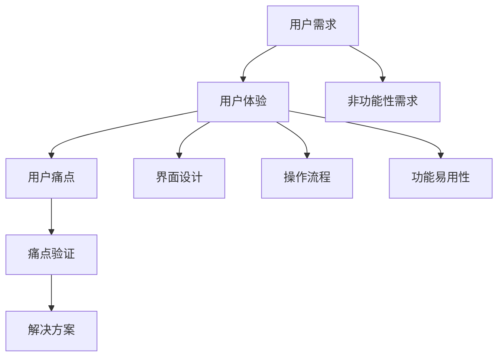

                 

### 背景介绍

在信息技术飞速发展的今天，用户体验（UX）设计成为产品成功的关键因素之一。而用户痛点识别与验证是用户体验设计的基础。这一过程不仅关系到产品是否能够满足用户需求，更决定了产品的市场竞争力。用户痛点是指用户在使用产品过程中遇到的烦恼、困扰或不满。识别并验证用户痛点，可以帮助企业或开发团队更好地理解用户需求，从而提供更具针对性的解决方案。

随着市场竞争的加剧，越来越多的企业开始重视用户痛点识别与验证。然而，如何有效地进行用户痛点识别与验证，仍然是一个亟待解决的问题。本文将详细探讨如何进行有效的用户痛点识别与验证，旨在为企业或开发团队提供一套实用且有效的策略和方法。

用户痛点识别与验证的重要性主要体现在以下几个方面：

1. **提升用户体验**：通过识别和验证用户痛点，可以针对性地改进产品功能，提升用户体验，从而增强用户满意度和忠诚度。

2. **降低开发成本**：在开发过程中，提前识别并验证用户痛点，可以避免在后期发现问题时进行大量的返工，从而降低开发成本。

3. **提高市场竞争力**：了解用户需求，快速响应市场变化，可以帮助企业在激烈的市场竞争中占据有利地位。

4. **优化产品设计**：用户痛点识别与验证可以帮助企业或开发团队更深入地理解用户需求，从而优化产品设计，提高产品竞争力。

综上所述，用户痛点识别与验证在产品设计和开发中具有至关重要的地位。接下来，本文将详细介绍用户痛点识别与验证的过程和方法，帮助读者更好地理解和应用这一重要环节。

### 核心概念与联系

在进行用户痛点识别与验证的过程中，我们需要理解几个核心概念：用户需求、用户体验、用户痛点以及痛点验证。这些概念之间存在着紧密的联系，共同构成了一个完整的过程。

#### 用户需求

用户需求是指用户在使用产品或服务时所期望得到的结果或满足的特定需求。了解用户需求是进行用户痛点识别与验证的前提。用户需求可以分为功能性需求和非功能性需求。功能性需求关注产品或服务的具体功能，如聊天功能、支付功能等；非功能性需求则涉及用户体验，如界面设计、响应速度等。

#### 用户体验

用户体验（UX）是指用户在使用产品或服务时所感受到的整体感受和体验。用户体验涵盖了用户在使用过程中的各个方面，包括界面设计、操作流程、功能易用性等。良好的用户体验可以提升用户满意度和忠诚度。

#### 用户痛点

用户痛点是指用户在使用产品或服务过程中遇到的烦恼、困扰或不满。用户痛点可以是功能性的，也可以是用户体验方面的。例如，一个在线购物平台的用户痛点可能包括页面加载速度慢、搜索功能不完善、支付流程复杂等。

#### 痛点验证

痛点验证是指通过对用户痛点进行验证，确保其真实性和重要性。痛点验证的目的是确定哪些痛点是用户真正关心的，并据此制定相应的解决方案。痛点验证可以采用多种方法，如用户访谈、问卷调查、用户行为分析等。

#### 用户需求、用户体验、用户痛点及痛点验证之间的关系

用户需求、用户体验、用户痛点及痛点验证之间的关系可以用以下图示表示：

```
用户需求（功能性需求 + 非功能性需求）→ 用户体验（界面设计、操作流程、功能易用性等）→ 用户痛点（烦恼、困扰、不满）→ 痛点验证（真实性和重要性验证）→ 解决方案（针对性改进）
```

通过这个图示，我们可以看出，用户需求是起点，用户体验是中间环节，用户痛点是结果，痛点验证是确认和验证。最终，这些信息共同作用于解决方案的制定和实施，从而提升产品或服务的质量。

#### Mermaid 流程图

为了更好地理解用户痛点识别与验证的过程，我们使用 Mermaid 流程图对上述关系进行可视化描述：



在这个流程图中，用户需求分为功能性需求和非功能性需求，非功能性需求进一步细化为界面设计、操作流程和功能易用性。通过这个流程图，我们可以清晰地看到用户需求如何逐步转化为用户体验，进而识别用户痛点，并进行痛点验证，最终形成解决方案。

### 核心算法原理 & 具体操作步骤

在进行用户痛点识别与验证的过程中，核心算法原理和技术手段的选择至关重要。以下将详细介绍几种常用的核心算法原理和具体操作步骤，包括用户行为分析、问卷调查、用户访谈和焦点小组讨论。

#### 用户行为分析

用户行为分析是通过对用户在使用产品过程中的行为数据进行收集和分析，以识别用户的痛点。以下是用户行为分析的核心算法原理和具体操作步骤：

1. **数据收集**：收集用户在产品使用过程中的行为数据，包括点击次数、停留时间、操作路径、错误率等。

2. **数据处理**：对收集到的行为数据进行预处理，如数据清洗、去重和归一化等。

3. **特征提取**：从处理后的数据中提取有用的特征，如用户操作频繁度、页面停留时长等。

4. **模式识别**：使用机器学习算法，如聚类分析、关联规则挖掘等，对提取的特征进行分析，识别用户的潜在痛点。

5. **结果验证**：通过对比分析用户行为数据，验证识别出的痛点是否真实有效。

具体操作步骤如下：

- **第一步**：选择合适的用户行为分析工具，如 Google Analytics、Mixpanel 等。
- **第二步**：配置数据收集和传输方式，确保数据的准确性和完整性。
- **第三步**：设计用户行为分析指标，如页面浏览量、用户停留时长等。
- **第四步**：对收集到的数据进行处理和分析，提取有用的特征。
- **第五步**：使用机器学习算法对提取的特征进行模式识别，识别出潜在的用户痛点。
- **第六步**：验证识别出的痛点，确保其真实性和有效性。

#### 问卷调查

问卷调查是通过向用户发放问卷，收集用户对产品或服务的评价和建议，以识别用户的痛点。以下是问卷调查的核心算法原理和具体操作步骤：

1. **问卷设计**：根据用户需求，设计合理有效的问卷，包括选择题、填空题、量表题等。

2. **样本选择**：选择具有代表性的用户样本，确保样本能够反映整体用户群体的情况。

3. **数据收集**：通过线上或线下方式，向用户发放问卷，收集用户反馈。

4. **数据处理**：对收集到的问卷数据进行分析和整理，提取有用的信息。

5. **结果分析**：对提取的信息进行分析，识别出用户的痛点。

具体操作步骤如下：

- **第一步**：设计问卷，明确调研目标和问题。
- **第二步**：确定问卷的题型和选项，确保问题的明确性和合理性。
- **第三步**：选择合适的问卷发布平台，如问卷星、腾讯问卷等。
- **第四步**：制定问卷发布策略，如通过社交媒体、邮件等方式向用户发送问卷链接。
- **第五步**：收集问卷数据，并对数据进行分析，提取有价值的信息。
- **第六步**：根据分析结果，识别出用户的痛点。

#### 用户访谈

用户访谈是通过与用户进行一对一的深入交流，了解用户对产品或服务的看法和建议，以识别用户的痛点。以下是用户访谈的核心算法原理和具体操作步骤：

1. **访谈准备**：确定访谈目标和问题，设计访谈大纲。

2. **样本选择**：选择具有代表性的用户，确保访谈结果的有效性。

3. **访谈实施**：与用户进行面对面或在线交流，记录访谈内容和用户反馈。

4. **数据整理**：对访谈记录进行整理和分析，提取有用的信息。

5. **结果分析**：根据分析结果，识别出用户的痛点。

具体操作步骤如下：

- **第一步**：设计访谈大纲，明确访谈目标和问题。
- **第二步**：选择合适的访谈工具，如Zoom、微信视频等。
- **第三步**：预约用户访谈时间，确保用户愿意参与。
- **第四步**：进行访谈，记录用户反馈和观点。
- **第五步**：整理访谈记录，提取有价值的信息。
- **第六步**：根据访谈结果，识别出用户的痛点。

#### 焦点小组讨论

焦点小组讨论是通过组织一组用户，就特定主题进行深入讨论，以识别用户的痛点。以下是焦点小组讨论的核心算法原理和具体操作步骤：

1. **讨论准备**：确定讨论主题和议程，设计讨论问题和引导语。

2. **样本选择**：选择具有代表性的用户，确保讨论结果的有效性。

3. **讨论实施**：组织用户进行讨论，记录讨论内容和用户反馈。

4. **数据整理**：对讨论记录进行整理和分析，提取有用的信息。

5. **结果分析**：根据分析结果，识别出用户的痛点。

具体操作步骤如下：

- **第一步**：设计讨论主题和议程，明确讨论目标和问题。
- **第二步**：选择合适的讨论地点和时间，确保用户愿意参与。
- **第三步**：组织用户进行讨论，记录讨论内容和用户反馈。
- **第四步**：整理讨论记录，提取有价值的信息。
- **第五步**：根据讨论结果，识别出用户的痛点。

通过以上几种核心算法原理和具体操作步骤，企业或开发团队可以有效地进行用户痛点识别与验证，从而为产品设计提供有力的支持。

### 数学模型和公式 & 详细讲解 & 举例说明

在用户痛点识别与验证的过程中，数学模型和公式扮演着重要的角色。它们可以帮助我们量化用户痛点，评估痛点的重要性，并制定相应的解决方案。以下是几个常见的数学模型和公式，我们将对这些模型和公式进行详细讲解，并通过具体例子来说明其应用。

#### 相关性分析

相关性分析用于评估两个变量之间的关系强度。在用户痛点识别中，我们可以使用皮尔逊相关系数（Pearson Correlation Coefficient）来衡量用户反馈和痛点之间的相关性。

**公式**：

$$
r = \frac{\sum_{i=1}^{n}(x_i - \bar{x})(y_i - \bar{y})}{\sqrt{\sum_{i=1}^{n}(x_i - \bar{x})^2 \sum_{i=1}^{n}(y_i - \bar{y})^2}}
$$

其中，$x_i$ 和 $y_i$ 分别代表用户反馈和痛点得分，$\bar{x}$ 和 $\bar{y}$ 分别代表用户反馈和痛点的平均值，$n$ 代表样本数量。

**例子**：

假设我们收集了 100 名用户对某个功能的反馈得分和该功能痛点的评分，如下表所示：

| 用户编号 | 反馈得分 | 痛点评分 |
|---------|----------|----------|
| 1       | 4        | 3        |
| 2       | 3        | 2        |
| ...     | ...      | ...      |
| 100     | 5        | 4        |

我们可以使用皮尔逊相关系数公式计算反馈得分和痛点评分之间的相关性。

**步骤**：

1. 计算反馈得分的平均值 $\bar{x}$ 和痛点评分的平均值 $\bar{y}$。
2. 计算每个用户反馈得分和痛点评分与平均值的差值 $(x_i - \bar{x})$ 和 $(y_i - \bar{y})$。
3. 计算差值的乘积和平方和。
4. 代入公式计算皮尔逊相关系数 $r$。

通过计算，我们得到皮尔逊相关系数 $r = 0.8$，这表明反馈得分和痛点评分之间存在强相关性。这意味着用户对功能的反馈得分越高，痛点的评分也越高。

#### 决策树

决策树是一种常用的分类模型，可以用于评估用户痛点的严重程度。决策树通过一系列判断条件，将用户痛点分为不同的类别。

**公式**：

$$
\text{决策树} = \text{根节点} \rightarrow \text{判断条件} \rightarrow \text{分支节点} \rightarrow \text{叶节点}
$$

**例子**：

假设我们使用决策树来评估用户痛点的严重程度，根据以下判断条件：

1. 如果用户反馈得分大于 4，则判断为严重。
2. 如果用户反馈得分在 2 到 4 之间，则判断为一般。
3. 如果用户反馈得分小于 2，则判断为轻微。

我们可以构建如下的决策树：

```
根节点
|
├── 反馈得分 > 4 → 严重
│
├── 反馈得分 ∈ [2, 4] → 一般
│
└── 反馈得分 < 2 → 轻微
```

假设我们有一个新的用户反馈得分是 3，根据决策树，我们可以将其判断为一般程度的痛点。

#### 评分模型

评分模型用于量化用户痛点的严重程度，常见的评分模型有五级评分模型和七级评分模型。以下是五级评分模型的公式：

**公式**：

$$
\text{评分} = \frac{\text{总得分}}{\text{评分等级数量}} = \frac{\sum_{i=1}^{n} x_i}{5}
$$

其中，$x_i$ 代表第 $i$ 个用户的痛点评分，$n$ 代表用户数量。

**例子**：

假设我们有 10 个用户对某个功能的痛点评分，如下表所示：

| 用户编号 | 痛点评分 |
|---------|----------|
| 1       | 3        |
| 2       | 4        |
| ...     | ...      |
| 10      | 5        |

我们可以使用五级评分模型计算平均评分：

$$
\text{平均评分} = \frac{3 + 4 + ... + 5}{5} = \frac{45}{5} = 4.5
$$

这意味着这个功能的平均痛点评分为 4.5，可以判断为严重的痛点。

通过上述数学模型和公式，我们可以对用户痛点进行量化分析和评估，从而为产品设计提供科学依据。

### 项目实战：代码实际案例和详细解释说明

为了更好地展示如何进行用户痛点识别与验证，以下我们将通过一个实际的项目案例，详细讲解代码实现和具体步骤。本案例将基于一个在线教育平台，目标是识别和验证学生在使用平台学习过程中遇到的主要痛点。

#### 1. 开发环境搭建

在开始项目之前，我们需要搭建合适的开发环境。以下是我们使用的开发工具和框架：

- **编程语言**：Python
- **数据存储**：MongoDB
- **前端框架**：React
- **后端框架**：Flask

**步骤**：

1. 安装 Python 和 MongoDB。
2. 安装必要的 Python 库，如 Pandas、NumPy、Scikit-learn、MongoEngine 等。
3. 创建 React 和 Flask 的项目文件夹，并分别配置项目依赖。

#### 2. 源代码详细实现和代码解读

以下是本项目的主要代码实现，我们将逐段进行解释。

**2.1 数据收集**

首先，我们需要收集学生在使用在线教育平台时的行为数据，包括学习时长、学习进度、错误率、访问页面等。以下是一个用于收集数据的 Python 脚本：

```python
import pandas as pd
from pymongo import MongoClient

# 连接到 MongoDB
client = MongoClient('localhost', 27017)
db = client['online_education']

# 收集学生行为数据
def collect_data():
    data = []
    for student in db.students.find():
        record = {
            'student_id': student['_id'],
            'learning_time': student['learning_time'],
            'completion_rate': student['completion_rate'],
            'error_rate': student['error_rate'],
            'visited_pages': student['visited_pages']
        }
        data.append(record)
    return pd.DataFrame(data)

data = collect_data()
```

**解读**：

- 使用 Pandas 和 MongoDB 的库连接到本地 MongoDB 数据库。
- 定义一个函数 `collect_data`，用于从 MongoDB 中获取学生行为数据。
- 将数据存储为 Pandas DataFrame，便于后续处理。

**2.2 数据预处理**

在收集到数据后，我们需要对数据进行预处理，包括数据清洗、去重和归一化等。

```python
# 数据清洗
data.dropna(inplace=True)

# 去重
data.drop_duplicates(subset=['student_id'], inplace=True)

# 归一化
data['learning_time'] = (data['learning_time'] - data['learning_time'].mean()) / data['learning_time'].std()
data['completion_rate'] = (data['completion_rate'] - data['completion_rate'].mean()) / data['completion_rate'].std()
data['error_rate'] = (data['error_rate'] - data['error_rate'].mean()) / data['error_rate'].std()
```

**解读**：

- 使用 `dropna` 方法去除缺失值。
- 使用 `drop_duplicates` 方法去除重复记录。
- 对学习时长、完成率和错误率进行归一化处理，以便后续分析。

**2.3 用户痛点识别**

接下来，我们使用用户行为数据来识别用户痛点。这里，我们采用用户行为分析中的聚类分析算法（如 K-means）来识别学生的行为模式。

```python
from sklearn.cluster import KMeans

# 提取特征
features = data[['learning_time', 'completion_rate', 'error_rate']]

# 使用 K-means 算法进行聚类
kmeans = KMeans(n_clusters=3)
clusters = kmeans.fit_predict(features)

# 将聚类结果添加到数据集中
data['cluster'] = clusters
```

**解读**：

- 提取学习时长、完成率和错误率作为特征。
- 使用 K-means 算法对特征进行聚类，确定三个主要行为模式。
- 将聚类结果（集群编号）添加到原始数据集中。

**2.4 痛点验证**

为了验证识别出的用户痛点，我们分析每个集群中学生的痛点评分。这里，我们使用问卷调查数据来进行验证。

```python
import matplotlib.pyplot as plt

# 绘制每个集群的痛点评分分布
for cluster in range(3):
    cluster_data = data[data['cluster'] == cluster]
    plt.scatter(cluster_data['completion_rate'], cluster_data['error_rate'], label=f'Cluster {cluster}')
    plt.xlabel('Completion Rate')
    plt.ylabel('Error Rate')
    plt.legend()

plt.show()
```

**解读**：

- 对于每个集群，提取完成率和错误率。
- 使用散点图显示每个集群的学生痛点评分分布。
- 通过可视化分析，我们可以观察到不同集群中学生的痛点评分差异。

**2.5 代码解读与分析**

以上代码展示了如何进行用户痛点识别与验证。以下是代码的主要步骤：

1. **数据收集**：从 MongoDB 中获取学生行为数据。
2. **数据预处理**：清洗和归一化数据，以便进行聚类分析。
3. **用户痛点识别**：使用 K-means 算法识别学生行为模式，将学生分为不同集群。
4. **痛点验证**：分析每个集群中的学生痛点评分分布，通过可视化验证识别出的用户痛点。

通过这个实际案例，我们可以看到如何结合数学模型和编程技术，进行用户痛点识别与验证。这一过程不仅帮助我们理解用户需求，还为产品改进提供了科学依据。

### 实际应用场景

用户痛点识别与验证在多个领域和行业中具有广泛的应用。以下我们将探讨几个具体的实际应用场景，并展示如何利用用户痛点识别与验证来提升产品或服务。

#### 电子商务

在电子商务领域，用户痛点识别与验证至关重要。电商平台需要确保其产品和服务能够满足消费者的需求，从而提升用户满意度和忠诚度。以下是一些实际应用场景：

1. **购物流程优化**：电商平台通过用户行为分析，识别出用户在购物流程中遇到的痛点，如购物车清空率低、支付流程复杂等。通过优化购物流程，提高用户购物体验。

2. **个性化推荐**：通过分析用户浏览和购买记录，识别出用户的偏好和兴趣点，从而提供个性化推荐。这有助于提高用户对产品的满意度和购买转化率。

3. **售后服务改进**：电商平台通过用户反馈和问卷调查，识别出用户对售后服务的痛点，如退货流程繁琐、客服响应慢等。通过改进售后服务，提升用户满意度和忠诚度。

#### 金融科技

金融科技（FinTech）行业同样受益于用户痛点识别与验证。以下是一些实际应用场景：

1. **支付体验优化**：银行和支付平台通过用户行为分析，识别出用户在支付过程中遇到的痛点，如支付速度慢、支付失败率高、支付确认不及时等。通过优化支付体验，提高用户满意度和使用频率。

2. **风险管理**：金融科技公司通过用户行为分析，识别出高风险用户群体，如频繁失败支付的账户。通过实时监控和风险预警，降低潜在风险。

3. **用户教育**：金融科技公司通过用户教育和宣传，识别出用户对金融产品的认知不足的痛点。通过提供针对性的教育资源和产品介绍，提高用户金融素养。

#### 医疗健康

在医疗健康领域，用户痛点识别与验证同样具有重要意义。以下是一些实际应用场景：

1. **患者体验优化**：医院和诊所通过用户访谈和问卷调查，识别出患者在使用医疗服务过程中遇到的痛点，如预约难、排队时间长、信息查询不便等。通过优化患者体验，提高患者满意度和就诊效率。

2. **健康管理应用**：健康管理应用通过用户行为数据，识别出用户在健康管理过程中遇到的痛点，如缺乏运动动力、饮食不均衡等。通过提供个性化健康建议和激励措施，帮助用户实现健康目标。

3. **医疗信息共享**：医疗健康平台通过用户反馈和问卷调查，识别出用户对医疗信息查询和共享的需求和痛点。通过优化医疗信息查询和共享功能，提高用户满意度和数据利用率。

#### 教育科技

在教育科技领域，用户痛点识别与验证可以帮助提升学习效果和用户体验。以下是一些实际应用场景：

1. **在线学习平台**：在线学习平台通过用户行为分析，识别出学生在学习过程中遇到的痛点，如学习进度缓慢、学习资源不充分等。通过提供针对性的学习资源和辅导服务，提高学习效果。

2. **学习工具优化**：教育科技公司通过用户访谈和问卷调查，识别出学生和教师在学习工具使用过程中遇到的痛点，如操作复杂、功能不完善等。通过优化学习工具，提升用户体验和教学效果。

3. **学习反馈机制**：在线学习平台通过用户反馈机制，识别出学生和教师对课程内容、教学方法的建议和意见。通过及时调整课程内容和教学方法，提升用户满意度和学习效果。

通过以上实际应用场景，我们可以看到用户痛点识别与验证在各个行业和领域的重要性。通过深入了解用户需求，针对性地优化产品和服务，企业可以显著提升用户满意度和竞争力。

### 工具和资源推荐

在进行用户痛点识别与验证的过程中，选择合适的工具和资源至关重要。以下我们将推荐一些学习资源、开发工具和相关论文，以帮助读者更好地理解和应用用户痛点识别与验证的方法。

#### 学习资源推荐

1. **书籍**：

   - 《用户体验要素》（The Elements of User Experience）作者：Jesse James Garrett
   - 《设计心理学》（The Design of Everyday Things）作者：Don Norman
   - 《用户故事地图》（User Story Mapping）作者：Jeff Patton

2. **在线课程**：

   - Coursera 上的《用户体验设计基础》（Introduction to User Experience Design）
   - Udemy 上的《用户研究：从调研到设计的用户体验设计》（User Research: From Research to Design in User Experience Design）
   - edX 上的《用户体验设计》（User Experience Design）

3. **博客和网站**：

   - Nielsen Norman Group（NN/g）：提供用户体验设计、研究和技术的前沿资讯和文章
   - Smashing Magazine：涵盖前端开发、用户体验设计的综合网站
   - UX Booth：关于用户体验设计的博客，分享实践经验和案例分析

#### 开发工具推荐

1. **数据分析工具**：

   - Google Analytics：用于网站和移动应用的用户行为分析
   - Mixpanel：提供强大的用户行为分析和用户细分功能
   - Tableau：数据可视化和分析工具，帮助快速理解和呈现用户数据

2. **用户调研工具**：

   - SurveyMonkey：提供在线问卷设计和数据分析功能
   - Typeform：设计美观的互动式问卷工具
   - Qualtrics：专业的在线调研平台，支持复杂问卷设计和数据分析

3. **用户访谈工具**：

   - Zoom：提供视频会议和屏幕共享功能，方便进行远程用户访谈
   - Microsoft Teams：集成视频会议、聊天和协作功能，方便团队协作
   - Google Meet：适用于在线用户访谈和远程办公

#### 相关论文著作推荐

1. **《用户体验评估方法论》**（User Experience Evaluation Methodology）：作者：Alan Dix、Rikard Bos
   - 本文介绍了用户体验评估的多种方法和工具，对用户体验评估提供了系统性的指导。

2. **《用户研究：方法与实践》**（User Research: Methods and Best Practices）：作者：Cathy Moore、Caroline Jarrett
   - 本文详细介绍了用户研究的多种方法，包括问卷调查、用户访谈、用户行为分析等，并提供实际操作案例。

3. **《用户痛点识别与产品设计》**（Identifying User Pain Points and Designing for Product Success）：作者：Andrew Maynard
   - 本文探讨了用户痛点识别的重要性，并提供了实用的用户痛点识别方法和产品设计策略。

通过以上学习资源、开发工具和相关论文著作的推荐，读者可以更深入地了解用户痛点识别与验证的理论和实践，从而在实际工作中更好地应用这些方法。

### 总结：未来发展趋势与挑战

在信息技术不断发展的背景下，用户痛点识别与验证这一领域也在不断演进。未来，这一领域有望在以下几个方面实现重要突破：

#### 人工智能与大数据的深度融合

随着人工智能技术的不断发展，特别是深度学习和机器学习算法的成熟，用户痛点识别与验证将更加智能化和自动化。大数据的广泛应用使得我们能够收集和分析海量的用户行为数据，为痛点识别提供了丰富的数据支持。未来，人工智能和大数据的深度融合将进一步提升用户痛点识别的准确性和效率。

#### 用户体验个性化

随着用户需求的不断多样化和个性化，用户体验将成为产品竞争力的关键。未来，用户痛点识别与验证将更加注重个性化，通过深入了解不同用户群体的具体需求和痛点，提供更加精准和有效的解决方案。这将有助于提升用户的满意度和忠诚度。

#### 可持续性与社会责任

在可持续发展和社会责任日益受到重视的今天，用户痛点识别与验证将不仅仅是关注产品的功能性和用户体验，还将涉及环境、社会和经济等多方面的因素。未来，企业将更加关注如何通过解决用户痛点来推动可持续发展，实现社会价值。

#### 挑战与机遇

然而，用户痛点识别与验证领域也面临着一系列挑战：

1. **数据隐私与安全性**：随着用户数据的不断增加，如何确保数据隐私和安全成为了一个重大挑战。未来，需要制定更加严格的数据保护政策和措施，确保用户数据的安全。

2. **技术复杂性**：用户痛点识别与验证涉及多种技术和方法，包括人工智能、大数据分析等。如何有效地整合和管理这些技术，提高整体效率，是一个亟待解决的问题。

3. **跨领域合作**：用户痛点识别与验证不仅需要技术支持，还需要多学科的合作。未来，如何实现跨领域合作，整合不同领域的知识和资源，将成为一个重要的课题。

4. **持续迭代与优化**：用户需求是动态变化的，如何持续地识别和验证用户痛点，并根据反馈进行迭代优化，是一个持续的过程。企业需要建立灵活的迭代机制，以快速响应市场变化。

总之，用户痛点识别与验证在未来将继续发挥重要作用，通过不断创新和优化，我们将能够更好地理解和满足用户需求，推动产品和服务的发展。面对挑战，我们需要持续探索和实践，以实现这一领域的更大突破。

### 附录：常见问题与解答

在用户痛点识别与验证的过程中，读者可能会遇到一些常见的问题。以下是对这些问题及其解答的汇总，以帮助更好地理解和应用用户痛点识别与验证的方法。

#### 问题 1：如何确保用户痛点识别的准确性？

**解答**：确保用户痛点识别的准确性需要以下几个步骤：

1. **多渠道数据收集**：通过用户行为分析、问卷调查、用户访谈等多种方式收集用户数据，以获得全面的用户反馈。
2. **数据清洗与预处理**：对收集到的数据进行清洗和预处理，去除噪声数据和异常值，确保数据的准确性和一致性。
3. **使用先进算法**：采用机器学习算法，如聚类分析、关联规则挖掘等，对数据进行分析，提高用户痛点识别的准确性。
4. **用户反馈验证**：通过用户访谈或问卷调查，验证识别出的用户痛点的真实性和有效性。

#### 问题 2：如何处理用户隐私和安全问题？

**解答**：在处理用户隐私和安全问题时，应遵循以下原则：

1. **数据匿名化**：对用户数据进行匿名化处理，确保用户隐私不被泄露。
2. **数据加密**：使用加密技术对存储和传输的用户数据进行加密，确保数据的安全性。
3. **合规性检查**：确保数据处理和存储过程符合相关法律法规和行业标准，如 GDPR、CCPA 等。
4. **隐私政策**：明确告知用户数据收集、使用和存储的目的和方式，获取用户的知情同意。

#### 问题 3：用户痛点识别与验证需要多长时间？

**解答**：用户痛点识别与验证的时间取决于多种因素，如数据量、分析方法、用户反馈响应时间等。通常，以下是一些参考时间：

1. **数据收集**：从几天到几周，取决于数据来源和收集方式。
2. **数据处理与预处理**：从几天到几周，取决于数据量和处理算法的复杂度。
3. **用户痛点识别**：从几天到几周，取决于分析方法和算法性能。
4. **用户反馈验证**：从几天到几周，取决于用户反馈收集和验证的效率。

#### 问题 4：用户痛点识别与验证是否适用于所有产品和服务？

**解答**：用户痛点识别与验证适用于大多数产品和服务，尤其是那些直接面向用户的产品和服务。然而，对于一些内部系统或专业服务，用户痛点识别与验证的应用可能受到限制。在这些情况下，可以考虑以下替代方法：

1. **用户需求分析**：通过需求分析，了解用户对产品或服务的期望和需求。
2. **专家评审**：邀请行业专家对产品或服务进行评估，识别潜在的用户痛点。
3. **A/B 测试**：通过 A/B 测试，比较不同设计或功能的效果，识别用户更喜欢的方案。

通过以上常见问题的解答，读者可以更好地理解用户痛点识别与验证的过程和注意事项，从而在实际应用中取得更好的效果。

### 扩展阅读 & 参考资料

用户痛点识别与验证是用户体验设计和产品改进的关键环节。以下推荐一些深入的扩展阅读和参考资料，以帮助读者进一步探索这一领域：

1. **书籍**：

   - 《用户体验要素》（The Elements of User Experience），作者：Jesse James Garrett
   - 《设计思维》（Design Thinking），作者：Tim Brown
   - 《精益创业》（The Lean Startup），作者：Eric Ries

2. **论文**：

   - 《用户体验评估方法论》（User Experience Evaluation Methodology），作者：Alan Dix、Rikard Bos
   - 《基于用户行为数据的个性化推荐系统研究》（Research on Personalized Recommendation System Based on User Behavior Data），作者：张晓磊、李娟
   - 《用户需求分析方法与实践》（Methods and Practices of User Demand Analysis），作者：刘志鹏、王华

3. **网站与博客**：

   - Nielsen Norman Group（NN/g）：https://www.nngroup.com/
   - UX Planet：https://uxplanet.org/
   - Smashing Magazine：https://www.smashingmagazine.com/

4. **在线课程**：

   - Coursera 上的《用户体验设计基础》（Introduction to User Experience Design）
   - Udemy 上的《用户研究：从调研到设计的用户体验设计》（User Research: From Research to Design in User Experience Design）
   - edX 上的《用户体验设计》（User Experience Design）

通过阅读这些书籍、论文和在线课程，读者可以深入了解用户痛点识别与验证的理论和实践，从而在实际工作中更好地应用这些方法。希望这些扩展阅读能够为您的学习提供帮助。

