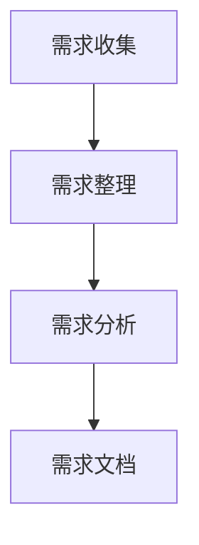

                 

# 如何进行有效的用户需求分析

> **关键词：** 用户需求分析、市场调研、需求收集、需求分析框架、用户体验

> **摘要：** 本文将详细探讨如何进行有效的用户需求分析。我们将介绍用户需求分析的重要性，需求分析的方法和步骤，以及如何利用数据分析工具和技术来提升需求分析的准确性和效率。

## 1. 背景介绍

在软件开发和产品设计中，用户需求分析是至关重要的一环。有效的需求分析能够帮助我们理解用户需求，明确产品功能和设计方向，从而提高产品的市场竞争力。然而，用户需求分析并非易事，它需要深入理解用户行为、需求和期望，并通过系统的方法和工具进行数据收集和分析。

本文旨在提供一套全面的需求分析框架和方法，帮助读者掌握有效的用户需求分析方法，提升产品设计和开发的质量。

## 2. 核心概念与联系

在进行用户需求分析之前，我们首先需要明确几个核心概念：

### 2.1 需求与需求分析

**需求**：需求是指用户期望产品或系统能够实现的功能和提供的服务。

**需求分析**：需求分析是指通过一系列方法和工具，系统地收集、分析和整理用户需求，以便更好地指导产品设计和开发。

### 2.2 用户需求来源

用户需求可以从多个渠道收集，包括：

- **用户访谈**：直接与用户进行面对面的交流，了解他们的需求和期望。
- **问卷调查**：通过在线或纸质问卷，广泛收集用户反馈。
- **市场调研**：通过市场调研报告，了解行业趋势和竞争对手的产品情况。
- **用户行为数据分析**：通过分析用户行为数据，如网站流量、用户点击路径等，了解用户的行为模式和偏好。

### 2.3 需求分析流程

需求分析通常包括以下几个步骤：

- **需求收集**：通过各种渠道收集用户需求。
- **需求整理**：对收集到的需求进行分类、筛选和排序。
- **需求分析**：深入理解每个需求的具体内容和潜在价值。
- **需求文档**：将分析结果整理成文档，作为产品设计和开发的依据。

### 2.4 Mermaid 流程图

以下是一个简单的需求分析流程的 Mermaid 流程图：



## 3. 核心算法原理 & 具体操作步骤

### 3.1 需求收集

**步骤1**：确定需求收集的目标和范围。

**步骤2**：选择合适的需求收集方法，如用户访谈、问卷调查、市场调研等。

**步骤3**：制定访谈提纲或问卷，确保问题具有针对性和有效性。

**步骤4**：进行需求收集，收集到足够的数据。

### 3.2 需求整理

**步骤1**：对收集到的需求进行初步筛选，排除重复和无价值的需求。

**步骤2**：对剩余的需求进行分类，如功能需求、性能需求、用户体验需求等。

**步骤3**：对每个需求进行优先级排序，以便后续分析和实施。

### 3.3 需求分析

**步骤1**：对每个需求进行深入分析，理解其具体内容和潜在价值。

**步骤2**：评估每个需求的可行性，如技术实现难度、资源需求等。

**步骤3**：制定需求分析报告，详细描述每个需求的背景、目的、内容和实现方案。

### 3.4 需求文档

**步骤1**：根据需求分析结果，编写需求文档。

**步骤2**：确保需求文档的准确性和完整性，便于后续的产品设计和开发。

## 4. 数学模型和公式 & 详细讲解 & 举例说明

### 4.1 数学模型

在需求分析中，我们可以使用一些数学模型来评估需求的优先级和可行性。以下是一个简单的需求优先级评估模型：

$$
优先级 = f(需求价值，实现难度，资源需求)
$$

其中，需求价值、实现难度和资源需求分别表示需求的重要程度、实现难度和资源消耗。

### 4.2 举例说明

假设我们有两个需求：

**需求A**：实现一个用户登录功能，需求价值较高，实现难度较低，资源需求适中。

**需求B**：实现一个用户行为分析功能，需求价值较高，实现难度较高，资源需求较高。

根据上述模型，我们可以计算两个需求的优先级：

$$
优先级(A) = f(0.8, 0.3, 0.5) = 0.8 \times 0.3 \times 0.5 = 0.12
$$

$$
优先级(B) = f(0.8, 0.7, 0.8) = 0.8 \times 0.7 \times 0.8 = 0.448
$$

根据计算结果，需求B的优先级高于需求A。

## 5. 项目实战：代码实际案例和详细解释说明

### 5.1 开发环境搭建

为了演示用户需求分析的过程，我们将在一个简单的Web项目中应用需求分析方法。首先，我们需要搭建一个基本的Web开发环境。

**步骤1**：安装Node.js和npm。

**步骤2**：使用npm创建一个新的项目。

```bash
npm create-react-app user-require-analysis
```

**步骤3**：进入项目目录。

```bash
cd user-require-analysis
```

### 5.2 源代码详细实现和代码解读

**步骤1**：在项目中创建一个用于收集用户需求的表单。

```jsx
// src/UserRequirementsForm.js

import React, { useState } from 'react';

const UserRequirementsForm = () => {
  const [requirements, setRequirements] = useState([]);

  const handleRequirementChange = (index, value) => {
    const newRequirements = [...requirements];
    newRequirements[index] = value;
    setRequirements(newRequirements);
  };

  const addRequirement = () => {
    setRequirements([...requirements, '']);
  };

  return (
    <div>
      {requirements.map((requirement, index) => (
        <div key={index}>
          <input
            type="text"
            value={requirement}
            onChange={(e) => handleRequirementChange(index, e.target.value)}
          />
        </div>
      ))}
      <button onClick={addRequirement}>添加需求</button>
    </div>
  );
};

export default UserRequirementsForm;
```

**步骤2**：创建一个用于显示和排序用户需求的组件。

```jsx
// src/UserRequirementsList.js

import React from 'react';

const UserRequirementsList = ({ requirements }) => {
  const sortedRequirements = requirements.sort();

  return (
    <ul>
      {sortedRequirements.map((requirement, index) => (
        <li key={index}>{requirement}</li>
      ))}
    </ul>
  );
};

export default UserRequirementsList;
```

**步骤3**：在主组件中使用上述组件，并添加需求分析的功能。

```jsx
// src/App.js

import React, { useState } from 'react';
import UserRequirementsForm from './UserRequirementsForm';
import UserRequirementsList from './UserRequirementsList';

const App = () => {
  const [requirements, setRequirements] = useState([]);

  const handleFormSubmit = (newRequirements) => {
    setRequirements([...requirements, ...newRequirements]);
  };

  return (
    <div>
      <h1>用户需求分析</h1>
      <UserRequirementsForm onSubmit={handleFormSubmit} />
      <UserRequirementsList requirements={requirements} />
    </div>
  );
};

export default App;
```

### 5.3 代码解读与分析

上述代码实现了一个简单的用户需求收集和展示功能。用户可以通过表单添加需求，需求会被排序并展示在列表中。以下是代码的关键部分解读：

- **UserRequirementsForm**：这是一个用于收集用户需求的表单组件。它使用 `useState` hook 管理输入状态，并提供了添加和更新需求的功能。

- **UserRequirementsList**：这是一个用于展示用户需求的列表组件。它接收一个 `requirements` 数组作为属性，并使用 `sort` 方法对需求进行排序。

- **App**：这是主组件，它使用 `useState` hook 管理整个应用的需求状态，并在表单和列表组件之间传递数据。

## 6. 实际应用场景

用户需求分析在软件开发和产品设计中有着广泛的应用。以下是一些实际应用场景：

- **Web应用开发**：在开发Web应用时，用户需求分析可以帮助确定功能模块、用户体验和性能要求。

- **移动应用开发**：在移动应用开发中，用户需求分析可以帮助确定应用的核心功能、用户界面和交互设计。

- **产品迭代**：在产品迭代过程中，用户需求分析可以帮助确定新的功能特性、优化现有功能和改进用户体验。

- **项目管理**：在项目管理中，用户需求分析可以帮助制定项目计划和资源分配策略。

## 7. 工具和资源推荐

### 7.1 学习资源推荐

- **书籍**：
  - 《用户体验要素》：提供用户需求分析和产品设计的方法和技巧。
  - 《需求工程》：系统介绍了需求工程的基本概念和方法。

- **论文**：
  - “Requirements Engineering：A Roadmap”：
    - 作者：Briand, L. C., Hefley, W. E., & Parnas, D. L.
    - 简介：概述了需求工程的基本概念和当前的研究进展。

- **博客**：
  - “用户需求分析实践指南”：提供用户需求分析的详细步骤和实践技巧。

### 7.2 开发工具框架推荐

- **需求管理工具**：
  - JIRA：用于项目管理、任务分配和需求跟踪。
  - Trello：提供可视化的任务管理和需求跟踪。

- **数据分析工具**：
  - Google Analytics：用于分析网站流量和用户行为。
  - Mixpanel：提供用户行为分析和用户增长策略。

### 7.3 相关论文著作推荐

- **论文**：
  - “User Requirements Engineering：A Process Perspective”：
    - 作者：Mensch, B.
    - 简介：介绍了用户需求工程的基本过程和方法。

- **著作**：
  - 《软件需求规格说明指南》：
    - 作者：Mayer-Schönberger, V., & Cukier, K.
    - 简介：提供软件需求规格说明的编写技巧和方法。

## 8. 总结：未来发展趋势与挑战

随着技术的发展和市场竞争的加剧，用户需求分析在软件开发和产品设计中的重要性日益凸显。未来，用户需求分析将朝着更加智能化、自动化的方向发展。以下是几个发展趋势和挑战：

### 8.1 智能化需求分析

随着人工智能和机器学习技术的进步，智能化的需求分析工具将能够自动识别用户需求、预测用户行为，并提供建议和优化方案。

### 8.2 多渠道数据分析

用户需求分析将越来越依赖于多渠道数据，如社交媒体、在线评论、用户行为数据等。如何整合和分析这些数据，提取有价值的信息，将是需求分析的一个重要挑战。

### 8.3 个性化需求分析

随着用户个性化需求的增长，如何针对不同用户群体进行精细化需求分析，提供个性化的产品和服务，将是需求分析的一个重要发展方向。

### 8.4 跨领域需求分析

随着企业数字化转型和跨界合作的增加，跨领域需求分析将成为一个重要的需求。如何结合不同领域的知识和经验，进行跨领域需求分析，将是一个挑战。

## 9. 附录：常见问题与解答

### 9.1 如何确保需求收集的准确性？

**解答**：确保需求收集的准确性需要做到以下几点：

- 明确需求收集的目标和范围，确保收集的数据与目标相关。
- 使用结构化的访谈提纲或问卷，避免引导性问题。
- 对收集到的数据进行初步筛选和验证，排除无效数据。

### 9.2 需求分析和项目规划之间有何关系？

**解答**：需求分析是项目规划的重要基础。通过需求分析，我们可以明确产品的功能需求、性能需求和用户体验需求，为项目规划提供依据。项目规划则需要根据需求分析的结果，制定项目的目标和计划，包括资源分配、时间规划和风险控制等。

### 9.3 如何应对不断变化的需求？

**解答**：应对不断变化的需求，可以采取以下策略：

- 采用敏捷开发方法，灵活调整项目计划，快速响应需求变化。
- 保持与用户的持续沟通，及时获取用户反馈，调整需求。
- 建立需求变更管理流程，对需求变更进行评估和审批，确保变更的合理性和可行性。

## 10. 扩展阅读 & 参考资料

- 《需求工程：管理、分析和实施》：提供需求工程的基本概念和实施方法。
- “用户需求分析的挑战与机遇”：探讨用户需求分析面临的挑战和机遇。
- “敏捷需求分析实践指南”：介绍敏捷开发环境下的需求分析方法和技巧。

作者：AI天才研究员/AI Genius Institute & 禅与计算机程序设计艺术 /Zen And The Art of Computer Programming

