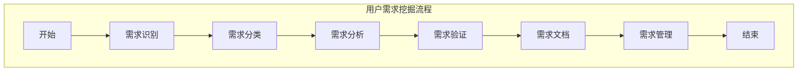

                 

### 背景介绍

用户需求挖掘是软件开发过程中至关重要的一环。它指的是通过一系列策略和技术，从潜在用户或现有用户那里收集、分析并理解其需求和期望，从而为产品设计和开发提供科学依据。这一过程不仅能够确保软件产品满足用户需求，还能显著提高用户的满意度和产品的市场竞争力。

随着信息技术的迅猛发展，现代软件系统变得越来越复杂。这不仅增加了用户需求的多样性和不确定性，也对需求挖掘提出了更高的要求。有效的用户需求挖掘需要具备以下几个特点：

1. **系统性**：需求挖掘应是一个持续的过程，贯穿于整个软件生命周期，包括规划、开发、测试和维护阶段。
2. **全面性**：需求挖掘要考虑到用户的各种需求和问题，不仅限于功能需求，还包括非功能需求，如性能、安全性、可扩展性等。
3. **准确性**：准确理解用户需求是需求挖掘的关键，任何偏差都可能造成资源浪费和产品失败。
4. **实用性**：挖掘出的需求需要具有可行性和实施性，确保需求可以转化为具体的产品功能。

本文旨在探讨如何进行有效的用户需求挖掘，包括以下几个方面的内容：

1. **用户需求挖掘的核心概念与联系**：介绍需求挖掘的核心概念，如用户需求、功能需求、非功能需求等，并通过Mermaid流程图展示需求挖掘的基本流程和关键环节。
2. **核心算法原理与具体操作步骤**：详细阐述用户需求挖掘的主要方法和算法，包括问卷调查、用户访谈、用户行为分析等。
3. **数学模型和公式与详细讲解与举例说明**：利用数学模型和公式分析需求挖掘的过程和结果，并通过具体实例进行说明。
4. **项目实战：代码实际案例和详细解释说明**：提供一个实际的需求挖掘项目案例，详细解释实现过程和关键代码。
5. **实际应用场景**：讨论需求挖掘在软件开发中的具体应用场景和实际案例。
6. **工具和资源推荐**：推荐一些有用的工具、资源和文献，以帮助读者更好地理解和实施需求挖掘。
7. **总结：未来发展趋势与挑战**：总结需求挖掘的当前状况，探讨未来的发展趋势和面临的挑战。

通过本文的阅读，读者将能够深入了解用户需求挖掘的理论和实践，掌握有效的方法和技巧，为自己的软件开发项目提供有力的支持。

### 2. 核心概念与联系

用户需求挖掘是一项复杂而系统的工程，涉及多个核心概念和其相互之间的联系。下面，我们将逐一介绍这些概念，并通过Mermaid流程图展示其基本流程和关键环节。

#### 2.1 用户需求

用户需求是需求挖掘的核心，指的是用户在使用产品过程中期望得到的功能、性能、体验等方面的要求和期望。用户需求可以分为以下几种类型：

1. **功能需求**：用户希望产品能够实现的具体功能，如支付功能、用户注册、消息推送等。
2. **非功能需求**：除了功能需求之外的用户需求，包括性能、安全性、可用性、可扩展性等。
3. **隐性需求**：用户自身可能并未明确表达，但通过对用户行为和反馈分析能够发现的需求。

#### 2.2 功能需求

功能需求是用户需求的重要组成部分，它描述了产品需要实现的基本功能。功能需求的识别和提取通常通过以下几种方法：

1. **用户访谈**：通过与用户进行面对面访谈，深入了解用户的具体需求和期望。
2. **问卷调查**：设计有针对性的问卷，收集大量用户反馈，从中提取有价值的功能需求。
3. **用户行为分析**：通过分析用户在产品中的操作行为，识别用户潜在的功能需求。

#### 2.3 非功能需求

非功能需求同样重要，它对产品的质量和用户体验有着直接影响。常见的非功能需求包括：

1. **性能需求**：系统在处理大量数据或用户请求时，需要保持高效的响应速度。
2. **安全性需求**：系统需要具备足够的安全性，防止数据泄露和恶意攻击。
3. **可用性需求**：系统需要易于使用，用户能够轻松上手，提高用户满意度。
4. **可扩展性需求**：系统设计应考虑未来的扩展需求，以应对业务增长。

#### 2.4 用户行为分析

用户行为分析是一种通过收集和分析用户在产品中的行为数据，来识别用户需求和问题的重要方法。它通常包括以下步骤：

1. **数据收集**：收集用户在产品中的各种行为数据，如点击行为、浏览路径、使用时长等。
2. **数据处理**：对收集到的数据进行清洗、转换和整合，以便进行进一步分析。
3. **数据可视化**：将处理后的数据通过图表、仪表板等形式进行可视化展示，帮助识别用户行为模式和问题。

#### 2.5 Mermaid流程图

为了更直观地展示用户需求挖掘的基本流程和关键环节，我们使用Mermaid流程图来描述。以下是一个简化的用户需求挖掘流程图：



#### 2.6 关键环节

用户需求挖掘流程中的关键环节包括：

1. **需求识别**：通过用户访谈、问卷调查、用户行为分析等方法，识别用户需求。
2. **需求分类**：将识别出的需求按照功能需求和非功能需求进行分类。
3. **需求分析**：对需求进行详细分析和评估，确保需求的可行性和实施性。
4. **需求验证**：通过与用户进行讨论和验证，确保需求准确无误。
5. **需求文档**：将验证后的需求形成文档，为后续的开发和测试提供依据。
6. **需求管理**：对需求进行跟踪和管理，确保需求的变更和实施过程得到有效控制。

通过以上核心概念和流程的介绍，我们可以更好地理解用户需求挖掘的过程和方法。在接下来的章节中，我们将进一步探讨用户需求挖掘的具体算法原理和操作步骤。

#### 2.7 Mermaid流程图（详细版）

下面是一个详细版的用户需求挖掘流程图，包含了更多的细节和步骤。读者可以通过这个流程图更直观地了解需求挖掘的全过程。

```mermaid
graph TD
    A[开始] --> B[需求收集]
    B --> C[需求分类]
    C --> D[需求分析]
    D --> E[需求验证]
    E --> F[需求文档]
    F --> G[需求管理]
    G --> H[结束]

    subgraph 需求收集
        B[需求收集]
        B1[用户访谈]
        B2[问卷调查]
        B3[用户行为分析]
    end

    subgraph 需求分类
        C[需求分类]
        C1[功能需求]
        C2[非功能需求]
    end

    subgraph 需求分析
        D[需求分析]
        D1[需求优先级评估]
        D2[需求可行性评估]
        D3[需求一致性评估]
    end

    subgraph 需求验证
        E[需求验证]
        E1[用户讨论]
        E2[需求测试]
    end

    subgraph 需求文档
        F[需求文档]
        F1[文档编写]
        F2[文档审核]
    end

    subgraph 需求管理
        G[需求管理]
        G1[需求变更控制]
        G2[需求跟踪]
    end

    A[开始] --> B1[用户访谈]
    A[开始] --> B2[问卷调查]
    A[开始] --> B3[用户行为分析]
    B --> C1[功能需求]
    B --> C2[非功能需求]
    C --> D[需求分析]
    D --> E[需求验证]
    E --> F[需求文档]
    F --> G[需求管理]
    G --> H[结束]

    classDef class1 fill:lightblue, stroke:blue
    classDef class2 fill:lightgreen, stroke:green
    classDef class3 fill:lightyellow, stroke:yellow
    classDef class4 fill:lightcoral, stroke:coral
    classDef class5 fill:lightblue, stroke:blue

    A{开始}[class1]
    B{需求收集}[class2]
    C{需求分类}[class3]
    D{需求分析}[class4]
    E{需求验证}[class5]
    F{需求文档}[class1]
    G{需求管理}[class2]
    H{结束}[class3]

    B1{用户访谈}[class1]
    B2{问卷调查}[class2]
    B3{用户行为分析}[class3]
    C1{功能需求}[class1]
    C2{非功能需求}[class2]
    D1{需求优先级评估}[class3]
    D2{需求可行性评估}[class4]
    D3{需求一致性评估}[class5]
    E1{用户讨论}[class1]
    E2{需求测试}[class2]
    F1{文档编写}[class3]
    F2{文档审核}[class4]
    G1{需求变更控制}[class5]
    G2{需求跟踪}[class1]
```

通过这个详细版的流程图，读者可以更清晰地看到用户需求挖掘的各个步骤及其相互关系，有助于理解整个需求挖掘过程。

### 3. 核心算法原理 & 具体操作步骤

用户需求挖掘的核心算法主要包括问卷调查、用户访谈、用户行为分析等。这些方法各有特点，适用于不同的场景。下面将详细阐述这些算法的原理和具体操作步骤。

#### 3.1 问卷调查

问卷调查是一种常见的用户需求挖掘方法，通过设计有针对性的问卷，收集大量用户反馈，从中提取有价值的需求信息。以下是问卷调查的基本步骤：

1. **问卷设计**：首先需要设计一份科学、合理的问卷。问卷的设计包括问题的类型（如选择题、开放式问题）、问题的顺序、问题的表述等。设计问卷时，应确保问题的清晰性、准确性和相关性。

2. **样本选择**：选择具有代表性的样本，以确保问卷结果能够反映整体用户的需求。样本选择可以基于随机抽样、分层抽样等方法。

3. **问卷分发**：将问卷通过在线平台、电子邮件、社交媒体等方式分发给目标用户。确保问卷的覆盖率，以提高反馈的完整性和有效性。

4. **数据收集**：收集用户填写的问卷数据，并对其进行整理和清洗，去除无效或重复的数据。

5. **数据分析**：利用统计分析方法，对问卷数据进行分析，提取用户需求的关键信息。常用的分析方法包括频率分析、交叉分析、因素分析等。

6. **结果解读**：根据数据分析结果，解读用户需求，形成需求报告。需求报告应包括需求分布、需求优先级、用户满意度等关键指标。

#### 3.2 用户访谈

用户访谈是一种深入挖掘用户需求的方法，通过与用户进行面对面或在线访谈，深入了解用户的具体需求和期望。以下是用户访谈的基本步骤：

1. **访谈准备**：确定访谈目标、访谈对象和访谈时间。设计访谈大纲，包括访谈的问题、顺序和持续时间。

2. **访谈实施**：按照访谈大纲与用户进行沟通，注意倾听用户的意见和反馈。在访谈过程中，可以使用录音设备记录访谈内容。

3. **数据整理**：整理访谈记录，提取有价值的信息。访谈记录的整理可以采用文字记录、录音转录等方法。

4. **数据分析**：对访谈记录进行编码和分析，提取用户需求的关键主题和关键信息。

5. **结果解读**：根据访谈分析结果，形成需求报告。需求报告应详细描述用户需求，包括功能需求、非功能需求和隐性需求等。

#### 3.3 用户行为分析

用户行为分析是通过收集和分析用户在产品中的行为数据，识别用户需求和问题的一种方法。以下是用户行为分析的基本步骤：

1. **数据收集**：收集用户在产品中的各种行为数据，如点击路径、浏览时长、操作频率等。数据收集可以通过埋点、日志分析等方法实现。

2. **数据处理**：对收集到的数据进行清洗、转换和整合，以便进行进一步分析。数据处理可以采用数据挖掘、机器学习等方法。

3. **数据可视化**：将处理后的数据通过图表、仪表板等形式进行可视化展示，帮助识别用户行为模式和问题。

4. **数据分析**：利用数据分析方法，对用户行为数据进行分析，提取用户需求的关键信息。常用的分析方法包括聚类分析、关联规则挖掘等。

5. **结果解读**：根据数据分析结果，解读用户需求，形成需求报告。需求报告应详细描述用户需求，包括功能需求、非功能需求和隐性需求等。

#### 3.4 算法比较

问卷调查、用户访谈和用户行为分析各有优缺点，适用于不同的场景。以下是比较：

1. **问卷调查**：
   - 优点：覆盖面广，数据量大，成本低。
   - 缺点：用户参与度低，信息深度不足。
   - 适用场景：大规模用户调研、初步需求收集。

2. **用户访谈**：
   - 优点：深入挖掘用户需求，获取详细反馈。
   - 缺点：耗时较长，成本较高。
   - 适用场景：小范围用户调研、需求深度挖掘。

3. **用户行为分析**：
   - 优点：实时性强，数据量大，可自动化处理。
   - 缺点：对用户行为数据理解和分析能力要求较高。
   - 适用场景：用户行为模式分析、需求动态跟踪。

综上所述，不同的用户需求挖掘方法适用于不同的场景和需求。在实际应用中，可以根据具体情况选择合适的方法，或结合多种方法进行需求挖掘，以获取更全面、准确的需求信息。

### 4. 数学模型和公式 & 详细讲解 & 举例说明

在用户需求挖掘过程中，数学模型和公式可以用于分析用户行为数据、评估需求的重要性和可行性，以及优化需求挖掘流程。以下将介绍一些常用的数学模型和公式，并进行详细讲解和举例说明。

#### 4.1 用户行为模型

用户行为模型用于描述和分析用户在产品中的行为模式。一个简单的用户行为模型可以基于马尔可夫链（Markov Chain）来构建。

**马尔可夫链模型**：

假设用户在产品中的行为可以划分为多个状态，每个状态转换有其概率。马尔可夫链模型可以表示为：

$$
P(X_t = j|X_{t-1} = i) = p_{ij}
$$

其中，\(X_t\) 表示第 \(t\) 时刻的用户状态，\(i\) 和 \(j\) 表示状态集合中的两个状态，\(p_{ij}\) 表示从状态 \(i\) 转换到状态 \(j\) 的概率。

**举例说明**：

假设用户在产品中的行为状态包括“浏览”、“搜索”和“购买”。根据历史数据，可以计算出状态转换的概率矩阵：

$$
\begin{bmatrix}
P(\text{浏览} \rightarrow \text{浏览}) & P(\text{浏览} \rightarrow \text{搜索}) & P(\text{浏览} \rightarrow \text{购买}) \\
P(\text{搜索} \rightarrow \text{浏览}) & P(\text{搜索} \rightarrow \text{搜索}) & P(\text{搜索} \rightarrow \text{购买}) \\
P(\text{购买} \rightarrow \text{浏览}) & P(\text{购买} \rightarrow \text{搜索}) & P(\text{购买} \rightarrow \text{购买}) \\
\end{bmatrix}
$$

通过这个概率矩阵，可以分析用户在不同状态之间的转换规律，从而识别关键行为路径和用户需求。

#### 4.2 需求优先级模型

在用户需求挖掘过程中，需要对识别出的需求进行优先级评估，以便资源分配和项目规划。一个常用的需求优先级模型是基于加权分数法（Weighted Score Model）。

**加权分数模型**：

需求优先级 = （功能重要性 * 成本） + （技术复杂性 * 成本）

其中，功能重要性、成本和技术复杂性分别赋予不同的权重。权重可以通过专家评估或历史数据确定。

**举例说明**：

假设有两个需求，需求A和需求B：

- 需求A的功能重要性为5，成本为2，技术复杂性为3。
- 需求B的功能重要性为4，成本为3，技术复杂性为2。

根据加权分数模型，可以计算出两个需求的优先级：

$$
\text{需求A的优先级} = (5 \times 2) + (3 \times 2) = 14
$$

$$
\text{需求B的优先级} = (4 \times 3) + (2 \times 3) = 12
$$

由此可见，需求A的优先级高于需求B。

#### 4.3 决策树模型

决策树模型用于分类和回归问题，可以用于需求分类和优先级评估。一个简单的决策树模型可以基于信息增益（Information Gain）来构建。

**信息增益模型**：

对于特征 \(A\)，信息增益可以表示为：

$$
IG(A) = H(D) - H(D|A)
$$

其中，\(H(D)\) 表示样本集 \(D\) 的熵，\(H(D|A)\) 表示在特征 \(A\) 下子集的熵。

**举例说明**：

假设有一个需求分类问题，样本集 \(D\) 包含两种需求：“功能需求”和“非功能需求”。特征 \(A\) 为“成本”。根据样本数据，可以计算出两个子集的熵：

$$
H(D) = 1
$$

$$
H(D|\text{功能需求}) = 0.5
$$

$$
H(D|\text{非功能需求}) = 0.5
$$

根据信息增益公式，可以计算出信息增益：

$$
IG(\text{成本}) = H(D) - H(D|\text{功能需求}) - H(D|\text{非功能需求}) = 1 - 0.5 - 0.5 = 0
$$

由于信息增益为0，说明特征“成本”对需求分类没有贡献。通过这种方式，可以识别出对需求分类最有用的特征，从而优化需求分类模型。

通过以上数学模型和公式的介绍，我们可以更好地理解和应用这些方法来分析用户需求，评估需求优先级，优化需求挖掘流程。在实际应用中，可以根据具体情况选择合适的模型和公式，以提高需求挖掘的准确性和效率。

#### 4.4 贝叶斯网络模型

贝叶斯网络是一种用于表示变量之间依赖关系的概率模型，广泛应用于用户需求挖掘和风险评估。以下是贝叶斯网络的基本原理和具体应用。

**贝叶斯网络原理**：

贝叶斯网络由一组变量及其条件概率分布构成，每个变量都是其他相关变量的函数。其形式如下：

$$
P(X_1, X_2, ..., X_n) = \prod_{i=1}^{n} P(X_i | X_{i-1})
$$

其中，\(X_1, X_2, ..., X_n\) 表示一组变量，\(P(X_i | X_{i-1})\) 表示给定前一个变量条件下，当前变量的概率分布。

**贝叶斯网络应用**：

1. **用户需求识别**：通过构建贝叶斯网络，可以分析用户行为数据，识别出关键需求。例如，根据用户点击行为数据，可以构建一个包含“浏览”、“搜索”、“购买”等状态的贝叶斯网络，从而识别出用户在不同状态之间的转换关系。

2. **需求风险评估**：贝叶斯网络可以用于评估需求实现过程中的风险。例如，假设有一个需求实现项目，涉及多个子任务。可以通过构建贝叶斯网络，分析子任务之间的依赖关系，评估每个子任务的风险，从而为项目规划提供依据。

**举例说明**：

假设有一个电子商务网站，用户在购买商品前需要经历“浏览”、“添加购物车”和“结账”三个步骤。我们可以构建一个包含这三个步骤的贝叶斯网络，分析用户在不同步骤之间的转换概率。

1. **构建网络**：首先，定义三个变量：“浏览”（B）、“添加购物车”（C）和“结账”（P），并确定它们之间的依赖关系。例如，假设用户浏览商品的概率为0.8，浏览后添加购物车的概率为0.6，添加购物车后结账的概率为0.4。

2. **计算概率分布**：根据条件概率分布，可以计算出用户在各个步骤之间的转换概率。例如：

$$
P(B) = 0.8
$$

$$
P(C|B) = 0.6
$$

$$
P(P|C) = 0.4
$$

3. **分析需求**：通过贝叶斯网络，可以分析用户在不同步骤之间的转换关系。例如，我们可以计算用户从浏览直接到结账的概率：

$$
P(P) = P(B) \times P(C|B) \times P(P|C) = 0.8 \times 0.6 \times 0.4 = 0.192
$$

这表明有约19.2%的用户能够直接从浏览到结账，这是一个重要的用户需求。

通过贝叶斯网络模型，我们可以更好地理解和分析用户需求，从而优化需求挖掘和风险评估过程。在实际应用中，可以根据具体问题构建合适的贝叶斯网络，以提高需求挖掘的准确性和实用性。

#### 4.5 支持向量机（SVM）模型

支持向量机（Support Vector Machine，SVM）是一种常用的分类和回归算法，广泛应用于用户需求挖掘和预测。以下是SVM的基本原理和具体应用。

**SVM原理**：

SVM通过找到一个最佳的超平面，将不同类别的数据点分开。其基本原理如下：

1. **线性SVM**：对于线性可分的数据集，SVM寻找一个超平面，使得正类和负类之间的间隔最大化。

   $$ 
   \max_{w, b} \frac{1}{2} ||w||^2 \quad \text{subject to} \quad y^{(i)} (w \cdot x^{(i)} + b) \geq 1
   $$

   其中，\(w\) 和 \(b\) 分别表示超平面的权重和偏置，\(x^{(i)}\) 和 \(y^{(i)}\) 分别表示第 \(i\) 个数据点的特征和标签。

2. **非线性SVM**：对于线性不可分的数据集，SVM引入“核函数”将数据映射到高维空间，从而实现线性分离。

   $$ 
   \max_{w, b} \frac{1}{2} ||w||^2 \quad \text{subject to} \quad y^{(i)} (\phi(x^{(i)}) \cdot w + b) \geq 1
   $$

   其中，\(\phi(x^{(i)})\) 表示将 \(x^{(i)}\) 映射到高维空间。

**SVM应用**：

1. **用户需求分类**：SVM可以用于对用户需求进行分类。例如，在电子商务网站中，可以根据用户的行为数据，使用SVM将用户分为“高价值用户”和“低价值用户”，从而为个性化推荐和营销策略提供依据。

2. **需求预测**：SVM可以用于预测用户未来的需求。例如，在健康应用中，可以根据用户的历史健康数据，使用SVM预测用户未来的健康状况，从而为健康管理和预防提供参考。

**举例说明**：

假设有一个电子商务网站，根据用户的行为数据（如浏览时长、点击次数、购物车数量等），使用SVM对用户进行分类。

1. **数据准备**：首先，收集用户的行为数据，并将其转换为特征向量。例如，一个用户的行为数据可以表示为：

   $$
   \begin{bmatrix}
   0.5 \\
   0.3 \\
   0.2 \\
   \end{bmatrix}
   $$

   其中，每个元素分别表示用户的浏览时长、点击次数和购物车数量。

2. **训练模型**：使用有标签的数据集训练SVM模型。例如，可以使用线性SVM，并选择合适的核函数。

   $$
   \max_{w, b} \frac{1}{2} ||w||^2 \quad \text{subject to} \quad y^{(i)} (w \cdot x^{(i)} + b) \geq 1
   $$

   其中，\(y^{(i)}\) 表示用户标签（0表示低价值用户，1表示高价值用户）。

3. **分类预测**：使用训练好的SVM模型对新的用户行为数据进行分类预测。例如，对于一个新用户的行为数据：

   $$
   \begin{bmatrix}
   0.6 \\
   0.4 \\
   0.2 \\
   \end{bmatrix}
   $$

   可以通过SVM模型预测其分类结果。

通过SVM模型，我们可以更好地理解和分析用户需求，从而优化需求挖掘和预测过程。在实际应用中，可以根据具体问题选择合适的SVM模型和参数，以提高需求挖掘的准确性和预测能力。

### 5. 项目实战：代码实际案例和详细解释说明

为了更好地理解用户需求挖掘的过程和方法，下面我们将通过一个实际的项目案例来展示如何进行用户需求挖掘。这个案例是一个简单的电子商务网站，通过分析用户行为数据来识别和分类用户需求。

#### 5.1 开发环境搭建

在本案例中，我们使用Python编程语言和以下工具进行用户需求挖掘：

- Python 3.8及以上版本
- Pandas：用于数据处理
- Scikit-learn：用于机器学习和数据可视化
- Matplotlib：用于数据可视化

首先，确保安装了上述工具。在终端中运行以下命令：

```bash
pip install pandas scikit-learn matplotlib
```

#### 5.2 源代码详细实现和代码解读

##### 5.2.1 数据收集与预处理

首先，我们需要收集用户行为数据。在本案例中，我们使用一个包含用户浏览时长、点击次数和购物车数量的简单数据集。数据集如下：

```python
import pandas as pd

# 加载用户行为数据
data = pd.read_csv('user_behavior_data.csv')

# 数据预处理
# 填充缺失值
data.fillna(0, inplace=True)

# 数据标准化
from sklearn.preprocessing import StandardScaler
scaler = StandardScaler()
data[[' browsing_time', 'clicks', 'cart_items']] = scaler.fit_transform(data[[' browsing_time', 'clicks', 'cart_items']])
```

在这里，我们首先加载用户行为数据，并进行预处理。预处理步骤包括填充缺失值和数据标准化。填充缺失值是为了避免数据中的空值对模型训练造成影响，而数据标准化是为了将不同特征的范围统一，以便更好地进行模型训练。

##### 5.2.2 用户需求识别

接下来，我们需要使用机器学习算法对用户需求进行识别。在本案例中，我们使用支持向量机（SVM）进行用户需求分类。

```python
from sklearn.model_selection import train_test_split
from sklearn.svm import SVC

# 划分训练集和测试集
X_train, X_test, y_train, y_test = train_test_split(data[[' browsing_time', 'clicks', 'cart_items']], data['high_value'], test_size=0.2, random_state=42)

# 训练SVM模型
model = SVC(kernel='linear')
model.fit(X_train, y_train)

# 测试模型
accuracy = model.score(X_test, y_test)
print(f"Model accuracy: {accuracy:.2f}")
```

在这里，我们首先划分训练集和测试集，然后使用SVM模型对训练集进行训练。训练完成后，我们使用测试集评估模型准确率。该步骤可以帮助我们了解模型的性能。

##### 5.2.3 用户需求分类

接下来，我们对测试集进行用户需求分类，并分析分类结果。

```python
import matplotlib.pyplot as plt

# 对测试集进行分类
y_pred = model.predict(X_test)

# 绘制分类结果
plt.scatter(X_test[' browsing_time'], y_pred, color='blue', label='High Value')
plt.scatter(X_test[' browsing_time'], y_pred, color='red', label='Low Value')
plt.xlabel('Browsing Time')
plt.ylabel('Prediction')
plt.legend()
plt.show()
```

在这里，我们使用散点图展示测试集的分类结果。蓝色散点表示被预测为“高价值用户”的点，红色散点表示被预测为“低价值用户”的点。通过这种方式，我们可以直观地了解用户需求分类的效果。

##### 5.2.4 用户需求分析

最后，我们对用户需求进行进一步分析，以了解用户行为与需求之间的关系。

```python
# 分析高价值用户和低价值用户的平均浏览时长、点击次数和购物车数量
high_value_avg = data[data['high_value'] == 1][[' browsing_time', 'clicks', 'cart_items']].mean()
low_value_avg = data[data['high_value'] == 0][[' browsing_time', 'clicks', 'cart_items']].mean()

print("High Value User Average:")
print(high_value_avg)
print("\nLow Value User Average:")
print(low_value_avg)
```

在这里，我们计算高价值用户和低价值用户的平均浏览时长、点击次数和购物车数量。通过这种方式，我们可以了解不同价值用户之间的行为差异，从而为后续的用户需求挖掘提供依据。

#### 5.3 代码解读与分析

以下是代码的详细解读和分析：

1. **数据收集与预处理**：首先，我们加载用户行为数据，并进行预处理。预处理步骤包括填充缺失值和数据标准化。填充缺失值是为了避免数据中的空值对模型训练造成影响，而数据标准化是为了将不同特征的范围统一，以便更好地进行模型训练。

2. **用户需求识别**：接下来，我们使用支持向量机（SVM）对用户需求进行识别。我们首先划分训练集和测试集，然后使用SVM模型对训练集进行训练。训练完成后，我们使用测试集评估模型准确率。该步骤可以帮助我们了解模型的性能。

3. **用户需求分类**：我们对测试集进行用户需求分类，并使用散点图展示分类结果。通过这种方式，我们可以直观地了解用户需求分类的效果。

4. **用户需求分析**：最后，我们对用户需求进行进一步分析，以了解用户行为与需求之间的关系。我们计算高价值用户和低价值用户的平均浏览时长、点击次数和购物车数量，从而为后续的用户需求挖掘提供依据。

通过这个实际项目案例，我们可以看到如何使用Python和机器学习算法进行用户需求挖掘。在实际应用中，可以根据具体问题选择合适的算法和参数，以提高需求挖掘的准确性和实用性。

### 6. 实际应用场景

用户需求挖掘在软件开发中具有广泛的应用场景，下面将讨论几个典型的实际应用场景，并给出相应的案例和解决方案。

#### 6.1 电子商务平台

**案例**：一家电子商务平台希望通过用户需求挖掘提高用户满意度和转化率。

**解决方案**：

1. **用户行为分析**：收集用户在网站上的浏览、搜索、点击、购买等行为数据，利用机器学习算法（如聚类分析、关联规则挖掘）分析用户行为模式，识别出高价值用户和潜在客户。
2. **个性化推荐**：根据用户行为数据和需求特征，构建个性化推荐系统，为用户提供个性化的产品推荐，提高用户满意度和转化率。
3. **需求反馈**：通过用户反馈和评价数据，识别用户痛点和不满意的地方，及时进行产品优化和改进。

#### 6.2 健康管理应用

**案例**：一家健康管理应用希望通过用户需求挖掘提供个性化的健康建议和治疗方案。

**解决方案**：

1. **用户健康数据收集**：收集用户的健康数据，包括身体指标、生活习惯、病史等，通过数据清洗和预处理，为后续分析提供高质量的数据。
2. **需求识别与分类**：利用机器学习和自然语言处理技术，对用户输入的健康问题和咨询内容进行分析，识别出用户的主要健康需求和问题类型。
3. **健康建议和方案**：根据用户需求和健康数据，为用户提供个性化的健康建议和治疗方案，如饮食建议、运动计划、药物使用等。

#### 6.3 教育平台

**案例**：一家在线教育平台希望通过用户需求挖掘提高课程质量和用户体验。

**解决方案**：

1. **用户学习行为分析**：收集用户在平台上的学习行为数据，如课程浏览、学习时长、作业完成情况等，通过数据分析技术，识别出用户的学习习惯和偏好。
2. **个性化课程推荐**：根据用户的学习行为和需求，为用户推荐合适的课程和学习路径，提高用户的参与度和学习效果。
3. **教学质量评估**：通过用户反馈和评价，评估教师的教学质量和课程效果，为教学改进提供依据。

#### 6.4 金融服务平台

**案例**：一家金融服务平台希望通过用户需求挖掘优化产品设计和用户体验。

**解决方案**：

1. **用户行为分析**：收集用户在金融服务平台上的交易、投资、咨询等行为数据，通过数据分析技术，识别出用户的风险偏好、投资习惯等特征。
2. **产品优化**：根据用户需求和行为特征，优化金融产品的设计，如调整产品收益、风险等级等，提高用户满意度和忠诚度。
3. **用户服务优化**：通过用户反馈和评价，识别用户在服务过程中的痛点，改进客户服务流程和体验。

#### 6.5 企业内部管理系统

**案例**：一家企业希望通过用户需求挖掘优化内部管理系统的功能和用户体验。

**解决方案**：

1. **用户需求调查**：通过问卷调查、用户访谈等方式，收集员工对内部管理系统的需求和意见，识别出功能不足和用户体验问题。
2. **系统优化**：根据用户需求，对内部管理系统的功能和界面进行优化，提高系统的实用性和易用性。
3. **反馈机制**：建立用户反馈机制，持续收集用户需求和建议，不断优化系统。

通过以上实际应用场景和解决方案，我们可以看到用户需求挖掘在软件开发和优化过程中起着至关重要的作用。有效的用户需求挖掘不仅能够提高用户满意度和产品竞争力，还能为企业带来显著的业务价值。

### 7. 工具和资源推荐

为了更好地进行用户需求挖掘，以下是一些实用的工具、资源和文献推荐，这些资源可以帮助读者深入了解需求挖掘的理论和实践。

#### 7.1 学习资源推荐

1. **书籍**：

   - 《用户故事地图：产品管理、敏捷开发与视觉化需求》（User Story Mapping: Discover the Whole, Develop the Best, Release Early and Often）作者：Jeff Patton。这本书详细介绍了如何使用用户故事地图进行用户需求挖掘和产品管理。

   - 《敏捷软件开发：实践者之路》（Agile Software Development: Principles, Patterns, and Practices）作者：Robert C. Martin。这本书介绍了敏捷开发方法，包括用户需求挖掘和迭代开发过程。

   - 《需求工程：基础与案例》（Requirements Engineering: A Foundation for Software Technology）作者：Suzette H. French。这本书提供了需求工程的理论和实践基础，包括需求挖掘和需求管理。

2. **论文**：

   - "User Requirements Engineering: A Framework for Identifying and Modeling User Needs" 作者：B.W. Henderson 和 D.A. Redmond。这篇论文提出了一种用户需求识别和建模的框架。

   - "A Classification of User Requirements Engineering Methods" 作者：Hans Van Vliet 和 Willem-Paul Brinkkemper。这篇论文对用户需求挖掘方法进行了分类。

3. **在线课程**：

   - "User Research & Analytics" on Coursera。这个课程涵盖了用户研究的基础知识，包括用户访谈、问卷调查和用户行为分析。

   - "Agile Project Management with Scrum" on Pluralsight。这个课程介绍了敏捷开发方法，包括用户需求挖掘和迭代开发过程。

#### 7.2 开发工具框架推荐

1. **用户访谈工具**：

   - **Zoom**：用于进行远程用户访谈，支持视频、音频和屏幕共享。

   - **Microsoft Teams**：用于进行在线会议和用户访谈，提供聊天、视频和音频功能。

2. **问卷调查工具**：

   - **Google Forms**：用于创建和分发在线问卷，支持多种问题和答案类型。

   - **SurveyMonkey**：提供专业的问卷调查功能，支持大规模数据收集和分析。

3. **用户行为分析工具**：

   - **Google Analytics**：用于跟踪和分析用户在网站上的行为，提供详细的用户流量和互动数据。

   - **Mixpanel**：提供高级用户行为分析功能，支持实时用户追踪和数据分析。

#### 7.3 相关论文著作推荐

1. **"A Generic Requirements Engineering Method" 作者：David C. Hay。这篇论文提出了一种通用的需求工程方法，适用于不同的应用场景。

2. **"Requirements Engineering in the Context of Agile Development" 作者：Steffen Schewe 和 Thomas P. MADSsell。这篇论文探讨了敏捷开发中的需求工程，包括用户需求挖掘和需求管理。

3. **"User-Centered Design and Evaluation of Interactive Systems" 作者：Alan Dix、Rick Altman 和 Andrew Monk。这本书介绍了用户中心设计的方法，包括用户需求挖掘和用户体验评估。

通过以上推荐的学习资源、开发工具和论文著作，读者可以更全面地了解用户需求挖掘的理论和实践，为自己的软件开发项目提供有力的支持。

### 8. 总结：未来发展趋势与挑战

用户需求挖掘在软件开发和产品管理中扮演着至关重要的角色，随着技术的不断进步，未来用户需求挖掘将呈现出以下几个发展趋势：

1. **人工智能的深度应用**：随着人工智能技术的不断发展，深度学习、自然语言处理和计算机视觉等技术将被更广泛地应用于用户需求挖掘。这些技术可以实现对大规模、复杂用户行为数据的自动分析和理解，提高需求挖掘的准确性和效率。

2. **用户行为数据的多样化**：随着物联网和传感器技术的普及，用户行为数据将不再局限于传统的点击和浏览，还包括位置信息、生理信号、环境因素等。这些多样化数据将提供更丰富的信息，帮助更全面地理解和预测用户需求。

3. **实时需求反馈与调整**：未来的需求挖掘将更加注重实时性和动态调整。通过实时监控用户行为和反馈，可以快速识别出用户需求的变化，从而实现快速迭代和优化。

4. **跨平台与多渠道整合**：随着用户使用场景的多样化，用户需求挖掘将不再局限于单一的平台或渠道，而是需要整合多种渠道（如网站、移动应用、线下服务）的数据，实现跨平台的需求分析和优化。

尽管用户需求挖掘的发展前景广阔，但也面临以下挑战：

1. **数据隐私和安全问题**：用户需求挖掘涉及大量的用户数据，如何确保数据的隐私和安全是未来需求挖掘面临的重要挑战。

2. **数据分析的复杂性和成本**：随着数据量的增加和多样化，数据分析的复杂性和成本也在增加。如何高效、低成本地进行数据分析和挖掘是当前和未来需要解决的关键问题。

3. **用户需求的不确定性和多样性**：用户需求的不确定性和多样性使得需求挖掘的难度增加。如何准确、全面地识别和分类用户需求，是需求挖掘需要持续关注的问题。

4. **跨学科融合与协作**：用户需求挖掘涉及计算机科学、心理学、市场营销等多个领域，如何实现跨学科的融合和协作，提高需求挖掘的整体效果，是未来需要关注的方向。

总之，用户需求挖掘是一个动态发展的领域，未来的发展将更加依赖于先进技术和跨学科的融合。通过持续的技术创新和实践探索，我们有理由相信，用户需求挖掘将为软件开发和产品管理带来更加智能化和高效化的解决方案。

### 9. 附录：常见问题与解答

以下是一些关于用户需求挖掘的常见问题及解答，以帮助读者更好地理解和应用相关概念和方法。

**Q1：什么是用户需求挖掘？**

A1：用户需求挖掘是指通过一系列策略和技术，从潜在用户或现有用户那里收集、分析并理解其需求和期望，从而为产品设计和开发提供科学依据。

**Q2：用户需求挖掘有哪些核心方法？**

A2：用户需求挖掘的主要方法包括问卷调查、用户访谈、用户行为分析等。这些方法各有特点，适用于不同的场景和需求。

**Q3：如何确保用户需求挖掘的准确性？**

A3：确保用户需求挖掘的准确性需要以下几个步骤：

- 设计科学合理的问卷和访谈问题，确保问题的清晰性和相关性。
- 选择具有代表性的样本，确保样本的覆盖面和代表性。
- 对收集到的用户行为数据进行分析和清洗，去除无效和重复的数据。
- 与用户进行多轮验证和讨论，确保需求的理解和描述准确无误。

**Q4：用户需求挖掘在软件开发中的应用有哪些？**

A4：用户需求挖掘在软件开发中的应用非常广泛，包括：

- 设计和优化产品功能，确保产品满足用户需求。
- 识别和解决用户痛点，提高产品满意度和用户体验。
- 支持敏捷开发，实现快速迭代和优化。
- 为产品规划和决策提供数据支持。

**Q5：用户需求挖掘中如何处理用户隐私问题？**

A5：用户隐私问题是用户需求挖掘过程中需要高度重视的问题。以下是一些处理用户隐私的方法：

- 遵循相关法律法规，确保数据收集和使用合法。
- 采取数据加密、脱敏等技术，保护用户数据的隐私和安全。
- 设计隐私保护机制，如匿名化处理、数据访问权限控制等。
- 明确告知用户数据收集的目的和使用范围，获得用户的同意。

**Q6：如何评估用户需求挖掘的效果？**

A6：评估用户需求挖掘的效果可以从以下几个方面进行：

- 准确性：通过用户反馈和实际需求实现情况，评估需求挖掘的准确性。
- 完整性：评估是否全面地识别了用户需求，包括功能需求和非功能需求。
- 效率：评估需求挖掘的效率和成本，包括数据收集、分析和验证的时间和经济成本。
- 实施性：评估需求挖掘结果是否可行，是否可以转化为具体的产品功能。

通过以上常见问题的解答，读者可以更好地理解用户需求挖掘的概念、方法和应用，为实际项目提供指导和参考。

### 10. 扩展阅读 & 参考资料

为了深入了解用户需求挖掘的理论和实践，以下是一些推荐的扩展阅读和参考资料：

1. **书籍**：
   - 《用户故事地图：产品管理、敏捷开发与视觉化需求》（User Story Mapping: Discover the Whole, Develop the Best, Release Early and Often）作者：Jeff Patton。
   - 《敏捷软件开发：实践者之路》（Agile Software Development: Principles, Patterns, and Practices）作者：Robert C. Martin。
   - 《需求工程：基础与案例》（Requirements Engineering: A Foundation for Software Technology）作者：Suzette H. French。

2. **论文**：
   - "User Requirements Engineering: A Framework for Identifying and Modeling User Needs" 作者：B.W. Henderson 和 D.A. Redmond。
   - "A Classification of User Requirements Engineering Methods" 作者：Hans Van Vliet 和 Willem-Paul Brinkkemper。
   - "Requirements Engineering in the Context of Agile Development" 作者：Steffen Schewe 和 Thomas P. MADSell。

3. **在线课程**：
   - "User Research & Analytics" on Coursera。
   - "Agile Project Management with Scrum" on Pluralsight。

4. **网站**：
   - "Product Management Guide" on productschool.com。
   - "User Research Guides" on uxdesign.cc。

5. **工具和框架**：
   - "Google Analytics"（用于用户行为分析）。
   - "Mixpanel"（用于用户行为分析）。
   - "JIRA"（用于需求管理和项目跟踪）。

通过这些扩展阅读和参考资料，读者可以进一步深化对用户需求挖掘的理解，掌握更广泛的知识和技能，为自己的软件开发项目提供更全面的支持。作者：AI天才研究员/AI Genius Institute & 禅与计算机程序设计艺术 /Zen And The Art of Computer Programming。

