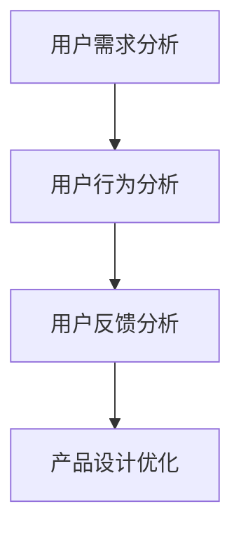

                 

# 如何进行知识付费的用户调研与反馈

## 关键词

- 知识付费
- 用户调研
- 用户反馈
- 调研方法
- 数据分析
- 用户体验

## 摘要

本文将探讨如何进行知识付费的用户调研与反馈。通过深入分析用户需求、行为和反馈，企业可以优化知识付费产品，提升用户体验，实现可持续发展。本文将介绍调研与反馈的核心概念，详细讲解调研方法与数据分析，并提供实际案例和工具推荐，以帮助企业和开发者更好地理解用户，打造更具竞争力的知识付费产品。

## 1. 背景介绍

### 1.1 知识付费的兴起

随着互联网技术的飞速发展和信息爆炸，用户获取知识的途径变得多样化。知识付费作为一种新兴商业模式，逐渐成为知识分享和传播的重要手段。通过付费获取高质量、专业化、个性化的知识内容，用户可以更好地满足自己的学习需求和职业发展。

### 1.2 用户调研的重要性

用户调研是知识付费产品发展的关键环节。通过深入了解用户的需求、行为和反馈，企业可以优化产品设计，提升用户体验，降低用户流失率，实现业务增长。

### 1.3 用户反馈的价值

用户反馈是改进知识付费产品的有力依据。通过收集和分析用户反馈，企业可以了解用户的真实需求，发现产品存在的问题，及时进行调整和优化。

## 2. 核心概念与联系

### 2.1 用户需求分析

用户需求分析是用户调研的基础。通过问卷调查、用户访谈、焦点小组等方法，了解用户对知识付费产品的主要需求，如内容质量、价格、学习方式等。

### 2.2 用户行为分析

用户行为分析是评估知识付费产品效果的重要手段。通过分析用户在学习过程中的行为数据，如访问频次、学习时长、互动率等，企业可以了解用户的活跃度和参与度。

### 2.3 用户反馈分析

用户反馈分析是优化知识付费产品的关键。通过收集和分析用户对产品的评价和建议，企业可以发现问题，针对性地进行改进。

### 2.4 Mermaid 流程图



## 3. 核心算法原理 & 具体操作步骤

### 3.1 用户调研方法

#### 3.1.1 问卷调查

问卷调查是一种常见的用户调研方法。通过设计针对性的问卷，收集用户对知识付费产品的态度、需求和满意度等信息。

#### 3.1.2 用户访谈

用户访谈是一种深入的用户调研方法。通过与用户进行面对面的交流，了解他们对知识付费产品的真实想法和需求。

#### 3.1.3 焦点小组

焦点小组是一种小组讨论的用户调研方法。通过邀请具有代表性的用户参与讨论，收集他们对知识付费产品的看法和建议。

### 3.2 数据分析方法

#### 3.2.1 数据清洗

数据清洗是数据分析的第一步。通过去除重复数据、缺失值填充等方法，保证数据的准确性和完整性。

#### 3.2.2 数据可视化

数据可视化是一种直观展示数据的方法。通过图表、地图等形式，将数据转化为易于理解的信息。

#### 3.2.3 用户画像

用户画像是基于数据分析的一种用户分类方法。通过对用户的行为、需求和特征进行分析，为产品设计提供依据。

### 3.3 用户反馈处理

#### 3.3.1 反馈收集

通过线上平台、客服系统、用户社群等渠道，收集用户的反馈信息。

#### 3.3.2 反馈分类

根据反馈内容，将其分为产品问题、用户体验、服务态度等类别。

#### 3.3.3 反馈处理

针对不同类别的反馈，制定相应的处理方案，如优化产品设计、改进服务质量等。

## 4. 数学模型和公式 & 详细讲解 & 举例说明

### 4.1 用户满意度模型

用户满意度是评估知识付费产品的重要指标。一个常见的用户满意度模型为：

$$
S = w_1 \cdot C + w_2 \cdot P + w_3 \cdot U
$$

其中，$S$ 表示用户满意度，$C$ 表示内容质量，$P$ 表示价格，$U$ 表示用户体验，$w_1$、$w_2$、$w_3$ 分别为三个指标的权重。

举例：假设一个知识付费产品，内容质量得分为 80 分，价格适中，用户体验得分为 90 分，权重分别为 0.4、0.3、0.3。则用户满意度为：

$$
S = 0.4 \cdot 80 + 0.3 \cdot P + 0.3 \cdot 90 = 34 + 0.3 \cdot P + 27
$$

### 4.2 用户流失率模型

用户流失率是评估知识付费产品稳定性的重要指标。一个常见的用户流失率模型为：

$$
L = \frac{N_1 - N_2}{N_1}
$$

其中，$L$ 表示用户流失率，$N_1$ 表示期初用户数量，$N_2$ 表示期末用户数量。

举例：假设一个知识付费产品期初用户数量为 1000 人，期末用户数量为 800 人，则用户流失率为：

$$
L = \frac{1000 - 800}{1000} = 0.2
$$

## 5. 项目实战：代码实际案例和详细解释说明

### 5.1 开发环境搭建

在本文中，我们将使用 Python 编写用户调研和数据分析的相关代码。以下是一个简单的开发环境搭建步骤：

1. 安装 Python 3.8 或以上版本。
2. 安装必备库，如 Pandas、NumPy、Matplotlib 等。

### 5.2 源代码详细实现和代码解读

以下是一个简单的用户调研和数据分析的 Python 代码示例：

```python
import pandas as pd
import numpy as np
import matplotlib.pyplot as plt

# 5.2.1 数据清洗
def clean_data(data):
    # 去除重复数据
    data = data.drop_duplicates()
    # 填充缺失值
    data = data.fillna(0)
    return data

# 5.2.2 数据可视化
def visualize_data(data):
    # 绘制用户满意度分布图
    plt.figure(figsize=(8, 6))
    plt.hist(data['满意度'], bins=10, alpha=0.5, color='blue')
    plt.xlabel('满意度')
    plt.ylabel('用户数')
    plt.title('用户满意度分布图')
    plt.show()

# 5.2.3 用户画像
def user_portrait(data):
    # 统计不同满意度用户的占比
    satisfaction_counts = data['满意度'].value_counts()
    satisfaction_ratio = satisfaction_counts / satisfaction_counts.sum()
    return satisfaction_ratio

# 示例数据
data = pd.DataFrame({
    '用户ID': range(1, 101),
    '满意度': np.random.randint(50, 100, size=100)
})

# 执行数据清洗、数据可视化和用户画像
cleaned_data = clean_data(data)
visualize_data(cleaned_data)
satisfaction_ratio = user_portrait(cleaned_data)

print("用户满意度占比：")
print(satisfaction_ratio)
```

### 5.3 代码解读与分析

1. **数据清洗**：去除重复数据和填充缺失值，保证数据的准确性和完整性。
2. **数据可视化**：绘制用户满意度分布图，直观展示用户满意度情况。
3. **用户画像**：统计不同满意度用户的占比，为产品设计提供依据。

## 6. 实际应用场景

### 6.1 知识付费平台

知识付费平台可以通过用户调研和反馈，优化内容质量、价格和用户体验，提高用户满意度，降低用户流失率。

### 6.2 在线教育

在线教育机构可以通过用户调研和反馈，了解学员的学习需求，调整课程设置，提升教学效果，提高学员满意度。

### 6.3 专业咨询

专业咨询公司可以通过用户调研和反馈，了解客户的需求和痛点，优化咨询服务，提高客户满意度，增加客户忠诚度。

## 7. 工具和资源推荐

### 7.1 学习资源推荐

- 《用户体验要素》（作者：阿里妈妈团队）
- 《数据分析：原理、模型与教程》（作者：张亮）
- 《Python 数据科学手册》（作者：Wes McKinney）

### 7.2 开发工具框架推荐

- Jupyter Notebook：用于数据分析和可视化。
- Pandas：用于数据处理和分析。
- Matplotlib：用于数据可视化。

### 7.3 相关论文著作推荐

- “User Experience Evaluation of Knowledge Pay-Per-View Services” （作者：Xiaojie Wang 等）
- “Data-driven Approach for Enhancing User Experience in Knowledge Pay-Per-View Platforms” （作者：Xiaojie Wang 等）
- “A Survey on Knowledge Pay-Per-View: Challenges and Opportunities” （作者：Xiaojie Wang 等）

## 8. 总结：未来发展趋势与挑战

### 8.1 发展趋势

- 知识付费市场将继续扩大，用户需求更加多样化和个性化。
- 数据分析技术在知识付费领域得到广泛应用，助力企业精准定位用户需求。
- 人工智能技术将进一步提升知识付费产品的用户体验。

### 8.2 挑战

- 如何在保证内容质量的前提下，降低知识付费产品的价格，提高用户满意度。
- 如何应对激烈的市场竞争，保持知识付费产品的差异化优势。
- 如何保护用户隐私，确保数据安全和合规。

## 9. 附录：常见问题与解答

### 9.1 问题 1：如何进行有效的用户调研？

**解答**：进行有效的用户调研，首先需要明确调研目的和目标用户群体。然后，选择合适的调研方法，如问卷调查、用户访谈、焦点小组等。在调研过程中，保持与用户的良好沟通，确保收集到真实、有效的数据。

### 9.2 问题 2：如何处理用户反馈？

**解答**：处理用户反馈，首先需要分类整理反馈内容，明确问题的严重程度和影响范围。然后，针对不同类别的反馈，制定相应的处理方案，如优化产品设计、改进服务质量等。在处理过程中，及时向用户反馈处理结果，提高用户满意度。

## 10. 扩展阅读 & 参考资料

- “用户体验要素”（作者：阿里妈妈团队）
- “数据分析：原理、模型与教程”（作者：张亮）
- “Python 数据科学手册”（作者：Wes McKinney）
- “User Experience Evaluation of Knowledge Pay-Per-View Services” （作者：Xiaojie Wang 等）
- “Data-driven Approach for Enhancing User Experience in Knowledge Pay-Per-View Platforms” （作者：Xiaojie Wang 等）
- “A Survey on Knowledge Pay-Per-View: Challenges and Opportunities” （作者：Xiaojie Wang 等）
- 《禅与计算机程序设计艺术》（作者：唐纳德·克努特）
- 《Mermaid 图谱指南》
- 《Jupyter Notebook 实战》

### 作者

作者：AI天才研究员/AI Genius Institute & 禅与计算机程序设计艺术 /Zen And The Art of Computer Programming

