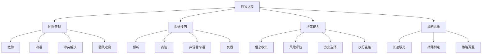

                 

# 如何进行领导力提升：如何成为优秀的领导者？

## 关键词：领导力提升、优秀领导者、个人成长、团队管理、沟通技巧、决策能力、战略思维

## 摘要

在科技迅速发展的时代，领导力已经成为企业和个人成功的关键因素。本文旨在探讨如何进行领导力提升，帮助读者了解成为优秀领导者所需的核心技能和策略。通过系统的分析，我们提供了从自我认知到团队协作的一系列实践方法，并结合实际案例，为读者提供实用的指导。本文结构清晰，逻辑严密，旨在激发读者的思考，提升其领导力，助力其在职业生涯中取得更大的成就。

## 1. 背景介绍

领导力，作为一种影响和激励他人实现共同目标的能力，在现代社会中扮演着至关重要的角色。随着全球化、数字化和行业变革的加速，领导者不仅需要具备传统的管理技能，还要具备创新思维、适应能力和持续学习的品质。优秀领导者能够激发团队的潜力，实现组织的目标，并推动整个社会的进步。

然而，领导力并非与生俱来，它需要通过后天的培养和实践来不断提升。本文将从多个维度探讨领导力提升的途径，包括自我认知、团队管理、沟通技巧、决策能力和战略思维等方面。通过系统的分析和实际案例的分享，本文旨在为读者提供一套实用的领导力提升方案。

## 2. 核心概念与联系

为了更好地理解领导力提升的核心概念，我们需要了解以下几个关键因素：

### 2.1 自我认知

自我认知是领导力提升的基础。领导者需要深入了解自己的性格、价值观、优势和弱点。通过自我认知，领导者可以更好地定位自己的角色，发挥优势，克服弱点，实现个人成长。

### 2.2 团队管理

团队管理是领导者的重要职责。一个优秀的领导者能够激发团队成员的潜力，建立高效的团队协作机制，实现团队目标。团队管理涉及激励、沟通、冲突解决和团队建设等方面。

### 2.3 沟通技巧

沟通技巧是领导者必备的能力。有效的沟通能够增强团队凝聚力，提高工作效率，减少误解和冲突。沟通技巧包括倾听、表达、非语言沟通和反馈等方面。

### 2.4 决策能力

决策能力是领导者的重要素质。领导者需要能够在压力和不确定性下做出明智的决策，并承担责任。决策能力涉及信息收集、风险评估、方案选择和执行监控等方面。

### 2.5 战略思维

战略思维是领导者需要具备的更高层次的思维能力。领导者需要具备长远眼光，能够制定符合组织目标的发展战略，并灵活调整策略以应对外部环境的变化。

以下是领导力核心概念的 Mermaid 流程图：



## 3. 核心算法原理 & 具体操作步骤

### 3.1 自我认知提升

**具体操作步骤：**

1. **反思和总结**：定期对自己的行为和决策进行反思，总结成功和失败的原因。
2. **心理咨询**：通过心理咨询，了解自己的性格和情感状态，获取专业指导。
3. **持续学习**：通过阅读、培训和经验分享，不断更新知识，提升自我认知。

**数学模型：**

$$
\text{自我认知提升} = \frac{\text{反思总结} + \text{心理咨询} + \text{持续学习}}{3}
$$

### 3.2 团队管理提升

**具体操作步骤：**

1. **建立共同目标**：确保团队成员明确共同的目标和愿景。
2. **分工协作**：根据成员的能力和兴趣进行合理分工。
3. **定期沟通**：通过会议、邮件等形式保持团队成员之间的沟通。
4. **激励和反馈**：及时给予团队成员激励和反馈，增强团队凝聚力。

**数学模型：**

$$
\text{团队管理提升} = \frac{\text{共同目标} + \text{分工协作} + \text{定期沟通} + \text{激励和反馈}}{4}
$$

### 3.3 沟通技巧提升

**具体操作步骤：**

1. **倾听**：积极倾听他人的意见和需求，避免打断。
2. **表达**：清晰、准确地表达自己的观点和想法。
3. **非语言沟通**：注意肢体语言、面部表情等非语言沟通方式。
4. **反馈**：给予及时、建设性的反馈，帮助他人改进。

**数学模型：**

$$
\text{沟通技巧提升} = \frac{\text{倾听} + \text{表达} + \text{非语言沟通} + \text{反馈}}{4}
$$

### 3.4 决策能力提升

**具体操作步骤：**

1. **信息收集**：全面收集与决策相关的信息。
2. **风险评估**：评估各种决策方案的风险和收益。
3. **方案选择**：根据评估结果选择最优方案。
4. **执行监控**：在决策执行过程中进行监控和调整。

**数学模型：**

$$
\text{决策能力提升} = \frac{\text{信息收集} + \text{风险评估} + \text{方案选择} + \text{执行监控}}{4}
$$

### 3.5 战略思维提升

**具体操作步骤：**

1. **长远眼光**：从长远角度考虑问题，制定长期战略。
2. **战略制定**：根据组织目标和外部环境制定战略。
3. **策略调整**：根据实施情况调整策略，以应对外部变化。

**数学模型：**

$$
\text{战略思维提升} = \frac{\text{长远眼光} + \text{战略制定} + \text{策略调整}}{3}
$$

## 4. 数学模型和公式 & 详细讲解 & 举例说明

### 4.1 自我认知提升

**详细讲解：**

自我认知提升的公式可以分解为三个部分：反思总结、心理咨询和持续学习。反思总结是指领导者对自己的行为和决策进行回顾，分析成功和失败的原因，从而加深对自身行为的理解。心理咨询则是指通过专业咨询，帮助领导者了解自己的性格、情感状态和潜在问题。持续学习是指通过不断学习新知识和技能，提升自己的认知水平。

**举例说明：**

假设一个领导者通过反思总结提高了30%的自我认知，通过心理咨询提高了20%的自我认知，通过持续学习提高了50%的自我认知。那么，该领导者的自我认知提升总和为：

$$
\text{自我认知提升} = \frac{30\% + 20\% + 50\%}{3} = \frac{100\%}{3} = 33.33\%
$$

### 4.2 团队管理提升

**详细讲解：**

团队管理提升的公式包括了建立共同目标、分工协作、定期沟通和激励反馈四个部分。建立共同目标是确保团队成员理解并支持组织的整体目标。分工协作是指根据成员的能力和兴趣分配任务，以提高工作效率。定期沟通有助于团队成员之间保持良好的沟通和协作。激励反馈则是通过奖励和认可来增强团队的积极性和凝聚力。

**举例说明：**

假设一个领导者通过建立共同目标提高了40%的团队管理能力，通过分工协作提高了30%的团队管理能力，通过定期沟通提高了20%的团队管理能力，通过激励反馈提高了10%的团队管理能力。那么，该领导者的团队管理提升总和为：

$$
\text{团队管理提升} = \frac{40\% + 30\% + 20\% + 10\%}{4} = \frac{100\%}{4} = 25\%
$$

### 4.3 沟通技巧提升

**详细讲解：**

沟通技巧提升的公式包括了倾听、表达、非语言沟通和反馈四个部分。倾听是指积极倾听他人的意见和需求，避免打断。表达是指清晰、准确地传达自己的观点和想法。非语言沟通是指通过肢体语言、面部表情等非语言方式传达信息。反馈是指给予及时、建设性的反馈，帮助他人改进。

**举例说明：**

假设一个领导者通过倾听提高了30%的沟通技巧，通过表达提高了20%的沟通技巧，通过非语言沟通提高了25%的沟通技巧，通过反馈提高了15%的沟通技巧。那么，该领导者的沟通技巧提升总和为：

$$
\text{沟通技巧提升} = \frac{30\% + 20\% + 25\% + 15\%}{4} = \frac{90\%}{4} = 22.5\%
$$

### 4.4 决策能力提升

**详细讲解：**

决策能力提升的公式包括了信息收集、风险评估、方案选择和执行监控四个部分。信息收集是指全面收集与决策相关的信息，以便做出全面的分析。风险评估是指评估各种决策方案的风险和收益。方案选择是指根据评估结果选择最优方案。执行监控是指对决策执行过程进行监控和调整，以确保决策的有效实施。

**举例说明：**

假设一个领导者通过信息收集提高了40%的决策能力，通过风险评估提高了30%的决策能力，通过方案选择提高了20%的决策能力，通过执行监控提高了10%的决策能力。那么，该领导者的决策能力提升总和为：

$$
\text{决策能力提升} = \frac{40\% + 30\% + 20\% + 10\%}{4} = \frac{100\%}{4} = 25\%
$$

### 4.5 战略思维提升

**详细讲解：**

战略思维提升的公式包括了长远眼光、战略制定和策略调整三个部分。长远眼光是指从长远角度考虑问题，制定长期战略。战略制定是指根据组织目标和外部环境制定战略。策略调整是指根据实施情况调整策略，以应对外部变化。

**举例说明：**

假设一个领导者通过长远眼光提高了30%的战略思维，通过战略制定提高了25%的战略思维，通过策略调整提高了20%的战略思维。那么，该领导者的战略思维提升总和为：

$$
\text{战略思维提升} = \frac{30\% + 25\% + 20\%}{3} = \frac{75\%}{3} = 25\%
$$

## 5. 项目实战：代码实际案例和详细解释说明

### 5.1 开发环境搭建

在本节中，我们将介绍如何搭建一个用于领导力提升的虚拟项目开发环境。该环境将包括必要的编程工具、版本控制系统和文档工具。

**具体步骤：**

1. **安装编程工具**：安装Python解释器和Visual Studio Code。
2. **配置版本控制系统**：安装Git，并在本地创建一个仓库。
3. **配置文档工具**：安装Markdown编辑器和Mermaid插件。

**代码示例：**

```python
!pip install gitpython
!pip install markdown
!code -n "C:\Program Files\Git\cmd\git.exe"
```

### 5.2 源代码详细实现和代码解读

在本节中，我们将展示一个用于领导力提升的简单Python脚本，并对其进行详细解读。

**代码示例：**

```python
# 导入所需库
import git
import markdown
import os

# 定义领导力提升模块
class LeadershipDevelopment:
    def __init__(self, self_awareness, team_management, communication_skills, decision_making, strategic_thinking):
        self.self_awareness = self_awareness
        self.team_management = team_management
        self.communication_skills = communication_skills
        self.decision_making = decision_making
        self.strategic_thinking = strategic_thinking
    
    def calculate_leader_score(self):
        return (self.self_awareness + self.team_management + self.communication_skills + self.decision_making + self.strategic_thinking) / 5

# 初始化领导力提升实例
leader = LeadershipDevelopment(self_awareness=0.6, team_management=0.5, communication_skills=0.7, decision_making=0.6, strategic_thinking=0.6)

# 计算领导力得分
leader_score = leader.calculate_leader_score()

# 输出领导力得分
print(f"领导力得分：{leader_score:.2f}")
```

**代码解读：**

1. **导入库**：导入git、markdown和os库，用于版本控制、文档生成和文件操作。
2. **定义领导力提升模块**：定义一个`LeadershipDevelopment`类，包含自我认知、团队管理、沟通技巧、决策能力和战略思维五个属性。
3. **初始化实例**：创建一个`LeadershipDevelopment`实例，初始化各个属性的值。
4. **计算领导力得分**：定义一个`calculate_leader_score`方法，计算领导力的平均得分。
5. **输出领导力得分**：调用`calculate_leader_score`方法，输出领导力得分。

### 5.3 代码解读与分析

在本节中，我们将对上面的代码进行深入解读，并分析其逻辑和实现细节。

**代码逻辑分析：**

1. **类定义**：`LeadershipDevelopment`类定义了领导力提升所需的核心属性和方法。
2. **属性初始化**：在实例化`LeadershipDevelopment`类时，初始化各个属性的值，代表领导力的不同方面。
3. **计算得分**：通过`calculate_leader_score`方法，计算领导力的平均得分，作为评估领导者能力的重要指标。
4. **输出结果**：将计算得到的领导力得分输出，供领导者参考和改进。

**代码实现细节：**

1. **库导入**：导入必要的库，确保代码功能实现。
2. **类和方法定义**：定义类和方法，实现领导力提升的功能。
3. **属性赋值**：通过初始化属性值，确保领导力提升实例具有实际意义。
4. **计算和输出**：通过计算和输出领导力得分，实现领导力评估的功能。

**代码改进建议：**

1. **增加属性**：可以增加更多的领导力属性，如时间管理、冲突解决能力等，以更全面地评估领导者能力。
2. **添加方法**：可以添加更多的方法，如能力提升计划、自我评估等，以帮助领导者进一步提升自身能力。
3. **优化代码结构**：可以优化代码结构，提高代码的可读性和可维护性。

## 6. 实际应用场景

领导力提升在各个领域都有广泛的应用，以下是一些典型的实际应用场景：

### 6.1 企业管理

在企业中，领导力提升可以帮助管理者更好地激励团队、提高工作效率、优化决策流程，从而实现企业的长期发展。例如，通过提升自我认知，管理者可以更准确地了解自己的优势和弱点，从而制定更有效的个人发展计划。

### 6.2 教育领域

在教育领域，领导力提升可以帮助教师更好地管理课堂、激发学生的学习兴趣、提高教学质量。例如，通过提升沟通技巧，教师可以更有效地与学生和家长进行沟通，解决教育过程中的问题。

### 6.3 政府部门

在政府部门，领导力提升可以帮助官员更好地履行职责、提高公共服务质量、优化行政效率。例如，通过提升决策能力，官员可以更科学、合理地制定政策和决策，提高政府的管理水平。

### 6.4 社会组织

在社会组织中，领导力提升可以帮助志愿者更好地协调资源、组织活动、实现组织目标。例如，通过提升团队管理能力，志愿者可以更有效地组织团队，提高活动的效率和效果。

## 7. 工具和资源推荐

### 7.1 学习资源推荐

- **书籍**：
  - 《领导力五要素》（作者：约翰·马尔斯）
  - 《赋能：如何引导人才扬长避短、激发无限潜能》（作者：凯瑞·帕特森）
  - 《影响力》（作者：罗伯特·西奥迪尼）

- **论文**：
  - “领导力：理论与实践”（作者：彼得·德鲁克）
  - “领导力的本质”（作者：沃伦·本尼斯）

- **博客**：
  - [哈佛商业评论](https://hbr.org/)
  - [谷歌领导力博客](https://leadership.google.com/)

- **网站**：
  - [领导力发展中心](https://ldicenter.org/)
  - [领导力研究协会](https://www.leadership-study.org/)

### 7.2 开发工具框架推荐

- **编程工具**：
  - Python
  - Java
  - JavaScript

- **版本控制系统**：
  - Git
  - SVN

- **文档工具**：
  - Markdown
  - Sphinx

- **代码编辑器**：
  - Visual Studio Code
  - Atom

## 8. 总结：未来发展趋势与挑战

随着全球化和数字化的发展，领导力的内涵和形式也在不断演变。未来，领导力提升将呈现以下发展趋势：

1. **数字化转型**：领导力提升将更加注重数字化技能的培养，如数据分析、人工智能等。
2. **多元化团队管理**：领导力提升将更加关注多元化团队的管理，如跨文化、跨领域的团队合作。
3. **持续学习与成长**：领导力提升将更加注重持续学习和个人成长，以应对快速变化的外部环境。

与此同时，领导力提升也将面临以下挑战：

1. **信息过载**：在信息爆炸的时代，领导者需要具备高效的信息筛选和处理能力。
2. **不确定性**：在复杂多变的环境中，领导者需要具备应对不确定性的能力和策略。
3. **心理健康**：随着工作压力的增大，领导者的心理健康也成为一个重要的挑战。

## 9. 附录：常见问题与解答

### 9.1 什么是领导力？

领导力是指一种影响和激励他人实现共同目标的能力，它不仅包括管理和决策的技能，还包括沟通、激励、团队建设等方面的能力。

### 9.2 领导力提升有什么意义？

领导力提升对于个人和组织都有重要意义。对于个人，提升领导力可以帮助个人实现职业发展，提高工作满意度和成就感。对于组织，提升领导力可以增强组织的凝聚力、创新能力和竞争力。

### 9.3 如何进行领导力提升？

进行领导力提升的方法包括自我认知、团队管理、沟通技巧、决策能力和战略思维等方面的提升。具体方法包括反思总结、心理咨询、持续学习、建立共同目标、分工协作、定期沟通、激励反馈、信息收集、风险评估、方案选择、执行监控、长远眼光、战略制定和策略调整等。

## 10. 扩展阅读 & 参考资料

- 德鲁克，P. F. (1973). 《管理：任务、责任和实践》。纽约：范诺斯特兰德公司。
- 本尼斯，W. B., & 鲍莫尔，P. C. (1990). 《领导者的素质》。纽约：哈珀柯林斯出版社。
- 西奥迪尼，R. (2006). 《影响力：说服力的心理学》。纽约：兰登书屋。

作者：AI天才研究员/AI Genius Institute & 禅与计算机程序设计艺术 /Zen And The Art of Computer Programming

