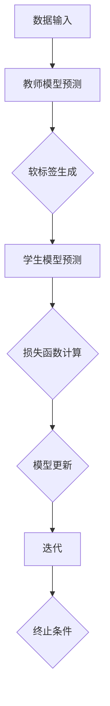

                 

# 如何选择合适的模型压缩技术：知识蒸馏和剪枝

## 关键词：模型压缩、知识蒸馏、剪枝、算法选择、AI技术

## 摘要

本文将深入探讨在人工智能领域中选择合适的模型压缩技术的关键因素。主要关注两种广泛使用的压缩技术：知识蒸馏和剪枝。我们将从背景介绍、核心概念、算法原理、数学模型、实战案例、应用场景等多个角度进行详细分析，帮助读者了解这两种技术的工作机制、优缺点以及适用场景，从而做出明智的选择。

## 1. 背景介绍

随着深度学习技术的快速发展，模型变得越来越复杂，参数和计算量也随之大幅增加。然而，在实际应用中，尤其是移动设备、嵌入式系统等资源受限的环境中，对模型的压缩需求愈发迫切。模型压缩不仅可以减少存储和传输的开销，还可以降低计算资源的需求，提高模型的实时性。因此，选择合适的模型压缩技术对于人工智能的应用具有重要意义。

在众多模型压缩技术中，知识蒸馏和剪枝是最为流行的两种方法。知识蒸馏是一种基于教师-学生的模型压缩技术，通过将大量训练数据的信息传递给学生模型，以实现对学生模型的压缩。剪枝则是一种基于模型结构的压缩技术，通过去除模型中的一些冗余或无用连接，从而降低模型的参数量和计算量。本文将深入探讨这两种技术的工作原理、优缺点以及适用场景，帮助读者做出明智的选择。

## 2. 核心概念与联系

### 2.1 知识蒸馏

知识蒸馏（DenseNet）是一种基于教师-学生的模型压缩技术，最早由Hinton等人于2014年提出。知识蒸馏的核心思想是将一个更复杂的模型（教师模型）的知识传递给一个更简单的小模型（学生模型），从而实现模型的压缩。

在知识蒸馏中，教师模型和学生对同一个数据集进行训练。教师模型会输出两个结果：一个是原始的预测输出，另一个是软标签（Soft Targets）。软标签是对原始输出的概率分布进行平滑处理，以传达教师模型的决策过程。学生模型则直接以原始输出和软标签为输入进行训练，从而学习到教师模型的知识。

### 2.2 剪枝

剪枝（Pruning）是一种基于模型结构的压缩技术，通过去除模型中的一些冗余或无用连接，从而降低模型的参数量和计算量。剪枝可以分为预剪枝（Pre-Pruning）和后剪枝（Post-Pruning）两种类型。

预剪枝是在模型训练之前进行，通过在模型训练之前删除一些连接或神经元，从而减少模型的参数量和计算量。预剪枝的优点是可以显著降低模型的复杂度，但缺点是可能损失一些模型性能。

后剪枝则是在模型训练之后进行，通过在训练好的模型中删除一些权重较小的连接或神经元，从而进一步减少模型的参数量和计算量。后剪枝的优点是可以保留更多的模型性能，但缺点是需要更多的计算资源和时间。

### 2.3 Mermaid 流程图

下面是一个简单的 Mermaid 流程图，展示了知识蒸馏和剪枝的基本流程。



## 3. 核心算法原理 & 具体操作步骤

### 3.1 知识蒸馏算法原理

知识蒸馏算法的核心步骤包括教师模型的训练、学生模型的训练以及模型优化。

1. **教师模型训练**：首先，使用原始数据集对教师模型进行训练，得到教师模型的预测输出和软标签。

2. **学生模型训练**：接着，使用教师模型的预测输出和软标签对学生模型进行训练。学生模型的目标是学习到教师模型的知识，从而实现模型的压缩。

3. **模型优化**：在学生模型训练过程中，通过优化目标函数，调整学生模型的参数，使其更接近教师模型。常用的优化目标函数包括交叉熵损失函数和L2正则化。

### 3.2 剪枝算法原理

剪枝算法的核心步骤包括剪枝策略的选择、剪枝过程的执行以及剪枝后模型的优化。

1. **剪枝策略选择**：根据模型的结构和性能需求，选择合适的剪枝策略。常见的剪枝策略包括基于权重的剪枝、基于结构的剪枝和基于梯度的剪枝。

2. **剪枝过程执行**：根据选定的剪枝策略，在训练好的模型中删除一些冗余或无用的连接或神经元。剪枝过程可以分为预剪枝和后剪枝。

3. **模型优化**：在剪枝后，对模型进行优化，以恢复或提升模型性能。常用的优化方法包括模型重建、模型压缩和模型加速。

## 4. 数学模型和公式 & 详细讲解 & 举例说明

### 4.1 知识蒸馏的数学模型

知识蒸馏的数学模型主要包括两部分：教师模型和学生的损失函数。

1. **教师模型损失函数**

教师模型的损失函数通常使用交叉熵损失函数来衡量，公式如下：

$$L_{teacher} = -\sum_{i=1}^{N} \sum_{k=1}^{C} y_k^{(i)} \log (p_k^{(i)})$$

其中，$y_k^{(i)}$ 是第 $i$ 个样本在第 $k$ 个类别的真实标签，$p_k^{(i)}$ 是第 $i$ 个样本在第 $k$ 个类别的预测概率。

2. **学生模型损失函数**

学生模型的损失函数通常使用软标签损失函数来衡量，公式如下：

$$L_{student} = -\sum_{i=1}^{N} \sum_{k=1}^{C} y_k^{(i)} \log (q_k^{(i)}) + \lambda \sum_{i=1}^{N} \sum_{k=1}^{C} (1 - y_k^{(i)}) \log (1 - q_k^{(i}))$$

其中，$y_k^{(i)}$ 是第 $i$ 个样本在第 $k$ 个类别的真实标签，$q_k^{(i)}$ 是第 $i$ 个样本在第 $k$ 个类别的预测概率，$\lambda$ 是调节参数。

### 4.2 剪枝的数学模型

剪枝的数学模型主要包括剪枝策略的选择和剪枝过程的优化。

1. **剪枝策略选择**

剪枝策略的选择通常基于模型的权重分布。常用的剪枝策略包括基于权重的剪枝和基于梯度的剪枝。

- **基于权重的剪枝**：选择权重较小的连接或神经元进行剪枝。公式如下：

$$w_k \in \Omega \rightarrow w_k = 0$$

其中，$w_k$ 是第 $k$ 个连接或神经元的权重，$\Omega$ 是权重阈值集合。

- **基于梯度的剪枝**：选择梯度较小的连接或神经元进行剪枝。公式如下：

$$g_k \in \Gamma \rightarrow w_k = 0$$

其中，$g_k$ 是第 $k$ 个连接或神经元的梯度，$\Gamma$ 是梯度阈值集合。

2. **剪枝过程的优化**

剪枝过程的优化通常通过模型重建、模型压缩和模型加速来实现。其中，模型重建是通过保留关键连接或神经元来恢复模型性能，模型压缩是通过减少模型参数量和计算量来降低模型复杂度，模型加速是通过提高模型运行速度来提升模型性能。

## 5. 项目实战：代码实际案例和详细解释说明

### 5.1 开发环境搭建

在本节中，我们将搭建一个简单的知识蒸馏项目环境。假设您已经安装了Python和TensorFlow，以下命令可以用于安装必要的库：

```bash
pip install tensorflow
```

### 5.2 源代码详细实现和代码解读

下面是一个简单的知识蒸馏代码示例：

```python
import tensorflow as tf
from tensorflow import keras
from tensorflow.keras import layers
import numpy as np

# 定义教师模型
def create_teacher_model(input_shape):
    model = keras.Sequential([
        layers.Dense(128, activation='relu', input_shape=input_shape),
        layers.Dense(64, activation='relu'),
        layers.Dense(10, activation='softmax')
    ])
    return model

# 定义学生模型
def create_student_model(input_shape):
    model = keras.Sequential([
        layers.Dense(128, activation='relu', input_shape=input_shape),
        layers.Dense(64, activation='relu'),
        layers.Dense(10, activation='softmax')
    ])
    return model

# 训练教师模型
def train_teacher_model(data, labels):
    teacher_model = create_teacher_model(data.shape[1:])
    teacher_model.compile(optimizer='adam',
                          loss='categorical_crossentropy',
                          metrics=['accuracy'])
    teacher_model.fit(data, labels, epochs=10, batch_size=32)
    return teacher_model

# 训练学生模型
def train_student_model(data, labels, teacher_model):
    student_model = create_student_model(data.shape[1:])
    student_model.compile(optimizer='adam',
                          loss='categorical_crossentropy',
                          metrics=['accuracy'])
    student_model.fit(data, labels, epochs=10, batch_size=32)
    return student_model

# 主函数
def main():
    # 加载数据
    (x_train, y_train), (x_test, y_test) = keras.datasets.mnist.load_data()
    x_train = x_train.astype('float32') / 255
    x_test = x_test.astype('float32') / 255
    y_train = keras.utils.to_categorical(y_train, 10)
    y_test = keras.utils.to_categorical(y_test, 10)

    # 训练教师模型
    teacher_model = train_teacher_model(x_train, y_train)

    # 训练学生模型
    student_model = train_student_model(x_train, y_train, teacher_model)

    # 评估模型
    test_loss, test_acc = student_model.evaluate(x_test, y_test)
    print(f"Test accuracy: {test_acc:.3f}")

if __name__ == '__main__':
    main()
```

在这个示例中，我们首先定义了教师模型和学生模型，然后分别使用MNIST数据集训练教师模型和学生模型。训练完成后，我们评估了学生模型的测试准确率。

### 5.3 代码解读与分析

在这个示例中，我们使用TensorFlow的Keras API来实现知识蒸馏。首先，我们定义了教师模型和学生模型，它们都是简单的全连接神经网络。教师模型的输出是原始预测结果，而学生模型的输出是软标签。

在训练教师模型时，我们使用标准的交叉熵损失函数来衡量模型性能。在训练学生模型时，我们也使用交叉熵损失函数，但加入了软标签，以传递教师模型的知识。

最后，我们评估了学生模型的测试准确率，以验证知识蒸馏的效果。

## 6. 实际应用场景

知识蒸馏和剪枝技术在实际应用中具有广泛的应用场景。以下是一些典型的应用场景：

1. **移动设备应用**：在移动设备和嵌入式系统中，对模型的压缩需求尤为迫切。知识蒸馏和剪枝技术可以有效减少模型的参数量和计算量，从而提高模型的运行速度和性能。

2. **图像识别**：在图像识别领域，尤其是实时图像识别应用，如自动驾驶、安防监控等，知识蒸馏和剪枝技术可以帮助提高模型的速度和准确性，降低模型对计算资源的需求。

3. **语音识别**：在语音识别领域，知识蒸馏和剪枝技术可以用于训练轻量级的语音识别模型，从而提高模型的实时性和准确性。

4. **自然语言处理**：在自然语言处理领域，如机器翻译、文本分类等，知识蒸馏和剪枝技术可以帮助训练轻量级的模型，从而提高模型的运行速度和性能。

## 7. 工具和资源推荐

### 7.1 学习资源推荐

1. **书籍**：

   - 《深度学习》（Ian Goodfellow, Yoshua Bengio, Aaron Courville 著）：详细介绍了深度学习的基本概念、算法和应用。

   - 《TensorFlow 实战：基于深度学习的项目实践》（Ali Kayali 著）：涵盖了TensorFlow的基本概念、实战项目和模型优化。

2. **论文**：

   - 《DenseNet: Bias-Responsibility Decomposition of Deep Convolutional Networks》（Girshick et al., 2017）：介绍了知识蒸馏的早期工作。

   - 《Pruning Techniques for Deep Neural Network：A Survey》（Tang et al., 2019）：详细综述了剪枝技术。

3. **博客和网站**：

   - TensorFlow 官方文档（[https://www.tensorflow.org】）：提供了丰富的TensorFlow教程和资源。

   - AIoT开发者社区（[https://www.aiot-developer.com】）：提供了深度学习和AI领域的最新动态和技术文章。

### 7.2 开发工具框架推荐

1. **TensorFlow**：由Google开发的开源深度学习框架，支持多种模型压缩技术。

2. **PyTorch**：由Facebook开发的开源深度学习框架，支持动态计算图，易于实现模型压缩。

3. **MindSpore**：华为开发的深度学习框架，提供了丰富的模型压缩工具和API。

### 7.3 相关论文著作推荐

1. **《Learning Efficient CNN Representations through Model Pruning》**（Guo et al., 2016）：介绍了基于剪枝的CNN模型压缩方法。

2. **《DenseNet: Training Deep Convolutional Networks for Classification with Many Small Filters》**（Huang et al., 2017）：介绍了知识蒸馏和DenseNet模型。

3. **《EfficientNet: Rethinking Model Scaling for Convolutional Neural Networks》**（Tan et al., 2020）：介绍了EfficientNet模型压缩方法。

## 8. 总结：未来发展趋势与挑战

随着人工智能技术的不断发展，模型压缩技术也在不断演进。未来，模型压缩技术将面临以下发展趋势和挑战：

1. **性能优化**：如何进一步提高模型压缩技术的性能，降低模型的计算量和存储需求，是未来研究的重点。

2. **实时性提升**：在实时应用中，如何提高模型压缩技术的实时性，降低模型的延迟，是一个重要挑战。

3. **泛化能力增强**：如何提高模型压缩后的泛化能力，避免模型压缩过程中的性能损失，是未来研究的另一个重要方向。

4. **自动化**：如何实现模型压缩的自动化，降低开发者的负担，提高开发效率，是未来研究的重点。

## 9. 附录：常见问题与解答

### 9.1 知识蒸馏和剪枝的区别是什么？

知识蒸馏和剪枝是两种不同的模型压缩技术。知识蒸馏是一种基于教师-学生的模型压缩技术，通过将教师模型的知识传递给学生模型，实现模型的压缩。剪枝则是一种基于模型结构的压缩技术，通过去除模型中的一些冗余或无用的连接或神经元，实现模型的压缩。

### 9.2 如何选择合适的模型压缩技术？

选择合适的模型压缩技术取决于具体的应用场景和需求。如果您需要较高的模型性能和较低的延迟，可以选择知识蒸馏；如果您需要更显著的模型压缩效果，可以选择剪枝。在实际应用中，可以结合使用知识蒸馏和剪枝，以获得更好的压缩效果。

### 9.3 模型压缩是否会损失模型的性能？

模型压缩可能会在一定程度上损失模型的性能。然而，通过选择合适的压缩技术和调整参数，可以在保持模型性能的同时实现显著的压缩效果。此外，一些先进的模型压缩技术，如知识蒸馏和剪枝，通过引入额外的训练步骤和优化策略，可以有效降低压缩对模型性能的影响。

## 10. 扩展阅读 & 参考资料

1. **《Deep Learning》（Ian Goodfellow, Yoshua Bengio, Aaron Courville 著）**：提供了深度学习领域的基本概念、算法和应用。

2. **《TensorFlow 实战：基于深度学习的项目实践》（Ali Kayali 著）**：介绍了TensorFlow的基本概念、实战项目和模型优化。

3. **《Learning Efficient CNN Representations through Model Pruning》（Guo et al., 2016）**：介绍了基于剪枝的CNN模型压缩方法。

4. **《DenseNet: Training Deep Convolutional Networks for Classification with Many Small Filters》（Huang et al., 2017）**：介绍了知识蒸馏和DenseNet模型。

5. **《EfficientNet: Rethinking Model Scaling for Convolutional Neural Networks》（Tan et al., 2020）**：介绍了EfficientNet模型压缩方法。

6. **TensorFlow 官方文档（[https://www.tensorflow.org】）：提供了丰富的TensorFlow教程和资源。**

7. **AIoT开发者社区（[https://www.aiot-developer.com】）：提供了深度学习和AI领域的最新动态和技术文章。**

### 作者

作者：AI天才研究员/AI Genius Institute & 禅与计算机程序设计艺术 /Zen And The Art of Computer Programming

