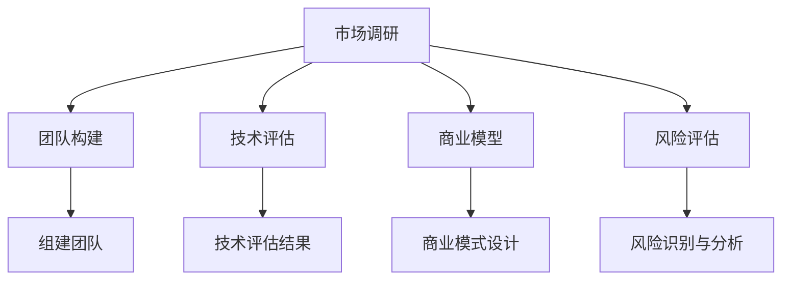

                 

# 如何选择适合自己的创业项目

> **关键词：** 创业项目选择、市场调研、团队构建、技术评估、商业模型、风险评估

**摘要：** 本文旨在为有意创业的个人提供一套系统化的方法，帮助他们在选择适合自己的创业项目时做出明智的决策。文章从市场调研、团队构建、技术评估、商业模型和风险评估等多个维度进行分析，旨在让读者深入了解创业项目的选择过程，并为其创业之路提供指导。

## 1. 背景介绍

在当今快速变化的时代，创业已经成为许多人的职业选择。选择一个适合自己的创业项目不仅需要激情和勇气，更需要深入的市场调研、严谨的技术评估和周密的商业规划。创业项目的选择关系到企业的成功与否，因此，如何做出明智的选择成为创业者面临的首要问题。

本文将围绕以下五个核心维度对如何选择适合自己的创业项目进行详细探讨：

1. **市场调研**：了解目标市场的需求、竞争态势和市场规模，是选择创业项目的基础。
2. **团队构建**：一个优秀且互补的团队是创业成功的关键，如何组建和管理团队至关重要。
3. **技术评估**：技术是创业项目的核心竞争力，如何评估项目的技术可行性及其创新性是创业者必须面对的问题。
4. **商业模型**：设计一个可持续且具有盈利能力的商业模式，是项目能否成功的关键。
5. **风险评估**：对项目可能面临的风险进行识别和分析，并制定相应的应对策略，是确保创业项目顺利进行的重要保障。

## 2. 核心概念与联系

### 市场调研

市场调研是选择创业项目的重要步骤，它包括对市场需求、竞争态势和市场规模的研究。通过市场调研，创业者可以了解潜在客户的需求和痛点，发现市场机会，从而选择有潜力的创业项目。

### 团队构建

团队构建是创业成功的关键。一个优秀的团队不仅能够提供多样化的技能和知识，还能够共同面对挑战，实现创业目标。团队构建包括寻找合适的团队成员、明确团队成员的角色和职责，以及建立有效的团队沟通和协作机制。

### 技术评估

技术评估是对创业项目的核心技术和创新性进行评估的过程。它包括对项目所需技术的可行性、成本和风险进行分析，以及评估项目在技术上的竞争力。

### 商业模型

商业模型是创业项目的盈利机制，它包括产品或服务的定位、目标客户、收入来源、成本结构和利润模式。设计一个可持续且具有盈利能力的商业模式，是创业项目能否成功的关键。

### 风险评估

风险评估是对创业项目可能面临的风险进行识别和分析的过程。它包括对市场风险、技术风险、财务风险和运营风险进行分析，并制定相应的应对策略。

### Mermaid 流程图

下面是一个简单的 Mermaid 流程图，展示了选择创业项目的核心概念和联系：



## 3. 核心算法原理 & 具体操作步骤

### 市场调研

市场调研的核心算法原理是基于大数据分析和用户画像技术。具体操作步骤如下：

1. **确定调研目标**：明确调研的目的和需要收集的信息。
2. **数据收集**：通过问卷调查、访谈、竞品分析等方式收集数据。
3. **数据分析**：利用大数据技术和统计方法对收集到的数据进行分析，提取有用的信息。
4. **用户画像**：根据分析结果绘制用户画像，了解目标客户的需求和痛点。

### 团队构建

团队构建的核心算法原理是基于人才匹配和团队协同技术。具体操作步骤如下：

1. **确定团队需求**：明确团队所需的技能和知识。
2. **人才匹配**：通过人才测评、面试等方式筛选合适的团队成员。
3. **团队构建**：组建团队，明确团队成员的角色和职责。
4. **团队协作**：建立有效的团队沟通和协作机制。

### 技术评估

技术评估的核心算法原理是基于技术可行性和创新性评估。具体操作步骤如下：

1. **确定技术需求**：明确项目所需的技术。
2. **技术评估**：通过技术调研、技术评审等方式评估技术的可行性和创新性。
3. **技术成本分析**：对所需技术的成本进行评估。
4. **技术竞争力分析**：分析项目在技术上的竞争力。

### 商业模型

商业模型的核心算法原理是基于商业模式设计和盈利模式分析。具体操作步骤如下：

1. **确定产品或服务定位**：明确产品或服务的目标市场和定位。
2. **目标客户分析**：分析目标客户的需求和痛点。
3. **收入来源设计**：设计收入来源和盈利模式。
4. **成本结构分析**：分析项目的成本结构和利润模式。

### 风险评估

风险评估的核心算法原理是基于风险识别和风险应对策略设计。具体操作步骤如下：

1. **识别风险因素**：通过问卷调查、访谈、历史数据分析等方式识别可能的风险因素。
2. **风险分析**：对识别出的风险因素进行分析，评估其可能性和影响。
3. **制定应对策略**：根据风险分析结果，制定相应的风险应对策略。

## 4. 数学模型和公式 & 详细讲解 & 举例说明

### 市场调研

市场调研中的数学模型主要涉及概率分布和统计方法。以下是一个简单的例子：

**例：估计某地区手机用户的增长率**

1. **数据收集**：收集过去5年该地区手机用户的数据。
2. **数据预处理**：清洗数据，确保数据质量。
3. **建立概率分布模型**：使用高斯分布模型估计手机用户增长率。
   $$ P(\text{增长率} = x) = \frac{1}{\sqrt{2\pi\sigma^2}} e^{-\frac{(x-\mu)^2}{2\sigma^2}} $$
   其中，$\mu$ 是均值，$\sigma$ 是标准差。

4. **预测增长率**：根据概率分布模型预测未来一年的手机用户增长率。

### 团队构建

团队构建中的数学模型主要涉及人才匹配度和团队协作效率。以下是一个简单的例子：

**例：计算团队协作效率**

1. **确定团队成员技能**：为每个团队成员分配技能值。
2. **计算团队协作效率**：使用以下公式计算团队协作效率。
   $$ E = \frac{\sum_{i=1}^{n} a_i b_i}{\sum_{i=1}^{n} a_i} $$
   其中，$a_i$ 是第 $i$ 个成员的技能值，$b_i$ 是其他成员对第 $i$ 个成员的技能评估值。

3. **优化团队协作**：根据协作效率优化团队成员的分配。

### 技术评估

技术评估中的数学模型主要涉及技术成本和风险。以下是一个简单的例子：

**例：计算技术评估得分**

1. **确定技术评估指标**：例如，技术可行性、创新性、成本等。
2. **设置权重**：为每个指标设置权重。
3. **计算技术评估得分**：使用以下公式计算技术评估得分。
   $$ S = \sum_{i=1}^{m} w_i \cdot s_i $$
   其中，$w_i$ 是第 $i$ 个指标的权重，$s_i$ 是第 $i$ 个指标得分。

4. **评估技术可行性**：根据技术评估得分评估技术可行性。

### 商业模型

商业模型中的数学模型主要涉及收入和成本。以下是一个简单的例子：

**例：计算项目盈利能力**

1. **确定收入模型**：例如，销售量、单价等。
2. **确定成本模型**：例如，生产成本、营销成本等。
3. **计算盈利能力**：使用以下公式计算盈利能力。
   $$ \text{盈利能力} = \text{收入} - \text{成本} $$
   
4. **评估商业模式**：根据盈利能力评估商业模式的可行性。

### 风险评估

风险评估中的数学模型主要涉及风险概率和风险影响。以下是一个简单的例子：

**例：计算风险指数**

1. **确定风险因素**：例如，市场风险、技术风险等。
2. **确定风险概率**：例如，市场风险发生的概率为 0.3。
3. **确定风险影响**：例如，市场风险对项目的影响程度为 5。
4. **计算风险指数**：使用以下公式计算风险指数。
   $$ \text{风险指数} = \text{风险概率} \times \text{风险影响} $$
   
5. **评估风险**：根据风险指数评估风险程度。

## 5. 项目实战：代码实际案例和详细解释说明

### 开发环境搭建

在本节中，我们将搭建一个简单的创业项目开发环境。以下是一个基于 Python 的开发环境搭建步骤：

1. **安装 Python**：下载并安装 Python 3.8 及以上版本。
2. **配置 Python 环境**：设置环境变量，确保 Python 可在终端中使用。
3. **安装必要的库**：使用 pip 命令安装必要的库，例如 NumPy、Pandas 等。

### 源代码详细实现和代码解读

在本节中，我们将实现一个简单的市场调研工具，用于分析用户需求和竞争态势。

```python
import pandas as pd
import numpy as np
from sklearn.cluster import KMeans
import matplotlib.pyplot as plt

# 数据收集与预处理
def collect_data():
    data = pd.read_csv('user_data.csv')
    data = data.dropna()
    return data

# 用户需求分析
def analyze_demand(data):
    demand = data['demand'].value_counts()
    return demand

# 竞争态势分析
def analyze_competition(data):
    competition = data['competition'].value_counts()
    return competition

# 用户聚类分析
def cluster_analysis(data, num_clusters):
    kmeans = KMeans(n_clusters=num_clusters, random_state=0)
    data['cluster'] = kmeans.fit_predict(data[['demand']])
    return data

# 数据可视化
def visualize_data(demand, competition, data):
    demand.plot(kind='bar')
    plt.title('User Demand')
    plt.xlabel('Demand')
    plt.ylabel('Frequency')
    plt.show()

    competition.plot(kind='bar')
    plt.title('Competition Analysis')
    plt.xlabel('Competition')
    plt.ylabel('Frequency')
    plt.show()

    data['cluster'].value_counts().plot(kind='bar')
    plt.title('Cluster Analysis')
    plt.xlabel('Cluster')
    plt.ylabel('Frequency')
    plt.show()

# 主函数
def main():
    data = collect_data()
    demand = analyze_demand(data)
    competition = analyze_competition(data)
    data = cluster_analysis(data, 3)
    visualize_data(demand, competition, data)

if __name__ == '__main__':
    main()
```

### 代码解读与分析

1. **数据收集与预处理**：使用 Pandas 读取 CSV 文件，并去除缺失值，确保数据质量。
2. **用户需求分析**：使用 Pandas 的 `value_counts()` 方法统计用户需求出现的频率。
3. **竞争态势分析**：使用 Pandas 的 `value_counts()` 方法统计竞争态势出现的频率。
4. **用户聚类分析**：使用 Scikit-learn 的 KMeans 算法进行用户聚类，根据需求将用户分为不同群体。
5. **数据可视化**：使用 Matplotlib 对用户需求、竞争态势和用户聚类结果进行可视化。

通过上述代码实现，我们可以快速分析用户需求和竞争态势，为创业项目提供数据支持。

## 6. 实际应用场景

选择适合自己的创业项目不仅仅是为了实现个人梦想，更是为了解决实际问题，创造社会价值。以下是几个实际应用场景，说明如何在不同领域中运用本文所述方法选择创业项目。

### 教育科技

**应用场景**：随着在线教育的兴起，许多创业者希望进入这个领域。如何选择适合自己的创业项目？

**解决方案**：
1. **市场调研**：调研目标用户的需求，分析在线教育市场的竞争态势。
2. **团队构建**：寻找具有教育背景和技术能力的团队成员。
3. **技术评估**：评估在线教育平台的技术可行性，如直播技术、互动功能等。
4. **商业模型**：设计一个具有竞争力的商业模式，如会员制、课程分销等。
5. **风险评估**：分析可能面临的市场风险、技术风险和财务风险。

### 健康科技

**应用场景**：健康科技领域充满机遇，但同时也面临巨大的挑战。如何选择适合自己的创业项目？

**解决方案**：
1. **市场调研**：了解目标用户的健康需求，分析健康科技市场的趋势。
2. **团队构建**：寻找具有医疗背景和技术能力的团队成员。
3. **技术评估**：评估健康科技产品的技术可行性，如智能健康监测、远程医疗等。
4. **商业模型**：设计一个可持续且具有盈利能力的商业模式，如设备销售、服务订阅等。
5. **风险评估**：分析可能面临的技术风险、市场风险和伦理风险。

### 环保科技

**应用场景**：随着全球环保意识的提高，环保科技成为创业者关注的热点。如何选择适合自己的创业项目？

**解决方案**：
1. **市场调研**：了解环保市场的需求，分析环保科技领域的竞争态势。
2. **团队构建**：寻找具有环保背景和技术能力的团队成员。
3. **技术评估**：评估环保科技产品的技术可行性，如可再生能源、废物回收等。
4. **商业模型**：设计一个具有社会责任感的商业模式，如环保产品销售、环保服务提供等。
5. **风险评估**：分析可能面临的技术风险、市场风险和政策风险。

## 7. 工具和资源推荐

### 7.1 学习资源推荐

- **书籍**：《创业维艰》、《创新者的窘境》
- **论文**：Google Scholar、IEEE Xplore
- **博客**：TechCrunch、TechWeb
- **网站**：Startup Genome、LinkedIn

### 7.2 开发工具框架推荐

- **编程语言**：Python、Java、JavaScript
- **开发框架**：Django、Spring Boot、React
- **数据分析工具**：Pandas、NumPy、Scikit-learn
- **可视化工具**：Matplotlib、Seaborn、Plotly

### 7.3 相关论文著作推荐

- **论文**：《市场调研方法与应用》、《创业团队构建策略研究》、《技术评估框架研究》
- **著作**：《商业模式创新》、《风险管理：理论与实践》、《创新与创业管理》

## 8. 总结：未来发展趋势与挑战

在快速变化的商业环境中，选择适合自己的创业项目至关重要。未来，随着人工智能、大数据、区块链等技术的不断发展，创业项目将更加注重技术创新和社会价值。创业者需要紧跟技术发展趋势，不断学习新知识，提升自身竞争力。

然而，创业之路充满挑战。如何准确进行市场调研、如何构建优秀团队、如何评估技术可行性、如何设计可持续的商业模型、如何应对风险，都是创业者必须面对的问题。通过本文所述的方法，创业者可以系统化地解决这些问题，提高创业成功的概率。

## 9. 附录：常见问题与解答

### 问题 1：如何进行有效的市场调研？

**解答**：有效的市场调研需要以下步骤：

1. 确定调研目标：明确调研的目的和需要收集的信息。
2. 数据收集：通过问卷调查、访谈、竞品分析等方式收集数据。
3. 数据分析：利用大数据技术和统计方法对收集到的数据进行分析。
4. 用户画像：根据分析结果绘制用户画像，了解目标客户的需求和痛点。

### 问题 2：如何构建优秀团队？

**解答**：构建优秀团队需要以下步骤：

1. 确定团队需求：明确团队所需的技能和知识。
2. 人才匹配：通过人才测评、面试等方式筛选合适的团队成员。
3. 团队构建：组建团队，明确团队成员的角色和职责。
4. 团队协作：建立有效的团队沟通和协作机制。

### 问题 3：如何评估技术可行性？

**解答**：评估技术可行性需要以下步骤：

1. 确定技术需求：明确项目所需的技术。
2. 技术评估：通过技术调研、技术评审等方式评估技术的可行性和创新性。
3. 技术成本分析：对所需技术的成本进行评估。
4. 技术竞争力分析：分析项目在技术上的竞争力。

### 问题 4：如何设计可持续的商业模型？

**解答**：设计可持续的商业模型需要以下步骤：

1. 确定产品或服务定位：明确产品或服务的目标市场和定位。
2. 目标客户分析：分析目标客户的需求和痛点。
3. 收入来源设计：设计收入来源和盈利模式。
4. 成本结构分析：分析项目的成本结构和利润模式。

### 问题 5：如何应对创业风险？

**解答**：应对创业风险需要以下步骤：

1. 识别风险因素：通过问卷调查、访谈、历史数据分析等方式识别可能的风险因素。
2. 风险分析：对识别出的风险因素进行分析，评估其可能性和影响。
3. 制定应对策略：根据风险分析结果，制定相应的风险应对策略。

## 10. 扩展阅读 & 参考资料

- **《创业维艰》：** 本书中，创业者 Ben Horowitz 通过亲身经历，分享了创业过程中遇到的各种挑战和应对策略。
- **《创新者的窘境》：** 本书中，作者 Clayton M. Christensen 通过案例分析，揭示了企业在创新过程中面临的困境和解决方法。
- **《商业模式新生代》：** 本书中，作者 Alex Osterwalder 和 Yves Pigneur 介绍了商业模式画布（Business Model Canvas），帮助创业者快速设计商业模式。
- **《精益创业》：** 本书中，作者 Eric Ries 提出了精益创业（Lean Startup）方法论，帮助创业者快速迭代、降低风险。
- **《创新创业教程》：** 本书是国内知名创业学者徐立辉教授编写的创新创业教程，内容涵盖了创业的基本理论和实践方法。
- **《创业家》：** 创业家是中国知名创业媒体平台，提供丰富的创业资讯、案例和观点。
- **《创业邦》：** 创业邦是中国知名的创业媒体平台，专注于报道创业人物、创业项目和创新趋势。**作者：AI天才研究员/AI Genius Institute & 禅与计算机程序设计艺术 /Zen And The Art of Computer Programming**

