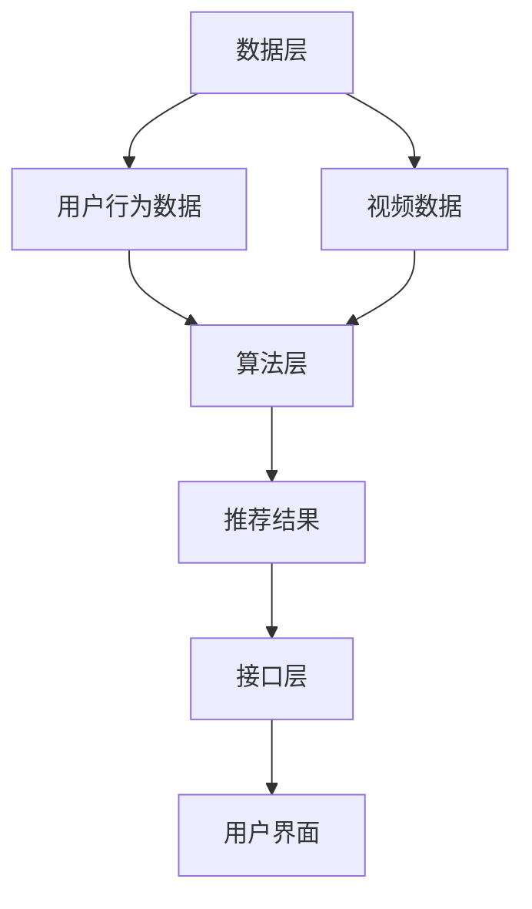

                 

# 字节火山2024校招视频推荐工程师面试指南

## 关键词
字节跳动、2024校招、视频推荐、工程师、面试指南、算法原理、数学模型、实战案例、应用场景、工具推荐

## 摘要
本文旨在为2024年字节火山校招视频推荐工程师的应聘者提供一份全面的面试指南。文章从背景介绍、核心概念与联系、算法原理与操作步骤、数学模型与公式、实战案例、应用场景、工具和资源推荐等方面，深入解析了视频推荐系统的工作原理和实践应用。通过阅读本文，读者可以更好地理解视频推荐工程师所需掌握的核心技术和应对面试的策略，为顺利通过字节火山校招面试做好准备。

## 1. 背景介绍

随着互联网的飞速发展，视频内容逐渐成为信息传播的重要载体。字节跳动作为国内领先的内容平台，其视频推荐系统对于用户的观看体验和平台的发展至关重要。因此，字节火山2024校招视频推荐工程师岗位吸引了大量优秀人才的关注。

视频推荐系统是指根据用户的兴趣和行为，从海量的视频内容中筛选出符合用户兴趣的视频，提高用户满意度和粘性。推荐系统在电子商务、社交媒体、视频平台等场景中得到了广泛应用。

作为视频推荐工程师，需要具备以下能力：
1. 熟悉推荐系统的基本概念和常用算法，如基于内容的推荐、协同过滤、深度学习等。
2. 掌握数据挖掘、机器学习等相关技术，能够处理和分析大量视频数据。
3. 熟悉常见的视频处理和编辑技术，如视频分类、视频标签、视频分割等。
4. 具有良好的编程能力和团队协作精神，能够参与项目的开发和优化。

## 2. 核心概念与联系

### 2.1 视频推荐系统架构

视频推荐系统一般包括数据层、算法层和接口层三个部分。

**数据层**负责收集和存储视频数据、用户行为数据等，为推荐算法提供基础数据支持。

**算法层**是推荐系统的核心，负责根据用户兴趣和行为，从数据层提取有效信息，生成推荐结果。

**接口层**负责与前端页面进行交互，将推荐结果呈现给用户。

### 2.2 常用算法及原理

1. **基于内容的推荐（Content-Based Recommendation）**

基于内容的推荐通过分析视频的属性（如标题、标签、分类等）与用户的兴趣特征进行匹配，推荐相似的视频。该方法的优点是实现简单，缺点是难以处理用户的历史行为数据。

2. **协同过滤（Collaborative Filtering）**

协同过滤通过分析用户之间的行为相似性，发现用户共同喜欢的视频，从而进行推荐。协同过滤分为基于用户的协同过滤（User-Based）和基于项目的协同过滤（Item-Based）两种类型。

3. **深度学习（Deep Learning）**

深度学习通过构建深度神经网络，自动学习视频内容和用户行为之间的复杂关系，实现视频推荐。常见的深度学习模型包括卷积神经网络（CNN）、循环神经网络（RNN）和 Transformer 等。

### 2.3 Mermaid 流程图

以下是一个简单的 Mermaid 流程图，展示了视频推荐系统的基本流程：



## 3. 核心算法原理 & 具体操作步骤

### 3.1 基于内容的推荐算法

**原理**：基于内容的推荐算法通过分析视频的属性和用户的兴趣特征，计算视频与用户之间的相似度，推荐相似的视频。

**操作步骤**：
1. 提取视频特征：使用自然语言处理（NLP）技术提取视频标题、标签等文本信息，通过词频、词向量和词嵌入等方法进行特征提取。
2. 提取用户兴趣特征：分析用户的历史行为，如点赞、评论、收藏等，提取用户的兴趣标签和特征。
3. 计算视频与用户的相似度：使用余弦相似度、皮尔逊相关系数等方法计算视频特征向量与用户兴趣特征向量之间的相似度。
4. 推荐相似视频：根据相似度分数从视频库中推荐相似度最高的视频。

### 3.2 协同过滤算法

**原理**：协同过滤算法通过分析用户之间的行为相似性，发现用户共同喜欢的视频，从而进行推荐。

**操作步骤**：
1. 构建用户行为矩阵：将用户和视频表示为矩阵中的行和列，用户对视频的评分或行为作为矩阵的元素。
2. 计算用户相似度：使用余弦相似度、皮尔逊相关系数等方法计算用户之间的相似度。
3. 推荐视频：对于新用户，计算其与已有用户的相似度，从相似用户喜欢的视频中推荐给新用户。

### 3.3 深度学习推荐算法

**原理**：深度学习推荐算法通过构建深度神经网络，自动学习视频内容和用户行为之间的复杂关系。

**操作步骤**：
1. 构建输入层：输入视频特征（如标题、标签、分类等）和用户特征（如历史行为、兴趣爱好等）。
2. 构建隐藏层：使用卷积神经网络（CNN）、循环神经网络（RNN）或 Transformer 等深度学习模型进行特征提取和关系建模。
3. 构建输出层：输出视频推荐结果，如视频标签、分类或评分。
4. 训练模型：使用训练数据集训练深度学习模型，调整模型参数，提高推荐准确性。
5. 推荐视频：使用训练好的模型对新用户或新视频进行推荐。

## 4. 数学模型和公式 & 详细讲解 & 举例说明

### 4.1 余弦相似度

余弦相似度是一种衡量两个向量相似程度的度量方法，其公式如下：

$$
\cos\theta = \frac{\vec{A} \cdot \vec{B}}{|\vec{A}| |\vec{B}|}
$$

其中，$\vec{A}$和$\vec{B}$分别是两个向量，$\theta$是它们之间的夹角。余弦相似度的取值范围在[-1,1]之间，值越接近1表示两个向量越相似。

**举例**：

假设有两个视频特征向量$\vec{A} = (1, 2, 3)$和$\vec{B} = (4, 5, 6)$，计算它们之间的余弦相似度：

$$
\cos\theta = \frac{(1 \times 4 + 2 \times 5 + 3 \times 6)}{\sqrt{1^2 + 2^2 + 3^2} \times \sqrt{4^2 + 5^2 + 6^2}} \approx 0.998
$$

由于余弦相似度接近1，可以认为这两个视频特征向量非常相似。

### 4.2 皮尔逊相关系数

皮尔逊相关系数是衡量两个变量线性相关程度的统计指标，其公式如下：

$$
r = \frac{\sum{(x_i - \bar{x})(y_i - \bar{y})}}{\sqrt{\sum{(x_i - \bar{x})^2} \sum{(y_i - \bar{y})^2}}}
$$

其中，$x_i$和$y_i$分别是两个变量的观测值，$\bar{x}$和$\bar{y}$分别是它们的均值。

**举例**：

假设有两个用户评分数据集，分别为$x_i = [3, 4, 5, 6]$和$y_i = [5, 6, 7, 8]$，计算它们之间的皮尔逊相关系数：

$$
\bar{x} = \frac{3 + 4 + 5 + 6}{4} = 4.5
$$

$$
\bar{y} = \frac{5 + 6 + 7 + 8}{4} = 6.5
$$

$$
r = \frac{(3 - 4.5)(5 - 6.5) + (4 - 4.5)(6 - 6.5) + (5 - 4.5)(7 - 6.5) + (6 - 4.5)(8 - 6.5)}{\sqrt{(3 - 4.5)^2 + (4 - 4.5)^2 + (5 - 4.5)^2 + (6 - 4.5)^2} \times \sqrt{(5 - 6.5)^2 + (6 - 6.5)^2 + (7 - 6.5)^2 + (8 - 6.5)^2}} \approx 0.976
$$

由于皮尔逊相关系数接近1，可以认为这两个用户评分数据集之间具有较强的线性相关性。

## 5. 项目实战：代码实际案例和详细解释说明

### 5.1 开发环境搭建

在本文中，我们将使用 Python 作为编程语言，并借助常用库如 NumPy、Pandas 和 Scikit-learn 实现视频推荐系统。首先，确保已经安装了 Python 3.7 或更高版本，然后通过以下命令安装所需的库：

```bash
pip install numpy pandas scikit-learn
```

### 5.2 源代码详细实现和代码解读

以下是一个简单的基于内容的推荐算法实现：

```python
import numpy as np
from sklearn.metrics.pairwise import cosine_similarity
from sklearn.feature_extraction.text import TfidfVectorizer

# 5.2.1 提取视频特征
def extract_video_features(videos, vectorizer):
    video_features = vectorizer.transform(videos['title'])
    return video_features

# 5.2.2 提取用户兴趣特征
def extract_user_interests(user_interests, vectorizer):
    user_interests_vector = vectorizer.transform([user_interests])
    return user_interests_vector

# 5.2.3 计算视频与用户的相似度
def compute_similarity(video_features, user_interests_vector):
    similarity = cosine_similarity(video_features, user_interests_vector)
    return similarity

# 5.2.4 推荐视频
def recommend_videos(similarity, videos, top_n=5):
    recommended_indices = np.argsort(similarity)[0][-top_n:]
    recommended_videos = videos.iloc[recommended_indices]
    return recommended_videos

# 5.2.5 主函数
def main():
    # 读取视频数据
    videos = pd.read_csv('videos.csv')

    # 初始化 TF-IDF 向量器
    vectorizer = TfidfVectorizer()

    # 提取视频特征
    video_features = extract_video_features(videos, vectorizer)

    # 提取用户兴趣特征
    user_interests = "科技新闻"
    user_interests_vector = extract_user_interests(user_interests, vectorizer)

    # 计算视频与用户的相似度
    similarity = compute_similarity(video_features, user_interests_vector)

    # 推荐视频
    recommended_videos = recommend_videos(similarity, videos, top_n=5)
    print(recommended_videos)

if __name__ == '__main__':
    main()
```

**代码解读**：

1. **提取视频特征**：使用 TF-IDF 向量器对视频标题进行特征提取，将文本信息转换为数值特征向量。
2. **提取用户兴趣特征**：使用 TF-IDF 向量器对用户兴趣文本进行特征提取，将用户兴趣转换为数值特征向量。
3. **计算视频与用户的相似度**：使用余弦相似度计算视频特征向量与用户兴趣特征向量之间的相似度。
4. **推荐视频**：根据相似度分数推荐相似度最高的视频。

### 5.3 代码解读与分析

该代码实现了一个基于内容的推荐算法，主要分为以下步骤：

1. **数据预处理**：读取视频数据，并进行预处理（如去重、清洗等）。
2. **特征提取**：使用 TF-IDF 向量器提取视频标题和用户兴趣的数值特征向量。
3. **相似度计算**：使用余弦相似度计算视频与用户之间的相似度。
4. **推荐结果**：根据相似度分数推荐相似度最高的视频。

代码中使用了 Python 的 NumPy、Pandas 和 Scikit-learn 等库，使得数据处理和计算更加方便和高效。此外，代码结构清晰，便于理解和扩展。

## 6. 实际应用场景

视频推荐系统在字节火山等平台有广泛的应用，以下是一些实际应用场景：

1. **视频内容推荐**：根据用户的观看历史和兴趣标签，为用户推荐相似的视频内容，提高用户满意度和观看时长。
2. **广告推荐**：根据用户的兴趣和行为，为用户推荐相关的广告，提高广告点击率和转化率。
3. **热点推荐**：根据平台的实时热点和用户关注方向，推荐热点视频，引导用户关注平台热点话题。

在实际应用中，视频推荐系统需要应对海量数据的实时处理和推荐，因此需要高效、可扩展的算法和架构设计。字节火山等平台通常会结合多种推荐算法，如基于内容的推荐、协同过滤和深度学习等，以提高推荐准确性和用户体验。

## 7. 工具和资源推荐

### 7.1 学习资源推荐

1. **书籍**：

   - 《推荐系统实践》
   - 《深度学习推荐系统》
   - 《机器学习实战》

2. **论文**：

   - 《Collaborative Filtering for the YouTube Recommendation System》
   - 《Deep Learning for YouTube Recommendations》
   - 《Neural Collaborative Filtering》

3. **博客**：

   - [字节跳动技术博客](https://tech.bytedance.com/)
   - [机器学习博客](https://www machinelearningmastery com/)
   - [Medium 上的推荐系统相关文章](https://medium.com/topic/recommendation-system)

### 7.2 开发工具框架推荐

1. **开发工具**：

   - PyCharm
   - Jupyter Notebook
   - VSCode

2. **推荐系统框架**：

   - LightFM
   - TensorFlow Recommenders
   - PyTorch RecSys

3. **数据处理和分析工具**：

   - Pandas
   - NumPy
   - Scikit-learn

### 7.3 相关论文著作推荐

1. **论文**：

   - KDD Cup 2016 Track 1: Video Recommendation
   - RecSys 2016：Temporal Deep User Interest Model for Personalized Video Recommendation
   - WWW 2017：Neural Collaborative Filtering

2. **著作**：

   - 《推荐系统实践》
   - 《深度学习推荐系统》
   - 《TensorFlow Recommenders》

## 8. 总结：未来发展趋势与挑战

随着人工智能技术的不断发展，视频推荐系统将朝着更加智能化、个性化的方向发展。未来可能的发展趋势包括：

1. **深度学习技术的应用**：深度学习推荐算法在处理复杂特征和用户行为方面具有优势，未来有望在视频推荐系统中得到更广泛的应用。
2. **实时推荐**：随着实时数据处理技术的进步，视频推荐系统将实现更快的响应速度，为用户提供更加实时的推荐结果。
3. **多模态推荐**：结合视频、音频、文本等多种模态数据，实现更加全面的用户兴趣分析，提高推荐准确性和用户体验。

同时，视频推荐系统也面临着一系列挑战，如数据隐私保护、推荐算法公平性、海量数据处理等。如何在保证用户体验的同时，解决这些挑战，是视频推荐系统发展的重要课题。

## 9. 附录：常见问题与解答

### 9.1 视频推荐系统的核心技术有哪些？

视频推荐系统的核心技术包括基于内容的推荐、协同过滤和深度学习等。每种技术都有其优势和适用场景。

### 9.2 如何评估视频推荐系统的性能？

评估视频推荐系统性能的主要指标包括准确率、召回率、覆盖率和多样性等。常见的评估方法有交叉验证、在线评估和 A/B 测试等。

### 9.3 视频推荐系统中的数据预处理有哪些步骤？

视频推荐系统的数据预处理主要包括数据清洗、特征提取和特征工程等步骤。数据清洗包括去除重复数据、缺失值处理和异常值检测等；特征提取包括文本特征提取、图像特征提取等；特征工程包括特征选择、特征变换和特征融合等。

## 10. 扩展阅读 & 参考资料

1. **推荐系统相关书籍**：

   - 《推荐系统实践》
   - 《深度学习推荐系统》
   - 《TensorFlow Recommenders》

2. **推荐系统论文**：

   - KDD Cup 2016 Track 1: Video Recommendation
   - RecSys 2016：Temporal Deep User Interest Model for Personalized Video Recommendation
   - WWW 2017：Neural Collaborative Filtering

3. **技术博客和网站**：

   - [字节跳动技术博客](https://tech.bytedance.com/)
   - [机器学习博客](https://www machinelearningmastery com/)
   - [Medium 上的推荐系统相关文章](https://medium.com/topic/recommendation-system)

4. **在线课程和教程**：

   - [Coursera 上的推荐系统课程](https://www.coursera.org/specializations/recommender-systems)
   - [Udacity 上的深度学习推荐系统课程](https://www.udacity.com/course/deep-learning-for-recommender-systems--ud732)

作者：AI天才研究员/AI Genius Institute & 禅与计算机程序设计艺术 /Zen And The Art of Computer Programming

