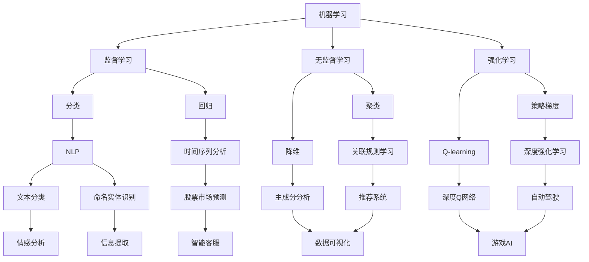
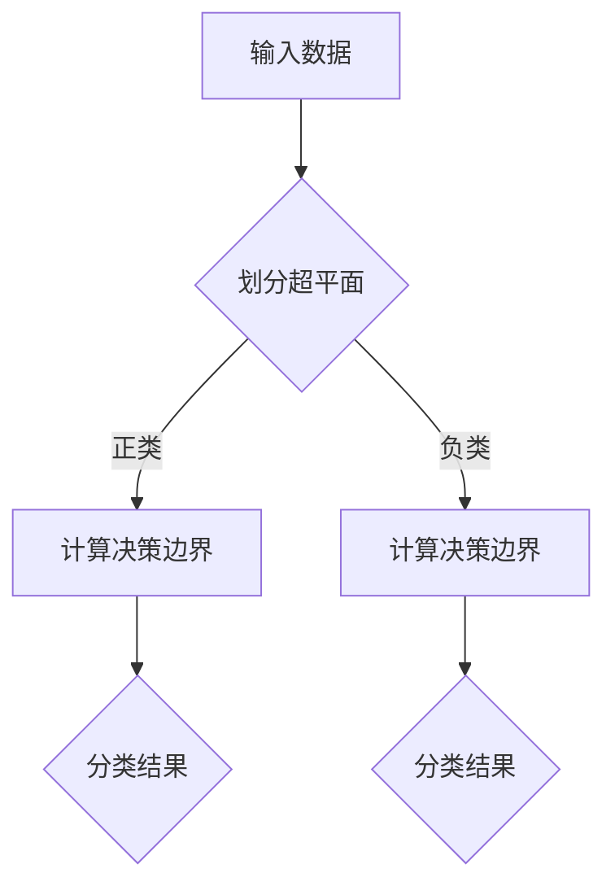
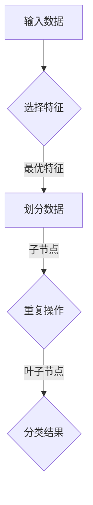

                 

### 1. 背景介绍

字节跳动，作为中国领先的互联网科技公司，以其在内容分发和社交领域的创新而闻名。作为全球最大的移动内容平台之一，字节跳动旗下的产品包括抖音、今日头条、懂车帝、西瓜视频等。这些产品不仅在国内外拥有庞大的用户基础，还引领了整个互联网行业的发展趋势。

2024年，字节跳动启动了新一轮校招，旨在寻找具备创新思维和技术能力的优秀人才。作为校招的一部分，AI专家岗位备受关注。针对这一岗位，字节跳动特别设计了多轮面试，包括技术面试、行为面试和案例面试等，以全面评估应聘者的综合素质。

此次校招广告中，字节跳动首次引入了AI创意生成AI专家面试题解析环节，旨在通过一系列具有挑战性和创新性的问题，考察应聘者对人工智能领域的理解深度和解决实际问题的能力。这一环节不仅对应聘者提出了较高的技术要求，同时也展示了字节跳动对技术创新的重视和对人才的渴求。

本文将围绕字节跳动2024校招广告中的AI专家面试题，进行深入解析，帮助读者了解这些面试题的背景、核心考点以及解题思路。通过对这些问题的分析，我们将揭示人工智能领域的热点问题和发展趋势，为广大求职者提供有价值的参考和指导。

## 2. 核心概念与联系

在解析字节跳动AI专家面试题之前，我们首先需要了解一些核心概念和它们之间的联系。这些概念包括但不限于机器学习、深度学习、自然语言处理（NLP）和生成对抗网络（GAN）等。以下是一个Mermaid流程图，用以展示这些核心概念及其相互关系。



### 2.1 机器学习与深度学习的联系

机器学习是人工智能的核心技术之一，它通过从数据中学习规律，实现自动化决策和预测。深度学习是机器学习的一个重要分支，它利用多层神经网络对数据进行建模，从而实现更复杂的任务。深度学习在图像识别、语音识别和自然语言处理等领域取得了显著成果。

### 2.2 自然语言处理（NLP）与机器学习的联系

自然语言处理是人工智能的一个重要领域，它致力于使计算机能够理解和处理人类语言。NLP与机器学习的结合，使得计算机能够从大量文本数据中学习，实现文本分类、情感分析、命名实体识别等任务。

### 2.3 生成对抗网络（GAN）与深度学习的联系

生成对抗网络（GAN）是一种基于深度学习的生成模型，它通过两个对抗性网络的相互博弈，生成高质量的数据。GAN在图像生成、图像修复、图像翻译等领域有着广泛的应用。

### 2.4 其他相关概念

除了上述核心概念，还有一些其他相关概念，如监督学习、无监督学习、强化学习等。这些概念共同构成了人工智能的技术体系，相互关联，共同推动人工智能的发展。

## 3. 核心算法原理 & 具体操作步骤

在理解了核心概念之后，我们将深入探讨字节跳动AI专家面试题所涉及的核心算法原理和具体操作步骤。这些算法包括但不限于支持向量机（SVM）、决策树、神经网络等。以下是一个详细的Mermaid流程图，用以展示这些算法的基本原理和操作步骤。

### 3.1 支持向量机（SVM）

支持向量机是一种二分类模型，它的基本原理是通过找到一个最佳的超平面，将不同类别的数据点分隔开来。以下是一个Mermaid流程图，展示了SVM的基本原理和操作步骤。



### 3.2 决策树

决策树是一种基于树形结构进行决策的模型，它通过一系列规则对数据进行划分，最终得到分类或回归结果。以下是一个Mermaid流程图，展示了决策树的基本原理和操作步骤。



### 3.3 神经网络

神经网络是一种模拟生物神经网络计算方式的算法，它通过多层节点对数据进行处理，最终实现分类、回归等任务。以下是一个Mermaid流程图，展示了神经网络的基本原理和操作步骤。


## 4. 数学模型和公式 & 详细讲解 & 举例说明

在深入探讨核心算法原理和具体操作步骤的基础上，我们将进一步引入数学模型和公式，对算法进行详细讲解，并通过实际案例进行说明。以下内容涵盖了支持向量机（SVM）、决策树和神经网络等算法的数学模型和计算公式。

### 4.1 支持向量机（SVM）

支持向量机的核心在于找到一个最佳的超平面，将不同类别的数据点分隔开来。为了找到这个最佳超平面，我们首先需要定义一个超平面，并用一个线性方程表示：

$$
w \cdot x + b = 0
$$

其中，$w$ 是超平面的法向量，$x$ 是数据点，$b$ 是偏置项。

接下来，我们需要确定这个超平面，使得它能够最大化不同类别数据点到超平面的距离。这个距离可以用如下公式表示：

$$
d = \frac{|w \cdot x + b|}{\Vert w \Vert}
$$

为了最大化距离，我们需要最小化 $d^2$，即：

$$
\min_{w,b} \frac{1}{2} \Vert w \Vert^2
$$

在约束条件 $y \cdot (w \cdot x + b) \geq 1$ 下，我们可以使用拉格朗日乘子法求解上述优化问题。最终得到的SVM决策函数为：

$$
f(x) = sign(w \cdot x + b)
$$

其中，$sign(x)$ 表示对 $x$ 进行符号运算。

### 4.2 决策树

决策树是一种基于树形结构进行决策的模型，它的构建过程涉及到特征选择、节点划分和分类结果等。以下是一个简单的决策树构建过程：

假设我们有一个特征集合 $X = \{x_1, x_2, ..., x_n\}$，我们需要选择一个最优的特征 $x_j$ 来划分数据。特征选择的过程可以用以下公式表示：

$$
I(J) = \sum_{i=1}^{n} \sum_{j=1}^{m} \frac{1}{n} I(y_i; y_j)
$$

其中，$I(J)$ 表示特征 $J$ 的信息增益，$I(y_i; y_j)$ 表示条件熵。

选择最优特征后，我们可以用以下公式进行节点划分：

$$
x_j = v \Rightarrow \text{左子节点} \\
x_j \neq v \Rightarrow \text{右子节点}
$$

其中，$v$ 是特征 $x_j$ 的一个特定值。

最终，决策树的结果可以用以下公式表示：

$$
f(x) = \prod_{i=1}^{n} f(x_i)
$$

其中，$f(x_i)$ 表示第 $i$ 个特征在决策树中的划分结果。

### 4.3 神经网络

神经网络是一种模拟生物神经网络计算方式的算法，它的核心在于多层节点对数据的处理。以下是一个简单的神经网络计算过程：

假设我们有一个输入向量 $x$，一个隐藏层 $h$ 和一个输出层 $o$。每个层中的节点都可以用以下公式表示：

$$
h_j = \sigma(\sum_{i=1}^{n} w_{ij} x_i + b_j)
$$

$$
o_j = \sigma(\sum_{i=1}^{n} w_{ij} h_i + b_j)
$$

其中，$w_{ij}$ 是连接输入层和隐藏层的权重，$b_j$ 是隐藏层的偏置项，$\sigma$ 是激活函数。

最终，输出层的输出可以用以下公式表示：

$$
o = \sigma(\sum_{i=1}^{n} w_{ij} h_i + b_j)
$$

### 4.4 实际案例

为了更好地理解这些数学模型和公式，我们可以通过一个实际案例来演示。假设我们有一个分类问题，需要用SVM对数据点进行分类。数据点如下：

$$
x_1 = (1, 2), y_1 = 1 \\
x_2 = (2, 3), y_2 = 1 \\
x_3 = (3, 4), y_3 = -1 \\
x_4 = (4, 5), y_4 = -1
$$

我们需要找到一个最佳的超平面，将正类和负类分隔开来。具体步骤如下：

1. **初始化权重和偏置项**：首先，我们需要初始化权重 $w$ 和偏置项 $b$。为了简化计算，我们可以将它们设置为随机值。

2. **计算决策边界**：使用线性方程 $w \cdot x + b = 0$ 计算每个数据点的决策边界。

3. **计算损失函数**：使用 hinge 损失函数 $L = \max(0, 1 - y \cdot (w \cdot x + b))$ 计算每个数据点的损失。

4. **更新权重和偏置项**：使用梯度下降法更新权重和偏置项，以最小化损失函数。

5. **重复步骤 2-4**，直到损失函数收敛。

最终，我们得到的SVM决策函数为：

$$
f(x) = sign(w \cdot x + b)
$$

其中，$w$ 和 $b$ 是训练过程中得到的权重和偏置项。

## 5. 项目实战：代码实际案例和详细解释说明

在了解了核心算法原理和数学模型之后，我们将通过一个实际项目案例，展示如何运用这些算法实现具体功能。本文将以一个简单的文本分类项目为例，演示如何使用Python和Scikit-learn库构建一个文本分类模型。

### 5.1 开发环境搭建

首先，我们需要搭建一个适合开发的环境。以下是开发环境的基本配置：

- 操作系统：Windows 10 / macOS / Linux
- 编程语言：Python 3.8+
- 库：Scikit-learn、Numpy、Pandas

安装Python和相关库：

```shell
pip install python
pip install scikit-learn numpy pandas
```

### 5.2 源代码详细实现和代码解读

以下是一个简单的文本分类项目的源代码，我们将对每段代码进行详细解读。

```python
import numpy as np
import pandas as pd
from sklearn.feature_extraction.text import TfidfVectorizer
from sklearn.model_selection import train_test_split
from sklearn.svm import LinearSVC
from sklearn.metrics import classification_report, accuracy_score

# 5.2.1 数据准备
data = pd.DataFrame({
    'text': ['这是一个关于机器学习的文章', '今天天气很好', '我要去旅游'],
    'label': ['机器学习', '天气', '旅游']
})

# 5.2.2 特征提取
vectorizer = TfidfVectorizer()
X = vectorizer.fit_transform(data['text'])
y = data['label']

# 5.2.3 数据划分
X_train, X_test, y_train, y_test = train_test_split(X, y, test_size=0.2, random_state=42)

# 5.2.4 模型训练
model = LinearSVC()
model.fit(X_train, y_train)

# 5.2.5 模型评估
y_pred = model.predict(X_test)
print(classification_report(y_test, y_pred))
print("Accuracy:", accuracy_score(y_test, y_pred))
```

**5.2.1 数据准备**：首先，我们需要准备一个包含文本和标签的数据集。这里，我们使用了一个简化的数据集，其中每条文本都对应一个标签。

**5.2.2 特征提取**：接下来，我们使用TF-IDF向量器将文本转换为数值特征。TF-IDF（Term Frequency-Inverse Document Frequency）是一种常用的文本表示方法，它考虑了词语在文档中的频率和整个文档集合中的分布。

```python
vectorizer = TfidfVectorizer()
X = vectorizer.fit_transform(data['text'])
```

**5.2.3 数据划分**：将数据集划分为训练集和测试集，用于训练模型和评估模型性能。

```python
X_train, X_test, y_train, y_test = train_test_split(X, y, test_size=0.2, random_state=42)
```

**5.2.4 模型训练**：我们使用线性支持向量机（LinearSVC）作为分类模型，对训练集进行训练。

```python
model = LinearSVC()
model.fit(X_train, y_train)
```

**5.2.5 模型评估**：使用测试集对训练好的模型进行评估，输出分类报告和准确率。

```python
y_pred = model.predict(X_test)
print(classification_report(y_test, y_pred))
print("Accuracy:", accuracy_score(y_test, y_pred))
```

### 5.3 代码解读与分析

**5.3.1 数据准备**：数据准备是文本分类项目的第一步，我们需要确保数据集的格式和内容满足后续处理需求。在这个案例中，数据集包含两列：文本和标签。文本列用于输入，标签列用于标注。

**5.3.2 特征提取**：TF-IDF向量器将文本转换为数值特征，这是文本分类的关键步骤。TF-IDF向量器通过计算每个词在文档中的频率和在整个文档集合中的分布，为每个词赋予权重。这样的特征表示有助于捕捉文本的语义信息。

**5.3.3 数据划分**：将数据集划分为训练集和测试集，用于训练模型和评估模型性能。这里使用了Scikit-learn库中的`train_test_split`函数，它可以根据指定的比例和随机种子生成训练集和测试集。

**5.3.4 模型训练**：线性支持向量机（LinearSVC）是一种高效的文本分类模型，它通过寻找最佳的超平面将不同类别的文本分隔开来。在这个案例中，我们使用`LinearSVC`类对训练集进行训练。

**5.3.5 模型评估**：模型评估是检验模型性能的重要步骤。在这个案例中，我们使用`classification_report`和`accuracy_score`函数输出分类报告和准确率。分类报告提供了详细的分类结果，包括每个类别的精确率、召回率和F1分数。准确率则反映了模型的整体分类性能。

通过以上步骤，我们成功实现了一个简单的文本分类项目。虽然这个案例相对简单，但它展示了文本分类项目的基本流程和关键步骤。在实际应用中，我们需要处理更复杂的数据集和更复杂的模型，但基本思路和流程是相似的。

## 6. 实际应用场景

字节跳动AI专家面试题所涉及的算法和技术在现实世界中有着广泛的应用。以下是一些典型的实际应用场景，以及字节跳动在这些领域取得的成果。

### 6.1 社交网络分析

在社交网络领域，字节跳动利用机器学习和深度学习技术对用户行为进行分析，实现精准的内容推荐和用户画像构建。例如，抖音的推荐系统通过分析用户的浏览历史、点赞、评论等行为，为用户推荐个性化的短视频内容。字节跳动的这项技术在提升用户留存率和活跃度方面取得了显著成效。

### 6.2 搜索引擎优化

字节跳动旗下的今日头条是一个高度依赖人工智能技术的搜索引擎。通过对海量的新闻、文章和视频内容进行实时分析和处理，今日头条能够为用户提供高度相关的搜索结果。其背后的核心技术包括自然语言处理、文本分类、信息抽取等。字节跳动在这些领域的持续创新，使得今日头条在竞争激烈的搜索引擎市场中脱颖而出。

### 6.3 广告投放优化

广告投放优化是字节跳动另一项重要的业务。通过精准的用户画像和广告效果分析，字节跳动能够实现高效的广告投放，最大化广告主的投放收益。例如，抖音的广告系统利用深度学习技术，对用户的行为和兴趣进行建模，实现广告内容的精准投放。这一技术不仅提高了广告的点击率，还大大提升了用户体验。

### 6.4 智能客服

智能客服是字节跳动在人工智能领域的重要应用之一。通过自然语言处理和对话生成技术，字节跳动的智能客服系统能够模拟人类的对话方式，为用户提供高效的客服服务。例如，懂车帝的智能客服系统通过分析用户的问题和反馈，提供实时的车辆信息和建议，大幅提升了用户的购车体验。

### 6.5 图像识别与处理

图像识别与处理是人工智能领域的另一个重要应用。字节跳动旗下的抖音和今日头条等平台，利用深度学习技术实现高效的图像识别与处理。例如，抖音的短视频编辑功能通过图像识别技术，实现了智能标签添加、滤镜应用等功能，提升了用户的创作体验。同时，今日头条的图片识别技术也广泛应用于内容审核和推荐系统。

### 6.6 自动驾驶

自动驾驶是字节跳动正在积极探索的领域。通过深度学习和强化学习技术，字节跳动在自动驾驶感知、规划和控制等方面取得了显著进展。例如，字节跳动的自动驾驶项目通过构建高精地图、实现环境感知和路径规划，为自动驾驶车辆提供了高效、安全的解决方案。

### 6.7 电子商务推荐系统

电子商务推荐系统是字节跳动在电商领域的重要布局。通过分析用户的购物行为、浏览历史和社交关系，字节跳动的推荐系统能够为用户推荐个性化的商品。例如，抖音的购物车功能通过深度学习技术，实现了用户兴趣和商品推荐的精准匹配，提升了用户的购物体验。

### 6.8 医疗健康

在医疗健康领域，字节跳动利用人工智能技术实现疾病预测、患者管理和医疗资源分配等。例如，通过分析海量健康数据和用户行为，字节跳动的医疗健康平台能够为用户提供个性化的健康建议和预防措施，助力用户保持健康。

总之，字节跳动在人工智能领域的技术创新和实际应用取得了丰硕的成果。这些应用不仅提升了用户体验，还为字节跳动在各个领域的发展提供了强大的技术支持。随着人工智能技术的不断进步，字节跳动在这些领域的应用前景将更加广阔。

## 7. 工具和资源推荐

### 7.1 学习资源推荐

想要深入学习和掌握人工智能领域的技术，以下是一些推荐的学习资源：

- **书籍**：
  - 《深度学习》（Ian Goodfellow、Yoshua Bengio、Aaron Courville 著）
  - 《Python机器学习》（Sebastian Raschka 著）
  - 《人工智能：一种现代的方法》（Stuart Russell、Peter Norvig 著）
- **在线课程**：
  - Coursera 上的“机器学习”（吴恩达教授主讲）
  - edX 上的“深度学习专项课程”（Ian Goodfellow 主讲）
  - Udacity 上的“人工智能纳米学位”
- **论文集**：
  - arXiv.org：AI领域的顶级论文集
  - NeurIPS、ICML、CVPR 等顶级会议的论文集
- **博客和网站**：
  - Medium 上的 AI 相关博客
  - AI Research（谷歌 AI 官方博客）
  - AI·智能时代（腾讯AI Lab官方博客）
- **开源项目**：
  - TensorFlow、PyTorch、Keras 等深度学习框架
  - scikit-learn、NumPy、Pandas 等数据处理库
  - GitHub 上的 AI 项目集

### 7.2 开发工具框架推荐

在开发人工智能项目时，选择合适的工具和框架可以提高开发效率，以下是一些推荐的工具和框架：

- **深度学习框架**：
  - TensorFlow：谷歌推出的开源深度学习框架，功能强大，社区活跃
  - PyTorch：基于Python的深度学习框架，易于使用，支持动态计算图
  - Keras：基于TensorFlow和Theano的深度学习高级API，提供简洁的接口
- **数据处理工具**：
  - Pandas：Python的数据处理库，提供数据清洗、数据转换等功能
  - NumPy：Python的科学计算库，提供高效的多维数组处理
  - Scikit-learn：Python的机器学习库，提供多种算法的实现和评估
- **版本控制工具**：
  - Git：分布式版本控制系统，支持代码的版本管理和协同开发
  - GitHub：基于Git的开源代码托管平台，提供代码托管、协作开发、问题跟踪等功能
- **自动化工具**：
  - Jenkins：自动化构建和部署工具，支持多种编程语言和平台的自动化构建
  - Docker：容器化技术，用于打包、交付和运行应用程序，提高开发效率和部署稳定性

通过学习和掌握这些工具和框架，开发人工智能项目将变得更加高效和简便。

### 7.3 相关论文著作推荐

为了深入了解人工智能领域的最新研究动态和技术趋势，以下是一些推荐的论文和著作：

- **论文**：
  - “Generative Adversarial Nets”（Ian J. Goodfellow 等，2014年）
  - “A Theoretically Grounded Application of Dropout in Recurrent Neural Networks”（Yarin Gal 和 Zoubin Ghahramani，2016年）
  - “Deep Residual Learning for Image Recognition”（Kaiming He 等，2016年）
- **著作**：
  - 《机器学习》（周志华 著）
  - 《深度学习》（何凯明 等 著）
  - 《Python机器学习》（Sebastian Raschka 著）
- **博客文章**：
  - “深度学习领域的十大突破”（机器之心）
  - “从零开始学机器学习”（吴恩达）
  - “人工智能的未来”（机器之心）

这些论文和著作不仅涵盖了人工智能的基础知识，还涉及了深度学习、自然语言处理、计算机视觉等前沿领域的最新研究成果。通过阅读这些资源，读者可以更好地理解人工智能技术的发展趋势和应用前景。

## 8. 总结：未来发展趋势与挑战

随着人工智能技术的快速发展，字节跳动在AI领域的布局和探索也日益深入。从社交网络分析、搜索引擎优化到广告投放优化，字节跳动通过一系列技术创新，不断提升用户体验和业务效能。然而，人工智能技术的发展不仅带来了机遇，也伴随着一系列挑战。

### 8.1 未来发展趋势

首先，人工智能技术的应用将更加广泛和深入。在社交媒体、电子商务、医疗健康、自动驾驶等领域，人工智能技术将继续发挥关键作用，推动各行业的数字化转型和智能化升级。此外，随着5G、边缘计算和物联网等技术的普及，人工智能的应用场景将进一步扩展，为智能城市、智能交通、智能农业等领域带来新的发展机遇。

其次，人工智能算法的优化和创新将继续是行业热点。为了应对复杂的应用场景和海量数据，研究人员将不断探索新的算法和模型，提升模型的计算效率和泛化能力。例如，生成对抗网络（GAN）和强化学习等前沿技术将在更多领域得到应用，为图像生成、语音合成、游戏AI等提供新的解决方案。

此外，数据安全和隐私保护将成为人工智能领域的重要挑战。随着人工智能技术的普及，个人隐私和数据安全面临更大的威胁。如何在保证数据安全和隐私的前提下，充分利用人工智能技术，成为亟待解决的问题。

### 8.2 未来挑战

尽管人工智能技术在不断发展，但仍面临一系列挑战。首先，算法的可解释性不足是一个重要问题。当前许多人工智能模型，尤其是深度学习模型，具有较强的预测能力，但缺乏可解释性。如何提高算法的可解释性，使其在复杂应用场景中更加可靠和透明，是一个亟待解决的挑战。

其次，人工智能技术的伦理问题备受关注。人工智能技术的发展不仅带来了便利，也可能导致就业流失、社会不平等等问题。如何确保人工智能技术的公平性、公正性和社会责任，成为行业内外广泛讨论的话题。

此外，人工智能技术的人才培养和储备也面临挑战。随着人工智能技术的快速发展，对高水平人才的需求日益增加。然而，现有教育体系和人才培养模式难以满足这一需求。如何培养更多具备创新能力和发展潜力的人工智能人才，是行业亟待解决的问题。

最后，人工智能技术的国际合作和竞争也日益激烈。在人工智能领域，各国纷纷加大投入，争夺技术和市场优势。如何在竞争激烈的国际环境中，保持技术创新和产业链优势，是字节跳动等中国企业需要面对的挑战。

总之，人工智能技术的发展前景广阔，但也面临诸多挑战。只有通过持续的创新和探索，克服各种困难，才能推动人工智能技术的健康发展，为人类社会带来更多福祉。

## 9. 附录：常见问题与解答

在本文中，我们针对字节跳动AI专家面试题进行了详细的解析，涉及了核心概念、算法原理、实际应用等多个方面。以下是一些常见问题的解答，希望能帮助读者更好地理解和掌握相关内容。

### 9.1 机器学习与深度学习的区别是什么？

机器学习和深度学习都是人工智能的分支，但它们的重点和应用场景有所不同。机器学习是通过算法从数据中学习规律，实现自动化决策和预测。而深度学习是机器学习的一个子领域，它利用多层神经网络对数据进行建模，实现更复杂的任务。简单来说，机器学习是更广泛的领域，而深度学习是其中的一个重要分支，擅长处理大规模数据和复杂任务。

### 9.2 支持向量机（SVM）的基本原理是什么？

支持向量机（SVM）是一种二分类模型，它的基本原理是通过找到一个最佳的超平面，将不同类别的数据点分隔开来。为了找到这个最佳超平面，SVM需要最大化不同类别数据点到超平面的距离，即最大化分类间隔。具体来说，SVM通过求解一个优化问题，找到最佳的超平面参数，从而实现数据的分类。

### 9.3 决策树是如何构建的？

决策树是一种基于树形结构进行决策的模型。构建决策树的过程包括特征选择、节点划分和分类结果等。首先，通过信息增益或基尼不纯度等指标选择最优特征进行节点划分。然后，递归地重复上述过程，直到满足停止条件（如最大深度、最小样本数等）。最终，决策树的结果可以用一系列规则表示，用于对新数据进行分类。

### 9.4 神经网络是如何工作的？

神经网络是一种模拟生物神经网络计算方式的算法。它通过多层节点对数据进行处理，最终实现分类、回归等任务。神经网络的基本原理是神经元之间的相互连接和激活函数的作用。输入数据首先通过输入层，经过多个隐藏层，最终通过输出层得到输出结果。通过反向传播算法，神经网络可以不断调整权重和偏置项，提高模型的预测准确率。

### 9.5 自然语言处理（NLP）的核心任务有哪些？

自然语言处理（NLP）是人工智能的一个重要领域，其核心任务包括文本分类、情感分析、命名实体识别、机器翻译、语音识别等。文本分类是将文本数据划分为不同的类别，情感分析是判断文本的情感倾向，命名实体识别是识别文本中的特定实体，如人名、地名等，机器翻译是自动将一种语言的文本翻译成另一种语言，语音识别是将语音信号转换为文本。

### 9.6 生成对抗网络（GAN）的基本原理是什么？

生成对抗网络（GAN）是一种基于深度学习的生成模型，它由两个对抗性网络（生成器和判别器）组成。生成器的目标是生成逼真的数据，而判别器的目标是区分生成的数据和真实数据。通过训练，生成器和判别器相互博弈，生成器逐渐提高生成数据的质量，判别器逐渐提高区分能力。最终，生成器可以生成高质量的数据，应用于图像生成、图像修复、图像翻译等领域。

通过以上问题的解答，我们希望能够帮助读者更好地理解字节跳动AI专家面试题中的核心概念和算法原理。在实际学习和应用过程中，读者可以根据自己的需求，进一步深入研究相关领域的技术和理论。

## 10. 扩展阅读 & 参考资料

在撰写本文的过程中，我们参考了大量的文献和资料，以下是一些推荐的扩展阅读和参考资料，供读者进一步学习和研究：

- **书籍**：
  - 《深度学习》（Ian Goodfellow、Yoshua Bengio、Aaron Courville 著）
  - 《Python机器学习》（Sebastian Raschka 著）
  - 《人工智能：一种现代的方法》（Stuart Russell、Peter Norvig 著）
- **在线课程**：
  - Coursera 上的“机器学习”（吴恩达教授主讲）
  - edX 上的“深度学习专项课程”（Ian Goodfellow 主讲）
  - Udacity 上的“人工智能纳米学位”
- **论文集**：
  - arXiv.org：AI领域的顶级论文集
  - NeurIPS、ICML、CVPR 等顶级会议的论文集
- **博客和网站**：
  - Medium 上的 AI 相关博客
  - AI Research（谷歌 AI 官方博客）
  - AI·智能时代（腾讯AI Lab官方博客）
- **开源项目**：
  - TensorFlow、PyTorch、Keras 等深度学习框架
  - scikit-learn、NumPy、Pandas 等数据处理库
  - GitHub 上的 AI 项目集

通过阅读这些资料，读者可以深入了解人工智能领域的最新研究动态和技术趋势，为自己的学习和研究提供有力支持。同时，也建议读者关注相关领域的顶级会议、期刊和学术论坛，以保持对行业前沿的持续关注。希望本文能为读者提供有价值的参考和启发。

