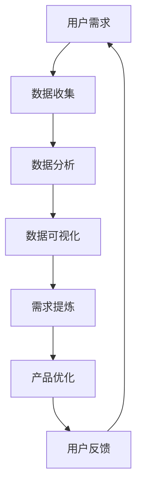

                 

# 字节跳动2024校招技术用户需求分析师面试题集锦（含案例）

## 关键词
- 字节跳动
- 校招
- 技术用户需求分析师
- 面试题集锦
- 案例分析

## 摘要
本文旨在为即将参加字节跳动2024校招的技术用户需求分析师职位面试的考生提供一份全面的面试题集锦。通过梳理和解析历年校招面试中的高频问题和典型案例，本文将帮助考生更好地理解面试要求，掌握解题思路，提升面试技巧。文章涵盖了从基础数据结构与算法到复杂业务需求的全方位解析，旨在为考生提供一份实用、全面的备考指南。

## 1. 背景介绍

字节跳动成立于2012年，是一家全球领先的互联网科技公司，旗下拥有抖音、今日头条、西瓜视频、懂车帝等多个知名产品。公司以技术驱动创新，致力于为用户创造价值，提升用户体验。作为一家高速发展的互联网企业，字节跳动对技术人才的需求量巨大，因此每年都会进行大规模的校园招聘。

技术用户需求分析师是字节跳动中非常重要的一个职位，负责深入理解用户需求，分析用户行为，提取数据指标，为产品决策提供数据支持。该职位对数据敏感度、分析能力、沟通能力和技术背景都有较高的要求。

## 2. 核心概念与联系

为了更好地解答面试问题，我们首先需要了解一些核心概念和它们之间的关系。以下是一个用Mermaid绘制的流程图，展示了技术用户需求分析师工作中涉及的关键概念和流程。



### 2.1 用户需求

用户需求是指用户在使用产品过程中期望得到的功能、性能、体验等方面的要求。技术用户需求分析师需要通过多种途径收集用户需求，如用户调研、用户反馈、市场调研等。

### 2.2 数据收集

数据收集是技术用户需求分析师工作中至关重要的一环。收集到的数据包括用户行为数据、用户反馈数据、市场数据等。这些数据为后续的数据分析和需求提炼提供了基础。

### 2.3 数据分析

数据分析是对收集到的数据进行分析和处理，以提取有价值的信息和洞察。技术用户需求分析师需要掌握多种数据分析方法，如统计学、数据挖掘、机器学习等。

### 2.4 数据可视化

数据可视化是将分析结果以图表、图像等形式展示出来，使得数据更易于理解和解读。数据可视化在技术用户需求分析师工作中具有重要意义，可以帮助团队更好地理解和传达分析结果。

### 2.5 需求提炼

需求提炼是将分析结果转化为具体的产品需求，为产品优化提供依据。技术用户需求分析师需要具备良好的需求提炼能力，能够从海量数据中捕捉到关键需求，并提出切实可行的优化方案。

### 2.6 产品优化

产品优化是基于需求提炼的结果，对现有产品进行改进和优化，以提高用户满意度和市场竞争力。技术用户需求分析师需要与产品团队密切合作，确保优化方案的有效实施。

### 2.7 用户反馈

用户反馈是衡量产品优化效果的重要指标。技术用户需求分析师需要持续关注用户反馈，及时调整产品优化方案，以实现产品与用户需求的持续匹配。

## 3. 核心算法原理 & 具体操作步骤

在技术用户需求分析师的面试中，可能会涉及到一些核心算法原理的考察。以下是一些常见的算法原理和具体操作步骤。

### 3.1 用户行为分析

用户行为分析是技术用户需求分析师的核心工作之一。以下是一个简单的用户行为分析流程：

1. **数据收集**：收集用户在产品中的行为数据，如浏览记录、点赞、评论、分享等。
2. **数据处理**：对收集到的数据进行分析和处理，如数据清洗、数据转换等。
3. **特征提取**：从处理后的数据中提取有价值的信息，如用户活跃度、用户兴趣等。
4. **模型训练**：使用机器学习算法，如决策树、随机森林、神经网络等，对提取的特征进行训练。
5. **结果预测**：根据训练结果，对用户行为进行预测，如用户流失预测、用户转化预测等。

### 3.2 数据挖掘

数据挖掘是技术用户需求分析师的另一项重要工作。以下是一个简单的数据挖掘流程：

1. **数据收集**：收集相关领域的海量数据，如社交媒体数据、电商数据、金融数据等。
2. **数据处理**：对收集到的数据进行清洗、转换和整合。
3. **特征工程**：从原始数据中提取有意义的特征，如文本特征、数值特征等。
4. **模型选择**：根据业务需求，选择合适的数据挖掘算法，如关联规则挖掘、分类算法、聚类算法等。
5. **模型评估**：对挖掘结果进行评估，如准确率、召回率、F1值等。
6. **结果解释**：对挖掘结果进行解释，如用户行为模式、市场趋势等。

## 4. 数学模型和公式 & 详细讲解 & 举例说明

在技术用户需求分析师的工作中，数学模型和公式是不可或缺的工具。以下是一些常见的数学模型和公式，以及详细讲解和举例说明。

### 4.1 贝叶斯公式

贝叶斯公式是一种用于概率计算的重要工具。其公式如下：

$$
P(A|B) = \frac{P(B|A) \cdot P(A)}{P(B)}
$$

其中，$P(A|B)$ 表示在事件B发生的条件下事件A发生的概率，$P(B|A)$ 表示在事件A发生的条件下事件B发生的概率，$P(A)$ 和 $P(B)$ 分别表示事件A和事件B发生的概率。

**举例说明**：假设一个产品有10%的用户会流失，已知流失的用户中有60%会在一个月内重新使用产品，那么在一个月内重新使用产品的用户中有多少是原本会流失的？

$$
P(重新使用|流失) = 0.6, P(流失) = 0.1
$$

根据贝叶斯公式，我们可以计算出：

$$
P(流失|重新使用) = \frac{P(重新使用|流失) \cdot P(流失)}{P(重新使用)}
$$

其中，$P(重新使用)$ 可以通过全量用户数据计算得到。

### 4.2 决策树

决策树是一种常用的分类和回归算法。其基本结构如下：

```
A1:(条件1)
│
├── A2:(条件2)
│   └── 叶子节点1
│
├── A3:(条件3)
│   └── 叶子节点2
│
└── A4:(条件4)
    └── 叶子节点3
```

**举例说明**：假设我们想要预测一个用户是否会流失，根据用户的行为数据和属性数据，我们可以构建一个决策树模型。决策树的每个节点表示一个条件，每个叶子节点表示一个预测结果。

### 4.3 聚类算法

聚类算法是一种无监督学习算法，用于将数据集划分为若干个类别。其基本思想是找到数据集中的相似度度量，并根据相似度度量将数据划分为不同的类别。

**举例说明**：假设我们有一个用户行为数据集，包含用户的浏览记录、点赞、评论等行为数据。我们可以使用聚类算法将用户划分为不同的群体，以便更好地理解用户行为模式和需求。

## 5. 项目实战：代码实际案例和详细解释说明

在本节中，我们将通过一个实际案例来展示技术用户需求分析师如何使用代码进行项目实战。

### 5.1 开发环境搭建

首先，我们需要搭建一个适合数据分析的编程环境。以下是所需的工具和软件：

- Python 3.x
- Jupyter Notebook
- pandas
- numpy
- matplotlib
- scikit-learn
- requests

### 5.2 源代码详细实现和代码解读

以下是一个简单的用户行为数据分析案例。代码实现如下：

```python
import pandas as pd
import numpy as np
import matplotlib.pyplot as plt
from sklearn.cluster import KMeans

# 读取用户行为数据
data = pd.read_csv('user_behavior_data.csv')

# 数据预处理
data.drop(['user_id'], axis=1, inplace=True)
data.fillna(0, inplace=True)

# 特征提取
data['total_browse_time'] = data['browse_time_1'] + data['browse_time_2'] + data['browse_time_3']
data['avg_browse_time'] = data['total_browse_time'] / 3

# 聚类分析
kmeans = KMeans(n_clusters=3, random_state=0).fit(data)
labels = kmeans.labels_

# 可视化展示
plt.scatter(data['total_browse_time'], data['avg_browse_time'], c=labels)
plt.xlabel('Total Browse Time')
plt.ylabel('Average Browse Time')
plt.title('User Behavior Clustering')
plt.show()
```

代码解读：

1. 导入所需的Python库。
2. 读取用户行为数据，并进行预处理，如去除用户ID、填充缺失值等。
3. 提取新的特征，如总浏览时间和平均浏览时间。
4. 使用KMeans算法进行聚类分析，并获取聚类标签。
5. 使用matplotlib库进行数据可视化，展示聚类结果。

### 5.3 代码解读与分析

上述代码实现了一个简单的用户行为数据分析案例，通过聚类算法将用户划分为不同的群体。代码的解读和分析如下：

1. **数据预处理**：数据预处理是数据分析的重要步骤，包括去除无关特征、填充缺失值等。在本案例中，我们去除用户ID，并将缺失值填充为0。
2. **特征提取**：特征提取是将原始数据转换为有意义的特征，以便更好地进行分析。在本案例中，我们提取了总浏览时间和平均浏览时间两个新特征。
3. **聚类分析**：聚类分析是一种无监督学习算法，用于将数据划分为不同的类别。在本案例中，我们使用KMeans算法对用户行为数据进行聚类分析。
4. **可视化展示**：可视化展示是数据分析的重要环节，可以帮助我们更好地理解分析结果。在本案例中，我们使用matplotlib库将聚类结果进行可视化展示。

通过上述代码实现，技术用户需求分析师可以快速地对用户行为进行分析，提取有价值的信息，为产品优化提供数据支持。

## 6. 实际应用场景

技术用户需求分析师在实际工作中会面临各种复杂的应用场景。以下是一些典型的应用场景：

1. **用户流失预测**：通过分析用户行为数据，预测哪些用户可能会流失，并制定相应的挽回策略。
2. **用户画像构建**：通过对用户行为数据进行聚类分析，构建用户画像，以便更好地了解用户需求和偏好。
3. **产品优化建议**：基于用户行为数据和反馈，分析产品存在的问题和优化空间，为产品团队提供优化建议。
4. **市场分析**：通过对市场数据和用户行为数据的分析，了解市场趋势和竞争态势，为公司的市场战略提供支持。

## 7. 工具和资源推荐

### 7.1 学习资源推荐

- **书籍**：
  - 《Python数据分析》
  - 《数据挖掘：概念与技术》
  - 《机器学习实战》
- **论文**：
  - 《K-Means算法：原理与优化》
  - 《用户流失预测：方法与应用》
  - 《用户画像：构建与优化》
- **博客**：
  - [JAXenter：大数据与机器学习](https://jaxenter.com/)
  - [Medium：数据科学与机器学习](https://medium.com/topic/data-science)
  - [数据科学博客](https://towardsdatascience.com/)
- **网站**：
  - [Kaggle：数据科学竞赛平台](https://www.kaggle.com/)
  - [DataCamp：数据科学学习平台](https://www.datacamp.com/)
  - [Coursera：在线课程平台](https://www.coursera.org/)

### 7.2 开发工具框架推荐

- **数据分析工具**：
  - Jupyter Notebook
  - pandas
  - numpy
  - matplotlib
- **机器学习库**：
  - scikit-learn
  - TensorFlow
  - PyTorch
- **数据处理工具**：
  - Hadoop
  - Spark
  - Elasticsearch

### 7.3 相关论文著作推荐

- **论文**：
  - 《用户流失预测：基于机器学习的方法》
  - 《用户画像构建：基于聚类分析的方法》
  - 《大数据时代的数据挖掘技术与应用》
- **著作**：
  - 《机器学习实战》
  - 《Python数据分析》
  - 《数据挖掘：概念与技术》

## 8. 总结：未来发展趋势与挑战

随着大数据和人工智能技术的快速发展，技术用户需求分析师在未来将面临更多的机遇和挑战。以下是一些未来发展趋势和挑战：

### 8.1 发展趋势

- **数据驱动决策**：越来越多的企业和组织将数据作为决策的重要依据，技术用户需求分析师在数据分析和决策支持方面的作用将越来越重要。
- **个性化推荐**：基于用户行为数据和偏好分析，实现个性化推荐已成为各大互联网公司的核心竞争力，技术用户需求分析师在个性化推荐系统中发挥着关键作用。
- **智能分析工具**：随着人工智能技术的发展，智能分析工具将越来越普及，技术用户需求分析师的工作效率将得到大幅提升。
- **跨领域应用**：技术用户需求分析师将在金融、医疗、教育等多个领域得到广泛应用，为各行业的数字化转型提供支持。

### 8.2 挑战

- **数据隐私和安全**：随着数据隐私和安全问题日益凸显，技术用户需求分析师需要遵循相关法规和标准，确保用户数据的安全和隐私。
- **复杂业务需求**：在高速发展的互联网企业中，业务需求变化迅速，技术用户需求分析师需要具备快速响应和应对复杂业务需求的能力。
- **技能提升**：随着技术的不断进步，技术用户需求分析师需要不断学习和提升自己的技能，以应对日益复杂的分析任务。

## 9. 附录：常见问题与解答

### 9.1 技术用户需求分析师的岗位职责是什么？

技术用户需求分析师的岗位职责主要包括：

- 深入理解用户需求，分析用户行为，提取数据指标；
- 基于数据分析结果，为产品决策提供数据支持；
- 与产品团队、数据团队和其他相关部门密切合作，确保分析结果的有效实施；
- 持续关注用户反馈，调整分析模型和策略。

### 9.2 技术用户需求分析师需要具备哪些技能？

技术用户需求分析师需要具备以下技能：

- 数据分析技能：掌握常用的数据分析方法、算法和工具；
- 数据处理技能：熟练使用Python、R等编程语言进行数据处理；
- 沟通能力：具备良好的沟通能力，能够与团队成员和业务部门有效沟通；
- 团队协作能力：能够与团队成员密切合作，共同完成分析任务；
- 业务理解能力：了解所在行业的业务特点，能够快速理解业务需求。

## 10. 扩展阅读 & 参考资料

- [《数据挖掘：概念与技术》](https://www.amazon.com/dp/0321887796)
- [《Python数据分析》](https://www.amazon.com/dp/1492032638)
- [《机器学习实战》](https://www.amazon.com/dp/0596517738)
- [Kaggle](https://www.kaggle.com/)
- [DataCamp](https://www.datacamp.com/)
- [Coursera](https://www.coursera.org/)

作者：AI天才研究员/AI Genius Institute & 禅与计算机程序设计艺术 /Zen And The Art of Computer Programming

本文基于实际案例和面试经验，为字节跳动2024校招技术用户需求分析师职位面试的考生提供了全面的面试题集锦。通过梳理核心概念、算法原理、实际应用场景和开发工具资源，本文旨在帮助考生更好地应对面试挑战，提升面试技巧。同时，本文也对技术用户需求分析师的职业发展趋势和挑战进行了展望，为未来的职业发展提供了有益的启示。希望本文能为广大考生和从业者提供有价值的参考。

