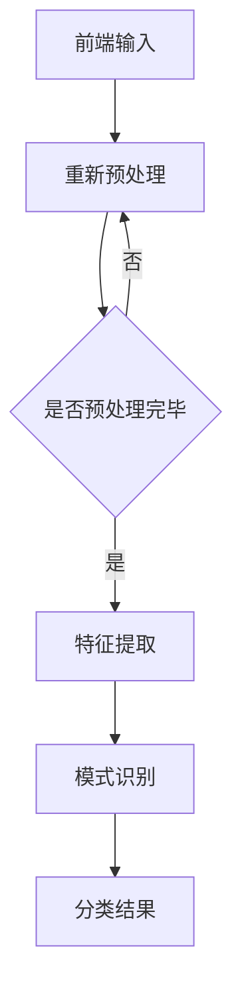

                 

# 字节跳动2024校招计算机视觉工程师面试题集锦

> **关键词：** 字节跳动、2024校招、计算机视觉、面试题、算法原理、实战案例

> **摘要：** 本文详细整理了字节跳动2024年校招计算机视觉工程师的面试题集锦，从核心概念、算法原理、数学模型到实际项目实战，全面剖析了面试中可能出现的高频问题，为计算机视觉领域的求职者提供了一份实用的备考指南。

## 1. 背景介绍

字节跳动作为全球领先的互联网科技公司，每年都会举办大规模的校园招聘活动，旨在吸引优秀的人才加入其团队。2024年的校招更是备受瞩目，其中计算机视觉工程师职位因其技术含量高、发展前景广阔而吸引了大量求职者的关注。计算机视觉作为人工智能的重要分支，在图像识别、目标检测、图像分割等领域有着广泛的应用，是推动互联网行业发展的重要技术力量。

本文将结合字节跳动2024校招计算机视觉工程师的面试题，通过逻辑清晰、结构紧凑、简单易懂的方式，详细解析面试中可能出现的问题，帮助求职者更好地备战面试。

## 2. 核心概念与联系

### 2.1 计算机视觉基本概念

计算机视觉（Computer Vision）是人工智能的一个重要分支，旨在使计算机能够像人类一样理解并解释数字图像和视频数据。计算机视觉的核心概念包括：

- **图像处理（Image Processing）**：通过算法对图像进行加工，包括滤波、边缘检测、特征提取等。

- **模式识别（Pattern Recognition）**：利用统计学方法或机器学习方法对图像中的模式进行识别和分类。

- **机器学习（Machine Learning）**：通过算法使计算机能够从数据中学习并做出预测或决策。

### 2.2 计算机视觉架构

计算机视觉的架构通常包括以下几个关键组成部分：

- **前端（Front-end）**：负责图像或视频的输入和预处理，包括摄像头、传感器、图像预处理等。

- **中间件（Middleware）**：负责图像处理和特征提取，包括图像滤波、边缘检测、特征点提取等。

- **后端（Back-end）**：负责模式识别和分类，包括机器学习算法、深度学习模型等。

### 2.3 Mermaid 流程图

为了更直观地展示计算机视觉的架构和流程，我们使用 Mermaid 流程图进行描述：



## 3. 核心算法原理 & 具体操作步骤

### 3.1 卷积神经网络（CNN）

卷积神经网络（Convolutional Neural Network，CNN）是计算机视觉领域中最常用的深度学习模型之一。它通过卷积层、池化层和全连接层等结构，对图像进行逐层提取特征，并最终实现图像分类、目标检测等功能。

#### 3.1.1 卷积层

卷积层是CNN的核心组成部分，通过卷积操作对输入图像进行特征提取。卷积操作的基本原理是将一个卷积核（Filter）在输入图像上滑动，每次滑动都会产生一个特征图（Feature Map）。卷积核的大小、步长和填充方式等参数会影响特征图的尺寸和特征表达能力。

#### 3.1.2 池化层

池化层用于减少特征图的尺寸，同时保留重要的特征信息。常见的池化操作包括最大池化（Max Pooling）和平均池化（Average Pooling）。最大池化选取每个局部区域内的最大值，而平均池化则计算每个局部区域的平均值。

#### 3.1.3 全连接层

全连接层将池化层输出的特征图展平成一维向量，然后通过全连接层进行分类或回归。全连接层的参数数量取决于特征图的尺寸和分类或回归的任务。

### 3.2 物体检测算法（YOLO）

YOLO（You Only Look Once）是一种高效的物体检测算法，能够在单次前向传播中同时检测多个物体。YOLO的核心原理是将图像分割成多个网格（Grid），然后在每个网格内预测物体的类别和边界框。

#### 3.2.1 网格划分

将图像分割成S×S个网格，每个网格负责预测一个或多个物体的类别和边界框。

#### 3.2.2 边界框预测

在每个网格内，预测一个或多个边界框，每个边界框由一个宽高比和两个偏移量表示。

#### 3.2.3 类别预测

为每个边界框预测一个类别概率分布。

## 4. 数学模型和公式 & 详细讲解 & 举例说明

### 4.1 卷积神经网络（CNN）

#### 4.1.1 卷积操作

卷积操作的数学公式如下：

$$
\text{output}_{ij} = \sum_{k=1}^{C} w_{ik} \cdot \text{input}_{ij+k}
$$

其中，$C$表示卷积核的通道数，$w_{ik}$表示卷积核的权重，$\text{input}_{ij+k}$表示输入图像在(i, j)位置上的像素值。

#### 4.1.2 池化操作

最大池化的数学公式如下：

$$
\text{output}_{ij} = \max(\text{input}_{ij+k})
$$

其中，$\text{input}_{ij+k}$表示输入图像在(i, j)位置上的像素值。

### 4.2 物体检测算法（YOLO）

#### 4.2.1 边界框预测

边界框预测的数学公式如下：

$$
\text{box}_{ij} = (\text{center}_{ij}, \text{width}_{ij}, \text{height}_{ij})
$$

其中，$\text{center}_{ij}$表示边界框的中心坐标，$\text{width}_{ij}$和$\text{height}_{ij}$表示边界框的宽高比。

#### 4.2.2 类别预测

类别预测的数学公式如下：

$$
\text{prob}_{ij} = \text{softmax}(\text{logits}_{ij})
$$

其中，$\text{logits}_{ij}$表示每个类别的得分，$\text{softmax}$函数用于将得分转换为概率分布。

## 5. 项目实战：代码实际案例和详细解释说明

### 5.1 开发环境搭建

在进行计算机视觉项目开发之前，我们需要搭建一个合适的开发环境。以下是使用Python和TensorFlow搭建开发环境的基本步骤：

#### 5.1.1 安装Python

首先，从官方网站（https://www.python.org/downloads/）下载并安装Python，建议选择Python 3.8版本。

#### 5.1.2 安装TensorFlow

安装TensorFlow可以通过以下命令完成：

```shell
pip install tensorflow
```

### 5.2 源代码详细实现和代码解读

以下是一个简单的CNN模型实现，用于对图像进行分类：

```python
import tensorflow as tf

# 定义卷积层
def conv2d(x, filters, kernel_size, padding="VALID", activation="relu"):
    return tf.layers.conv2d(x, filters=filters, kernel_size=kernel_size, padding=padding, activation=activation)

# 定义池化层
def max_pool2d(x, pool_size=(2, 2), strides=(2, 2)):
    return tf.layers.max_pooling2d(x, pool_size=pool_size, strides=strides)

# 定义CNN模型
def cnn_model(x):
    x = conv2d(x, filters=32, kernel_size=(3, 3))
    x = max_pool2d(x)
    x = conv2d(x, filters=64, kernel_size=(3, 3))
    x = max_pool2d(x)
    x = conv2d(x, filters=128, kernel_size=(3, 3))
    x = max_pool2d(x)
    x = tf.layers.flatten(x)
    x = tf.layers.dense(x, units=128, activation="relu")
    x = tf.layers.dense(x, units=10, activation="softmax")
    return x

# 加载训练数据和测试数据
(x_train, y_train), (x_test, y_test) = tf.keras.datasets.cifar10.load_data()

# 数据预处理
x_train = x_train.astype("float32") / 255.0
x_test = x_test.astype("float32") / 255.0

# 编译模型
model = tf.keras.Model(inputs=cnn_model(tf.keras.layers.Input(shape=(32, 32, 3))), outputs=cnn_model(tf.keras.layers.Input(shape=(32, 32, 3))))
model.compile(optimizer="adam", loss="categorical_crossentropy", metrics=["accuracy"])

# 训练模型
model.fit(x_train, y_train, epochs=10, batch_size=64, validation_data=(x_test, y_test))

# 评估模型
model.evaluate(x_test, y_test)
```

### 5.3 代码解读与分析

以上代码实现了一个简单的CNN模型，用于对CIFAR-10数据集进行分类。以下是代码的详细解读：

1. **定义卷积层**：`conv2d`函数用于定义卷积层，包括卷积核的大小、步长和激活函数等参数。

2. **定义池化层**：`max_pool2d`函数用于定义最大池化层，包括池化窗口的大小和步长等参数。

3. **定义CNN模型**：`cnn_model`函数用于定义整个CNN模型，包括卷积层、池化层和全连接层等结构。

4. **加载训练数据和测试数据**：使用`tf.keras.datasets.cifar10.load_data()`函数加载数据集。

5. **数据预处理**：将图像数据缩放到[0, 1]范围内，便于后续训练。

6. **编译模型**：使用`tf.keras.Model`类编译模型，并指定优化器、损失函数和评价指标等参数。

7. **训练模型**：使用`model.fit()`函数训练模型，指定训练数据、训练轮次、批次大小和验证数据等参数。

8. **评估模型**：使用`model.evaluate()`函数评估模型在测试数据上的表现。

## 6. 实际应用场景

计算机视觉技术在实际应用中具有广泛的应用场景，以下是一些典型的应用领域：

- **图像识别**：通过卷积神经网络对图像进行分类和识别，如人脸识别、车牌识别等。

- **目标检测**：使用物体检测算法（如YOLO、Faster R-CNN等）对图像中的目标进行检测和定位。

- **图像分割**：将图像分割成不同的区域，如医学图像分割、图像去噪等。

- **视频分析**：对视频中的物体、动作和场景进行识别和分析，如自动驾驶、视频监控等。

## 7. 工具和资源推荐

### 7.1 学习资源推荐

1. **书籍**：《深度学习》（Ian Goodfellow、Yoshua Bengio、Aaron Courville 著）  
2. **论文**：《卷积神经网络：从理论到实践》（杨立峰 著）  
3. **博客**：[吴恩达的深度学习博客](https://blog.keras.io/)、[TensorFlow官方文档](https://www.tensorflow.org/)  
4. **网站**：[GitHub](https://github.com/)、[Kaggle](https://www.kaggle.com/)、[ArXiv](https://arxiv.org/)

### 7.2 开发工具框架推荐

1. **TensorFlow**：由Google开源的深度学习框架，适用于各种计算机视觉任务。  
2. **PyTorch**：由Facebook开源的深度学习框架，具有灵活的动态计算图，适用于研究和发展。  
3. **OpenCV**：由Intel开源的计算机视觉库，提供了丰富的图像处理和机器学习算法。

### 7.3 相关论文著作推荐

1. **《深度学习》（Ian Goodfellow、Yoshua Bengio、Aaron Courville 著）**  
2. **《计算机视觉：算法与应用》（李航 著）**  
3. **《目标检测：从原理到应用》（李飞飞 著）**  
4. **《图像分割算法：理论与实践》（王帅 著）**

## 8. 总结：未来发展趋势与挑战

随着人工智能技术的不断发展和应用场景的不断拓展，计算机视觉领域在未来将继续保持快速增长。以下是一些发展趋势和挑战：

### 发展趋势

- **算法优化与模型压缩**：为了提高计算机视觉算法的效率，研究人员将致力于优化算法结构和模型参数，同时实现模型压缩和加速。
- **多模态数据融合**：结合图像、视频、音频等多模态数据，提升计算机视觉任务的表现能力。
- **端到端学习**：通过端到端学习的方式，简化计算机视觉任务的实现过程，提高模型的可解释性和鲁棒性。
- **自主决策与控制**：结合计算机视觉技术，实现自主决策和控制，推动自动驾驶、机器人等领域的创新。

### 挑战

- **数据隐私与安全**：随着数据量的增加，如何保护用户隐私和数据安全成为重要挑战。
- **模型泛化能力**：提高模型在不同数据集和场景下的泛化能力，避免过拟合现象。
- **跨学科融合**：计算机视觉与其他学科（如心理学、认知科学等）的融合，推动技术的创新和进步。
- **伦理与法律问题**：如何处理计算机视觉技术带来的伦理和法律问题，如隐私侵犯、偏见和歧视等。

## 9. 附录：常见问题与解答

### 9.1 什么是卷积神经网络（CNN）？

卷积神经网络（CNN）是一种专门用于处理图像数据的深度学习模型，通过卷积层、池化层和全连接层等结构，对图像进行逐层提取特征，并最终实现图像分类、目标检测等功能。

### 9.2 什么是YOLO算法？

YOLO（You Only Look Once）是一种高效的物体检测算法，能够在单次前向传播中同时检测多个物体。它通过将图像分割成多个网格，然后在每个网格内预测物体的类别和边界框，从而实现快速、准确的物体检测。

### 9.3 如何搭建计算机视觉项目开发环境？

搭建计算机视觉项目开发环境的基本步骤包括安装Python、安装TensorFlow或其他深度学习框架，以及配置相应的开发工具和库。

## 10. 扩展阅读 & 参考资料

1. **《深度学习》（Ian Goodfellow、Yoshua Bengio、Aaron Courville 著）**：全面介绍了深度学习的基本概念、算法和应用，是深度学习领域的经典教材。  
2. **《计算机视觉：算法与应用》（李航 著）**：系统讲解了计算机视觉的基本算法和应用，适合计算机视觉初学者阅读。  
3. **[吴恩达的深度学习博客](https://blog.keras.io/)**：吴恩达的深度学习博客提供了丰富的深度学习教程和实践案例，是深度学习学习者的必读资料。  
4. **[TensorFlow官方文档](https://www.tensorflow.org/)**：TensorFlow官方文档提供了详细的API文档和使用教程，是使用TensorFlow进行计算机视觉开发的必备参考资料。

---

**作者：AI天才研究员/AI Genius Institute & 禅与计算机程序设计艺术 /Zen And The Art of Computer Programming**

