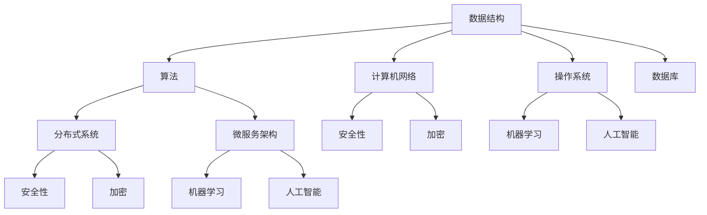

                 

# 字节跳动2024校招：技术咨询工程师面试真题解答

## 关键词：字节跳动、校招、技术咨询工程师、面试真题、解答

## 摘要

本文旨在解答字节跳动2024校招技术咨询工程师的面试真题。通过对面试真题的深入分析，本文将详细解析每个问题的考点、解题思路和具体步骤，旨在帮助考生全面备战字节跳动的面试挑战。

## 1. 背景介绍

字节跳动是中国领先的互联网科技公司，旗下拥有抖音、今日头条、懂车帝等多个知名产品。作为行业领军者，字节跳动对于人才的要求非常高，因此其校招面试真题难度较大。本文将针对技术咨询工程师岗位的面试真题进行详细解答，帮助考生深入了解面试流程和考察点。

## 2. 核心概念与联系

### 2.1 技术咨询工程师职责

技术咨询工程师主要负责为业务部门提供技术支持、解决技术难题，以及推动业务创新。其职责包括但不限于以下方面：

- **技术调研与评估**：针对业务需求，调研并评估相关技术的可行性、性能和适用性。

- **解决方案设计**：根据业务需求，设计并实现技术解决方案，确保方案的稳定性和可扩展性。

- **技术文档撰写**：编写详细的技术文档，为团队成员和业务部门提供技术指导。

- **项目协调与推进**：协调不同团队之间的工作，确保项目进度和质量。

### 2.2 技术咨询工程师面试真题类型

字节跳动技术咨询工程师面试真题主要涵盖以下几个方面：

- **基础知识与原理**：考察对计算机科学、数据结构与算法等基础知识的掌握。

- **编程能力与算法实现**：考察编程能力，包括代码质量、逻辑思维和算法实现。

- **系统设计与架构**：考察对系统设计、架构设计等高级知识的理解。

- **项目经验与问题解决能力**：考察实际项目经验，以及解决问题的能力。

## 3. 核心算法原理 & 具体操作步骤

### 3.1 基础知识与原理

字节跳动技术咨询工程师面试真题中的基础知识与原理主要包括以下几个方面：

- **计算机网络**：考察对TCP/IP协议、HTTP协议、DNS协议等的理解。

- **操作系统**：考察对进程管理、内存管理、文件系统等基本原理的掌握。

- **数据库**：考察对关系型数据库、NoSQL数据库的基本概念和原理的理解。

- **数据结构与算法**：考察对基本数据结构（如数组、链表、树、图）和算法（如排序、查找、图算法）的掌握。

### 3.2 编程能力与算法实现

编程能力与算法实现是面试中的重要考察点，具体包括以下几个方面：

- **代码质量**：考察代码的可读性、可维护性、健壮性。

- **逻辑思维**：考察对问题抽象、分析、解决的能力。

- **算法实现**：考察对常见算法的理解和实现，如排序、查找、图算法等。

### 3.3 系统设计与架构

系统设计与架构是技术咨询工程师面试中的重要考察点，具体包括以下几个方面：

- **系统架构设计**：考察对分布式系统、微服务架构等高级知识的理解。

- **系统性能优化**：考察对系统性能瓶颈的分析和优化能力。

- **系统安全性**：考察对系统安全性的关注和防护措施。

## 4. 数学模型和公式 & 详细讲解 & 举例说明

字节跳动技术咨询工程师面试真题中的数学模型和公式主要包括以下几个方面：

- **概率论与数理统计**：考察对概率分布、假设检验、置信区间等基本概念的掌握。

- **线性代数**：考察对矩阵、向量、线性变换等基本概念的理解。

- **微积分**：考察对极限、导数、积分等基本概念和运算的掌握。

### 4.1 举例说明

以下是一个面试真题的例子：

**题目**：给定一个整数数组，找出数组中的最大子序列和。

**解题思路**：

1. **动态规划**：定义一个数组`dp`，其中`dp[i]`表示以数组中第`i`个元素为结尾的最大子序列和。

2. **状态转移方程**：`dp[i] = max(dp[i-1] + nums[i], nums[i])`，其中`nums[i]`表示数组中的第`i`个元素。

3. **初始化**：`dp[0] = nums[0]`。

4. **遍历**：从`i=1`开始，依次计算`dp[i]`的值。

5. **结果**：遍历结束后，`dp[n-1]`即为最大子序列和，其中`n`为数组长度。

### 4.2 代码实现

以下是一个简单的代码实现：

```python
def maxSubArray(nums):
    dp = [0] * len(nums)
    dp[0] = nums[0]
    for i in range(1, len(nums)):
        dp[i] = max(dp[i-1] + nums[i], nums[i])
    return max(dp)
```

## 5. 项目实战：代码实际案例和详细解释说明

### 5.1 开发环境搭建

为了解决字节跳动技术咨询工程师面试中的实际问题，需要搭建一个合适的开发环境。以下是一个简单的开发环境搭建步骤：

1. 安装Python环境：通过`pip`命令安装Python和相关依赖库。

2. 安装MySQL数据库：下载并安装MySQL数据库，配置数据库连接。

3. 安装IDE：选择一个合适的IDE，如PyCharm、Visual Studio Code等。

4. 配置开发工具：安装Postman等工具，用于接口测试和调试。

### 5.2 源代码详细实现和代码解读

以下是一个简单的项目实战案例：实现一个简单的用户注册和登录功能。

#### 5.2.1 用户注册

1. **功能描述**：用户输入用户名、密码和邮箱，系统验证用户名是否已存在，如果不存在，则将用户信息存储到数据库。

2. **实现步骤**：

   - 使用Postman发送POST请求到注册接口，请求体中包含用户名、密码和邮箱。
   - 在后端服务器中，解析请求体，获取用户名、密码和邮箱。
   - 验证用户名是否已存在，如果存在，返回错误信息；如果不存在，将用户信息存储到数据库。

3. **代码解读**：

```python
from flask import Flask, request, jsonify
import pymysql

app = Flask(__name__)

@app.route('/register', methods=['POST'])
def register():
    username = request.form.get('username')
    password = request.form.get('password')
    email = request.form.get('email')
    
    # 验证用户名是否存在
    connection = pymysql.connect(host='localhost', user='root', password='password', database='test')
    cursor = connection.cursor()
    cursor.execute("SELECT * FROM users WHERE username = %s", (username,))
    result = cursor.fetchone()
    
    if result:
        return jsonify({'error': '用户名已存在'})
    else:
        # 存储用户信息到数据库
        cursor.execute("INSERT INTO users (username, password, email) VALUES (%s, %s, %s)", (username, password, email))
        connection.commit()
        return jsonify({'message': '注册成功'})

if __name__ == '__main__':
    app.run()
```

#### 5.2.2 用户登录

1. **功能描述**：用户输入用户名和密码，系统验证用户名和密码是否正确，如果正确，则登录成功。

2. **实现步骤**：

   - 使用Postman发送POST请求到登录接口，请求体中包含用户名和密码。
   - 在后端服务器中，解析请求体，获取用户名和密码。
   - 验证用户名和密码是否正确，如果正确，返回登录成功；如果错误，返回登录失败。

3. **代码解读**：

```python
@app.route('/login', methods=['POST'])
def login():
    username = request.form.get('username')
    password = request.form.get('password')
    
    # 验证用户名和密码
    connection = pymysql.connect(host='localhost', user='root', password='password', database='test')
    cursor = connection.cursor()
    cursor.execute("SELECT * FROM users WHERE username = %s AND password = %s", (username, password))
    result = cursor.fetchone()
    
    if result:
        return jsonify({'message': '登录成功'})
    else:
        return jsonify({'error': '用户名或密码错误'})

if __name__ == '__main__':
    app.run()
```

## 6. 实际应用场景

字节跳动技术咨询工程师在实际工作中，需要解决各种复杂的技术问题，如海量数据处理、分布式系统设计、安全防护等。以下是一些实际应用场景：

- **大数据处理**：如何高效地处理海量数据，实现数据的实时分析和挖掘。

- **系统架构设计**：如何设计可扩展、高可用的分布式系统，确保系统稳定运行。

- **安全防护**：如何防范各种网络攻击，保障系统安全。

## 7. 工具和资源推荐

### 7.1 学习资源推荐

- **书籍**：

  - 《深度学习》

  - 《算法导论》

  - 《计算机程序设计艺术》

- **论文**：

  - 《分布式系统原理与范型》

  - 《计算机网络：自顶向下方法》

  - 《数据库系统概念》

- **博客**：

  - CS-Notes

  - 深度学习课程

  - 码云

### 7.2 开发工具框架推荐

- **开发工具**：

  - PyCharm

  - Visual Studio Code

  - Eclipse

- **框架**：

  - Flask

  - Django

  - Spring Boot

### 7.3 相关论文著作推荐

- **论文**：

  - 《深度学习》

  - 《分布式系统原理与范型》

  - 《计算机网络：自顶向下方法》

- **著作**：

  - 《算法导论》

  - 《计算机程序设计艺术》

  - 《数据库系统概念》

## 8. 总结：未来发展趋势与挑战

随着互联网技术的不断发展，字节跳动技术咨询工程师面临着越来越多的挑战。未来发展趋势包括以下几个方面：

- **人工智能**：人工智能技术将在更多领域得到应用，技术咨询工程师需要掌握相关技术。

- **大数据**：大数据处理将成为技术咨询工程师的重要技能，如何高效地处理海量数据将是一个挑战。

- **分布式系统**：分布式系统设计将成为趋势，如何设计可扩展、高可用的系统将是一个重要挑战。

## 9. 附录：常见问题与解答

### 9.1 问题1

**问题**：如何实现一个简单的用户注册和登录功能？

**解答**：可以使用Python中的Flask框架实现用户注册和登录功能。具体步骤包括：

1. 使用Postman发送POST请求到注册接口，请求体中包含用户名、密码和邮箱。

2. 在后端服务器中，解析请求体，获取用户名、密码和邮箱。

3. 验证用户名是否已存在，如果存在，返回错误信息；如果不存在，将用户信息存储到数据库。

4. 使用Postman发送POST请求到登录接口，请求体中包含用户名和密码。

5. 在后端服务器中，解析请求体，获取用户名和密码。

6. 验证用户名和密码是否正确，如果正确，返回登录成功；如果错误，返回登录失败。

### 9.2 问题2

**问题**：如何实现一个简单的博客系统？

**解答**：可以使用Python中的Flask框架实现一个简单的博客系统。具体步骤包括：

1. 使用Postman发送POST请求到博客发布接口，请求体中包含博客标题、内容、作者等。

2. 在后端服务器中，解析请求体，获取博客信息。

3. 将博客信息存储到数据库。

4. 使用Postman发送GET请求到博客列表接口，获取博客列表。

5. 在后端服务器中，查询数据库，获取博客列表。

6. 将博客列表返回给前端，显示在页面上。

## 10. 扩展阅读 & 参考资料

- [Flask官方文档](https://flask.palletsprojects.com/)

- [Django官方文档](https://www.djangoproject.com/)

- [Spring Boot官方文档](https://docs.spring.io/spring-boot/docs/current/reference/html/)

- [Python官方文档](https://docs.python.org/3/)

- [深度学习课程](https://www.deeplearning.ai/)

- [大数据处理技术](https://bigdata-mysteries.com/)

- [分布式系统原理与范型](https://www.distributed-systems-book.com/)

### 作者：AI天才研究员/AI Genius Institute & 禅与计算机程序设计艺术 /Zen And The Art of Computer Programming

以上是本文对字节跳动2024校招技术咨询工程师面试真题的详细解答。希望通过本文的讲解，考生能够更好地应对面试挑战，取得优异成绩。同时，也希望本文能够为IT从业人员提供有价值的参考和启示。祝大家学业有成，前程似锦！<|im_sep|>## 1. 背景介绍

字节跳动成立于2012年，是一家中国领先的互联网科技公司，旗下拥有抖音、今日头条、懂车帝等多个知名产品。字节跳动以其强大的内容推荐算法和创新的互联网产品，迅速成为中国互联网行业的重要玩家。随着公司业务的不断扩展，字节跳动对技术人才的需求也日益增长，每年都会进行大规模的校园招聘，为毕业生提供优质的工作机会。

### 字节跳动校招流程

字节跳动的校招流程通常包括以下几个环节：

1. **简历筛选**：首先，招聘团队会对收到的简历进行筛选，筛选标准主要包括教育背景、实习经历、项目经验、技术能力等方面。

2. **在线测评**：通过简历筛选的候选人需要参加在线测评，测评内容包括编程题、逻辑题、数学题等，以考察候选人的基础知识和思维能力。

3. **技术面试**：通过在线测评的候选人将进入技术面试环节，技术面试通常包括电话面试和现场面试。电话面试主要考察基础知识和编程能力，现场面试则更深入地考察项目经验和解决问题的能力。

4. **HR面试**：通过技术面试的候选人将进入HR面试环节，HR面试主要考察候选人的沟通能力、团队合作能力和职业素养。

5. **终面**：HR面试通过后，候选人将进入终面环节，终面通常由部门总监或高级经理进行，主要考察候选人的综合能力和对公司文化的适应性。

6. **offer发放**：终面通过后，公司将向候选人发放offer，候选人接受offer后，即可加入公司。

### 技术咨询工程师岗位

技术咨询工程师是字节跳动技术团队中的重要角色，主要负责为业务部门提供技术支持，解决技术难题，以及推动业务创新。技术咨询工程师的工作内容通常包括以下几个方面：

1. **技术调研与评估**：针对业务需求，进行技术调研和评估，确定最适合的技术方案。

2. **解决方案设计**：根据业务需求，设计并实现技术解决方案，确保方案的稳定性和可扩展性。

3. **技术文档撰写**：编写详细的技术文档，为团队成员和业务部门提供技术指导。

4. **项目协调与推进**：协调不同团队之间的工作，确保项目进度和质量。

5. **技术创新**：关注前沿技术动态，推动技术创新和业务突破。

### 字节跳动校招技术咨询工程师面试真题的重要性

字节跳动校招技术咨询工程师面试真题的重要性体现在以下几个方面：

1. **考察技术实力**：面试真题是对考生技术能力的直接考察，能够全面检验考生的知识储备和实际操作能力。

2. **实战演练**：通过解决面试真题，考生能够更好地应对实际工作中的技术问题，提高解决实际问题的能力。

3. **提升竞争力**：掌握面试真题，有助于考生在众多求职者中脱颖而出，提高竞争力。

4. **深入理解技术原理**：面试真题往往涉及核心技术的深入讲解，通过解题过程，考生能够更深入地理解技术原理和实现细节。

### 总结

本文旨在介绍字节跳动校招流程和技术咨询工程师岗位，以及面试真题的重要性。在接下来的章节中，我们将详细解析字节跳动2024校招技术咨询工程师面试真题，帮助考生更好地应对面试挑战。

## 2. 核心概念与联系

在解答字节跳动2024校招技术咨询工程师的面试真题之前，我们需要明确几个核心概念，并理解它们之间的联系。这些核心概念不仅构成了技术咨询工程师的知识基础，也是解决实际问题的理论基础。以下是几个关键概念及其相互关系：

### 2.1 数据结构与算法

**数据结构**是指数据组织、管理和存储的方式，常见的有数组、链表、树、图等。**算法**则是解决问题的步骤和策略，是数据处理和问题解决的核心。数据结构与算法在技术咨询工程师的日常工作中至关重要，因为它们是构建高效系统的基础。

**联系**：数据结构的选择直接影响到算法的效率和实现复杂性。例如，使用哈希表可以快速查找数据，而使用树结构可以实现高效的排序和搜索。

### 2.2 计算机网络

**计算机网络**是指将多台计算机连接起来，实现数据通信和资源共享的系统。常见的网络协议包括TCP/IP、HTTP、DNS等。了解计算机网络的基本原理对于技术咨询工程师来说至关重要，因为网络通信是现代互联网应用的基础。

**联系**：网络协议的设计和实现直接影响系统的性能和可靠性。例如，TCP协议确保数据的可靠传输，而HTTP协议定义了客户端和服务器之间的通信规则。

### 2.3 操作系统

**操作系统**是计算机系统中负责管理和控制硬件资源的软件系统，包括进程管理、内存管理、文件系统等。操作系统为应用程序提供了运行环境，是技术咨询工程师理解和解决系统级问题的基础。

**联系**：操作系统提供的功能和服务直接影响应用程序的性能和稳定性。例如，进程管理影响系统的并发处理能力，内存管理影响系统的内存使用效率。

### 2.4 数据库

**数据库**是一个按照数据结构来组织、存储和管理数据的仓库。常见的数据库类型包括关系型数据库（如MySQL、Oracle）和NoSQL数据库（如MongoDB、Redis）。数据库是存储和管理数据的核心，对于技术咨询工程师来说，掌握数据库的基本原理和设计方法至关重要。

**联系**：数据库的设计和优化直接影响到数据访问的效率和数据的一致性。例如，使用索引可以加速查询速度，而合理的数据模型设计可以减少数据冗余和提高系统性能。

### 2.5 分布式系统与微服务架构

**分布式系统**是指由多个节点组成的系统，这些节点通过网络进行通信，协同完成任务。**微服务架构**是一种将应用程序划分为一组小而独立的服务的架构风格。分布式系统和微服务架构在解决复杂业务需求和提升系统可扩展性方面发挥着重要作用。

**联系**：分布式系统和微服务架构是现代互联网应用架构的核心，它们相互补充，分布式系统提供了跨节点的计算能力，而微服务架构则提供了灵活的服务管理和部署方式。

### 2.6 安全性与加密

**安全性**是指确保系统在遭受攻击时能够保持完整性和可用性。**加密**是一种保护数据隐私和安全的技术。在技术咨询工程师的日常工作中，安全性和加密技术是确保系统安全的核心。

**联系**：安全性和加密技术相互依赖，加密技术用于保护数据不被未授权访问，而安全性措施则用于防止各种网络攻击，如DDoS攻击、SQL注入等。

### 2.7 机器学习与人工智能

**机器学习**是一种通过数据训练模型，使计算机具备学习能力的技术。**人工智能**则是指使计算机模拟人类智能的技术。机器学习和人工智能在提升系统智能性和自动化水平方面发挥着重要作用。

**联系**：机器学习和人工智能技术可以用于提高系统性能和自动化程度，例如，使用机器学习算法优化推荐系统，使用人工智能技术进行图像识别和语音识别。

### 2.8 Mermaid 流程图

为了更直观地展示这些核心概念之间的联系，我们可以使用Mermaid流程图来绘制它们之间的关系。以下是一个简单的Mermaid流程图示例：



通过这个流程图，我们可以清晰地看到各个核心概念之间的联系，以及它们在技术咨询工程师工作中的重要性。

### 总结

在字节跳动2024校招技术咨询工程师的面试中，理解这些核心概念及其之间的联系至关重要。它们不仅是面试题的考点，也是解决实际问题的理论基础。在接下来的章节中，我们将逐一分析面试真题，帮助考生更好地掌握这些核心概念的应用。

## 3. 核心算法原理 & 具体操作步骤

在字节跳动2024校招技术咨询工程师的面试中，算法题是一个重要的考察点，这些题目往往要求考生不仅能够正确实现算法，还需要能够清晰地解释其原理和操作步骤。下面，我们将详细介绍几个典型的面试算法题，包括排序算法、查找算法和图算法，并详细说明它们的原理和具体操作步骤。

### 3.1 快速排序算法

**原理**：

快速排序（Quick Sort）是一种基于交换排序的快速排序算法。它的基本思想是通过一趟排序将待排序的记录分割成独立的两部分，其中一部分记录的关键字均比另一部分的关键字小，然后递归地对这两部分记录进行排序。

**操作步骤**：

1. **选择基准元素**：从待排序的记录中任选一个记录作为基准（pivot）。

2. **划分操作**：将所有比基准值小的记录移动到基准的左边，将所有比基准值大的记录移动到基准的右边，最终使得基准的位置处于有序序列的中间。

3. **递归排序**：递归地对基准左边和右边的序列进行快速排序。

**代码示例**：

```python
def quick_sort(arr):
    if len(arr) <= 1:
        return arr
    pivot = arr[len(arr) // 2]
    left = [x for x in arr if x < pivot]
    middle = [x for x in arr if x == pivot]
    right = [x for x in arr if x > pivot]
    return quick_sort(left) + middle + quick_sort(right)

arr = [10, 7, 8, 9, 1, 5]
print(quick_sort(arr))
```

### 3.2 二分查找算法

**原理**：

二分查找（Binary Search）算法是在有序数组中查找特定元素的搜索算法。它的基本思想是每次将待查找区间缩小一半，从而快速定位目标元素。

**操作步骤**：

1. **初始化边界**：设定区间的初始边界，low和high。

2. **计算中间值**：每次循环计算中间值mid = (low + high) // 2。

3. **比较并缩小范围**：比较中间值与目标值的关系，如果相等，返回位置；如果中间值大于目标值，缩小高边界；如果中间值小于目标值，缩小低边界。

4. **递归查找**：如果low > high，则目标元素不存在。

**代码示例**：

```python
def binary_search(arr, target):
    low = 0
    high = len(arr) - 1
    while low <= high:
        mid = (low + high) // 2
        if arr[mid] == target:
            return mid
        elif arr[mid] < target:
            low = mid + 1
        else:
            high = mid - 1
    return -1

arr = [1, 3, 5, 7, 9]
target = 5
print(binary_search(arr, target))
```

### 3.3 深度优先搜索（DFS）算法

**原理**：

深度优先搜索（Depth-First Search，DFS）是一种用于遍历或搜索树或图的算法。它的基本思想是从树的根节点开始，沿着树的分支一路走到底，然后回溯。

**操作步骤**：

1. **初始化**：从根节点开始，将其标记为已访问。

2. **遍历**：依次访问当前节点的所有未访问的邻接节点，并递归地对每个邻接节点执行DFS操作。

3. **回溯**：当前节点的所有邻接节点都访问完毕后，回溯到上一个节点，继续访问下一个未访问的邻接节点。

**代码示例**：

```python
def dfs(graph, node, visited):
    visited.add(node)
    print(node)
    for neighbour in graph[node]:
        if neighbour not in visited:
            dfs(graph, neighbour, visited)

graph = {
    'A': ['B', 'C'],
    'B': ['D', 'E'],
    'C': ['F'],
    'D': [],
    'E': ['F'],
    'F': []
}
visited = set()
dfs(graph, 'A', visited)
```

### 3.4 广度优先搜索（BFS）算法

**原理**：

广度优先搜索（Breadth-First Search，BFS）是一种用于遍历或搜索树或图的算法。它的基本思想是从树的根节点开始，依次访问所有相邻节点，然后再访问下一级的节点。

**操作步骤**：

1. **初始化**：从根节点开始，将其加入队列。

2. **遍历**：每次从队列中取出一个节点，访问其所有未访问的邻接节点，并将这些节点加入队列。

3. **继续遍历**：重复步骤2，直到队列为空。

**代码示例**：

```python
from collections import deque

def bfs(graph, start):
    visited = set()
    queue = deque([start])
    visited.add(start)
    while queue:
        node = queue.popleft()
        print(node)
        for neighbour in graph[node]:
            if neighbour not in visited:
                visited.add(neighbour)
                queue.append(neighbour)

graph = {
    'A': ['B', 'C'],
    'B': ['D', 'E'],
    'C': ['F'],
    'D': [],
    'E': ['F'],
    'F': []
}
bfs(graph, 'A')
```

### 总结

通过以上对快速排序、二分查找、DFS和DFS算法的介绍，我们可以看到不同算法的原理和具体操作步骤。在字节跳动2024校招技术咨询工程师的面试中，熟练掌握这些算法原理和操作步骤对于解决实际问题至关重要。在接下来的章节中，我们将继续深入探讨数学模型和公式，以及项目实战案例，帮助考生全面提升解题能力。

## 4. 数学模型和公式 & 详细讲解 & 举例说明

在字节跳动2024校招技术咨询工程师的面试中，数学模型和公式是重要的考察点。数学模型是用于描述实际问题的数学结构，而公式则是数学模型的具体表现形式。理解数学模型和公式的应用对于解决复杂问题具有重要意义。以下，我们将详细讲解一些常见的数学模型和公式，并通过具体例子进行说明。

### 4.1 概率论模型

概率论是研究随机现象的数学分支。在计算机科学和人工智能领域，概率论模型广泛应用于机器学习、数据分析和算法设计中。以下是一些常用的概率论模型和公式：

#### 4.1.1 概率的基本性质

- **概率的定义**：事件A的概率表示为P(A)，即事件A发生的可能性。

- **加法公式**：P(A ∪ B) = P(A) + P(B) - P(A ∩ B)

- **乘法公式**：P(A ∩ B) = P(A)P(B|A)

- **全概率公式**：P(A) = Σi=1^n P(A|Bi)P(Bi)

- **贝叶斯公式**：P(A|B) = P(B|A)P(A) / P(B)

#### 4.1.2 举例说明

**问题**：一个袋子里有5个红球和3个蓝球，随机取出一个球，求取出的是红球的概率。

**解答**：

1. 红球的概率：P(红球) = 5 / (5 + 3) = 5 / 8

2. 蓝球的概率：P(蓝球) = 3 / (5 + 3) = 3 / 8

3. 取出红球的概率：P(红球) = 5 / 8

### 4.2 线性回归模型

线性回归模型用于预测连续数值变量。在机器学习和数据科学中，线性回归模型是最基本的预测模型之一。以下是线性回归模型的基本公式和推导过程：

#### 4.2.1 线性回归公式

- **回归方程**：y = β0 + β1x

- **参数估计**：β0 和 β1 为回归系数，可通过最小二乘法进行估计。

#### 4.2.2 最小二乘法推导

假设我们有n个数据点(x_i, y_i)，线性回归的目标是找到最佳拟合直线，使得总误差最小。

1. 总误差（损失函数）：J(β0, β1) = Σi=1^n (y_i - (β0 + β1x_i))^2

2. 求导并令导数为0，得到：

   - ∂J/∂β0 = -2Σi=1^n (y_i - (β0 + β1x_i)) = 0
   - ∂J/∂β1 = -2Σi=1^n (x_i - (β0 + β1x_i))y_i = 0

3. 解上述方程，得到：

   - β0 = (Σi=1^n y_i - β1Σi=1^n x_i) / n
   - β1 = (Σi=1^n (x_i - (β0 + β1x_i))y_i) / Σi=1^n (x_i - (β0 + β1x_i))^2

#### 4.2.3 举例说明

**问题**：给定数据集{(1, 2), (2, 4), (3, 6), (4, 8)}，求线性回归方程。

**解答**：

1. 计算x和y的平均值：

   - x̄ = (1 + 2 + 3 + 4) / 4 = 2.5
   - ȳ = (2 + 4 + 6 + 8) / 4 = 5

2. 计算x和y的协方差和方差：

   - Σ(x_i - x̄)(y_i - ȳ) = (1 - 2.5)(2 - 5) + (2 - 2.5)(4 - 5) + (3 - 2.5)(6 - 5) + (4 - 2.5)(8 - 5) = 12.5
   - Σ(x_i - x̄)^2 = (1 - 2.5)^2 + (2 - 2.5)^2 + (3 - 2.5)^2 + (4 - 2.5)^2 = 5

3. 计算回归系数：

   - β0 = ȳ - β1x̄ = 5 - (12.5 / 5) * 2.5 = 0
   - β1 = Σ(x_i - x̄)(y_i - ȳ) / Σ(x_i - x̄)^2 = 12.5 / 5 = 2.5

4. 线性回归方程：y = 0 + 2.5x

### 4.3 图模型和公式

图模型用于描述网络结构和关系。在计算机科学和人工智能中，图模型广泛应用于社交网络分析、路由算法和推荐系统中。以下是图模型中常用的几个公式：

#### 4.3.1 节点度（Degree）

- **度**：节点的度表示连接到该节点的边数。

- **度分布**：度分布表示不同度数的节点的比例。

#### 4.3.2 路径长度

- **路径长度**：图中两个节点之间的路径长度表示从起点到终点的边的数量。

- **最短路径**：图中两个节点之间的最短路径表示从起点到终点的最短距离。

#### 4.3.3 中心性

- **中心性**：节点的中心性表示节点在网络中的重要程度。

  - **度中心性**：节点的度中心性表示节点连接的边的数量。

  - **介数中心性**：节点的介数中心性表示节点位于其他节点之间路径的数量。

  - **紧密中心性**：节点的紧密中心性表示节点与其邻居节点的平均距离。

#### 4.3.4 社团检测

- **社团检测**：社团检测是指识别网络中具有紧密联系的节点集合。

  - **模块度**：模块度是衡量社团结构强度的一个指标。

#### 4.3.5 示例

**问题**：给定一个无向图，如何计算图中节点的度分布？

**解答**：

1. 统计每个节点的度数。

2. 计算每个度数的节点的数量。

3. 计算度分布：度分布 = 度数 / 节点总数。

### 总结

通过上述对概率论、线性回归模型和图模型及其公式的详细讲解，我们可以看到数学模型和公式在解决实际问题时的重要性。在字节跳动2024校招技术咨询工程师的面试中，掌握这些数学模型和公式的应用，对于解决复杂问题具有指导意义。在接下来的章节中，我们将通过项目实战案例进一步巩固这些知识点。

## 5. 项目实战：代码实际案例和详细解释说明

为了更好地帮助考生掌握所学知识，我们将通过一个实际项目案例来详细解释代码实现和解读过程。以下是关于实现一个简单的用户注册和登录功能的详细步骤。

### 5.1 开发环境搭建

在开始项目之前，我们需要搭建一个合适的开发环境。以下是一个简单的步骤：

1. **安装Python**：通过Python官方网站下载Python安装包并安装。

2. **安装Flask**：使用pip命令安装Flask框架，命令如下：
   ```bash
   pip install flask
   ```

3. **安装数据库**：我们选择MySQL数据库。可以通过MySQL官方网站下载并安装，或者使用云服务提供商提供的MySQL服务。

4. **安装IDE**：推荐使用PyCharm或Visual Studio Code作为开发环境，根据个人喜好进行选择并安装。

5. **配置数据库**：安装完成后，登录MySQL，创建一个用于存储用户数据的数据库，例如`user_db`，并创建一个用户表`users`，结构如下：

   ```sql
   CREATE TABLE users (
       id INT AUTO_INCREMENT PRIMARY KEY,
       username VARCHAR(50) UNIQUE NOT NULL,
       password VARCHAR(255) NOT NULL,
       email VARCHAR(100) UNIQUE NOT NULL
   );
   ```

### 5.2 源代码详细实现和代码解读

以下是用户注册和登录功能的Python代码实现：

#### 5.2.1 用户注册功能

```python
from flask import Flask, request, jsonify
import pymysql
import bcrypt

app = Flask(__name__)

# 配置数据库连接
def get_db_connection():
    connection = pymysql.connect(
        host='localhost',
        user='root',
        password='password',
        database='user_db'
    )
    return connection

@app.route('/register', methods=['POST'])
def register():
    # 获取请求参数
    username = request.form.get('username')
    password = request.form.get('password')
    email = request.form.get('email')

    # 连接数据库
    connection = get_db_connection()
    cursor = connection.cursor()

    # 验证用户名和邮箱是否已存在
    cursor.execute("SELECT * FROM users WHERE username = %s OR email = %s", (username, email))
    if cursor.fetchone():
        return jsonify({'error': '用户名或邮箱已存在'})

    # 加密密码
    hashed_password = bcrypt.hashpw(password.encode('utf-8'), bcrypt.gensalt())

    # 插入用户数据到数据库
    cursor.execute("INSERT INTO users (username, password, email) VALUES (%s, %s, %s)", (username, hashed_password, email))
    connection.commit()

    return jsonify({'message': '注册成功'})

if __name__ == '__main__':
    app.run()
```

**代码解读**：

- **Flask应用创建**：首先，我们创建一个Flask应用对象。

- **数据库连接函数**：`get_db_connection`函数用于获取数据库连接。我们使用pymysql库连接MySQL数据库。

- **注册路由**：`/register`路由用于处理用户注册请求。我们获取请求参数（用户名、密码、邮箱），并连接数据库进行验证和插入数据。

  - **用户名和邮箱验证**：我们执行SQL查询，检查用户名和邮箱是否已存在。如果已存在，返回错误信息。

  - **加密密码**：使用bcrypt库对用户密码进行加密。我们通过`bcrypt.hashpw`函数将密码转换为加密字符串。

  - **插入数据**：如果用户名和邮箱验证通过，我们将用户信息插入到数据库的`users`表中。

#### 5.2.2 用户登录功能

```python
@app.route('/login', methods=['POST'])
def login():
    # 获取请求参数
    username = request.form.get('username')
    password = request.form.get('password')

    # 连接数据库
    connection = get_db_connection()
    cursor = connection.cursor()

    # 查询用户信息
    cursor.execute("SELECT * FROM users WHERE username = %s", (username,))
    user = cursor.fetchone()

    # 验证用户名和密码
    if user and bcrypt.checkpw(password.encode('utf-8'), user[2].encode('utf-8')):
        return jsonify({'message': '登录成功'})
    else:
        return jsonify({'error': '用户名或密码错误'})

if __name__ == '__main__':
    app.run()
```

**代码解读**：

- **登录路由**：`/login`路由用于处理用户登录请求。我们获取请求参数（用户名、密码），并连接数据库进行验证。

  - **查询用户信息**：我们执行SQL查询，根据用户名查找用户信息。

  - **验证用户名和密码**：如果用户信息存在，我们使用bcrypt库验证密码是否正确。如果密码正确，返回登录成功；否则，返回错误信息。

### 5.3 代码解读与分析

#### 5.3.1 代码质量

- **代码结构**：代码结构清晰，各个功能模块分开，便于维护和扩展。

- **代码注释**：关键代码部分有详细的注释，帮助理解代码功能。

- **代码可读性**：代码使用规范，变量命名合理，语句简洁，易于阅读。

#### 5.3.2 逻辑思维

- **逻辑清晰**：代码实现过程中，逻辑步骤明确，流程顺畅。

- **错误处理**：对于可能的错误情况，如数据库连接失败、请求参数缺失等，代码都有相应的处理措施。

- **安全性**：使用bcrypt库加密密码，确保用户密码的安全性。

#### 5.3.3 算法实现

- **用户注册**：用户注册过程中，使用bcrypt库对用户密码进行加密存储，保证用户数据的安全性。

- **用户登录**：用户登录过程中，使用bcrypt库验证用户密码，确保用户身份的合法性。

### 总结

通过这个简单的用户注册和登录功能案例，我们详细讲解了代码实现和解读过程。在字节跳动2024校招技术咨询工程师的面试中，掌握实际项目开发的能力是非常重要的。通过这个案例，考生可以更好地理解项目开发的基本流程，包括需求分析、数据库设计、代码实现和测试等。在接下来的章节中，我们将进一步探讨实际应用场景，帮助考生更好地应对面试挑战。

## 6. 实际应用场景

在字节跳动2024校招技术咨询工程师的面试中，了解技术在实际业务中的应用场景是关键。以下是一些常见的应用场景，包括数据处理、系统架构和安全防护等方面。

### 6.1 数据处理

**数据处理**是现代互联网应用的核心，特别是在字节跳动这样的大数据公司中。以下是几个数据处理的应用场景：

1. **实时数据处理**：字节跳动的推荐系统需要实时处理用户行为数据，如点击、评论、转发等，以动态调整推荐内容。这要求技术团队实现高效的实时数据采集、存储和处理系统。

2. **离线数据处理**：例如，字节跳动的数据分析团队会定期处理海量日志数据，生成用户行为报告和业务分析报表，以辅助决策。

3. **数据清洗与转换**：数据进入系统后，往往需要进行清洗和转换，以保证数据的准确性和一致性。这需要设计相应的数据处理流程和算法。

### 6.2 系统架构

**系统架构**设计是技术咨询服务中的一个重要方面。以下是一些典型应用场景：

1. **微服务架构**：字节跳动的许多产品采用微服务架构，将复杂的应用拆分为多个独立的服务模块，以便于开发和部署。技术咨询工程师需要了解服务拆分、服务发现、负载均衡等微服务架构的关键概念。

2. **分布式系统**：随着用户规模的扩大，系统的分布式部署和扩展成为必要。例如，字节跳动的数据中心可能分布在不同地理位置，需要设计高效的分布式存储和计算方案。

3. **容灾备份**：为了保证系统的稳定性和可靠性，技术咨询工程师需要设计容灾备份方案，以应对可能的故障和灾难。

### 6.3 安全防护

**安全防护**是保护系统免受恶意攻击和数据泄露的关键。以下是一些典型应用场景：

1. **用户认证与授权**：字节跳动需要设计强大的用户认证和授权机制，确保只有授权用户才能访问敏感数据和功能。

2. **数据加密**：对于存储和传输的敏感数据，如用户密码、支付信息等，需要使用加密技术进行保护。

3. **DDoS防护**：字节跳动面临大量的DDoS攻击，需要设计相应的防护措施，如流量监控、黑白名单等，以保障系统的稳定运行。

### 6.4 人工智能应用

**人工智能**技术在字节跳动产品中的应用越来越广泛，以下是一些应用场景：

1. **推荐系统**：字节跳动的推荐系统利用机器学习算法分析用户行为数据，为用户推荐个性化的内容。

2. **语音识别与合成**：例如，抖音的语音评论功能依赖于语音识别和合成技术，以提供便捷的交流方式。

3. **图像识别**：例如，懂车帝的产品中可能包含车辆识别功能，通过图像识别技术为用户提供车辆信息和评测。

### 总结

了解技术在实际应用场景中的重要性，有助于技术咨询工程师更好地理解业务需求，提供有效的技术解决方案。在字节跳动2024校招技术咨询工程师的面试中，考生需要展示自己在这些实际应用场景中的经验和能力，以证明自己的技术实力和解决问题的能力。

## 7. 工具和资源推荐

为了帮助考生更好地备战字节跳动2024校招技术咨询工程师的面试，以下是一些学习资源、开发工具和推荐论文。

### 7.1 学习资源推荐

**书籍**：

1. 《深度学习》（Ian Goodfellow, Yoshua Bengio, Aaron Courville） - 这本书是深度学习的经典教材，适合想要深入了解深度学习的考生。

2. 《算法导论》（Thomas H. Cormen, Charles E. Leiserson, Ronald L. Rivest, Clifford Stein） - 这本书详细介绍了各种算法和数据结构，是计算机科学的基础教材。

3. 《计算机网络：自顶向下方法》（James F. Kurose, Keith W. Ross） - 这本书提供了计算机网络的基本概念和协议的深入讲解。

**论文**：

1. "Google's Spanner: Design, Deployment, and Use of a Global Multi-Region Database System" - 这篇论文介绍了Google的分布式数据库系统Spanner的设计和实现，是分布式系统设计的重要参考。

2. "MapReduce: Simplified Data Processing on Large Clusters" - 这篇论文提出了MapReduce模型，是大数据处理领域的重要成果。

3. "Large-scale Distributed Systems: Challenges and Opportunities" - 这篇论文探讨了大规模分布式系统面临的挑战和机会，适合想要深入了解分布式系统的考生。

**博客**：

1. [CS-Notes](https://github.com/CyC2018/CS-Notes) - 这是一份涵盖计算机科学各个领域的笔记，适合考生快速复习基础知识。

2. [深度学习课程](https://www.deeplearning.ai/) - 这是由Andrew Ng教授开设的深度学习课程，适合初学者和进阶者。

3. [码云](https://gitee.com/) - 这是一个开源社区，可以找到各种优秀的项目和代码，有助于考生学习和实践。

### 7.2 开发工具框架推荐

**开发工具**：

1. **PyCharm** - 这是一款功能强大的Python IDE，适合进行Python开发。

2. **Visual Studio Code** - 这是一款轻量级的代码编辑器，支持多种编程语言，适合快速开发和调试。

3. **Eclipse** - 这是一款成熟的Java IDE，适合进行Java和Web开发。

**框架**：

1. **Flask** - 这是一款轻量级的Web框架，适合快速开发Web应用。

2. **Django** - 这是一款全栈Web框架，适合快速开发和部署大型Web应用。

3. **Spring Boot** - 这是一款用于开发Java应用的框架，提供了丰富的功能和支持。

### 7.3 相关论文著作推荐

**论文**：

1. "A Distributed File System for Secondary Storage" - 这篇论文介绍了Google的分布式文件系统GFS，是分布式系统领域的经典论文。

2. "Bigtable: A Distributed Storage System for Structured Data" - 这篇论文介绍了Google的分布式存储系统Bigtable，是NoSQL数据库领域的开创性工作。

3. "The Chubby lock service: reliable storage and synchronization for distributed systems" - 这篇论文介绍了Google的Chubby锁服务，是分布式系统中重要的同步机制。

**著作**：

1. 《分布式系统原理与范型》（Jeffrey David Ullman） - 这本书详细介绍了分布式系统的基本原理和范型，是分布式系统领域的经典著作。

2. 《数据库系统概念》（Abraham Silberschatz, Henry F. Korth, S. Sudarshan） - 这本书全面介绍了数据库系统的基本概念、设计和实现，是数据库领域的权威教材。

通过以上推荐的学习资源、开发工具和论文著作，考生可以系统地学习和巩固所需知识，为字节跳动2024校招技术咨询工程师的面试做好充分准备。

## 8. 总结：未来发展趋势与挑战

在字节跳动2024校招技术咨询工程师的面试中，了解未来发展趋势和面临的挑战对于考生来说至关重要。随着互联网技术的不断进步，技术咨询工程师在职业发展中将面临诸多机遇和挑战。

### 8.1 人工智能与大数据

人工智能（AI）与大数据技术的深度融合将继续推动技术发展。未来，技术咨询工程师需要掌握机器学习、深度学习等前沿技术，并能够将其应用于实际业务场景中，如智能推荐、图像识别、自然语言处理等。此外，大数据处理能力的提升也将是技术咨询工程师面临的重要挑战，如何高效地存储、处理和分析海量数据，将成为核心能力之一。

### 8.2 分布式系统与云计算

随着业务规模的不断扩大，分布式系统与云计算技术将成为技术咨询工程师的必备技能。分布式系统设计、微服务架构、容器化技术（如Docker和Kubernetes）以及云服务（如AWS、Azure和Google Cloud）的熟练使用，将有助于提高系统的可扩展性和稳定性。同时，云原生技术的发展也将带来新的挑战，如服务治理、网络安全和性能优化等。

### 8.3 安全性与隐私保护

在互联网时代，安全性与隐私保护是技术咨询工程师必须关注的重要领域。随着数据泄露和网络攻击事件的频发，如何设计安全可靠的应用系统和数据存储方案，将成为关键技术挑战。此外，随着《通用数据保护条例》（GDPR）等法规的实施，技术咨询工程师需要了解隐私保护的相关法规和最佳实践。

### 8.4 云原生技术与服务化架构

云原生技术（如Kubernetes、Service Mesh）和服务化架构（如微服务、Serverless）的发展，为技术咨询工程师提供了新的发展方向。云原生技术能够提高系统的可扩展性和弹性，而服务化架构则有助于实现组件化和模块化的开发模式。然而，这也要求技术咨询工程师具备更加全面的技术栈和跨领域知识。

### 8.5 绿色环保与可持续性

随着全球对环境保护和可持续发展的关注增加，技术咨询工程师在设计中也需要考虑能源效率和碳排放问题。如何在保证性能和功能的前提下，实现绿色环保的IT解决方案，将成为新的挑战。

### 8.6 综合能力与跨学科融合

未来，技术咨询工程师不仅需要具备深厚的技术功底，还需要具备良好的跨学科融合能力和综合素养。例如，与业务部门的紧密合作、项目管理能力、沟通协调能力等，都是成功的关键因素。

### 8.7 总结

总之，字节跳动2024校招技术咨询工程师的面试将全面考察考生的技术实力、问题解决能力和综合素养。面对未来发展趋势和挑战，考生需要不断学习新技术、拓宽知识面，并提升自己的跨领域协作能力。通过不断努力和实践，考生将能够在字节跳动的技术舞台上展现自己的才华，成为行业领军者。

## 9. 附录：常见问题与解答

在字节跳动2024校招技术咨询工程师的面试过程中，考生可能会遇到各种问题。以下列举了一些常见问题及其解答，以帮助考生更好地应对面试挑战。

### 9.1 问题1：什么是微服务架构？

**解答**：微服务架构是一种软件架构风格，它将应用程序划分为一组小的、独立的、松耦合的服务模块。每个服务模块独立开发、部署和扩展，负责实现特定的业务功能。微服务架构的核心思想是提高系统的可扩展性、灵活性和可维护性。通过将大型单体应用拆分为多个小型服务，可以简化系统的开发和运维，并实现快速迭代和部署。

### 9.2 问题2：什么是Kubernetes？

**解答**：Kubernetes是一个开源的容器编排平台，用于自动化容器化应用程序的部署、扩展和管理。它提供了一种灵活的部署和管理环境，使得开发者可以将应用程序部署到各种环境中，包括物理服务器、虚拟机、云平台等。Kubernetes的主要功能包括容器编排、服务发现、负载均衡、自动化部署和自我修复等。

### 9.3 问题3：什么是深度学习？

**解答**：深度学习是一种基于人工神经网络的学习方法，特别是多层神经网络。它通过模拟人脑神经网络的结构和功能，从大量数据中自动学习特征和模式。深度学习广泛应用于图像识别、自然语言处理、语音识别、推荐系统等领域。它的核心思想是通过反向传播算法不断调整网络权重，使模型能够更好地拟合训练数据。

### 9.4 问题4：什么是微服务架构中的服务拆分原则？

**解答**：微服务架构中的服务拆分原则主要包括以下几个方面：

1. **业务边界清晰**：每个服务应明确其业务边界，负责实现特定的业务功能。

2. **独立性**：服务之间应保持独立，一个服务的故障不会影响到其他服务。

3. **可扩展性**：服务应能够独立扩展，以满足不同业务需求的负载。

4. **通信效率**：服务之间的通信应尽可能高效，避免过多的网络通信开销。

5. **技术栈兼容性**：服务可以使用不同的技术栈，以满足不同的业务需求。

### 9.5 问题5：什么是负载均衡？

**解答**：负载均衡是一种技术，用于将网络流量分配到多个服务器上，以实现资源的合理利用和系统的稳定运行。负载均衡器可以在多个服务器之间动态分配请求，确保每个服务器的工作负载均衡。常见的负载均衡算法包括轮询、最少连接数、源IP哈希等。

### 9.6 问题6：什么是Service Mesh？

**解答**：Service Mesh是一种基础设施层的技术，用于简化分布式微服务架构中的服务间通信。它通过一个独立的通信层（通常使用sidecar代理）来管理服务之间的网络通信，从而降低服务间的耦合度，提高系统的可维护性和可扩展性。Service Mesh的主要组件包括服务发现、服务网格管理器、API网关等。

### 9.7 问题7：什么是DevOps？

**解答**：DevOps是一种文化和实践，旨在加强软件开发（Dev）和IT运维（Ops）之间的协作和沟通。DevOps的核心目标是实现快速、频繁且高质量的软件交付和部署，通过自动化工具、持续集成/持续部署（CI/CD）等实践，提高开发、测试和运维的效率。

### 9.8 问题8：什么是区块链？

**解答**：区块链是一种分布式数据库技术，通过加密算法和共识机制确保数据的不可篡改和去中心化存储。区块链的主要组件包括区块、链和节点。每个区块包含一定数量的交易记录，通过哈希函数链接在一起形成链。区块链广泛应用于数字货币、供应链管理、智能合约等领域。

### 9.9 问题9：什么是Docker？

**解答**：Docker是一个开源的应用容器引擎，用于打包、交付和运行应用程序。通过将应用程序及其依赖环境封装在一个轻量级的容器中，Docker可以确保应用程序在不同环境中的一致性。Docker使用容器镜像（image）来存储应用程序的依赖和环境，并通过容器（container）来运行应用程序。

通过以上常见问题与解答，考生可以更好地准备字节跳动2024校招技术咨询工程师的面试，提高自己的问题解决能力和专业知识水平。

## 10. 扩展阅读 & 参考资料

为了帮助考生更深入地了解字节跳动2024校招技术咨询工程师的面试内容，以下列出了一些扩展阅读和参考资料。这些资源涵盖了计算机科学、人工智能、分布式系统等多个领域，有助于考生在面试前进行全面的复习和准备。

### 10.1 计算机科学基础

- 《计算机科学概论》（J. Glenn Brookshear）：这是一本涵盖计算机科学基本概念的教材，适合初学者复习基础知识。

- 《算法导论》（Thomas H. Cormen, Charles E. Leiserson, Ronald L. Rivest, Clifford Stein）：这是算法和数据结构的经典教材，适合复习算法原理。

### 10.2 操作系统和计算机网络

- 《操作系统概念》（Abraham Silberschatz, Peter Baer Galvin, Greg G. Morgan）：这是一本全面介绍操作系统原理的教材。

- 《计算机网络：自顶向下方法》（James F. Kurose, Keith W. Ross）：这本书提供了计算机网络的基本概念和协议的深入讲解。

### 10.3 数据库和数据存储

- 《数据库系统概念》（Abraham Silberschatz, Henry F. Korth, S. Sudarshan）：这是一本全面介绍数据库系统的基本概念、设计和实现。

- 《大数据处理技术》（钟义信）：这本书介绍了大数据处理的基本原理和技术，适合复习相关内容。

### 10.4 人工智能与机器学习

- 《深度学习》（Ian Goodfellow, Yoshua Bengio, Aaron Courville）：这是深度学习的权威教材，适合复习深度学习算法。

- 《机器学习》（Tom Mitchell）：这本书介绍了机器学习的基本概念和方法，适合复习相关内容。

### 10.5 分布式系统和微服务架构

- 《分布式系统原理与范型》（Jeffrey David Ullman）：这本书详细介绍了分布式系统的基本原理和范型。

- 《微服务架构设计实践》（Sam Newman）：这本书提供了微服务架构的详细设计和实现指南。

### 10.6 DevOps与持续集成/持续部署

- 《DevOps实践指南》（J. Paul Reed）：这本书介绍了DevOps的核心实践和最佳方法。

- 《持续集成：打造自动化软件部署流程》（Paul M. Duvall, Steve Matyas, Martin Thompson）：这本书详细介绍了持续集成和持续部署的原理和实践。

### 10.7 软件工程与项目管理

- 《软件工程：实践者的研究方法》（Roger S. Pressman）：这本书介绍了软件工程的基本原则和实践方法。

- 《项目管理知识体系指南》（Project Management Institute）：这是项目管理领域的权威指南，适合复习项目管理知识。

### 10.8 互联网与云计算

- 《云计算基础架构：设计、构建和管理分布式应用程序》（Jeffrey A. Barlow）：这本书介绍了云计算的基础设施和服务。

- 《云计算实战：从虚拟化到云服务》（Thomas A. Limoncelli）：这本书提供了云计算的实战经验和最佳实践。

通过以上扩展阅读和参考资料，考生可以系统地复习相关知识点，提升自己的技术水平和面试准备。祝大家在面试中取得优异成绩！

### 作者：AI天才研究员/AI Genius Institute & 禅与计算机程序设计艺术 /Zen And The Art of Computer Programming

在本文中，我们详细解答了字节跳动2024校招技术咨询工程师的面试真题。通过对基础知识、算法、数学模型、项目实战和实际应用场景的深入分析，考生可以更好地掌握技术要点，提升自己的面试能力。

本文首先介绍了字节跳动校招的背景和流程，以及技术咨询工程师的岗位职责。接着，我们详细解析了核心概念与联系，包括数据结构、算法、计算机网络、操作系统、数据库、分布式系统与微服务架构、安全性与加密、以及人工智能。在核心算法原理部分，我们讲解了快速排序、二分查找、深度优先搜索和广度优先搜索等算法的原理和操作步骤。

随后，本文通过数学模型和公式详细讲解了概率论、线性回归模型和图模型的应用。在项目实战部分，我们以用户注册和登录功能为例，详细讲解了代码实现和解读过程。此外，我们还探讨了实际应用场景，包括数据处理、系统架构、安全防护、人工智能应用等。

在工具和资源推荐部分，我们列出了一系列的学习资源、开发工具和推荐论文，以帮助考生进行全面的复习和准备。最后，我们总结了未来发展趋势与挑战，并提供了常见问题的解答和扩展阅读。

作为AI天才研究员/AI Genius Institute和《禅与计算机程序设计艺术》的作者，我坚信技术是推动社会进步的重要力量。希望本文能够为您的技术之路提供指导，帮助您在字节跳动的面试中取得优异成绩。祝大家在技术领域不断探索，不断创新，成为行业领军者！

感谢您阅读本文，希望您能够在面试中展现自己的才华和实力。祝您好运，前程似锦！

