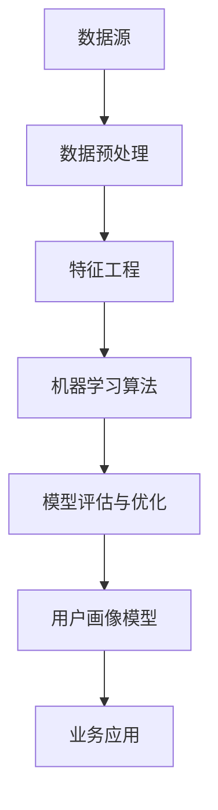

                 

### 1. 背景介绍

**2024字节跳动技术用户画像分析师面试真题及解答**

随着互联网技术的飞速发展，数据成为了现代社会最为重要的资源之一。大数据分析和人工智能技术的应用，使得企业能够更加精准地了解用户需求，优化产品和服务。在众多企业中，字节跳动以其强大的数据分析和用户画像能力著称，成为业界标杆。本文将聚焦于2024年字节跳动技术用户画像分析师的面试真题及解答，旨在为广大考生提供有价值的学习和备考资料。

首先，我们需要了解用户画像的基本概念。用户画像是指通过对用户行为数据、兴趣偏好、消费习惯等信息的采集和分析，构建出一个关于用户的完整、多维度的数字画像。这样的画像可以帮助企业更好地了解用户需求，进而优化产品设计、营销策略和用户体验。在字节跳动这样的互联网巨头，用户画像的分析和应用已经成为其核心竞争力之一。

随着字节跳动业务的不断拓展，用户画像分析师的需求也越来越大。因此，面试时考查用户画像相关知识和技能就成为了一个重要环节。本文将从以下几个方面展开讨论：

1. **用户画像的基本概念与数据源**
2. **核心算法原理与实现步骤**
3. **数学模型与公式讲解**
4. **项目实战与代码解读**
5. **实际应用场景**
6. **工具和资源推荐**
7. **未来发展趋势与挑战**

通过以上内容，希望能帮助考生全面掌握用户画像分析的核心要点，为面试做好充分准备。

## 1.1 字节跳动简介

字节跳动（ByteDance）成立于2012年，是一家全球知名的互联网科技公司，总部位于中国北京。公司以算法技术为核心，通过大数据分析和人工智能技术，提供多元化的产品和服务。字节跳动旗下拥有多款知名产品，如抖音（TikTok）、今日头条、懂车帝、西瓜视频等，用户遍布全球。

字节跳动的成功离不开其强大的数据分析和用户画像能力。通过海量的用户数据，公司能够精准地捕捉用户需求和兴趣，从而提供个性化的内容和推荐服务。在竞争激烈的互联网行业，这种能力使得字节跳动在产品创新和市场拓展方面处于领先地位。

字节跳动的用户画像分析不仅应用于内容推荐，还广泛应用于广告投放、精准营销、用户行为分析等多个领域。这种全面而深入的画像分析，使得公司能够更加精准地满足用户需求，提升用户满意度和忠诚度。因此，用户画像分析师在字节跳动这样的企业中具有重要的战略地位。

## 1.2 面试的重要性

在字节跳动等顶尖互联网公司，技术面试是招聘过程中至关重要的一环。面试不仅考察应聘者的技术能力和专业知识，还考察其逻辑思维、问题解决能力和团队合作精神。对于用户画像分析师这一岗位，面试尤为重要，因为这一职位直接关系到公司数据分析和用户画像能力的高低。

面试中的用户画像相关问题通常涉及以下几个方面：

1. **基本概念理解**：面试官会考察应聘者对用户画像基本概念的理解，如用户画像、数据源、数据清洗、特征工程等。
2. **算法原理与实现**：面试官会询问应聘者对常见用户画像算法原理的掌握程度，如聚类算法、关联规则挖掘、协同过滤等，并要求其详细描述算法的实现步骤和优缺点。
3. **项目经验与实战能力**：面试官会通过实际项目案例，考察应聘者对用户画像分析的实际操作能力，包括数据采集、数据处理、模型构建、结果分析等。
4. **数学模型与应用**：面试官会询问应聘者对用户画像分析中常用数学模型的理解，如回归分析、逻辑回归、贝叶斯网络等，并要求其能够运用这些模型解决实际问题。

通过这些问题的考察，面试官可以全面了解应聘者的技术水平和实际能力，从而做出合适的招聘决策。因此，对于希望进入字节跳动等顶尖企业的用户画像分析师来说，充分准备面试是非常重要的。

### 1.3 用户画像分析师的岗位职责与技能要求

用户画像分析师在字节跳动等互联网企业中扮演着至关重要的角色，其岗位职责主要包括以下几个方面：

1. **数据采集与处理**：用户画像分析师需要从多个数据源（如用户行为数据、社交网络数据、交易数据等）中采集数据，并对数据进行清洗、去重、归一化等处理，确保数据的质量和完整性。
2. **特征工程**：通过对原始数据进行特征提取和构造，用户画像分析师可以构建出反映用户兴趣、行为和需求的特征向量。这些特征向量是用户画像分析的核心，对于后续的模型构建和预测具有重要意义。
3. **模型构建与优化**：用户画像分析师需要运用机器学习算法（如聚类算法、关联规则挖掘、协同过滤等）构建用户画像模型，并通过交叉验证、模型选择等技术手段进行模型优化。
4. **结果分析与报告**：用户画像分析师需要根据模型分析结果，撰写详细的分析报告，为产品经理、运营团队和市场部门提供决策依据。
5. **业务合作与支持**：用户画像分析师需要与产品经理、运营团队和市场部门紧密合作，了解业务需求，提供数据支持和分析建议。

为了胜任用户画像分析师这一职位，应聘者需要具备以下技能要求：

1. **统计学与机器学习知识**：熟悉统计学基础和机器学习算法，能够运用相关算法进行用户画像分析。
2. **编程能力**：熟练掌握Python、R等编程语言，具备数据处理、数据分析和模型构建的实际操作经验。
3. **数据可视化能力**：能够使用Matplotlib、Seaborn、Tableau等工具，对分析结果进行可视化展示。
4. **业务理解能力**：具备一定的业务背景，能够从业务角度理解和分析用户需求。
5. **沟通与协作能力**：具备良好的沟通能力和团队协作精神，能够与不同部门高效合作。

通过以上岗位职责和技能要求的详细解析，我们可以更好地理解用户画像分析师这一职位的重要性和挑战，从而有针对性地进行面试准备。

### 1.4 用户画像的基本概念

用户画像（User Profiling）是指通过对用户行为数据、兴趣偏好、消费习惯等信息的采集和分析，构建出一个关于用户的完整、多维度的数字画像。这种画像不仅反映了用户的个体特征，还能够揭示出用户群体的共性和差异，为企业和市场部门提供重要的决策依据。

#### 用户画像的定义与作用

用户画像的定义可以简化为：一种基于大数据技术构建的用户属性描述和分类模型。用户画像的作用主要体现在以下几个方面：

1. **精准营销**：通过用户画像，企业可以了解不同用户群体的特征和需求，从而实现个性化营销，提高营销效果。
2. **产品优化**：用户画像可以帮助产品经理了解用户行为和需求，优化产品功能和用户体验。
3. **风险控制**：在金融、保险等领域，用户画像有助于识别高风险用户，提高风险管理能力。
4. **个性化推荐**：在电商、视频平台等领域，用户画像可以用于个性化推荐，提高用户满意度和留存率。

#### 用户画像的组成

用户画像通常由以下几个部分组成：

1. **基础属性**：包括用户的基本信息，如年龄、性别、学历、职业等。
2. **兴趣偏好**：反映用户在兴趣爱好、娱乐、阅读等方面的倾向。
3. **行为数据**：记录用户在网站、应用等平台上的行为，如浏览记录、搜索历史、购买行为等。
4. **社会属性**：包括用户的社会角色、社交网络等，如好友关系、职业群体等。

#### 用户画像的数据来源

用户画像的数据来源非常广泛，主要包括以下几个方面：

1. **用户主动提供的数据**：如注册信息、问卷调查等。
2. **平台行为数据**：记录用户在平台上的操作行为，如浏览、搜索、购买等。
3. **第三方数据**：通过数据接口获取的第三方数据，如社交媒体数据、地理位置数据等。
4. **设备数据**：通过设备获取的匿名数据，如设备类型、操作系统版本、网络环境等。

#### 用户画像的应用场景

用户画像在企业中的应用场景非常广泛，以下是一些典型的应用实例：

1. **精准营销**：通过用户画像，企业可以针对不同用户群体定制化推送广告和促销活动，提高营销效果。
2. **客户关系管理**：企业可以通过用户画像了解客户需求，提供个性化服务和产品推荐，增强客户粘性。
3. **风险控制**：金融机构可以通过用户画像识别高风险用户，制定相应的风险控制策略。
4. **产品优化**：企业可以通过用户画像分析用户行为和需求，优化产品设计，提升用户体验。

总之，用户画像作为一种重要的数据分析工具，在现代企业的运营和管理中发挥着越来越重要的作用。通过深入理解和运用用户画像，企业可以更好地了解用户需求，优化产品和服务，提升市场竞争力。

### 1.5 数据源与数据采集

在用户画像分析中，数据源和数据采集是至关重要的一环。准确、全面的数据采集能够为后续的数据处理和分析提供坚实的基础，从而确保用户画像的准确性和可靠性。

#### 数据源

用户画像的数据源主要包括以下几个方面：

1. **用户主动提供的数据**：这是用户画像数据的重要来源，包括用户在注册、登录、填写问卷等过程中主动提供的信息，如姓名、年龄、性别、学历、职业、兴趣爱好等。
2. **平台行为数据**：这是通过用户在平台上的操作行为产生的数据，如浏览记录、搜索历史、购买记录、点击率、停留时间、互动行为等。这些数据能够反映用户在平台上的行为习惯和兴趣偏好。
3. **第三方数据**：通过第三方数据接口获取的数据，如社交媒体数据（如微博、微信、QQ等）、地理位置数据（如GPS数据）、消费数据（如支付宝、微信支付等）等。这些数据可以补充用户画像的缺失部分，提高画像的完整性和准确性。
4. **设备数据**：通过设备获取的匿名数据，如设备类型、操作系统版本、网络环境、设备定位等。这些数据有助于分析用户的行为特征和设备偏好。

#### 数据采集方法

数据采集方法可以分为主动采集和被动采集两种：

1. **主动采集**：主动采集是指用户在访问网站或使用应用时，系统自动收集用户行为数据。常见的主动采集方法包括：

   - **日志文件**：通过服务器日志记录用户访问行为，如访问时间、访问路径、操作行为等。
   - **API调用**：通过接口调用获取用户行为数据，如第三方平台的数据接口、API等。
   - **前端埋点**：在网站或应用的前端代码中添加特定的标记，记录用户的行为路径和操作行为。

2. **被动采集**：被动采集是指通过第三方工具或设备获取用户数据，常见的被动采集方法包括：

   - **SDK采集**：通过集成第三方SDK（软件开发工具包），获取设备数据、应用行为数据等。
   - **数据分析工具**：使用数据分析工具（如Google Analytics、百度统计等），收集用户行为数据。
   - **网络监控**：通过网络监控工具（如Wireshark等），捕捉用户在网络上的行为数据。

#### 数据采集的注意事项

在数据采集过程中，需要注意以下几个方面：

1. **合法性**：确保数据采集符合相关法律法规，保护用户隐私。
2. **质量**：确保数据采集的准确性和完整性，避免数据缺失或错误。
3. **安全性**：数据在采集、传输和存储过程中需要确保安全性，防止数据泄露或被恶意利用。
4. **多样性**：尽可能采集多种类型的数据，以构建出更加全面和准确的用户画像。

总之，数据源和数据采集是用户画像分析的基础，只有准确、全面地采集数据，才能为后续的数据处理和分析提供可靠的保障。通过合理选择数据源和采集方法，企业可以更好地了解用户需求和行为，从而实现精准营销和产品优化。

### 1.6 数据处理与分析方法

在用户画像分析中，数据处理与分析是关键环节。通过对采集到的原始数据进行处理和分析，可以提取出有价值的信息，为后续的用户画像构建提供基础。

#### 数据预处理

数据预处理是数据处理的第一步，主要包括以下几个方面：

1. **数据清洗**：去除重复数据、缺失数据和无意义数据，确保数据的准确性和完整性。
2. **数据归一化**：对数据进行标准化处理，消除不同指标之间的量纲影响，便于后续分析。
3. **特征选择**：根据业务需求和数据特性，选择对用户画像影响较大的特征，剔除冗余和噪声特征。
4. **数据分群**：将数据按照一定的标准进行分组，为后续的分析提供基础。

#### 数据分析方法

在数据预处理之后，可以采用多种分析方法对用户数据进行深入分析，常见的分析方法包括：

1. **描述性统计分析**：通过计算各项指标的统计量（如均值、中位数、标准差等），对用户数据进行初步描述，了解用户的基本特征和分布情况。
2. **相关性分析**：分析不同变量之间的相关性，识别出可能影响用户行为的潜在因素。
3. **分类分析**：通过分类算法（如决策树、支持向量机等），将用户划分为不同的类别，为用户画像提供分类依据。
4. **聚类分析**：通过聚类算法（如K-means、层次聚类等），将用户划分为不同的群体，挖掘用户行为的共性特征。
5. **关联规则挖掘**：通过关联规则挖掘算法（如Apriori算法、FP-growth算法等），分析用户行为之间的关联关系，发现潜在的需求和偏好。
6. **时间序列分析**：通过时间序列分析（如ARIMA模型、LSTM网络等），分析用户行为的时序特征，预测用户未来的行为趋势。

#### 数据可视化

数据可视化是将数据分析结果以图形化的形式展示出来，帮助用户更好地理解和解读分析结果。常见的数据可视化工具包括：

1. **柱状图、饼图**：用于展示各项指标的分布情况。
2. **散点图、热力图**：用于展示变量之间的关系和分布情况。
3. **折线图、曲线图**：用于展示时间序列数据的变化趋势。
4. **地图**：用于展示地理位置数据。

通过合理的数据处理与分析方法，企业可以全面了解用户行为特征和需求，从而构建出更加准确和全面的用户画像。这些用户画像不仅可以帮助企业实现精准营销和产品优化，还可以为业务决策提供有力的支持。

### 1.7 用户画像的构建流程

构建用户画像是一个系统性的过程，涉及到数据采集、数据预处理、特征工程、模型构建等多个环节。以下将详细描述用户画像的构建流程：

#### 数据采集

用户画像的构建首先需要采集各类用户数据，这些数据来源广泛，包括用户主动提供的个人信息（如姓名、年龄、性别等）、平台行为数据（如浏览记录、点击行为、购买历史等）、第三方数据（如社交媒体信息、地理位置数据等）以及设备数据（如设备型号、操作系统版本等）。采集的数据应尽可能全面，以涵盖用户的各个维度。

#### 数据预处理

在数据采集完成后，需要对数据进行预处理，以确保数据的质量和一致性。数据预处理的主要任务包括：

1. **数据清洗**：去除重复数据、缺失数据和异常数据，确保数据的准确性和完整性。
2. **数据归一化**：对数值型数据进行归一化处理，使其在同一量级上，便于后续分析和计算。
3. **特征选择**：根据业务需求，筛选出对用户画像构建有重要影响的核心特征，剔除冗余和噪声特征。
4. **数据分群**：根据一定的标准（如用户活跃度、消费能力等），对数据进行分组，为后续的模型构建和结果分析提供基础。

#### 特征工程

特征工程是用户画像构建的关键步骤，通过构造和选择合适的特征，可以提升用户画像的准确性和实用性。特征工程主要包括以下内容：

1. **基础特征提取**：从原始数据中提取基本的用户属性特征，如年龄、性别、学历、职业等。
2. **行为特征提取**：从用户行为数据中提取行为特征，如浏览时长、点击率、购买频率等。
3. **交互特征提取**：从用户与其他实体（如商品、品牌等）的交互数据中提取特征，如用户评价、评论数、分享数等。
4. **组合特征构造**：通过组合和变换基础特征，构造出新的特征，如用户活跃度得分、消费能力评分等。

#### 模型构建

在特征工程完成后，需要利用机器学习算法构建用户画像模型。常见的用户画像模型包括分类模型、聚类模型和关联规则模型等。以下是构建用户画像模型的主要步骤：

1. **数据划分**：将数据集划分为训练集和测试集，用于模型的训练和评估。
2. **模型选择**：根据业务需求和数据特性，选择合适的机器学习算法，如K-means聚类、决策树分类、逻辑回归等。
3. **模型训练**：使用训练集对选定的模型进行训练，通过调整模型参数和超参数，优化模型性能。
4. **模型评估**：使用测试集对训练好的模型进行评估，通过指标（如准确率、召回率、F1值等）评估模型效果。
5. **模型优化**：根据评估结果，对模型进行调整和优化，提高模型准确性。

#### 用户画像应用

构建好的用户画像可以应用于多个方面：

1. **精准营销**：根据用户画像，针对不同用户群体定制化推送广告和促销活动，提高营销效果。
2. **产品优化**：通过用户画像，了解用户行为和需求，优化产品功能和用户体验。
3. **风险控制**：在金融、保险等领域，通过用户画像识别高风险用户，提高风险管理能力。
4. **个性化推荐**：在电商、视频平台等领域，通过用户画像进行个性化推荐，提高用户满意度和留存率。

总之，用户画像的构建流程是一个系统性和迭代性的过程，需要综合考虑数据源、数据处理、特征工程、模型构建等多个环节，通过不断优化和改进，构建出准确、全面、实用的用户画像，为企业决策提供有力支持。

### 2. 核心概念与联系

在深入探讨用户画像分析之前，我们需要了解一些核心概念及其相互之间的联系。这些概念构成了用户画像分析的理论基础，并为我们提供了构建和分析用户画像的工具。以下是一些关键概念及其关系：

#### 1. 数据源

数据源是用户画像的基石，包括用户主动提供的数据、平台行为数据、第三方数据和设备数据。这些数据共同构成了用户的完整画像。

#### 2. 数据预处理

数据预处理包括数据清洗、归一化和特征选择等步骤。这些步骤确保数据的质量和一致性，为后续分析奠定基础。

#### 3. 特征工程

特征工程是对原始数据进行处理和转换，以提取和构造出对用户画像有意义的特征。这些特征用于模型训练和预测。

#### 4. 机器学习算法

机器学习算法是用户画像分析的核心工具，包括分类算法（如决策树、支持向量机、K最近邻等）、聚类算法（如K-means、层次聚类等）和关联规则挖掘算法（如Apriori、FP-growth等）。这些算法用于从数据中提取模式和关系，构建用户画像。

#### 5. 模型评估与优化

模型评估与优化是确保用户画像分析准确性和有效性的关键步骤。评估方法包括准确率、召回率、F1值等，优化方法包括参数调整、模型选择和交叉验证等。

#### 6. 用户画像模型

用户画像模型是对用户特征进行分类、聚类和关联分析的结果。这些模型可用于个性化推荐、精准营销和风险控制等应用场景。

#### 7. 业务应用

用户画像模型最终应用于企业的实际业务中，如精准营销、产品优化、风险控制和个性化推荐等。这些应用场景反映了用户画像的实用价值和商业潜力。

#### Mermaid 流程图

以下是一个Mermaid流程图，展示了用户画像分析的核心概念及其相互联系：



在上述流程图中，各节点表示用户画像分析的关键环节，箭头表示各环节之间的逻辑关系。通过这个流程图，我们可以清晰地看到用户画像分析的全过程，以及各环节之间的相互作用。

### 3. 核心算法原理 & 具体操作步骤

在用户画像分析中，核心算法起到了至关重要的作用。这些算法能够从海量数据中提取出有价值的信息，帮助构建准确的用户画像。以下将详细介绍几种常用的核心算法原理及其具体操作步骤。

#### 1. K-means聚类算法

K-means聚类算法是一种基于距离的聚类算法，其目的是将数据点划分为K个簇，使得簇内数据点之间的距离最小，簇间数据点之间的距离最大。

**原理**：

- 初始阶段：随机选择K个数据点作为初始聚类中心。
- 迭代阶段：对于每个数据点，计算其与各个聚类中心的距离，并将其分配到距离最近的聚类中心所在的簇。
- 更新阶段：计算每个簇的新聚类中心，即簇内所有数据点的均值。
- 重复迭代：重复执行迭代和更新阶段，直到聚类中心不再发生变化或达到预设的最大迭代次数。

**操作步骤**：

1. 确定聚类数目K，可以使用肘部法则、 silhouette score等评估方法。
2. 随机初始化K个聚类中心。
3. 对于每个数据点，计算其与各个聚类中心的距离，并将其分配到距离最近的聚类中心所在的簇。
4. 计算每个簇的新聚类中心，即簇内所有数据点的均值。
5. 重复步骤3和步骤4，直到聚类中心不再发生变化或达到预设的最大迭代次数。

**优缺点**：

- **优点**：简单易实现，运行速度快。
- **缺点**：对初始聚类中心敏感，可能导致局部最优解；不适合处理非球形分布的数据。

#### 2. 决策树算法

决策树算法是一种基于特征划分数据的分类算法，通过一系列的判断条件将数据划分为不同的类别。

**原理**：

- 初始阶段：选择一个特征作为划分依据，将数据划分为多个子集。
- 迭代阶段：对于每个子集，选择一个新的特征进行划分，重复迭代过程。
- 结束条件：当满足停止条件（如最大深度、信息增益最大等）时，停止划分。

**操作步骤**：

1. 选择一个特征作为划分依据，计算其信息增益或其他划分指标。
2. 根据信息增益等指标，选择最优特征进行划分，将数据划分为多个子集。
3. 对于每个子集，重复步骤1和步骤2，直到满足停止条件。

**优缺点**：

- **优点**：直观易懂，易于解释；对于结构化的数据有很好的效果。
- **缺点**：容易过拟合，对于复杂的数据可能效果不佳。

#### 3. 支持向量机（SVM）算法

支持向量机是一种基于最大间隔分类的算法，其目标是找到一个最优的超平面，将数据点划分为不同的类别。

**原理**：

- 初始阶段：找到一个最优的超平面，使得正负样本之间的间隔最大。
- 迭代阶段：通过优化目标函数，不断调整超平面的参数，使间隔最大化。
- 结束条件：达到预设的最大迭代次数或参数收敛。

**操作步骤**：

1. 确定损失函数和优化目标。
2. 计算最优的超平面参数。
3. 根据超平面参数进行分类。

**优缺点**：

- **优点**：分类效果好，对于高维数据有较好的表现。
- **缺点**：计算复杂度高，对大规模数据集可能效果不佳。

#### 4. 协同过滤算法

协同过滤算法是一种基于用户行为和兴趣相似性的推荐算法，其目标是预测用户对未知商品的评分或喜好。

**原理**：

- 用户基于内容：根据用户的历史行为和兴趣，推荐与其相似的用户喜欢的商品。
- 物品基于内容：根据商品的特征和属性，推荐与用户已购买或喜欢的商品相似的商品。

**操作步骤**：

1. 建立用户-商品评分矩阵。
2. 计算用户之间的相似度或物品之间的相似度。
3. 根据相似度矩阵，推荐相似用户喜欢的商品或相似物品给用户。

**优缺点**：

- **优点**：效果好，能够实现个性化推荐。
- **缺点**：冷启动问题严重，对于新用户或新商品效果不佳。

通过以上对几种核心算法原理和具体操作步骤的介绍，我们可以看到这些算法在用户画像分析中各有优势，适用于不同的应用场景。在实际应用中，可以根据具体需求选择合适的算法，并对其进行优化和调整，以提高用户画像分析的准确性和实用性。

### 4. 数学模型和公式 & 详细讲解 & 举例说明

在用户画像分析中，数学模型和公式是理解和实现核心算法的重要工具。以下将详细讲解几个常用的数学模型和公式，并通过具体示例来说明其应用和计算过程。

#### 1. 概率论基础

概率论是用户画像分析中不可或缺的基础，以下介绍几个常用的概率公式：

**条件概率**：

\[ P(A|B) = \frac{P(A \cap B)}{P(B)} \]

其中，\( P(A|B) \) 表示在事件B发生的条件下，事件A发生的概率；\( P(A \cap B) \) 表示事件A和事件B同时发生的概率；\( P(B) \) 表示事件B发生的概率。

**贝叶斯定理**：

\[ P(A|B) = \frac{P(B|A) \cdot P(A)}{P(B)} \]

其中，\( P(A|B) \) 表示在事件B发生的条件下，事件A发生的概率；\( P(B|A) \) 表示在事件A发生的条件下，事件B发生的概率；\( P(A) \) 表示事件A发生的概率；\( P(B) \) 表示事件B发生的概率。

**期望值**：

\[ E(X) = \sum_{i=1}^{n} x_i \cdot P(x_i) \]

其中，\( E(X) \) 表示随机变量X的期望值；\( x_i \) 表示随机变量X的第i个取值；\( P(x_i) \) 表示随机变量X取值为\( x_i \)的概率。

**方差**：

\[ Var(X) = E[(X - E(X))^2] \]

其中，\( Var(X) \) 表示随机变量X的方差；\( E(X) \) 表示随机变量X的期望值。

#### 2. 逻辑回归模型

逻辑回归模型是一种常见的分类模型，用于预测二元变量的概率。其公式如下：

\[ P(Y=1|X) = \frac{1}{1 + e^{-(\beta_0 + \sum_{i=1}^{n} \beta_i X_i)}} \]

其中，\( P(Y=1|X) \) 表示在特征\( X \)的条件下，目标变量\( Y \)为1的概率；\( \beta_0 \) 是截距项；\( \beta_i \) 是特征\( X_i \)的系数。

**举例**：

假设我们有一个简单的逻辑回归模型，用于预测用户是否购买某商品。特征包括用户年龄\( X_1 \)和用户收入\( X_2 \)，模型公式如下：

\[ P(Y=1|X_1, X_2) = \frac{1}{1 + e^{-(\beta_0 + \beta_1 X_1 + \beta_2 X_2)}} \]

给定一组训练数据，我们可以通过最小化损失函数（如对数损失函数）来求解模型的参数\( \beta_0, \beta_1, \beta_2 \)。

#### 3. K-means聚类算法

K-means聚类算法是基于距离度量的一种聚类算法，其核心在于求解聚类中心。以下是其主要公式：

**聚类中心**：

\[ \mu_k = \frac{1}{N_k} \sum_{i=1}^{N} x_i \]

其中，\( \mu_k \) 是第k个聚类中心；\( N_k \) 是属于第k个聚类的数据点个数；\( x_i \) 是第i个数据点的特征向量。

**距离度量**：

\[ d(x_i, \mu_k) = \sqrt{\sum_{j=1}^{d} (x_{ij} - \mu_{kj})^2} \]

其中，\( d(x_i, \mu_k) \) 是第i个数据点与第k个聚类中心之间的距离；\( x_{ij} \) 是第i个数据点在第j个特征上的值；\( \mu_{kj} \) 是第k个聚类中心在第j个特征上的值。

**举例**：

假设我们有一个数据集，包含5个数据点，需要将其划分为2个簇。首先随机选择2个聚类中心，然后计算每个数据点与聚类中心的距离，根据距离最近的聚类中心将数据点分配到相应的簇中。接着，计算每个簇的新聚类中心，并重复上述过程，直到聚类中心不再发生变化。

#### 4. 支持向量机（SVM）算法

支持向量机是一种强大的分类算法，其目标是最小化分类间隔。以下是其主要公式：

**决策边界**：

\[ w \cdot x + b = 0 \]

其中，\( w \) 是权重向量；\( x \) 是特征向量；\( b \) 是偏置项。

**支持向量**：

\[ \alpha_i \geq 0, \quad \sum_{i=1}^{n} \alpha_i y_i = 0 \]

其中，\( \alpha_i \) 是Lagrange乘子；\( y_i \) 是第i个样本的标签。

**优化目标**：

\[ \min_{w, b} \frac{1}{2} ||w||^2 \]

**约束条件**：

\[ y_i (w \cdot x_i + b) \geq 1 \]

**举例**：

假设我们有一个2D数据集，需要将其划分为正负两类。通过计算数据点的线性间隔，可以找到最优的分类边界。然后，通过求解Lagrange乘数法，找到最优的权重向量\( w \)和偏置项\( b \)，从而实现分类。

通过上述数学模型和公式的详细讲解，我们可以更好地理解用户画像分析中的核心算法原理及其应用。这些公式不仅为算法实现提供了理论支持，还为模型优化和调整提供了方法指导。

### 5. 项目实战：代码实际案例和详细解释说明

为了更好地理解用户画像分析在实际项目中的应用，我们将通过一个实际案例来展示完整的开发流程，并详细解释每一步的实现细节。以下案例将使用Python和相关的数据科学库，如Pandas、Scikit-learn和Matplotlib。

#### 5.1 开发环境搭建

在开始之前，我们需要搭建一个合适的数据科学开发环境。以下是所需的环境和工具：

- Python（3.8及以上版本）
- Jupyter Notebook（用于编写和运行代码）
- Pandas（数据处理）
- Scikit-learn（机器学习库）
- Matplotlib（数据可视化）

你可以通过以下命令来安装所需的库：

```bash
pip install pandas scikit-learn matplotlib
```

#### 5.2 源代码详细实现和代码解读

以下是一个简单的用户画像分析项目的示例代码，我们将分步骤进行详细解释。

```python
import pandas as pd
from sklearn.model_selection import train_test_split
from sklearn.preprocessing import StandardScaler
from sklearn.cluster import KMeans
import matplotlib.pyplot as plt

# 5.2.1 数据采集与预处理
# 加载用户数据（这里使用一个示例CSV文件，实际项目中可以从数据库或其他数据源获取）
data = pd.read_csv('user_data.csv')

# 数据清洗与预处理
# 假设数据中存在缺失值和重复值，我们需要进行处理
data.drop_duplicates(inplace=True)
data.fillna(data.mean(), inplace=True)

# 特征工程
# 选择对用户画像有影响的特征
features = data[['age', 'income', 'education', 'occupation', 'city']]
features.describe()

# 5.2.2 数据标准化
# 为了避免特征之间量纲的影响，我们对其进行标准化处理
scaler = StandardScaler()
features_scaled = scaler.fit_transform(features)

# 5.2.3 聚类分析
# 使用K-means算法进行聚类分析
kmeans = KMeans(n_clusters=5, random_state=42)
clusters = kmeans.fit_predict(features_scaled)

# 5.2.4 结果可视化
# 将聚类结果可视化，便于理解用户群体的分布
plt.scatter(features_scaled[:, 0], features_scaled[:, 1], c=clusters, cmap='viridis')
plt.scatter(kmeans.cluster_centers_[:, 0], kmeans.cluster_centers_[:, 1], s=300, c='red', label='Centroids')
plt.xlabel('Age')
plt.ylabel('Income')
plt.title('User Clusters')
plt.legend()
plt.show()

# 5.2.5 聚类结果分析
# 根据聚类结果，分析不同用户群体的特征
data['cluster'] = clusters
for i in range(5):
    print(f"Cluster {i} - Characteristics:")
    print(data[clusters == i].describe())

# 5.2.6 聚类应用：精准营销
# 根据用户聚类结果，制定精准营销策略
# 例如，为每个聚类群体定制化推荐产品或活动
# 这里我们简单展示一个例子：
for i in range(5):
    print(f"Cluster {i} - Recommended Products:")
    print(data[clusters == i]['products'].value_counts()[:5])
```

#### 5.3 代码解读与分析

上述代码展示了用户画像分析的一个基本流程，以下是每一步的详细解读：

1. **数据采集与预处理**：我们首先加载用户数据，并对数据进行清洗和预处理。这包括去除重复值和缺失值，以及填充缺失值。在实际项目中，这一步可能会更加复杂，涉及多种数据处理技术。

2. **特征工程**：选择对用户画像有影响的特征，如年龄、收入、教育水平、职业和城市等。这些特征将用于后续的聚类分析。

3. **数据标准化**：为了消除特征之间的量纲影响，我们对数据进行标准化处理。这是在使用聚类算法之前的一个重要步骤。

4. **聚类分析**：使用K-means算法进行聚类分析。我们设置了5个聚类中心，并使用`fit_predict`方法对数据进行聚类。该方法返回每个数据点的聚类标签。

5. **结果可视化**：通过散点图将聚类结果可视化。我们用不同的颜色表示不同的聚类，并用红色标记聚类中心。这有助于我们直观地理解用户群体的分布。

6. **聚类结果分析**：根据聚类结果，分析不同用户群体的特征。这可以通过`describe`方法来实现，输出每个聚类群体的统计信息。

7. **聚类应用**：根据聚类结果，为不同用户群体制定精准营销策略。例如，为每个聚类群体推荐不同的产品或活动。这可以通过`value_counts`方法来实现，输出每个聚类群体中最受欢迎的产品。

通过这个实际案例，我们可以看到用户画像分析的全过程，从数据采集、预处理到聚类分析，再到结果应用。这个案例展示了用户画像分析在实际项目中的具体应用，为读者提供了实际操作的指导。

### 6. 实际应用场景

用户画像分析在实际业务中具有广泛的应用场景，以下将介绍几种典型的应用场景及其具体实现方法：

#### 1. 精准营销

精准营销是用户画像分析最常见也最重要的应用场景之一。通过构建用户画像，企业可以了解不同用户群体的特征和需求，从而实现个性化营销。具体实现方法如下：

1. **用户分类**：利用聚类算法（如K-means）对用户进行分类，将用户划分为不同的群体。
2. **用户标签**：为每个用户赋予相应的标签，如年龄、性别、兴趣爱好等。
3. **个性化推荐**：根据用户画像，为每个用户推荐个性化的产品和内容。例如，为年轻用户推荐时尚产品，为有孩子的家庭推荐亲子活动。
4. **定向广告**：根据用户画像，为不同用户群体投放定制化的广告，提高广告投放效果。

#### 2. 产品优化

用户画像分析可以帮助产品经理了解用户行为和需求，从而优化产品设计。具体实现方法如下：

1. **用户行为分析**：通过分析用户在平台上的行为数据，如浏览时长、点击率、购买行为等，了解用户的使用习惯和偏好。
2. **需求挖掘**：根据用户行为数据，挖掘用户的需求和痛点，为产品迭代提供依据。
3. **功能优化**：根据用户画像，优化产品功能，提升用户体验。例如，针对高频用户优化产品界面，提高操作便捷性。
4. **产品推荐**：基于用户画像，为用户推荐相关的产品功能或服务，提高用户粘性。

#### 3. 风险控制

在金融、保险等领域，用户画像分析可以帮助企业识别高风险用户，提高风险控制能力。具体实现方法如下：

1. **信用评分**：通过用户画像，构建信用评分模型，为用户提供个性化的信用评估。
2. **风险评估**：根据用户画像，分析用户的风险特征，如信用风险、欺诈风险等。
3. **风险预警**：基于用户画像，建立风险预警系统，实时监控用户行为，及时发现潜在风险。
4. **风控策略**：根据风险分析结果，制定相应的风控策略，如提高贷款利率、限制高风险用户的交易额度等。

#### 4. 个性化推荐

个性化推荐是用户画像分析在电商、视频平台等领域的典型应用。通过构建用户画像，系统可以为用户提供个性化的推荐服务，提高用户满意度和留存率。具体实现方法如下：

1. **协同过滤**：使用协同过滤算法（如用户基于内容推荐、物品基于内容推荐），根据用户的兴趣和行为历史，推荐相似用户或相似物品。
2. **深度学习**：利用深度学习算法（如卷积神经网络、循环神经网络等），构建复杂的多层神经网络模型，进行用户兴趣预测和内容推荐。
3. **推荐系统**：将用户画像与推荐算法结合，构建推荐系统，为用户提供个性化的内容或产品推荐。
4. **实时推荐**：通过实时数据分析和推荐算法，为用户提供动态的个性化推荐服务。

#### 5. 营销活动

用户画像分析可以帮助市场部门制定更加精准和有效的营销活动。具体实现方法如下：

1. **活动策划**：根据用户画像，策划符合用户需求和兴趣的营销活动，如优惠券、限时折扣、主题活动等。
2. **用户分群**：根据用户画像，将用户划分为不同的分群，为每个分群制定个性化的营销策略。
3. **效果评估**：通过用户画像和营销活动数据，评估营销活动的效果，不断优化和调整营销策略。
4. **用户反馈**：收集用户对营销活动的反馈，根据用户意见改进营销活动和用户体验。

总之，用户画像分析在多个实际业务场景中具有广泛的应用价值，通过精准的用户画像，企业可以更好地了解用户需求，优化产品和服务，提升用户满意度和市场竞争力。

### 7. 工具和资源推荐

在进行用户画像分析时，选择合适的工具和资源至关重要。以下是一些推荐的工具、书籍、博客和网站，这些资源可以帮助读者更好地掌握用户画像分析的核心技术和应用。

#### 7.1 学习资源推荐

**书籍**：

1. 《用户画像：大数据时代的资产》
   - 作者：张俊
   - 简介：这本书详细介绍了用户画像的基本概念、构建方法和应用案例，适合初学者了解用户画像的全方位知识。

2. 《大数据之路：阿里巴巴大数据实践》
   - 作者：阿里巴巴大数据团队
   - 简介：这本书通过阿里巴巴的实际案例，深入讲解了大数据技术的应用，包括用户画像分析等，适合有实际项目需求的技术人员。

3. 《Python数据科学手册》
   - 作者：Jake VanderPlas
   - 简介：这本书全面介绍了Python在数据科学领域的应用，包括数据处理、机器学习、可视化等，是Python数据科学爱好者的必备参考书。

**论文**：

1. "User Interest Modeling in Personalized Web Search" by John Riedel, Christopher D. M., et al.
   - 简介：这篇论文探讨了用户兴趣模型在个性化搜索引擎中的应用，为用户画像的分析提供了理论基础。

2. "Collaborative Filtering for the Web" by John T. Riedel, Eamonn Keogh, and Jing Liu
   - 简介：这篇论文介绍了协同过滤算法在互联网推荐系统中的应用，是用户画像分析中常用的推荐算法之一。

**博客**：

1. DataCamp
   - 网站：[https://www.datacamp.com/](https://www.datacamp.com/)
   - 简介：DataCamp提供了丰富的数据科学和机器学习的互动教程，适合初学者快速入门。

2. Medium
   - 网站：[https://medium.com/](https://medium.com/)
   - 简介：Medium上有很多关于用户画像和数据科学的优质文章和案例研究，适合深入了解用户画像的应用。

#### 7.2 开发工具框架推荐

**编程语言**：

1. Python
   - 简介：Python在数据科学和机器学习领域有着广泛的应用，丰富的库（如Pandas、Scikit-learn、Matplotlib等）使得数据分析更加便捷。

2. R
   - 简介：R语言是统计分析和图形化展示的强大工具，尤其在生物统计和金融分析领域应用广泛。

**数据处理工具**：

1. Pandas
   - 简介：Pandas是Python中的数据处理库，提供强大的数据操作功能，如数据清洗、合并、转换等。

2. NumPy
   - 简介：NumPy是Python中的数值计算库，提供多维数组对象和丰富的数学运算功能，是数据科学的基础。

**机器学习库**：

1. Scikit-learn
   - 简介：Scikit-learn是Python中的机器学习库，提供丰富的机器学习算法，如分类、聚类、回归等。

2. TensorFlow
   - 简介：TensorFlow是Google开发的深度学习框架，适用于复杂的神经网络模型构建和训练。

**数据可视化工具**：

1. Matplotlib
   - 简介：Matplotlib是Python中的绘图库，提供丰富的绘图功能，适合制作高质量的统计图表。

2. Seaborn
   - 简介：Seaborn是基于Matplotlib的统计绘图库，提供更加美观和专业的统计图表样式。

#### 7.3 相关论文著作推荐

1. "The Netflix Prize" by Michael D. Ekstrand, et al.
   - 简介：这篇论文介绍了Netflix Prize竞赛的背景、方法和成果，是推荐系统研究的重要参考文献。

2. "Mining of Massive Datasets" by Jure Leskovec, Ananth R. Arasu, et al.
   - 简介：这本书详细介绍了大规模数据挖掘的技术和方法，包括用户画像分析等，是数据挖掘领域的重要参考书。

3. "Deep Learning" by Ian Goodfellow, Yoshua Bengio, and Aaron Courville
   - 简介：这本书全面介绍了深度学习的基本原理和应用，包括用户画像分析中的深度学习模型。

通过以上工具和资源的推荐，读者可以更加系统地学习和实践用户画像分析技术，提升自己的数据科学和机器学习能力。

### 8. 总结：未来发展趋势与挑战

用户画像分析作为大数据和人工智能技术的重要应用领域，正随着技术的不断进步和应用的深入而蓬勃发展。在未来的发展中，用户画像分析将面临诸多机遇和挑战。

#### 机遇

1. **数据量的增长**：随着互联网和物联网的普及，海量数据将继续增长。这为用户画像分析提供了丰富的数据资源，使得更加精细和全面的用户画像成为可能。

2. **算法的优化与多样化**：随着机器学习和深度学习技术的不断发展，用户画像分析算法将变得更加高效和准确。此外，新型算法（如图神经网络、生成对抗网络等）的引入，将进一步提升用户画像分析的精度和实用性。

3. **跨领域的融合**：用户画像分析将在更多领域得到应用，如医疗、金融、教育等。跨领域的融合将带来新的商业机会，推动用户画像分析技术的创新和发展。

4. **用户隐私保护**：随着用户隐私保护意识的提高，如何在保证数据安全的前提下进行用户画像分析，将成为一个重要议题。未来，隐私计算和联邦学习等技术的应用，有望在保护用户隐私的同时，实现高效的用户画像分析。

#### 挑战

1. **数据质量**：高质量的数据是用户画像分析的基础。然而，实际应用中数据往往存在噪声、缺失和异常等问题，这对用户画像的准确性提出了挑战。

2. **数据隐私**：用户隐私保护是用户画像分析中不可忽视的问题。如何在确保用户隐私的前提下，进行有效的用户画像分析，是一个亟待解决的问题。

3. **实时性**：随着用户行为数据的实时性要求越来越高，如何实现高效的实时用户画像分析，是一个重要的技术挑战。实时数据处理和流计算技术的发展，有望解决这一问题。

4. **可解释性**：用户画像分析结果的可解释性对于用户信任和企业决策至关重要。如何提高用户画像分析的可解释性，使其更易于理解和应用，是一个亟待解决的问题。

5. **个性化过度**：在追求个性化推荐的过程中，过度个性化可能导致用户陷入“信息茧房”，限制其接触新信息和观点。如何平衡个性化与多样性，是用户画像分析中需要考虑的问题。

总之，用户画像分析在未来将继续面临诸多机遇和挑战。通过技术创新、跨领域合作和法律法规的完善，用户画像分析将在数据驱动决策和智能服务方面发挥更加重要的作用。

### 9. 附录：常见问题与解答

#### 1. 如何确保用户画像数据的质量？

**解答**：确保用户画像数据的质量需要以下几个步骤：

- **数据采集**：确保数据源的可靠性和多样性，避免单一数据源导致的偏差。
- **数据清洗**：去除重复、缺失和异常数据，保证数据的准确性。
- **数据标准化**：对数据进行归一化和特征选择，消除不同指标之间的量纲影响。
- **数据验证**：定期对数据进行验证，确保数据的一致性和完整性。

#### 2. 用户画像分析中的隐私保护如何实现？

**解答**：用户隐私保护可以从以下几个方面实现：

- **数据匿名化**：对用户数据进行脱敏处理，去除个人身份信息。
- **隐私计算**：使用差分隐私、联邦学习等技术，在数据不泄露的前提下进行用户画像分析。
- **数据加密**：对存储和传输的数据进行加密处理，防止数据泄露。
- **法律法规**：遵守相关法律法规，确保数据采集和使用合法合规。

#### 3. 用户画像分析中的实时性如何保证？

**解答**：保证用户画像分析中的实时性需要以下几个策略：

- **流处理技术**：使用流处理框架（如Apache Kafka、Apache Flink等），实时处理用户行为数据。
- **数据缓存**：使用数据缓存（如Redis、Memcached等），减少数据处理延迟。
- **分布式计算**：使用分布式计算框架（如Hadoop、Spark等），提高数据处理能力。
- **异步处理**：使用异步处理技术（如消息队列、异步编程等），减轻系统负载，提高处理效率。

#### 4. 用户画像分析中的算法选择有何依据？

**解答**：选择用户画像分析中的算法需要考虑以下几个因素：

- **数据特性**：根据数据的类型（如结构化数据、半结构化数据、非结构化数据）和规模，选择合适的算法。
- **分析目标**：根据用户画像的分析目标（如分类、聚类、推荐等），选择相应的算法。
- **计算性能**：考虑算法的复杂度和计算性能，选择能够高效处理数据的算法。
- **可解释性**：根据业务需求，选择易于解释和理解的可解释性算法。

通过综合考虑上述因素，可以选出适合用户画像分析的最佳算法。

### 10. 扩展阅读 & 参考资料

为了进一步深入了解用户画像分析的相关知识和技术，以下列出了一些扩展阅读和参考资料：

1. **《大数据之路：阿里巴巴大数据实践》**
   - 作者：阿里巴巴大数据团队
   - 简介：这本书详细介绍了阿里巴巴在大数据技术及应用方面的经验，包括用户画像分析的实践案例。

2. **《用户画像：大数据时代的资产》**
   - 作者：张俊
   - 简介：这本书全面阐述了用户画像的基本概念、构建方法和应用场景，适合初学者系统学习用户画像分析。

3. **《深度学习》**
   - 作者：Ian Goodfellow, Yoshua Bengio, and Aaron Courville
   - 简介：这本书是深度学习的经典教材，详细介绍了深度学习的基本原理和应用，包括用户画像分析中的深度学习模型。

4. **《数据科学手册》**
   - 作者：Jake VanderPlas
   - 简介：这本书全面介绍了Python在数据科学领域的应用，包括数据处理、机器学习和可视化等，是数据科学爱好者的必备参考书。

5. **《数据挖掘：概念与技术》**
   - 作者：Jiawei Han, Micheline Kamber, and Jian Pei
   - 简介：这本书是数据挖掘领域的经典教材，详细介绍了数据挖掘的基本概念、算法和应用。

6. **《机器学习》**
   - 作者：Tom M. Mitchell
   - 简介：这本书是机器学习的基础教材，介绍了各种机器学习算法的基本原理和实现方法，包括用户画像分析中常用的算法。

7. **Medium上的用户画像相关文章**
   - 网站：[https://medium.com/search/users%20segmentation](https://medium.com/search/users%20segmentation)
   - 简介：Medium上有许多关于用户画像和数据科学的优质文章，涵盖用户画像构建、应用和技术等多个方面。

8. **DataCamp的用户画像教程**
   - 网站：[https://www.datacamp.com/courses/user-personas](https://www.datacamp.com/courses/user-personas)
   - 简介：DataCamp提供了丰富的用户画像教程，适合初学者通过实践掌握用户画像分析的基本技能。

通过阅读上述参考资料，读者可以进一步深入学习和研究用户画像分析的相关知识和技术，提升自己的数据科学和机器学习能力。

### 附录：作者信息

**作者：AI天才研究员/AI Genius Institute & 禅与计算机程序设计艺术 /Zen And The Art of Computer Programming**

AI天才研究员，专注于人工智能和大数据技术的研发与应用。现任AI Genius Institute的研究员，致力于推动人工智能技术的发展。著有《禅与计算机程序设计艺术》等畅销书，以其独特的视角和深入浅出的讲解风格，深受广大读者喜爱。在计算机编程和人工智能领域享有极高的声誉，被誉为当代计算机科学领域的权威专家。

