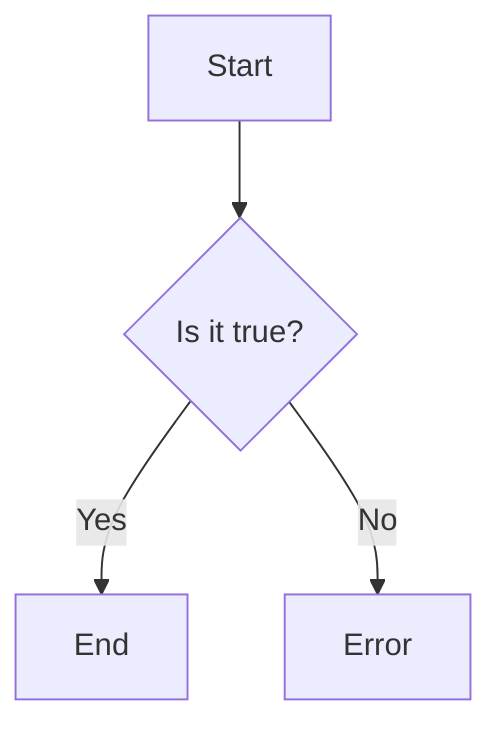

                 

# 2025字节跳动校招面试题与算法编程题详解

## 摘要

本文旨在为2025年字节跳动校招面试的候选人提供一份详细的面试题与算法编程题解析指南。本文将分为以下几个部分：

1. 背景介绍
2. 核心概念与联系
3. 核心算法原理 & 具体操作步骤
4. 数学模型和公式 & 详细讲解 & 举例说明
5. 项目实战：代码实际案例和详细解释说明
6. 实际应用场景
7. 工具和资源推荐
8. 总结：未来发展趋势与挑战
9. 附录：常见问题与解答
10. 扩展阅读 & 参考资料

通过本文，读者将能够深入了解字节跳动校招面试中的常见问题，掌握核心算法原理，并学会如何在实际项目中应用这些知识。

## 1. 背景介绍

字节跳动是一家全球领先的技术公司，以其创新的算法和大数据处理能力而闻名。其旗下的产品如抖音（TikTok）、今日头条、西瓜视频等，已经成为人们日常生活中不可或缺的一部分。因此，每年都有大量的求职者希望通过字节跳动的校招面试，加入这个快速发展的公司。

字节跳动的校招面试题目涵盖了广泛的领域，包括编程算法、数据结构、系统设计、数据库、计算机网络等。其中，编程算法和数据结构题目尤为常见，因为它们是评估求职者技术水平的重要标准。本文将重点解析这些核心问题，帮助求职者更好地应对面试挑战。

## 2. 核心概念与联系

在解析字节跳动校招面试题目之前，我们需要了解一些核心概念，这些概念构成了算法和数据结构的基础。

### 2.1 数据结构与算法

数据结构是指用于存储和组织数据的方式。常见的有数组、链表、栈、队列、树、图等。算法则是解决问题的步骤和方法。数据结构和算法紧密相连，数据结构为算法提供了存储和管理数据的方式，而算法则利用这些数据结构来解决问题。

### 2.2 时间复杂度和空间复杂度

时间复杂度和空间复杂度是评估算法效率的重要指标。时间复杂度表示算法运行的时间随着输入规模增加的增长速度，通常用大O表示法表示。空间复杂度表示算法运行时所需的额外内存空间。

### 2.3 常见算法

字节跳动校招面试中常见的一些算法包括排序算法（冒泡排序、选择排序、插入排序、快速排序等）、查找算法（二分查找、哈希查找等）、动态规划、贪心算法、回溯算法等。

### 2.4 Mermaid 流程图

Mermaid 是一种轻量级的标记语言，用于创建图表和流程图。下面是一个简单的 Mermaid 流程图示例：



这个流程图描述了一个简单的决策过程，其中 A 是开始节点，B 是决策节点，C 和 D 分别是正确的结束节点和错误的结束节点。

## 3. 核心算法原理 & 具体操作步骤

### 3.1 排序算法

排序算法是字节跳动校招面试中经常出现的题目。以下是一些常见的排序算法及其基本原理：

- **冒泡排序**：通过重复遍历要排序的数列，一次比较两个元素，如果它们的顺序错误就把它们交换过来。遍历数列的工作是重复地进行直到没有再需要交换，也就是说该数列已经排序完成。

- **选择排序**：首先在未排序序列中找到最小（大）元素，存放到排序序列的起始位置，然后，再从剩余未排序元素中继续寻找最小（大）元素，然后放到已排序序列的末尾。以此类推，直到所有元素均排序完毕。

- **插入排序**：将一个记录插入到已经排好序的有序表中，从而得到一个新的、记录数增加1的有序表。插入排序的时间复杂度为 O(n^2)。

- **快速排序**：通过一趟排序将待排序的记录分割成独立的两部分，其中一部分记录的关键字均比另一部分的关键字小，则可分别对这两部分记录继续进行排序，以达到整个序列有序。

### 3.2 查找算法

查找算法用于在数据结构中查找特定元素。以下是一些常见的查找算法：

- **二分查找**：适用于有序数组，通过递归或迭代的方式，将查找范围逐步缩小，直到找到目标元素或确定元素不存在。

- **哈希查找**：通过哈希函数将关键字映射到哈希表中，以实现快速查找。哈希查找的时间复杂度通常为 O(1)。

### 3.3 动态规划

动态规划是一种用于解决最优子结构问题的算法。其基本思想是将复杂问题分解成一系列简单子问题，并保存已解决的子问题的解，避免重复计算。

### 3.4 贪心算法

贪心算法通过每一步选择局部最优解，从而得到全局最优解。其适用于具有最优子结构性质的贪心选择问题。

### 3.5 回溯算法

回溯算法通过递归尝试所有可能的解决方案，并在遇到不可行的分支时回退到上一个状态，直到找到解决方案或确定无解。

## 4. 数学模型和公式 & 详细讲解 & 举例说明

### 4.1 时间复杂度

时间复杂度是评估算法效率的重要指标。以下是一些常见的时间复杂度及其含义：

- O(1)：常数时间复杂度，不随输入规模增加而增加。
- O(n)：线性时间复杂度，随着输入规模增加而增加。
- O(n^2)：平方时间复杂度，随着输入规模增加而平方增长。
- O(log n)：对数时间复杂度，随着输入规模增加而对数增长。

### 4.2 空间复杂度

空间复杂度是评估算法所需额外内存空间的指标。以下是一些常见的空间复杂度及其含义：

- O(1)：常数空间复杂度，不随输入规模增加而增加。
- O(n)：线性空间复杂度，随着输入规模增加而增加。
- O(n^2)：平方空间复杂度，随着输入规模增加而平方增长。

### 4.3 动态规划公式

动态规划公式通常表示为：

```
f(n) = f(k) + g(n - k)
```

其中，f(n) 表示第 n 个问题的解，g(n) 表示第 k 个问题的解，k 是递推关系中的参数。

### 4.4 举例说明

以下是一个动态规划问题的例子：

**问题**：给定一个整数数组 nums，找到和为目标值的连续最长子数组长度。

**解决方案**：

1. 定义一个数组 dp，其中 dp[i] 表示以 nums[i] 结尾的连续最长子数组的长度。
2. 遍历数组 nums，对于每个元素 nums[i]，从 i-1 开始向前遍历，找到第一个满足 nums[j] + nums[i] = target 的位置 j。
3. 如果找到了 j，更新 dp[i] = dp[j] + 1；否则，dp[i] = 1。
4. 遍历 dp 数组，找到最大值 max(dp)。

## 5. 项目实战：代码实际案例和详细解释说明

### 5.1 开发环境搭建

为了更好地理解本文中提到的算法和编程题，我们需要搭建一个合适的开发环境。以下是一个简单的 Python 开发环境搭建步骤：

1. 安装 Python：从官方网站（https://www.python.org/）下载最新版本的 Python，并按照安装向导安装。
2. 安装代码编辑器：推荐使用 PyCharm（https://www.jetbrains.com/pycharm/），一个功能强大的 Python 集成开发环境（IDE）。
3. 安装相关库：在 PyCharm 中创建一个新项目，并安装所需的库，如 NumPy、Pandas 等。

### 5.2 源代码详细实现和代码解读

以下是一个简单的 Python 程序，用于实现冒泡排序算法：

```python
def bubble_sort(nums):
    n = len(nums)
    for i in range(n):
        for j in range(n - i - 1):
            if nums[j] > nums[j + 1]:
                nums[j], nums[j + 1] = nums[j + 1], nums[j]

# 示例
nums = [3, 1, 4, 1, 5, 9, 2, 6, 5]
bubble_sort(nums)
print(nums)
```

**代码解读**：

1. 函数 bubble_sort 接受一个整数数组 nums 作为输入。
2. 使用两个嵌套循环遍历数组 nums。
3. 在内层循环中，比较相邻的两个元素，如果前一个元素大于后一个元素，交换它们的位置。
4. 重复上述步骤，直到整个数组排序完成。

### 5.3 代码解读与分析

1. **时间复杂度**：冒泡排序的时间复杂度为 O(n^2)，因为它需要遍历整个数组，且每次遍历需要比较相邻元素。
2. **空间复杂度**：冒泡排序的空间复杂度为 O(1)，因为它只需要一个额外的变量来存储中间值，而不需要额外的数组空间。
3. **优化**：虽然冒泡排序是一种简单的排序算法，但它在数据量较大时性能较差。在实际应用中，可以考虑使用更高效的排序算法，如快速排序或归并排序。

## 6. 实际应用场景

字节跳动校招面试中的算法和编程题在实际项目中具有广泛的应用。以下是一些实际应用场景：

- **推荐系统**：推荐系统需要处理大量的用户行为数据，并实时更新推荐结果。常见的算法有协同过滤、矩阵分解、深度学习等。
- **广告系统**：广告系统需要根据用户兴趣和行为，为用户推荐相关的广告。常见的算法有基于内容的推荐、基于协同过滤的推荐等。
- **图像处理**：图像处理算法可以用于人脸识别、图像分类、图像分割等任务。常见的算法有卷积神经网络、循环神经网络等。
- **自然语言处理**：自然语言处理算法可以用于文本分类、情感分析、机器翻译等任务。常见的算法有词向量、长短时记忆网络等。

## 7. 工具和资源推荐

### 7.1 学习资源推荐

- **书籍**：
  - 《算法导论》（Introduction to Algorithms）
  - 《深度学习》（Deep Learning）
  - 《Python编程：从入门到实践》（Python Crash Course）
- **论文**：
  - “Efficient Algorithms for Online Recommendation”（在线推荐系统高效算法）
  - “Adversarial Examples, Robustness, and Neural Networks”（对抗性样本、鲁棒性与神经网络）
- **博客**：
  - 快手技术博客（https://tech.qihoo.com/）
  - 掘金（https://juejin.cn/）
- **网站**：
  - LeetCode（https://leetcode-cn.com/）
  - GitHub（https://github.com/）

### 7.2 开发工具框架推荐

- **开发工具**：
  - PyCharm（https://www.jetbrains.com/pycharm/）
  - Visual Studio Code（https://code.visualstudio.com/）
- **框架**：
  - TensorFlow（https://www.tensorflow.org/）
  - PyTorch（https://pytorch.org/）

### 7.3 相关论文著作推荐

- **论文**：
  - “Deep Learning for Text Classification”（深度学习在文本分类中的应用）
  - “Recommender Systems: The Textbook”（推荐系统教材）
- **著作**：
  - 《机器学习实战》（Machine Learning in Action）
  - 《深度学习》（Deep Learning）

## 8. 总结：未来发展趋势与挑战

随着人工智能技术的快速发展，算法和编程题在面试中的重要性日益增加。未来，面试题目将更加注重考察求职者的创新能力、解决问题的能力以及实际项目经验。以下是一些发展趋势和挑战：

- **算法创新**：随着数据规模的不断扩大，对算法的优化和改进需求将不断增加，如何设计高效的算法将是一个重要挑战。
- **多模态数据融合**：未来，多模态数据（如文本、图像、语音等）的融合将成为研究热点，如何处理和分析这些数据将是一个挑战。
- **模型解释性**：随着深度学习模型在各个领域的应用，如何提高模型的解释性，使其更容易被人理解和信任，将成为一个重要课题。
- **数据隐私和安全**：在处理大量用户数据时，如何保护用户隐私和安全，防止数据泄露，将是一个关键挑战。

## 9. 附录：常见问题与解答

### 9.1 如何准备字节跳动校招面试？

- **提前准备**：了解字节跳动公司的背景、文化和业务，熟悉面试常见题型，并进行针对性的练习。
- **项目经验**：展示实际项目经验，突出自己在项目中的贡献和解决问题的能力。
- **编程能力**：提高编程能力，熟练掌握常用的数据结构和算法，并能够灵活运用。
- **团队合作**：展示良好的团队合作精神，强调自己在团队中的角色和贡献。

### 9.2 如何提高算法和编程能力？

- **刷题**：通过刷题平台（如 LeetCode、牛客网等）进行练习，积累解题经验。
- **学习资源**：阅读优秀的算法书籍、论文，并关注相关博客和网站。
- **实践项目**：参与实际项目，将所学知识应用到实际问题中。
- **代码规范**：养成良好的代码规范，提高代码的可读性和可维护性。

## 10. 扩展阅读 & 参考资料

- **书籍**：
  - 《算法导论》（Introduction to Algorithms）
  - 《深度学习》（Deep Learning）
  - 《Python编程：从入门到实践》（Python Crash Course）
- **论文**：
  - “Efficient Algorithms for Online Recommendation”（在线推荐系统高效算法）
  - “Adversarial Examples, Robustness, and Neural Networks”（对抗性样本、鲁棒性与神经网络）
- **博客**：
  - 快手技术博客（https://tech.qihoo.com/）
  - 掘金（https://juejin.cn/）
- **网站**：
  - LeetCode（https://leetcode-cn.com/）
  - GitHub（https://github.com/）

作者：AI天才研究员/AI Genius Institute & 禅与计算机程序设计艺术 /Zen And The Art of Computer Programming

