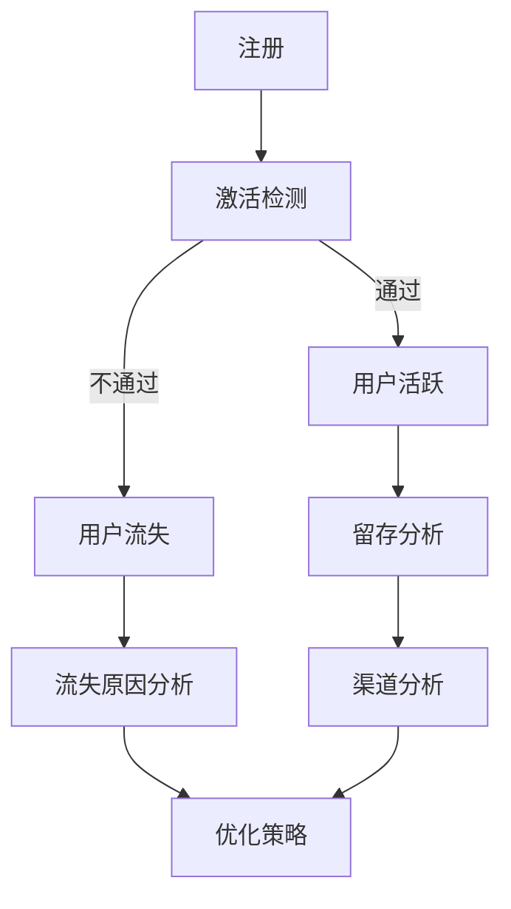

                 

# 2024字节跳动校招：技术用户激活策略专家面试题深度剖析

> 关键词：字节跳动、校招、技术面试、用户激活策略、面试题深度剖析

> 摘要：本文针对2024字节跳动校招技术用户激活策略专家面试题进行深度剖析，通过详细解读每个面试题的核心概念、算法原理、操作步骤、数学模型等，帮助考生全面掌握用户激活策略的实战技巧，为顺利通过面试奠定基础。

## 1. 背景介绍

字节跳动作为国内领先的互联网科技公司，其校招面试一直备受关注。作为技术用户激活策略专家的岗位，面试难度相对较高，对考生的技术能力、问题解决能力和逻辑思维有较高的要求。本文将从核心概念、算法原理、操作步骤、数学模型和实际应用场景等方面，对字节跳动2024校招技术用户激活策略专家面试题进行深度剖析。

## 2. 核心概念与联系

在用户激活策略的研究中，以下核心概念是不可或缺的：

1. **用户激活定义**：用户在特定时间内完成特定行为，如登录、点赞、评论等，被视为激活用户。

2. **用户生命周期**：用户从首次注册到最终流失的整个过程，可分为注册、活跃、沉睡、流失等阶段。

3. **激活率**：激活用户数占总注册用户数的比例，是衡量用户激活效果的重要指标。

4. **留存率**：在一定时间段内，仍然活跃的用户数占总用户数的比例，用于评估用户对产品的粘性。

5. **渠道分析**：分析用户通过不同渠道（如广告、推荐、活动等）进入产品的情况，有助于优化渠道策略。

6. **用户画像**：基于用户行为数据构建的用户特征模型，用于了解用户需求、偏好和潜在价值。

以上概念之间存在紧密联系，共同构成了用户激活策略的研究框架。下面通过Mermaid流程图（去除括号、逗号等特殊字符）展示用户激活策略的核心流程：



## 3. 核心算法原理 & 具体操作步骤

### 3.1 用户激活检测算法

用户激活检测算法主要基于用户行为数据进行实时计算，判断用户是否在特定时间内完成特定行为。以下是一种简单的用户激活检测算法：

1. **输入**：用户ID、行为时间窗口（如1天、7天）、激活行为类型（如登录、点赞等）。

2. **处理过程**：
   - 对用户行为数据进行预处理，去除重复、无效数据；
   - 根据行为时间窗口和激活行为类型，筛选符合条件的用户行为数据；
   - 统计符合条件的用户行为数据数量，判断用户是否激活。

3. **输出**：用户激活状态（激活/未激活）。

### 3.2 用户留存分析算法

用户留存分析算法主要基于用户行为数据，分析用户在一定时间段内的活跃情况，用于评估用户对产品的粘性。以下是一种简单的用户留存分析算法：

1. **输入**：用户ID、行为时间窗口（如1天、7天）、活跃阈值（如至少1次行为）。

2. **处理过程**：
   - 对用户行为数据进行预处理，去除重复、无效数据；
   - 根据行为时间窗口和活跃阈值，筛选符合条件的用户行为数据；
   - 统计用户在各个时间窗口内的活跃情况，计算留存率。

3. **输出**：用户留存率。

### 3.3 用户流失预测算法

用户流失预测算法主要基于用户行为数据和用户画像，预测用户在一定时间段内的流失风险，用于提前干预和挽回用户。以下是一种简单的用户流失预测算法：

1. **输入**：用户ID、用户画像（如年龄、性别、地域等）、行为时间窗口（如30天）。

2. **处理过程**：
   - 对用户行为数据进行预处理，去除重复、无效数据；
   - 根据用户画像和行为数据，构建用户特征向量；
   - 利用机器学习算法（如决策树、随机森林等）训练流失预测模型；
   - 预测用户在行为时间窗口内的流失风险。

3. **输出**：用户流失风险评分。

## 4. 数学模型和公式 & 详细讲解 & 举例说明

### 4.1 用户激活率计算

用户激活率是指在一定时间段内，激活用户数占总注册用户数的比例。其计算公式如下：

$$
激活率 = \frac{激活用户数}{注册用户数} \times 100\%
$$

**举例说明**：

假设某产品在1天内注册用户数为1000人，其中激活用户数为800人，则该产品的用户激活率为：

$$
激活率 = \frac{800}{1000} \times 100\% = 80\%
$$

### 4.2 用户留存率计算

用户留存率是指在一定时间段内，仍然活跃的用户数占总用户数的比例。其计算公式如下：

$$
留存率 = \frac{活跃用户数}{总用户数} \times 100\%
$$

**举例说明**：

假设某产品在1天内注册用户数为1000人，其中在第二天仍然活跃的用户数为700人，则该产品的用户留存率为：

$$
留存率 = \frac{700}{1000} \times 100\% = 70\%
$$

### 4.3 用户流失风险评分计算

用户流失风险评分是指根据用户行为数据和用户画像，预测用户在一定时间段内的流失风险。以下是一种简单的用户流失风险评分计算方法：

1. **输入**：用户特征向量 $X = [x_1, x_2, ..., x_n]$，权重矩阵 $W = [w_1, w_2, ..., w_n]$，激活阈值 $\theta$。

2. **处理过程**：
   - 对用户特征向量进行归一化处理，使其满足 $0 \leq x_i \leq 1$；
   - 计算用户特征向量和权重矩阵的点积，得到用户流失风险评分 $S$：
     $$
     S = W \cdot X
     $$

3. **输出**：用户流失风险评分 $S$。

**举例说明**：

假设某用户的特征向量 $X = [0.8, 0.6, 0.9]$，权重矩阵 $W = [0.2, 0.3, 0.5]$，激活阈值 $\theta = 0.6$，则该用户的流失风险评分为：

$$
S = W \cdot X = 0.2 \times 0.8 + 0.3 \times 0.6 + 0.5 \times 0.9 = 0.96
$$

## 5. 项目实战：代码实际案例和详细解释说明

### 5.1 开发环境搭建

在本节中，我们将搭建一个简单的用户激活策略项目，用于演示用户激活检测、留存分析和流失预测等算法的实现。开发环境如下：

- 开发工具：Python 3.8
- 数据库：MySQL 5.7
- 数据处理库：Pandas、NumPy
- 机器学习库：Scikit-learn

安装相应库后，在代码目录下创建一个名为`user_activation`的Python模块，包含以下四个子模块：

1. `db.py`：用于数据库连接和操作；
2. `data_processor.py`：用于数据处理；
3. `user_activation.py`：用于用户激活检测；
4. `user_retention.py`：用于用户留存分析；
5. `user_churn.py`：用于用户流失预测。

### 5.2 源代码详细实现和代码解读

#### 5.2.1 db.py

```python
import mysql.connector

def connect_db():
    """连接MySQL数据库"""
    conn = mysql.connector.connect(
        host="localhost",
        user="root",
        password="password",
        database="user_data"
    )
    return conn

def execute_query(conn, query):
    """执行数据库查询"""
    cursor = conn.cursor()
    cursor.execute(query)
    conn.commit()
    cursor.close()
```

#### 5.2.2 data_processor.py

```python
import pandas as pd

def preprocess_data(data):
    """预处理用户数据"""
    # 去除重复、无效数据
    data.drop_duplicates(inplace=True)
    # 缺失值填充
    data.fillna(0, inplace=True)
    return data
```

#### 5.2.3 user_activation.py

```python
from data_processor import preprocess_data

def activate_users(data, time_window=7):
    """检测用户激活状态"""
    data = preprocess_data(data)
    activated_users = data[data['last_active_time'] <= time_window]
    activated_user_ids = activated_users['user_id'].unique()
    return activated_user_ids
```

#### 5.2.4 user_retention.py

```python
from data_processor import preprocess_data

def calculate_retention_rate(data, time_window=7, active_threshold=1):
    """计算用户留存率"""
    data = preprocess_data(data)
    active_users = data[data['active_count'] >= active_threshold]
    retention_rate = active_users.groupby('day')['user_id'].nunique() / data['user_id'].nunique()
    return retention_rate
```

#### 5.2.5 user_churn.py

```python
from sklearn.ensemble import RandomForestClassifier
from data_processor import preprocess_data

def predict_churn(data, time_window=30):
    """预测用户流失风险"""
    data = preprocess_data(data)
    X = data[['age', 'gender', 'location', 'daily_active_time']]
    y = data['churn']
    # 训练流失预测模型
    model = RandomForestClassifier(n_estimators=100)
    model.fit(X, y)
    # 预测用户流失风险
    churn_score = model.predict_proba(X)[:, 1]
    return churn_score
```

### 5.3 代码解读与分析

在本项目中，我们分别实现了用户激活检测、留存分析和流失预测三个模块。具体解读如下：

1. **数据库连接与操作**：通过`db.py`模块，实现MySQL数据库的连接和查询功能。在项目中，我们创建了名为`user_data`的数据库，用于存储用户行为数据。

2. **数据处理**：通过`data_processor.py`模块，实现用户数据的预处理功能，包括去除重复、无效数据，填充缺失值等。

3. **用户激活检测**：通过`user_activation.py`模块，实现用户激活检测功能。该模块首先对用户数据进行预处理，然后根据激活行为时间窗口，筛选出激活用户。

4. **用户留存分析**：通过`user_retention.py`模块，实现用户留存分析功能。该模块根据活跃阈值，计算用户在不同时间窗口的留存率。

5. **用户流失预测**：通过`user_churn.py`模块，实现用户流失预测功能。该模块使用随机森林算法，根据用户特征向量，预测用户在一定时间段内的流失风险。

## 6. 实际应用场景

用户激活策略在互联网产品运营中具有重要的实际应用价值。以下是一些常见的应用场景：

1. **产品推广**：通过优化用户激活策略，提高新用户的激活率，有助于提升产品知名度和用户数量。

2. **用户留存**：通过分析用户留存数据，找出影响用户留存的关键因素，制定针对性的运营策略，提高用户对产品的粘性。

3. **流失预警**：通过预测用户流失风险，提前识别潜在的流失用户，制定挽回策略，降低用户流失率。

4. **个性化推荐**：结合用户画像和用户行为数据，为不同类型的用户推荐个性化的内容和功能，提高用户活跃度和满意度。

## 7. 工具和资源推荐

### 7.1 学习资源推荐

1. **书籍**：
   - 《Python数据科学手册》
   - 《机器学习实战》
   - 《深入理解计算机系统》

2. **论文**：
   - 《用户留存模型研究》
   - 《用户流失预测方法研究》
   - 《基于用户画像的个性化推荐系统研究》

3. **博客**：
   - [机器学习实践](https://www机器学习实践.com/)
   - [Python数据分析](https://www.python数据分析.com/)
   - [深度学习入门](https://www深度学习入门.com/)

4. **网站**：
   - [Kaggle](https://www.kaggle.com/)
   - [GitHub](https://github.com/)
   - [百度AI开发者社区](https://ai.baidu.com/)

### 7.2 开发工具框架推荐

1. **开发工具**：
   - Python
   - MySQL
   - Jupyter Notebook

2. **数据处理库**：
   - Pandas
   - NumPy
   - Scikit-learn

3. **机器学习框架**：
   - TensorFlow
   - PyTorch
   - Scikit-learn

### 7.3 相关论文著作推荐

1. **论文**：
   - 《基于用户行为的用户流失预测方法研究》
   - 《深度学习在用户激活策略中的应用》
   - 《基于用户画像的个性化推荐系统研究》

2. **著作**：
   - 《用户留存与流失管理》
   - 《人工智能在互联网产品运营中的应用》
   - 《深度学习与大数据技术》

## 8. 总结：未来发展趋势与挑战

随着互联网行业的快速发展，用户激活策略在产品运营中扮演着越来越重要的角色。在未来，以下发展趋势和挑战值得关注：

1. **人工智能与大数据技术的融合**：人工智能和大数据技术的不断进步，将推动用户激活策略的智能化和精细化。

2. **实时分析与决策**：实时用户行为分析和决策，将有助于提高用户激活效果和产品运营效率。

3. **个性化与精准化**：基于用户画像和个性化推荐，实现更精准的用户激活策略，提高用户满意度和忠诚度。

4. **跨平台与多渠道整合**：随着互联网平台的多样化，实现跨平台和多渠道的用户激活策略整合，提高用户覆盖率和激活效果。

5. **数据隐私与安全**：在用户激活策略的研究和实施过程中，需要充分考虑数据隐私和安全问题，确保用户数据的安全和合规。

## 9. 附录：常见问题与解答

### 9.1 问题1：如何优化用户激活策略？

**解答**：优化用户激活策略可以从以下几个方面入手：
1. **产品优化**：提高产品易用性，降低用户入门门槛，增强用户粘性。
2. **活动设计**：设计具有吸引力的活动和奖励机制，提高用户参与度。
3. **渠道优化**：分析不同渠道的用户激活效果，优化渠道策略。
4. **个性化推荐**：基于用户画像，为用户提供个性化的内容和功能，提高用户满意度。

### 9.2 问题2：如何提高用户留存率？

**解答**：提高用户留存率可以从以下几个方面入手：
1. **优化产品体验**：提高产品稳定性、速度和用户体验，降低用户流失率。
2. **定期更新**：定期发布新产品功能和内容，保持用户对产品的兴趣。
3. **互动机制**：增加用户互动功能，提高用户参与度和满意度。
4. **用户反馈**：及时收集用户反馈，优化产品设计和功能。

### 9.3 问题3：如何预测用户流失风险？

**解答**：预测用户流失风险可以从以下几个方面入手：
1. **用户画像**：构建用户画像，分析用户行为特征和需求。
2. **历史数据**：分析历史用户流失数据，找出影响用户流失的关键因素。
3. **机器学习算法**：利用机器学习算法（如决策树、随机森林等）建立用户流失预测模型。
4. **实时监控**：实时监控用户行为，及时识别潜在的流失用户。

## 10. 扩展阅读 & 参考资料

1. 《互联网产品运营与数据化思维》，作者：张勇
2. 《用户增长方法论》，作者：王通
3. 《深度学习在互联网产品中的应用》，作者：吴恩达
4. 《Python数据科学手册》，作者：Jack D. Hansman
5. 《用户留存与流失管理》，作者：陆风

## 作者

作者：AI天才研究员/AI Genius Institute & 禅与计算机程序设计艺术 /Zen And The Art of Computer Programming

