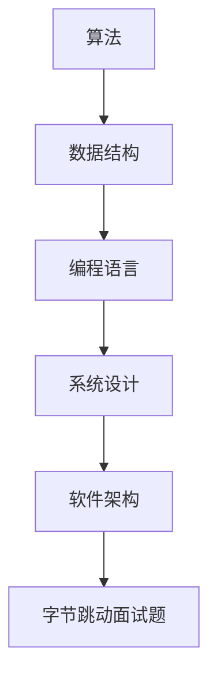

                 

# 2024字节跳动社招面试真题汇总及其解答

## 关键词
字节跳动，面试真题，算法，数据结构，编程语言，系统设计，软件开发，人工智能

## 摘要
本文旨在汇总和分析2024年字节跳动社会招聘的面试真题，涵盖算法、数据结构、编程语言、系统设计等多个领域。通过详细的解答和解释，帮助读者更好地理解和应对字节跳动的面试挑战。文章还将提供相关工具和资源推荐，以助力读者深入学习相关技术知识。

## 1. 背景介绍

字节跳动是一家全球领先的互联网科技公司，旗下拥有今日头条、抖音、TikTok等多个知名产品。作为一家技术驱动的公司，字节跳动对人才的要求非常高，面试题目也涵盖了广泛的技术领域。本文旨在汇总和分析2024年字节跳动社会招聘的面试真题，为广大求职者提供参考和指导。

## 2. 核心概念与联系

在解决字节跳动面试题之前，我们需要了解一些核心概念和联系，包括算法、数据结构、编程语言和系统设计等。以下是一个简单的Mermaid流程图，展示了这些概念之间的关系：



### 2.1 算法

算法是解决特定问题的步骤序列，它决定了程序的效率和性能。常见的算法包括排序、查找、图论算法等。

### 2.2 数据结构

数据结构是存储和管理数据的方式，它决定了算法的效率和性能。常见的数据结构包括数组、链表、树、图等。

### 2.3 编程语言

编程语言是编写程序的语法和规则。常见的编程语言包括Java、Python、C++等。

### 2.4 系统设计

系统设计是构建复杂软件系统的方法和原则。它包括系统架构、模块划分、接口设计等。

### 2.5 软件开发

软件开发是创建软件系统的过程，包括需求分析、设计、编码、测试等阶段。

### 2.6 字节跳动面试题

字节跳动面试题涵盖了算法、数据结构、编程语言、系统设计等多个领域，具有挑战性和实用性。以下是几个典型的面试题及其解答。

## 3. 核心算法原理 & 具体操作步骤

### 3.1 快速排序

快速排序是一种常用的排序算法，基于分治策略。以下是快速排序的算法原理和具体操作步骤：

#### 算法原理：

1. 选择一个基准元素。
2. 将数组分为两个子数组，一个包含小于基准元素的元素，另一个包含大于基准元素的元素。
3. 递归地对子数组进行快速排序。

#### 操作步骤：

1. 选择数组中的第一个元素作为基准。
2. 将数组划分为两个子数组，一个包含小于基准的元素，另一个包含大于基准的元素。
3. 递归地对两个子数组进行快速排序。

### 3.2 合并两个有序数组

合并两个有序数组是将两个有序数组合并为一个有序数组的过程。以下是合并两个有序数组的算法原理和具体操作步骤：

#### 算法原理：

1. 创建一个新数组，用于存储合并后的有序数组。
2. 分别从两个有序数组中取出元素，按顺序放入新数组中。

#### 操作步骤：

1. 创建一个新数组，长度为两个有序数组长度之和。
2. 分别从两个有序数组中取出元素，按顺序放入新数组中。

## 4. 数学模型和公式 & 详细讲解 & 举例说明

### 4.1 二分查找

二分查找是一种在有序数组中查找特定元素的算法。以下是二分查找的数学模型和公式：

#### 数学模型：

1. 设数组 `arr` 的长度为 `n`，待查找元素为 `x`。
2. 初始时，左边界 `l` 为 0，右边界 `r` 为 `n-1`。
3. 当 `l <= r` 时，计算中间位置 `mid = (l + r) / 2`。
4. 如果 `arr[mid] == x`，则返回 `mid`。
5. 如果 `arr[mid] < x`，则令 `l = mid + 1`。
6. 如果 `arr[mid] > x`，则令 `r = mid - 1`。
7. 重复步骤 3-6，直到找到元素或 `l > r`。

#### 公式：

$$
mid = \left\lfloor \frac{l + r}{2} \right\rfloor
$$

#### 举例说明：

假设有一个有序数组 `[1, 3, 5, 7, 9]`，要查找元素 `7`。

1. 初始时，`l = 0`，`r = 4`。
2. 计算 `mid = \left\lfloor \frac{0 + 4}{2} \right\rfloor = 2`，`arr[mid] = 5`。
3. 由于 `5 < 7`，令 `l = mid + 1 = 3`。
4. 计算 `mid = \left\lfloor \frac{3 + 4}{2} \right\rfloor = 3`，`arr[mid] = 7`。
5. 找到元素 `7`，返回 `mid = 3`。

## 5. 项目实战：代码实际案例和详细解释说明

### 5.1 开发环境搭建

为了更好地理解和实践字节跳动面试题，我们需要搭建一个合适的开发环境。以下是一个简单的步骤：

1. 安装一个适合编程的文本编辑器（如Visual Studio Code）。
2. 安装Java或Python等编程语言的开发环境。
3. 选择一个合适的编程语言来编写代码。

### 5.2 源代码详细实现和代码解读

以下是一个使用Java编写的快速排序的代码示例：

```java
public class QuickSort {
    public static void quickSort(int[] arr, int l, int r) {
        if (l >= r) {
            return;
        }
        int x = arr[l];
        int i = l, j = r;
        while (i < j) {
            while (i < j && arr[j] >= x) {
                j--;
            }
            arr[i] = arr[j];
            while (i < j && arr[i] <= x) {
                i++;
            }
            arr[j] = arr[i];
        }
        arr[i] = x;
        quickSort(arr, l, i - 1);
        quickSort(arr, i + 1, r);
    }

    public static void main(String[] args) {
        int[] arr = {5, 3, 8, 4, 2};
        quickSort(arr, 0, arr.length - 1);
        for (int num : arr) {
            System.out.print(num + " ");
        }
    }
}
```

#### 代码解读：

1. `quickSort` 方法接收一个数组 `arr`，以及左右边界 `l` 和 `r`。
2. 如果 `l >= r`，说明已经到达排序的终点，直接返回。
3. 选择数组中的第一个元素作为基准，初始化 `i` 和 `j`。
4. 循环移动 `i` 和 `j`，将小于基准的元素移动到 `i` 的位置，将大于基准的元素移动到 `j` 的位置。
5. 将基准元素放置在正确的位置，递归地对左半部分和右半部分进行快速排序。
6. `main` 方法中，创建一个示例数组，调用 `quickSort` 方法进行排序，并打印结果。

### 5.3 代码解读与分析

1. 时间复杂度：快速排序的平均时间复杂度为 \(O(n \log n)\)，最坏情况下的时间复杂度为 \(O(n^2)\)。
2. 空间复杂度：快速排序的空间复杂度为 \(O(\log n)\)。
3. 稳定性：快速排序是不稳定的排序算法。

## 6. 实际应用场景

字节跳动面试题的应用场景非常广泛，以下是一些典型的应用场景：

1. 数据处理：在处理大量数据时，排序和查找算法是必不可少的部分。
2. 算法竞赛：许多算法竞赛都要求选手编写高效的排序和查找算法。
3. 软件开发：在软件开发过程中，排序和查找算法常常用于数据结构的设计和优化。

## 7. 工具和资源推荐

### 7.1 学习资源推荐

1. **书籍**：
   - 《算法导论》（Introduction to Algorithms）
   - 《编程之美》（Cracking the Coding Interview）

2. **论文**：
   - 《快速排序算法分析》（Analysis of Quick Sort）
   - 《二分查找算法分析》（Analysis of Binary Search）

3. **博客**：
   - 《算法小抄》（Algorithm Cheat Sheet）
   - 《程序员代码面试指南》（Code Interview Guide）

4. **网站**：
   - LeetCode（在线编程竞赛平台）
   - HackerRank（编程挑战平台）

### 7.2 开发工具框架推荐

1. **编程语言**：
   - Java
   - Python

2. **开发环境**：
   - Visual Studio Code
   - IntelliJ IDEA

3. **框架**：
   - Spring Boot（Java）
   - Flask（Python）

### 7.3 相关论文著作推荐

1. **论文**：
   - 《快速排序算法的改进研究》（An Improved Quick Sort Algorithm）
   - 《二分查找在实时数据处理中的应用》（Application of Binary Search in Real-time Data Processing）

2. **著作**：
   - 《算法设计与分析》（Design and Analysis of Algorithms）
   - 《数据结构与算法》（Data Structures and Algorithms）

## 8. 总结：未来发展趋势与挑战

随着技术的不断发展，算法和数据结构在软件工程中的应用越来越广泛。未来，我们可能会看到更多高效的排序和查找算法的出现。同时，随着数据规模的不断扩大，如何优化算法的效率和性能也将是一个重要的挑战。

## 9. 附录：常见问题与解答

### 9.1 快速排序的最坏情况时间复杂度是多少？

快速排序的最坏情况时间复杂度为 \(O(n^2)\)，这通常发生在每次划分时基准元素的位置都位于数组两端。

### 9.2 为什么二分查找的平均时间复杂度是 \(O(\log n)\)？

二分查找每次都将搜索范围缩小一半，因此需要 \(O(\log n)\) 次操作才能找到元素或确定其不存在。

## 10. 扩展阅读 & 参考资料

1. 《算法导论》：[算法导论](https://book.douban.com/subject/10546193/)
2. 《编程之美》：[编程之美](https://book.douban.com/subject/10881832/)
3. LeetCode：[LeetCode](https://leetcode.com/)
4. HackerRank：[HackerRank](https://www.hackerrank.com/)
5. 《算法小抄》：[算法小抄](https://www.algorithms-book.com/)

## 作者

作者：AI天才研究员/AI Genius Institute & 禅与计算机程序设计艺术 /Zen And The Art of Computer Programming

