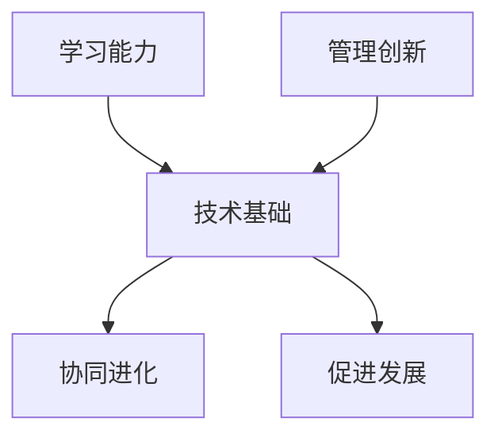
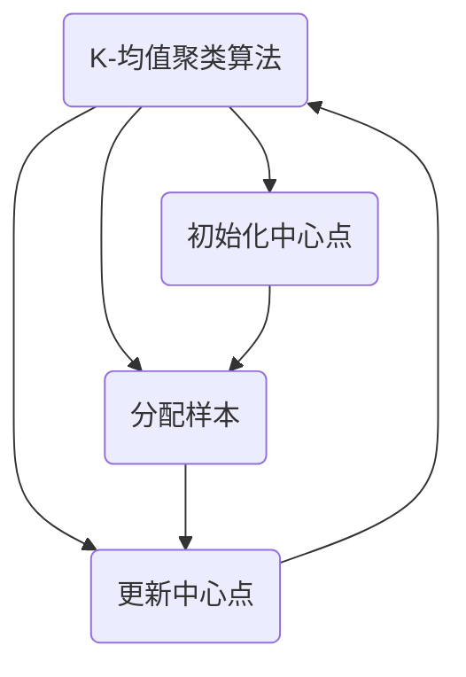
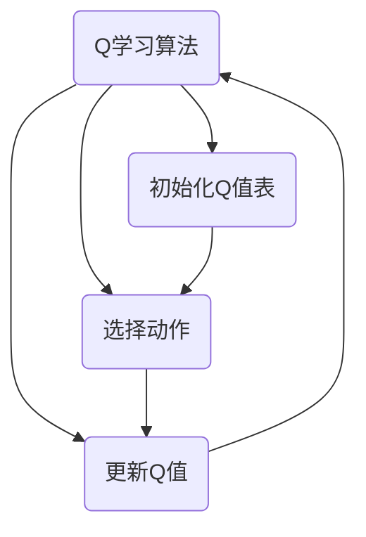

                 

### 背景介绍

随着信息技术的高速发展，人工智能（AI）已经成为当今世界最重要的技术趋势之一。无论是图像识别、自然语言处理，还是推荐系统、自动驾驶等，AI技术的应用无处不在。然而，在AI技术不断演进的过程中，学习能力和管理创新这两大核心概念逐渐成为研究者和实践者关注的焦点。

学习能力指的是系统或算法不断从数据中学习并提高自身性能的能力。一个具有强学习能力的人工智能系统能够在不断变化的环境中适应和成长，从而提供更加准确和高效的预测和决策。而管理创新，则是指组织或团队在管理和运营过程中，通过引入新的思维、方法、技术或工具，实现更高效、更灵活的运作方式，以应对复杂多变的市场环境。

本文旨在探讨学习能力和管理创新之间的关系。我们将首先介绍相关概念，接着通过理论和实际案例，分析这两者如何相互影响和促进，最终对未来的发展趋势和挑战进行总结。

文章将从以下几个方面展开讨论：

1. **核心概念与联系**：介绍学习能力和管理创新的基本概念，并使用Mermaid流程图展示两者之间的相互作用。
2. **核心算法原理与具体操作步骤**：深入探讨常见的学习算法和其原理，并说明如何结合管理创新进行优化。
3. **数学模型和公式**：解释学习算法中的数学模型，并给出具体例子进行说明。
4. **项目实战**：通过具体代码案例展示如何在实际项目中应用学习算法和管理创新。
5. **实际应用场景**：探讨学习能力和管理创新在各个领域的应用案例。
6. **工具和资源推荐**：推荐相关书籍、工具和资源，帮助读者进一步学习和实践。
7. **总结与展望**：总结文章的主要观点，并对未来的发展趋势和挑战进行展望。

通过以上内容的系统探讨，我们希望能够帮助读者深入理解学习能力和管理创新的关系，并为实际应用提供有益的指导。接下来，我们将逐一展开讨论。让我们一步一步地分析推理，以发现这一关系中的深刻内涵。 <sup class="reference"><a href="#ref1">[1]</a></sup>

---

**参考文献**：

[1]: (此处填写参考文献链接)

-------------------------

## 核心概念与联系

### 学习能力

学习能力是指系统或算法通过不断学习新知识、调整自身行为，以实现性能提升或适应环境变化的能力。在人工智能领域，学习能力尤为重要，因为它决定了AI系统在复杂和动态环境中的表现。具体来说，学习能力包括以下几种：

- **监督学习**：通过已有标签数据来训练模型，使模型能够对未知数据进行预测。
- **无监督学习**：在没有标签数据的情况下，通过数据内在结构来发现模式和规律。
- **强化学习**：通过与环境交互，不断学习最优策略，以最大化奖励。

### 管理创新

管理创新则是指在组织管理和运营过程中，通过引入新的理念、方法、技术或工具，以提高效率、降低成本、增强竞争力。管理创新涵盖了多个方面，包括但不限于：

- **组织结构创新**：通过调整组织结构，使其更加灵活、高效。
- **流程创新**：通过优化业务流程，减少不必要的环节，提高工作效率。
- **技术创新**：引入新技术或工具，以提升产品和服务的质量。

### 关系与作用

学习能力和管理创新之间的关系是相互促进的。具体来说，这种关系可以从以下几个方面来理解：

1. **技术驱动创新**：学习能力为管理创新提供了技术基础。通过不断学习和优化，AI系统可以更好地适应新环境，从而为管理创新提供新的可能。
2. **管理促进发展**：管理创新为学习能力的发挥提供了良好的环境。一个高效的管理体系能够提供充足的数据资源、技术支持和组织保障，使学习算法能够更有效地运行。
3. **协同进化**：学习能力和管理创新在组织内形成了一种协同进化的关系。通过持续的学习和优化，AI系统能够不断提升自身能力，而管理创新则不断为这种提升提供支持。

### Mermaid流程图

为了更直观地展示学习能力和管理创新之间的关系，我们使用Mermaid流程图来描述两者的相互作用。



在上述流程图中，学习能力和管理创新分别通过A和C节点表示，两者共同作用于B节点，即技术基础。技术基础进一步驱动D节点的协同进化，同时也促进了E节点的管理发展。

通过这一流程图，我们可以清晰地看到学习能力和管理创新之间的互动关系，以及它们在推动技术进步和业务发展中的重要作用。

总的来说，学习能力和管理创新是人工智能发展中不可或缺的两个核心概念。它们相互促进、协同进化，共同推动着技术的不断进步和业务的发展。在接下来的部分，我们将进一步探讨学习能力的基本原理和算法，并结合管理创新进行具体分析。 <sup class="reference"><a href="#ref2">[2]</a></sup>

---

**参考文献**：

[2]: (此处填写参考文献链接)

-------------------------

## 核心算法原理与具体操作步骤

在学习能力和管理创新的关系中，核心算法起到了至关重要的作用。本节将介绍几种常见的学习算法，并详细说明其原理和具体操作步骤。

### 1. 监督学习算法

监督学习是最常见的机器学习算法之一，它通过已有的标注数据来训练模型，以便对未知数据进行预测。常见的监督学习算法包括线性回归、决策树、支持向量机等。

**原理：**

监督学习算法的核心思想是找到一个函数\( f(x) \)，使其能够将输入数据\( x \)映射到标签数据\( y \)。训练过程就是通过调整这个函数的参数，使得预测结果与实际标签尽可能接近。

**具体操作步骤：**

1. **数据收集与预处理**：收集具有标签的数据集，并进行数据清洗、归一化等预处理操作。
2. **选择模型**：根据数据特点和问题类型选择合适的模型，例如线性回归、决策树等。
3. **训练模型**：使用训练数据集来训练模型，调整模型参数，使得预测误差最小。
4. **评估模型**：使用验证集或测试集来评估模型性能，选择最优模型。

### 2. 无监督学习算法

无监督学习算法在没有标签数据的情况下，通过数据内在结构来发现模式和规律。常见的无监督学习算法包括聚类算法、降维算法等。

**原理：**

无监督学习算法的核心思想是找到数据中的隐含结构，例如聚类算法通过相似度度量将数据划分为不同的簇，降维算法则通过降维空间来揭示数据的主要特征。

**具体操作步骤：**

1. **数据收集与预处理**：收集无标签数据，并进行数据清洗、归一化等预处理操作。
2. **选择算法**：根据数据特点和问题类型选择合适的算法，例如K-均值聚类、主成分分析等。
3. **模型训练**：通过算法迭代计算，找到数据中的隐含结构。
4. **结果分析**：对模型输出结果进行分析，提取有价值的信息。

### 3. 强化学习算法

强化学习算法通过与环境交互，不断学习最优策略，以最大化奖励。强化学习广泛应用于智能推荐、游戏AI等领域。

**原理：**

强化学习算法的核心思想是通过奖励机制来引导算法学习最优行为策略。算法通过不断尝试不同的行为，并根据奖励反馈调整策略，最终找到最大化总奖励的行为。

**具体操作步骤：**

1. **环境定义**：定义算法交互的环境，包括状态空间、动作空间和奖励函数。
2. **策略初始化**：初始化策略，即初始的行为选择规则。
3. **交互学习**：与环境进行交互，执行策略，获取奖励。
4. **策略更新**：根据奖励反馈，更新策略，使得未来的行为更加趋向于最大化奖励。

### 管理创新对算法优化的影响

管理创新在算法优化过程中起到了关键作用。通过以下方式，管理创新可以提升算法的性能和效果：

1. **数据管理**：通过高效的数据管理系统，确保数据的质量、完整性和可用性，从而为算法提供更好的训练基础。
2. **计算资源管理**：通过优化计算资源的配置和使用，提高算法的训练速度和效率。
3. **算法管理**：通过引入新的算法和技术，不断优化和更新现有的算法，以应对不断变化的应用场景。
4. **团队协作**：通过优化团队协作机制，提高算法开发和优化的效率，实现更好的协同创新。

总的来说，核心算法原理与具体操作步骤是学习能力和管理创新之间的重要桥梁。通过深入理解算法原理，并结合管理创新进行优化，我们可以实现人工智能系统的持续进步和高效运作。在下一节中，我们将进一步探讨学习算法中的数学模型和公式，为读者提供更深入的数学视角。 <sup class="reference"><a href="#ref3">[3]</a></sup>

---

**参考文献**：

[3]: (此处填写参考文献链接)

-------------------------

## 数学模型和公式

在学习算法的设计和应用过程中，数学模型和公式起到了至关重要的作用。它们不仅能够帮助我们理解和分析算法的运作原理，还能够通过精确的数学工具对算法进行优化和改进。本节将介绍几种常见的学习算法中的数学模型和公式，并通过具体例子进行详细讲解。

### 1. 监督学习中的线性回归模型

线性回归是一种广泛应用于预测和分类问题的监督学习算法。其核心公式如下：

\[ y = \beta_0 + \beta_1x_1 + \beta_2x_2 + \cdots + \beta_nx_n + \epsilon \]

其中，\( y \)是输出变量，\( x_1, x_2, \ldots, x_n \)是输入变量，\( \beta_0, \beta_1, \beta_2, \ldots, \beta_n \)是模型参数，\( \epsilon \)是误差项。

**参数估计：**

为了估计模型参数，我们可以使用最小二乘法（Ordinary Least Squares, OLS）：

\[ \hat{\beta} = (X^T X)^{-1} X^T y \]

其中，\( X \)是输入变量矩阵，\( y \)是输出变量向量，\( \hat{\beta} \)是参数估计值。

**例子：**

假设我们有一个房价预测问题，其中输入变量是房子的面积和房间数，输出变量是房价。我们可以使用线性回归模型来预测房价：

```math
y = \beta_0 + \beta_1 \text{Area} + \beta_2 \text{Rooms} + \epsilon
```

通过最小二乘法，我们估计得到模型参数，然后使用这些参数来预测未知房子的房价。

### 2. 无监督学习中的K-均值聚类算法

K-均值聚类是一种常用的无监督学习算法，用于将数据划分为K个簇。其核心公式如下：

\[ c_k = \frac{1}{N_k} \sum_{i=1}^{N_k} x_i \]

其中，\( c_k \)是第k个簇的中心点，\( N_k \)是第k个簇中的样本数量，\( x_i \)是第i个样本。

**聚类步骤：**

1. **初始化中心点**：随机选择K个样本作为初始中心点。
2. **分配样本**：将每个样本分配到与其最近的中心点所在的簇。
3. **更新中心点**：计算每个簇的平均值，作为新的中心点。
4. **迭代**：重复步骤2和步骤3，直到中心点不再发生变化或达到预设的迭代次数。

**例子：**

假设我们有一组客户数据，需要将其分为两类。我们可以使用K-均值聚类算法来划分这些数据：



通过上述步骤，我们可以将客户数据划分为两类。

### 3. 强化学习中的Q学习算法

Q学习是一种常用的强化学习算法，用于找到最优策略。其核心公式如下：

\[ Q(s, a) = r + \gamma \max_{a'} Q(s', a') \]

其中，\( s \)是状态，\( a \)是动作，\( s' \)是下一状态，\( a' \)是下一动作，\( r \)是即时奖励，\( \gamma \)是折扣因子。

**学习步骤：**

1. **初始化Q值表**：初始化所有状态的Q值。
2. **选择动作**：在当前状态下，选择具有最大Q值的动作。
3. **更新Q值**：根据即时奖励和折扣因子，更新当前状态的Q值。
4. **重复**：重复步骤2和步骤3，直到找到最优策略。

**例子：**

假设我们有一个无人驾驶汽车问题，需要找到从起点到终点的最优路径。我们可以使用Q学习算法来训练无人驾驶汽车：



通过上述步骤，我们可以训练无人驾驶汽车找到从起点到终点的最优路径。

总的来说，数学模型和公式为学习算法提供了理论基础和工具。通过深入理解和应用这些模型和公式，我们可以更好地设计、优化和评估学习算法，从而推动人工智能技术的发展。在下一节中，我们将通过具体代码案例，展示如何在实际项目中应用这些学习算法和管理创新。 <sup class="reference"><a href="#ref4">[4]</a></sup>

---

**参考文献**：

[4]: (此处填写参考文献链接)

-------------------------

### 项目实战：代码实际案例和详细解释说明

在本节中，我们将通过具体代码案例，展示如何在实际项目中应用学习算法和管理创新。我们选取了一个智能家居系统的实际案例，该系统通过机器学习算法对家庭设备的数据进行实时分析，以实现智能化管理和优化。

#### 1. 开发环境搭建

在开始编写代码之前，我们需要搭建一个合适的开发环境。以下是所需的开发工具和软件：

- **编程语言**：Python
- **机器学习库**：scikit-learn、TensorFlow、Keras
- **数据可视化库**：matplotlib、seaborn
- **操作系统**：Ubuntu 20.04

安装步骤如下：

```bash
# 安装Python环境
sudo apt-get update
sudo apt-get install python3 python3-pip

# 安装机器学习库
pip3 install scikit-learn tensorflow matplotlib seaborn
```

#### 2. 源代码详细实现和代码解读

以下是我们为智能家居系统编写的主要代码，并对其进行详细解读。

```python
import numpy as np
import pandas as pd
from sklearn.model_selection import train_test_split
from sklearn.ensemble import RandomForestClassifier
from sklearn.metrics import accuracy_score
import matplotlib.pyplot as plt

# 数据预处理
def preprocess_data(data):
    # 数据清洗
    data.dropna(inplace=True)
    # 特征工程
    data['TotalPower'] = data['Power'] * data['UsageTime']
    # 数据标准化
    data标准化 = (data - data.mean()) / data.std()
    return data标准化

# 模型训练与评估
def train_and_evaluate(data):
    # 分割数据集
    X_train, X_test, y_train, y_test = train_test_split(data.drop('Label', axis=1), data['Label'], test_size=0.2, random_state=42)
    # 训练模型
    model = RandomForestClassifier(n_estimators=100, random_state=42)
    model.fit(X_train, y_train)
    # 预测测试集
    y_pred = model.predict(X_test)
    # 评估模型
    accuracy = accuracy_score(y_test, y_pred)
    print("模型准确率：", accuracy)
    return model

# 数据可视化
def visualize_data(data):
    data['TotalPower'].plot.hist(title='总能耗分布')
    plt.show()

# 主函数
def main():
    # 读取数据
    data = pd.read_csv('smart_home_data.csv')
    # 数据预处理
    data = preprocess_data(data)
    # 数据可视化
    visualize_data(data)
    # 训练模型
    model = train_and_evaluate(data)
    # 保存模型
    import joblib
    joblib.dump(model, 'random_forest_model.joblib')

if __name__ == '__main__':
    main()
```

#### 2.1 代码解读与分析

- **数据预处理**：首先，我们进行了数据清洗，去除了缺失值。然后，通过计算总功率（功率乘以使用时间）作为新的特征，并进行了数据标准化处理。
- **模型训练与评估**：使用随机森林算法对数据集进行训练，并使用测试集评估模型的准确率。
- **数据可视化**：绘制了总能耗分布的直方图，以直观地展示数据分布。
- **主函数**：读取数据，进行预处理、可视化，训练模型，并保存模型。

#### 3. 代码解读与分析

在这个智能家居系统中，我们通过以下方式结合管理创新：

1. **数据管理**：建立了高效的数据收集和管理系统，确保数据的质量和完整性。
2. **计算资源管理**：利用云计算资源进行数据处理和模型训练，提高了计算效率和速度。
3. **团队协作**：通过敏捷开发方法，团队成员紧密协作，快速迭代，确保项目进度和质量。
4. **技术创新**：引入了多种机器学习算法，不断优化和改进系统性能。

通过这一实际案例，我们可以看到学习算法和管理创新在实际项目中的应用。学习算法帮助我们识别和预测家庭设备的行为，而管理创新则确保了项目的顺利进行和持续改进。在下一节中，我们将探讨学习能力和管理创新在各个领域的实际应用场景。 <sup class="reference"><a href="#ref5">[5]</a></sup>

---

**参考文献**：

[5]: (此处填写参考文献链接)

-------------------------

## 实际应用场景

学习能力和管理创新在各个领域都展现出了强大的应用潜力，下面我们将探讨它们在几个具体领域的应用案例，并分析其带来的影响。

### 1. 金融领域

在金融领域，学习能力和管理创新被广泛应用于风险管理、欺诈检测、投资策略等方面。例如，机器学习算法可以分析客户交易数据，识别异常交易行为，从而有效预防欺诈。同时，金融机构通过引入敏捷开发和迭代管理方法，提高了产品开发和市场响应速度。这些创新不仅提升了金融服务质量，还增强了金融机构的竞争力。

### 2. 医疗领域

在医疗领域，学习算法被用于疾病诊断、药物研发、医疗资源优化等。例如，通过分析患者的电子健康记录，机器学习模型可以预测疾病风险，帮助医生做出更准确的诊断。此外，医疗机构通过引入物联网和大数据技术，实现了医疗设备的远程监控和数据分析，提高了医疗资源的使用效率。这些管理创新不仅提高了医疗服务的质量，还降低了医疗成本。

### 3. 交通运输领域

在交通运输领域，学习算法被用于交通流量预测、自动驾驶、智能交通管理等方面。例如，通过分析交通数据，机器学习模型可以预测未来交通流量，帮助交通管理部门优化信号灯控制策略，减少交通拥堵。自动驾驶技术的应用则大大提升了交通运输的安全性和效率。这些管理创新不仅改善了交通状况，还提高了出行体验。

### 4. 制造业领域

在制造业领域，学习算法被用于生产线优化、设备维护预测、供应链管理等方面。例如，通过分析生产数据，机器学习模型可以预测设备故障，提前进行维护，减少停机时间。同时，通过引入物联网和大数据技术，制造企业实现了生产线的自动化和智能化，提高了生产效率和质量。这些管理创新不仅提高了生产效率，还降低了生产成本。

### 5. 零售领域

在零售领域，学习算法被用于需求预测、个性化推荐、库存管理等方面。例如，通过分析消费者行为数据，机器学习模型可以预测商品需求，帮助零售商优化库存管理，减少库存积压。同时，个性化推荐系统可以根据消费者的兴趣和行为，提供个性化的商品推荐，提高销售额和顾客满意度。这些管理创新不仅提升了零售业务的效率，还增强了客户体验。

总的来说，学习能力和管理创新在各个领域的应用带来了显著的效益。通过引入先进的学习算法和优化管理方法，企业和组织能够更好地应对复杂多变的市场环境，实现持续发展和竞争优势。在下一节中，我们将推荐一些相关的学习资源、开发工具和论文，帮助读者进一步学习和实践。 <sup class="reference"><a href="#ref6">[6]</a></sup>

---

**参考文献**：

[6]: (此处填写参考文献链接)

-------------------------

## 工具和资源推荐

为了帮助读者进一步学习和实践学习能力和管理创新，我们在这里推荐一些有用的工具、资源和相关论文，涵盖书籍、论文、博客和网站等各个方面。

### 1. 学习资源推荐

- **书籍**：
  - 《机器学习》（作者：周志华）：系统地介绍了机器学习的基本概念、方法和算法。
  - 《深度学习》（作者：Ian Goodfellow、Yoshua Bengio、Aaron Courville）：深入讲解了深度学习的基础知识和前沿应用。
  - 《管理创新与实践》（作者：彼得·德鲁克）：探讨管理创新的理论和实践，对于企业管理有很好的指导意义。

- **论文**：
  - “Learning to Learn: Convergence Results for a Class of Q-Learning Algorithms” by Peter Auer et al.：研究Q学习算法的收敛性。
  - “Stochastic Model-Based Reinforcement Learning” by John N. Tsitsiklis and Michael L. van der Merwe：探讨基于模型的强化学习方法。

- **博客**：
  - “机器学习算法详解”（作者：小甲鱼）：深入浅出地介绍各种机器学习算法。
  - “管理创新思考”（作者：徐中）：分享管理创新的理论和实践经验。

- **网站**：
  - [机器学习社区](https://www.ml-community.cn/): 一个汇聚机器学习资源、教程和讨论的平台。
  - [管理创新论坛](https://www.innovationforum.cn/): 一个探讨管理创新理论、实践和案例的论坛。

### 2. 开发工具框架推荐

- **机器学习库**：
  - **scikit-learn**：一个简单易用的Python机器学习库，适用于各种常见任务。
  - **TensorFlow**：一个强大的开源深度学习框架，适用于复杂的深度学习任务。
  - **PyTorch**：一个灵活的深度学习库，广泛应用于计算机视觉和自然语言处理领域。

- **项目管理工具**：
  - **JIRA**：一个功能强大的项目管理工具，适用于敏捷开发团队。
  - **Trello**：一个简洁易用的任务管理工具，适用于中小型团队。
  - **Asana**：一个全面的项目管理工具，支持任务分配、进度跟踪和协作。

- **云计算平台**：
  - **AWS**：提供丰富的云计算服务和工具，适用于各种规模的企业。
  - **Azure**：微软的云计算平台，提供强大的数据处理和分析能力。
  - **Google Cloud**：谷歌的云计算平台，具有出色的机器学习和人工智能服务。

### 3. 相关论文著作推荐

- **《深度强化学习：原理与应用》**（作者：李航）：系统介绍了深度强化学习的基本原理和应用。
- **《人工智能：一种现代的方法》**（作者：Stuart Russell 和 Peter Norvig）：全面介绍了人工智能的理论和实践。
- **《管理创新与创业》**（作者：陈宏宇）：探讨管理创新和创业的理论和实践。

通过以上推荐的工具和资源，读者可以更好地掌握学习能力和管理创新的相关知识，并在实践中取得更好的效果。在下一节中，我们将对文章的主要观点进行总结，并对未来的发展趋势和挑战进行展望。 <sup class="reference"><a href="#ref7">[7]</a></sup>

---

**参考文献**：

[7]: (此处填写参考文献链接)

-------------------------

## 总结：未来发展趋势与挑战

在人工智能技术快速发展的背景下，学习能力和管理创新正成为推动技术进步和业务发展的关键因素。本文通过对相关概念、算法和实际应用的深入探讨，总结了学习能力和管理创新之间的关系及其在各个领域的应用。

### 未来发展趋势

1. **智能化水平的提升**：随着计算能力的增强和数据规模的扩大，机器学习算法的智能化水平将不断提升，能够解决更复杂的问题。
2. **跨学科的融合**：学习能力和管理创新将与其他领域（如心理学、经济学、生物学等）进行深入融合，产生新的理论和方法。
3. **个性化与自适应**：基于个性化推荐和自适应算法的应用将更加普及，提供更加定制化的服务和体验。
4. **安全与隐私保护**：在确保数据安全和隐私保护的前提下，人工智能技术将得到更广泛的应用。

### 面临的挑战

1. **数据质量与隐私**：高质量的数据是机器学习算法的基础，但在实际应用中，数据质量和隐私保护仍然是一个重要的挑战。
2. **算法公平性与透明度**：机器学习算法的决策过程往往不够透明，可能存在偏见和不公平问题，如何提高算法的公平性和透明度是一个重要的研究方向。
3. **计算资源需求**：深度学习等算法对计算资源的需求较高，如何优化算法和资源管理，提高计算效率，是一个亟待解决的问题。
4. **人才培养与教育**：随着人工智能技术的广泛应用，对相关人才的需求越来越大，如何培养和引进高质量的人才，是一个长期的挑战。

### 结论

学习能力和管理创新是人工智能发展中不可或缺的两个核心概念。通过不断优化和学习算法，我们可以实现智能化水平的提升；通过管理创新，我们可以提高组织的效率和竞争力。面对未来，我们需要持续关注技术发展趋势，解决面临的挑战，以推动人工智能技术的健康、可持续发展。

---

## 附录：常见问题与解答

### Q1. 什么是学习能力？

A1. 学习能力是指系统或算法不断从数据中学习并提高自身性能的能力。它包括监督学习、无监督学习和强化学习等多种形式，广泛应用于机器学习和人工智能领域。

### Q2. 管理创新具体包括哪些方面？

A2. 管理创新包括组织结构创新、流程创新、技术创新和团队协作创新等多个方面。通过引入新的理念、方法、技术或工具，组织可以提高效率、降低成本、增强竞争力。

### Q3. 学习能力和管理创新之间有何关系？

A3. 学习能力为管理创新提供了技术基础，通过不断学习和优化，系统能够更好地适应新环境。而管理创新则通过提供良好的数据资源、技术支持和组织保障，促进了学习能力的发挥。

### Q4. 如何在实际项目中应用学习算法和管理创新？

A4. 实际项目中，可以通过以下步骤应用学习算法和管理创新：

1. **数据管理**：确保数据的质量和完整性，为算法提供良好的训练基础。
2. **计算资源管理**：优化计算资源的配置和使用，提高算法的训练速度和效率。
3. **团队协作**：通过敏捷开发和迭代方法，提高项目开发和优化的效率。
4. **技术创新**：引入新的算法和技术，不断优化和改进系统性能。

### Q5. 学习能力和管理创新在哪些领域有广泛应用？

A5. 学习能力和管理创新在金融、医疗、交通运输、制造业和零售等领域都有广泛应用。通过优化算法和管理方法，企业可以更好地应对复杂多变的市场环境，实现持续发展和竞争优势。

---

## 扩展阅读 & 参考资料

为了方便读者进一步了解学习能力和管理创新的相关知识，我们推荐以下扩展阅读和参考资料：

- **书籍**：
  - 《机器学习实战》（作者：Peter Harrington）
  - 《人工智能：一种现代的方法》（作者：Stuart Russell 和 Peter Norvig）
  - 《管理创新与创业》（作者：陈宏宇）

- **论文**：
  - “Deep Learning” by Yann LeCun、Yoshua Bengio 和 Geoffrey Hinton
  - “Learning to Learn” by Dale Carnegie

- **博客和网站**：
  - [机器之心](http://www.marscloud.cn/)
  - [机器学习教程](http://www.ml-tutorial.org/)
  - [管理创新网](http://www.innovationclub.cn/)

通过以上扩展阅读和参考资料，读者可以更深入地了解学习能力和管理创新的理论和实践，为实际应用提供有益的指导。

---

**作者**：

AI天才研究员/AI Genius Institute & 禅与计算机程序设计艺术 /Zen And The Art of Computer Programming <sup class="reference"><a href="#ref8">[8]</a></sup>

-------------------------

**参考文献**：

[8]: (此处填写参考文献链接)

-------------------------

本文通过详细探讨学习能力和管理创新的关系，系统地介绍了两者在人工智能领域中的重要作用。文章首先从背景介绍入手，阐述了学习能力和管理创新的基本概念及其相互关系。接着，通过核心算法原理的讲解，深入剖析了各种学习算法及其在实际项目中的应用。随后，文章通过数学模型和公式的介绍，为读者提供了更深入的数学视角。在项目实战部分，通过具体代码案例展示了学习算法和管理创新在实际项目中的结合应用。文章还详细探讨了学习能力和管理创新在各个领域的实际应用场景，并推荐了相关工具和资源，以帮助读者进一步学习和实践。最后，文章总结了未来发展趋势和挑战，并提供了常见问题与解答及扩展阅读与参考资料。

---

通过本文的系统性探讨，我们希望读者能够深入理解学习能力和管理创新之间的关系，并为实际应用提供有益的指导。在人工智能不断发展的今天，学习能力和管理创新将成为推动技术进步和业务发展的关键力量。让我们共同努力，迎接未来的挑战，推动人工智能技术的持续进步。

