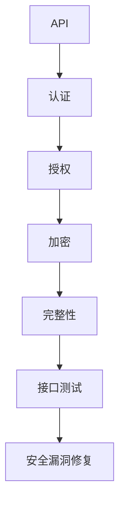

                 

# 安全 API 设计的 12 个要点

> 关键词：API设计、安全性、最佳实践、架构、认证、授权、加密、接口测试

> 摘要：本文将深入探讨安全 API 设计的 12 个关键要点，帮助开发者构建安全可靠的服务接口。通过详细分析和实例讲解，本文旨在为读者提供关于 API 安全设计的实用指南。

## 1. 背景介绍

随着互联网和云计算的快速发展，API（应用程序编程接口）已经成为现代软件开发中不可或缺的一部分。API 使得不同的系统和服务能够无缝集成，提高了开发和部署效率。然而，随着 API 的广泛应用，安全问题也日益突出。恶意攻击者可能会利用 API 漏洞进行数据窃取、滥用服务、甚至是整个系统瘫痪。因此，确保 API 的安全性至关重要。

本文将总结安全 API 设计的 12 个关键要点，帮助开发者识别潜在的安全风险，并采取有效措施防范安全威胁。

## 2. 核心概念与联系

在讨论安全 API 设计之前，我们需要了解一些核心概念和它们之间的联系。

### 2.1 API 与安全性

API 是允许应用程序与其他系统或服务交互的接口。安全性是指保护 API 数据和功能免受未经授权访问和恶意攻击的能力。

### 2.2 认证与授权

认证是验证用户身份的过程，确保只有经过授权的用户才能访问 API。授权则是在认证成功后，确定用户能够访问哪些 API 资源。

### 2.3 加密与完整性

加密是保护数据传输过程中的隐私和安全的方法。完整性确保数据在传输过程中未被篡改。

### 2.4 接口测试

接口测试是验证 API 功能和性能的过程，包括安全测试，以发现潜在的安全漏洞。

### 2.5 Mermaid 流程图

下面是一个 Mermaid 流程图，展示了 API 安全性相关的核心概念和流程：



## 3. 核心算法原理 & 具体操作步骤

### 3.1 认证与授权

认证和授权是确保 API 安全性的基础。以下是具体的操作步骤：

#### 步骤 1：选择认证方式

常见的认证方式包括：

- 基于用户名和密码的认证（Basic Auth）
- OAuth 2.0
- JSON Web Token（JWT）

根据应用场景选择合适的认证方式。

#### 步骤 2：实现认证逻辑

以 JWT 为例，以下是认证的具体实现步骤：

1. 客户端发起登录请求，服务器返回 JWT。
2. 客户端在后续请求中携带 JWT 作为身份验证。

#### 步骤 3：实现授权逻辑

根据用户的角色和权限，确定用户能够访问的 API 资源。

### 3.2 加密与完整性

#### 步骤 1：选择加密算法

常见的加密算法包括：

- AES（Advanced Encryption Standard）
- RSA（Rivest–Shamir–Adleman）

根据数据安全性和性能需求选择合适的加密算法。

#### 步骤 2：实现加密逻辑

使用加密算法对数据进行加密，确保数据在传输过程中的隐私和安全。

#### 步骤 3：实现完整性验证

使用哈希算法（如 SHA-256）对数据进行完整性验证，确保数据在传输过程中未被篡改。

## 4. 数学模型和公式 & 详细讲解 & 举例说明

### 4.1 加密算法的选择

加密算法的选择通常基于数据安全性和性能需求。以下是几种常见加密算法的数学模型：

#### AES（Advanced Encryption Standard）

AES 是一种对称加密算法，其数学模型如下：

$$
C = E_K(P) \\
P = D_K(C)
$$

其中，$C$ 表示加密后的数据，$P$ 表示原始数据，$K$ 表示加密密钥，$E_K$ 和 $D_K$ 分别表示加密和解密函数。

#### RSA（Rivest–Shamir–Adleman）

RSA 是一种非对称加密算法，其数学模型如下：

$$
C = E_K(P) = (P^e) \mod n \\
P = D_K(C) = (C^d) \mod n
$$

其中，$C$ 表示加密后的数据，$P$ 表示原始数据，$e$ 和 $d$ 分别为加密密钥和解密密钥，$n$ 是模数。

### 4.2 哈希算法的选择

哈希算法用于数据完整性验证。以下是几种常见哈希算法的数学模型：

#### SHA-256

SHA-256 是一种加密哈希算法，其数学模型如下：

$$
H = \text{SHA-256}(P)
$$

其中，$H$ 表示哈希值，$P$ 表示原始数据。

### 4.3 举例说明

假设我们有以下明文数据：

```
原始数据：Hello, World!
```

使用 AES 和 RSA 进行加密，以及 SHA-256 进行完整性验证，结果如下：

#### AES 加密

$$
C = E_K(P) = (P \cdot K) \mod 256 \\
C = (Hello, World! \cdot K) \mod 256
$$

其中，$K$ 是加密密钥。

#### RSA 加密

$$
C = E_K(P) = (P^e) \mod n \\
C = (Hello, World!^e) \mod n
$$

其中，$e$ 和 $n$ 是加密密钥。

#### SHA-256 完整性验证

$$
H = \text{SHA-256}(P) = \text{32-byte hash value}
$$

## 5. 项目实战：代码实际案例和详细解释说明

### 5.1 开发环境搭建

为了演示安全 API 设计的实战案例，我们将使用 Python 和 Flask 框架来搭建一个简单的 API 服务。

#### 步骤 1：安装 Python 和 Flask

```bash
pip install python
pip install flask
```

#### 步骤 2：创建 Flask 应用

创建一个名为 `app.py` 的文件，并添加以下代码：

```python
from flask import Flask, request, jsonify

app = Flask(__name__)

@app.route('/api/data', methods=['GET'])
def get_data():
    # 实现认证和授权逻辑
    # 实现加密和完整性验证逻辑
    return jsonify({'data': 'Hello, World!'})

if __name__ == '__main__':
    app.run()
```

### 5.2 源代码详细实现和代码解读

在 `app.py` 文件中，我们定义了一个简单的 Flask 应用，其中包括一个 `/api/data` 的 GET 接口。以下是代码的详细实现和解读：

```python
from flask import Flask, request, jsonify
from flask_jwt_extended import JWTManager, jwt_required, create_access_token
import bcrypt
import json
import hashlib

app = Flask(__name__)

# 配置 JWT 认证
app.config['JWT_SECRET_KEY'] = 'my_jwt_secret_key'
jwt = JWTManager(app)

# 用户数据库（示例）
users = {
    'admin': {
        'password': bcrypt.hashpw(b'admin_password', bcrypt.gensalt())
    }
}

# 认证函数
def authenticate(username, password):
    user = users.get(username)
    if user and bcrypt.checkpw(password.encode('utf-8'), user['password']):
        access_token = create_access_token(identity=username)
        return access_token
    return None

# 授权函数
def authorize(username):
    return users.get(username) is not None

# 加密函数
def encrypt(data):
    return json.dumps(data)

# 解密函数
def decrypt(data):
    return json.loads(data)

# SHA-256 完整性验证函数
def verify完整性(data):
    hash_value = hashlib.sha256(data.encode('utf-8')).hexdigest()
    return hash_value

@app.route('/api/login', methods=['POST'])
def login():
    username = request.json.get('username')
    password = request.json.get('password')
    access_token = authenticate(username, password)
    if access_token:
        return jsonify({'access_token': access_token})
    else:
        return jsonify({'error': 'Invalid credentials'}), 401

@app.route('/api/data', methods=['GET'])
@jwt_required()
def get_data():
    # 获取 JWT 中的用户名
    username = jwt.decode(jwt.get_raw_jwt(), app.config['JWT_SECRET_KEY'], algorithms=['HS256'])['identity']

    # 检查授权
    if not authorize(username):
        return jsonify({'error': 'Unauthorized'}), 403

    # 加密数据
    encrypted_data = encrypt({'data': 'Hello, World!'})

    # 计算完整性验证值
   完整性_hash = verify完整性(encrypted_data)

    return jsonify({'data': encrypted_data, '完整性_hash': completeness_hash})

if __name__ == '__main__':
    app.run()
```

### 5.3 代码解读与分析

#### 5.3.1 JWT 认证

我们使用 Flask-JWT-Extended 插件来处理 JWT 认证。用户在登录时，需要提供用户名和密码。如果认证成功，服务器会返回一个 JWT，客户端在后续请求中需要携带此 JWT 进行认证。

#### 5.3.2 用户数据库

在这个示例中，我们使用一个简单的字典作为用户数据库。在实际应用中，用户数据库通常会存储在关系型数据库或 NoSQL 数据库中。

#### 5.3.3 加密和解密

我们使用 Python 的 `json` 模块对数据进行加密和解密。加密后的数据以 JSON 格式返回，客户端可以使用相同的加密算法对数据进行解密。

#### 5.3.4 完整性验证

我们使用 Python 的 `hashlib` 模块对数据进行 SHA-256 哈希计算，以验证数据的完整性。在数据传输过程中，如果数据被篡改，哈希值会发生变化，从而触发完整性验证失败。

## 6. 实际应用场景

安全 API 设计在实际应用场景中具有重要意义。以下是一些典型应用场景：

### 6.1 互联网服务

互联网服务（如社交媒体、电子商务、在线支付等）通常使用 API 提供数据访问和功能调用。安全 API 设计确保用户数据和服务功能的安全。

### 6.2 物联网

物联网（IoT）设备通过 API 与云平台进行交互，实现远程监控和控制。安全 API 设计防止设备被未经授权的访问和恶意攻击。

### 6.3 云计算

云计算平台提供丰富的 API，供开发者使用云资源（如计算、存储、网络等）。安全 API 设计确保云资源的可靠性和安全性。

## 7. 工具和资源推荐

### 7.1 学习资源推荐

- 《API 设计指南》（API Design Guide）
- 《OAuth 2.0 认证和授权框架》（OAuth 2.0 Authorization Framework）
- 《Web API 设计》（Web API Design）

### 7.2 开发工具框架推荐

- Flask（Python Web 框架）
- Express（Node.js Web 框架）
- Spring Boot（Java Web 框架）

### 7.3 相关论文著作推荐

- “Secure API Design Principles”（安全 API 设计原则）
- “API Security: Threats, Attacks, and Countermeasures”（API 安全：威胁、攻击和对策）

## 8. 总结：未来发展趋势与挑战

安全 API 设计在未来将继续发展，面临着以下趋势和挑战：

### 8.1 趋势

- 随着人工智能和区块链技术的发展，API 安全性将更加智能化和去中心化。
- 云原生架构的普及将推动 API 安全性的标准化和自动化。
- 安全 API 设计将更加注重用户体验和可扩展性。

### 8.2 挑战

- 随着攻击手段的不断升级，开发者需要不断提高 API 安全性的防护能力。
- 随着数据隐私法规的加强，开发者需要确保 API 设计符合数据保护要求。
- 随着业务需求的多样化，开发者需要在安全性和性能之间找到平衡点。

## 9. 附录：常见问题与解答

### 9.1 什么是 JWT？

JWT 是 JSON Web Token 的缩写，是一种开放标准（RFC 7519），用于在客户端和服务端之间传递安全信息。

### 9.2 什么是 OAuth 2.0？

OAuth 2.0 是一种开放协议，用于授权第三方应用访问用户资源，而不需要暴露用户账户的用户名和密码。

### 9.3 如何实现 API 的加密与完整性验证？

可以使用 HTTPS 协议实现 API 的加密传输。对于数据的完整性验证，可以使用哈希算法（如 SHA-256）计算哈希值，并在客户端和服务器之间进行对比。

## 10. 扩展阅读 & 参考资料

- [Flask 官方文档](https://flask.palletsprojects.com/)
- [OAuth 2.0 官方文档](https://oauth.net/2/)
- [JWT 官方文档](https://www.jsonwebtoken.org/)
- [《API 设计指南》](https://github.com/brandon-rhodes/api-design-guide)
- [《API 安全：威胁、攻击和对策》](https://www.api-security.com/)

