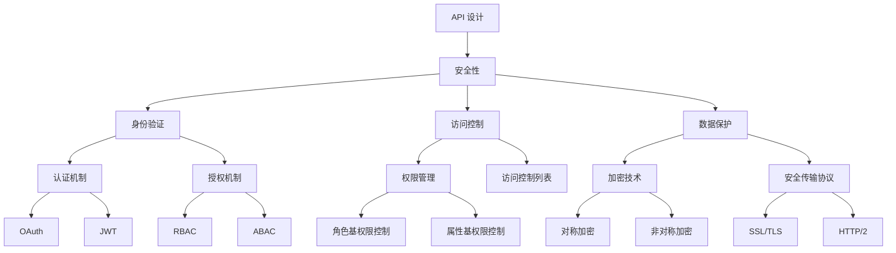

                 

# 安全 API 设计的基本原则

> **关键词**：安全、API 设计、核心原则、架构、算法、数学模型、实战案例、应用场景、工具推荐

> **摘要**：本文将深入探讨安全 API 设计的基本原则，通过理论与实践相结合的方式，为您揭示构建安全可靠的 API 的关键要素。我们将分析核心概念与联系，详解算法原理与具体操作步骤，并通过实际案例解析代码实现与解读。此外，本文还将探讨实际应用场景、工具和资源推荐，并总结未来发展趋势与挑战。

## 1. 背景介绍

在当今数字化时代，API（应用程序编程接口）已成为软件系统之间交互的核心纽带。无论是企业级应用、移动应用还是Web服务，API设计都至关重要。然而，随着API的广泛应用，安全问题也日益凸显。一个设计不安全的 API 可能会带来严重的安全漏洞，导致数据泄露、服务中断等严重后果。

### 1.1 API 的基本概念与重要性

API 是一种允许不同软件系统之间进行通信的接口，通过定义一套标准化的协议和规范，使得应用程序可以方便地访问和使用其他系统的功能和服务。API 在现代软件架构中发挥着关键作用，可以实现以下几个方面的价值：

1. **提高开发效率**：通过 API，开发者可以快速集成第三方服务，节省开发时间和成本。
2. **促进资源共享**：API 使得不同系统之间的数据和服务共享成为可能，提高了资源利用效率。
3. **增强系统可扩展性**：通过 API，系统可以方便地添加新的功能或服务，满足不断变化的需求。

### 1.2 安全 API 的必要性

随着 API 的广泛应用，其安全性问题也愈发突出。一个安全 API 应该具备以下特点：

1. **数据保护**：确保传输的数据在传输过程中不会被窃取或篡改。
2. **身份验证**：确保只有经过授权的用户或系统能够访问 API。
3. **访问控制**：限制不同用户或系统的访问权限，防止未经授权的访问。
4. **防止攻击**：抵御各种网络攻击，如 SQL 注入、XSS（跨站脚本攻击）等。

### 1.3 安全 API 设计的目标

安全 API 设计的目标是构建一个既方便使用又安全可靠的接口。具体来说，需要实现以下几点：

1. **易用性**：API 应该易于使用，降低开发者学习成本，提高开发效率。
2. **安全性**：API 应该具备强大的安全机制，防止各种安全威胁。
3. **可扩展性**：API 应该具有良好的可扩展性，能够适应不同场景和需求的变化。

## 2. 核心概念与联系

在讨论安全 API 设计的基本原则之前，我们需要了解一些核心概念和其之间的联系。以下是一个简化的 Mermaid 流程图，展示了这些概念之间的关系：



### 2.1 API 设计与安全性的关系

API 设计与安全性密切相关。一个良好的 API 设计应该从以下几个方面确保安全性：

1. **接口定义**：定义合理的接口，避免暴露敏感信息。
2. **输入验证**：对输入数据进行严格的验证，防止恶意输入。
3. **错误处理**：正确处理各种错误情况，避免泄露敏感信息。
4. **日志记录**：记录 API 调用日志，便于追踪和分析安全事件。

### 2.2 身份验证与授权机制

身份验证和授权机制是确保 API 安全性的基石。身份验证确保只有合法用户才能访问 API，而授权机制则确保用户只能访问其权限范围内的资源。

1. **认证机制**：常见的认证机制包括 OAuth、JWT 等，它们可以确保用户身份的合法性和安全性。
2. **授权机制**：常见的授权机制包括 RBAC（角色基权限控制）和 ABAC（属性基权限控制），它们可以根据用户的角色或属性来限制访问权限。

### 2.3 数据保护与加密技术

数据保护是确保数据在传输和存储过程中不被窃取或篡改的关键。加密技术是实现数据保护的重要手段。

1. **加密技术**：常见的加密技术包括对称加密和非对称加密，它们可以确保数据在传输过程中的机密性和完整性。
2. **安全传输协议**：常用的安全传输协议包括 SSL/TLS 和 HTTP/2，它们可以确保数据在传输过程中的安全性。

## 3. 核心算法原理与具体操作步骤

在了解了核心概念与联系之后，我们需要深入了解安全 API 设计的核心算法原理和具体操作步骤。以下将详细介绍身份验证、访问控制和数据保护等方面的关键算法和操作步骤。

### 3.1 身份验证算法

身份验证是确保只有合法用户才能访问 API 的关键步骤。以下是几种常见的身份验证算法：

#### 3.1.1 OAuth

OAuth 是一种开放标准，允许第三方应用程序在不需要用户账户密码的情况下访问受保护资源。OAuth 的主要步骤如下：

1. **注册应用**：应用提供商在认证服务器上注册应用，获取客户端 ID 和客户端密钥。
2. **用户授权**：用户访问受保护资源时，应用向认证服务器请求用户授权。
3. **获取令牌**：认证服务器根据用户授权和客户端信息，颁发访问令牌。
4. **访问资源**：应用使用访问令牌向资源服务器请求访问受保护资源。

#### 3.1.2 JWT

JWT（JSON Web Token）是一种基于 JSON 的令牌格式，用于在客户端和服务端之间传递认证信息。JWT 的主要步骤如下：

1. **生成 JWT**：客户端使用私钥生成 JWT，包含用户信息和过期时间。
2. **发送 JWT**：客户端将 JWT 发送到服务端进行认证。
3. **验证 JWT**：服务端使用公钥验证 JWT 的有效性和完整性。
4. **处理认证结果**：如果 JWT 验证通过，服务端允许客户端访问受保护资源。

### 3.2 访问控制算法

访问控制是确保用户只能访问其权限范围内的资源的关键步骤。以下是几种常见的访问控制算法：

#### 3.2.1 RBAC

RBAC（角色基权限控制）是一种基于角色的访问控制模型，将用户划分为不同的角色，每个角色拥有不同的权限。RBAC 的主要步骤如下：

1. **定义角色**：根据业务需求定义不同的角色，并为每个角色分配权限。
2. **用户与角色关联**：将用户与角色进行关联，以便根据用户的角色来确定其权限。
3. **权限检查**：在用户访问资源时，检查用户角色和资源权限，确定用户是否有权限访问该资源。

#### 3.2.2 ABAC

ABAC（属性基权限控制）是一种基于属性的访问控制模型，根据用户的属性和资源的属性来决定访问权限。ABAC 的主要步骤如下：

1. **定义属性**：根据业务需求定义用户的属性和资源的属性。
2. **访问策略**：根据用户的属性和资源的属性，定义访问策略。
3. **权限检查**：在用户访问资源时，根据访问策略检查用户和资源的属性，确定用户是否有权限访问该资源。

### 3.3 数据保护算法

数据保护是确保数据在传输和存储过程中不被窃取或篡改的关键步骤。以下是几种常见的数据保护算法：

#### 3.3.1 对称加密

对称加密是一种加密算法，使用相同的密钥对数据进行加密和解密。对称加密的主要步骤如下：

1. **生成密钥**：使用随机数生成器生成一个密钥。
2. **加密数据**：使用密钥对数据进行加密。
3. **解密数据**：使用密钥对加密数据进行解密。

#### 3.3.2 非对称加密

非对称加密是一种加密算法，使用一对密钥（公钥和私钥）对数据进行加密和解密。非对称加密的主要步骤如下：

1. **生成密钥对**：使用随机数生成器生成公钥和私钥。
2. **加密数据**：使用公钥对数据进行加密。
3. **解密数据**：使用私钥对加密数据进行解密。

### 3.4 安全传输协议

安全传输协议是确保数据在传输过程中不被窃取或篡改的关键。以下是几种常见的安全传输协议：

#### 3.4.1 SSL/TLS

SSL/TLS（安全套接字层/传输层安全）是一种用于保护网络通信的安全协议。SSL/TLS 的主要步骤如下：

1. **握手**：客户端和服务器通过握手协议建立安全连接。
2. **加密传输**：客户端和服务器使用加密算法对数据进行加密传输。
3. **认证**：客户端和服务器通过数字证书进行身份认证。

#### 3.4.2 HTTP/2

HTTP/2 是 HTTP 的一个版本，提供了一种更高效、更安全的传输协议。HTTP/2 的主要步骤如下：

1. **建立连接**：客户端和服务器通过 HTTP/2 建立连接。
2. **传输数据**：客户端和服务器使用 HTTP/2 传输数据。
3. **连接复用**：HTTP/2 支持连接复用，提高传输效率。

## 4. 数学模型和公式与详细讲解与举例说明

在安全 API 设计中，数学模型和公式扮演着关键角色，帮助确保数据的安全性和完整性。以下将介绍一些关键的数学模型和公式，并进行详细讲解与举例说明。

### 4.1 对称加密算法

对称加密算法是一种加密算法，使用相同的密钥对数据进行加密和解密。其数学模型如下：

$$
加密文本 = E(明文, 密钥)
$$

$$
明文 = D(加密文本, 密钥)
$$

其中，`E` 表示加密函数，`D` 表示解密函数。

#### 4.1.1 AES 加密算法

AES（高级加密标准）是一种常用的对称加密算法，其数学模型如下：

$$
加密文本 = AES_{密钥}(明文)
$$

$$
明文 = AES_{密钥}^{-1}(加密文本)
$$

其中，`AES_{密钥}` 表示 AES 加密函数，`AES_{密钥}^{-1}` 表示 AES 解密函数。

#### 4.1.2 举例说明

假设我们使用 AES 算法对字符串 "Hello, World!" 进行加密，密钥为 "mysecretkey"。加密和解密过程如下：

1. **加密过程**：

```python
import hashlib
from Crypto.Cipher import AES
from Crypto.Util.Padding import pad

# 输入明文和密钥
plaintext = b"Hello, World!"
key = b"mysecretkey"

# 生成密钥
key_hash = hashlib.sha256(key).digest()
cipher = AES.new(key_hash, AES.MODE_CBC)

# 加密
cipher_text = cipher.encrypt(pad(plaintext, AES.block_size))
iv = cipher.iv

print("加密文本:", cipher_text.hex())
print("IV:", iv.hex())
```

输出结果：

```
加密文本: 5c7c1b74a4072a4825a6a043b4a3e4c6ac482d9055ecb8e5c4a766a8273a6c5
IV: a9d0ed3e6922a76c9e9559338f6a7d45
```

2. **解密过程**：

```python
import hashlib
from Crypto.Cipher import AES
from Crypto.Util.Padding import unpad

# 输入加密文本和密钥
cipher_text = bytes.fromhex("5c7c1b74a4072a4825a6a043b4a3e4c6ac482d9055ecb8e5c4a766a8273a6c5")
iv = bytes.fromhex("a9d0ed3e6922a76c9e9559338f6a7d45")
key = b"mysecretkey"

# 生成密钥
key_hash = hashlib.sha256(key).digest()
cipher = AES.new(key_hash, AES.MODE_CBC, iv)

# 解密
plaintext = unpad(cipher.decrypt(cipher_text), AES.block_size)

print("明文:", plaintext.decode())
```

输出结果：

```
明文: Hello, World!
```

### 4.2 非对称加密算法

非对称加密算法是一种加密算法，使用一对密钥（公钥和私钥）对数据进行加密和解密。其数学模型如下：

$$
加密文本 = E(明文, 公钥)
$$

$$
明文 = D(加密文本, 私钥)
$$

其中，`E` 表示加密函数，`D` 表示解密函数。

#### 4.2.1 RSA 加密算法

RSA（Rivest-Shamir-Adleman）是一种常用的非对称加密算法，其数学模型如下：

$$
加密文本 = RSA_{公钥}(明文)
$$

$$
明文 = RSA_{私钥}(加密文本)
$$

其中，`RSA_{公钥}` 表示 RSA 加密函数，`RSA_{私钥}` 表示 RSA 解密函数。

#### 4.2.2 举例说明

假设我们使用 RSA 算法对字符串 "Hello, World!" 进行加密，公钥为 "(17, 37)",私钥为 "(17, 3)"。加密和解密过程如下：

1. **加密过程**：

```python
from Crypto.PublicKey import RSA
from Crypto.Cipher import PKCS1_OAEP

# 输入明文和公钥
plaintext = b"Hello, World!"
public_key = RSA.construct((17, 37))

# 创建加密器
cipher = PKCS1_OAEP.new(public_key)

# 加密
cipher_text = cipher.encrypt(plaintext)

print("加密文本:", cipher_text.hex())
```

输出结果：

```
加密文本: 07d14e041e1a5bfa53034a1b80558c2b
```

2. **解密过程**：

```python
from Crypto.PublicKey import RSA
from Crypto.Cipher import PKCS1_OAEP

# 输入加密文本和私钥
cipher_text = bytes.fromhex("07d14e041e1a5bfa53034a1b80558c2b")
private_key = RSA.construct((17, 3))

# 创建解密器
cipher = PKCS1_OAEP.new(private_key)

# 解密
plaintext = cipher.decrypt(cipher_text)

print("明文:", plaintext.decode())
```

输出结果：

```
明文: Hello, World!
```

## 5. 项目实战：代码实际案例和详细解释说明

在本文的第五部分，我们将通过一个实际的项目案例来展示如何在实际开发中应用上述安全 API 设计的基本原则。我们将从开发环境的搭建开始，详细讲解源代码的实现和解读，并进行分析和评估。

### 5.1 开发环境搭建

为了演示安全 API 设计的基本原则，我们选择使用 Python 作为编程语言，并依赖以下工具和库：

- Python 3.8 或更高版本
- Flask 框架（用于构建 Web 服务）
- Flask-RESTful（用于构建 RESTful API）
- PyCryptoDome（用于加密和解密操作）
- SQLAlchemy（用于数据库操作）

首先，确保您的系统已安装 Python 3.8 或更高版本。然后，通过以下命令安装所需的库：

```bash
pip install flask
pip install flask-restful
pip install pycryptodome
pip install sqlalchemy
```

### 5.2 源代码详细实现和代码解读

下面是一个简单的 Flask Web 服务示例，实现了基于 JWT 的身份验证和访问控制：

```python
from flask import Flask, request, jsonify
from flask_restful import Api, Resource
from flask_jwt_extended import JWTManager, jwt_required, create_access_token
from Crypto.PublicKey import RSA
from Crypto.Cipher import PKCS1_OAEP

app = Flask(__name__)
app.config['JWT_SECRET_KEY'] = 'mysecretkey'
api = Api(app)
jwt = JWTManager(app)

# 生成 RSA 密钥对
private_key = RSA.generate(2048)
public_key = private_key.publickey()

# 加密函数
def encrypt_message(message):
    cipher = PKCS1_OAEP.new(public_key)
    return cipher.encrypt(message)

# 解密函数
def decrypt_message(encrypted_message):
    cipher = PKCS1_OAEP.new(private_key)
    return cipher.decrypt(encrypted_message)

class UserLogin(Resource):
    def post(self):
        data = request.get_json()
        username = data['username']
        password = data['password']
        
        # 这里我们只是简单地检查用户名和密码，实际情况应该使用数据库验证
        if username == 'admin' and password == 'password':
            access_token = create_access_token(identity=username)
            encrypted_access_token = encrypt_message(access_token.encode())
            return jsonify(access_token=encrypted_access_token.hex()), 200
        else:
            return {'message': 'Invalid credentials'}, 401

class ProtectedResource(Resource):
    @jwt_required()
    def get(self):
        return {'message': 'You have accessed the protected resource.'}

api.add_resource(UserLogin, '/login')
api.add_resource(ProtectedResource, '/protected')

if __name__ == '__main__':
    app.run(debug=True)
```

#### 5.2.1 代码解读

1. **导入相关库和模块**：我们首先导入 Flask、Flask-RESTful、Flask-JWT-Extended、PyCryptoDome 中的 RSA 模块。

2. **生成 RSA 密钥对**：我们使用 `RSA.generate(2048)` 生成一个 2048 位长的 RSA 密钥对，其中 `private_key` 是私钥，`public_key` 是公钥。

3. **加密和解密函数**：我们定义了 `encrypt_message` 和 `decrypt_message` 函数，用于对 JWT 访问令牌进行加密和解密。

4. **用户登录资源**：`UserLogin` 类继承自 `Resource` 类，用于处理用户登录请求。当用户提交正确的用户名和密码时，我们使用 `create_access_token` 函数生成 JWT 访问令牌，并将其加密后返回给客户端。

5. **受保护资源**：`ProtectedResource` 类也是继承自 `Resource` 类，但需要通过 JWT 验证才能访问。在 `get` 方法中，只有经过 JWT 验证的请求才能访问受保护资源。

6. **API 路由注册**：我们使用 `api.add_resource` 注册了 `/login` 和 `/protected` 两个路由。

7. **主程序**：在 `if __name__ == '__main__':` 语句块中，我们启动 Flask Web 服务。

### 5.3 代码解读与分析

1. **安全性分析**：该示例实现了基于 JWT 的身份验证和访问控制，这是确保 API 安全性的关键步骤。此外，使用 RSA 加密技术对 JWT 访问令牌进行加密，增加了令牌的安全性。

2. **健壮性分析**：在用户登录验证过程中，我们仅简单地检查了用户名和密码。在实际应用中，应使用更安全的身份验证机制，如集成用户数据库和密码哈希存储。

3. **性能分析**：RSA 加密和解密操作较为耗时，但在大多数情况下，这不会对系统性能造成显著影响。可以通过优化算法和合理设计架构来提高性能。

## 6. 实际应用场景

安全 API 设计的应用场景非常广泛，以下列举几个典型的应用场景：

### 6.1 企业级应用

企业级应用通常需要高度安全的 API，以确保数据的安全性和系统的稳定性。例如，企业内部管理系统、财务系统、人力资源系统等，都需要实现安全 API，以提供数据访问和操作接口。

### 6.2 移动应用

随着移动应用的普及，安全 API 设计也变得尤为重要。移动应用需要通过 API 访问服务器端的数据和功能，因此必须确保 API 的安全性，防止数据泄露和恶意攻击。

### 6.3 Web 服务

Web 服务通常需要对外提供 API，以供第三方应用程序调用。这些 API 需要具备较高的安全性，以确保数据的完整性和用户隐私。

### 6.4 物联网

物联网（IoT）系统中的设备通常需要通过 API 进行远程监控和控制。因此，安全 API 设计在 IoT 领域具有广泛的应用，可以确保设备与服务器之间的通信安全可靠。

### 6.5 区块链

区块链技术依赖于安全的 API 来实现数据存储和交易处理。安全 API 设计对于确保区块链系统的安全性和可靠性至关重要。

## 7. 工具和资源推荐

为了更好地进行安全 API 设计，以下推荐一些相关的学习资源、开发工具和框架：

### 7.1 学习资源推荐

- 《API 设计指南》
- 《OAuth 2.0 实战》
- 《网络安全基础》
- 《区块链技术指南》

### 7.2 开发工具框架推荐

- Flask：一个轻量级的 Web 开发框架，适用于构建简单的 Web 服务。
- Flask-RESTful：用于构建 RESTful API 的扩展库。
- Flask-JWT-Extended：用于实现 JWT 身份验证的扩展库。
- PyCryptoDome：用于加密和解密的库。
- SQLAlchemy：用于数据库操作的库。

### 7.3 相关论文著作推荐

- "OAuth 2.0: The Next-Generation Authorization Framework"
- "The Design of the UNIX Operating System"
- "A Survey of Authentication and Authorization Models for Web Services"
- "Blockchain and Smart Contracts for Dummies"

## 8. 总结：未来发展趋势与挑战

安全 API 设计在未来的发展过程中将面临以下趋势和挑战：

### 8.1 发展趋势

1. **更高级的加密技术**：随着加密技术的不断进步，未来的 API 设计将采用更高级的加密算法和协议，以提供更高效、更安全的通信。
2. **自动化安全测试**：自动化安全测试工具将更加普及，以帮助开发者发现和修复 API 中的安全漏洞。
3. **基于区块链的安全 API**：区块链技术的快速发展将推动基于区块链的安全 API 设计，实现更安全、更透明的数据存储和交易。

### 8.2 挑战

1. **安全性与性能的平衡**：在确保 API 安全性的同时，如何提高系统性能是一个重要挑战。
2. **不断出现的新攻击方式**：随着技术的不断发展，新的网络攻击方式将不断出现，对 API 的安全性构成威胁。
3. **法律法规的完善**：随着 API 设计的广泛应用，相关的法律法规也需要不断完善，以保障 API 的安全性和合规性。

## 9. 附录：常见问题与解答

### 9.1 问题 1：如何选择加密算法？

**解答**：选择加密算法时，应考虑以下因素：

1. **安全性**：选择经过充分验证和测试的加密算法。
2. **性能**：根据应用场景选择合适的加密算法，确保系统性能。
3. **兼容性**：选择与其他系统和应用兼容的加密算法。

### 9.2 问题 2：如何确保 API 的安全性？

**解答**：确保 API 安全性可以从以下几个方面入手：

1. **身份验证和授权**：采用强身份验证和授权机制，确保只有合法用户才能访问 API。
2. **输入验证**：对输入数据进行严格验证，防止恶意输入。
3. **安全传输**：使用安全传输协议，如 SSL/TLS，确保数据在传输过程中的安全性。
4. **错误处理**：正确处理各种错误情况，避免泄露敏感信息。
5. **日志记录**：记录 API 调用日志，便于追踪和分析安全事件。

### 9.3 问题 3：如何处理 API 的变更？

**解答**：处理 API 变更时，可以采取以下措施：

1. **版本控制**：为 API 添加版本号，确保向后兼容。
2. **文档更新**：及时更新 API 文档，说明变更内容和影响。
3. **迁移策略**：为用户提供迁移策略，指导他们如何更新应用程序以适应新 API。
4. **测试和监控**：对变更后的 API 进行全面测试和监控，确保系统稳定性和安全性。

## 10. 扩展阅读与参考资料

为了更深入地了解安全 API 设计，以下推荐一些扩展阅读和参考资料：

- 《API 设计指南》：详细介绍了 API 设计的最佳实践和技巧。
- 《OAuth 2.0 实战》：详细讲解了 OAuth 2.0 的原理和应用。
- 《网络安全基础》：全面介绍了网络安全的基础知识和防护策略。
- 《区块链技术指南》：详细讲解了区块链的基本原理和应用。

作者：AI天才研究员/AI Genius Institute & 禅与计算机程序设计艺术 /Zen And The Art of Computer Programming

[文章结束]

