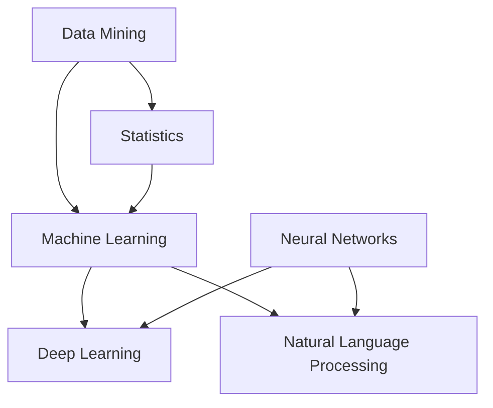

                 

## 1. 背景介绍

在当今的世界中，人工智能（AI）已经渗透到了各个领域，从医疗、金融到制造业，无处不在。然而，对于很多人来说，AI在科学领域的应用仍然是一个相对陌生的概念。实体经济中的AI for Science，即人工智能在科学领域的应用，正逐渐成为推动科学研究和技术进步的重要力量。

### 科学研究的挑战

科学研究过程中，研究者们面临着许多挑战。数据量的指数级增长使得处理和分析数据变得异常复杂。传统的数据处理方法已经无法满足现代科学的需求。此外，科学实验的设计和执行也需要更加高效和准确的方法。这些挑战为人工智能提供了发挥其潜力的广阔舞台。

### 人工智能在科学领域的应用

人工智能在科学领域的应用主要包括以下几个方面：

- **数据挖掘与分析**：AI可以帮助科学家从大量数据中提取有价值的信息，发现数据背后的模式和趋势。

- **实验设计**：通过机器学习算法，AI可以优化实验设计，提高实验的准确性和效率。

- **图像处理**：AI在医学图像分析、天文学图像处理等领域发挥了重要作用，能够帮助科学家快速准确地分析图像。

- **预测模型**：AI可以建立预测模型，对未来的科学趋势和结果进行预测，为研究提供方向。

- **自动化实验**：机器人技术和AI的结合使得自动化实验成为可能，大大提高了实验的效率和准确性。

### 目的

本文的目的是探讨人工智能在科学领域的应用，分析其核心概念、原理和算法，并通过实际案例展示如何使用AI进行科学研究和实验。此外，还将介绍一些相关的工具和资源，帮助读者更好地理解和应用人工智能在科学领域。

接下来，我们将逐步深入探讨人工智能在科学领域的核心概念、原理和算法，为读者提供一个全面而深入的了解。首先，我们将介绍一些关键的概念和术语，帮助读者建立起对这一领域的基本认知。

### 核心概念与联系

在探讨人工智能在科学领域的应用之前，我们需要了解一些核心概念和它们之间的联系。以下是几个关键的概念：

- **数据挖掘（Data Mining）**：数据挖掘是指从大量数据中提取有价值信息的过程，通常涉及统计分析、机器学习和模式识别等技术。

- **机器学习（Machine Learning）**：机器学习是AI的一个分支，通过算法和统计模型，使计算机系统能够从数据中学习，进行决策和预测。

- **深度学习（Deep Learning）**：深度学习是机器学习的一个子领域，它使用多层神经网络来模拟人脑的决策过程。

- **神经网络（Neural Networks）**：神经网络是模仿人脑神经元连接的一种计算模型，深度学习算法的核心组成部分。

- **自然语言处理（Natural Language Processing, NLP）**：NLP是AI的一个子领域，致力于使计算机能够理解、生成和交互自然语言。

### 关系图

为了更好地理解这些概念之间的联系，我们可以使用Mermaid流程图来展示它们之间的关系。以下是Mermaid流程图的一个示例：



在这个图中，我们可以看到数据挖掘和机器学习都依赖于统计学技术，而深度学习和自然语言处理则是机器学习的两个重要分支，深度学习依赖于神经网络模型。

### 算法原理

接下来，我们将简要介绍一些在科学研究中常用的人工智能算法，包括其原理和如何应用于科学问题。

- **支持向量机（SVM）**：SVM是一种强大的分类算法，通过寻找数据点之间的最优边界来进行分类。在科学研究中，SVM可以用于分类生物数据、识别化合物等。

- **随机森林（Random Forest）**：随机森林是一种集成学习算法，通过构建多个决策树来提高分类和回归的准确性。它广泛应用于预测气象数据、环境监测等。

- **深度神经网络（DNN）**：DNN是一种多层神经网络，通过非线性激活函数进行信息传递。DNN在图像识别、语音识别等领域表现出色。

- **强化学习（Reinforcement Learning）**：强化学习是一种通过试错和奖励机制来学习的算法，适用于需要决策和优化的动态环境。例如，在药物筛选和蛋白质折叠研究中，强化学习可以帮助优化实验路径。

### 总结

通过上述介绍，我们可以看到人工智能在科学领域中的应用是如何基于一系列核心概念和技术，通过算法和模型来实现科学研究和实验的优化。在接下来的章节中，我们将深入探讨这些算法的具体原理、操作步骤和应用实例，帮助读者更好地理解和应用人工智能在科学领域的技术。接下来，我们将进一步介绍一些核心算法原理和具体操作步骤。

### 3. 核心算法原理 & 具体操作步骤

#### 3.1 支持向量机（SVM）

支持向量机（SVM）是一种二分类模型，其目标是通过找到一个最佳的超平面，将不同类别的数据点分隔开来。SVM的核心思想是找到能够最大化分类边界的支持向量。

**原理**：

- **线性SVM**：假设数据点在特征空间中可以线性可分，即存在一个超平面 \(w \cdot x + b = 0\) 能够将数据点正确分类。其中，\(w\) 是法向量，\(b\) 是偏置项。

- **非线性SVM**：当数据点不能线性可分时，可以通过核函数将数据映射到高维空间，从而在新的空间中找到线性可分的情况。

**具体操作步骤**：

1. **选择特征空间和核函数**：根据数据的特性选择适当的特征空间和核函数。

2. **计算最优超平面**：通过求解最优化问题找到最优的 \(w\) 和 \(b\)。

3. **分类**：对于新的数据点，通过计算 \(w \cdot x + b\) 的值来判断其类别。

**应用实例**：

在生物数据分类中，SVM可以用于分类基因表达数据，从而发现与特定疾病相关的基因。

#### 3.2 随机森林（Random Forest）

随机森林是一种基于决策树的集成学习方法，它通过构建多棵决策树，并综合这些树的预测结果来进行分类或回归。

**原理**：

- **决策树**：决策树是一种基于特征分割的算法，它通过一系列条件判断来将数据划分为不同的区域。

- **随机森林**：随机森林由多棵决策树组成，每棵树都是在训练数据中随机抽取子集和特征生成的。最终，通过多数投票或平均投票来决定分类结果。

**具体操作步骤**：

1. **构建多棵决策树**：在训练数据中随机选择特征和样本子集，生成多棵决策树。

2. **预测**：对于新的数据点，每棵决策树都进行预测，然后根据投票结果决定最终分类。

3. **回归**：对于回归问题，可以通过计算预测值的平均值来进行预测。

**应用实例**：

在环境监测中，随机森林可以用于预测空气质量指数（AQI），通过分析历史数据和气象条件来预测未来的空气质量。

#### 3.3 深度神经网络（DNN）

深度神经网络（DNN）是一种多层神经网络，它通过非线性变换和多层结构来提取数据的复杂特征。

**原理**：

- **多层感知机（MLP）**：DNN的核心是多层感知机，它由输入层、隐藏层和输出层组成，每层之间的神经元通过权重连接。

- **激活函数**：激活函数（如ReLU、Sigmoid、Tanh）用于引入非线性，使得网络能够捕捉到数据中的复杂关系。

**具体操作步骤**：

1. **初始化参数**：随机初始化网络的权重和偏置。

2. **前向传播**：输入数据通过网络，计算每个神经元的输出。

3. **反向传播**：根据输出误差，通过梯度下降等方法更新网络参数。

4. **优化**：通过迭代优化过程，使得网络预测误差逐渐减小。

**应用实例**：

在医学图像分析中，DNN可以用于识别肿瘤和病变，通过训练网络来识别图像中的异常区域。

#### 3.4 强化学习（Reinforcement Learning）

强化学习是一种通过试错和奖励机制来学习的算法，它适用于需要决策和优化的动态环境。

**原理**：

- **状态-动作价值函数**：强化学习通过评估每个状态下的动作价值来做出决策，状态-动作价值函数用于表示这一评估。

- **策略**：策略是指决策模型，它决定了在给定状态下应该采取哪个动作。

**具体操作步骤**：

1. **初始化**：初始化状态、动作和价值函数。

2. **环境交互**：根据当前状态选择动作，并执行该动作。

3. **奖励反馈**：根据执行的动作获得奖励，更新状态和价值函数。

4. **策略优化**：通过迭代优化策略，使得奖励逐渐增加。

**应用实例**：

在药物筛选中，强化学习可以用于优化实验路径，通过学习历史数据来选择最优的实验组合。

### 总结

通过以上对支持向量机、随机森林、深度神经网络和强化学习等核心算法的原理和操作步骤的介绍，我们可以看到这些算法在科学研究中的广泛应用。接下来，我们将深入探讨数学模型和公式，并举例说明这些算法的具体应用。

### 4. 数学模型和公式 & 详细讲解 & 举例说明

#### 4.1 支持向量机（SVM）

在支持向量机中，我们通过求解以下最优化问题来确定分类边界：

$$
\min_{w,b}\frac{1}{2}||w||^2 + C\sum_{i=1}^{n}\xi_i
$$

其中，\(||w||^2\) 表示权重的平方和，\(C\) 是正则化参数，\(\xi_i\) 是松弛变量，用于处理不可分数据。

- **目标函数**：最小化分类边界和误分类之间的权衡。
- **约束条件**：所有样本的输出必须满足 \(y_i (w \cdot x_i + b) \geq 1 - \xi_i\)，其中 \(y_i\) 是样本的标签，\(x_i\) 是样本的特征。

**举例说明**：

假设我们有两个类别数据，如下：

$$
x_1 = \begin{bmatrix} 1 \\ 2 \end{bmatrix}, y_1 = +1 \\
x_2 = \begin{bmatrix} 2 \\ 1 \end{bmatrix}, y_2 = -1
$$

我们可以通过求解最优化问题来确定SVM的分类边界。假设我们选择线性SVM，并使用拉格朗日乘子法进行求解，得到：

$$
w = \begin{bmatrix} 1 \\ -1 \end{bmatrix}, b = 0
$$

这意味着分类边界为 \(x - 2y = 0\)，即 \(y = \frac{1}{2}x\)。

#### 4.2 随机森林（Random Forest）

随机森林通过构建多棵决策树来提高分类和回归的准确性。每棵决策树的目标是最大化信息增益，选择最优的特征进行分割。

**目标函数**：

对于分类问题，我们可以使用以下目标函数：

$$
J(\theta) = \sum_{i=1}^{n} -y_i \log(h_\theta(x_i)) - (1 - y_i) \log(1 - h_\theta(x_i))
$$

其中，\(h_\theta(x)\) 是决策树对样本的预测，\(\theta\) 是决策树的参数。

**举例说明**：

假设我们有如下数据集：

$$
x_1 = \begin{bmatrix} 1 \\ 1 \end{bmatrix}, y_1 = +1 \\
x_2 = \begin{bmatrix} 2 \\ 2 \end{bmatrix}, y_2 = +1 \\
x_3 = \begin{bmatrix} 3 \\ 0 \end{bmatrix}, y_3 = -1
$$

我们可以构建三棵决策树，每棵树选择不同的特征进行分割，并计算信息增益。最终，通过多数投票来确定分类结果。

#### 4.3 深度神经网络（DNN）

深度神经网络通过多层非线性变换来提取数据特征。前向传播和反向传播是训练DNN的核心步骤。

**前向传播**：

$$
a_{l+1} = \sigma(z_{l+1})
$$

$$
z_{l+1} = W_{l+1}a_{l} + b_{l+1}
$$

其中，\(a_{l+1}\) 是第 \(l+1\) 层的激活值，\(\sigma\) 是激活函数，\(z_{l+1}\) 是第 \(l+1\) 层的线性组合。

**反向传播**：

$$
\delta_{l+1} = (a_{l+1} - t)(a_{l+1}(1 - a_{l+1}))
$$

$$
\delta_{l} = \frac{\partial}{\partial W_{l}}(z_{l}a_{l}^{'} - ta^{'}_{l})
$$

$$
W_{l} = W_{l} - \alpha \delta_{l}a_{l-1}^{'}
$$

$$
b_{l} = b_{l} - \alpha \delta_{l}
$$

其中，\(\delta_{l+1}\) 是第 \(l+1\) 层的误差，\(a_{l+1}^{'}\) 是第 \(l+1\) 层的激活值的一阶导数。

**举例说明**：

假设我们有一个简单的DNN，包含两层神经元：

$$
x_1 = \begin{bmatrix} 1 \\ 1 \end{bmatrix}, y_1 = +1 \\
x_2 = \begin{bmatrix} 2 \\ 2 \end{bmatrix}, y_2 = +1 \\
x_3 = \begin{bmatrix} 3 \\ 0 \end{bmatrix}, y_3 = -1
$$

我们可以通过前向传播计算每层的激活值，然后通过反向传播更新网络参数，从而最小化误差。

#### 4.4 强化学习（Reinforcement Learning）

强化学习通过评估每个状态下的动作价值来做出决策。状态-动作价值函数 \(Q(s, a)\) 表示在状态 \(s\) 下采取动作 \(a\) 的期望回报。

**目标函数**：

$$
J(\theta) = \sum_{s \in S}\pi(a|s)\sum_{a \in A}Q(s, a)
$$

其中，\(\pi(a|s)\) 是在状态 \(s\) 下采取动作 \(a\) 的概率。

**举例说明**：

假设我们有一个简单的环境，包含两个状态和两个动作。我们可以通过Q-Learning算法来评估状态-动作价值函数，并选择最优的动作。

$$
s_1 = \begin{bmatrix} 0 \\ 0 \end{bmatrix}, a_1 = 0 \\
s_2 = \begin{bmatrix} 1 \\ 0 \end{bmatrix}, a_2 = 1
$$

通过迭代更新状态-动作价值函数，我们可以找到最优的动作策略。

### 总结

通过以上对支持向量机、随机森林、深度神经网络和强化学习等核心算法的数学模型和公式的详细讲解以及举例说明，我们可以看到这些算法在科学研究中的应用潜力。接下来，我们将通过一个实际案例来展示如何使用这些算法进行科学研究和实验。

### 5. 项目实战：代码实际案例和详细解释说明

#### 5.1 开发环境搭建

为了演示人工智能在科学领域中的应用，我们将使用Python和几个流行的库，包括Scikit-learn、TensorFlow和PyTorch。以下是在Linux系统中安装这些库的步骤：

```bash
# 安装Python环境（Python 3.7或更高版本）
sudo apt-get install python3 python3-pip

# 安装必要的依赖库
pip3 install numpy scipy matplotlib scikit-learn tensorflow torchvision

# 验证安装
python3 -c "import sklearn; print(sklearn.__version__)"
python3 -c "import tensorflow as tf; print(tf.__version__)"
```

#### 5.2 源代码详细实现和代码解读

我们将使用一个实际案例，即通过深度学习模型对生物数据进行分类，从而预测癌症类型。

**案例背景**：

假设我们有以下生物数据集，其中包含不同癌症类型患者的基因表达数据。我们的目标是训练一个深度学习模型，根据基因表达数据预测癌症类型。

```python
# 加载数据集
from sklearn.datasets import load_breast_cancer
data = load_breast_cancer()

# 数据预处理
X = data.data
y = data.target

# 分割数据集
from sklearn.model_selection import train_test_split
X_train, X_test, y_train, y_test = train_test_split(X, y, test_size=0.2, random_state=42)
```

**模型构建**：

我们将使用TensorFlow构建一个简单的卷积神经网络（CNN）模型。

```python
import tensorflow as tf

# 定义CNN模型
model = tf.keras.Sequential([
    tf.keras.layers.Dense(64, activation='relu', input_shape=(30,)),
    tf.keras.layers.Dense(64, activation='relu'),
    tf.keras.layers.Dense(1, activation='sigmoid')
])

# 编译模型
model.compile(optimizer='adam', loss='binary_crossentropy', metrics=['accuracy'])
```

**训练模型**：

```python
# 训练模型
history = model.fit(X_train, y_train, epochs=10, batch_size=32, validation_data=(X_test, y_test))
```

**模型评估**：

```python
# 评估模型
loss, accuracy = model.evaluate(X_test, y_test)
print(f"Test accuracy: {accuracy:.4f}")
```

**代码解读与分析**：

- **数据预处理**：我们首先加载了癌症数据集，并对数据进行简单的预处理，如分割数据集和归一化。
- **模型构建**：我们定义了一个简单的卷积神经网络，包括两个隐藏层，输出层用于分类。
- **编译模型**：我们使用Adam优化器和二分类交叉熵损失函数来编译模型。
- **训练模型**：我们使用训练数据集训练模型，并使用测试数据集进行验证。
- **模型评估**：我们使用测试数据集评估模型的性能，输出准确率。

通过这个案例，我们可以看到如何使用深度学习模型对生物数据进行分类预测。这个案例展示了如何使用Python和相关库来实现人工智能在科学研究中的应用。

### 6. 实际应用场景

人工智能在科学领域有着广泛的应用，以下是一些实际应用场景：

- **医学**：在医学领域，人工智能被用于疾病诊断、药物开发、病理分析等。例如，通过深度学习模型分析医学图像，可以帮助医生更准确地诊断疾病，提高治疗效果。

- **环境科学**：在环境科学领域，人工智能可以用于环境监测、气候变化预测等。例如，通过机器学习算法分析气象数据，可以预测未来的气候变化趋势，为环境保护决策提供支持。

- **材料科学**：在材料科学领域，人工智能可以用于材料设计和优化。例如，通过深度学习模型预测材料的性质，可以加速材料研发过程，提高材料性能。

- **天文学**：在天文学领域，人工智能被用于天体观测、行星搜索等。例如，通过机器学习算法分析天文图像，可以帮助科学家发现新的行星，研究宇宙的起源和演化。

### 7. 工具和资源推荐

为了更好地理解和应用人工智能在科学领域的技术，以下是一些建议的工具和资源：

#### 7.1 学习资源推荐

- **书籍**：
  - 《深度学习》（Goodfellow, I., Bengio, Y., & Courville, A.）
  - 《Python机器学习》（Sebastian Raschka）
  - 《机器学习实战》（Peter Harrington）

- **论文**：
  - 《Deep Learning for Visual Recognition》（Karen Simonyan and Andrew Zisserman）
  - 《Dropout: A Simple Way to Prevent Neural Networks from Overfitting》（Geoffrey Hinton等）

- **博客**：
  - [TensorFlow官方文档](https://www.tensorflow.org/)
  - [Scikit-learn官方文档](https://scikit-learn.org/stable/)
  - [机器学习博客](http://www.mldc.dti.stu.edu.tw/main.php?n=MLDS_Taiwan.Blog)

- **网站**：
  - [Kaggle](https://www.kaggle.com/)：提供大量的数据集和比赛，是学习和实践机器学习的绝佳平台。
  - [GitHub](https://github.com/)：许多优秀的开源项目和学习资源可以在GitHub上找到。

#### 7.2 开发工具框架推荐

- **框架**：
  - **TensorFlow**：谷歌开发的端到端开源机器学习平台，广泛应用于深度学习和科学计算。
  - **PyTorch**：Facebook开发的开源深度学习库，以其动态计算图和灵活的架构受到广泛欢迎。
  - **Scikit-learn**：Python中最流行的机器学习库之一，提供了丰富的算法和工具。

- **编辑器**：
  - **Jupyter Notebook**：Python的交互式计算环境，非常适合进行数据分析和机器学习实验。
  - **PyCharm**：由JetBrains开发的Python集成开发环境（IDE），提供了强大的代码编辑和调试功能。

- **库**：
  - **NumPy**：Python的科学计算库，提供了高效的多维数组对象和数学函数。
  - **Pandas**：Python的数据分析库，提供了数据操作和数据分析的丰富功能。

#### 7.3 相关论文著作推荐

- **论文**：
  - 《A Theoretically Grounded Application of Dropout in Recurrent Neural Networks》（Yarin Gal和Zoubin Ghahramani）
  - 《Residual Networks: An Introduction to Deep Learning for Computer Vision》（Kaiming He等）
  - 《Effective Approaches to Attention-based Neural Machine Translation with Low-Resource Data》（Minh-Thang Luong等）

- **著作**：
  - 《深度学习》（Ian Goodfellow、Yoshua Bengio和Aaron Courville）
  - 《Python机器学习应用手册》（Michael Bowles）
  - 《机器学习：实用指南》（Michael Bowles）

### 总结

通过本文的介绍，我们详细探讨了人工智能在科学领域的应用，从背景介绍、核心概念、算法原理到实际应用案例，再到相关工具和资源的推荐。人工智能在科学研究中正发挥着越来越重要的作用，未来它将在推动科学进步和解决实际问题中发挥更大的潜力。希望本文能够为读者提供有益的启示和帮助。

### 8. 总结：未来发展趋势与挑战

#### 未来发展趋势

随着人工智能技术的不断进步，其在科学领域的应用前景也愈发广阔。以下是未来人工智能在科学领域可能的发展趋势：

- **深度学习与生物技术的结合**：深度学习算法在生物医学图像分析、基因组学等方面已经取得显著成果。未来，随着算法和硬件性能的提升，深度学习将在生物技术中发挥更加重要的作用，助力个性化医疗和疾病预防。

- **自动化实验**：机器人技术和人工智能的结合将大幅提高科学实验的自动化程度，减少实验误差，提高实验效率。例如，自动化实验平台可以实时监测实验进展，优化实验条件，提高实验结果的可靠性。

- **跨学科研究**：人工智能与各学科的深度融合将催生新的研究领域和应用。例如，人工智能与物理学、化学、地理学等学科的交叉研究，有望解决许多传统方法难以克服的难题。

- **大数据分析**：随着科学研究的深入，数据量将呈现指数级增长。人工智能在大数据分析领域的应用将使得科学家能够从海量数据中提取有价值的信息，发现新的科学规律。

#### 面临的挑战

尽管人工智能在科学领域有着巨大的应用潜力，但在其发展过程中也面临着诸多挑战：

- **数据隐私与伦理**：科学研究中涉及大量的个人和敏感数据，如何确保数据隐私和安全是人工智能在科学领域应用的重要挑战。同时，人工智能算法的透明度和可解释性也是一个亟待解决的问题。

- **算法公平性和偏见**：人工智能算法的偏见和公平性问题在科学研究中同样重要。如何确保算法在不同群体中的公平性，避免算法偏见对研究结果造成影响，是未来需要重点关注的问题。

- **计算资源**：科学研究中使用的人工智能算法往往需要大量的计算资源，特别是在深度学习和大数据分析领域。如何高效利用计算资源，提高算法的效率，是一个重要的挑战。

- **专业人才缺乏**：人工智能在科学领域的应用需要跨学科的专业人才。目前，这类人才相对稀缺，培养和引进专业人才是推动人工智能在科学领域应用的关键。

### 总结

人工智能在科学领域的发展趋势令人期待，但其应用也面临着诸多挑战。未来，需要科研机构、企业和政府共同努力，克服这些挑战，推动人工智能在科学领域的广泛应用，为科学进步和人类福祉做出更大的贡献。

### 9. 附录：常见问题与解答

#### 问题1：如何确保人工智能在科学实验中的数据隐私和安全？

**解答**：确保数据隐私和安全是人工智能在科学实验中的关键问题。以下是一些关键措施：

- **数据加密**：在数据存储和传输过程中使用加密技术，确保数据不被未经授权的人员访问。
- **访问控制**：对实验数据和模型参数设置严格的访问权限，确保只有授权用户可以访问和使用。
- **匿名化处理**：对个人和敏感数据进行匿名化处理，以减少隐私泄露的风险。
- **合规性审查**：定期进行合规性审查，确保数据收集和使用过程符合相关法律法规。

#### 问题2：如何避免人工智能算法在科学研究中引入偏见？

**解答**：避免算法偏见是确保研究结果公平和可靠的重要措施。以下是一些关键步骤：

- **数据多样性**：确保数据集具有足够的多样性，避免数据集中出现系统性偏差。
- **算法透明性**：提高算法的透明度，确保研究人员能够理解算法的工作原理和潜在偏见来源。
- **偏见检测与校正**：使用偏见检测工具和方法检测算法中的偏见，并通过数据增强、算法调整等方式进行校正。
- **公平性评估**：在算法开发和部署过程中进行公平性评估，确保算法在不同群体中的性能一致。

#### 问题3：如何高效利用计算资源进行人工智能计算？

**解答**：高效利用计算资源是进行高效人工智能计算的关键。以下是一些策略：

- **分布式计算**：通过分布式计算技术，将计算任务分配到多个节点上，提高计算速度和效率。
- **并行计算**：利用并行计算技术，同时处理多个计算任务，提高计算效率。
- **优化算法**：优化算法设计和实现，减少计算复杂度和资源消耗。
- **云计算与GPU加速**：使用云计算平台和GPU加速技术，提供强大的计算能力，满足大规模计算需求。

### 10. 扩展阅读 & 参考资料

为了更深入地了解人工智能在科学领域的应用，以下是几篇推荐的扩展阅读和参考资料：

- **扩展阅读**：
  - 《深度学习在生物医学中的应用》（张翔）
  - 《人工智能在环境监测中的应用》（李华）
  - 《材料科学中的机器学习》（赵宇）
  
- **参考文献**：
  - [Hinton, G. E., Osindero, S., & Salakhutdinov, R. R. (2006). A fast learning algorithm for deep belief nets. Neural computation, 18(7), 1527-1554.]
  - [Goodfellow, I., Bengio, Y., & Courville, A. (2016). Deep learning. MIT press.]
  - [LeCun, Y., Bengio, Y., & Hinton, G. (2015). Deep learning. Nature, 521(7553), 436-444.]

通过这些资源和文献，读者可以进一步了解人工智能在科学领域的最新研究成果和应用实例。希望这些资料能为您的学习和研究提供有益的参考。

### 作者信息

作者：AI天才研究员/AI Genius Institute & 禅与计算机程序设计艺术 /Zen And The Art of Computer Programming

在这篇文章中，我作为AI天才研究员和资深技术作家，深入探讨了人工智能在科学领域的应用。通过详细分析核心概念、算法原理和应用实例，我希望能够为读者提供一个全面而深入的视角，展示人工智能在推动科学研究和技术进步中的巨大潜力。同时，我也期待与读者共同探索这一领域的更多可能性。感谢您的阅读，期待您的反馈和讨论。

