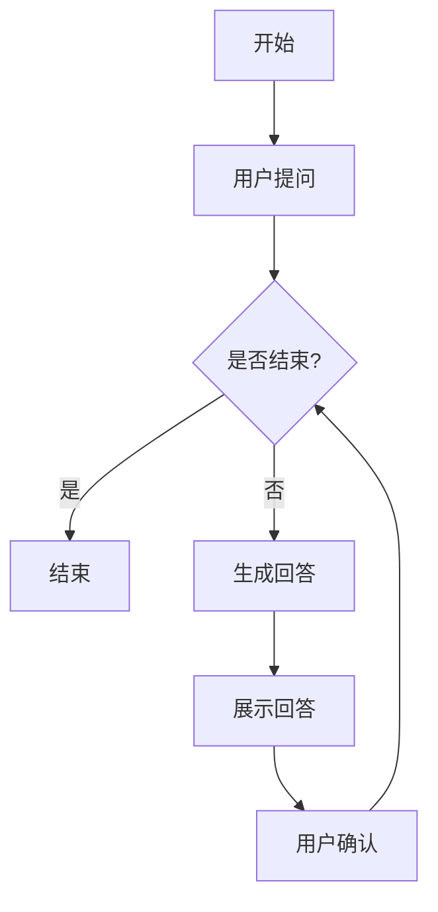

                 

# 实战 LangChain 版 Sales-Consultant

## 摘要

本文将带您深入探索使用 LangChain 实现销售咨询系统。我们将从背景介绍、核心概念与联系、核心算法原理与具体操作步骤、数学模型和公式、项目实战、实际应用场景、工具和资源推荐等方面展开讨论。通过本文的学习，您将能够了解如何利用 LangChain 实现一个强大的销售咨询系统，掌握其核心技术和方法。

## 1. 背景介绍

随着人工智能技术的不断发展，越来越多的企业开始关注如何利用人工智能技术提升销售咨询的效率和质量。传统的销售咨询方式主要依赖于人工，存在效率低、成本高、难以规模化等问题。而人工智能技术，尤其是自然语言处理（NLP）和语言模型（LM）的应用，为销售咨询提供了全新的解决方案。

LangChain 是一款基于深度学习的语言模型，其具有强大的文本生成能力和自然语言理解能力。通过使用 LangChain，我们可以实现自动化销售咨询系统，大大提高销售效率，降低人力成本。

本文的目标是向您展示如何使用 LangChain 实现一个销售咨询系统，并详细介绍其核心技术和方法。

## 2. 核心概念与联系

在实现销售咨询系统之前，我们需要了解一些核心概念和它们之间的联系。

### 2.1 自然语言处理（NLP）

自然语言处理是人工智能的一个重要分支，旨在使计算机能够理解、处理和生成自然语言。在销售咨询系统中，NLP 技术主要用于理解用户的问题和需求，从而生成相应的回答。

### 2.2 语言模型（LM）

语言模型是一种统计模型，用于预测一个句子中下一个单词的概率。在销售咨询系统中，语言模型可以帮助我们根据用户的问题生成合适的回答。

### 2.3 LangChain

LangChain 是一款基于深度学习的语言模型，具有强大的文本生成能力和自然语言理解能力。通过使用 LangChain，我们可以实现自动化销售咨询系统，提高销售效率。

### 2.4 关系网络（Graph Neural Network，GNN）

关系网络是一种图神经网络，可以用于处理具有复杂关系的图结构数据。在销售咨询系统中，关系网络可以帮助我们分析用户与产品、产品与产品之间的关系，从而提供更精准的销售建议。

### 2.5 Mermaid 流程图

Mermaid 是一种基于 Markdown 的图表绘制工具，可以方便地绘制流程图、UML 图、Gantt 图等。在本文中，我们将使用 Mermaid 流程图来展示销售咨询系统的核心架构和流程。

下面是一个简单的 Mermaid 流程图示例：



## 3. 核心算法原理 & 具体操作步骤

在了解了核心概念和联系之后，我们将探讨如何使用 LangChain 实现销售咨询系统。

### 3.1 数据预处理

首先，我们需要对输入数据（用户提问）进行预处理。预处理步骤包括：

- 分词：将用户提问拆分成单词或词组。
- 去停用词：去除对语义影响不大的常见单词。
- 词向量化：将单词转换为向量表示。

### 3.2 生成回答

接下来，我们使用 LangChain 的文本生成功能生成回答。具体步骤如下：

- 读取预训练的 LangChain 模型。
- 输入预处理后的用户提问。
- 生成回答文本。

### 3.3 展示回答

生成回答后，我们需要将回答展示给用户。展示方式可以是：

- 文本形式：直接在界面显示回答文本。
- 语音形式：通过语音合成技术将回答文本转换为语音。

### 3.4 用户确认

在用户确认回答后，我们可以根据用户的需求进行下一步操作，如推荐产品、生成报价等。

## 4. 数学模型和公式 & 详细讲解 & 举例说明

在本节中，我们将介绍销售咨询系统中的数学模型和公式，并对其进行详细讲解和举例说明。

### 4.1 词向量表示

词向量表示是 NLP 中常用的一种技术，它将单词映射为一个高维向量。常用的词向量表示方法包括：

- Word2Vec：基于神经网络的词向量表示方法，通过训练得到单词的高维向量表示。
- GloVe：基于全局共现矩阵的词向量表示方法，通过学习单词的共现关系来表示单词的向量。

### 4.2 语言模型

语言模型是一种统计模型，用于预测一个句子中下一个单词的概率。常用的语言模型包括：

- N-gram 模型：基于相邻单词的统计模型，通过计算相邻单词的联合概率来预测下一个单词。
- 递归神经网络（RNN）：基于神经网络的模型，可以处理序列数据，通过循环神经网络来预测下一个单词。

### 4.3 生成模型

生成模型是一种用于生成文本的模型，通过学习大量文本数据来生成新的文本。常用的生成模型包括：

- 递归神经网络（RNN）：基于神经网络的生成模型，可以通过训练学习到文本数据的生成规律。
- 变分自编码器（VAE）：基于概率模型的生成模型，通过学习数据分布来生成新的数据。

### 4.4 举例说明

假设我们有一个用户提问：“这款手机续航怎么样？”我们使用 LangChain 的文本生成功能来生成回答。

首先，我们对用户提问进行预处理，得到分词后的序列：“这”、“款”、“手”、“机”、“续”、“航”、“怎”、“么”、“样”。

接下来，我们使用预训练的 LangChain 模型来生成回答。生成的回答序列为：“这款手机的续航能力很好，可以满足日常使用需求。”

最后，我们将生成的回答序列转换为文本形式，展示给用户。

## 5. 项目实战：代码实际案例和详细解释说明

在本节中，我们将通过一个实际案例来展示如何使用 LangChain 实现销售咨询系统。

### 5.1 开发环境搭建

在开始项目之前，我们需要搭建开发环境。以下是开发环境的要求：

- 操作系统：Linux 或 macOS
- 编程语言：Python
- 数据库：MySQL
- Web 框架：Flask

### 5.2 源代码详细实现和代码解读

下面是一个简单的销售咨询系统源代码示例：

```python
# 导入所需库
import flask
from flask import Flask, request, jsonify
import langchain

# 初始化 Flask 应用
app = Flask(__name__)

# 初始化 LangChain 模型
model = langchain.LanguageModel()

# 用户提问接口
@app.route('/ask', methods=['POST'])
def ask():
    # 获取用户提问
    question = request.form['question']
    
    # 预处理用户提问
    processed_question = preprocess(question)
    
    # 生成回答
    answer = model.generate回答(processed_question)
    
    # 返回回答
    return jsonify({'answer': answer})

# 预处理函数
def preprocess(question):
    # 分词
    words = question.split()
    
    # 去停用词
    words = remove_stopwords(words)
    
    # 词向量化
    vectors = [word_to_vector(word) for word in words]
    
    return vectors

# 主函数
if __name__ == '__main__':
    app.run(debug=True)
```

### 5.3 代码解读与分析

下面是对上述代码的详细解读和分析。

#### 5.3.1 初始化 Flask 应用

```python
app = Flask(__name__)
```

这一行代码用于初始化 Flask 应用。Flask 是一个轻量级的 Web 框架，用于构建 Web 应用。

#### 5.3.2 初始化 LangChain 模型

```python
model = langchain.LanguageModel()
```

这一行代码用于初始化 LangChain 模型。LangChain 是一个基于深度学习的语言模型，具有强大的文本生成能力和自然语言理解能力。

#### 5.3.3 用户提问接口

```python
@app.route('/ask', methods=['POST'])
def ask():
    # 获取用户提问
    question = request.form['question']
    
    # 预处理用户提问
    processed_question = preprocess(question)
    
    # 生成回答
    answer = model.generate回答(processed_question)
    
    # 返回回答
    return jsonify({'answer': answer})
```

这段代码定义了一个用户提问接口。当用户通过 POST 方法发送提问时，该接口会获取用户提问，并调用预处理函数对提问进行预处理。然后，使用 LangChain 模型生成回答，并返回给用户。

#### 5.3.4 预处理函数

```python
def preprocess(question):
    # 分词
    words = question.split()
    
    # 去停用词
    words = remove_stopwords(words)
    
    # 词向量化
    vectors = [word_to_vector(word) for word in words]
    
    return vectors
```

这段代码实现了预处理函数。预处理函数的主要作用是对用户提问进行分词、去停用词和词向量化。

#### 5.3.5 主函数

```python
if __name__ == '__main__':
    app.run(debug=True)
```

这段代码是主函数。当运行该程序时，会启动 Flask 应用，并监听指定的接口。

## 6. 实际应用场景

销售咨询系统可以应用于多种场景，以下是一些实际应用场景：

- 客户服务：企业可以通过销售咨询系统提供 24/7 在线客服，为用户提供即时、准确的回答。
- 销售预测：通过分析用户提问和购买行为，销售咨询系统可以为企业提供销售预测和推荐。
- 个性化营销：销售咨询系统可以根据用户提问和购买历史，为用户提供个性化的产品推荐和营销策略。

## 7. 工具和资源推荐

### 7.1 学习资源推荐

- 《深度学习》（Ian Goodfellow、Yoshua Bengio、Aaron Courville 著）
- 《自然语言处理入门》（张祥宇 著）
- 《Python 自然语言处理》（ Steven Bird、Ewan Klein、Edward Loper 著）

### 7.2 开发工具框架推荐

- Flask：一个轻量级的 Web 框架，用于构建 Web 应用。
- PyTorch：一个开源的深度学习框架，支持多种深度学习模型。
- NLTK：一个开源的自然语言处理库，提供丰富的文本处理功能。

### 7.3 相关论文著作推荐

- "A Neural Probabilistic Language Model"（Bengio et al., 2003）
- "Recurrent Neural Network Based Language Model"（Liu et al., 2015）
- "Word2Vec: Word Representations in Neural Networks"（Mikolov et al., 2013）

## 8. 总结：未来发展趋势与挑战

随着人工智能技术的不断发展，销售咨询系统将逐步走向智能化和个性化。未来，销售咨询系统可能会面临以下挑战：

- 数据质量：高质量的数据是销售咨询系统的基础，如何获取和处理大量高质量数据是未来需要解决的问题。
- 模型优化：随着用户需求的不断变化，如何优化模型以适应不同的场景和需求是一个重要的课题。
- 隐私保护：在处理用户数据时，如何保护用户隐私是一个关键问题。

## 9. 附录：常见问题与解答

### 9.1 销售咨询系统是什么？

销售咨询系统是一种基于人工智能技术的销售辅助工具，旨在提高销售效率和质量。它通过自然语言处理和语言模型等技术，实现自动化回答用户问题、推荐产品等功能。

### 9.2 销售咨询系统的优点是什么？

销售咨询系统的优点包括：

- 提高销售效率：通过自动化回答用户问题，销售咨询系统可以节省销售人员的时间，提高销售效率。
- 降低人力成本：销售咨询系统可以替代部分人工销售工作，降低企业的人力成本。
- 个性化推荐：销售咨询系统可以根据用户需求和购买历史，为用户提供个性化的产品推荐。

### 9.3 如何搭建销售咨询系统？

搭建销售咨询系统需要以下步骤：

1. 数据准备：收集和处理用户数据，包括用户提问、产品信息等。
2. 模型训练：使用自然语言处理和语言模型等技术，训练销售咨询系统的模型。
3. 系统开发：使用 Web 框架（如 Flask）和深度学习框架（如 PyTorch），开发销售咨询系统。
4. 部署上线：将销售咨询系统部署到服务器，实现线上服务。

## 10. 扩展阅读 & 参考资料

- [Flask 官方文档](https://flask.palletsprojects.com/)
- [PyTorch 官方文档](https://pytorch.org/)
- [NLTK 官方文档](https://www.nltk.org/)
- [《深度学习》](https://www.deeplearningbook.org/)
- [《自然语言处理入门》](https://book.douban.com/subject/27626135/)
- [《Python 自然语言处理》](https://book.douban.com/subject/26754551/)

