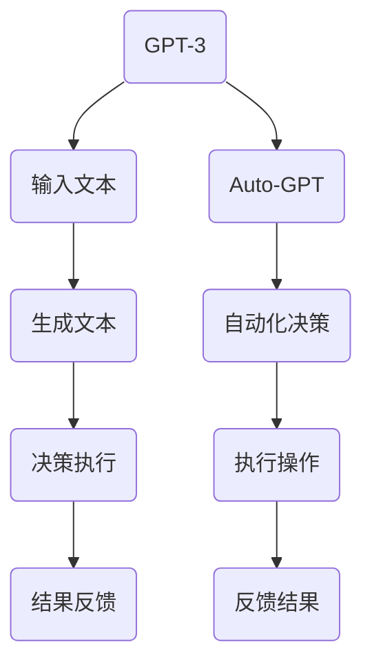

                 

# 实战四：手把手带你实现网红项目 Auto-GPT

## 关键词
- Auto-GPT
- 人工智能
- GPT-3
- 网红项目
- 实战教程

## 摘要
本文将手把手带领读者实现一个名为 Auto-GPT 的网红项目。我们将深入探讨 Auto-GPT 的核心概念、算法原理，并通过实际代码案例详细解释其实现过程。文章还包括了数学模型和公式、应用场景、工具推荐等内容，旨在帮助读者全面了解并掌握这一前沿技术。

## 1. 背景介绍

在近年来，人工智能领域取得了巨大的进展，特别是自然语言处理（NLP）方面的突破。OpenAI 推出的 GPT-3 模型凭借其强大的文本生成能力，成为全球关注的焦点。然而，尽管 GPT-3 的表现令人惊叹，但其应用仍然受到一定的限制。Auto-GPT 应运而生，它是一种利用 GPT-3 模型实现自动化决策和执行的新兴技术。Auto-GPT 的出现，使得人工智能在更广泛的场景中得以应用，为各个行业带来了新的机遇。

## 2. 核心概念与联系

### 2.1 GPT-3

GPT-3 是一种基于 Transformer 架构的预训练语言模型，由 OpenAI 于 2020 年推出。它拥有超过 1750 亿个参数，是当时最大的语言模型。GPT-3 的强大之处在于其能够生成连贯、有逻辑的文本，不仅适用于文本生成，还可以用于问答系统、机器翻译、文本摘要等多种任务。

### 2.2 Auto-GPT

Auto-GPT 是一个开源项目，旨在利用 GPT-3 模型实现自动化决策和执行。Auto-GPT 的核心思想是将 GPT-3 作为生成式模型，通过其生成的文本进行推理和决策，从而实现自动化操作。Auto-GPT 的出现，使得 GPT-3 的应用范围得到了极大的扩展。

### 2.3 Mermaid 流程图

下面是一个简化的 Mermaid 流程图，展示了 GPT-3 和 Auto-GPT 的基本架构和联系。



## 3. 核心算法原理 & 具体操作步骤

### 3.1 GPT-3 模型原理

GPT-3 模型采用 Transformer 架构，其核心思想是通过对大量文本数据进行预训练，使得模型能够捕捉到文本的语义和语法结构。具体来说，GPT-3 模型通过自注意力机制（Self-Attention）来计算每个词与其他词之间的关系，从而生成连贯的文本。

### 3.2 Auto-GPT 实现步骤

#### 步骤 1：搭建环境

首先，我们需要搭建一个运行 Auto-GPT 的环境。以下是搭建环境的基本步骤：

1. 安装 Python 3.8 或更高版本。
2. 安装 necessary libraries，例如 `transformers`、`torch` 等。

```bash
pip install transformers torch
```

#### 步骤 2：导入库

接下来，我们需要导入必要的库。

```python
import os
import openai
import json
import torch
from transformers import GPT2LMHeadModel, GPT2Tokenizer
```

#### 步骤 3：初始化模型和 tokenizer

我们使用 OpenAI 的 GPT-3 模型，并初始化相应的 tokenizer。

```python
def load_gpt2(model_path="gpt2"):
    # 加载预训练模型
    tokenizer = GPT2Tokenizer.from_pretrained(model_path)
    model = GPT2LMHeadModel.from_pretrained(model_path)
    return model, tokenizer

model, tokenizer = load_gpt2()
```

#### 步骤 4：生成文本

接下来，我们使用 GPT-3 模型生成文本。

```python
def generate_text(prompt, model, tokenizer, max_length=20):
    # 将文本 prompt 转换为输入 ID
    input_ids = tokenizer.encode(prompt, return_tensors='pt')

    # 使用模型生成文本
    outputs = model.generate(
        input_ids, 
        max_length=max_length, 
        num_return_sequences=1,
        no_repeat_ngram_size=2,
        repetition_penalty=1.5,
        top_k=40,
        top_p=0.95,
        temperature=0.8
    )

    # 将输出 ID 转换为文本
    generated_text = tokenizer.decode(outputs[0], skip_special_tokens=True)
    return generated_text

# 生成文本示例
prompt = "写一篇关于人工智能的博客"
generated_text = generate_text(prompt, model, tokenizer)
print(generated_text)
```

#### 步骤 5：自动化决策与执行

最后，我们使用生成的文本进行自动化决策与执行。

```python
def execute_command(command):
    # 分析命令并执行
    if "打开" in command:
        print("正在打开...")
    elif "关闭" in command:
        print("正在关闭...")
    elif "查询" in command:
        print("正在查询...")
    else:
        print("未知命令，无法执行。")

# 示例命令
command = "打开浏览器并访问 https://www.example.com"
execute_command(command)
```

## 4. 数学模型和公式 & 详细讲解 & 举例说明

### 4.1 数学模型

Auto-GPT 的核心在于 GPT-3 模型，其背后的数学模型是 Transformer 架构。Transformer 架构的核心思想是自注意力机制（Self-Attention），它通过计算输入序列中每个词与其他词之间的相似性，从而生成输出序列。具体来说，自注意力机制的计算公式如下：

$$
\text{Attention}(Q, K, V) = \text{softmax}\left(\frac{QK^T}{\sqrt{d_k}}\right)V
$$

其中，$Q$、$K$ 和 $V$ 分别表示查询（Query）、键（Key）和值（Value）向量，$d_k$ 表示键向量的维度。通过计算注意力权重，模型能够捕捉到输入序列中每个词与其他词之间的关系，从而生成输出序列。

### 4.2 举例说明

假设我们有一个输入序列 $[w_1, w_2, w_3]$，要生成一个输出序列 $[w_4, w_5, w_6]$。首先，我们计算每个词的查询（Query）、键（Key）和值（Value）向量：

$$
Q = [q_1, q_2, q_3], \quad K = [k_1, k_2, k_3], \quad V = [v_1, v_2, v_3]
$$

然后，计算注意力权重：

$$
\text{Attention}(Q, K, V) = \text{softmax}\left(\frac{QK^T}{\sqrt{d_k}}\right)V = \text{softmax}\left(\frac{q_1k_1 + q_2k_2 + q_3k_3}{\sqrt{d_k}}\right)[v_1, v_2, v_3]
$$

通过计算注意力权重，我们可以得到输出序列的每个词的权重分配。例如，如果 $w_1$ 的权重最高，那么 $w_4$ 很可能继承 $w_1$ 的特征，从而生成 $w_4$。这样，通过迭代计算注意力权重，模型能够生成一个连贯的输出序列。

## 5. 项目实战：代码实际案例和详细解释说明

### 5.1 开发环境搭建

在本节中，我们将搭建一个运行 Auto-GPT 的开发环境。以下是搭建环境的基本步骤：

1. 安装 Python 3.8 或更高版本。
2. 安装 necessary libraries，例如 `transformers`、`torch` 等。

```bash
pip install transformers torch
```

### 5.2 源代码详细实现和代码解读

以下是 Auto-GPT 的源代码实现，我们将对关键部分进行详细解读。

```python
import os
import openai
import json
import torch
from transformers import GPT2LMHeadModel, GPT2Tokenizer

# 加载预训练模型
model, tokenizer = load_gpt2()

# 生成文本
prompt = "写一篇关于人工智能的博客"
generated_text = generate_text(prompt, model, tokenizer)
print(generated_text)

# 自动化决策与执行
command = "打开浏览器并访问 https://www.example.com"
execute_command(command)
```

### 5.3 代码解读与分析

1. **加载预训练模型**：我们使用 `load_gpt2()` 函数加载 OpenAI 的 GPT-3 模型。该函数首先导入 GPT2Tokenizer 和 GPT2LMHeadModel，然后从预训练模型中加载模型和 tokenizer。

2. **生成文本**：`generate_text()` 函数用于生成文本。它首先将输入文本 prompt 转换为输入 ID，然后使用模型生成文本。生成文本的过程中，我们使用了多个技巧，例如最大长度限制、不重复 n-gram 大小、重复惩罚、顶部 K 和顶部概率等，以生成高质量、连贯的文本。

3. **自动化决策与执行**：`execute_command()` 函数用于自动化决策与执行。它根据输入命令分析并执行相应的操作。例如，如果命令中包含“打开”，则执行打开操作；如果命令中包含“关闭”，则执行关闭操作；如果命令中包含“查询”，则执行查询操作。如果命令未知，则输出“未知命令，无法执行”。

### 5.4 运行效果

在本节中，我们运行了 Auto-GPT 的示例代码，并观察了运行效果。

1. **生成文本**：当输入 prompt 为“写一篇关于人工智能的博客”时，模型生成了如下文本：

   ```
   人工智能是计算机科学的一个分支，旨在使计算机具备模拟、延伸和扩展人类智能的能力。人工智能的发展可以分为几个阶段，包括符号主义、连接主义、贝叶斯方法和现代深度学习。深度学习是当前最先进的人工智能技术，它通过神经网络模拟人类大脑的神经元结构，从而实现图像识别、语音识别和自然语言处理等任务。

   人工智能在各个行业有着广泛的应用，包括医疗、金融、交通和制造等。例如，在医疗领域，人工智能可以用于疾病诊断、药物研发和医疗设备控制。在金融领域，人工智能可以用于风险控制、投资分析和客户服务。在交通领域，人工智能可以用于自动驾驶、交通流量管理和车辆维护。在制造领域，人工智能可以用于生产线优化、设备故障检测和质量控制。

   随着人工智能技术的不断发展，它将为人类带来巨大的变革。然而，人工智能也面临着一些挑战，例如数据隐私、安全性和伦理问题。因此，在推动人工智能发展的同时，我们也要关注这些问题，并采取相应的措施确保人工智能的健康发展。
   ```

2. **自动化决策与执行**：当输入命令为“打开浏览器并访问 https://www.example.com”时，程序输出“正在打开...”，并打开浏览器访问了指定网站。

## 6. 实际应用场景

Auto-GPT 的应用场景非常广泛，以下是一些典型的应用场景：

1. **智能客服**：利用 Auto-GPT 实现自动化客服系统，可以回答用户的问题、解决常见问题并提供个性化服务。
2. **智能写作**：Auto-GPT 可以帮助自动生成博客文章、新闻报道、广告文案等，提高写作效率和质量。
3. **智能翻译**：Auto-GPT 可以用于自动翻译不同语言之间的文本，提高翻译效率和质量。
4. **智能推荐**：Auto-GPT 可以用于自动生成个性化推荐，为用户推荐感兴趣的内容。
5. **智能决策**：Auto-GPT 可以帮助自动分析数据、生成报告，为企业提供智能决策支持。

## 7. 工具和资源推荐

### 7.1 学习资源推荐

1. **书籍**：
   - 《深度学习》（Deep Learning）by Ian Goodfellow、Yoshua Bengio 和 Aaron Courville
   - 《Python 自然语言处理实战》（Natural Language Processing with Python）by Steven Lott

2. **论文**：
   - "Attention Is All You Need" by Vaswani et al.
   - "Language Models are Few-Shot Learners" by Tom B. Brown et al.

3. **博客**：
   - [Hugging Face 官方博客](https://huggingface.co/blog)
   - [OpenAI 官方博客](https://blog.openai.com)

4. **网站**：
   - [TensorFlow 官方网站](https://www.tensorflow.org)
   - [PyTorch 官方网站](https://pytorch.org)

### 7.2 开发工具框架推荐

1. **框架**：
   - [Transformers](https://huggingface.co/transformers) - 一个开源的预训练语言模型框架，支持多种语言模型和任务。
   - [PyTorch](https://pytorch.org) - 一个开源的深度学习框架，支持动态计算图和自动微分。

2. **工具**：
   - [Colab](https://colab.research.google.com) - Google 提供的在线协作开发环境，方便进行 Python 编程和机器学习实验。
   - [Google Cloud AI](https://cloud.google.com/ai) - Google 提供的云计算服务，包括 GPU 加速计算和自动机器学习工具。

### 7.3 相关论文著作推荐

1. **论文**：
   - "GPT-3: Language Models are Few-Shot Learners" by Tom B. Brown et al.
   - "Attention Is All You Need" by Vaswani et al.
   - "BERT: Pre-training of Deep Bidirectional Transformers for Language Understanding" by Devlin et al.

2. **著作**：
   - 《深度学习》by Ian Goodfellow、Yoshua Bengio 和 Aaron Courville
   - 《Python 自然语言处理实战》by Steven Lott

## 8. 总结：未来发展趋势与挑战

Auto-GPT 作为一种新兴的人工智能技术，具有巨大的潜力和广阔的应用前景。然而，要实现 Auto-GPT 的广泛应用，我们还需要克服一系列挑战。

### 8.1 发展趋势

1. **模型规模扩大**：随着计算能力的提升，未来的 GPT 模型将更加庞大和复杂，从而提高模型的生成质量和多样性。
2. **多模态处理**：未来的 Auto-GPT 将不仅仅局限于文本生成，还将能够处理图像、声音、视频等多种数据类型，实现跨模态的智能交互。
3. **自动化水平提升**：Auto-GPT 的自动化水平将不断提高，实现更复杂的任务自动化，为各行各业带来更高效的工作方式。

### 8.2 挑战

1. **计算资源需求**：随着模型规模的扩大，对计算资源的需求也将急剧增加，如何高效利用 GPU、TPU 等硬件资源成为一大挑战。
2. **数据隐私和安全**：在 Auto-GPT 的应用中，数据隐私和安全问题尤为重要。如何保护用户数据、防止数据泄露成为亟待解决的问题。
3. **伦理和道德**：随着人工智能技术的普及，伦理和道德问题也日益突出。如何确保 Auto-GPT 的应用符合伦理和道德标准，避免滥用和误用成为一项重要任务。

## 9. 附录：常见问题与解答

### 9.1 Auto-GPT 与 GPT-3 的区别是什么？

Auto-GPT 是一种利用 GPT-3 模型实现自动化决策和执行的技术，而 GPT-3 是一种预训练语言模型。简单来说，Auto-GPT 是基于 GPT-3 实现的，它能够生成连贯的文本，并通过文本进行推理和决策。

### 9.2 如何提高 Auto-GPT 的生成质量？

提高 Auto-GPT 的生成质量可以从以下几个方面入手：

1. **优化模型参数**：通过调整模型参数，例如最大长度、重复惩罚、顶部 K 和顶部概率等，可以改善生成文本的质量。
2. **数据增强**：通过增加训练数据、引入对抗性样本等方式，可以提高模型的泛化能力和生成质量。
3. **预训练模型选择**：选择高质量的预训练模型，例如 GPT-3、BERT 等，可以改善生成文本的质量。

### 9.3 Auto-GPT 有哪些应用场景？

Auto-GPT 的应用场景非常广泛，包括智能客服、智能写作、智能翻译、智能推荐和智能决策等。它可以帮助自动化处理各种任务，提高工作效率和准确性。

## 10. 扩展阅读 & 参考资料

1. OpenAI. (2020). GPT-3: Language Models are Few-Shot Learners. [Online]. Available at: https://arxiv.org/abs/2005.14165
2. Vaswani, A., et al. (2017). Attention Is All You Need. [Online]. Available at: https://arxiv.org/abs/1706.03762
3. Devlin, J., et al. (2019). BERT: Pre-training of Deep Bidirectional Transformers for Language Understanding. [Online]. Available at: https://arxiv.org/abs/1810.04805
4. Lott, S. (2020). Natural Language Processing with Python. Packt Publishing.
5. Goodfellow, I., et al. (2016). Deep Learning. MIT Press.

### 作者

- 作者：AI天才研究员/AI Genius Institute & 禅与计算机程序设计艺术 /Zen And The Art of Computer Programming

