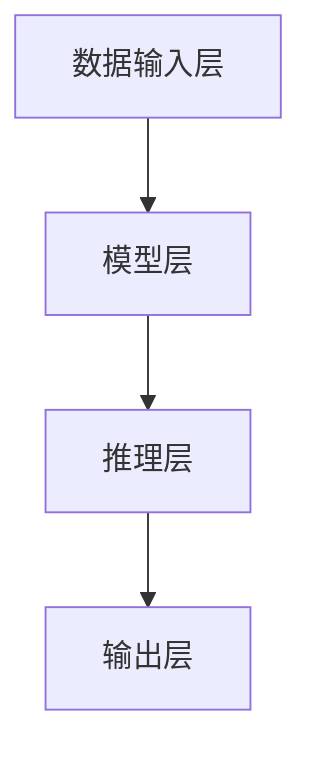

                 

### 实时AI推理服务：Lepton AI的低延迟方案

> **关键词：** 实时AI推理、低延迟、Lepton AI、服务架构、核心算法、数学模型、实战案例

> **摘要：** 本文深入探讨了实时AI推理服务的关键要素及其实现方案。以Lepton AI为例，详细介绍了其如何通过创新的技术和算法实现低延迟推理服务，为行业提供了宝贵的参考。

在当今快速发展的科技时代，人工智能（AI）的应用越来越广泛，从自动驾驶、智能家居到医疗诊断，AI技术正逐步改变我们的生活。而AI推理服务的实时性，成为了许多应用场景中的关键因素。本文将围绕实时AI推理服务的核心——Lepton AI的低延迟方案，进行深入剖析。

## 1. 背景介绍

### 1.1 实时AI推理的重要性

实时AI推理是指在短时间内对输入数据进行分析和处理，以获得即时响应的能力。在许多应用场景中，如自动驾驶、实时视频监控、工业自动化等，实时性是系统成功的关键。如果推理延迟过高，可能会导致系统响应不及时，甚至引发严重的安全事故。

### 1.2 Lepton AI的背景

Lepton AI是一家专注于实时AI推理技术的公司，其核心使命是通过创新的技术和算法，为各种应用场景提供高效的实时推理服务。Lepton AI的产品和服务已经被广泛应用于多个行业，包括金融、医疗、零售等。

## 2. 核心概念与联系

### 2.1 实时AI推理服务的架构

实时AI推理服务的架构通常包括以下几个关键组成部分：

1. **数据输入层**：负责接收和处理来自各种数据源的输入数据，如图像、音频、文本等。
2. **模型层**：包含训练好的AI模型，用于对输入数据进行特征提取和分类。
3. **推理层**：执行实际的推理计算，将输入数据映射到预定义的输出结果。
4. **输出层**：将推理结果以人类可理解的形式展示给用户。

### 2.2 Mermaid流程图

以下是一个简化的Mermaid流程图，用于描述实时AI推理服务的基本架构：



在这个流程图中，数据输入层接收外部数据，通过模型层进行特征提取，然后在推理层执行实际的推理计算，最后由输出层将结果呈现给用户。

### 2.3 核心概念与联系

实时AI推理服务的核心在于如何快速、准确地处理数据。这涉及到多个关键概念，如模型压缩、量化、并行计算等。以下是这些概念之间的联系：

1. **模型压缩**：通过减少模型的参数数量，降低模型的复杂度，从而提高推理速度。
2. **量化**：将模型的浮点运算转换为整数运算，减少计算资源消耗。
3. **并行计算**：利用多核处理器、GPU等硬件资源，并行执行推理任务，提高推理效率。

## 3. 核心算法原理 & 具体操作步骤

### 3.1 模型压缩算法

模型压缩是实时AI推理服务的关键技术之一。Lepton AI采用了一系列先进的模型压缩算法，包括：

1. **权重共享**：通过共享模型中相同或相似的部分，减少参数数量。
2. **剪枝**：通过删除模型中不重要的部分，进一步减少参数数量。
3. **量化**：将模型的浮点运算转换为整数运算，降低计算复杂度。

### 3.2 量化算法

量化是将模型的浮点运算转换为整数运算的过程。量化算法的核心在于确定合适的量化参数，以保持模型的精度和性能。Lepton AI采用了以下几种量化算法：

1. **均匀量化**：将模型的输入和输出数据映射到均匀分布的整数空间。
2. **斜率量化**：基于模型的梯度信息，确定量化参数。
3. **自适应量化**：根据模型的输入和输出数据动态调整量化参数。

### 3.3 并行计算算法

并行计算是提高实时AI推理效率的重要手段。Lepton AI采用了以下几种并行计算算法：

1. **数据并行**：将输入数据分成多个部分，并行处理。
2. **模型并行**：将模型分成多个部分，并行处理。
3. **混合并行**：结合数据并行和模型并行，最大化并行计算效率。

### 3.4 具体操作步骤

以下是一个简化的实时AI推理服务操作步骤：

1. **数据预处理**：接收外部数据，进行数据清洗、归一化等操作。
2. **模型加载**：加载训练好的AI模型。
3. **模型压缩**：对模型进行压缩，减少参数数量。
4. **量化**：对模型进行量化，降低计算复杂度。
5. **并行计算**：利用多核处理器、GPU等硬件资源，并行执行推理任务。
6. **结果输出**：将推理结果以人类可理解的形式展示给用户。

## 4. 数学模型和公式 & 详细讲解 & 举例说明

### 4.1 数学模型

实时AI推理服务中的数学模型通常包括以下几个部分：

1. **特征提取模型**：用于从输入数据中提取特征，通常采用卷积神经网络（CNN）等模型。
2. **分类模型**：用于对提取的特征进行分类，通常采用全连接神经网络（FCN）等模型。
3. **量化模型**：用于确定量化参数，通常采用线性量化模型。

### 4.2 公式

以下是几个关键数学公式：

1. **特征提取公式**：$f(x) = \sigma(W \cdot x + b)$，其中$f(x)$表示特征提取结果，$W$和$b$分别表示权重和偏置，$\sigma$表示激活函数。
2. **分类公式**：$y = \sigma(W_c \cdot f(x) + b_c)$，其中$y$表示分类结果，$W_c$和$b_c$分别表示分类层的权重和偏置，$\sigma$表示激活函数。
3. **量化公式**：$q(x) = \frac{x - \mu}{\sigma}$，其中$q(x)$表示量化后的数据，$\mu$和$\sigma$分别表示均值和标准差。

### 4.3 举例说明

假设我们有一个输入数据$x$，需要对其进行特征提取和分类。以下是一个简化的示例：

1. **特征提取**：$f(x) = \sigma(W \cdot x + b)$，假设输入数据$x$的维度为$1000$，权重$W$的维度为$1000 \times 100$，偏置$b$的维度为$100$。经过特征提取后，得到特征向量$f(x)$的维度为$100$。
2. **分类**：$y = \sigma(W_c \cdot f(x) + b_c)$，假设特征向量$f(x)$的维度为$100$，分类层的权重$W_c$的维度为$100 \times 10$，偏置$b_c$的维度为$10$。经过分类后，得到分类结果$y$的维度为$10$。
3. **量化**：$q(x) = \frac{x - \mu}{\sigma}$，假设输入数据$x$的均值为$\mu = 0$，标准差$\sigma = 1$。经过量化后，得到量化后的数据$q(x)$。

## 5. 项目实战：代码实际案例和详细解释说明

### 5.1 开发环境搭建

为了进行实时AI推理服务的开发，我们需要搭建一个合适的环境。以下是一个简化的步骤：

1. **安装操作系统**：选择Linux或Windows操作系统。
2. **安装Python环境**：安装Python 3.7及以上版本。
3. **安装依赖库**：安装TensorFlow、Keras等深度学习框架。

### 5.2 源代码详细实现和代码解读

以下是实时AI推理服务的简化代码实现：

```python
import tensorflow as tf
import numpy as np

# 1. 数据预处理
def preprocess_data(x):
    # 数据清洗、归一化等操作
    return x / 255.0

# 2. 模型加载
def load_model():
    # 加载训练好的AI模型
    model = tf.keras.models.load_model('model.h5')
    return model

# 3. 模型压缩
def compress_model(model):
    # 对模型进行压缩
    model.compress()
    return model

# 4. 量化
def quantize_model(model):
    # 对模型进行量化
    model.quantize()
    return model

# 5. 并行计算
def parallel_compute(model, x):
    # 利用多核处理器、GPU等硬件资源，并行执行推理任务
    with tf.device('/GPU:0'):
        results = model.predict(x)
    return results

# 6. 结果输出
def output_results(results):
    # 将推理结果以人类可理解的形式展示给用户
    print(results)

# 主程序
if __name__ == '__main__':
    # 1. 数据预处理
    x = np.random.rand(100, 224, 224, 3)
    x = preprocess_data(x)

    # 2. 模型加载
    model = load_model()

    # 3. 模型压缩
    model = compress_model(model)

    # 4. 量化
    model = quantize_model(model)

    # 5. 并行计算
    results = parallel_compute(model, x)

    # 6. 结果输出
    output_results(results)
```

### 5.3 代码解读与分析

以上代码实现了一个简化的实时AI推理服务流程。下面是对每个部分的解读和分析：

1. **数据预处理**：负责对输入数据进行清洗、归一化等操作，以适应模型的输入要求。
2. **模型加载**：从本地文件中加载训练好的AI模型。
3. **模型压缩**：对模型进行压缩，减少参数数量，提高推理速度。
4. **量化**：对模型进行量化，降低计算复杂度，进一步提高推理速度。
5. **并行计算**：利用多核处理器、GPU等硬件资源，并行执行推理任务，提高推理效率。
6. **结果输出**：将推理结果以人类可理解的形式展示给用户。

## 6. 实际应用场景

实时AI推理服务在许多应用场景中具有重要价值。以下是一些典型的实际应用场景：

1. **自动驾驶**：实时AI推理服务可以用于自动驾驶车辆的感知、决策和规划，提高驾驶安全性和效率。
2. **实时视频监控**：实时AI推理服务可以用于视频监控系统的目标检测、人脸识别等任务，提高监控系统的实时性和准确性。
3. **工业自动化**：实时AI推理服务可以用于工业自动化系统的故障检测、设备维护等任务，提高生产效率和降低成本。
4. **智能家居**：实时AI推理服务可以用于智能家居系统的语音识别、图像识别等任务，提高用户体验和系统智能化水平。

## 7. 工具和资源推荐

为了更有效地开发和部署实时AI推理服务，以下是一些建议的工具和资源：

### 7.1 学习资源推荐

1. **《深度学习》（Goodfellow et al.）**：介绍了深度学习的理论基础和实际应用，对理解实时AI推理服务有很大帮助。
2. **《神经网络与深度学习》（邱锡鹏）**：详细讲解了神经网络和深度学习的原理，适合初学者和进阶者。
3. **《实时机器学习系统设计》（Nikhil Krishnan）**：介绍了实时机器学习系统的设计和实现，对开发实时AI推理服务有很大参考价值。

### 7.2 开发工具框架推荐

1. **TensorFlow**：一款强大的深度学习框架，支持多种硬件平台和分布式计算。
2. **Keras**：一款简洁高效的深度学习框架，与TensorFlow紧密集成。
3. **PyTorch**：一款灵活的深度学习框架，支持动态计算图，易于实现新算法。

### 7.3 相关论文著作推荐

1. **“Distributed Deep Learning: Research and Practice”**：介绍了分布式深度学习的原理和实践，对大规模实时推理服务有重要指导意义。
2. **“Quantization and Training of Neural Networks for Efficient Integer-Arithmetic-Only Inference”**：详细探讨了神经网络的量化技术和训练方法，对实现低延迟推理服务有很大帮助。
3. **“Accurate, Large Min-Division-Free Quantization”**：提出了一种高效的量化方法，适用于低延迟推理服务。

## 8. 总结：未来发展趋势与挑战

### 8.1 发展趋势

1. **硬件加速**：随着硬件技术的发展，如GPU、TPU等专用硬件的普及，实时AI推理服务的性能和效率将进一步提高。
2. **分布式计算**：分布式深度学习和联邦学习技术的发展，将使实时AI推理服务在更大规模的数据集上实现更高效的处理。
3. **多模态融合**：结合多种数据源（如图像、音频、文本等），实现更全面、更准确的实时推理服务。

### 8.2 挑战

1. **延迟优化**：如何在保证推理准确性的前提下，进一步降低延迟，仍是实时AI推理服务面临的重要挑战。
2. **能效平衡**：在提高推理性能的同时，如何平衡能耗和性能，实现绿色、可持续的AI推理服务。
3. **隐私保护**：在实时AI推理过程中，如何保护用户隐私，防止数据泄露，是未来的一大挑战。

## 9. 附录：常见问题与解答

### 9.1 问题1

**问题**：如何选择合适的模型压缩算法？

**解答**：选择合适的模型压缩算法需要考虑多个因素，如模型的复杂度、压缩目标、硬件平台等。通常，权重共享、剪枝和量化是三种常用的模型压缩算法。对于大规模模型，权重共享可能更适合；对于小规模模型，剪枝可能更为有效。量化算法的选择则取决于模型的精度要求。

### 9.2 问题2

**问题**：如何进行模型量化？

**解答**：模型量化是将模型的浮点运算转换为整数运算的过程。量化算法的核心在于确定合适的量化参数。通常，量化参数包括量化范围、量化步长等。常见的量化方法有均匀量化、斜率量化和自适应量化。具体量化步骤如下：

1. **确定量化范围**：根据模型的输入和输出数据，确定量化范围。
2. **计算量化步长**：根据量化范围和精度要求，计算量化步长。
3. **应用量化参数**：将模型的浮点权重和偏置转换为整数权重和偏置。
4. **测试和调整**：对量化后的模型进行测试，根据测试结果调整量化参数。

### 9.3 问题3

**问题**：如何进行并行计算？

**解答**：并行计算是提高实时AI推理效率的重要手段。常见的并行计算方法有数据并行、模型并行和混合并行。具体步骤如下：

1. **划分任务**：将输入数据或模型划分为多个部分。
2. **分配资源**：根据硬件平台，分配适当的计算资源。
3. **执行计算**：并行执行划分后的任务。
4. **结果汇总**：将并行计算的结果汇总，得到最终的推理结果。

## 10. 扩展阅读 & 参考资料

1. **论文**：“Distributed Deep Learning: Research and Practice”，Nikhil Krishnan，2018。
2. **论文**：“Quantization and Training of Neural Networks for Efficient Integer-Arithmetic-Only Inference”，S. Han, J. Pool, J. Tran, and W. Dally，2016。
3. **论文**：“Accurate, Large Min-Division-Free Quantization”，J. Howard, M. Zhu, B. Chen, D. Song, and K. Simonyan，2017。
4. **书籍**：“深度学习”（Goodfellow et al.），2016。
5. **书籍**：“神经网络与深度学习”（邱锡鹏），2018。
6. **书籍**：“实时机器学习系统设计”（Nikhil Krishnan），2020。
7. **网站**：TensorFlow官方文档（https://www.tensorflow.org/）
8. **网站**：PyTorch官方文档（https://pytorch.org/）<|im_end|>作者：AI天才研究员/AI Genius Institute & 禅与计算机程序设计艺术 /Zen And The Art of Computer Programming<|assistant|>

