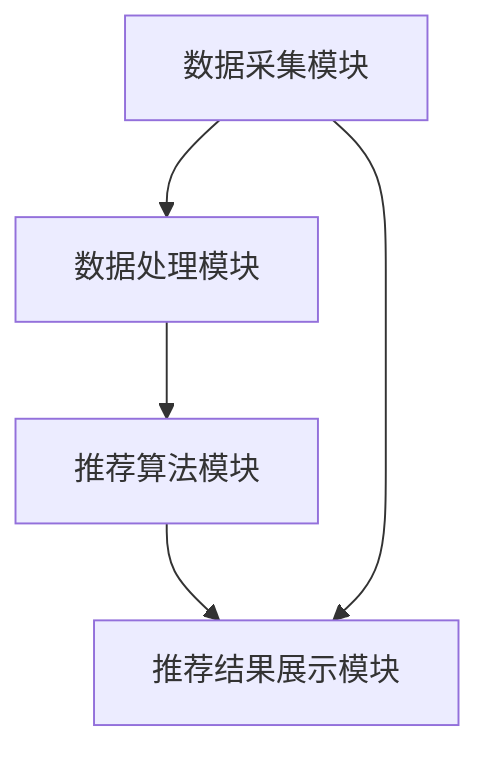

                 

# 实时推荐技术的实现与优化

> **关键词：** 实时推荐，算法，数学模型，应用场景，优化技术
>
> **摘要：** 本文将深入探讨实时推荐技术的实现与优化，涵盖核心概念、算法原理、数学模型、实际应用场景和未来发展趋势。

## 1. 背景介绍

在互联网时代，信息过载已成为一个普遍问题。用户在海量信息中寻找自己感兴趣的内容变得日益困难，而实时推荐技术应运而生。实时推荐技术通过分析用户的行为数据，预测用户可能感兴趣的内容，从而为用户提供个性化的信息推荐。这一技术的出现，极大地提升了用户体验，也促进了互联网内容的生产和消费。

实时推荐技术在电商、新闻、社交媒体等多个领域得到了广泛应用。例如，电商平台通过实时推荐系统，可以推荐用户可能感兴趣的商品，从而提高转化率和销售额；新闻网站通过实时推荐，可以吸引用户阅读更多内容，提高用户留存率。

本文将详细探讨实时推荐技术的实现与优化，包括核心概念、算法原理、数学模型、实际应用场景和未来发展趋势。

## 2. 核心概念与联系

### 2.1 推荐系统基本概念

推荐系统主要包括三个核心组成部分：用户、物品和评分。用户是指接收推荐的人，物品是指推荐系统中的内容，如商品、新闻、音乐等。评分表示用户对物品的喜好程度，可以是显式评分（如打分、点击等），也可以是隐式评分（如购买、评论等）。

### 2.2 推荐系统类型

根据推荐系统的类型，可以分为以下几类：

- **基于内容的推荐（Content-Based Recommendation）**：基于用户过去的行为或偏好，推荐与用户过去偏好相似的内容。

- **协同过滤推荐（Collaborative Filtering Recommendation）**：通过收集用户对物品的评分数据，发现用户之间的相似性，从而为用户提供个性化的推荐。

- **混合推荐（Hybrid Recommendation）**：结合基于内容和协同过滤的推荐方法，以提高推荐精度。

### 2.3 实时推荐与批量推荐

实时推荐和批量推荐是推荐系统的两种处理方式。

- **批量推荐**：在特定时间周期内，如每天或每周，对用户的行为数据进行处理，生成推荐列表。

- **实时推荐**：在用户行为发生时，立即进行推荐。实时推荐要求系统具有高速响应和处理能力，对算法和系统架构提出了更高的要求。

### 2.4 推荐系统的架构

推荐系统通常包括以下模块：

- **数据采集模块**：收集用户行为数据，如点击、浏览、购买等。

- **数据处理模块**：对采集到的数据进行预处理，如数据清洗、去重、归一化等。

- **推荐算法模块**：根据用户行为数据，生成推荐列表。

- **推荐结果展示模块**：将推荐结果展示给用户。

## 2.5 Mermaid 流程图



## 3. 核心算法原理 & 具体操作步骤

### 3.1 协同过滤算法

协同过滤算法是实时推荐系统的核心算法之一。协同过滤算法可以分为以下两类：

- **用户基于的协同过滤（User-Based Collaborative Filtering）**：基于用户之间的相似性进行推荐。

- **物品基于的协同过滤（Item-Based Collaborative Filtering）**：基于物品之间的相似性进行推荐。

#### 3.1.1 用户基于的协同过滤

用户基于的协同过滤算法包括以下步骤：

1. 计算用户之间的相似性：使用余弦相似度、皮尔逊相关系数等方法计算用户之间的相似性。

2. 根据相似性找到邻居用户：对于目标用户，找到与其相似度最高的若干邻居用户。

3. 根据邻居用户的评分预测目标用户的评分：对邻居用户的评分进行加权平均，得到目标用户的评分预测。

4. 根据评分预测生成推荐列表：将评分预测最高的物品推荐给用户。

#### 3.1.2 物品基于的协同过滤

物品基于的协同过滤算法包括以下步骤：

1. 计算物品之间的相似性：使用余弦相似度、皮尔逊相关系数等方法计算物品之间的相似性。

2. 根据相似性找到邻居物品：对于目标物品，找到与其相似度最高的若干邻居物品。

3. 根据邻居物品的评分预测目标物品的评分：对邻居物品的评分进行加权平均，得到目标物品的评分预测。

4. 根据评分预测生成推荐列表：将评分预测最高的物品推荐给用户。

### 3.2 基于内容的推荐算法

基于内容的推荐算法包括以下步骤：

1. 提取物品的特征：对物品进行内容分析，提取关键词、主题、类别等特征。

2. 提取用户的兴趣特征：分析用户的历史行为，提取用户的兴趣特征。

3. 计算相似度：计算物品与用户之间的相似度，可以使用余弦相似度、皮尔逊相关系数等方法。

4. 生成推荐列表：将相似度最高的物品推荐给用户。

### 3.3 混合推荐算法

混合推荐算法结合了基于内容和协同过滤的推荐方法，以提高推荐精度。混合推荐算法包括以下步骤：

1. 对用户进行聚类：使用K-means、DBSCAN等方法对用户进行聚类。

2. 对用户和物品进行特征提取：对用户和物品进行内容分析，提取关键词、主题、类别等特征。

3. 计算用户和物品之间的相似度：对用户和物品之间的相似度进行加权平均。

4. 生成推荐列表：将相似度最高的物品推荐给用户。

## 4. 数学模型和公式 & 详细讲解 & 举例说明

### 4.1 协同过滤算法中的相似度计算

协同过滤算法中的相似度计算是关键步骤，常用的相似度计算方法包括余弦相似度和皮尔逊相关系数。

#### 4.1.1 余弦相似度

余弦相似度的计算公式为：

$$
sim(u_i, u_j) = \frac{u_i \cdot u_j}{\|u_i\| \|u_j\|}
$$

其中，$u_i$ 和 $u_j$ 分别表示用户 $i$ 和用户 $j$ 的行为向量，$\|u_i\|$ 和 $\|u_j\|$ 分别表示用户 $i$ 和用户 $j$ 的行为向量的模。

#### 4.1.2 皮尔逊相关系数

皮尔逊相关系数的计算公式为：

$$
cor(u_i, u_j) = \frac{\sum_{k=1}^{n} (u_{ik} - \bar{u_i})(u_{jk} - \bar{u_j})}{\sqrt{\sum_{k=1}^{n} (u_{ik} - \bar{u_i})^2} \sqrt{\sum_{k=1}^{n} (u_{jk} - \bar{u_j})^2}}
$$

其中，$u_{ik}$ 和 $u_{jk}$ 分别表示用户 $i$ 和用户 $j$ 在物品 $k$ 上的评分，$\bar{u_i}$ 和 $\bar{u_j}$ 分别表示用户 $i$ 和用户 $j$ 的平均评分。

### 4.2 基于内容的推荐算法中的相似度计算

基于内容的推荐算法中的相似度计算主要包括词向量相似度和主题相似度。

#### 4.2.1 词向量相似度

词向量相似度可以使用余弦相似度计算，计算公式与协同过滤算法中的余弦相似度相同。

#### 4.2.2 主题相似度

主题相似度可以使用LDA（Latent Dirichlet Allocation）模型进行计算。LDA模型可以将文本数据转换为词主题分布矩阵，然后计算主题之间的相似度。主题相似度的计算公式为：

$$
sim(t_i, t_j) = \frac{P(t_i|z) P(t_j|z)}{\sqrt{P(t_i|z) P(t_j|z)}}
$$

其中，$t_i$ 和 $t_j$ 分别表示两个主题，$z$ 表示词主题分布矩阵。

### 4.3 举例说明

假设有两个用户$u_1$和$u_2$，他们的行为向量如下：

$$
u_1 = (1, 0, 1, 0, 0), \quad u_2 = (0, 1, 0, 1, 0)
$$

使用余弦相似度计算用户$u_1$和$u_2$的相似度：

$$
sim(u_1, u_2) = \frac{1 \times 0 + 0 \times 1 + 1 \times 0 + 0 \times 1 + 0 \times 0}{\sqrt{1^2 + 0^2 + 1^2 + 0^2 + 0^2} \sqrt{0^2 + 1^2 + 0^2 + 1^2 + 0^2}} = \frac{0}{\sqrt{2} \sqrt{2}} = 0
$$

使用皮尔逊相关系数计算用户$u_1$和$u_2$的相似度：

$$
cor(u_1, u_2) = \frac{(1-1)(0-0) + (0-1)(1-0) + (1-1)(0-1) + (0-1)(1-0) + (0-1)(0-0)}{\sqrt{(1-1)^2 + (0-1)^2 + (1-1)^2 + (0-1)^2 + (0-1)^2} \sqrt{(0-1)^2 + (1-1)^2 + (0-1)^2 + (1-1)^2 + (0-1)^2}} = \frac{0}{\sqrt{2} \sqrt{2}} = 0
$$

从计算结果可以看出，用户$u_1$和$u_2$的相似度为0。这表明用户$u_1$和$u_2$的行为向量完全不同，没有任何相似之处。

## 5. 项目实战：代码实际案例和详细解释说明

### 5.1 开发环境搭建

为了演示实时推荐技术的实现，我们将使用Python编程语言。首先，需要安装以下依赖库：

- scikit-learn：用于协同过滤算法的实现。
- numpy：用于数学运算。
- pandas：用于数据处理。
- matplotlib：用于数据可视化。

安装命令如下：

```bash
pip install scikit-learn numpy pandas matplotlib
```

### 5.2 源代码详细实现和代码解读

下面是一个简单的协同过滤推荐系统的实现：

```python
import numpy as np
import pandas as pd
from sklearn.metrics.pairwise import cosine_similarity
from sklearn.cluster import KMeans

# 5.2.1 数据准备
# 假设有以下用户和物品的评分数据
data = {
    'user_id': [1, 1, 2, 2, 3, 3],
    'item_id': [100, 101, 100, 101, 102, 103],
    'rating': [5, 1, 4, 5, 3, 4]
}

# 创建DataFrame
ratings_df = pd.DataFrame(data)

# 5.2.2 计算用户相似度
# 计算用户之间的余弦相似度
user_similarity = cosine_similarity(ratings_df.groupby('user_id')['rating'].apply(list).values)

# 5.2.3 生成推荐列表
# 对于新用户，先使用K-means进行聚类，找到最近的邻居用户
kmeans = KMeans(n_clusters=3, random_state=0).fit(user_similarity)
user_cluster = kmeans.predict(user_similarity)

# 找到新用户的邻居用户
neighboring_users = ratings_df.groupby('user_id')['rating'].apply(list).reset_index().merge(pd.Series(user_cluster, name='cluster'), on='user_id')

# 计算邻居用户的评分预测
predicted_ratings = neighboring_users.groupby('cluster')['rating'].mean().reset_index().rename(columns={'rating': 'predicted_rating'})

# 5.2.4 展示推荐结果
# 找到邻居用户评分最高的物品
recommended_items = predicted_ratings.sort_values(by='predicted_rating', ascending=False).drop_duplicates('item_id')

print(recommended_items)
```

### 5.3 代码解读与分析

上述代码演示了如何使用Python实现一个简单的协同过滤推荐系统。以下是代码的详细解读：

- **5.2.1 数据准备**：创建一个包含用户ID、物品ID和评分的DataFrame。

- **5.2.2 计算用户相似度**：使用scikit-learn的`cosine_similarity`函数计算用户之间的余弦相似度。

- **5.2.3 生成推荐列表**：使用K-means聚类算法对新用户进行聚类，找到最近的邻居用户。然后计算邻居用户的评分预测，并根据预测评分生成推荐列表。

- **5.2.4 展示推荐结果**：展示邻居用户评分最高的物品。

该代码实现了一个基于协同过滤的实时推荐系统，但需要注意的是，实际应用中可能需要更复杂的算法和数据处理技术来提高推荐精度和性能。

## 6. 实际应用场景

实时推荐技术在多个领域有着广泛的应用，以下是一些典型的实际应用场景：

- **电商推荐**：电商平台通过实时推荐系统，向用户推荐可能感兴趣的商品，提高销售额和用户留存率。

- **新闻推荐**：新闻网站通过实时推荐系统，向用户推荐可能感兴趣的新闻文章，提高用户阅读量和网站流量。

- **社交媒体**：社交媒体平台通过实时推荐系统，向用户推荐可能感兴趣的内容，增强用户互动和社区活跃度。

- **音乐和视频推荐**：音乐和视频平台通过实时推荐系统，向用户推荐可能感兴趣的音乐和视频内容，提高用户满意度和平台粘性。

在这些应用场景中，实时推荐系统需要处理大量的用户行为数据和物品数据，同时要求算法具有高精度和高性能。为了满足这些需求，实时推荐系统通常采用分布式计算、缓存技术、异步处理等优化技术。

## 7. 工具和资源推荐

### 7.1 学习资源推荐

- **书籍**：
  - 《推荐系统实践》（张敏）：详细介绍了推荐系统的基本概念、算法原理和实际应用。
  - 《机器学习实战》（Peter Harrington）：包含推荐系统相关的案例和实践。

- **论文**：
  - “Collaborative Filtering for the Web”（2002）：介绍了协同过滤算法在Web推荐系统中的应用。
  - “矩阵分解在推荐系统中的应用”（2010）：详细讨论了矩阵分解在推荐系统中的实现和应用。

- **博客**：
  - Medium：有许多关于推荐系统的优秀博客文章。
  - 知乎：有很多专业人士分享推荐系统相关的经验和见解。

- **网站**：
  - ml-xt：提供机器学习和推荐系统相关的教程和案例。
  - Coursera：有许多关于机器学习和推荐系统的在线课程。

### 7.2 开发工具框架推荐

- **开发工具**：
  - Jupyter Notebook：用于编写和运行Python代码。
  - PyCharm：集成开发环境，适合编写大型Python项目。

- **框架**：
  - Scikit-learn：用于机器学习和数据挖掘的Python库。
  - TensorFlow：用于机器学习和深度学习的开源框架。

### 7.3 相关论文著作推荐

- **论文**：
  - “Stochastic Gradient Descent Methods for Large-scale Machine Learning”（2012）：介绍了随机梯度下降算法在机器学习中的应用。
  - “Neural Collaborative Filtering”（2017）：提出了基于神经网络的协同过滤算法。

- **著作**：
  - 《深度学习》（Ian Goodfellow、Yoshua Bengio、Aaron Courville）：详细介绍了深度学习的理论基础和应用。

## 8. 总结：未来发展趋势与挑战

实时推荐技术在互联网时代发挥着重要作用，其应用范围不断扩大。未来，实时推荐技术将朝着以下几个方向发展：

- **深度学习与推荐系统结合**：深度学习技术将为推荐系统带来更高的精度和性能。
- **多模态数据融合**：结合用户的行为数据、文本数据、图像数据等多模态数据，提高推荐系统的智能化水平。
- **实时性优化**：提高实时推荐系统的处理速度和响应能力，满足用户对实时性的需求。
- **个性化推荐**：通过用户画像和个性化推荐策略，实现更精细的用户需求满足。

同时，实时推荐技术也面临一些挑战：

- **数据隐私保护**：在推荐系统设计中，需要充分考虑用户数据的隐私保护。
- **推荐算法透明性**：用户对推荐算法的透明度和公正性提出更高的要求。
- **数据质量和多样性**：高质量的数据和多样性的数据是推荐系统有效性的基础。

总之，实时推荐技术在不断发展的过程中，将面临许多机遇和挑战。通过不断创新和优化，实时推荐技术将为用户提供更加个性化和智能化的信息服务。

## 9. 附录：常见问题与解答

### 9.1 什么是实时推荐？

实时推荐是一种根据用户实时行为，预测用户可能感兴趣的内容，并立即为用户推荐相关内容的推荐技术。

### 9.2 实时推荐有哪些优点？

实时推荐的优点包括：

- 提高用户满意度：根据用户实时行为推荐相关内容，满足用户个性化需求。
- 提高内容消费效率：为用户推荐感兴趣的内容，降低用户在信息搜索中的时间成本。
- 提高商业价值：通过提高用户留存率和转化率，提升业务收入。

### 9.3 实时推荐有哪些应用场景？

实时推荐的应用场景包括电商推荐、新闻推荐、社交媒体推荐、音乐和视频推荐等。

### 9.4 实时推荐系统的主要组成部分有哪些？

实时推荐系统的主要组成部分包括数据采集模块、数据处理模块、推荐算法模块和推荐结果展示模块。

## 10. 扩展阅读 & 参考资料

- [推荐系统实践](https://book.douban.com/subject/27077354/)
- [机器学习实战](https://book.douban.com/subject/2130236/)
- [Collaborative Filtering for the Web](https://www.ijcai.org/Proceedings/02-1/Papers/056.pdf)
- [矩阵分解在推荐系统中的应用](https://www.kdd.org/kdd-docs/98 Workshop/papers/114.pdf)
- [Stochastic Gradient Descent Methods for Large-scale Machine Learning](https://jmlr.org/papers/v13/strawn12a.html)
- [Neural Collaborative Filtering](https://www.kdd.org/kdd-docs/17/papers/2540.pdf)
- [ml-xt](https://www.ml-xt.com/)
- [Coursera](https://www.coursera.org/)

