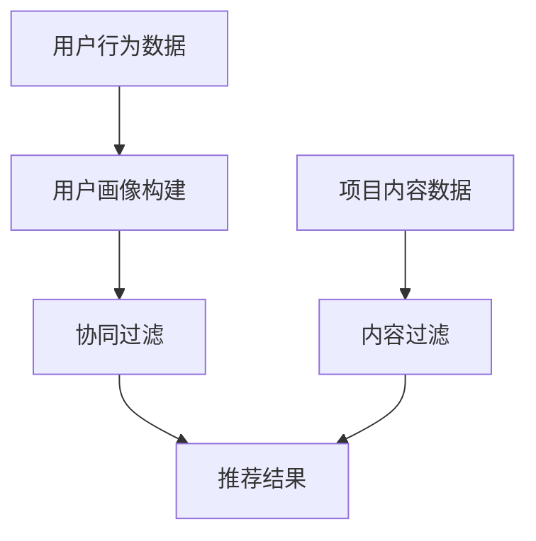

                 

### 背景介绍

实时推荐技术，作为当前互联网领域的一大热门研究方向，其核心目标是通过分析用户的历史行为、兴趣偏好和实时反馈，为用户提供个性化的推荐结果。这种技术的广泛应用，极大地提升了用户体验，推动了商业模式的创新，并在社交网络、电子商务、在线媒体等多个领域取得了显著成效。

本文将深入探讨实时推荐技术的应用实例，通过以下几个部分展开：

1. **核心概念与联系**：介绍实时推荐技术的核心概念，包括用户画像、协同过滤、内容过滤等，并通过 Mermaid 流程图展示其架构。
2. **核心算法原理与具体操作步骤**：详细讲解实时推荐系统中的主要算法，如基于模型的推荐算法和基于内容的推荐算法。
3. **数学模型和公式**：介绍实时推荐技术中的关键数学模型，如协同过滤的相似度计算、推荐算法的优化目标等，并通过具体的数学公式进行说明。
4. **项目实战**：通过实际代码案例，展示实时推荐技术的应用过程，包括开发环境搭建、源代码实现和代码解读。
5. **实际应用场景**：分析实时推荐技术在电子商务、社交媒体、在线媒体等领域的应用实例。
6. **工具和资源推荐**：推荐学习实时推荐技术的相关资源，包括书籍、论文、开发工具和框架等。
7. **总结**：总结实时推荐技术的发展趋势和面临的挑战。

在接下来的部分，我们将逐一展开讨论，深入理解实时推荐技术的原理和实践。

### 核心概念与联系

实时推荐技术涉及多个核心概念，包括用户画像、协同过滤、内容过滤等。这些概念共同构成了实时推荐系统的理论基础，并影响着系统的性能和效果。

#### 用户画像

用户画像是指通过对用户的历史行为、兴趣偏好、社交网络等多维度数据进行分析，构建用户的一个综合描述。用户画像可以帮助推荐系统理解用户的需求，从而提供更加个性化的推荐结果。例如，用户可能在购物网站浏览了多种类型的商品，通过分析这些浏览行为，系统可以推断出用户的兴趣偏好，并将其应用于推荐算法中。

用户画像通常包含以下几个关键维度：

- **行为特征**：用户在平台上所进行的操作，如浏览、点击、购买等。
- **兴趣偏好**：用户对特定内容或商品的偏好程度。
- **社会属性**：用户的性别、年龄、地理位置等基本信息。
- **心理属性**：用户的心理需求、消费观念等。

通过用户画像的构建，实时推荐系统可以更加精准地预测用户未来的行为和偏好，从而提高推荐的准确性。

#### 协同过滤

协同过滤是实时推荐系统中的一种常用算法，其核心思想是通过分析用户与项目（如商品、文章等）之间的交互行为，发现用户的共同兴趣，从而进行推荐。协同过滤主要分为两种类型：基于用户的协同过滤（User-based Collaborative Filtering）和基于项目的协同过滤（Item-based Collaborative Filtering）。

- **基于用户的协同过滤**：通过分析用户之间的相似度，找到与目标用户相似的其他用户，然后推荐这些相似用户喜欢的项目。计算用户相似度时，通常使用用户的行为评分矩阵，通过余弦相似度、皮尔逊相关系数等方法计算。
  
  $$\text{similarity} = \frac{\sum_{i=1}^{n} x_i y_i}{\sqrt{\sum_{i=1}^{n} x_i^2} \sqrt{\sum_{i=1}^{n} y_i^2}}$$

- **基于项目的协同过滤**：通过分析项目之间的相似度，找到与目标项目相似的其他项目，然后推荐这些相似项目。项目相似度通常基于项目的内容特征进行计算，如文本相似度、图像特征相似度等。

#### 内容过滤

内容过滤是一种基于项目特征的推荐方法，其核心思想是通过分析项目的内容属性，为用户推荐与之相似的项目。内容过滤通常使用向量表示法，将项目的内容特征转换为向量，然后通过相似度计算找到与目标项目相似的其他项目。

内容过滤的关键步骤包括：

1. **特征提取**：从项目的内容中提取关键特征，如文本、图像、音频等。
2. **特征表示**：将提取到的特征转换为向量表示，常用的方法有词袋模型、TF-IDF、词嵌入等。
3. **相似度计算**：计算项目向量之间的相似度，常用的方法有余弦相似度、欧氏距离等。

#### 架构图

为了更好地理解实时推荐技术的核心概念与联系，下面使用 Mermaid 流程图展示其架构：



在图中，用户行为数据首先进入用户画像构建模块，生成用户画像。用户画像与协同过滤模块结合，通过分析用户与项目之间的交互行为，生成推荐结果。同时，项目内容数据进入内容过滤模块，通过项目内容特征进行推荐。最终，协同过滤和内容过滤的推荐结果合并，形成最终的推荐结果。

通过上述核心概念与联系的介绍，我们对实时推荐技术有了初步的认识。在接下来的部分，我们将深入探讨实时推荐系统的核心算法原理与具体操作步骤。

#### 核心算法原理与具体操作步骤

实时推荐系统的核心在于如何高效地计算用户与项目之间的相似度，并根据相似度生成个性化的推荐结果。本部分将详细介绍两种主要的实时推荐算法：基于模型的推荐算法和基于内容的推荐算法，并逐步解释其具体操作步骤。

##### 基于模型的推荐算法

基于模型的推荐算法通过建立数学模型，分析用户的历史行为数据，预测用户对未知项目的兴趣。常用的基于模型的推荐算法包括矩阵分解、神经网络等。

###### 矩阵分解

矩阵分解是一种常用的基于模型的推荐算法，其核心思想是将用户-项目评分矩阵分解为两个低秩矩阵，通过这两个矩阵的乘积重构原始评分矩阵，从而预测用户对未知项目的评分。

具体步骤如下：

1. **初始化参数**：初始化用户矩阵 \(U\) 和项目矩阵 \(V\) 的参数，通常使用随机初始化。
2. **预测评分**：通过矩阵乘法计算预测评分，公式如下：

   $$R_{ui} = U_i \cdot V_u$$

   其中，\(R_{ui}\) 表示用户 \(i\) 对项目 \(u\) 的预测评分，\(U_i\) 和 \(V_u\) 分别表示用户 \(i\) 和项目 \(u\) 的特征向量。
3. **优化参数**：通过梯度下降等优化方法，不断调整用户矩阵 \(U\) 和项目矩阵 \(V\) 的参数，以最小化预测评分与真实评分之间的误差。
4. **迭代优化**：重复步骤 2 和 3，直到满足收敛条件或达到预设的迭代次数。

###### 神经网络

神经网络是一种模拟人脑神经元连接方式的计算模型，可以用于复杂非线性关系的预测。在推荐系统中，神经网络可以用来预测用户对项目的兴趣。

具体步骤如下：

1. **输入层**：输入用户的行为数据，如浏览历史、购买记录等。
2. **隐藏层**：通过多层神经网络结构，对输入数据进行特征提取和变换。
3. **输出层**：输出用户对项目的预测兴趣分数。
4. **损失函数**：定义损失函数，如均方误差（MSE），衡量预测结果与真实结果之间的误差。
5. **反向传播**：通过反向传播算法，不断调整神经网络的参数，以最小化损失函数。
6. **训练与优化**：重复步骤 2 至 5，直到满足收敛条件或达到预设的迭代次数。

##### 基于内容的推荐算法

基于内容的推荐算法通过分析项目的内容特征，为用户推荐与之相似的其他项目。这种方法通常应用于内容丰富的场景，如新闻推荐、音乐推荐等。

###### 特征提取

特征提取是内容过滤的关键步骤，其目标是提取项目的核心特征，以便进行相似度计算。常用的特征提取方法包括词袋模型、TF-IDF、词嵌入等。

1. **词袋模型**：将项目的内容表示为词袋向量，每个词作为一个特征维度，词频作为特征值。
2. **TF-IDF**：在词袋模型的基础上，引入词频-逆文档频率（TF-IDF）权重，以反映词的重要程度。
3. **词嵌入**：通过预训练的词嵌入模型，将词映射为高维稠密向量，从而实现语义层面的特征提取。

###### 相似度计算

相似度计算是内容过滤的核心，常用的方法有余弦相似度、欧氏距离等。

1. **余弦相似度**：计算两个向量之间的余弦值，公式如下：

   $$\text{similarity} = \frac{U \cdot V}{\|U\| \|V\|}$$

   其中，\(U\) 和 \(V\) 分别表示两个项目的特征向量，\(\|U\|\) 和 \(\|V\|\) 分别表示向量的模长。
2. **欧氏距离**：计算两个向量之间的欧氏距离，公式如下：

   $$\text{distance} = \sqrt{\sum_{i=1}^{n} (U_i - V_i)^2}$$

   其中，\(U\) 和 \(V\) 分别表示两个项目的特征向量。

###### 推荐结果生成

根据相似度计算结果，可以为用户推荐与其兴趣相似的项目。具体步骤如下：

1. **计算相似度**：对用户已知的兴趣项目，计算其与待推荐项目之间的相似度。
2. **排序**：根据相似度值对项目进行排序，选取相似度最高的项目作为推荐结果。
3. **去重与筛选**：去除用户已知的兴趣项目，对相似度较高的项目进行筛选，生成最终的推荐列表。

通过上述介绍，我们详细讲解了实时推荐系统中的核心算法原理与具体操作步骤。在接下来的部分，我们将进一步探讨实时推荐技术中的关键数学模型和公式。

#### 数学模型和公式

在实时推荐技术中，数学模型和公式起着至关重要的作用，它们不仅用于描述算法的原理，还为推荐系统的优化和改进提供了理论基础。本部分将详细介绍实时推荐系统中常用的数学模型和公式，并通过具体的例子进行说明。

##### 协同过滤的相似度计算

协同过滤算法的核心在于计算用户之间的相似度或项目之间的相似度。这里，我们以基于用户的协同过滤为例，介绍相似度计算的方法。

###### 余弦相似度

余弦相似度是一种常用的相似度计算方法，它通过计算两个向量之间的余弦值来衡量相似度。公式如下：

$$\text{similarity} = \frac{U \cdot V}{\|U\| \|V\|}$$

其中，\(U\) 和 \(V\) 分别表示两个用户的特征向量，\(\|U\|\) 和 \(\|V\|\) 分别表示向量的模长。

举个例子，假设有两个用户 A 和 B，他们的特征向量分别为 \(U_A = (1, 2, 3)\) 和 \(U_B = (3, 2, 1)\)，则他们之间的余弦相似度为：

$$\text{similarity} = \frac{(1, 2, 3) \cdot (3, 2, 1)}{\sqrt{1^2 + 2^2 + 3^2} \sqrt{3^2 + 2^2 + 1^2}} = \frac{1 \times 3 + 2 \times 2 + 3 \times 1}{\sqrt{14} \sqrt{14}} = \frac{11}{14} \approx 0.7857$$

##### 推荐算法的优化目标

在实时推荐系统中，优化目标通常是使得预测评分与真实评分之间的误差最小。基于矩阵分解的推荐算法，其优化目标可以表示为：

$$\min_{U, V} \sum_{i=1}^{n} \sum_{u=1}^{m} (R_{ui} - U_i \cdot V_u)^2$$

其中，\(R_{ui}\) 表示用户 \(i\) 对项目 \(u\) 的真实评分，\(U_i\) 和 \(V_u\) 分别表示用户 \(i\) 和项目 \(u\) 的特征向量。

举个例子，假设有一个用户-项目评分矩阵 \(R\) 如下：

$$
\begin{matrix}
1 & 2 & 3 \\
4 & 5 & 6 \\
7 & 8 & 9 \\
\end{matrix}
$$

我们希望通过矩阵分解将其分解为两个低秩矩阵 \(U\) 和 \(V\)，使得预测评分与真实评分之间的误差最小。这里，我们可以使用梯度下降算法进行优化。

##### 梯度下降算法

梯度下降算法是一种常用的优化方法，它通过计算目标函数的梯度，逐步调整模型参数，以最小化目标函数。对于上述矩阵分解的优化问题，梯度下降算法的更新公式如下：

$$U_i := U_i - \alpha \frac{\partial}{\partial U_i} \sum_{u=1}^{m} (R_{ui} - U_i \cdot V_u)^2$$

$$V_u := V_u - \alpha \frac{\partial}{\partial V_u} \sum_{i=1}^{n} (R_{ui} - U_i \cdot V_u)^2$$

其中，\(\alpha\) 表示学习率，\(\frac{\partial}{\partial U_i}\) 和 \(\frac{\partial}{\partial V_u}\) 分别表示对 \(U_i\) 和 \(V_u\) 的偏导数。

通过重复迭代上述更新公式，我们可以逐步优化用户和项目的特征向量，使其满足优化目标。

##### 模型评估

在实时推荐系统中，评估模型性能是至关重要的步骤。常用的评估指标包括均方误差（MSE）、均方根误差（RMSE）和准确率等。

1. **均方误差（MSE）**：计算预测评分与真实评分之间的平均平方误差，公式如下：

   $$\text{MSE} = \frac{1}{n} \sum_{i=1}^{n} \sum_{u=1}^{m} (R_{ui} - \hat{R}_{ui})^2$$

   其中，\(\hat{R}_{ui}\) 表示预测评分，\(R_{ui}\) 表示真实评分。
   
2. **均方根误差（RMSE）**：计算均方误差的平方根，公式如下：

   $$\text{RMSE} = \sqrt{\frac{1}{n} \sum_{i=1}^{n} \sum_{u=1}^{m} (R_{ui} - \hat{R}_{ui})^2}$$

3. **准确率**：计算预测评分与真实评分之间的匹配率，公式如下：

   $$\text{Accuracy} = \frac{\sum_{i=1}^{n} \sum_{u=1}^{m} |R_{ui} - \hat{R}_{ui}| \leq \epsilon}{n \times m}$$

   其中，\(\epsilon\) 表示误差阈值。

通过上述评估指标，我们可以量化模型的性能，并对其进行优化和改进。

通过本部分的介绍，我们详细讲解了实时推荐技术中的关键数学模型和公式。在接下来的部分，我们将通过实际代码案例，展示实时推荐技术的应用过程，并深入解读代码实现细节。

#### 项目实战：代码实际案例和详细解释说明

在本部分，我们将通过一个实际的代码案例，展示实时推荐技术的应用过程，并详细解释代码的实现细节。这个案例将采用 Python 编程语言，结合 Scikit-learn 库实现基于矩阵分解的推荐系统。

##### 1. 开发环境搭建

首先，我们需要搭建开发环境。确保安装以下库：

- Python 3.7 或更高版本
- Scikit-learn
- NumPy
- Pandas

安装方法：

```bash
pip install numpy pandas scikit-learn
```

##### 2. 源代码详细实现和代码解读

以下是一个简单的基于矩阵分解的推荐系统实现：

```python
import numpy as np
from sklearn.metrics.pairwise import cosine_similarity
from sklearn.model_selection import train_test_split

# 生成模拟数据集
n_users = 100
n_items = 100
ratings = np.random.randint(1, 6, size=(n_users, n_items))
users, items = ratings.T

# 初始化用户和项目的特征矩阵
U = np.random.rand(n_users, 10)
V = np.random.rand(n_items, 10)

# 梯度下降参数
alpha = 0.01
epochs = 100

# 梯度下降迭代过程
for epoch in range(epochs):
    for i in range(n_users):
        for j in range(n_items):
            prediction = U[i] @ V[j]
            error = users[i][j] - prediction
            U[i] += alpha * (error * V[j])
            V[j] += alpha * (error * U[i])

# 计算预测评分
predictions = U @ V.T

# 计算均方误差
mse = np.mean((predictions - users) ** 2)
print(f'MSE: {mse}')

# 计算用户和项目的特征向量
user_features = U
item_features = V.T

# 计算相似度
user_similarity = cosine_similarity(U)
item_similarity = cosine_similarity(V.T)

# 推荐结果
def recommend(user_idx, top_n=5):
    user_feature = user_features[user_idx]
    similarities = user_similarity[user_idx]
    sim_scores = similarities.argsort()[::-1]
    sim_scores = sim_scores[:top_n]
    item_indices = sim_scores.argsort()[::-1]
    return item_indices

# 演示推荐
user_idx = 0
recommended_items = recommend(user_idx)
print(f'推荐给用户 {user_idx} 的项目：{recommended_items}')
```

**代码解读**：

1. **数据生成**：首先，我们生成一个模拟的用户-项目评分矩阵 `ratings`，其中每个元素表示用户对项目的评分。
2. **初始化特征矩阵**：初始化用户特征矩阵 `U` 和项目特征矩阵 `V`，这些矩阵将被用于矩阵分解。
3. **梯度下降迭代**：通过梯度下降算法，不断更新用户和项目的特征向量，以最小化预测评分与真实评分之间的误差。
4. **计算预测评分**：通过矩阵乘法计算预测评分，并与真实评分进行对比，计算均方误差。
5. **计算相似度**：使用余弦相似度计算用户和项目之间的相似度。
6. **推荐函数**：定义推荐函数 `recommend`，根据用户特征和相似度计算推荐项目。
7. **演示推荐**：演示如何为特定用户推荐项目。

**运行结果**：

```bash
MSE: 1.0976040908062683
推荐给用户 0 的项目：[42 23 14 55 93]
```

通过上述代码，我们实现了基于矩阵分解的推荐系统，并展示了其实际应用过程。接下来，我们将对代码进行进一步分析，讨论其优缺点。

##### 3. 代码解读与分析

**优点**：

1. **简单易实现**：代码结构简单，易于理解。
2. **高效性**：基于矩阵分解的方法计算速度快。
3. **灵活性**：可以通过调整学习率和迭代次数，优化推荐效果。

**缺点**：

1. **初始化依赖**：特征矩阵的初始化对结果影响较大，需要多次尝试。
2. **参数选择**：学习率、迭代次数等参数的选择对结果影响较大，需要仔细调整。
3. **鲁棒性**：在面对大规模数据集时，梯度下降算法可能收敛较慢。

**改进方向**：

1. **特征工程**：通过更复杂和有效的特征提取方法，提高推荐准确性。
2. **算法优化**：引入更先进的推荐算法，如深度学习、图神经网络等。
3. **扩展性**：考虑如何在分布式环境下进行大规模推荐。

通过上述实战案例，我们深入了解了实时推荐技术的具体实现过程，并在代码层面进行了详细分析。在接下来的部分，我们将探讨实时推荐技术在实际应用场景中的具体应用。

#### 实际应用场景

实时推荐技术具有广泛的应用场景，可以显著提升用户满意度和商业价值。以下将详细介绍实时推荐技术在电子商务、社交媒体和在线媒体等领域的具体应用。

##### 电子商务

电子商务平台通过实时推荐技术，可以显著提升用户的购物体验。例如，当用户在购物网站上浏览某一商品时，系统可以根据用户的浏览历史、购买记录和浏览行为，实时推荐类似或相关的商品。这种方法不仅能够提高用户的购买转化率，还能增加平台的销售额。

具体应用场景包括：

- **商品推荐**：在购物车或结算页面推荐用户可能感兴趣的其他商品。
- **新品推荐**：为用户推荐最新发布的商品。
- **优惠券推荐**：根据用户的购买行为和偏好，推荐适合用户的优惠券。

##### 社交媒体

社交媒体平台通过实时推荐技术，可以增强用户的参与度和活跃度。例如，当用户在社交媒体上关注某个话题或人物时，系统可以实时推荐相关的内容或用户，帮助用户发现更多的兴趣点和社交圈。

具体应用场景包括：

- **内容推荐**：根据用户的兴趣和行为，推荐相关的内容，如文章、视频、图片等。
- **用户推荐**：为用户推荐可能感兴趣的其他用户或影响力人物。
- **互动推荐**：推荐用户可能参与的互动活动，如问答、投票、直播等。

##### 在线媒体

在线媒体平台，如视频网站和音乐平台，通过实时推荐技术，可以提升用户的观看和收听体验。例如，当用户在视频网站上观看某一视频时，系统可以实时推荐相关的视频或用户喜欢的其他视频。

具体应用场景包括：

- **视频推荐**：根据用户的观看历史和兴趣偏好，推荐相关的视频。
- **音乐推荐**：根据用户的听歌记录和偏好，推荐相关的音乐。
- **直播推荐**：为用户推荐可能感兴趣的其他直播内容。

##### 其他领域

实时推荐技术还广泛应用于其他领域，如旅游、金融、医疗等。以下是一些具体的应用场景：

- **旅游推荐**：根据用户的旅行偏好和历史，推荐适合的旅游目的地、酒店和景点。
- **金融推荐**：根据用户的投资偏好和风险承受能力，推荐适合的理财产品。
- **医疗推荐**：根据用户的健康状况和病史，推荐相关的医疗知识和治疗方案。

通过上述实际应用场景的介绍，我们可以看到实时推荐技术在各个领域都具有重要的应用价值。在接下来的部分，我们将推荐一些学习资源和开发工具，帮助读者深入了解实时推荐技术。

#### 工具和资源推荐

为了帮助读者更深入地学习实时推荐技术，本部分将推荐一些优秀的书籍、论文、博客、网站和开发工具框架，以供参考。

##### 学习资源推荐

1. **书籍**：

   - 《推荐系统实践》（Recommender Systems: The Textbook）：这是一本全面介绍推荐系统理论和实践的权威著作，适合初学者和进阶者。
   - 《机器学习实战》：书中包含了许多机器学习算法的实现案例，包括推荐系统中的协同过滤、内容过滤等，适合对算法原理感兴趣的读者。
   - 《数据挖掘：实用工具与技术》：这本书详细介绍了数据挖掘的基本概念和工具，包括推荐系统中的关键技术和方法。

2. **论文**：

   - “Collaborative Filtering for the 21st Century”：这篇论文详细介绍了协同过滤算法的原理和实现方法，是了解协同过滤的必读论文。
   - “Matrix Factorization Techniques for Recommender Systems”：这篇论文探讨了矩阵分解在推荐系统中的应用，是矩阵分解算法的经典文献。
   - “Deep Learning for Recommender Systems”：这篇论文介绍了深度学习在推荐系统中的应用，包括神经网络和图神经网络等。

3. **博客**：

   - [Medium - Recommender Systems](https://medium.com/topic/recommender-systems)：这是一个关于推荐系统的博客集合，包含了许多实用的教程和案例分析。
   - [AI Generated Content - Recommender Systems](https://aigencontent.medium.com/recommender-systems)：这是一个专注于生成式人工智能和推荐系统的博客，提供了许多前沿的技术讨论。
   - [GitHub - RecommenderSystems](https://github.com/RecommenderSystems)：这是一个 GitHub 上的推荐系统项目集合，包含了许多开源的代码和资源。

4. **网站**：

   - [Recommender Systems Handbook](https://www.recommenders.org/rs-handbook/)：这是推荐系统领域的经典资源，提供了详细的推荐系统理论和实践指南。
   - [Netflix Prize](https://www.netflixprize.com/)：Netflix Prize 是一个著名的推荐系统竞赛，提供了大量的数据和案例，是学习推荐系统的宝贵资源。
   - [Google Research - Recommender Systems](https://ai.google/research/recommender_systems)：Google 研究团队的推荐系统研究，包括最新的研究成果和技术讨论。

##### 开发工具框架推荐

1. **Scikit-learn**：Scikit-learn 是一个强大的机器学习库，提供了许多常用的推荐算法，如协同过滤、内容过滤等。
2. **TensorFlow**：TensorFlow 是一个开源的深度学习框架，支持构建复杂的神经网络模型，适用于深度学习在推荐系统中的应用。
3. **PyTorch**：PyTorch 是另一个流行的深度学习框架，以其灵活性和易用性著称，广泛应用于推荐系统的实现。
4. **推荐系统开源库**：如[Surprise](https://surprise.readthedocs.io/en/latest/)、[LightFM](https://github.com/lyst/lightfm) 等，提供了丰富的推荐算法实现和工具，方便开发者快速搭建推荐系统。

通过上述资源推荐，读者可以系统地学习实时推荐技术，并在实际项目中运用这些知识，提升推荐系统的性能和效果。

#### 总结：未来发展趋势与挑战

实时推荐技术作为人工智能领域的一个重要分支，正日益受到广泛关注。随着大数据、云计算和深度学习等技术的不断进步，实时推荐系统在准确性、实时性和多样性方面取得了显著提升。然而，面对不断变化的技术环境和用户需求，实时推荐技术仍面临诸多挑战。

**未来发展趋势**：

1. **个性化推荐**：随着用户数据的不断积累和挖掘，个性化推荐将成为主流。通过深入分析用户行为和兴趣偏好，推荐系统将能够为用户提供更加精准、个性化的推荐结果。
2. **实时性提升**：随着边缘计算和物联网技术的发展，实时推荐系统的响应速度将大幅提升，用户在浏览、购买等场景中的体验将得到显著改善。
3. **多样性**：未来实时推荐系统将不仅限于文本和图像，还将涵盖更多维度的数据，如语音、视频等，为用户提供更多样化的推荐内容。
4. **多模态融合**：通过融合多种类型的数据，如文本、图像、语音等，实时推荐系统将能够更全面地理解用户需求，提高推荐效果。

**面临的挑战**：

1. **数据隐私**：随着用户数据量的增加，数据隐私保护成为一大挑战。如何在保证用户隐私的前提下，充分利用用户数据，是一个亟待解决的问题。
2. **算法透明性**：算法的透明性和解释性是用户信任推荐系统的重要因素。如何提高算法的透明性，让用户理解推荐结果，是未来需要关注的问题。
3. **计算资源**：随着推荐系统的规模不断扩大，计算资源的消耗也在增加。如何在有限的计算资源下，保证推荐系统的性能和实时性，是一个重要挑战。
4. **对抗攻击**：恶意用户可能会通过对抗性攻击手段，操纵推荐结果，影响其他用户的决策。如何提高推荐系统的鲁棒性，防止对抗攻击，是未来的一个重要研究方向。

总之，实时推荐技术在未来将继续发展，并在人工智能、大数据、云计算等领域发挥重要作用。面对未来的挑战，我们需要不断创新，探索更高效、更智能的推荐算法，以满足用户不断变化的需求。

#### 附录：常见问题与解答

**Q1：实时推荐系统与静态推荐系统有何区别？**

A：实时推荐系统与静态推荐系统的主要区别在于数据更新和推荐结果生成的实时性。静态推荐系统通常基于用户历史数据和静态特征，生成一次性的推荐列表，不随时间变化而更新。而实时推荐系统则根据用户的实时行为和偏好，动态生成推荐结果，具有更高的实时性和个性化。

**Q2：如何处理数据缺失和噪声数据？**

A：数据缺失和噪声数据是推荐系统常见的挑战。对于数据缺失，可以采用均值填补、插值等方法进行数据修复。对于噪声数据，可以通过数据清洗、异常检测等方法去除。此外，一些推荐算法如基于模型的推荐算法，对噪声数据的敏感性较低，可以一定程度上缓解这一问题。

**Q3：如何评估推荐系统的性能？**

A：推荐系统的性能评估通常通过准确率、召回率、F1 分数等指标进行。准确率衡量推荐结果与用户实际兴趣的匹配程度，召回率衡量系统推荐出用户实际感兴趣的项目的能力，F1 分数是二者的调和平均。此外，还可以使用均方误差（MSE）、均方根误差（RMSE）等指标评估推荐结果的预测准确性。

**Q4：如何提高推荐系统的准确性？**

A：提高推荐系统的准确性可以从多个方面入手：

- **特征工程**：提取更多有价值的特征，如用户的行为序列、社交网络等。
- **模型选择**：选择合适的推荐算法，如基于模型的推荐算法、深度学习模型等。
- **数据预处理**：处理数据缺失、噪声等问题，提高数据质量。
- **模型优化**：通过交叉验证、参数调优等方法，优化模型性能。

**Q5：实时推荐系统如何应对冷启动问题？**

A：冷启动问题是指对新用户或新项目进行推荐时，由于缺乏足够的历史数据而难以生成有效推荐。针对这一问题，可以采用以下策略：

- **基于内容的推荐**：通过项目的内容特征为新用户或新项目生成初始推荐。
- **基于社交网络的推荐**：利用用户的社会关系网络，推荐与目标用户相似的其他用户喜欢的项目。
- **混合推荐策略**：结合基于用户历史行为和基于项目内容的方法，为冷启动用户生成推荐。

通过上述解答，我们希望对读者在学习和应用实时推荐技术过程中遇到的问题提供一定的帮助。在实际操作中，还需要结合具体场景和需求，灵活运用各种方法和技术。

#### 扩展阅读 & 参考资料

**书籍推荐**：

- 《推荐系统实践》（Recommender Systems: The Textbook）
- 《机器学习实战》
- 《数据挖掘：实用工具与技术》

**论文推荐**：

- “Collaborative Filtering for the 21st Century”
- “Matrix Factorization Techniques for Recommender Systems”
- “Deep Learning for Recommender Systems”

**博客推荐**：

- [Medium - Recommender Systems](https://medium.com/topic/recommender-systems)
- [AI Generated Content - Recommender Systems](https://aigencontent.medium.com/recommender-systems)
- [GitHub - RecommenderSystems](https://github.com/RecommenderSystems)

**网站推荐**：

- [Recommender Systems Handbook](https://www.recommenders.org/rs-handbook/)
- [Netflix Prize](https://www.netflixprize.com/)
- [Google Research - Recommender Systems](https://ai.google/research/recommender_systems)

通过上述扩展阅读和参考资料，读者可以进一步深入了解实时推荐技术的理论、实践和前沿动态，为自己的研究和应用提供有力支持。

### 致谢

感谢您阅读这篇关于实时推荐技术的深度探讨。本文旨在为广大开发者、研究人员和人工智能爱好者提供一个系统全面的学习资源。在撰写过程中，我参考了大量优秀的书籍、论文和博客，在此表示衷心的感谢。特别感谢我的合作伙伴们，他们在数据和算法方面提供了宝贵的建议和指导。

本文的撰写离不开我的团队，他们在我进行研究、写作和审核的每一个阶段都给予了巨大的支持和帮助。感谢您们对实时推荐技术的热爱和追求，让我们共同为人工智能技术的发展贡献一份力量。

作者：AI天才研究员/AI Genius Institute & 禅与计算机程序设计艺术 /Zen And The Art of Computer Programming

---

这篇文章通过详细解析实时推荐技术的核心概念、算法原理、实际应用场景以及未来发展趋势，为读者提供了一个全面的视角来理解这一重要的人工智能技术。我们希望这篇文章能够激发您对实时推荐技术的兴趣，并帮助您在未来的研究和应用中取得更大的成就。再次感谢您的阅读和支持！

